# IMPA《随机编程｜Basic Course on Stochastic Programming 2016》中英字幕（Claude-3.5-sonnet p10 -10-Basic Course on Stochastic Programming - Class 10.zh_en -BV1tH92YXEnd_p10-

Hello， good afternoon。Welcome to a new Ba lecture。嗯。Today。

 we will study start studying algorithms for two stage stochastic programs and。

I should mention before starting about the homework and list and all the material that you were sending。

 So we had made some worksheet and Juan Pablo showed you who in our records has the。

Sent the material or not。 And most of you have sent things。

 And most of you were aware of because there are many students following this remotely。

E we don't have mat love exercises from everybody。Has not been sent。And it was to be sent on Tuesday。

 this weekend， I will look at the homework issue of the integral and then the Mat lab。

 And I have seen that there are many。Different levelss of。Skills for coding matla and octaab skills。

 So at some point， those who need more help， we will get together and we will do something together so that we are sure that more or less everybody has a basis that from to start working from。

 because there really different very different levels。

 if you have done things and you have not finished。

 then you can send the thing and finish because that gives me an idea of what kind of knowledge you have。

 Okay， on what you have understood。 if I don't have anything from you。

 then I don't know or we don't know and we cannot help you。 So even if it is not complete。

 send matla exercise， because this is just like a little training for the what will replace the second exam。

 that will be the project。 So it's whether that you are Yeah you know how to do things basic things first。

Okay， so our first life would be the usual one。嗯，你该。To。A agree。Oh， no I go went far。 Okay。

 the usual one。Now， so what is the。Algorithms we will study。 we be for two stage linear programs。

 First， we be study with relatively complete records。 Okay， the next lecture。

 we will dealing with invisibility because it was an important issue。

 That's why we spend time trying to identify the domain of the records function and so on。 today。

 we will consider that for every possible realizationization of uncertainty， we have a finite set。

 So a finite support。

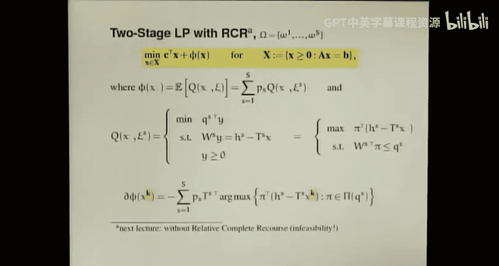

For the uncertainty， then each of the individual records functions for an another thing。

 I changed the the notation slightly before K was indicating the indices of scenarios。Now。

 since it will have iterations， its will be K。 and then S will be scenarios。

 which is not bad because it reminds us that in English， scenario starts with S。

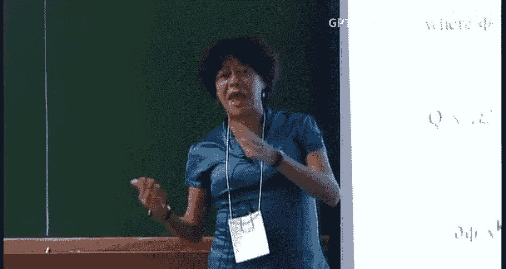

So we we have a realization of uncertainty。 So of the X that was in all these elements。

And depending on the event in our probability space， Oomega， then we have for ritualization。

 We have one linear program。 And then we suppose that for any point， X that we are。

We are considering。The constraints are feasible。 So the feasible set is not empty。 Okay。

 so we have this Well x in the， in the set capital x， we have relatively complete records today。

 For example， we have seen them when the records is simple， this。

 this is a fact that the records is complete。 It's even stronger。 it's not even relative。Okay。

 so the setting is the usual one。 We have seen this many times， except that today。

 we will start seeing algorithms so that we generate a sequence of itererate， X K。

 first phase decisions。😊，Such that we asymptotically。

 either a sub sequence or the whole sequence of iterase converses to a solution hour of our two states linear program。

So here we have the primal。And the dual formulations for the the records functionss。

 the individual ones， when we。We know that a multiplier here。

 P S or a dual solution of the dual formulation P， and it depends on X here。

 Then for each in single S， this gives a sub gradient of the individual record function with respect to the right hand size variable。

 When the we take the derivative with respect to x and the right hand side as this form。

 Then we have the general rule and minus P S。D speed。minusus the minus the S four times P S。

Is is a sub gradientient of the individual records function When we want to compute a sub gradientient for the expected records function。

 Then we have to multiply by the probabilities and sum over the scenario。

 And then we get a sub gradientient or the holds differential here。 It is written in this way。Okay。

 so for a short term a little bit the notation， we would call respective recover function fee。

And then if we have then point X K， this means that we get if we want to evaluate。

 So usually an optimization method。They from the itererate X K。

 they generate a new itererate by using information of the function we are minimizing。

Sometimes a physical set， if a physical set is not called here or here， it's rather easy。

And then also， we use information of first order like the gradient。 when the function is inable here。

 we will use the value of the function at X K and one self gradient。Okay， so it is the same spirit。

 although there are some non smooth traps that I call that require some attention to ensure conversionverness。

Okay， so now we have， then you see that if for a single。

 for a realization of uncertainty and for each X K， then we will have the solution。 the primal。

 for example， the second stage solution would depend on S and K， right？

 And they say for the dual the the multiplier P。 So will we P depending on。

 depending on S and okay K， K refers to the point at which we are evaluating the function。So， okay。

 oh I'm， I'm remembering what is in the slides because I'm advancing。 Okay。

 so the primary solution is Y S K， and the dol is P S K。😊，Okay， and what， what is it that we do。When。

When we evaluate the function at a point X K。 So this is a value of the function I wrote。

 I wrote it in the dual formulation， you can see。You see either we use this formulation。

 and then we sum over all the S。 This will be PSK at the solution。 So this is a value。

 or we can use the the primer formulation。 the Du is a little bit more convenient。Rightい。Okay。

 so we can evaluate our function。And what is good here is that the valuation of the function at the point。

 X K of the records function， the expected records function give us for free， once a gradient。

Because evaluating the record status means find in。

So solutions to the dual formulation of each individual records function， those PK。

 And if we have P SK， we can apply this transformation。 And of time， it sub gradient。 whichs we。

 if we have P， we have a gamma。 So we have just by solving the second stage problems。

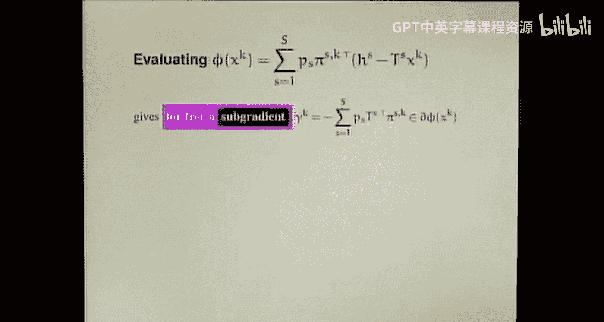

Changing the first stage variable evaluating a X K， we have。

The values function and once gradient without more effort。

 if we wanted to compute the whole sub differential would be impossible。 why。

 why impossible would be very difficult， because that would require us to find all the maximizers here。

 If the solution to the linear program is not unique， we would have to find all the solution said。

 this is too much to ask from from any solver。

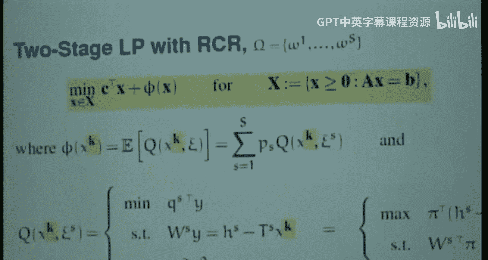

But we can， it is very reasonable to say we have only one PK or Y is the same because we will have a multiplier here。

 It will be be。The， the P， the of interest。 And then it is reasonable。

 and it is something that we do have to say we will develop a method that will define it H X K using the information available。

 That is the value of the function and one sub gradient。 no more， one sub gradient。Good。

 so we have for free a sub gradientdient。 And what can we do with if we have a convex function。

 We know that the function is the function， the expected record function p。 It is polyed， a convex。

 We have a convex function。 We have the value of a function at one point。

 and we have a sub gradientdient。 that is a slope。😊，So with that， what we can do。

 then is to build an linearization。Okay， and then。

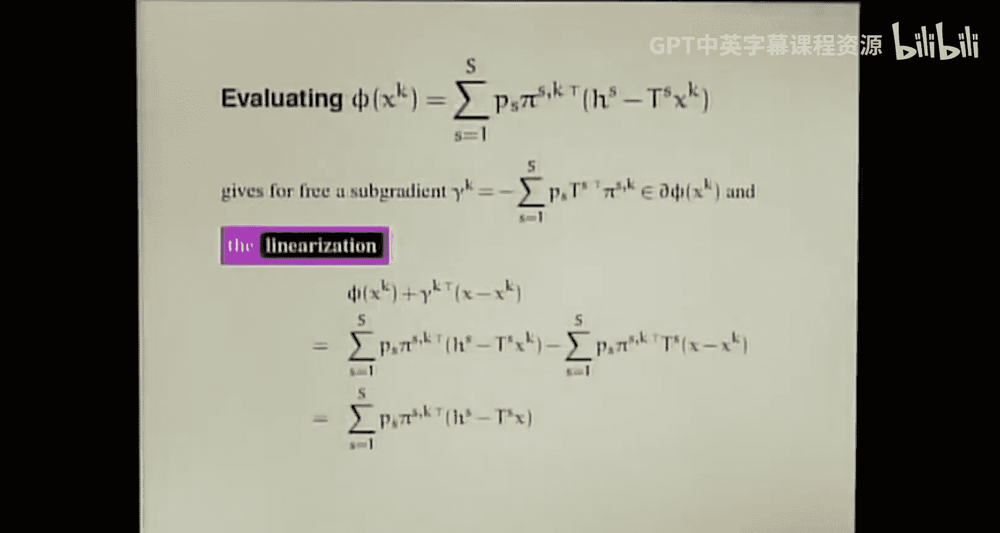

Not here。 there are calculations。 So it I was typing not wanting to write with Woodchuck。

 but maybe let's go to thes go to the blackboard。 Yes。

 let's go to the blackboard and let's go first here。

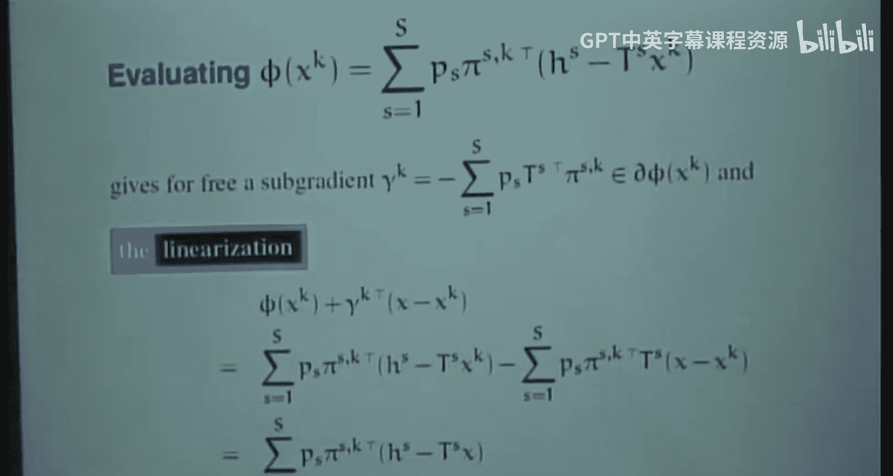

Here， look at a single record function。 We know that one of the each record function is polyheedral and complexve。

 It's the same that here we just to the， the weight sum， the weigh with the proities。So， we have。

That each records function。嗯，Q呃。How that I call them。

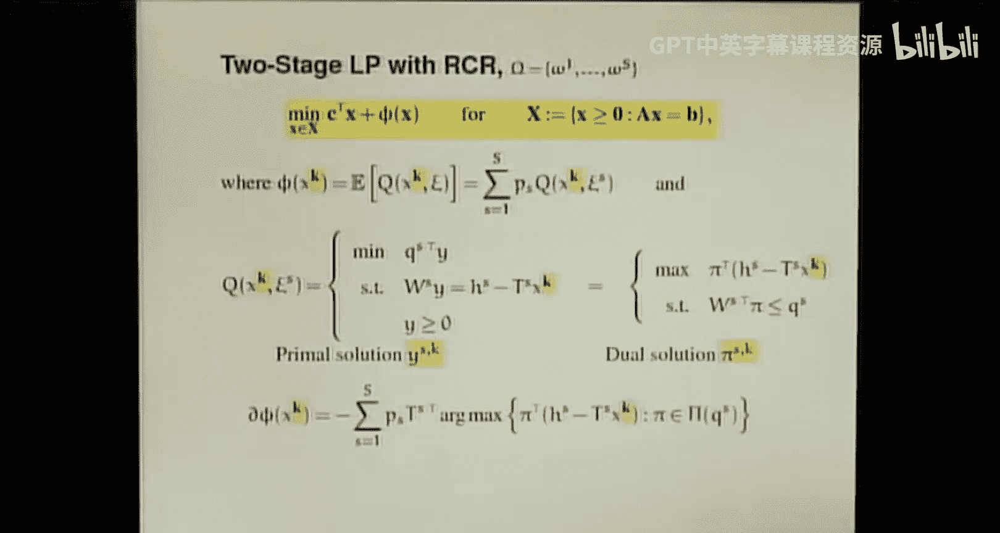

Q。Of X，k。I will。嗯。Q of x。C is。Is。诶诶。Convex。It is rather more than complex polyral with that shown。

Ply hear。Fangcheng。And if we have a function。So it is poly。There will be something like this。

So for fun， let's say that。 So this is Q。For了。A realization of uncertainty。

 Let's say that we are in a point this， this point， for example， that。Here， this is Xk。When we solve。

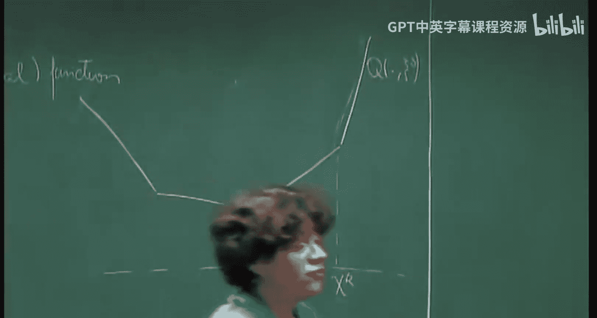

Here the this problem。 Then， for example， the dual formulation， then we get PK solution。

 And with this prim multiply by minus t transpose， we get some。

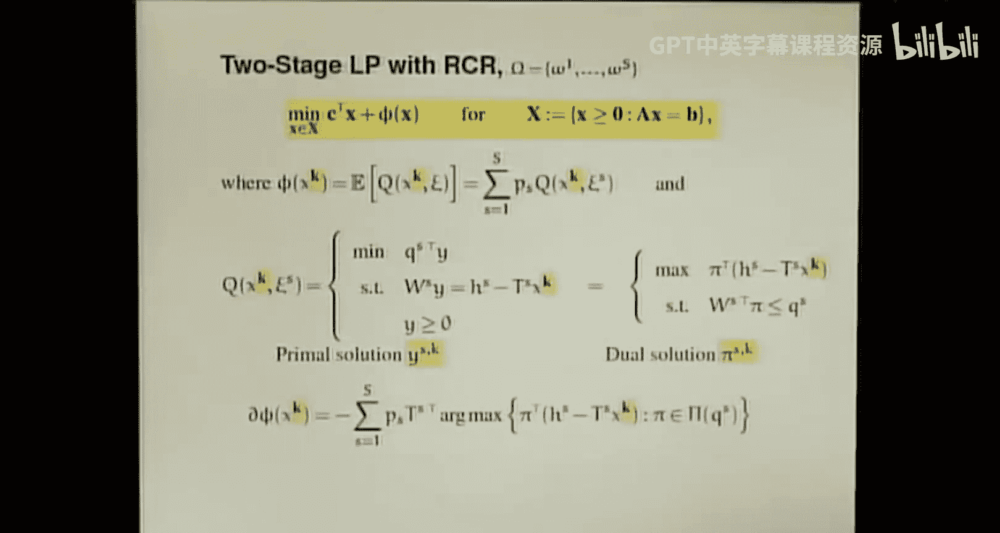

Sub gradientient。 sub gradientient is an inclination， a slope。

 And we get also the value of the function at X K。 So we get。Q。6K。Cf。

And its a gradient that can be anything between here and here。

 depends on what is it the way we have the sub differential Here is all this set of inclinations of slopes then。

We know by complexity。Because the function  Q is complex。

That this hyper plane supports from below the epigraph of the function， right。

 And this is in this is in fancy words。 And then in， in in inequality， this is a sub inequality。

 We know that。For any X。In our end。The function。Evaluate the function At any value x stays below。

The value of the function。At the point， we are evaluating。

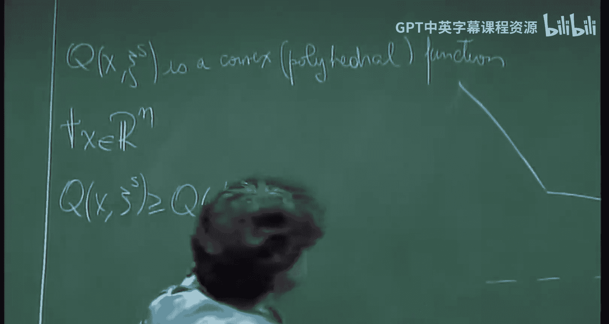

Here。Plus。How do Iこれガ。诶。Is。Gay。Transpose。X minus X K。This is the subgient inequality。

And gamma K will be one of those individual sub gradientients。Would be minus T S。

Transpose the solution that we found of the dual formulation， P， S K。Okay， so this。

 this is the slope。 and this is the the the value at X scale。And this is just by complexity。Okay。

 for the records function， the spectral records function， we will multiply by P S。

 The inequality will not change。 then， then with sum over S。 And this gives us then。That。

Phi of x is larger than the sum here will be phi of x K。Plus。Thes。Of P， S， sorry。Probability， gamma。

Is okay。Trus suppose。X minus X K。 So the same correlation calls when we make the sum of all those individual linearizations。

 Okay， and this is what。I call the gamaK in the blackboard。呃。And then now we can go back。

Here to the blackboard。To the right slide。Here， so gamma K is the。EThe。

 the weight sum of all those gamma Ks。And if we now write what is expression of gamma K and it is transpose。

 You see so that here we will have， as we will switch and we will have T S that multiplies on the right。

And。Okay， and then here I substituted the value of phi of x K。So， it is。

The wave of each individual individual objective function written in the dual formulation。

You go back。铁。So at the optimal， we have P SK， and then we make the way sum of those。

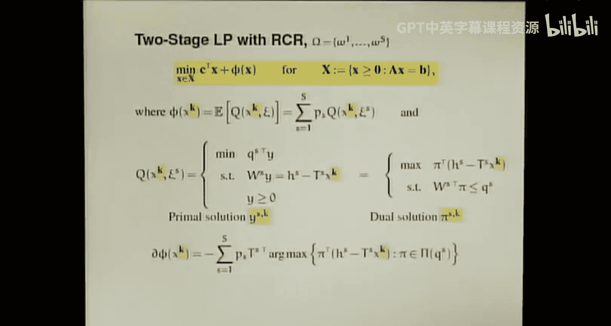

It the case functions。 This is the value of the C at X K。So， it is。

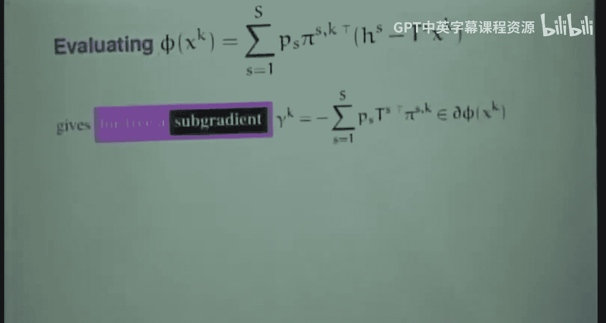

This first term。And the second term， gamma has a negative sign。 and then the transpose。

 we have obtained this formulation。 And then now it's easy to see that there is a constellation。

 the term with X K。Cons because its minus and then minus minus。 And then we get this expression。

For the linearization that。呃。Supports from below the epigraph of the function C。Okay。

 this is called a cat。Es an assign fine function。 So this is the intercept。

 and this is the slope is the the vector ga K。😊，And it is a cat that， as I said， supports from below。

 they they function at every point because the function is complex feehi。

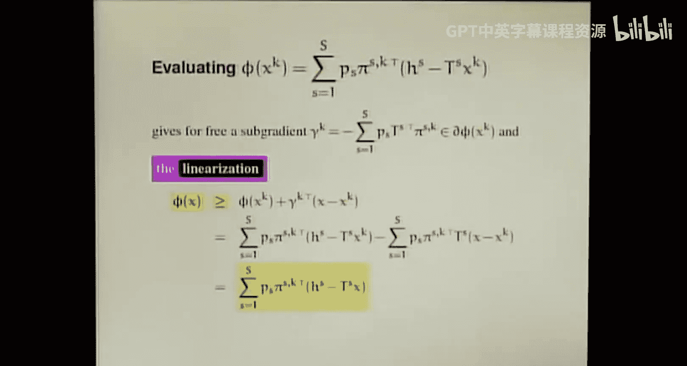

So we see that just by solving the sub the， the sub problems for each individual realization of uncertainty at each fixed given point。

 X K that will be our iterate。 then we can build this linearization， this cut。

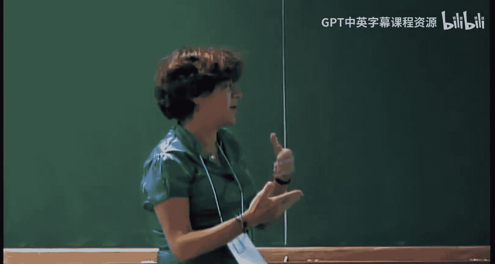

I went a lot。 I went to the end。 Okay， and this is for more than one my more class。 Okay。

 let's go back sorry。Good， so we have this linearization。 How do we use it in an algorithm， And then。

What we can see we will have a scheme that where we have our first stage problem that is of this form。

 This term is linear is very easy。 We don't have to worry much about We know how to evaluate it。

 We know what is the gradient， right， is differentable is just C。 It's a vector C。

 And this is the one that is more involve more more complicated than we will for each iterate X K。

 We will be solving each individual records function。 evaluate at X K and the reality session。

From one to S。With that， we will get the P S case。 We can build a sub it。

 and we have the value of the function， and we will return it to the these。

first stage solver the solution method that we are using to generate X K plus 1。

 And then we will make another computation and come back。 It's like a。Tens again。

 we send the ball and we get back the ball and propose ball。 send another。 make another shot。Okay。

 so this procedure then gives this an， and we will use it in an our algorithm。Now。

 to make things simpler and simpler so that we transmit first the， the main ideas。

 Then the objective function here。We will call it f of x。

 the usual name for objective functions in optimization。

 So our problem is to minimize a function where the objective function is convex and non smooth。😊。

Right， here it is the non differenti abilitiesities here， but it is complexve。

 And what we know is that each iterate， we have the right to know the value of a function and one sub gradient。

And you see this， this is an instance， stochastic， two stage stochastic linear programming where this is perfectly reasonable。

 We don't invest extra effort was we know F the value of the function a X K。 We have this gradient。

 We don't have to do anything else。Okay， so now we get into the simpler and simpler settings because I want today to to explain。

 So it was a prim。 no smooth optimization。 supposeuppose for now。

 will see in next class how to deal with that in the first stage。

 the constraints A X equal V and x larger to 0 are not present。

 we only were choosing first stage variables in the whole of our N。

 So what type of algorithms we will we can look for minimizing。😊。

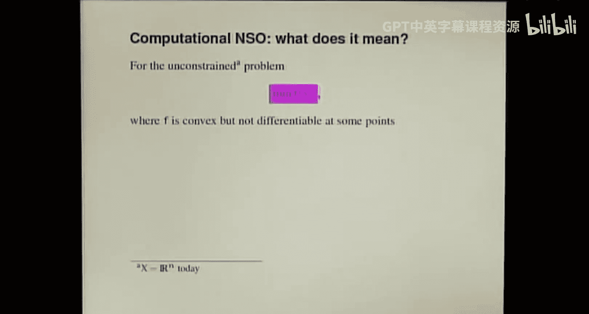

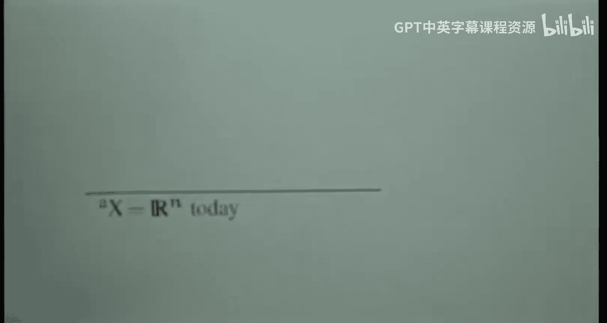

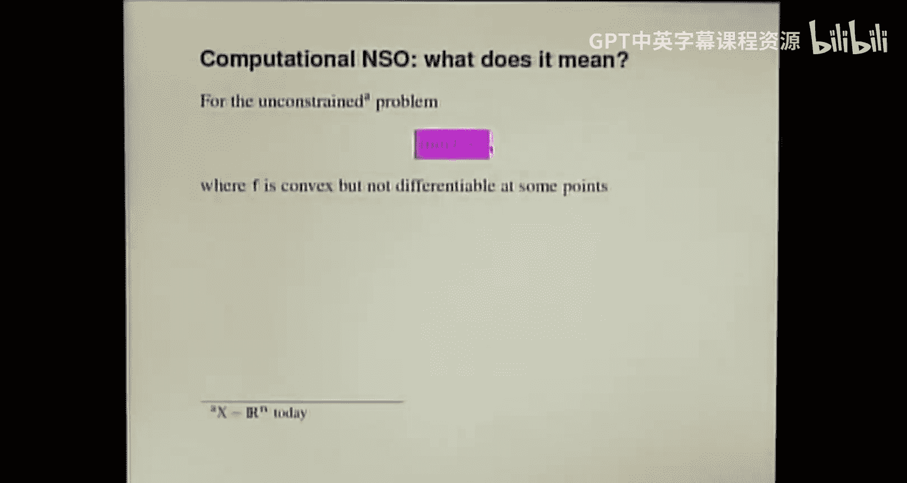

So un' constrained now， the constrained problem of minimizing a convex function that is complexvex。

 but non smooth， not differentiable。

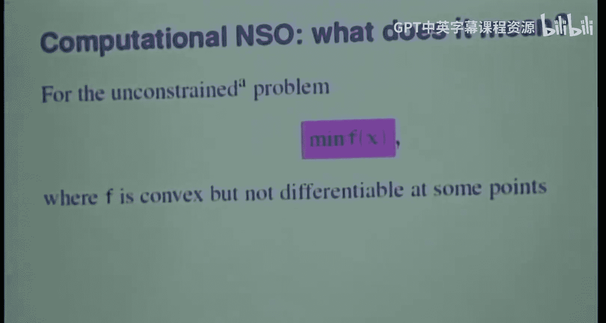

And for which， we know。The formation that gives us what is called a black box or an oracle in the jargon of the community。

 So every time with an an X， it gives us the value of the function and a sub。 And， you know。

 for the two stage schastic linear programs， what is this this black box， right， It's let's go back。

 oops， so the black box。😊，It's all this。I wrote it here like this because this， in particular。

 you can see that if we want to accelerate those calculations， we can do this in parallel。

 for example， or distribute it in some I dut know， GPU。But that is a black box。

And it is called black because usually when we develop an algorithms。

 we don't allow ourselves the right of knowing what is going on there。 The algorithm that we。

 we will develop here， we only know that we have F and a sub gradientdient。

 but not what is a particular specific form of a sub gradientdient。 And when you。When do诶。

Couse your programs。 you should keep that in mind this level of generality。

 you don't do a method for that is only useful for solving the oil production problem with two variables and two gasoline。

 It has to be general because。In the next week， when you'll have to do And the next example。

 you will have to code everything again。 You have to think with the same level of abstraction。

 and the the abstract thinking has to be this。 I know F and I know G。

Not that it has this specific form。 C transpose x plus C。 Well， let's try to do it in a。

 in a general way。Okay， so let's come back here。 So this is a black box。

 and it's oracle or it's called Oracle also or black box。So。

 and you see the name oracle also related to the fact that we don't know what gets out from there how it is the。

 the they see the， the output is produced。 But we know that what gets out is a sub gradient。

We don't know which one。 also， And this has very serious and important consequences when we compare to smooth optimization。

Okay， so we want an algorithm。 And since I have seen many times an algorithm being called things patterns being called an algorithms and not not algorithms from my perspective。

 I will now give an example of what is an algorithm in my view。 Okay， so that。

 you know what is it when you have to implement something。

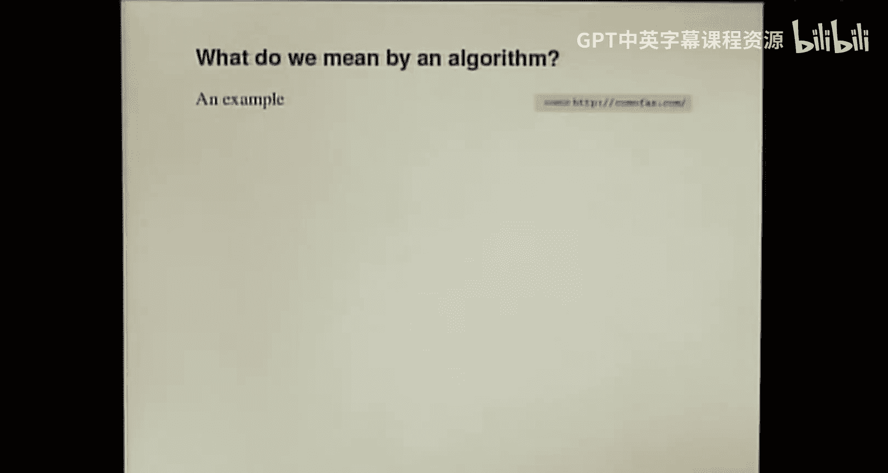

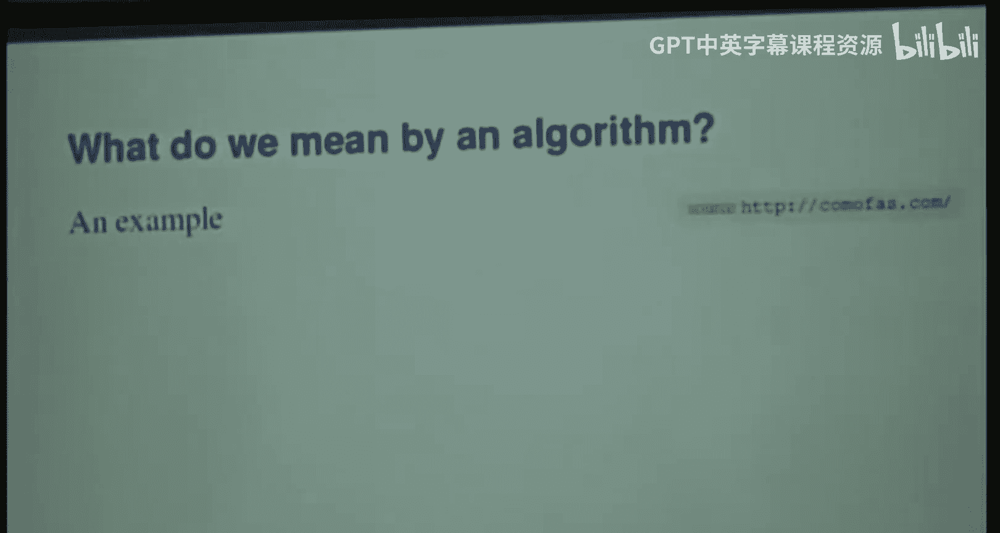

So we all know the national drink here of in Brazil。

 since we are broadcasting for the whole of Latin America。

 let's explain our our friends from not from Brazil， so Caperinia。😊，How do you do a keria。

 You use the ingredients you have here this thing for smashing the lemons， the。

 the lime that you cut， then there is sugar。 So you have。No you cut it in little pieces。

 you have your shaker， then you have cas。 It's important to make a chieria。

Then you smash the di lemons with the sugar， and then you serve it， okay。So an impulse， you see it。

 and you enjoy it。Okay， what this has to do with an algorithm。 and you will see。So。Here。

 what we did to obtain our final result that we were looking for。

 We did a sequence of steps in a certain order and combining the proper ingredients to obtain the hyperanium。

😊。

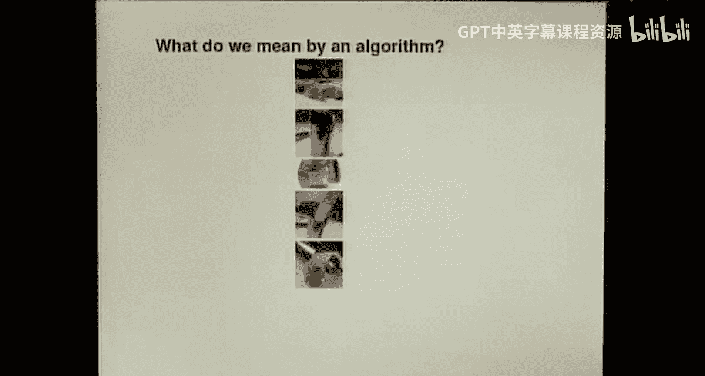

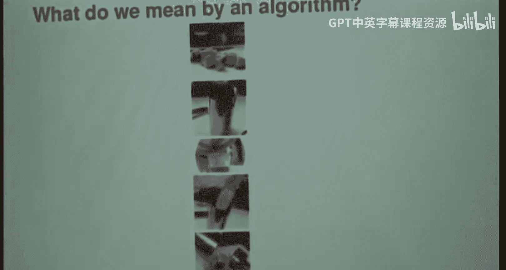

And then now all， we can repeat。Right， we can iterate。 We can iterations。😊，Okay。

So an algorithm is a sequence of steps that are repeated until satisfaction。

Satisfaction of what in in this the setting of optimization。Is a distraction of the stopping test。

 We need to know when to stop。And it's important also when with Krens。We need to know when to stop。

And as obvious as this themes， a very well known method in non smooth optimization that is the separate gradient method doesn't know when to stop。

 Okay， so today， I will， this is a message I want to transmit today and get so motivation for studying more involved。

 No smooth optimization methods。Okay， so what we want then is to develop algorithms that use the black box information and that they have reliable stopping test。

 This is very important。 And in stochastic optimization。 This is not easy Well。

 in will tell you more about that when he will explain multitage stochastic programs In two states。

 we manage。 but in multi multit is more difficult。 But we need to have a way of knowing when to stop。

 This is。Very basic。 And it has to be kept in mind when we。

 when we program when you do implement your methods， when you write your algorithms。

 before doing anything， you have to know if you want to generate an exit rate。

 So you need a stopping test。Okay， so how do we use this oracle information。

 I was just given an idea speaking of about linearization。

 We have the example of a convex smooth sanction。So we have the value of the function。

When it is on the left， this Sam is differentiable。 And on the right， there is， they are a kink。

 So it's a fine。 It's a combination of an assign and a quadratic。 And here。

 a kink is a point of an nondifferability when the， there is so there there is a sub gradientient。

 subdiffer， not。Its sub brilliant。 But here on the when we are smooth at points where the function is smooth。

 the sub differential is just a single tone， and it defines the。

Hyperplan that bounce from below our function because the function is complexvex。So， it is attention。

Then if we go to the point of non differentiability， the only one in this function。

 then we have this tangent。 we have this tangent。 We have this tangent。

 So anything between this region is possible a possible。

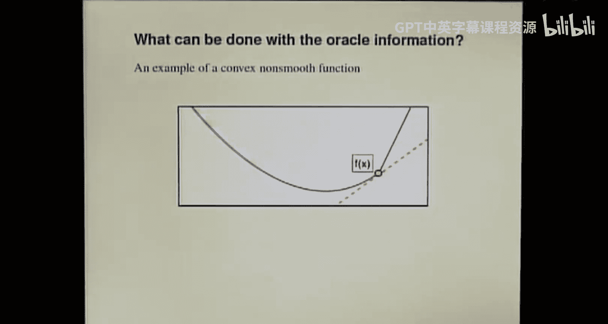

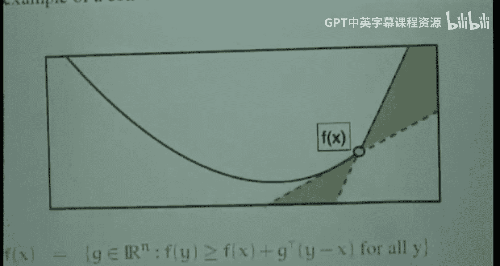

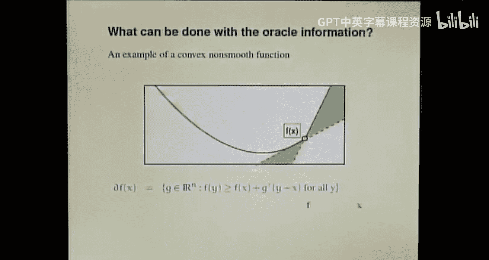

But supporting hyperplane and the slopes of this hyperplanes defined then the subgradion。 The subdi。

 Each slope is a subgradion。 This is we have already seen for many times this。

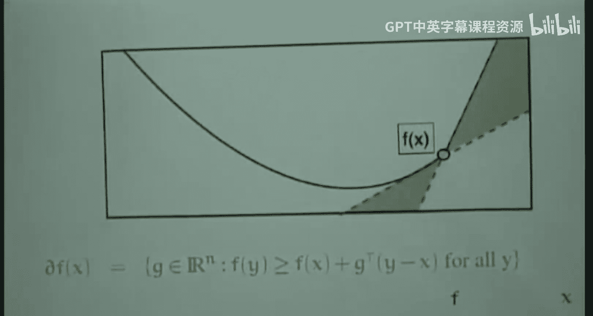

So it is the， the sub differential of the complex function is the slopes of the linearization that support F and that are tangent at the point at which we are taking the sub differential。

Okay， so we have that。 Now， first problem。We would like since first， we learn smooth optimization。

 numerical optimization， smooth。 then we have learned methods。

 We would like to apply them directly to our function and see what happens， right， it's not。

 Well what happens is that they don't work。 This is at this。

 well I'm very thankful to that because otherwise， I wouldn't have a specialty because this is my。

 my， my area of expertise。 but there are many persons， many coalition everywhere that well you。

 you have a software package that you have implemented already for something that is and then you try to apply it to a situation where the function is not smooth for example to stay linear programming。

 And then。😊。

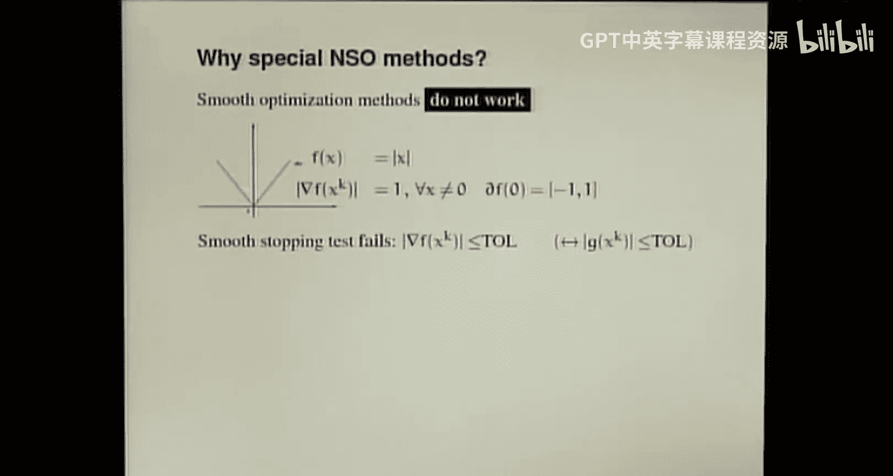

Well， let's say that it functions for a very low accuracy。 if you don't want many visits of accuracy。

 and you can go。 But if you want accuracy， you， you will not be able。 And then well。

 this is one particular example， why a particular feature， why。

Smooth optimization methods applied to a non smooth function fail。

 This is the simplest non smooth function in the world in R， the absolute value， as I had mentioned。

 it's the only point to where it is not differential。 but it the point that we are looking for。

 It is the minimum。And if we are at a point，A positive x。 then the slope here is one。

 and then the gradient is 1。 Well， the derivative on the left is -1。

 So the norm of the gradient or what would be the gradient of the derivative at any iterate that is not 0 is  one。

While at 0， there is a whole set。 It a sub differential。 It's any slope between -1 and1。

 So it is the integral -11。So now， remember that we have in the setting where we call our oracle。

 and it gives us us a gradient。 And we don't know which one it is。

Then what will happen if we are lucky enough in our iterations to fall into X K equal0。

 we will be at the optim at the point we want we want to to find。

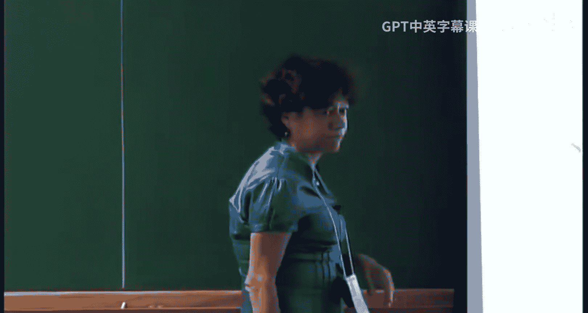

I think it's becoming a little hot。 So you can put air condition I see that。

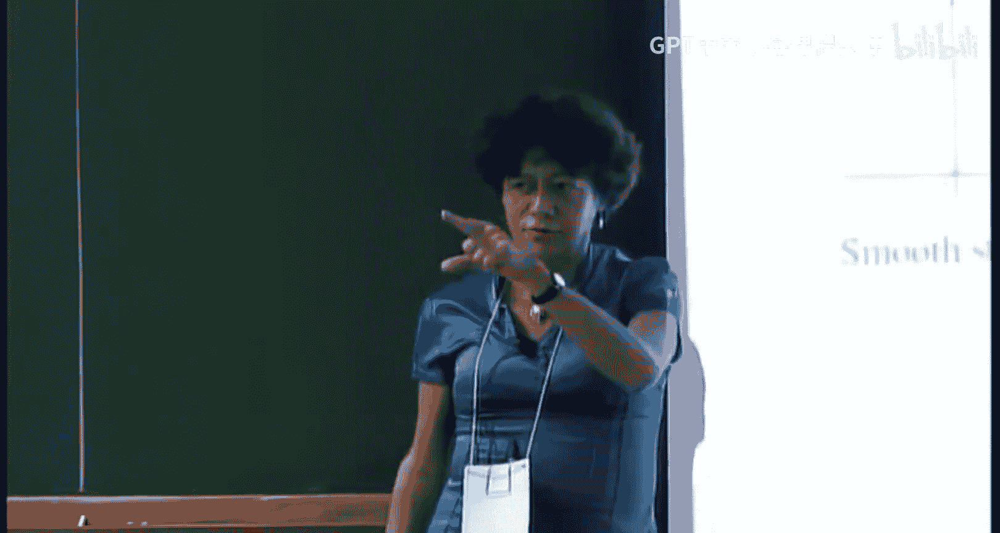

Let sorry for the interruption。 I says。 So we're turning on their conditioning again。 Okay。

 so coming back now to the sub differential。

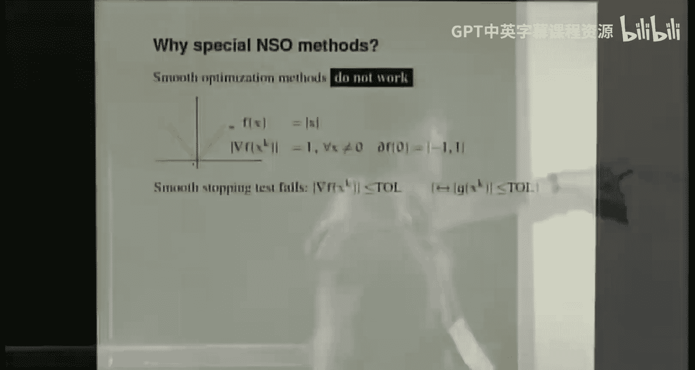

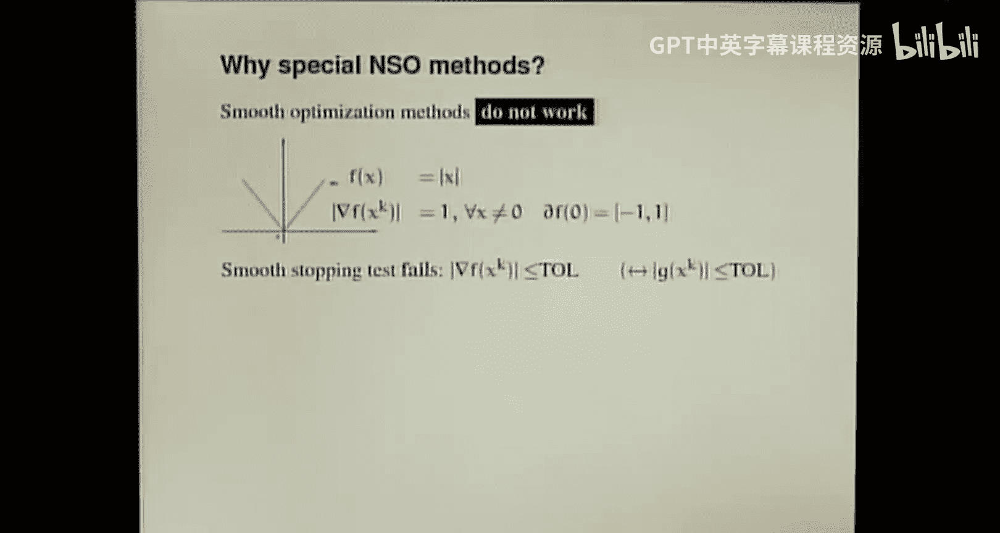

So were at 0 X K。 we found we are lucky enough that we found X K equals 0。 We call the black box。

 It gives us what it wants。 and we can very well program our oracle。😊，Do say。Our oracle can be。If。

Sk is larger than 0 than return G of X K。Equal1。诶。Sk is smaller or equal than0 return。Doo fix K。

Equal-1。 So we are fulfilling the rules。 right， it gives one sub gradient。

 But you see if we can also， we could also even say， okay。

 if it is strictly smaller than 0 gives us -1， if X K is equal to 0。Then， it outputs。Three quarters。

It is in the interval -11。 So it is， it is a total。

 totally possible black box that we may have to handle。And then what will happen。

 We will send to the oracle X K equals 0。 It will give us G of X K34。 If we have a stop it test。

 like the usual one that we use in smooth optimization。

 stop if the norm of the gradient is small enough。

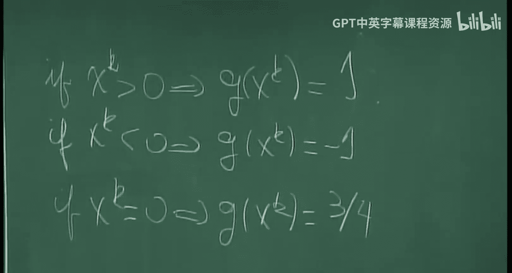

We want not stop。There is no way to， to stop using the usual test for。For smooth optimization。

 And this is a very important issue。 And it involves quite a lot of complex analysis Epsilons of differential to get resolved。

 which well。The sub gradientdient doesn't， doesn't have these answers。 Yes I know how to do。Okay。

 so here again is a waring。 we have our function。 If we are at 0。

 then we can get this or this slope as answered from the。

Is a black box or the one that we would like that have to give to be given。

 but we don't have control。 And then well， can be anything can be anything in this area。So we may。

 we may not， sorry。So， we may not。Be able to recognize that we are at an optimum and。

As with capenius， it's important to know when to stop name stop and test are fundamental。

Another issue is that。It's also often in smooth optimization that you don。

 you do some automatic differentiation or some finite L difference approximation of the derivative。

 And like this， you don't have to compute the gradient， but you just make， for example。

 at different points F at x and F X plus H and divide by by H for H sufficiently small。

 And then this approximate the gradient。This is true when the gradient， when there is a gradient。

 So there is especially if it is the function is C 1，1， C1。But if it is non differentable。

 it is not true。 There is that is discontinuity in the derivatives。

 So making an approximation for finite difference， will give you a very。

 will not give an approximation of the subdi。 So finite difference approximations file。

 that is there are the and examples in in my book。 If you want to see here as I want to give you a。

A fast review of things you have to be aware of。Similarly。

 line line searches that is also something very standard in。

 in smooth optimization have to be done with care because you may get trapped trapped at kinks。

 That means points of nondeeffinishability， you can start succeed and getting trapped in a corner and it's not the optimum。

 and you cannot get out from there。 If you don't do things in a little bit more resed way。

 taking into account and nondefinishability。Another problem is that in smooth optimization。

 the gradient， minus the direction of the gradient at the point gives the scent。

You that means you can reduce a functional value if you are at X K and you make a sufficiently small step in the direction minus the gradient。

嗯。So for that well， you should know some numerical optimization。 I don't know what you know。

 But if you don't， just believe me， minus the detection of the gradient in smooth optimization allows you to reduce the function of the value。

 at least if you do a sufficiently small step。In those most optimization， no， this doesn't happen。

 and this。We can see here in this。 There are two。Level sets graphs on the left left。

 you can see it is like a quadratic。Paraboloid。 so the level sets slices of this paraboloid here in in two variables。

 We are looking for the center for the bottom race of this value。 And this is the optimum。If we get。

 for example， here at this point， then。With way to find the direction of the gradient is you have to on the level set。

 you just look at the tangent and the perpendicular to the tangent that points outside。

 This is the gradient， minus the gradient。Take us from where we are。

 directly from where we want to go。 right， It's a direction that this level set has a functional value that is larger than these。

 this larger than these。 And this is the smallest one。 It is the minimum。

 this is this were cutting would slices， the the epigraph of， the graph of the function。😊。

So this is what happens in smooth optimization。 Now， let's think that instead of。

A very around mountain。 We have a one that is like we inverted the pyramids of Egypt， here。So。

 we are going down。A valley that has。Ofcorless。

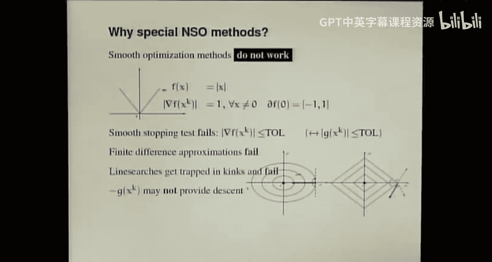

Where in the same point， we still have as minimum the0， the minimum value。Now。

 if we would play the same game there。We are at this point we can make so we make the tangent。

And then the perpendicular of the tension gives us the gradient， but it will be a sub gradient here。

 right， because， and then if we do know the attention to this。Function to this size。

Then the perpendicular the sub will be pointing here。

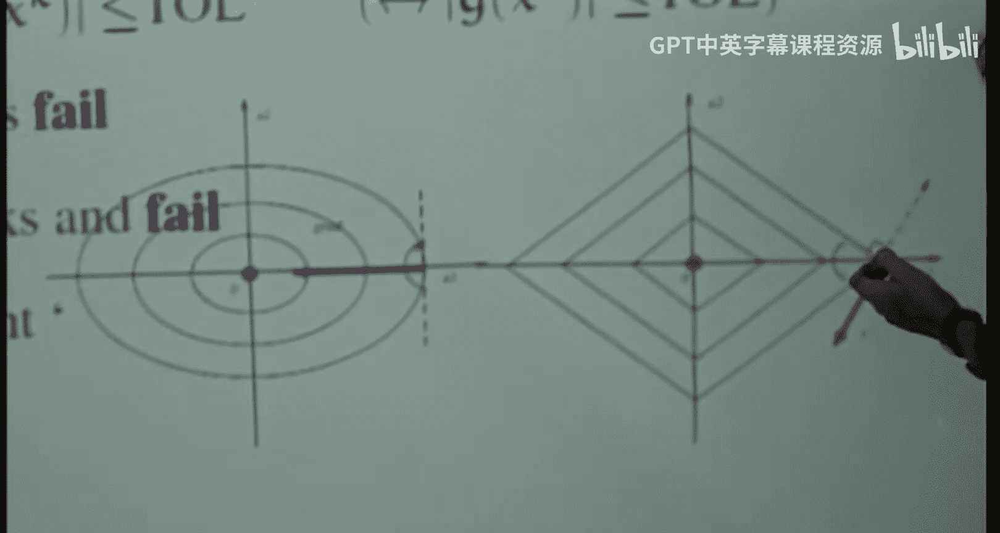

Right， so any direction。Here is a direction of a subre， the sub differential。Is all these。

These directions。Now， if we， we don't know， we don't have control on which sub gradientdient gets out from the oracon。

 Remember， so if we get out this one and we go in minus the direction of the sub gradientdient。

 you see， instead of going to smaller values of the function。That are the concentric you know。

 squares。 We will go outside。 We will increase the value of the function。

And this is something that well， as I said， doesn't happen。

 Even we cannot make any small step that will give us descent。

 We will always increase the value of the function because were on this side of the， of the level。

 So the numbers the calculations you can find in the， in the book。

 but this is very important because when we are developing an algorithm a very important property monotonity of the functional values。

 We want to minimize the function。 So we want f of X K。

To have some monotonity so that we go to where we want to go for conversions。

 Montonity is an important property here there if we do a step in the direction of the sub gradient。

 this will not happen。 And this is noted that the method will not converse。

 but it will go up and down and up and down。 and this harms the speed of con also。

So it and itss all we lose this nice property of having monotonity。Okay， so this is what we want。Now。

 suppose for a moment that we forget about our that we will keep on drinking kernis until we fall dead during death。

 And we don't have a we say， okay， I give up。 I don't want to， do， to， to to know when to stop。

What can we do with the information that is given by the oracle If I am a subgraient guy。

 then we will do the subient methods that were in the developing the cities in Kev in Ukraine。

 shore and names like this associated to that。 And what is it that we do。First step。

And this is how I would like you to program your things one step， step。

 So I don't want you to program this method， but I want choose us to have this mind that not afterwards makes pseudo algorithms easily transltable to real algorithms。

So we choose a point。 And then we start our iteration index at K。 We call the oracle。

 We go and get information。If I was to know when to stop the algorithm， I was。

 I was not giving up this goal。 then as soon as I have the record information。

 I would put here a stopping in test。 Do I refine the exit itererate or not。

I don't want to keep on working if I' am where I want to be。 But here we forgot about that。

And then so we have the oracle information， the value of the function and is subgrading。

 And what this subgrading method does is。It takes the direction of the sub gradientdient。

The norm one。Because what you care about is where it points the direction。

 And then the step that you will do， you can do it with a step size decay， a positive number。

And then so minus the direction of the gradient normalize。 you do some step size。

 You add it to your point。 And then this is an exerator。

And then you have to O equal equal plus1 and loop。六 to好 one yeah。

So it is the simplest algorithm in the world。 And this is why it is widely used。 And well。

 it gives some satisfactory answers to people who don't care about when to stop。

There are situations when you may not care about when to stop。 but while in general。

 iss not desirable。Especially if you think in this analogy with the cap。Good。O。

How good is this recipe， this I say it's an algorithm。 Is this good。Well， so my answer would be。

 this is a picture I took in Australia。Is a sign for not crossing the streets。

 And it was kind of surprising for me because its strange。 know， something is missing， right。

 It's like only the legs of the person。 Well， when when I saw it， I saw to。

 this is a subgradient methods。 The sub gradientient algorithm is like this。

 sub gradientdient methods or the algorithmic version of this road sign。Something is missing here。

 I would expect about it。 No， I don't know you， but I would have expected something more you can also put in all the the shoes otherwise。

And then what this means say is a stop interest。How do we stop， We run this algorithms forever。

 And then what we need， we need to know when to stop。 Well， we can say， let's do 10000 iterations。

 But this is not the stop in test。 This is just getting tired of making a computer work。

 So it is not the good。Tracity。And。In particular， well， this is some example。 this a smooth example。

 Again， the level sets we want to go here and what it will be doing if you plot in R2。

 So for an example in R 2， the different X case that will be generated with the sub gradientdient method。

 Well here it is differential which should have done the the level sets polygonal， for example。

 then what will happen is that we will be in this point。

 we will reduce the value function we will augment， then we will augment it will not be monoton。

 it will not be something that will take us to our minimum。

 because the direction of the sub gradientd may not provide the。

 no matter how small the step T is taken。Okay， so does this mean that this is a non this conversant algorithm。

 No， it is conversant。So the functional values。A not one of them。

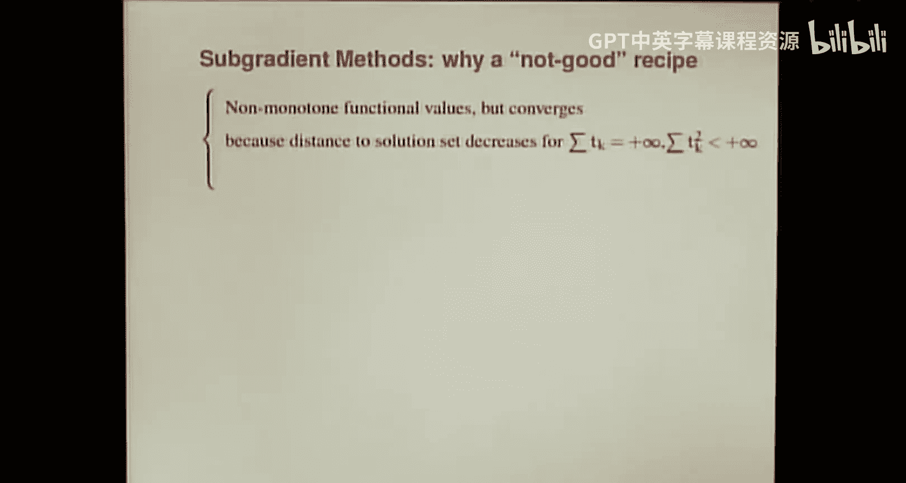

But comparisonness and。What I will just let me I will write the theorem。

And you will look for the proof in the book of mylo and Soloov。Because it's nice to read。

 and I will give you a reference。 I will just give you a hint on what is the main。

Tool for showing conversions for this type of methods。

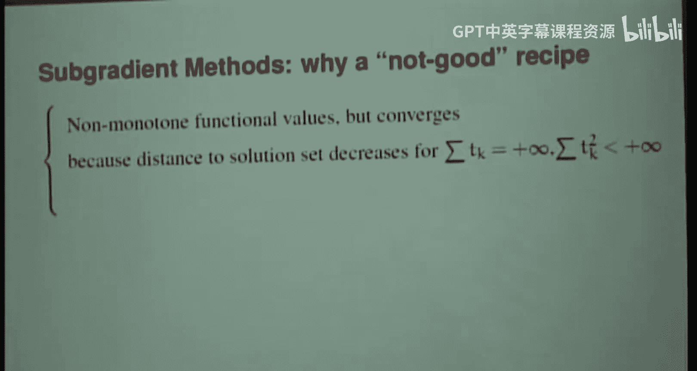

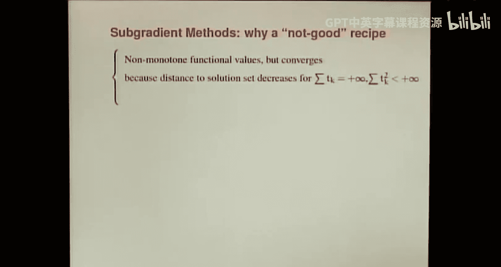

收。We have a function。From our N in R。To see， I'm not worrying about it。

 taking infinite values to be real extent here complex。Sa that。

We have an x bar that minimizes the function。For which。都。There is a solution。 This is said。

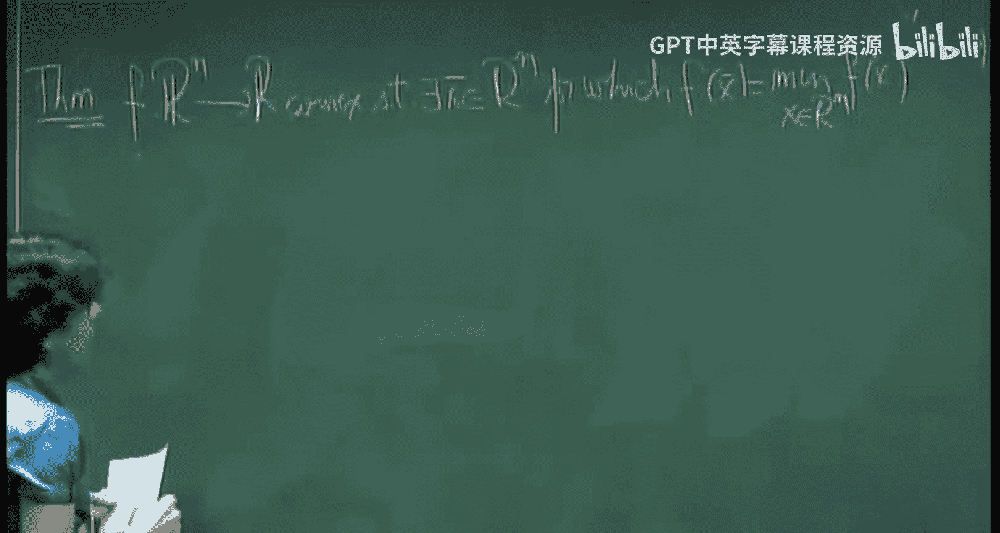

Okay， if we take steps。E satisfyatifing the rules that are here。So。It is a divergent sequence。

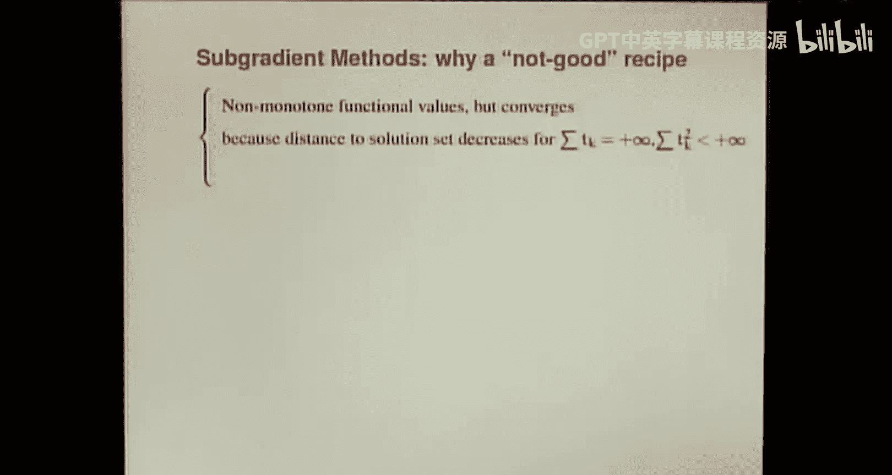

When we consider the step size， but the squares are summable。 it's convergenant。Right。

Then the method， the whole sequence coverses to a point that with functional value equal to a minimum。

 not necessarily this one can be another one。 The solution may not be unique。

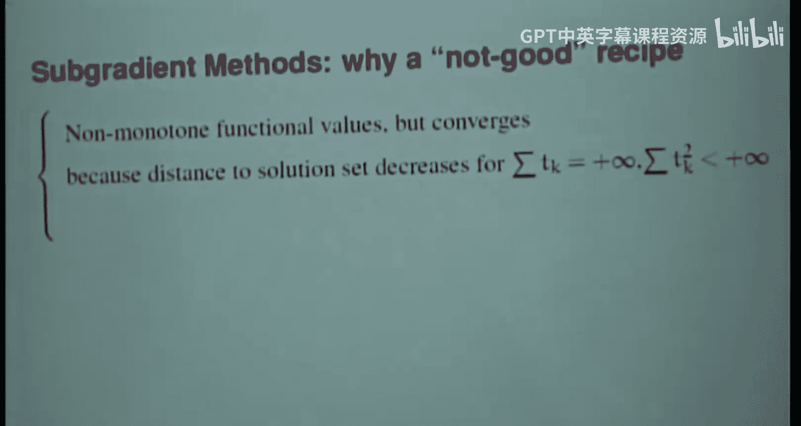

So8。It's also called the Russian called it the or the Ukrainians。

 Let's say they call it the Tis and Syria methods because of this decay K。A this not。She need。能。

The limb， not the li or the whole sequence of Xk。Is equal to this optimal value of F of x y。

And also in that X K converses to X Y， there may be another one and it。 then it converses。

 So the proof。It in。

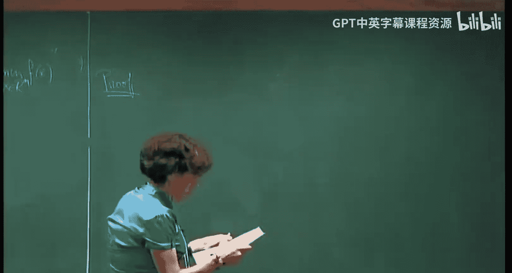

Let me say CRM 5 to1。テオレマ inテレ。5，2，1。おう？optimism is a sound。嗯，Those。你 my攞个十六度。

Oh it's my love and solo。 Let's do it， right。So how is it that the proof is done， it uses many， many。

 many times the same inequality that。Bouce the distance to the solution set from the iter rate。 So。

 and the， so you can the details you will see there。 I will just you here the， the basic tool。So。

 x K plus 1。So午呃。Take。If K plus 1 is equal to xk minus-3 k， the gradient。Not my life。And by the way。

 you see， if we are at the optimum， at an optimum， then we cannot make this division， right。

 So it's well， we may be able to do it because the the oracle didn't give us the right sub gradientdient that is0 in the sub differential。

 But well， that means that we are very optimistic Well optimistic or pesimistic。 I don't know。

 We assume that we can always make this division to have well the algorithm already。 So we have。😊。

This identity now， since we know that there is a point X bar that solves our problem。

 If we subtract to both sides X bar， then we have that。Xk。Plus 1，- x bar。

Is equal to S K minus- x bar minus this term with the gradient。Sograde topic。Okay。

 now with take norms。A square。And we develop the square here。Ca here has a vector with norm 1。

 So we have only d square for the square of this part， minus。The cross product。Day。

Let's buyide by the sc。No was ethic fix gay。Okay meの six bar。G of XK。Okay， so now。

We look at this cross product。 And we remember that G is a sub gradient。Since Jesus is a gradient。

 this means that。If of y。Is larger brand。F of X， K。Plus， the cross product， then v of xk。Y minus xk。

And this for any y in Rm， because G is a sub gradientient and the function is convex。So。

 if we evaluate that X bar。This would be f of x bar。那 me。If of x bar。

And we have said that x bar is a minimum。 So it is smaller than F of X K。So what do we have。

Is that G the cross product， G of xk。X bar minus x K。Is smaller than f of x bar。Minus f of xk。

And this is smaller or equal to0。And if you see here this cross product。

 we have minus and we have X K， minus X bar。 So it's plus x bar minus- X K。

 So it is this product here。嗯。So， in fact， what we have is that。Then， the square。

Of X K plus 1-6 bar square is smaller than the square of the error roll。

 Let's show the distance to the solution set in the previous Internet。B。Tk T K square。Go from here。

 starting to work making the telescopic exam， then。And using the assumptions on the。

On the sequence of T K， we can obtain that the this sequence is bounded。 and maybe there is a。もちゃ？

I mean， from Wellington。You are， you are not following the。 Okay， missing， sorry。He。No， it's not。

 it's not a student symbol else。 Okay， so you can see that the sequence is bounded。

 because making the telescope over K sum mean over k because this sequence is convergent。

 And then from there， you can start working using in repeated times。

 this kind of relations for this at different points。 So logo go and see the the proof。

 because it's interesting， it gives some。 it gives a way of a mechanism for proofs that is is useful is that is。

 it is not based on how the the of the distance to the optimal value is not S of its K to S of X y。

 but the iterates。 And then it the important thing is that this is a sub gradientient to be able and the function is complex。

 And then we use this relation。Okay， now。There is another result that is not in the book so that I will add here。

Is okay， the sub measures under these conditions is converant。What is the right of convergence？呃，O安。

And。Converence， rate。 How fast does it conver， Conver， right。Is sublinear。

Those who have already heard of a newton know that linear is low。Because you talk the superin well。

 this is。It's slower than slow。Is sublinear。And the， and it has to do with the the conditions on the。

That we put on the step size， which， by the way， also have some interesting。Interpretation。

 when you think in terms of a computer。Suppose。Now that we are implementing our， our method。

 And then， well， you can think one divided by K sates D K equal one divided by K satisfied these two conditions。

 that could be a step size。诶。But what happens is that if we are in in the computer。

 the computer has a finite representation。 So there is this the what is called Epsilon machine。

 the tolerance。 What is the smallest number that can be represented in a computer is， I don't know。

10 to -16， for example， right？ So this means that from some if we put K T K。

Equal one divided by K from some K on T K， we will be equal to0。 if we want to。

So to satisfy that T K is infinity， it will not be possible with step size that whose square goes to0。

 That is what is imposing this。Because from some point on。

 the finite representation in the computer will say if we want to add infinite types and number so that the sequence is divergent。

 then the number has to be larger than the epsilon of the machine。Kind of have to be know 10 to-16。

But if it is larger to 10 to -15， it will not go to 0。

 And then the sequence of the squares will not be converant。So there is。

 this is a condition that looks nice and it's convenient for making the proofs。

 It's really essential for the sometimes this condition is replaced by saying T K goes to 0 But this this the same reasoning it is okay for for right in the CR R I'm making the proof for implementation。

 We will never be able to to satisfy。 So it is， it is is problem with this kind of assumptions。 Now。

 let's prove that the conversion rate is sub linear。 And for that。

 what we will do is we will suppose that the conversionsive rate is linear。 and see what happens。

And we will get a contradiction with the conditions on the step size。

 which is what is really putting us into trouble。 So let's come here。嗯 see for you the thing。See。

Okay， so suppose the right is linear。Baly。Then， this means that。

The norm of escape error that we are making at the iteration K with respect。Do a their。

Let me say yes， that it's small at the。 K， sorry， is smaller than C。单。え？Right。

 that e data to the power case is a constant， so。They exist。A positive constant。

 And a number that is。Between C and one， right， so that this is linear comparisons。

 This is a definition of linear comparisons。Okay， so let's suppose that。

 Then let's go and see who is decay。20 K， we have that X K plus one K， is K plus 1。

Is equal to xk minus the step size。They normalize direction of the subgraular。Then X。

 K minus the x plus1 is equal to T K。 this normalized direction。 And that since this has norm1。

 this means that T K。Is the norm of。Xk， minus X， K。宣述完。Right。This is， because this。It has no one。

Okay， so then let's add an subtract X bar。Go on to use states。

Then the triangular inequality gives us that。DK is smaller than the sum of those two consecutive errors。

If we have linear rate of coence， then here this is smaller than C theta to the K plus C theta to K plus 1。

嗯。Data is smaller than one。呃，So对 say。A smaller than2 right or equal smaller than 2 c。Did的。

To the by work。Right。Because data is smaller than one。And now with some。Overk。 if I sum overk this。

That means that the sum of the step sizes。It's smaller than 2 C。Thisum。O。买。对的。

Which then that the infinity。 And this is a conversant C series because it's smaller than one。嗯。

So that means that this is finite it。Back we are assuming that the sequence of step sizeive is divergent。

So， this is a contradiction。And the contradiction comes from superhousing that。

The right of con is linear。 They cannot be linear。 cannot be super linear is sub linear。 It is low。呃。

And it is the， the the problem here， you see， is that。You are， we are a。

For having a linear conversion rate， we would need the step sizes to go to 0。

 but we need the step sizes。To be bounded away from0， to make a div sequence。

Because of this this first conditionation， this is essential here。

So some gradients have some weaknesses， weaknesses， says well， like me speak in English1。

 So what happens if it is where in a contrain case， How what do we do with a escape plus one。

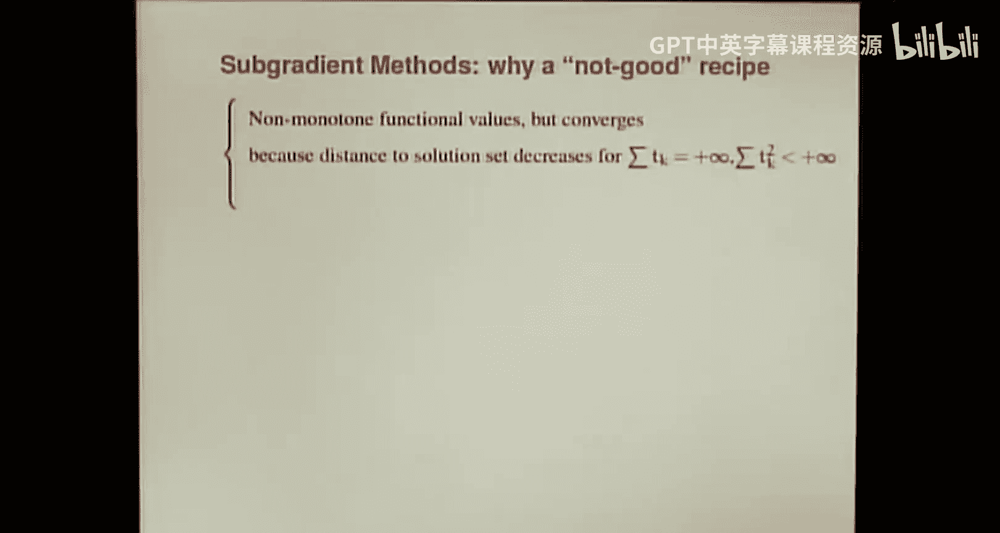

Well， if we have a con set。 So now we're minimizing。

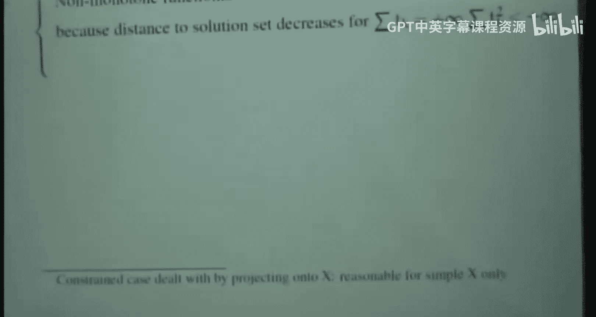

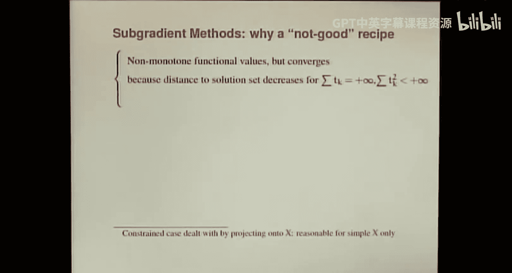

F of x for x in the set capital x。Then the answer of sub gradient method is we project。So we define。

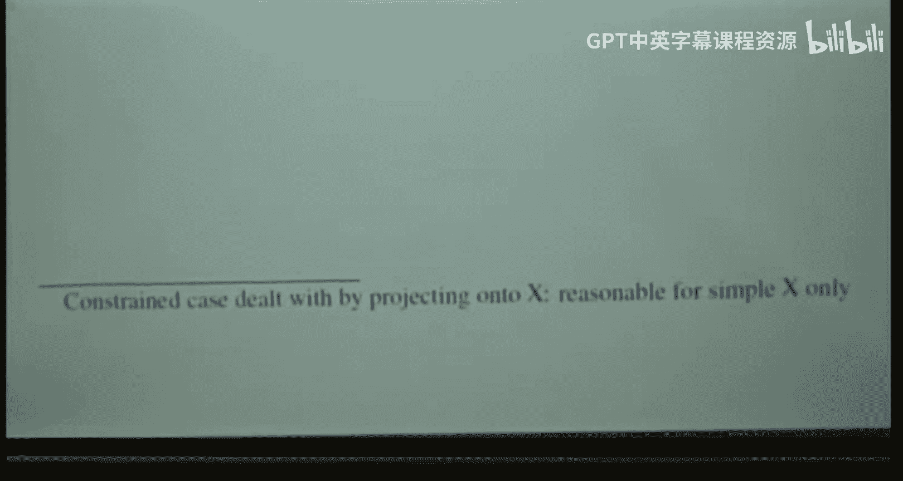

Ss K plus 1 half。的 you说。And then， xk plus  one。Will be the projection。On x。Oh。X K plus 1 half。

So this is a projector subing myself。Now， somebody can tell me if this is something sound and easy。

What do I have to do here to project。How do I project？The projection is we minimize the norm， right。

Or the square norm。So this is an optimization problem。嗯，我敢波。Of x。K plus1 minus x， my shortest。

Very ugly written there。Minus x。Square4 x in x。嗯。This is not an easy problem。 Well。

 this is a quadratic objective。 If this set is polyheedron， well。

 it would be a quadratic programming problem。So let's say it's acceptable。 If x， it's a box。

 it's easy because we just project into the interval a component wise to the extremes of the interval。

 So that is easy。 But if x its a little bit more complicated。 this step， it takes a lot of effort。

Epeially considering that we progress very slowly。So。E there is There are projects of random methods。

 but we have we will not be fast。 And more， we still don't know how to stop。

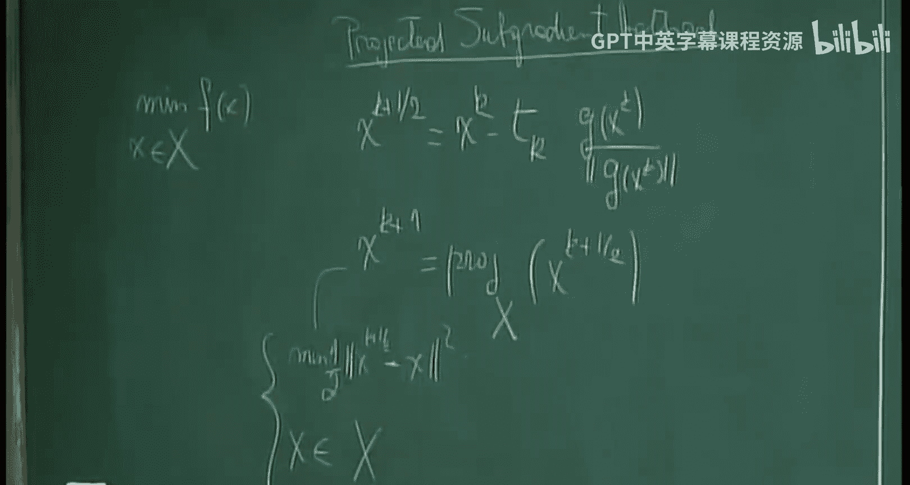

Ok haven't solved this this question。 this matter。Okay， so relax a stopping in test。Today。

 you have to get this message out from here。 You know， sub message doesn't have a stopping test。

 Okay， this is very important。

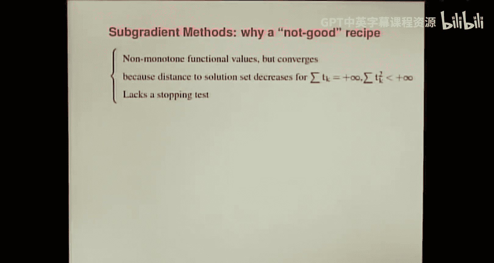

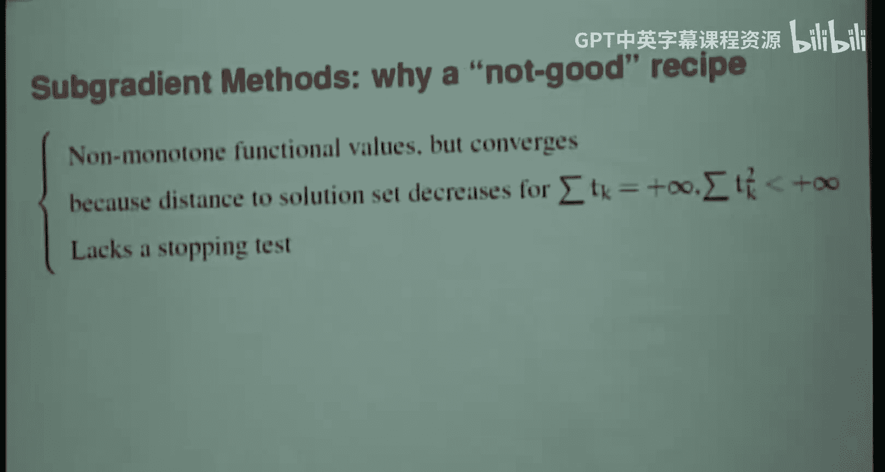

Okay。And one important issue is that you remember， we said that。The black box gives us information。

 and we use it to generate the next iterate。按。Our next it rate in sub gradient is using。

These are gradient methods。And we forgot about the value of the function。 We have this information。

 we have not used it。So， well， this is a pity because we we have there things。

 And the method decided， well， I will not use it。 So so it's not using in all the available information。

 We are not using the functional value。And in some sense， you can think that it like within。So。

Or it is it is not， this does not mean that they are useless There algorithm methods。

 but they are very simple。 And with of implementation。

 And when something is easy to implement optimization is very moral。

 That means that there is something that is not very good about the thing that you have to work a little more if you want something more reliable。

 And well， you see here， we have， we make the effort to make the calculation of F in principle the black box here。

 we use only a piece of information。 Then we have our， we don't know when to stop。

 We have our contradictory。Assumptions on the step size when we think of how to implement it in a computer。

 So there are deficiencies。 let's say， since I cannot say weaknesses impural。

 So there is a deficiency。Oh。For in some situations， it's useful for us， it will not be very useful。

 but everybody should know about the grade method。 So now you know。So。If we now say， he。

 wait a minute， I want to know when to stop。 I have information I'm not using。 What can I do。

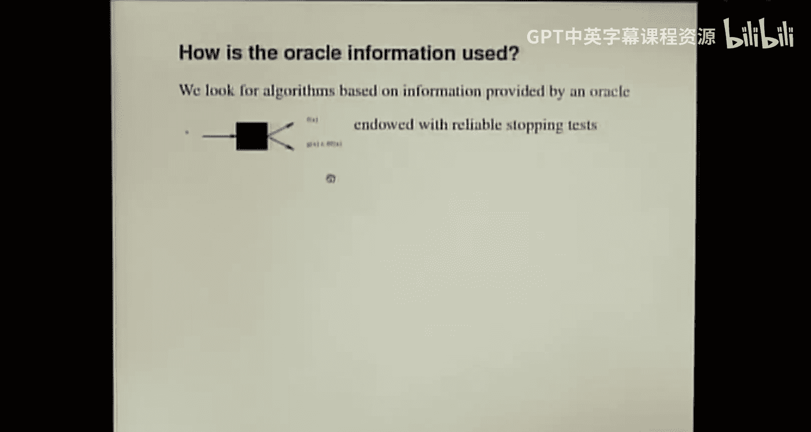

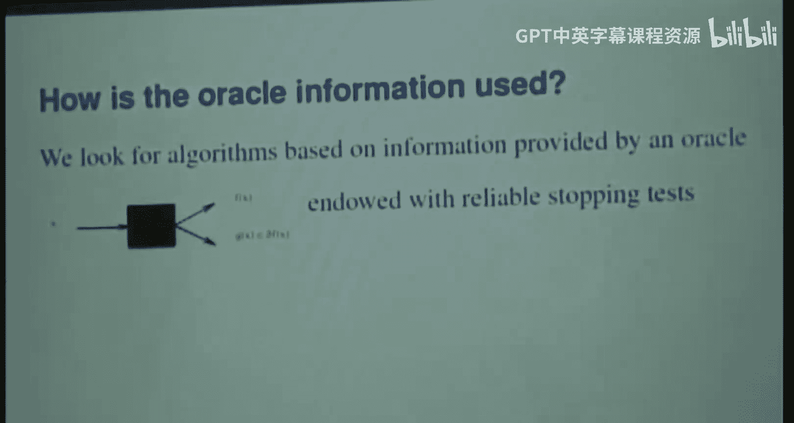

Okay， this is the next family of methods。 And so you remember that with the。

With the black box information， we can design hyperplans。Another thing that I didn't say。

 but you should be aware of is that， well， here it's very nice。

 we could decide make a drawing of a function that our function F that we are trying to optimize in the two states a linear program。

 We don't know what is a function， right， We know it is C transpose plus c of x。

 And we don't know an analytic expression for the trans function。

 We cannot say it's we don't know the vertices of the polyhedron where it is capital P of Q of Q S moreover。

 And then the average。 So this is a drawing of a function that we don't know in our setting。😊。

So the optimization method only knows。At its X， K， the value of the function and the slope。Then here。

 the value of the function and this law and so on。This is only formation that we have to minimize the function。

So what we can do。Then is to， we call a X K。 We get this a fine hyperplane。

 Then we call here a X K plus one。 we get another hyperplane。 And then this function。

 the maximum of those two hyperplanes that we know。

 because it depends on the information of the oracle， A X K and S K plus one。

 And this will be a model for the function that we want to minimize and this model we will be improving it along it ratio And because the function is convex。

😊，We be。Would be more and more hyper place and the maximum。

 And then we would be approaching from below with a model。 that we call M here。There。

The function that we want to optimize to minimize。 And then instead of minimizing the function。

 we will mini the model。 at each iterate。Okay， so here then sorry。

 should have K forgot to change it at the K。 Now it is convenient because it gets to， to to。

 too large to call the function value at X， K， F K。 or if I hear an the gradient G K。

 And then we have the linearization。 They are on the right。We do。

 we repeat this process along iterations， and we take the maximum of all those fine pieces。

And this is the model。I， I wonder if I have somewhere drawing， by the way， let me see。

And this is a model。There are different models that we can do。 This is one。

 and I will talk an express about other models。嗯。But for now， this is a simple。

 It's called a cutting plane model。 because this tangent here is called the can be also we call supporting hyperplan。

 It's a cutting plane because it cuts the function there at the point where we are calling the。でオ。

Okay， so we don't have F。 We want to minimize it。 Then we minimize its model。

And this model gives us an exerator。This is the idea。

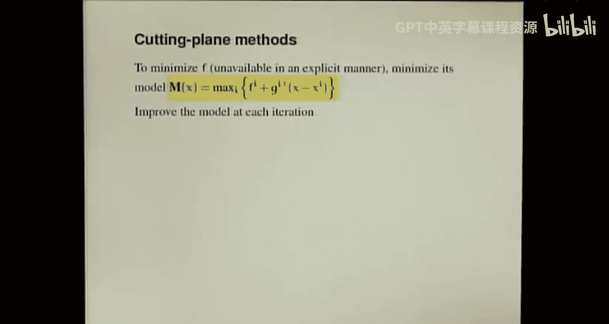

That has different names， depending from which area you come， so。呃。

HaLet me I let me look if I have the drawing。 It's not possible Okay， okay， don't。

 don't look at the bottom。 Let's look at the drawing Here。 We have our function。😊。

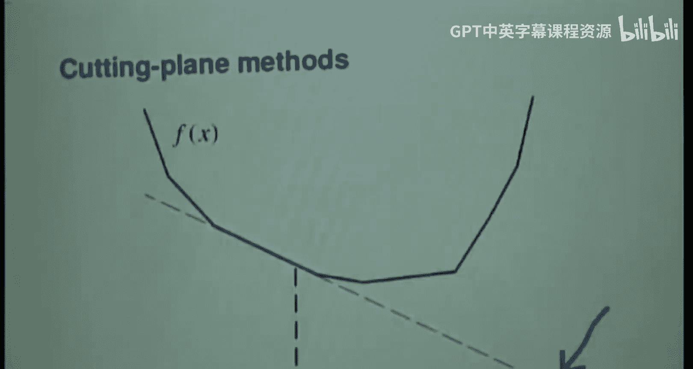

We have our。I find hyperplane。 Then we minimize this model。 that is very simple。 This model。

 And then suppose that it was minimized here。 Then we have the next itererate。 We call the oracle。

 we get this other hyperplane or linearization。 And then now our model becomes this C D。

The maximum of those two functions。Right， this is the red one。 This is the model at iteration 2。

 Then we minimize this model。 and then we get the next itererate。 We come here。 We call the oracle。

 We get the hyperplane。 And then this is the hyperplane。 And you see the next model will be this。😊。

This and these， we get closer and closer to the graph of a function。 Then again， now we have then。

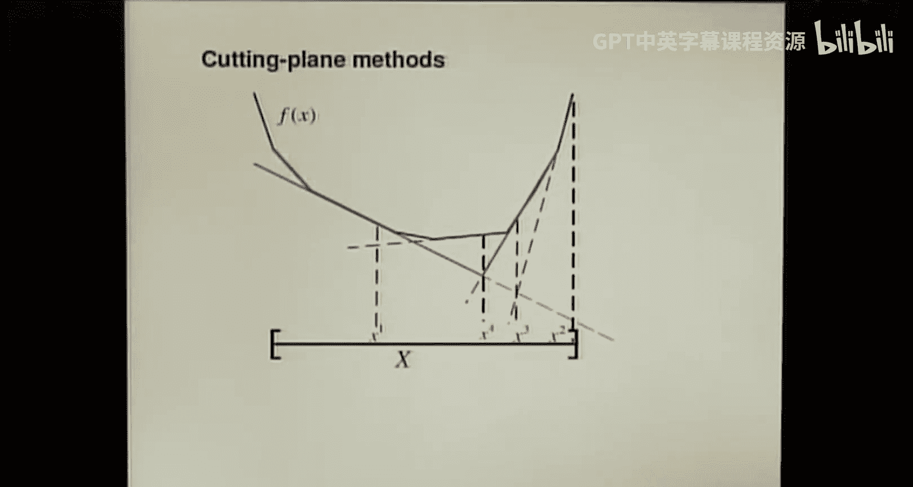

This model here。We minimize。 We get X X 4， we。Have a very good hyper we are near the optimum here。

 not yet there because mostly we somewhere here。 it's a little bit lower than here。

 And then we get a very horizontal linearization， because it's almost optimal of the here。

 it is almost0 the the slope。 Then now look how tight it will be the model with respect to a function。

 especially in the region of interest here with O。😊，That here we will be。

 we are looking for the minimum。 and， and it's here， and it will be a very good model。Okay。

 so we have this minimum。 And then now， well， we managed to reproduce。

All of our function with those linearizations in five iterations， we convertverse here to the。

 to the solution。 Let me see yeah， because now we willing to include this line。

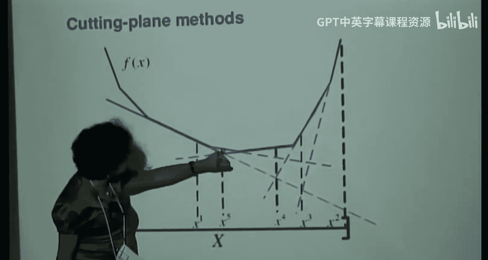

So this happens because we， so we manage to the model coincidecise with the function。

 because the model， the function is polyedral is piecewise linear。

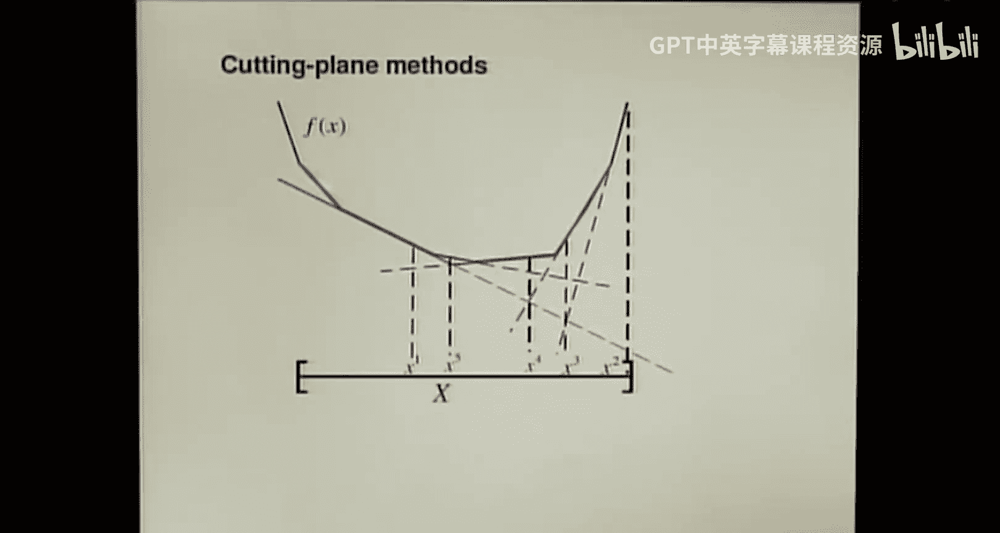

Is defined。 There are no rounds part here。 You see， is so the maximum。

 the function itself is a maximum of a fine functions。

 and the model is a maximum of a fine functions。 And eventually， it coincides with the function。

This means that these type of methods for polyhedral functions will help finite termination that were not even asymptotically converses to the to the。

 to a solution， but there will be an iteration sufficiently large。Cap K。

 such were that at least in the region of interest where we where the a minimum， the minimum is。

 a minimum is， then we will have reproduce our function。

Because the function is polyheed is the function had the round parts。Here。

 then it would not be possible with a finite number of a fine pieces to make the function and the model concive。

 And then the converg is asymptotic。So these methods are called cut in plain methods when it comes to non smooth optimization when it is and they were developed more or less independently by。

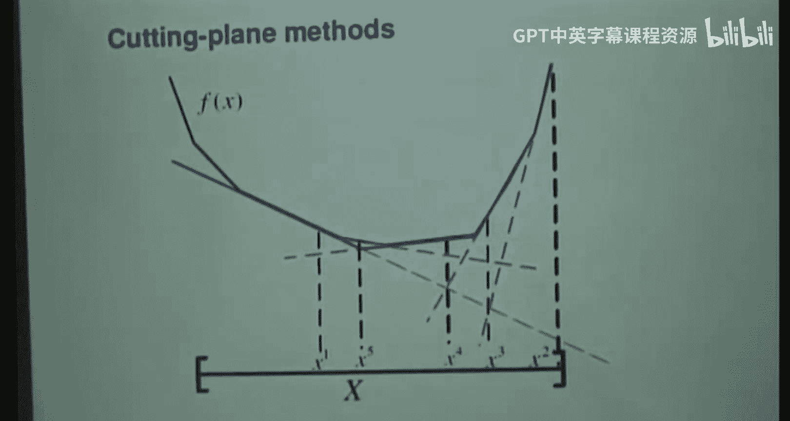

me。 I got right here。In the 60s， all those methods arise arose in the 60s in the。

So theres some guidance， too。And those是。In the West， let's say。 So clearly。权利。Un'mgo saying。

In the United States around。60。M say，6070。I think67 something this。 I don't remember。

This for non smooth optimization， like I'm writing them here。

In the context of stochastic linear programming and in the way the So for non smooth optimization。

 that means that the function F is convex。For the context of okay， I little the book here。

 if complex。That's very consistent。In stochastic linear programming。The function F is hit。

Because it has this term that involves the expected record function， the function fee。

And this is was developed by vans like。And what。And by the way。

 Roger Wes will be given in a minior here in the last 20s of Z。So we？I think it was more or less 67。

And this is called the L shape method。It is that。Better applied。

To the particular setting where we have this finite represent F is a polyhedral function。

 and it is the sum of records functions。 And where the records function we can is linear。

 Its a caps from these linear formulation that can be primal or the one so。EAnd in this case。

 then we have finite determination。So this method， it is better than the method of sub gradients。

 but it is also more complicated。 let's go and see a little backward was what is the。嗯，哼哼。Let me see。

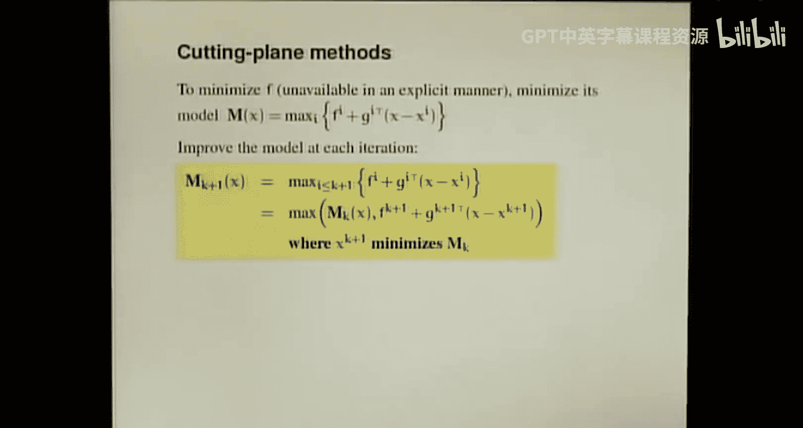

It's okay。 No， so true。 I called the iteration。 It was K。

 but the previous one were I So it took it was， was right， was consistently at the iteration K。

 we have the maximum of all the fine linear of all the linearizations that we define that until the iteration K that are of this form。

At the successive its X， K X， X， I。The next model will be the maximum of one more of all the cards。

 all the linearizations。 So it will go until K plus one。

 That means that is the maximum between the previous one。

The previous model that was going until K and this new cat or linearization。嗯。

And this means that the new model is larger than the previous one。

 And that's why we see this that we are getting closer and closer at the to the solution。

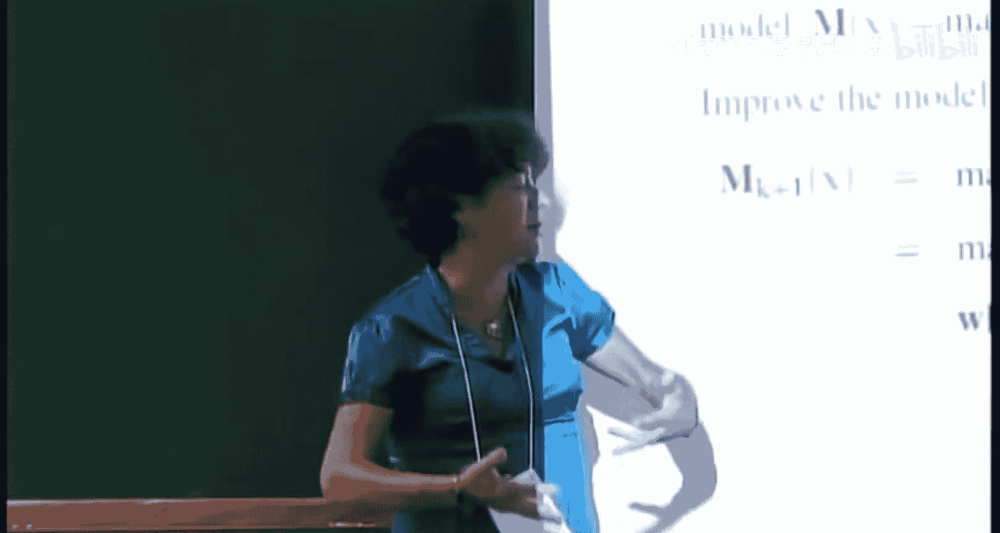

Now， let's see， what does it take to find x K plus 1。It is in subresence。

 It was just a simple calculation。 to the define the next itererate。 Now， things are not as easy。

It's more work。Melt it works because it is a better method。It is not the best of at all。

 but it's already on the way。So if we define x k plus 1。Minims。呃。Mk of x。That is the maximum。Overall。

Our linear itererate plus iter of the linearizations。X minus X， I。

So our problem is minimize a maximum， right。So I did the right well So we are solving this problem minimize。

The maximum。Minimize for x in R N。 Let's put for now。Of F I。Plus， G， I transspose。X minus X I。

那你 go对贴。Equal 1 until K。Okay， now we use a。We will， as one scanner variable are can call it。

 and that will represent the maximum。 This is the same。Thenhan minimizing。R。For R in R。

 that's why the name is R X in R N。subjectubject 2。2。Larer than all linearizations。So I没 doing one。

Okay。So now look。At this problem。So to find X K plus 1， we need to solve this problem。

 and the component X of this optimization problem will give us then the next iterate。

If we look at this problem as a function then of R and x。We have an objective。 that is linear。On R。

 mis linear on the variable。And the constraints。You see this is linear here is linear。

 so we have a linear programming in problem。This is an LP。So al variety of those al variety of those。

On the variable。R x， so in R N plus 1。Now。Okay， so we have really to do more work before we decide say X K plus1 is X K minus T K the gradient normalize。

 Now we have to solve a linear programming problem。え。So it is more involved。

 but it is better it has weather properties。 note also that if we。EIn next iteration。

 then well have one more constraint。So this method where the cost is easy。

 but the contrain set becomes。Lar and larger and larger。

 a matrix that has more and more more constraints。 And for ensuring convergence。

 we cannot throw constraints。 And this is the weakness and the deficiency of this type of methods。

Okay， so let me see what comes next。 I think it's a good time to stop。 Yeah， go， okay。

 this is instead of what we would like is to minimize F F， we don't have。 So we would like to find。

A minimum I didn't put equal I mean because the minimum can be set more than one point。

 And then so we in this set， we find one point。 And this is what we are looking for。

 A solution of our problem。And instead of doing that。

 we will replace F by its model that becomes better and better because we have and we get more and more tight the model with respect to the function。

 and we minimize the model。 And this we can do because we just need to solve a linear programming problem。

 It is more effort done for the subdion， but it something that is perfectly reasonable。

 as part of an algorithm in one iteration of one linear program。 It's okay。

 And this gives us an next iterate。 we call the oracle。 Then we have the linearization。

 We we improve the model and we continue。😊，If we were to minimizing capital X。

 what is the effort that we have to do if we have now a constrain problem。I the x is a polyheedro。

Then here we will other the， the constraints， A X。Equal B and x larger equal to 0。

This will not change the nature。 It is still a linear programming problem。

This will not change the nature of the problem that we have to solve。 So it's okay。

 We can handle it very easily。 We can handle the constrain set。Capital x in our。

 if it is a polyheedral in our。In the stochastic program is set very easily。

 It's not like before that we had to solve another an optimization problem。 Now。

 we just introduce constraints on X。That are polyedral。

 So it it is still an engineer programming problem。Oh， this is good。Okay， so well， okay。

 let's stop here。 And then next class， we will continue with this methods now。

 specifically for the the setting of stochastic linear programming in two states。

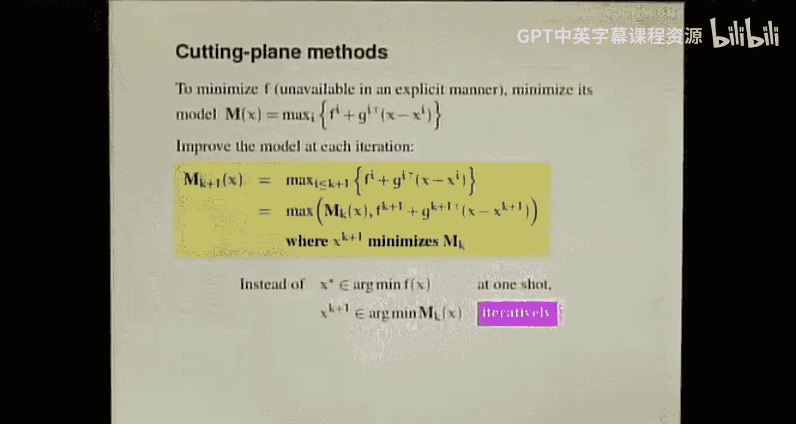

Okay， thank you。 I there a questions somewhere no， I don't know。 Let me see。

