# 随机规划基础课程：第12讲：两阶段方法的实现问题 🎯

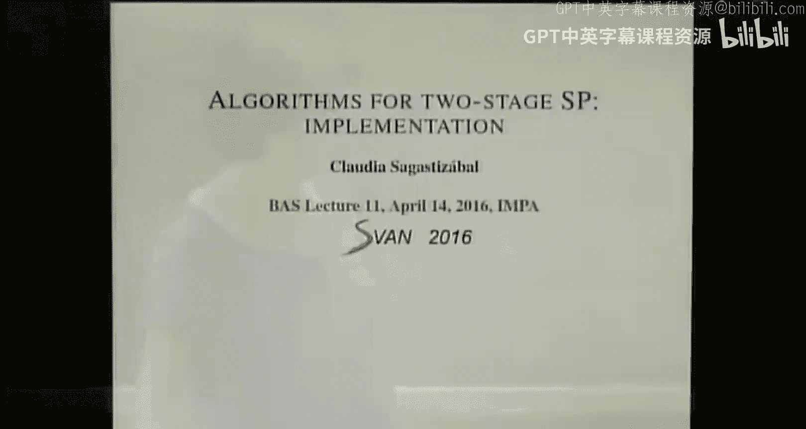

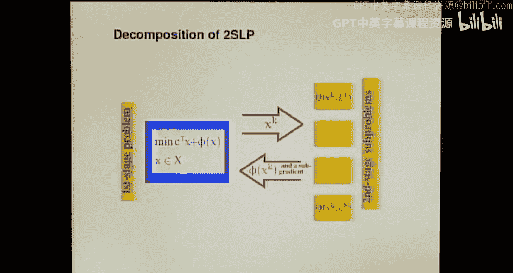

在本节课中，我们将学习两阶段随机规划方法（特别是L形方法）的实现细节。我们将回顾核心概念，探讨多割线变体，并介绍一个具体的应用案例——现金匹配问题。


## 回顾两阶段模型与分解方法

上一节我们介绍了随机规划的基本框架，本节中我们来看看如何具体实现两阶段方法。

我们考虑带有补偿的两阶段模型，其中第一阶段的决策变量为 **x**，第二阶段的决策变量为 **y_s** 对应每个场景 **s**。我们需要解决如下形式的问题：

```
minimize c^T x + E[Q(x, ξ)]
subject to x ∈ X
```

其中，**Q(x, ξ)** 是第二阶段的补偿函数。即使我们使用场景表示不确定性，这本质上也是一个大型线性规划问题。当场景数量很多时，直接求解会变得非常困难。

因此，实践中的关键在于使用分解方法，将一个大问题的求解替换为一系列更小子问题的连续求解。这种分解只有在子问题比原问题容易得多时才有意义。

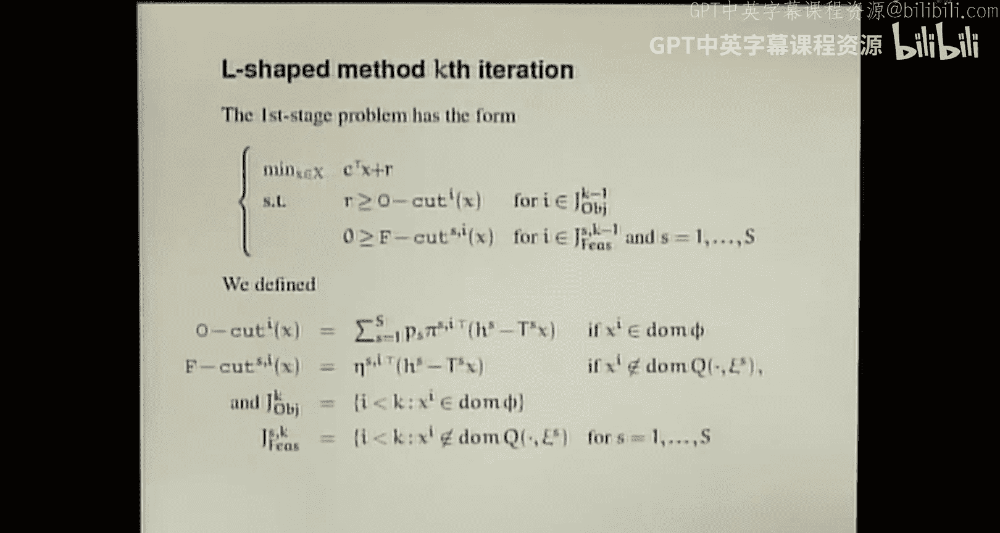

## 补偿函数与割平面模型

在补偿函数 **Q(x)** 无法解析表达，只能通过“黑箱”获取其值和次梯度信息的情况下，L形方法使用一个模型来近似这个函数。这个模型就是**割平面模型**。

我们用一个额外的标量变量 **θ** 来表示这个模型，它是过去所有最优性割的最大值：

```
θ ≥ α_i + β_i^T (x - x_i)   for i ∈ I
```

其中，**I** 是过去所有迭代的集合，在这些迭代中 **x_i** 位于补偿函数 **Q** 的定义域内。系数 **α_i** 和 **β_i** 通过对每个场景的第二阶段子问题求解对偶问题得到。


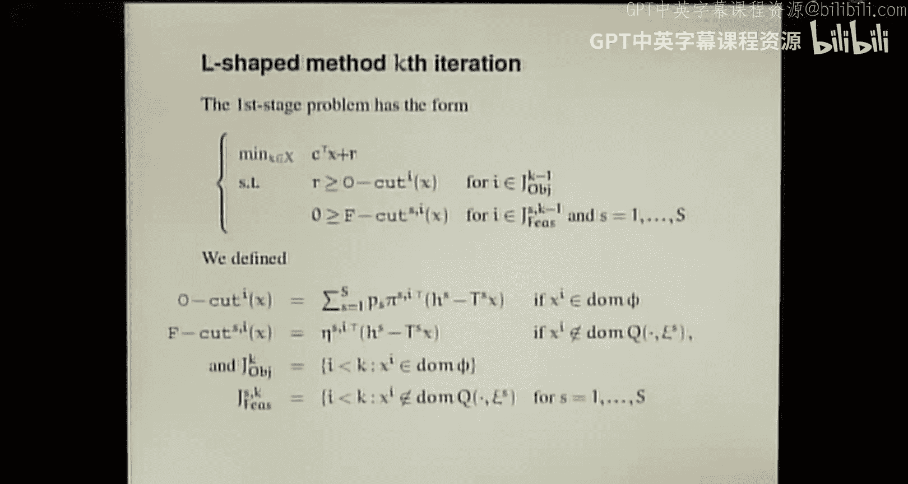

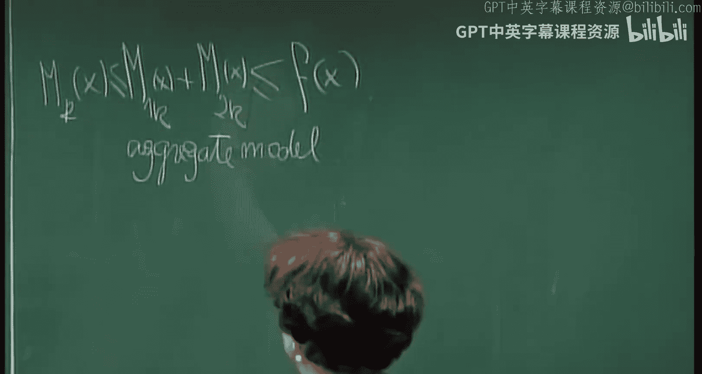

如果某个迭代点 **x_i** 对于至少一个场景不在补偿函数的定义域内（即第二阶段的某个子问题不可行），我们就需要生成**可行性割**。可行性割用于限制主问题中 **x** 的搜索范围，使其位于补偿函数的定义域内，该定义域是多面体。

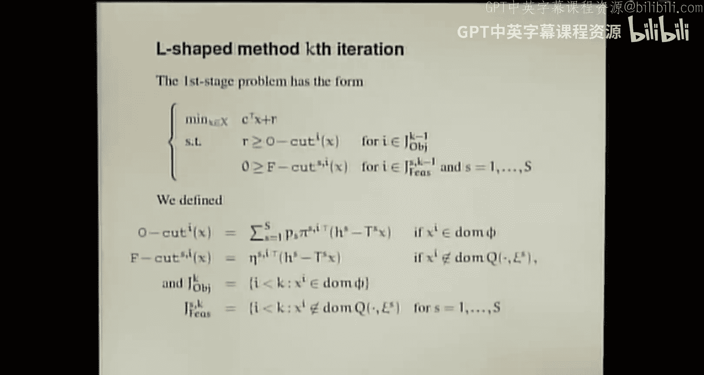

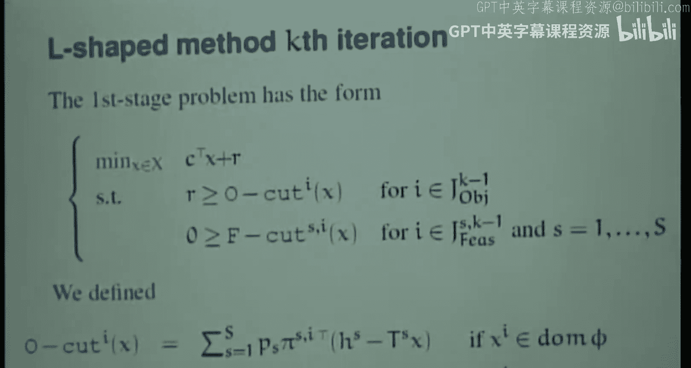

因此，在每次迭代中，主问题（Master Problem）是一个线性规划：

```
minimize c^T x + θ
subject to:
    x ∈ X
    θ ≥ α_i + β_i^T (x - x_i)   for i ∈ I_optimal
    β_i^T (x - x_i) ≤ α_i        for i ∈ I_feasibility
```

其中，**I_optimal** 和 **I_feasibility** 分别对应生成过最优性割和可行性割的迭代集合。

## 多割线变体

现在，我们来看看L形方法的一个变体——多割线方法。其核心思想源于目标函数 **f(x)** 可以分解为多个凸函数之和这一结构。

假设 **f(x) = f1(x) + f2(x)**。在标准的割平面法中，我们为整个函数 **f** 建立一个模型 **M_k(x)**。然而，利用可加性结构，我们可以为每个分量函数分别建立更精确的模型。

以下是两种建模方式的对比：

*   **聚合模型（单割线）**：`M_k(x) = max_{i≤k} [ f_i + g_i^T (x - x_i) ]`
*   **多割线模型**：`M1_k(x) + M2_k(x)`，其中
    *   `M1_k(x) = max_{i≤k} [ f1_i + g1_i^T (x - x_i) ]`
    *   `M2_k(x) = max_{i≤k} [ f2_i + g2_i^T (x - x_i) ]`

由于最大值之和大于等于和的最大值，我们有 `M_k(x) ≤ M1_k(x) + M2_k(x) ≤ f(x)`。这意味着多割线模型比单割线模型更紧，理论上可能带来更好的收敛性。

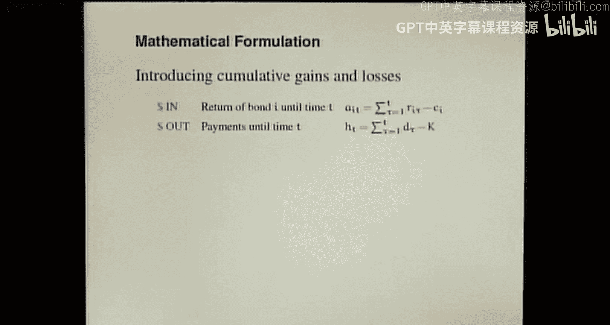

在L形方法的语境下，补偿函数是期望值 `Q(x) = Σ_s p_s * Q_s(x)`。多割线变体为每个场景（或每组场景）的补偿函数分量 **Q_s(x)** 都建立一个单独的模型，并用单独的变量 **θ_s** 表示。

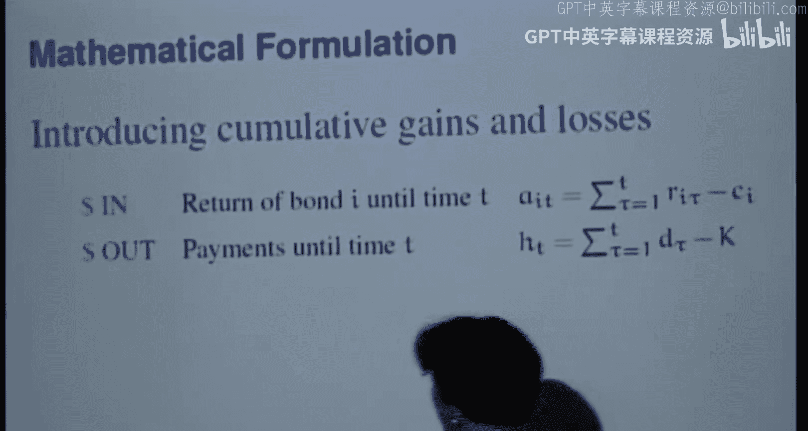

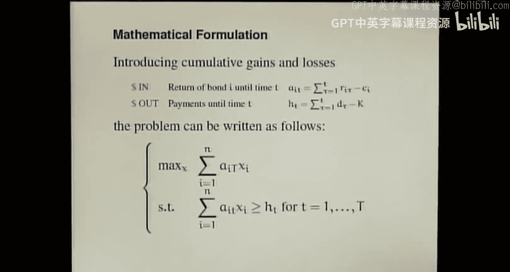

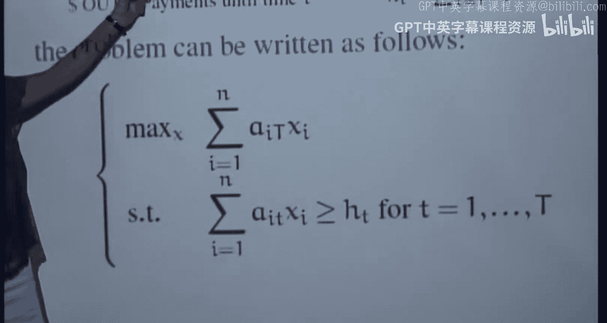

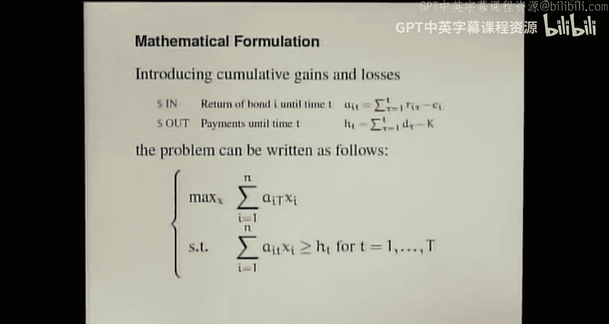

此时，主问题变为：

```
minimize c^T x + Σ_s p_s * θ_s
subject to:
    x ∈ X
    θ_s ≥ α_{s,i} + β_{s,i}^T (x - x_i)   for all s, for i in past iterations
```

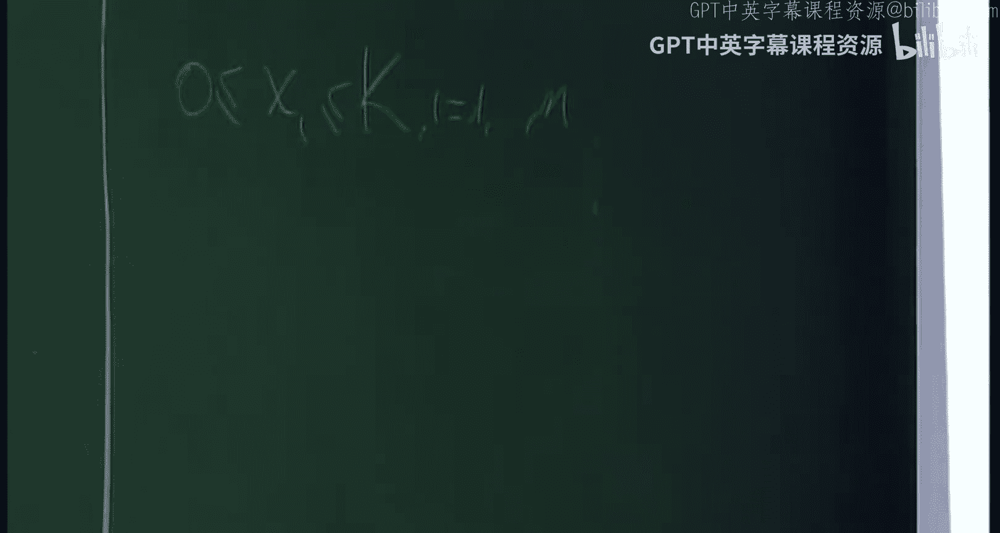

多割线方法的潜在问题是约束数量会急剧增加。如果有 **S** 个场景和 **K** 次迭代，最多会有 **S * K** 条割线，这可能导致计算负担沉重和数值问题（如“尾部效应”）。

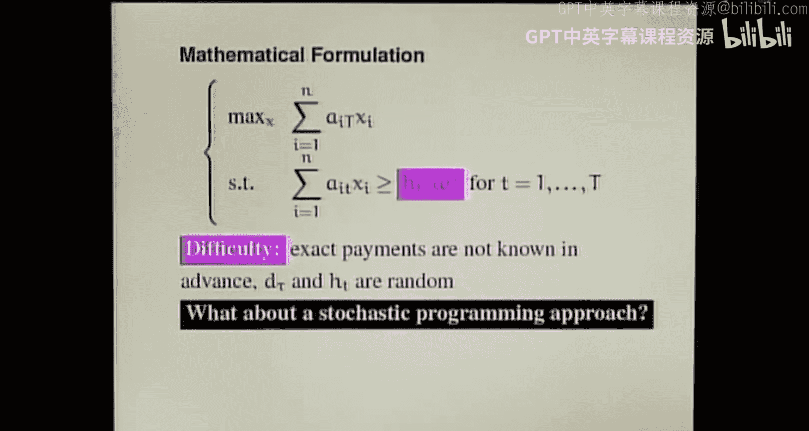

因此，在实践中，我们通常不会为每个场景单独建模，而是根据子问题的求解成本进行智能分组。例如，将求解速度快的一组场景聚合在一起，而为求解耗时长的单个或少数场景保留单独的模型，从而在模型精度和计算效率之间取得平衡。

## 应用案例：现金匹配问题 💰

为了将理论应用于实践，我们引入一个经典的随机规划案例——现金匹配问题。

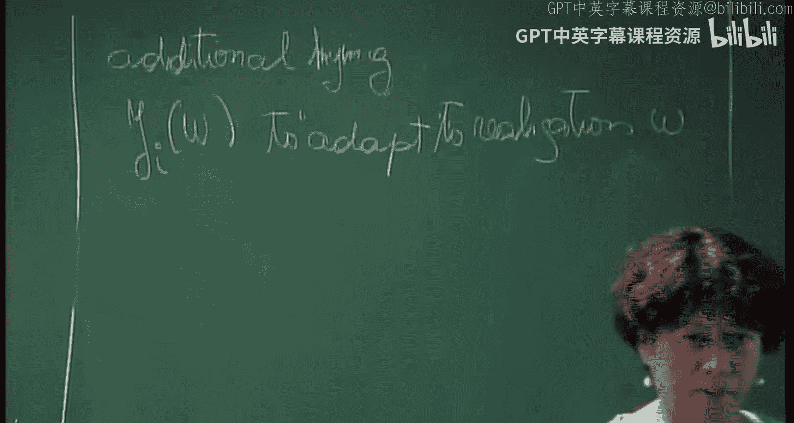

假设你经营一家公司，需要在未来若干年内偿还一系列债务。为了筹集资金，你可以在期初购买一些债券，并拥有一笔初始资本。你的目标是规划债券购买方案，使得在满足每年偿债需求的前提下，最终财富最大化。

### 确定性模型

首先，我们定义一些参数和变量：

*   **n**: 债券种类数量
*   **T**: 计划期总年数
*   **r_{i,t}**: 债券 **i** 在年份 **t** 的回报
*   **c_i**: 债券 **i** 的购买成本
*   **h_t**: 第 **t** 年需要偿还的债务
*   **K**: 初始资本总额
*   **x_i**: 期初购买债券 **i** 的数量（决策变量）

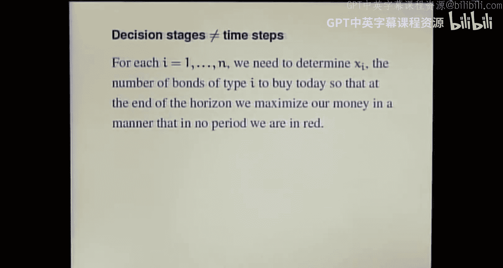

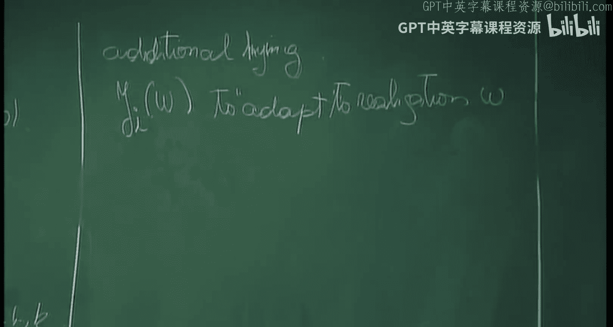

定义累计收益系数 **A_{i,t} = Σ_{τ=1}^{t} r_{i,τ} - c_i**。那么，到第 **t** 年为止，从债券 **i** 获得的总收益为 **A_{i,t} * x_i**。

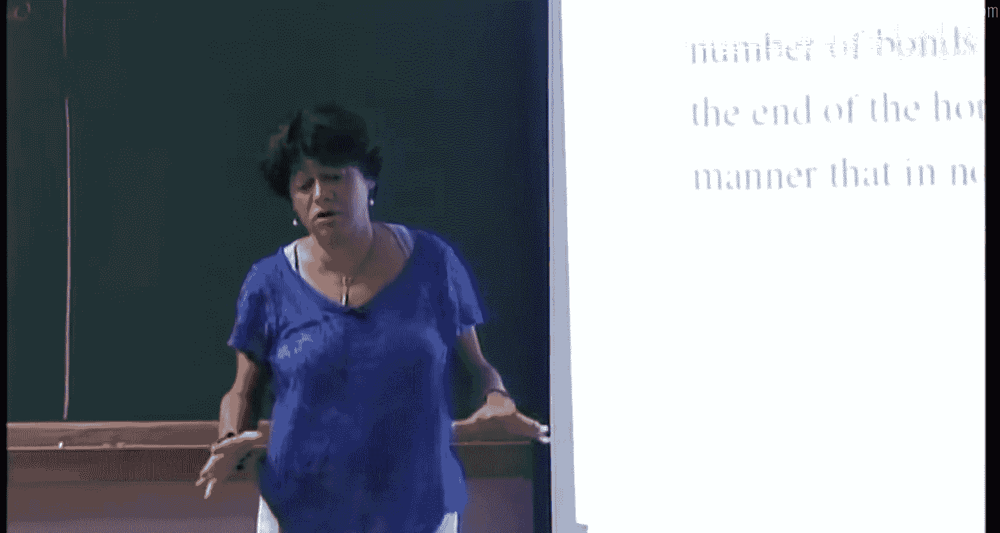

确定性模型如下：

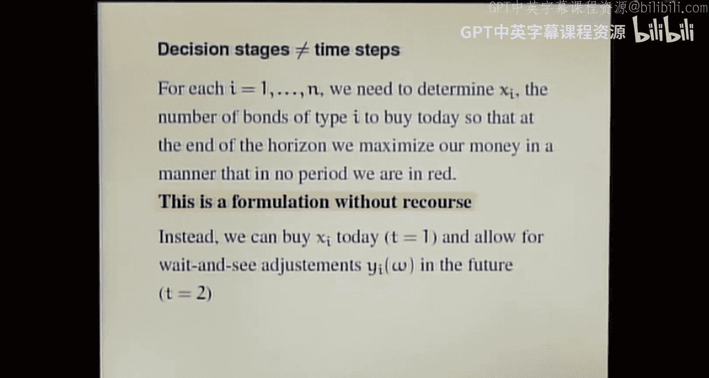

```
maximize Σ_i A_{i,T} * x_i
subject to:
    Σ_i A_{i,t} * x_i ≥ Σ_{τ=1}^{t} h_τ - K,   for t = 1, ..., T
    x_i ≥ 0
    Σ_i c_i * x_i ≤ K  (可用资金约束)
```

这个模型假设未来的债务 **h_t** 是确定已知的。

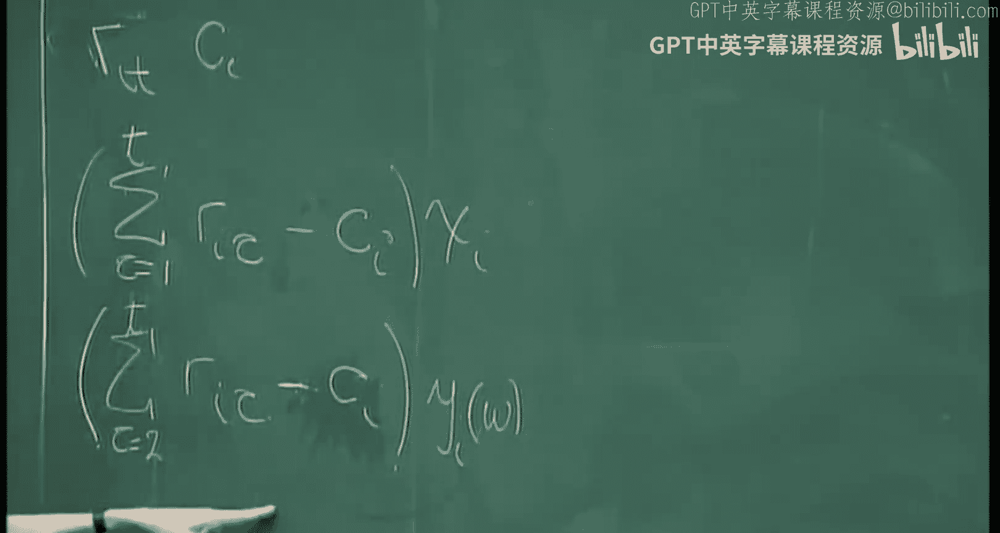

### 两阶段随机补偿模型

现实中，未来债务可能是不确定的。我们将其建模为随机变量。为了应对这种不确定性，我们引入一个两阶段补偿模型。

**第一阶段（期初决策）**：购买债券 **x_i**。
**第二阶段（未来补偿）**：在某个未来时间点（例如第2年），观察到债务的实际值后，我们可以进行补偿性购买。设 **y_i(ω)** 为在场景 **ω** 下追加购买债券 **i** 的数量。

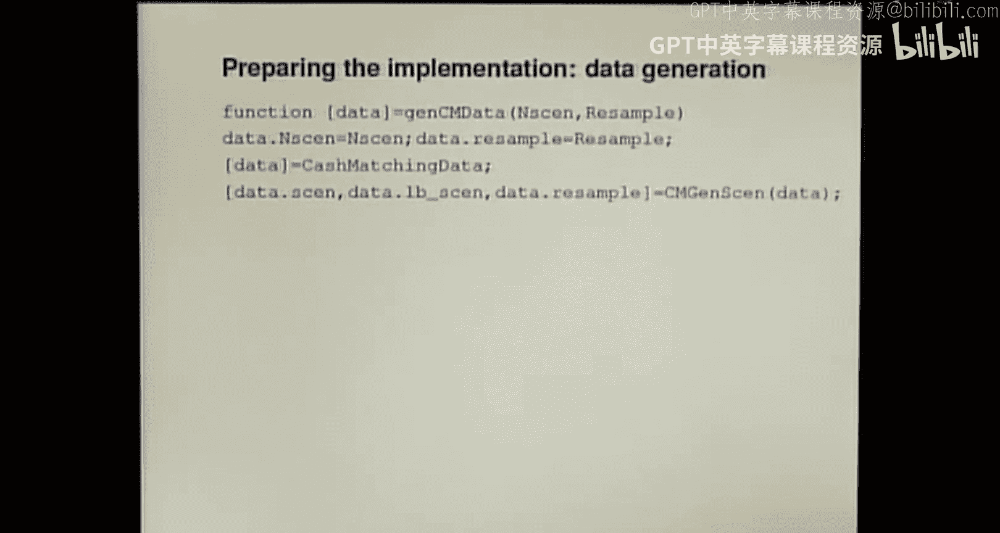

补偿购买发生在第2年，因此其从购买当年开始的累计收益系数为 **B_{i,t} = A_{i,t} - r_{i,1}**（即比原始债券少了第一年的回报）。

带有补偿的两阶段随机规划模型如下：

```
maximize Σ_i A_{i,T} * x_i + E[ Σ_i B_{i,T} * y_i(ω) ]
subject to:
    (第一阶段约束)
    Σ_i c_i * x_i ≤ K
    x_i ≥ 0

    (连接第一、二阶段的约束，对于 t ≥ 2)
    Σ_i A_{i,t} * x_i + Σ_i B_{i,t} * y_i(ω) ≥ Σ_{τ=1}^{t} h_τ(ω) - K,   for all ω
    y_i(ω) ≥ 0
```

在这个模型中，只有债务 **h_t(ω)** 是随机的，债券回报和成本假设为确定的。第一阶段变量 **x** 必须在这里就确定下来，而第二阶段变量 **y(ω)** 则依赖于随机场景的实现。


## 实现框架与建议

最后，我们来讨论实现此类算法的编程框架和实用建议。

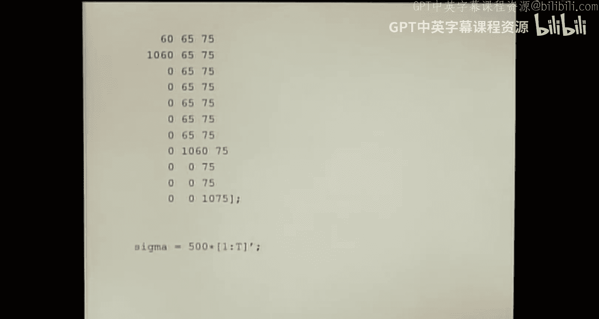

### 数据结构

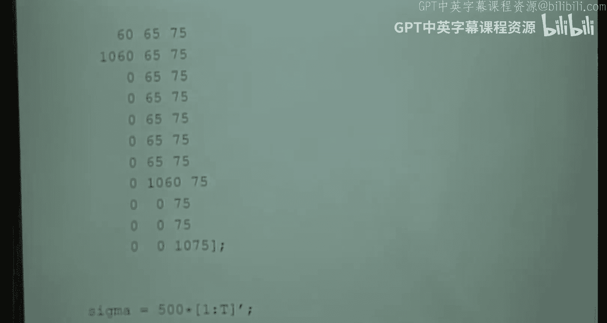

建议使用一个总体的**数据结构**（例如MATLAB的struct或Python的字典）来存储问题的所有数据。这包括：
*   确定性参数（债券回报、成本、时间周期）
*   场景数据（通过随机数生成器产生的债务序列）
*   算法参数（场景数、随机种子等）

将数据生成与问题特定数据分开管理是一个好习惯。使用固定的随机种子有助于在调试阶段复现问题。

### 预言机设计

“预言机”是求解子问题（即计算给定 **x_k** 下的补偿函数值和次梯度/割线）的函数。其输入是当前迭代点 **x_k** 和全局数据结构，输出应包含：
1.  **割线信息**：截距 **α** 和斜率 **β**（向量）。
2.  **割线类型**：标识是最优性割还是可行性割。
3.  **场景信息**：对于可行性割，需要记录是针对哪些场景生成的。
4.  **状态标志**：用于指示求解是否成功，或在出错时终止算法。

在实现初期，建议先从**单割线（聚合模型）** 开始，因为它更简单。确保基础版本正确运行后，再考虑实现更复杂的多割线变体。

### 调试与验证

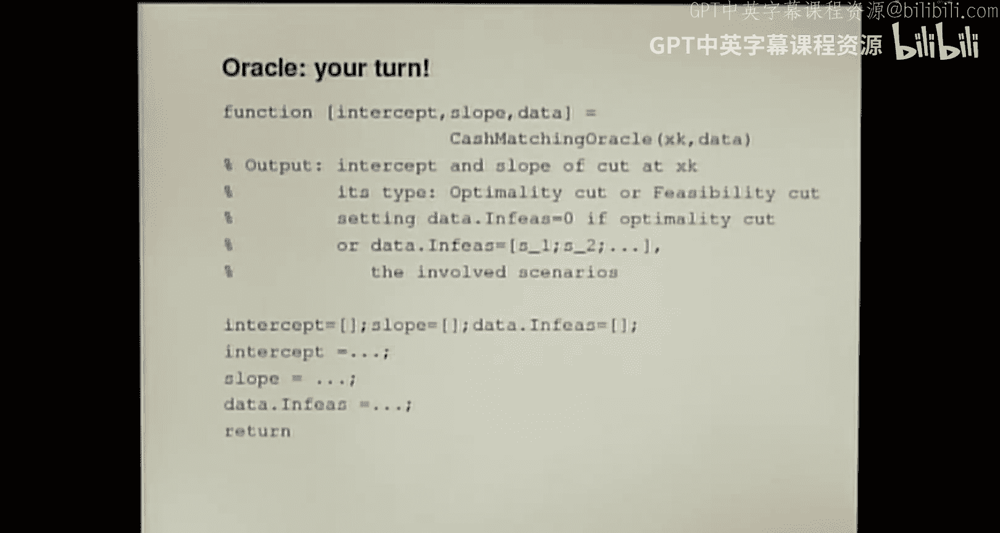

实现过程中的大部分错误可能出现在预言机部分。务必进行仔细的调试：
1.  首先用**单个场景**运行程序，验证逻辑。
2.  然后逐步增加场景数量，观察行为是否符合预期。
3.  检查生成的割线是否正确，主问题是否收敛到合理解。

## 总结

本节课中我们一起学习了两阶段随机规划L形方法的关键实现要点。我们回顾了割平面模型如何近似补偿函数，并深入探讨了利用目标函数可加性结构的**多割线变体**，分析了其精度与计算成本的权衡。接着，我们通过**现金匹配问题**这个具体案例，演示了如何将确定性的财务规划模型扩展为一个两阶段随机补偿模型，以应对未来债务的不确定性。最后，我们讨论了实现此类算法的编程框架，强调了使用清晰的数据结构、精心设计预言机以及采用渐进式调试策略的重要性。掌握这些概念和技巧，是成功应用随机规划解决实际复杂决策问题的基础。