# 随机规划基础课程：第13讲：多阶段随机规划入门 🎯

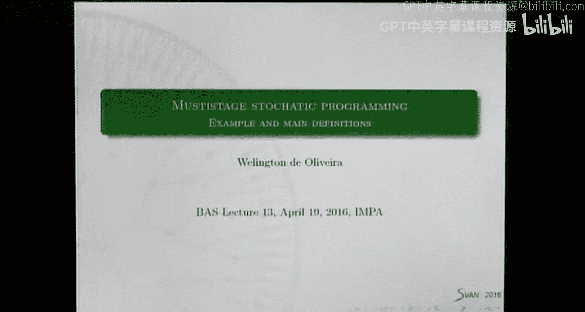

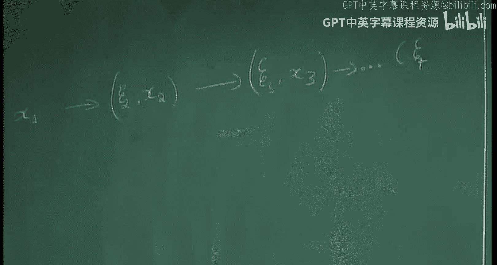

在本节课中，我们将学习多阶段随机规划的基本概念。我们将从一个简单的例子出发，介绍多阶段模型与两阶段模型的主要区别，并探讨处理此类问题的三种主要数学表述形式。

## 从两阶段到多阶段 🔄

上一讲中，我们讨论了两阶段随机规划问题。多阶段模型是其扩展。在两阶段模型中，我们先做出第一阶段的决策 `x1`，然后不确定性 `ξ2` 被揭示，接着我们有机会做出第二阶段的决策 `x2`。而在多阶段模型中，这个过程会持续多个阶段：我们做出决策 `x1`，不确定性 `ξ2` 被揭示，我们做出决策 `x2`；然后不确定性 `ξ3` 被揭示，我们做出决策 `x3`，如此继续，直到第 `T` 阶段。这种多阶段方法出现在许多实际应用中。

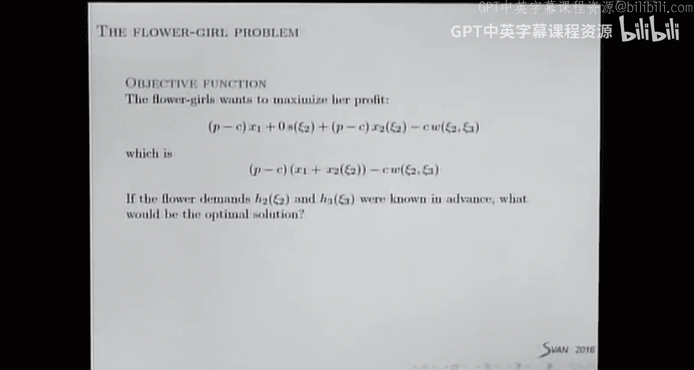

处理多阶段随机规划有几种主要方法。与两阶段问题相比，多阶段问题的符号表示更复杂，求解算法也更具挑战性。本节课我们将通过一个例子，介绍三种主要的数学表述形式。

## 卖花女孩问题 🌹

我们从一个具体的例子开始：卖花女孩问题。

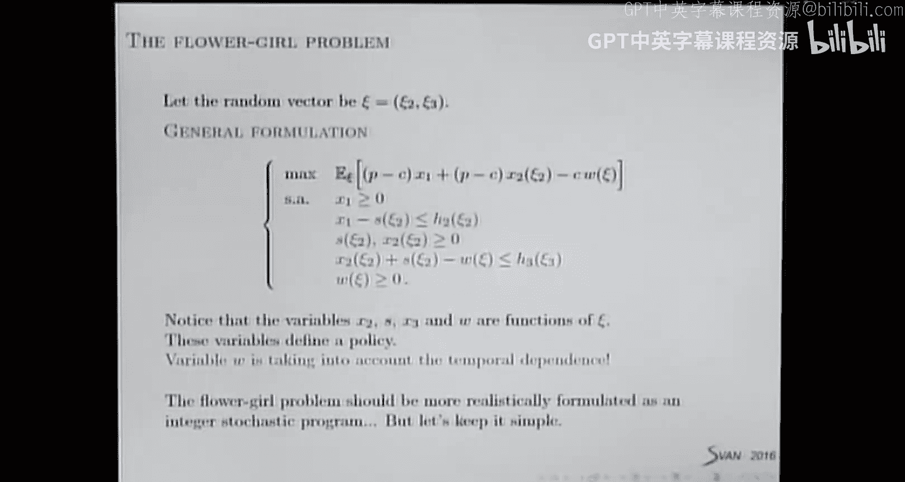

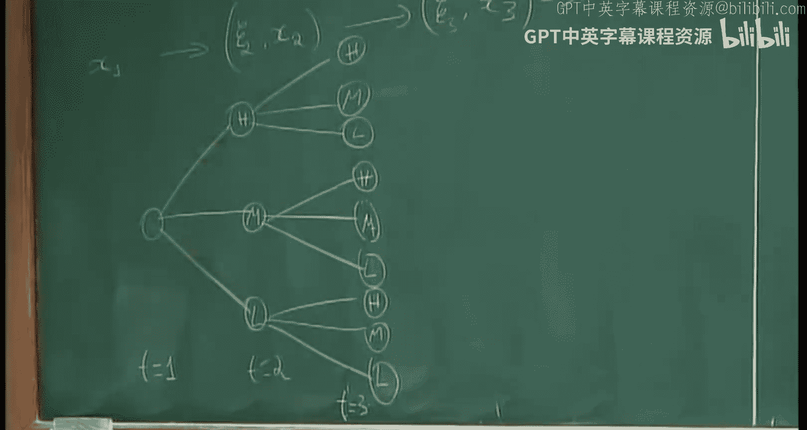

*   **问题描述**：一个卖花女孩以价格 `P` 出售玫瑰花，但需要以成本 `C` 提前购入。如果当天没有卖完所有玫瑰，剩余的可以储存并在第二天出售，但只能储存一天。每天的需求 `ξ_t` 是不确定的。卖花女孩的目标是最大化她的总期望利润。规划期 `T` 是她连续卖花的天数。
*   **简化案例**：我们考虑一个简单情况：女孩在周五买花（`X1`），在周六销售。周六的需求是 `ξ2`。未售出的花可以储存（`S`），并且她可以在周六订购新的花（`X2`）。周日是第三阶段，需求是 `ξ3`。周日未售出的花 `W` 将被丢弃，造成损失。

以下是各阶段的决策和约束：

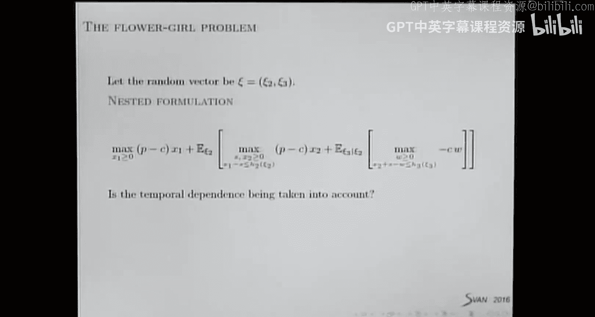

*   **第一阶段（周五晚）**：决策变量是购买的花量 `X1`。约束是 `X1 ≥ 0`。
*   **第二阶段（周六）**：需求 `ξ2` 被揭示。决策变量是储存的花量 `S` 和新订购的花量 `X2`。约束包括 `S ≥ 0`， `X2 ≥ 0`，以及 `X1 - S ≤ ξ2`（即售出量不超过需求）。
*   **第三阶段（周日）**：需求 `ξ3` 被揭示。决策变量是丢弃的花量 `W`。约束包括 `W ≥ 0`，以及 `X2 + S - W ≤ ξ3`。

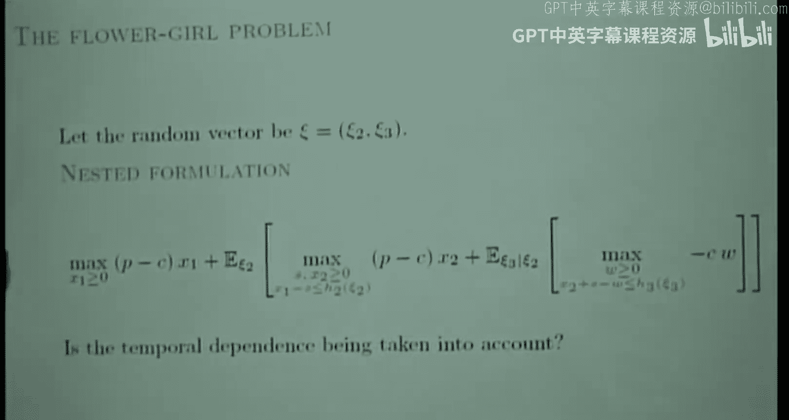

目标是最大化期望利润，其公式为：
`max E[ P * min(X1, ξ2) - C * X1 + P * min(X2+S, ξ3) - C * X2 - C * W ]`

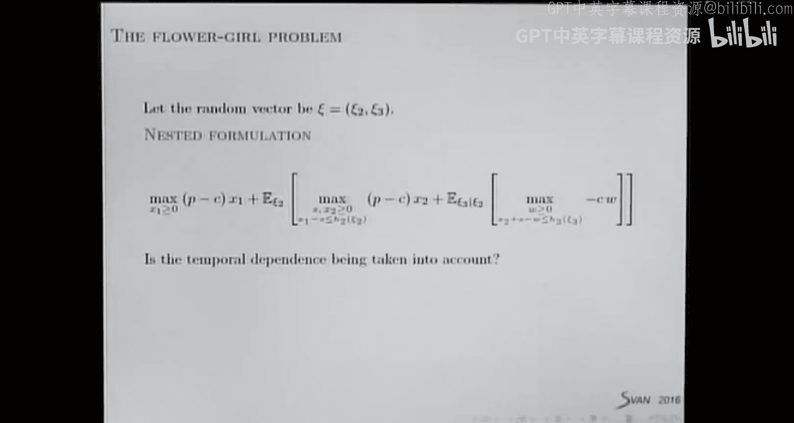

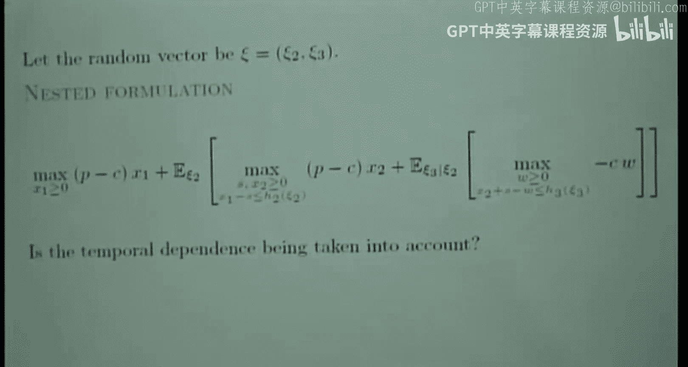

**核心思想**：新的决策是随着不确定性的逐步揭示而逐步做出的。如果需求提前已知，最优决策就是精确购买每天的需求量。然而，现实中需求不确定，因此我们关注**最大化期望值**。这里我们假设决策不会影响不确定性过程（例如，带伞不会影响是否下雨），这是一个标准假设。

## 多阶段随机规划的表述形式 📝

接下来，我们看看如何用数学语言表述卖花女孩这类问题。主要有三种表述形式。

### 1. 通用表述 (General Formulation)

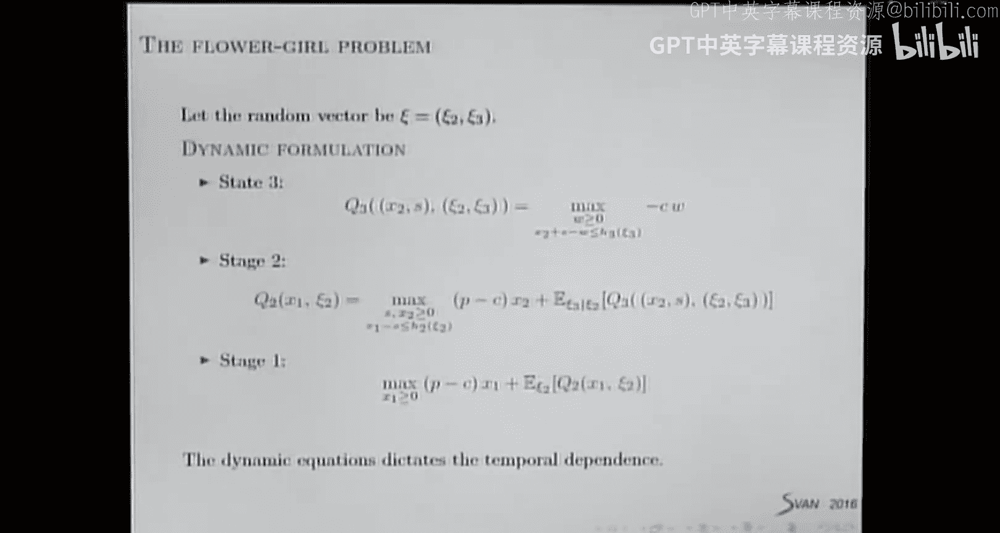

这种表述直接扩展了两阶段模型，将决策变量视为不确定性路径的函数。

对于卖花女孩问题，通用表述如下：
`max E[ f1(X1) + f2(X1, X2(ξ2), ξ2) + f3(X1, X2(ξ2), X3(ξ2, ξ3), ξ2, ξ3) ]`
约束条件对应于各个阶段。

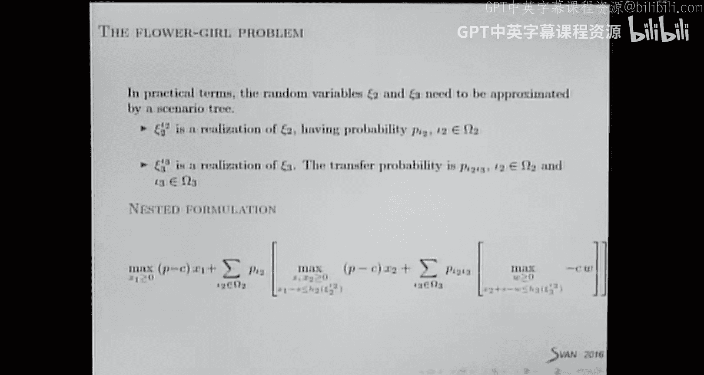

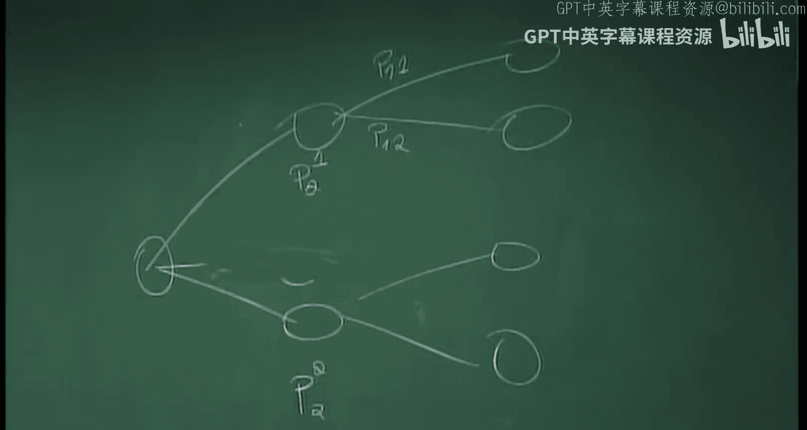

**重要说明**：第二阶段的决策 `X2` 依赖于已揭示的不确定性 `ξ2`。第三阶段的决策 `X3` 则依赖于整个路径 `(ξ2, ξ3)`。这种表述明确写出了变量对不确定性的依赖关系。

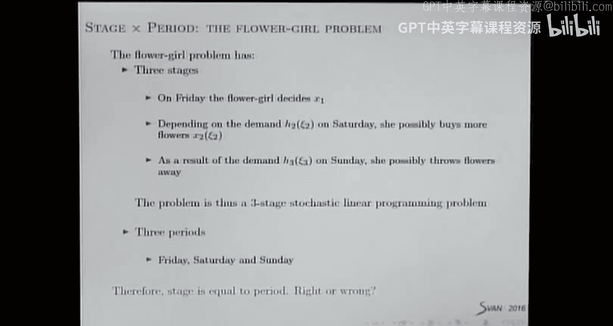

当我们使用**情景树**来离散化随机过程时，这种表述会为树上的每个节点（每个可能的不确定性路径）创建一个决策变量。因此，变量数量会非常多，最终形成一个大规模线性规划问题，可以一次性求解，但只适用于较小规模的问题。

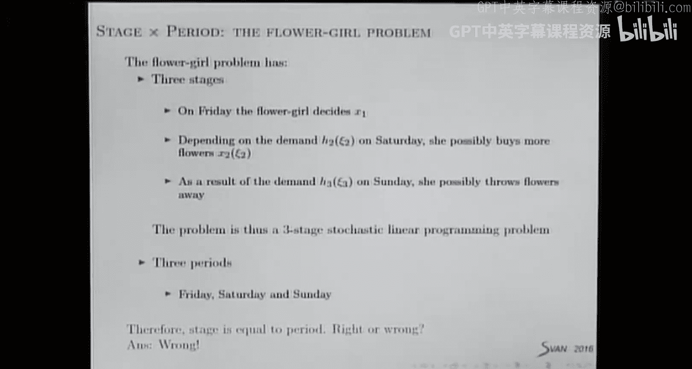

### 2. 嵌套表述 (Nested Formulation)

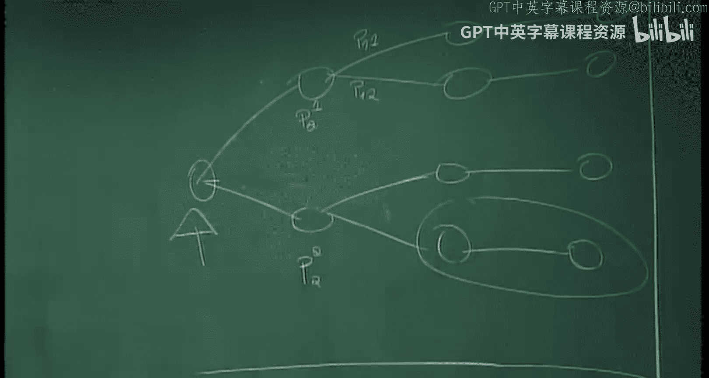

这种表述使用条件期望，体现了决策的“嵌套”结构。

其核心形式如下：
`min f1(x1) + E[ min_{x2} { f2(x1, x2, ξ2) + E[ ... + E[ min_{x_T} f_T(x_{T-1}, x_T, ξ_T) | ξ_{1:T-1}] ... | ξ_2] | ξ_1} ]`

**直观理解**：在决策树（情景树）的每个节点上，我们做决策时不仅要考虑本阶段的成本，还要考虑从该节点出发的所有未来子节点路径的期望成本。这种“成本-to-go”的思想被一层层嵌套在期望中。

在这种表述中，决策变量（如 `x2`）被视为该节点上的局部变量，而不显式地写成不确定性函数的样式，其依赖性通过嵌套的优化问题隐含体现。这种表述催生了特定的求解算法。

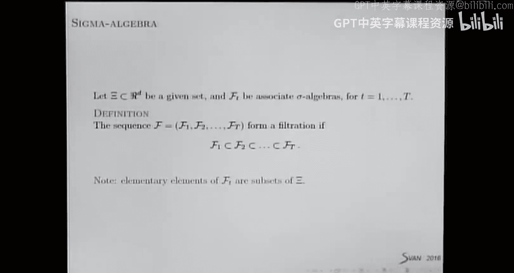

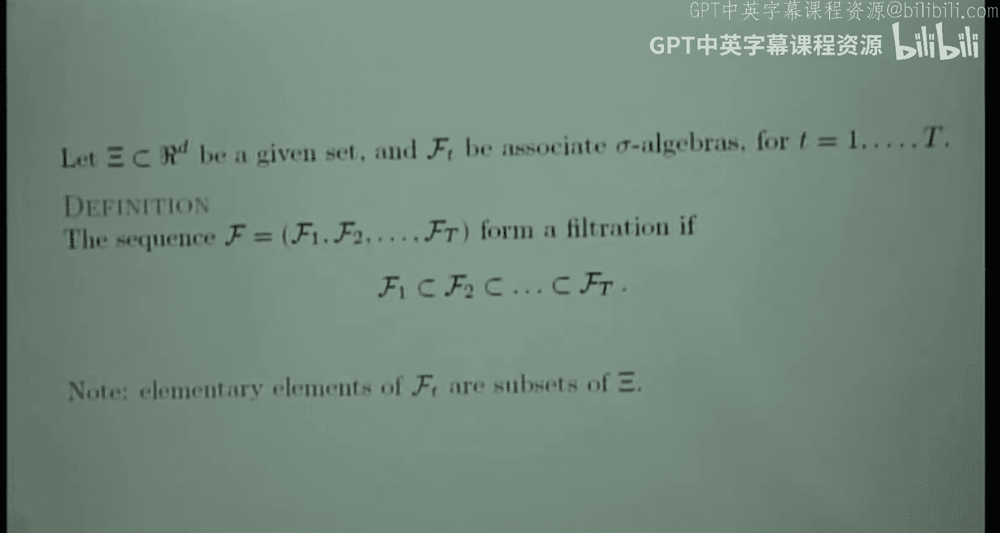

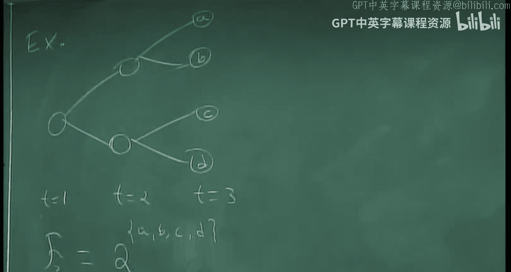

### 3. 动态规划表述 (Dynamic Programming Formulation)

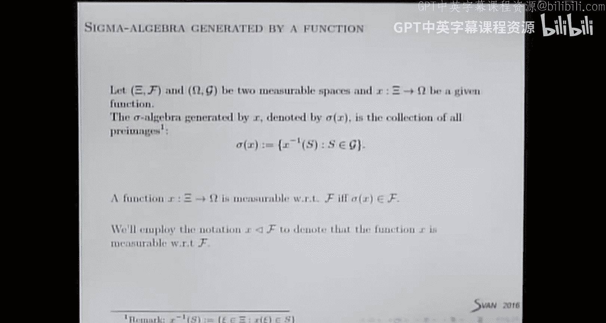

这种表述从最后一个阶段开始，逆向递推求解，是嵌套表述的操作化实现。

我们从最后一阶段（`T`）开始，对于情景树上的每个叶节点，给定之前的所有决策和历史，求解一个简单的优化问题（例如，最小化丢弃鲜花的损失）：
`Q_T(x_{T-1}, ξ_{1:T}) = min_{x_T} f_T(x_{T-1}, x_T, ξ_T)`

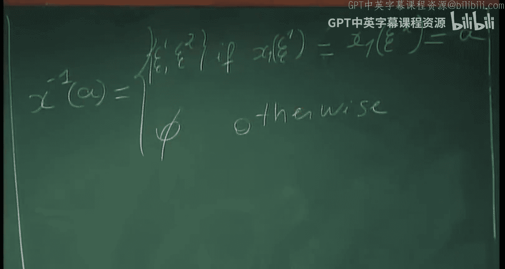

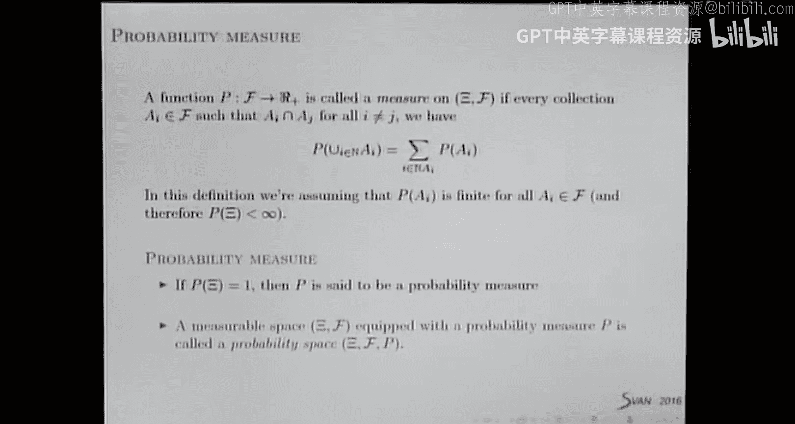

然后，我们倒退到第 `T-1` 阶段。对于该阶段的每个节点，我们求解一个优化问题，目标是最小化本阶段成本加上未来子节点的期望成本：
`Q_{T-1}(x_{T-2}, ξ_{1:T-1}) = min_{x_{T-1}} f_{T-1}(x_{T-2}, x_{T-1}, ξ_{T-1}) + E[ Q_T(x_{T-1}, ξ_{1:T}) | ξ_{1:T-1} ]`

如此继续，直到第一阶段：
`min_{x_1} f1(x1) + E[ Q_2(x_1, ξ_2) ]`

**与两阶段的联系**：如果忽略第三阶段，只看第二阶段的问题，其结构就是一个两阶段随机规划问题。动态规划表述清晰地揭示了多阶段问题可以通过求解一系列相互关联的两阶段（或更小规模）子问题来解决。

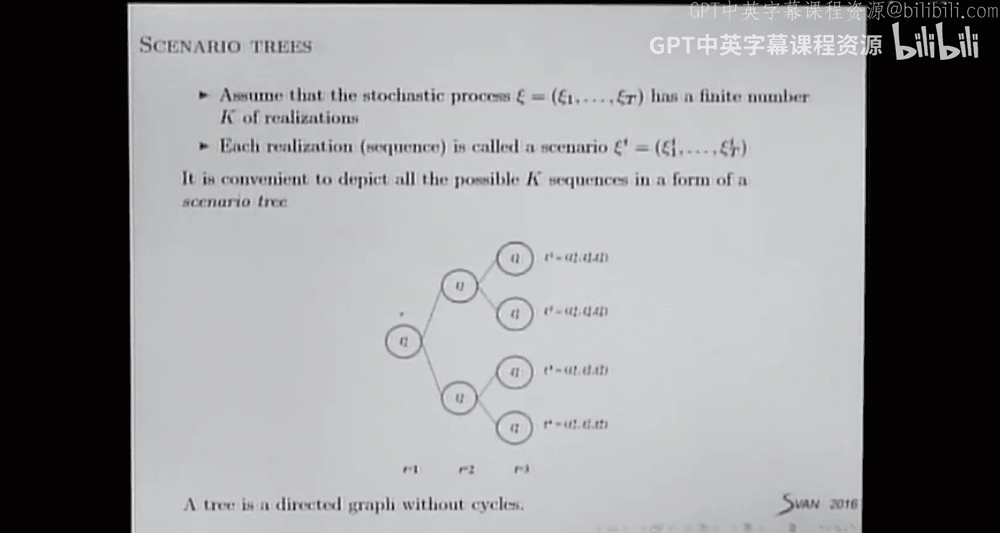

## 重要概念与定义 📚

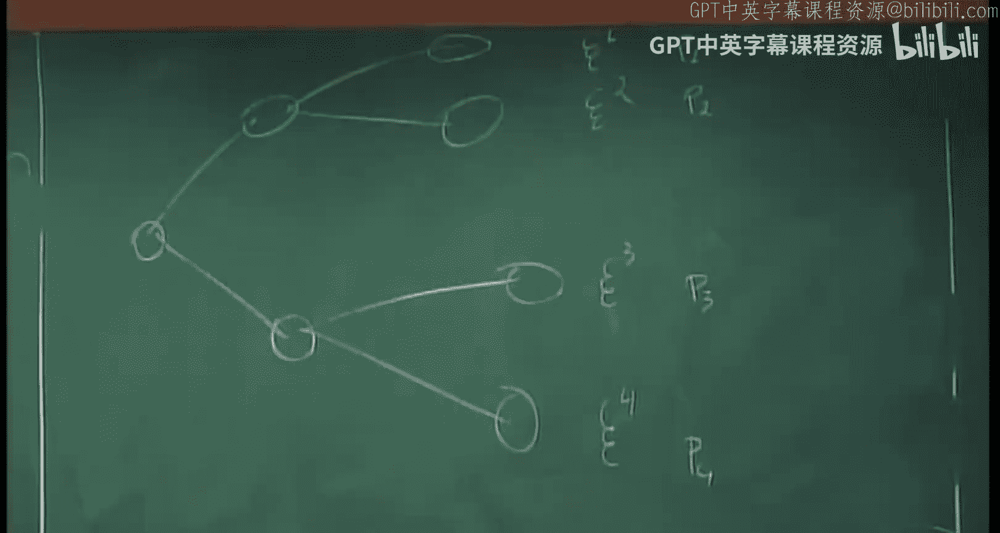

为了深入理解多阶段模型，我们需要掌握一些数学定义。

*   **σ-代数 (Sigma-algebra)**：一个集合的某些子集构成的集合族，满足三个条件：包含全集；对补集运算封闭；对可数并集运算封闭。它用于定义“可测”的集合（事件）。
*   **滤波 (Filtration)**：一个递增的σ-代数序列 `F1 ⊂ F2 ⊂ ... ⊂ FT`。在情景树中，`Ft` 包含了直到阶段 `t` 所有可能区分的历史路径信息。决策 `xt` 必须是 `Ft`-可测的，这意味着在阶段 `t` 无法区分的历史路径上，必须做出相同的决策（称为**非预期性**）。
*   **概率空间与随机变量**：一个带概率测度的可测空间称为概率空间。从概率空间到实数的可测函数称为随机变量。
*   **随机过程**：一列随机向量 `ξ1, ξ2, ..., ξT` 称为随机过程。`ξ_{1:t}` 表示直到阶段 `t` 的历史。
*   **阶段间独立 (Stagewise Independence)**：未来不确定性 `ξ_{t+1}` 的概率分布只依赖于当前阶段 `t`，而与更早的历史 `ξ_{1:t-1}` 无关。这可以大大简化情景树的结构（不同历史路径在相同阶段可以共享相同的不确定性子节点）。
*   **马尔可夫性 (Markovian)**：未来不确定性 `ξ_{t+1}` 的概率分布只依赖于当前状态（通常由当前决策 `xt` 和当前实现 `ξ_t` 概括），而不依赖于到达当前状态的完整路径。

## 一般形式与总结 🎓

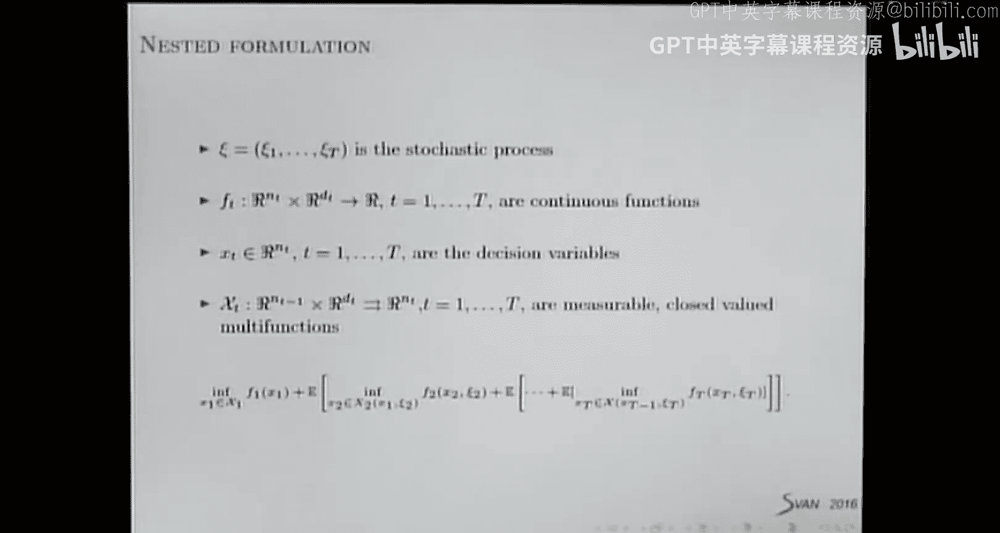

基于以上定义，我们可以给出多阶段随机规划更一般化的嵌套表述：

`min E[ f1(x1) + f2(x1, x2(ξ2), ξ2) + ... + f_T(x_{T-1}, x_T(ξ_{1:T}), ξ_{1:T}) ]`
满足约束：`x_t ∈ X_t(x_{t-1}, ξ_t)`，且 `x_t` 是 `Ft`-可测的。

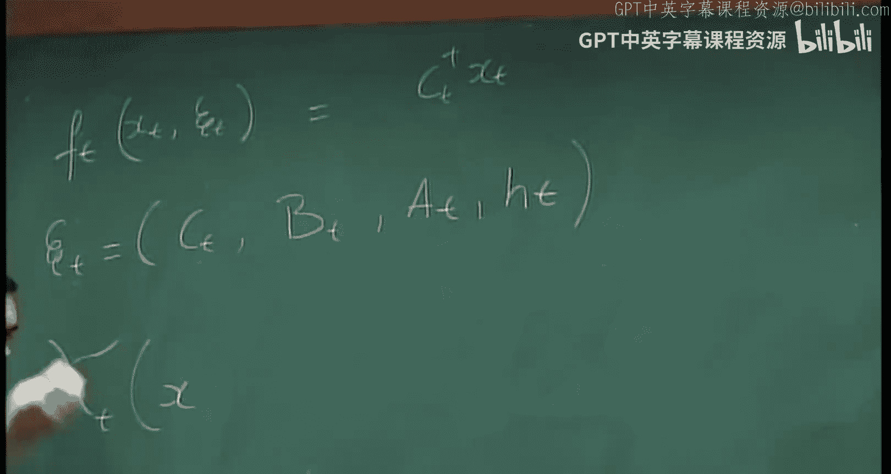

其中，`ft` 是第 `t` 阶段的成本函数，`Xt` 是依赖于前序决策和当前不确定性的可行集。

对应的动态规划“成本-to-go”函数定义为：
`Q_t(x_{t-1}, ξ_{1:t}) = min_{x_t ∈ X_t} { f_t(x_{t-1}, x_t, ξ_t) + E[ Q_{t+1}(x_t, ξ_{1:t+1}) | ξ_{1:t} ] }`
对于 `t = T, T-1, ..., 2`，且 `Q_{T+1} ≡ 0`。

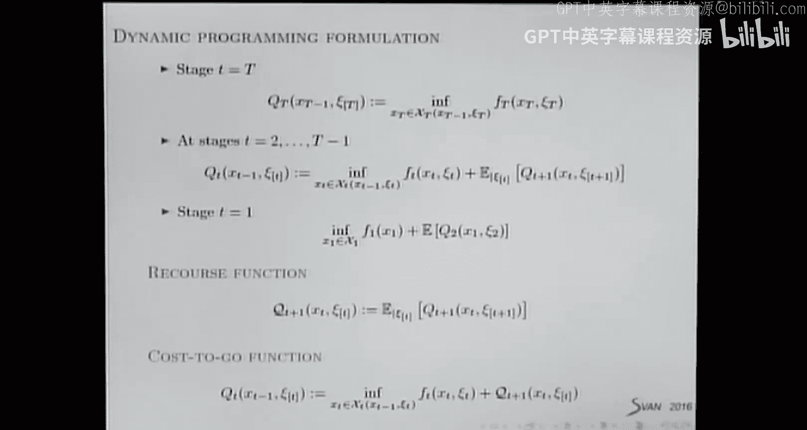

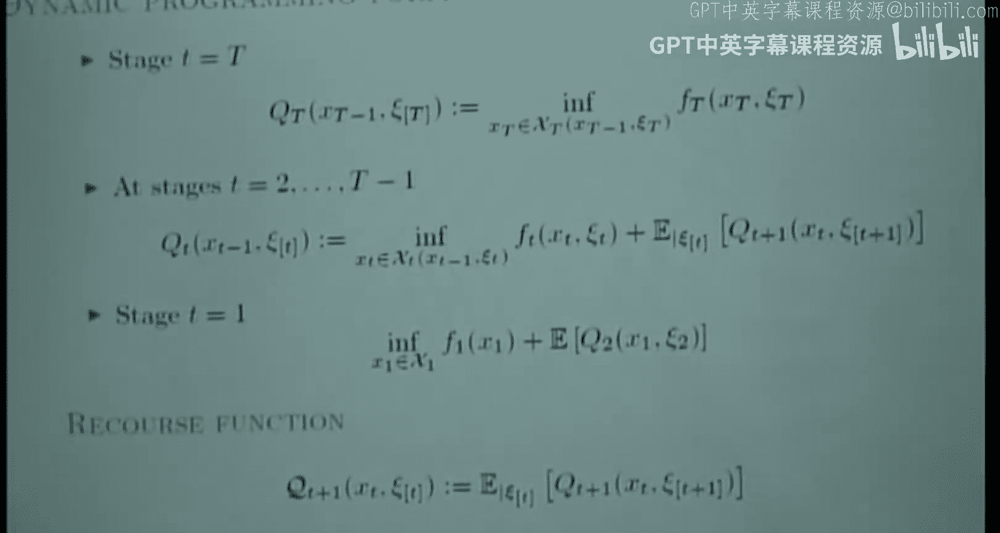

最终，第一阶段问题为：`min_{x1 ∈ X1} { f1(x1) + E[ Q_2(x_1, ξ_2) ] }`。

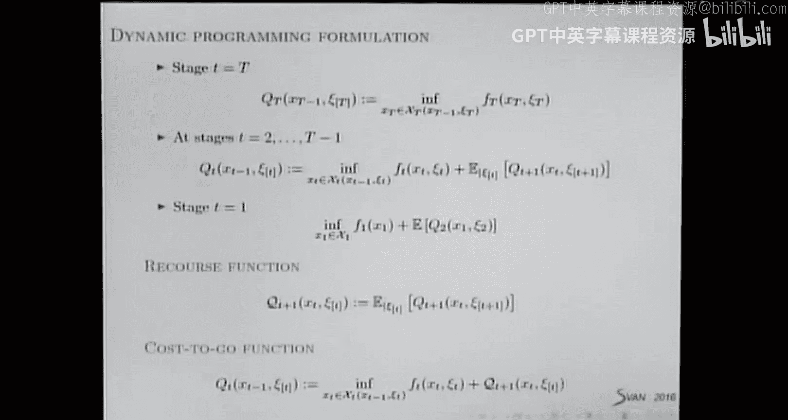

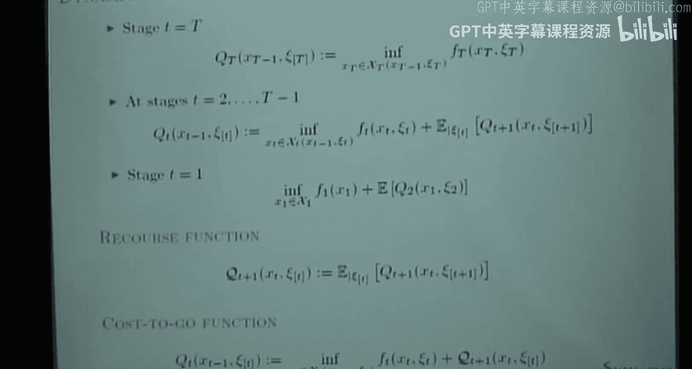

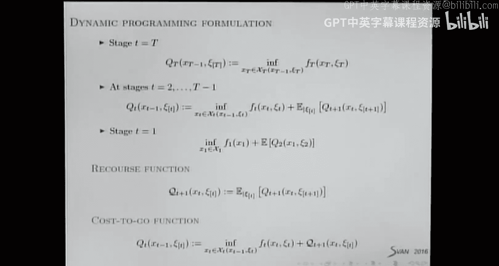

**本节课总结**：在本节课中，我们一起学习了多阶段随机规划的基本框架。我们从卖花女孩的例子入手，理解了多阶段决策“逐步观察、逐步调整”的核心思想。我们重点介绍了三种主要的数学表述形式：**通用表述**、**嵌套表述**和**动态规划表述**。此外，我们还学习了σ-代数、滤波、阶段间独立等关键概念，这些是理解和构建多阶段模型的基础。多阶段问题因其决策变量多、情景树规模大而更具挑战性，但动态规划等思想为我们提供了分解和求解复杂问题的有力工具。