# IMPA《随机编程｜Basic Course on Stochastic Programming 2016》中英字幕（Claude-3.5-sonnet p16 -16-Basic Course on Stochastic Programming - Class 16.zh_en -BV1tH92YXEnd_p16-

Okay， good afternoon。Let's continue with our basic course on stochastic program。

This is the lecture 16。So today， before I'm going to， to review the last class。

 the last class we talked about nested the the composition。

 but we haven't proven convergence of the method。 Today， we are going to discuss this a little bit。

 and then move。 we will move to another subject， of course。

 inside the mood stage to screen program problems。 Just another。

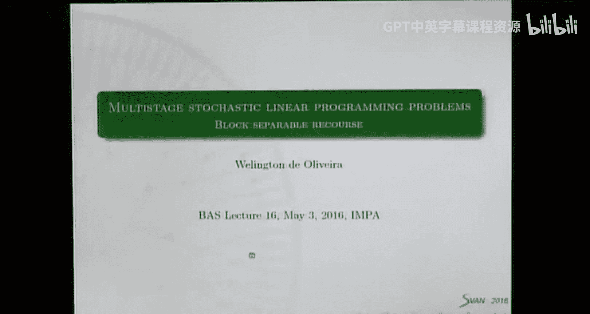

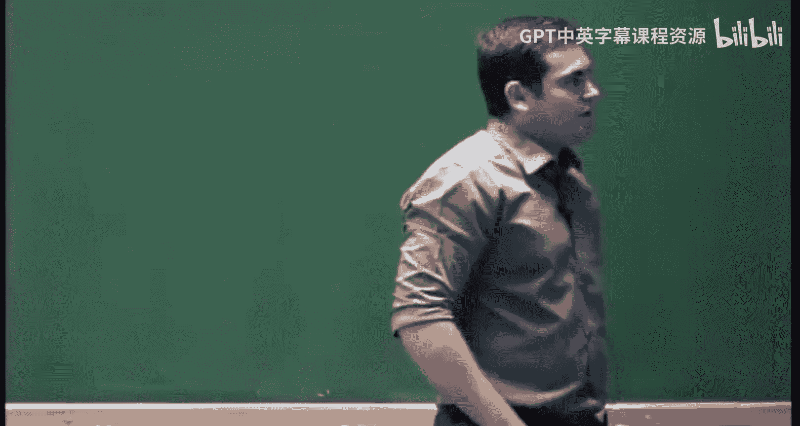

Particular case of problem other method。Before I would like to give you some information。Some news。

Okay， this is not new， always。Resolution should be good enough。So it's about the X。

So we have here the， the score of the exams。 So I'm going to。Hopefully， today， tonight。

 I'm going to send a message to everyone with the， the score。 So here。

 this is just for you to have an idea how your colleagues did in this exam。So， we had one。1en。

100 in this case。In total of 20 is students。

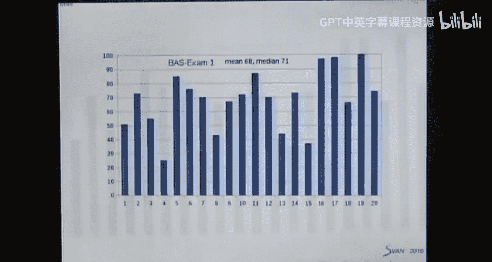

The histogram is this one。So the average age was 68。That's the average age。And well。

You will know soon。 You are。Square。Another information is we have we made available second list of exercise。

 this is a computational list。

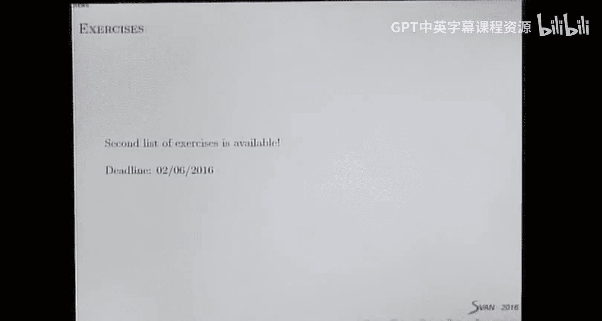

So it's available on the， the。Of course is a website。

Just we ask to implement three methods for solving two stage toas linear programs。

And comparing these three methods。 So you may。Use Molab。Or if you want， you can use also octave。

We have made available some data you are going to need for coding those algorithms and test problem also it's available。

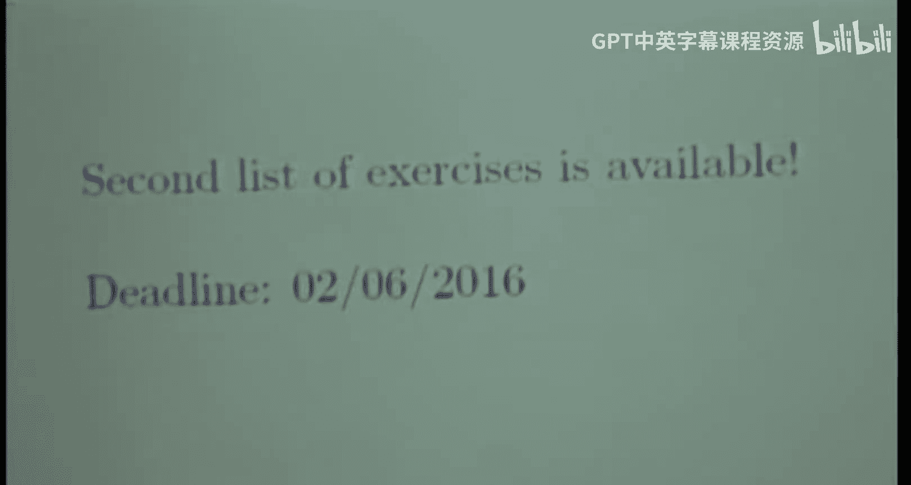

And the deadline。

To of June。So， my。One month。And I think if I'm not mistaken the week before Im not going to have classes because it's the week of the Braoppt。

 the conference in Manau。 so you can take opportunities of this。

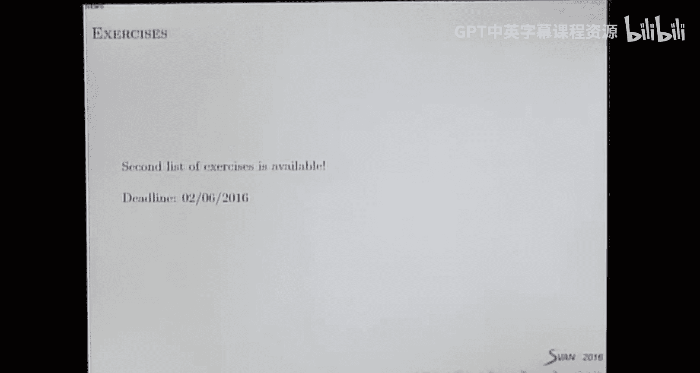

This week to write the report。 So we expect a report on this list。

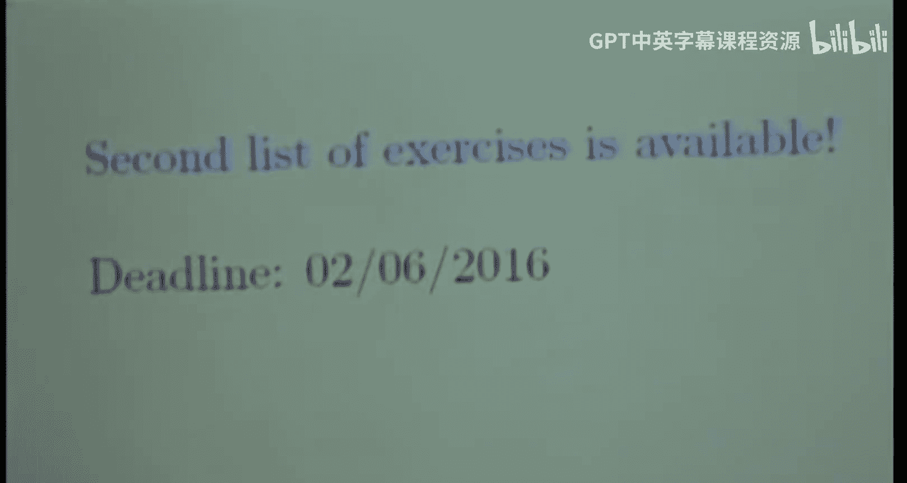

With the saw， the Matla codes or octave codes also printed in our PDF。 And also。

 we like to have the physical codes because we are going to test to run。Some more information。

Next week， we are going to start mini course on syngen。 So we have two important guests。

 Professor Guin。And from Ohio State University and Professor Tito， Titoman Jimlo from Chile。

Like it is Brazililian， but he works in。切点。So probably those， the mini cores will be。Record。

 and we'll make the videos available。 It probably I will check this。

 I'm not sure about a live broadcast。 So perhaps will not be。but well， anyway。

 I think the the videos will be available later。 So this is the first course we start next Monday。

And then we have another course from Professor Robert to Kumminetti， also from Chile。

And there some mini course in the Kibi rout under uncertainty。And。

Is the week later after the next one。And a third。Mini course。

 instchastic convex optimization methods in machine learning。From professors。

 this discourse will be given by Professor Marmid from British Columbialoian。Cumbia University。

But the and the good news all， all， all of them are good news。 But yeah， we can。

 we don't need to miss our course to attend this mini course。 So， for example。

 you're not be in parallel。TheThe mini course since anothergen will start the Monday。

 one half past 1 PM。Mondayday， Wednesday， and then Friday。And well， you' not be in parallel。

 so you can take opportunities。 You can attend these mini dis courses and attend the mini courses。

Okay。Well。I think this is the last information。You did。呃。

You are already familiar with it this notation。

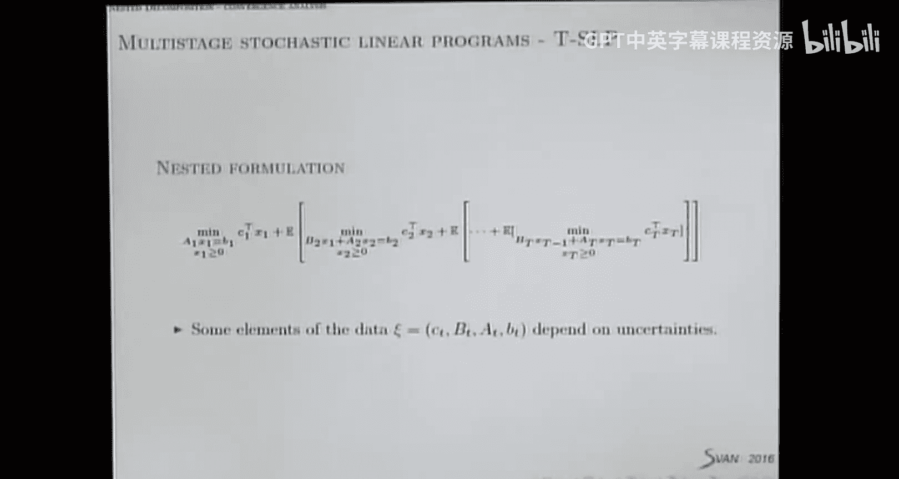

Well， this first part， I'm going to pass quickly because we saw this last class。And here。

 just to remember， our assert can be the cost of vector can be those matrix A and B。

 It can be this vector B。 So for auditD T， except the first one that we assume determinist。

 this is the problem we are dealing with。So the dynamic program formulation you already know。

 is this one。

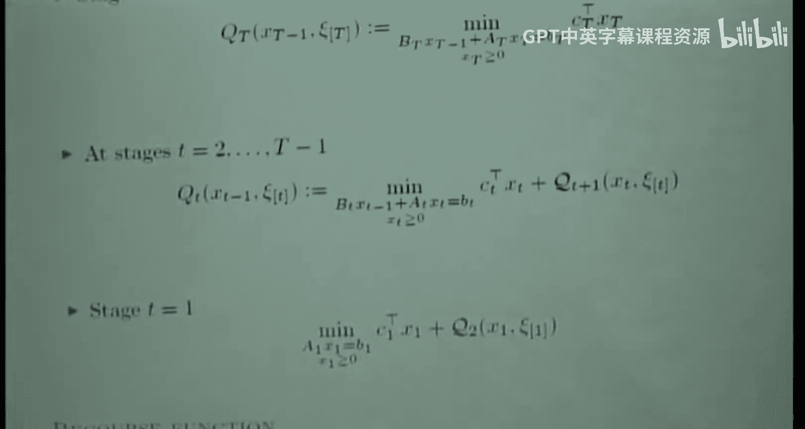

We call this the cost to go function。 that is the minimization of the cost in the giving stage T plus the future cost。

 and this future cost， I representing by this notation。 and it is the record function。

 the expected value of the future。 So make a decision。

 give stage take into account the the uncertainties that are revealed at that stage plus the future cost。

 Of course， at the last stage， we don't have a future cost。 We just minimize the cost at that stage。

嗯。Of course， to dealing with this problem。Computationally， we need to use a scenario 3。

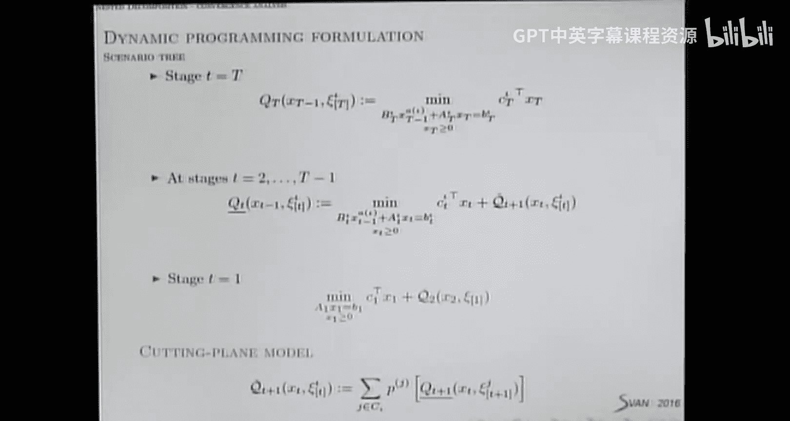

We finitely manage scenarios。嗯。In this case。Well。Not only a scenario 3。

 but we also have to approximate the requires function。And when you use finitely main scenarios。

 the requires function is polyhedral， convex polyhedral。

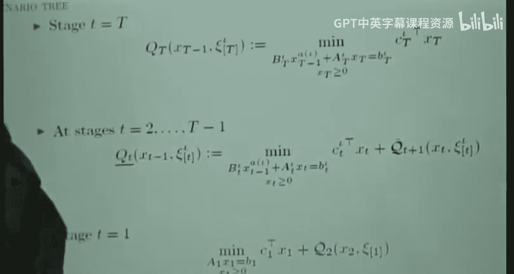

We approximate that function by。Some cuts， as we saw last class。And at each and at eacheration。

 we are going to solve approximation of the problem。 And iteratively， this approximation is improved。

Well， we saw that this Catar model， in fact， is the the maximum of some cuts。

 We saw how to compute those cuts。Well， the cuts are represented by this additional constraint。

So instead of here， we are minimizing。The cost of that stage plus the future cost。

 But we bring that approximation， a cut plane approximation， right。

 as con put here in the constraint of this LP。

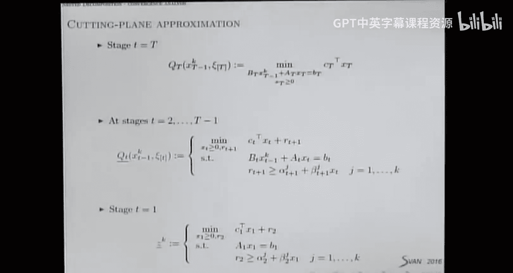

And。Of course。Last stage， No approximation because once you are。At the last in all， do you know。

Exle that there is no future once you are here at the last stage。So you make your minimization here。

And nothing the future to take it for you to take into account。The fact is。And I should write this。

Wtter。Stage 1。Stage 2。Stage 3， I was， I forgot to mention。

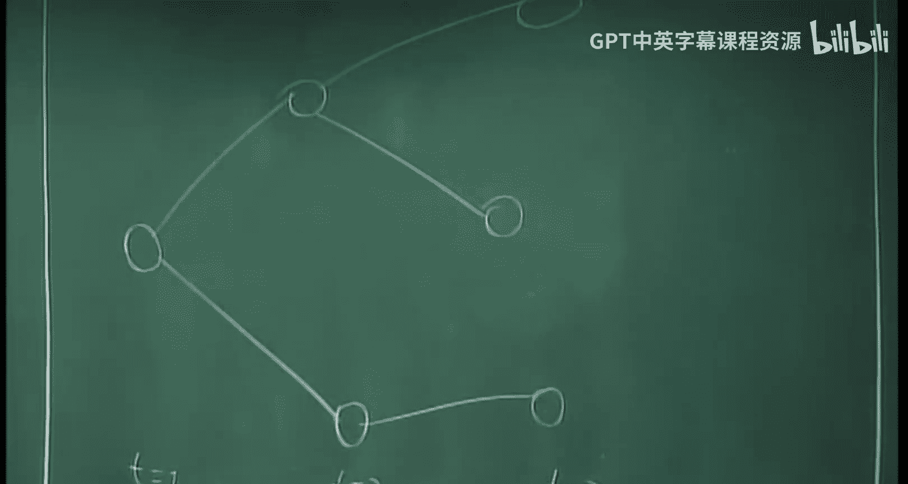

I made this of， these is slides available on the web page already。 So if you are watching。

 if you want to follow by these slides， just access the web page and download these lightss。

 Probably are you fix something and you upload again。Later on。Well， the fact is。

 when you make an optimization here at this node， we are minimizing。Bs。This future。呃。And。

And uncertainties， of course。And we saw when you consider finitely minus this function Q。

Is a polyhedral。And convex， something like that。You have another function。

That we want approximate here。And here too。Convex play。呃。Well。When we make。

 we started the nest at decom。There are two。Steps， a forward and a backward one in the forward。

What we do， we make a decision here。 The first iteration。

 we make a decision here without taking into consideration， into consideration the future， it's like。

You make the ultimate decision here。呃。And you don't care about the future。So you have a point。

 a feasible point here。You send this point to this node and the same decision to this node。

When you are here。You make another decision， and you are not。

 You don't have any information about this requires function。

 So you take a decision only paying attention to this node。 This is first。

And here you send another decision to this node and to this leaf node。And the same thing here， okay。

Here would be another decision。 And then when we arrive here， you have constructed a feasible policy。

So all the decisions you have made here are feasible。But they aren't optimal optimal decisions。

 When you arrive here， you have a upper bound。For your optimal solution。Here， it's。啊， lowerer bound。

Well， the lower bound is， well， we arrive make decisions and arrive here See those decisions were not too good。

 I have to correct them。So with the cuts， you construct computing the solution of these two nodes。

So we showed how to compute those cuts。 So when you are the last stage。

This is the average of the lagian multiplier multiplied by this run right hand side vector。

Here also the arrangement multiplier。The constraints are involved。 So with this cut， they say。

They are saying， like。Well， be aware you have to take into account the future。 and it's like。

You approximate。This function。For example， by this cut。Okay， you arrive here， you solve。

 You take some information。 Youll be some information here。 You see， my decision was not too good。

 What should I do。Construct that cut， and it will add here this linearization。 The same thing here。

 So I don't know， for example， this cut。Last class， I， I show with some pictures。Well。In fact。

 I cheated on that picture， those pictures because I put a sequence。 And in fact。

 you have one for each node here。 So it's not a sequence。 It's a sequence。

 When you make more assumptions， for example， stage wise independence。

 which is not the case for the general。Which is not the case here。This is more general。

And another thing。Every stage I， I showed you a tangent cut。 For example， here。

 this cut is tangent to this function because tangent here。But this happens only at the stage。

Because when you are optimizing。Well。Yeah。When you are optimizing here， you know。This function。

 you could evaluate this function correctly， because well。Your plan planning horizon ends here。

 so you can solve。This cost to go function， exactly。

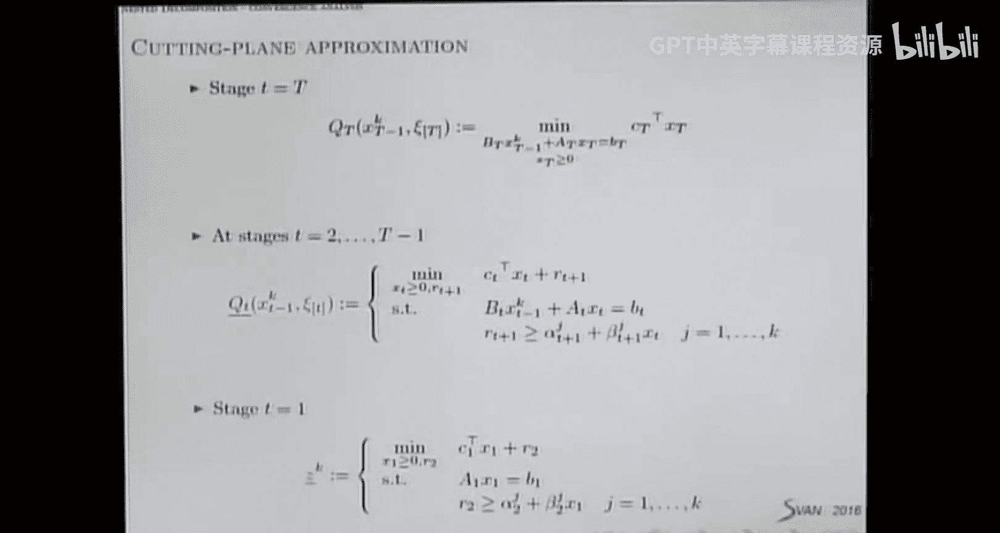

It's not the case here， if you come。Come back。It's not the case here。 you evaluate this。

 you can evaluate this cost to go function， exactly。We think the tolerance used for so program。

 of course。But here。You cannot evaluate this function exactly because you don't know this future。

 You just know it by approximation， bucket cuts。So what I want to tell you is the following。

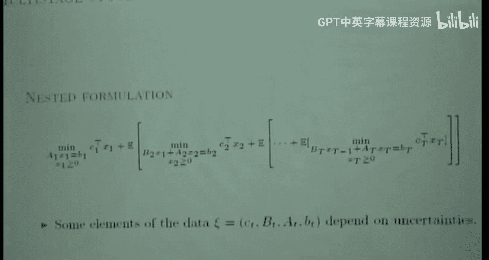

Yeah was here。

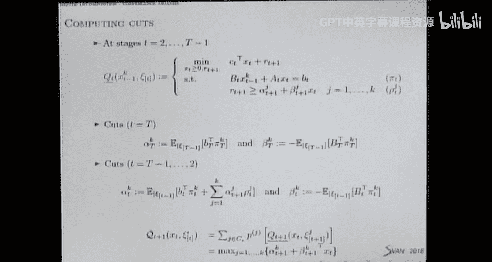

Is when you solve now， you move backwards。When you solve this node。

 take into consideration this information you brought from the last。The last stage。 So you have some。

 some information take into account。 So here， take into account this information。 do the average。

Like here。And to construct a new cut for this function。The fact is， when you solve this node。

 these nodes， we are we are。We don't know this function exactly。 Only those two cuts。

So with only this inexact information， we came out compute a tangent cut。 This cut would be valid。

We say that the cut is while。1 is under the function。But， it's not tangent。Well。

 let me repeat why it is， because you just don't know the future here。You just have so only this。

Peace of information。From the future。And when you solve now these node taking into consideration。

 not the real， not the the the true function， but only this cut。It's like。

 my future is represented by this cut。So you make a decision that's by no means optimal in this case。

But when you， you are using only this approximation under approximation， you get a lower bound。

For your optimal solution。Becauseuse you're not seeing the true function。

 but only a lower approximation。 And then so you define a lower bound。So， every time。You go forward。

 you compute upper bound because you are going to construct feasible solutions。

 If you have feasible solutions。 at the end， you have a upper bound。When you come backwards。

You are going to add more information in these functions。 And when you have， you arrive here。

 the first stage， you have a lower approximation。 When you solve this lower approximation。

 you have a lower bond。And for example， you go once more， you have a better。

Estimation of the low upper bound， because when you make a decision。

 I now I'm going forward when I make a decision here to go forward。I can see this cut giving me。

 giving me some information about the future。 This information is not accurate， of course。

But it's something。 So I make a different decision here。 Well。

 there is something that I should be aware。 There is something happen in the future。

 You make another decision。 Youll come here。When you make a decision here。

 you are taking into consideration this cut。So we are going to make another decision， for example。呃。

And another upper bound。 So when you come backwards， I don't know。 You construct a new cut。A new cut。

Here， so we have a better approximation for this function。So here， So here you come and you have。

Another cut in the first stage。And every time you go， so you do this。Many times。 And eventually。

 we are going to reach。Upper bound。Lower bound。 And this will happen when when you are making decision here。

 you have a。Approxiation。That's good enough for this function。

You don't need necessarily to approximate all the function。 For example。

 perhaps I don't need to to compute this cut here。Which is important for us is to。

 to approximate the function near to our regime that is interesting。 is interesting for us。

 our regime， where the optimum is。Okay， this is the idea。Behind the nest of the composition。

 iteratively constructing new cuts， approximating battery the， the solution， the， the fun， the。

Requids functions。Well， let me see if there is something。I should add here。Well。

 how to compute the cuts。 Those are the formulas。 This is for the last stage。This is for。

The intermediate stage， we show the last class how to compute that。 Okay， so if you are in。

 just check。They'll last the class， well。The cutting plane approximation is。When we define it by。

This average， it is essentially the maximum of those cut。For each generation， you add more cuts。

 you approximate， you， you can approximate better your real cars function。Well。

I know I have said this already， but I like to。24 size。You can approximate。

Compute tangent cuts at this stage。 when you are approximating the， the records function。

At last stage because our horizon here is 3。 Our requires function isq of 3。 And here at stage 2。

 you can construct。Teng Xian cuts。 when you come back。Not necessarily。But the idea。See。

 when you construct a new cut， These are co coefficient。 We are taking into consideration。 of course。

 the dual solutions。And also， the other cuts。That to have seen the the future。

 So when I'm constructing a cut for here。I far better here。

We are also taking into consideration the those cuts， the last stage， last the， the。

 the next stage here。So it's natural that you think。Well， when I have。This function。

Well approximated。I can compute。Tensent coins for this one。

So the idea is we are going to improve those cuts。As the algorithm proceeds。

As you approximate better the future costs。And this is the key for。

 for analyzing the congence of this method。

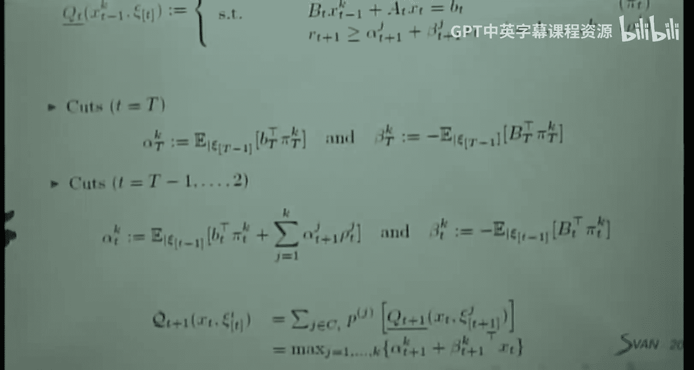

Well， I explained them the algorithm here is how it is written。I'm making an assumption here， that。

你思。Relative complete re course。 So I'm not dealing with。If you has a ability to cut， only opt it。But。

 of course。If you have a problem。In which you don't have this assumption of a relative comp complete。

 relative complete records。 when you make a decision here。And you send to this node， for example。

The the， the LEP here。Could be could be not feasible。the the feasible set could be non empty。

In this case， the solution you made here。Is not good。 Of course， you have to exclude that solution。

 How you exclude that decision So， Let's say decision。 how you exclude the decision。

That makes this node inible。 I have to add feasibility cuts。

This was already explained the beginning of the course。 So the idea is the same。

 You construct a cut like that。 liking for two stage。 The idea is the same。

But here to make it easier， I'm not assume that we are going to consider。F aibility the cuts。呃。

When we start this algorithm。We don't have any approximation for the future， as I said before。

 So we don't have cuts here。Then the first duration。

 you can just assume that this extra variable is 0。You have nothing here。

 and you make a decision on thinking about the present。

And what is said here from first itation define the R variable r equal to 0。And then you go forward。

 making decisions。And when at the end， you have a policy。 And with that policy。

 you have a upper bound for your so optimal value。Then you come backward。Computing cuts。

And you are going to do this computing cut solving。This。LEP up to the first stage。

 When you are the first stage， you solve you have a lower bound for the optimal， as I said。

 explained it。And we stop the algorithm when the difference between your upper and the lower bound。

Is small enough。And this algorithm， it's。It terminates in finitely， many traditions。

When you have a scenario 3， finitely men scenarios。And why its。Finally many steps。It's because。The。

 the records functions are polyhedro。They can be represented。 So it's pretty hi。

 Every television you do， you add more cuts at the end。For example， last stage。

 you have all the cuts added。Perhaps not all the cuts。 but for example。

 at the the region at the minimum where is interesting for you。And when you have this regime。

We are approximated。 you have this region for this function。 We are approximated。

 You can have tangent cuts for this function， and you can bring this up to the first stage。And well。

 you have finite many cuts here。Possible cuts。 You have finitely many possible cuts here。

So at the end， your approximation will be exact for the solution。 exact。

 will be an exact approximation for the function， at least in that region。

And when you minimize in this node， you are indeed minimizing using that those cuts。

 Those cuts can represent a very well the future。 So when you are minimizing here using all the cuts。

 you are indeed minimizing taking consideration of the future。And finitely men cuts。

 you are going to have finitely men iterations。You are going to close this gap。

This is the idea of the， the proof。Of conversions。Well， perhaps I should give him some more details。

So those are the assumptions why you read， I drink some water。

You are considering finitely men scenarios。The problem has records relatively complete。I was。

Say this wrongdo， sorry。And let's assume that the feasible sets are compact， are bounded。呃。

Why this assumption。Because when you are optimizing。For example， here。

 and you don't know very well the function。This optimization， this node can be unbounded from below。

 And you mean might you get minus infinite。 We don't want this。

 So we consider the feasible set bounded。 That's the common assumption for， every。

Cy plane based algorithm， without regularization。When you put， for example， a quadra theorem here。

 then you don't need to assume compactness。And also， when you are dealing with a compact set。

 you can ensure that there is a sub sequenceequence that cons to a completion point that's。

They mean assumption。Well。We have thislemma， that says。

The the cut plane approximation is a lower bound for the cost to go function。And this was proving。

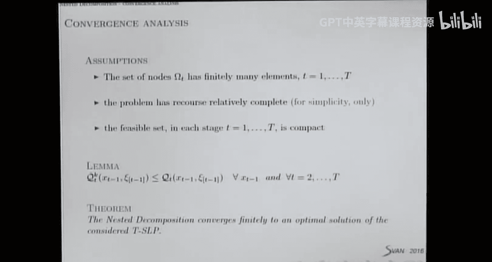

Proven in the last class， not like I put this lamb。 And let's prove it。 No。

 but when you compute the cuts， we gave the formula。 I don't know if you remember。

 but we use the subient inequality。And that you are using the sub sub gradientientent inality was something like that we were using at this stage。

第一。😊，I remember I rule here like why。嗯。So， I use it。The subgraient inequality。So， for example。

 the tu K。This。喜欢。Oh。Well， we had the computer us so be gradientdiant。So， the formula。

I don't remember now， but the expectation of some。A multiplier。

 the matrix B and the a range multipliers。

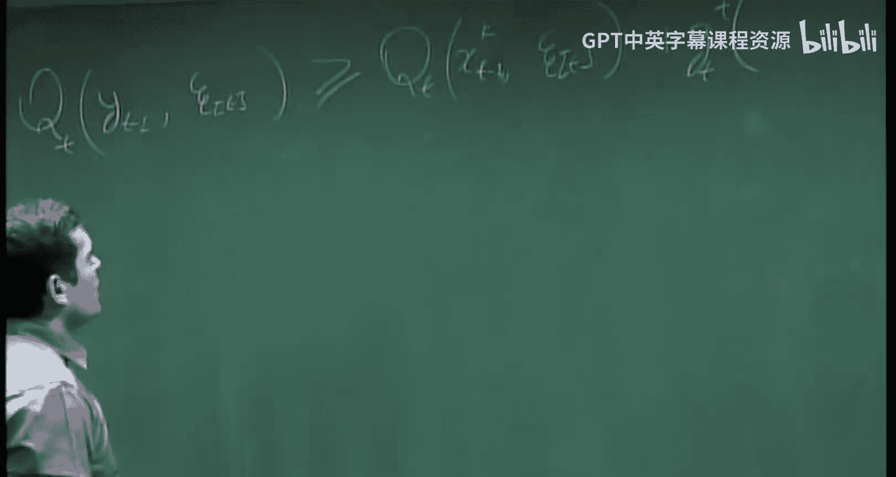

And here。So to to computeー does cut。To show。This formula we use we start from this inequality。

And here we use the dual all of that。

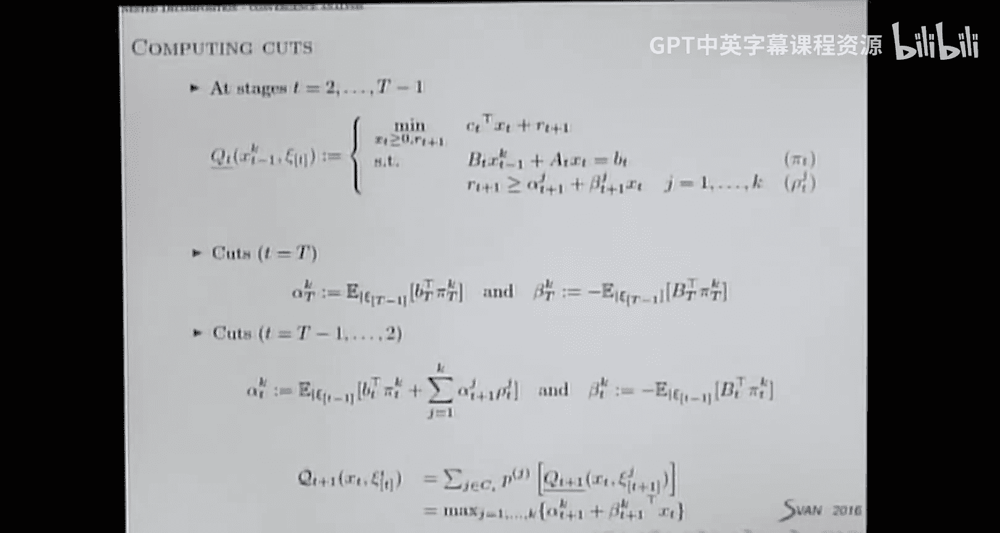

S problem。 and we end up like。I don't know if you remember， butum。

We did some math here and arrive at this point。And well， this is a cut plane。

 this is a cut App the function from below。 If you take the maximum of a many cut， for example。

 if you take this holds for every J。

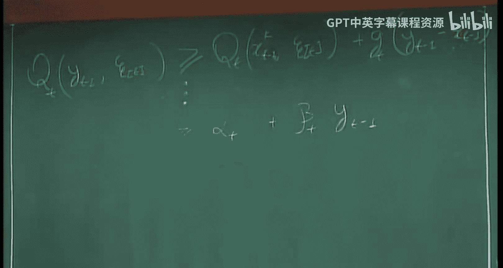

Can look like that。So if you take the maximum these， with define fine。Approxiation。And， of course。

 this will be。Less or equal to the。Thepecttic divide。Of。Disfunction。哎。X， you choose。我可以说。

It's natural。That this。Inequality holds。 This is by construction。 Re construct is inequ。

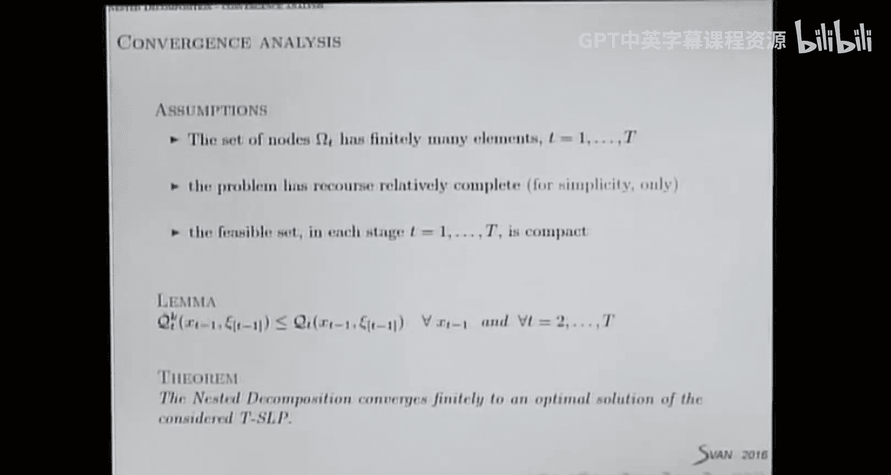

啊。Well， and now comes to this week。Comes we have to， to prove this theorem。

So the nest of the composition converts finitely to an optimal solution of the consideredate。

Muld stage sia program problem。Well， how you prove this。Well， I I basically have read it。Proven。

 just with this discussion。嗯。Let me give some more details。Fsible set。Is compact。

So we know that there exist。A sub sequenceequ。It's accumulation point， okay。These right know。呃。

So it means that this there is sum aid。We accumulate in a certain region of those functions with the domain。

 some some region。 And if you do this， if。The iterator are accumulating here。

 every iteration you are constructing a cut。 So it's natural that we are going to approximate that region。

 For example， at this stage here。So。When we are at this stage。T-1。啊。This is。好了。

Cut the plane approximation。Wait。-1。Philippe， you know， it's very well。T-1， right。Okay。

And our constraints。X T-2。 This is 2。Okay。But if you are accumulating。In a region here。

 you are generate at every here。 You construct a tangent cut eventually， after someiterations。

What we are going to solve is， indeed。The through。Records function。After some iterations。

Is this clear。Because here's tanggenent。F tangt。Think about infinite， many iterations。

But the function can be represented by finitely many cuts。 At the end， we are going to repeat cuts。

Right， and if we are accumulating a certain regime here。So we are going。

 we are going to construct the cuts of the function in that region。So eventually。In this case。

 for this problem， we are going to solve use this approximation Cat approximation。

Coins with the true records function in that regime。

 At least in that regime that we are accumulating。Okay， so when we are making a decision here。

Eventually， we are already seeing all the future， all the information in the future。Okay。But。

 remember。At this point， at this note， we just construct at the beginning。Cas that。Ire not dungeant。

Because we don't represent well this， this function。 But when you represent well dysfunction。

The cuts here you be， indeed。干ient。And we already know， after finitely manyiterations。

 we have a good approximation here。😊，Fitely mini a very good the the the function you coincide。

With the aum approximation。So it means that after finitely manits。

 we are starting to construct tang cuts here。The function is， again， polyhedro， finite many。呃。

AP O I linear。And then。We're going to construct。T giant cuts。 At the end。

 we have a good approximation for the function here。And when we are going to minimize this node。

That is， let's move to the first stage。We are going to solve at the first stage。

We assume that this feasible set is also compact。So we are going to accumulate in a set of regime from of this visible set。

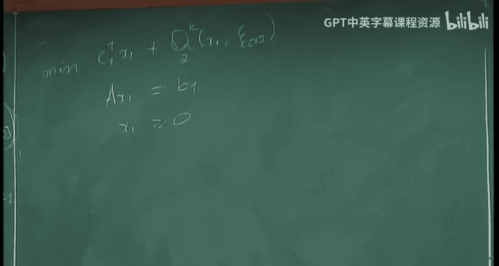

And as I explained， eventually， we are going to construct。Tshine cut。Pace cut plane。Approxiation。

 will coincide。Indeed。With the。Records function。So。When you are solving this。

Late after some iterations， we are going to solve。 We， we will be solving。This problem。

And this is the problem we are going to do we want to solve the real want。

So when you make this minimization， But， of course， using this approximation， sorry， here is is this。

Check。Here there is a check。 He was， was missing。We will be solving this approximation。

 but the approximation coincides with this function in the region。So when we minimize this。

 considering the cut plane approximation。We are going to get a lower bound， right。

 When we minimize here every time we minimize here， get a lower bound。

 So minimize this will be equivalent equivalent， sorry， to minimize this。You have a lower bond。

But when we are dealing with this function， we are seeing out the future。

 So the point you get here is also upper bound。And your lower bound。

 we coincide with your your upper bound。 So you close the gap。The math of stops。

So the decision you are going to get here after finitely many traditions is。なん to say。

We will be solving this problem。And， the method will stop。呃。The method works。 It's。

Many people use this this algorithm。 I would say that is the main algorithm。

For a multi stage schastic linear program without more general。

 here are not using so much assumption assumptions on this stochastic process and no assumptions。

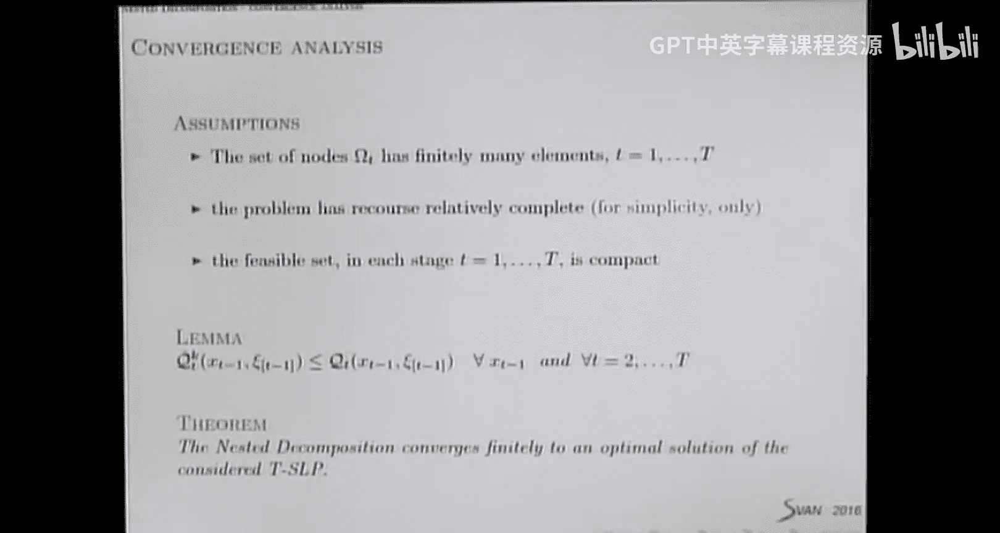

So I would say， this is a。A very powerful method for dealing with these kind of problems。

It has so advantage。Of course。 And one of the advantages is the following。

For you to have a good approximation your cut approximation coincided with the function。

You have to gather all the cuts you have constructed up to is iteration K， the last durationeration。

You have to have to keep out the cuts。But you have all the cuts for this stage here。

 you have to gather all those。Lines here。 I'll discuss。But it's the same thing for this node。

 for this node。 And for in the scenario 3， you have many nodes。 So you have to save a lot of cuts。

So this is a drawback。And then。What if I delete some cuts。Well。

 I think there are some research on that。 You can delete some steel keeping。

Convergence is still can have convergence， however。You cannot have a a limited amount of cuts。

 For example， I want to con to have at max at most 100 cuts per node。I think this is not possible。

 If you have this， you can lose converence。 Okay， this is。First， drawback。A second drawback。

 This is a kind model， in fact。And catipplan， this is a caplan method。 and the cutplan methods。

 they are well known to have stability。 so you can。

Although you have a very good approximation for the function here。 But when we minimize。

 you can have a point in one side or a point another side。 many。

 many if your function is flat in some regimen， for example。

Sometimes you can get a point in this side。 Suppose this the optimal value here its。Divative is 0。

And you can have points jumping around here。And this gives you some stability。

 So it's ideal that you have some sort of regularization。 There are some a new research。

How to regularize this kind of a method。Well， but。I would say it's， it's a good method。 does the job。

 It does the job。Do you have some questions about this method。

 Because now we're going to change subject a bit， another method。Oh， it's great。Okay。Well， let's。

Instead now up。A particular case of multi stato castia programs。Those programme。

 these programme are called blocks aparable recourse。呃。An idea。Is that。Your requires function。

 matrix。It has this。A form。And also， this matrix B。So with this particular form of those metrics。

 we can。Exploit。Some characteristics， and。Develop some methods。That might be。

More efficient than this nest decomposition for some applications。Well， these some applications。

One thing that we should keep in mind when dealing with his stochastic problem is the phone。U。

We should not。 This is a herd somewhere else。 We should not fall in love for your。

Method saying this method is the best。 I like that method。 And I will apply for in every。

Problem stock has problem I will deal with。So。This is not a wise。Position。

 you should fall in love for your problem。You should know very well your problem。

 very well your details。Because you can use， explore the characteristics of your problem and design or use some more appropriate method for them。

 So I wouldn't say that this one method is the best you can use in every case， no。

There are situations。 And one method is preferable than the other。 Okay， and this is a case。Well。

 where in which I think。Just cattyine approximation is more appropriated than this nest at de composition。

 And I would try to convince you about that， for a particular case。嗯。Well。Let's see this。

The idea of this kind of problems is our decision variable X， we can compose it in W and Y。诶。

Think of why， as investment decision。Sorry， W as investment decisions and why as planning decisions。

 So you have a network。And you want to expand your network， and you want to plan。So， for example。

 at this stage T， this is the amount of investment you have made along the， the the。

 the planning horizon to this stage。And why is only your planning and what you are planning。

Today will not impact the future， but your investment decisions will import， will impact the future。

Let's think of。Naturalero gas network。So you want to make to plan your horizon， I don't know。

 some years。And you have a network with some pipelines。 you have。

Some unit processors to separate gas or to some compressors to put more pressure for the gas to flow into the pipelines。

You have the， the possibility to make more investment in your network。

 You can construct more pipelines。 You can construct more unit。Processors， processor processor units。

 you can buy gas from another part， import。呃。And this is。These are the decisions。

 investment decisions。 And when you have a decision for Acity， you have some pipelines。

What you are going to do， you are going to plan your network to meet gas demand at the minimum cost。

And when you are planning at that stage， you have to take inter consideration how the investments you have done。

 how many pipelines I have， How many contracts supply gas I have from and。

When you plan for which pipeline I'm going to use amount of gas， this will not impact the future。

This is only locally。 only at that stage。 What will impact the future is investment because at that stage。

 you can also make a not investment， saying， well， the the number of pipeline lines I have。

It's not enough。 I should construct a new one。 And when I construct this new one， it will be。

 you can， you'll be working and， I don't know in two years or one year。 But at that。

 how can you say that I am decide today to construct a new pipeline。And next year， it will be ready。

 I can use it。You are going to pass through this。W information。Okay， this is an example well。

The function is linear。 You can also break these cost C， depending on W and y。

And according to this fun， to these matrix。That structure。So at the stage team。Our constraints。BT。

Well， if we use that structure， this will be equivalent。と。Quality。Plus。다에。This will be equal to。知。

call on here， S。Plus。And well， because here we are using that。X。第。And that structure。Those。

 two systems are equivalent。And what's interesting here is。In this block of equations。

 we don't have y。Here， we have why。On this part。 So think about that example of investment。

 You make some investment， and then you have to plan at this stage， you plan。Wi。

You also can decide investment for the future。But when you go to， to others stage。

Think about this system with T plus one。What takes into account， let's think about this。

 But the previous。stage， we are only depending on W， only the C in the investment decisions。

 not in the planning decision。Well。With this。Let me write。Cos the go function。go。哦。This is。一個。

To the minimum。WithThis cost with respect to。Verable W。Tranpo Na。No with a variable， y？嗯。

We can write here。Number3。YT。And this system。Yeah， forgot。Okay， the same thing the same problem。

 just changed the names。I'm just exploiting the structure。In fact。And。This is okay， this function。

That I can write like that。But although we pass。This y variable we are not taking into consideration here。

Not。T-1。 He would only have T。So， in fact。That information is not useful for the future。

If it's not used for the future， I can come here and just say， okay。My records function only depends。

On那边。Okay， do I agree。Well。Let's go further。See， we don't have the same constraint。W T and Yt。

They are not mixed in the same contraint。So we can write that program。S。The没。Here， just in WT。

There is nothing more， depending on WT。Plus。The mean。Now， sorry， here is the W。Is why。Plus。

 our records function。

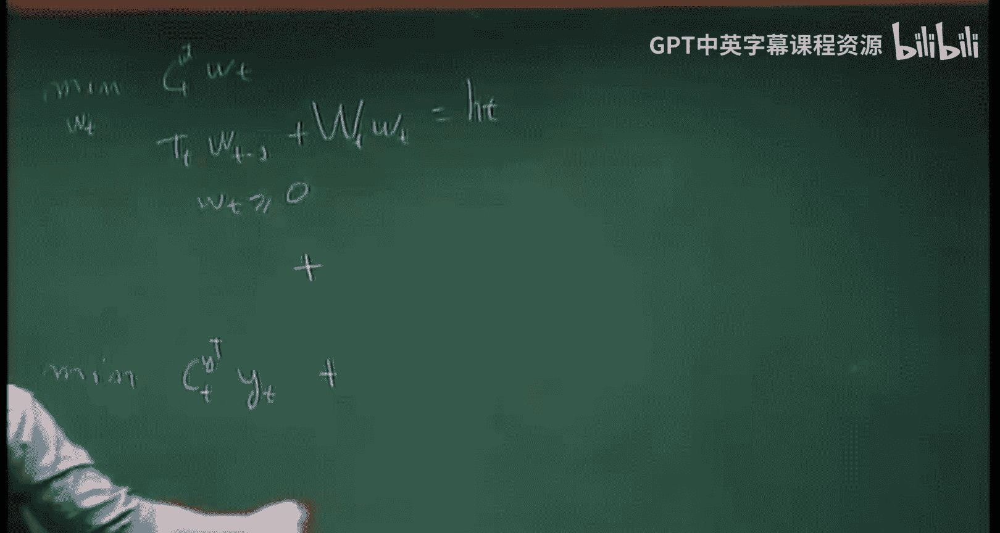

That depends os。What did I do here？Okay， no， no， no， no， no。In fact， this。Is he。Sorry。

This depend on that。So we have a problem。Priimization problem。Over the y variables。

 And here number variables this minus plus。You can split this sub problem into2。One is requisive。

 depends on the future。The other one， no。Any decision we make here and why？

It's not important for the future。I'm just afraid here that I think what I wrote。These lights。

It's not the same here。 I think I made a mistake with the notation I change at some point。

And I think I change for it's here in the blackboard。Is that correct， if I multiply。

Is this equivalence correct， I think I I made a mistake here。I think it is right。啊。No。

 I'm just multiplying these matrix。By the vector， x， but x is W and Y T。 I think it's okay。

So my mistake， I think， was here in the daylight。Let me see。Well。Okay， yeah。O。Well。

This I have just written。So the idea is， we can。I split the cost to go function。Into two parts。1W。

Here。That this variable W impacts the future is investment you are doing along your network。

 for example。Along the planning horizon。And this only planning， decision， investment and planning。

Okay， so I think it's yeah， the same thing I wrote here。So do you see some advantage of this。

Philips sees， what's the advantage， Philip， You can speak in Portuguese if want。Yeah， indeed。 he he。

 his answer was， well， we can solve a smaller problem instead of a bigger one。

 instead of solving this， we can break into two smaller。So the problem， it's true。There is another。

Avantage is the fact。But for this， I I need to have more exemption。Suppose that investment decisions。

 Y have a smaller dimension。So we can， We can pull all those variables to the first stage。And。

You are not going to have。A requires function。 You are going to write like you write a LP。

 but you get all those variables and you pull it to the first stage。

 Put everything together at the first stage。 It's like。You make the decision the first stage。

 the the investment decisions up to the first stage you decide investment along your。Horizon。

This is not clear， but we will be。呃。Yes I thought I had had made a mistake， but I no。

 I think it's so。It's okay。So the idea is， I can get all those investment decisions。

 bring everything here。And I have this expectation over the， this function。But this function。

Doesn't consider the future。 Its only locally。So we don't have that idea of the nest that the composition that we have to approximate at every stage。

 and one node。In the nest of decomposition。This node talks to this one。 This one talks to that one。

 So you have a cut。 This talks to this， those two。Talk with each other， and give a cut。But here。

 we don't have this link， One node link in the other。We can just break these links。

Because you put everything， the the， the decisions。

 the coupling variables you move to the first stage。Is。Well， no， in fact。

 this you can do doesn't no matter how large is your。Decisions， the vector。 But in practice。

 it's interesting when。The dimension of for W is small because we are going to put。

To pull to the first stage， all the， the decision you have to make along the nodes。

 You have many nodes in the tree。 You have to bring all of them to the first stage。

So if this vector is big， you are in trouble。Because this part will be really large。

 And these parts are not going to the compos。O。So。Is not a general method。

 but sometimes in some case， it's useful。呃。The idea here is when you make an investment decision。

 we are going to decide the investment， we are going to plan your network at this node。

 The decision investment used it to plan your node at that stage。And so on。AndHe do have。

But I don't have a communication one node to the other because you broke that link。

And you pulled everything together， the first stage。So in this way。

 we don't need to approximate the re functions here at these nodes because， well， indeed。

For each and old， you don't see the future。 There is nothing in the future。Well。

Just changing a notation to be easier to present。Now greatith method。Well， shall I write an example？

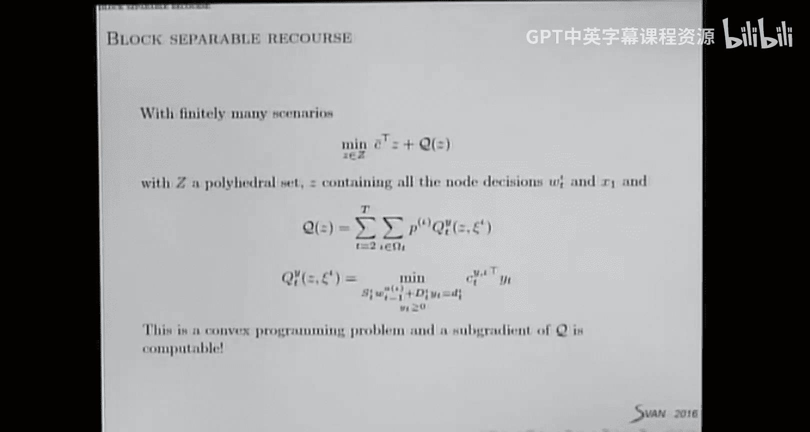

Perhaps it would be better if I write an example to understand better。This， make it clear。Okay。

That's an example before we move to that notation。Okay， you consider a small。谁哪就。3。

There's a small one。So this is my first node。 Ill give a name to it。 I won。This will be I2。

So the optimization problem based on this another3。Oh， I have to write a lot。But that's cool。

Here's the probability of reaching。This note。Times。The cost。Of minimizing at this stage to that node。

Puse。Here， the probability。Oh， sorry。 couldn I don't need to write this medium。

I want to write like that。This probability of the older node。The costs associated to that node。

How comes Disney node。Continuous。Here。Probability of reaching that node。啊。Okay， this is the。

 the objective function。So this I'm taking account the probability， the expected value。And。

 of course， we have this。笔记。But we are taking into consideration the nodes。The notess。Here。

 the ancestor。The fact is， when we break。This linear program program。In two variables like that。

Can up。 We will end up。In a more interesting rotationation。So you know。For this node。So here。

You can write， like。Minimization。X1。Here。I can。Okay， write only for W。But here depends on the W。Oops。

 there are probably bits。3。O售完。What wise will be。Here is stage 3。And now comes the part with。Plus。

 the part。Involving。By。And our constraint， we can write it like。This will depend。Everyone。Plus。

This depends on scenario。T。W depends on。Yeah。P。And you can do everything。

 This for al T and our nodes， and then comes。The part。The vector， why。And。Wish your call。

The variable x1 then comes W， all the ws。 we call it Z， for example。Z will be。This variable。X 1。Then。

 the W。Part of this node。Second stage。Second stage， on known。Third stage。Is 6。Okay。I call this Z。

We can。

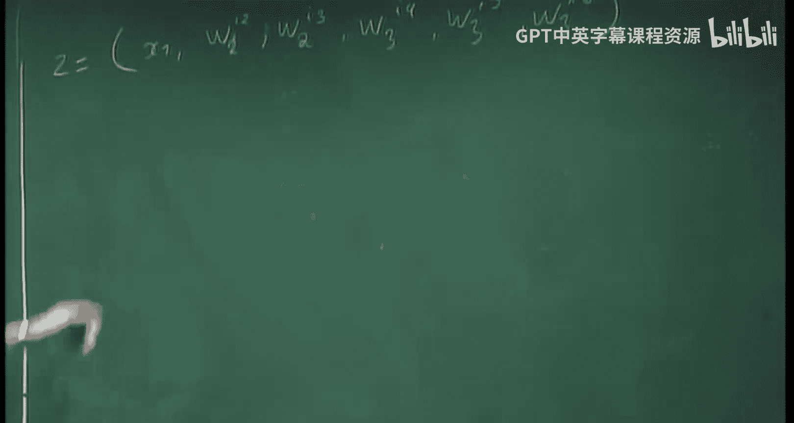

Also。He aggregate paid the costs pondated by the probability， and Ill call it C。Okay。

 here will be vector C1 here， the probability。Times。And so on。And。Well， with this notation。

We can write。This optimization problem， this set， capital Z。All the。

 the constraints involving x 1 and all the Ws。ok。I'll call this。Z。ASet of linear constraints。

 So set is polyhedral。No problem with that。002。Cost， plus。The cost of your investment。

 This is the cost of your investment， and this is the future cost of your investment。

 But this function Q。Is this sum。Of these small functions。

 the require the cost go function depend on why。I have erasing， but I have the the previous slide。对说。

So you have to take into consideration all the T。The horizon。And the uncertainty none。

Impact the marked resort costs。I have here， sorry。The interesting thing here is that， well。

 we can split this function as a sum。For each and node， you solve this LP。

And where it is interesting for that， each and old， for every node。

 you make an optimization and you don't care about the future because the things you have to care about the future。

 you brought everything to the first stage。Well， this is a convex problem problem。

And the idea that show this function is convex。 We already know that this function is convex in Z。

I'm passing Z。But I mean using WT here。 it's just because of this notation。 you pass the all the。

 the entire variable。 In fact， you don't need to do that。 but you can pass the entire variable。

 but there。For the locals of the problem， you get only the part that you need from that vector。Well。

 this is convex。 So a sum of convex function is convex。 This is a convex optimization problem。

Is non differentiable。 why， because we know。That。The super differential of this function。

Depends on the dual all solution here。Remember。Well， we can， we can write if you dete。This function。

外置。See。So far given。Nots， for example， with a to， I don't know。Put T-1。This will be differential。

Is minus。This mattress。You know， depends on your node。Times。This set。This is a set of solutions。

Augms。W。Nothing new here。 That's just， I think there is a transparency。

This things we saw into a stage。 Then started a multi stage case。 And for this case。

 just giving different names。 but the idea is the same。So if you ensure that you have only。

An optimal solution。For each one of these sub problems， for every stage for， for， in fact。

 for every node of the three， you ensure that this function。Is differentishable。

But this is a strong assumption。 You may have many solutions in infinitely in infinite many solutions。

 And in this case， the function is sub， Sub financialiable。

 And this is the sub with respect to one coordinate。

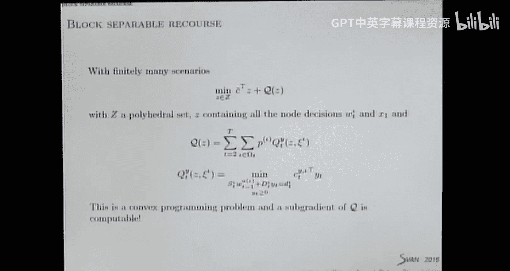

Well， you know one。But our function here is the sum。So you can。

 you compute a sub gradientient for this。Function， and then we just sum。Of course。

 we are taking this derivative respect to a block。Of this vector。So， in fact， we are going to sum。

For a sub gradientant of that function。Do I have。K is a vector。This part， we have。

This is number number of blocks。So， let's suppose。And here， in fact， we have all the。

The dimensions from。J equal to y-1。 All the dimensions of a variable。W。Jame。Because， well。

 you are taking to you are we we are devating with respect to this block。

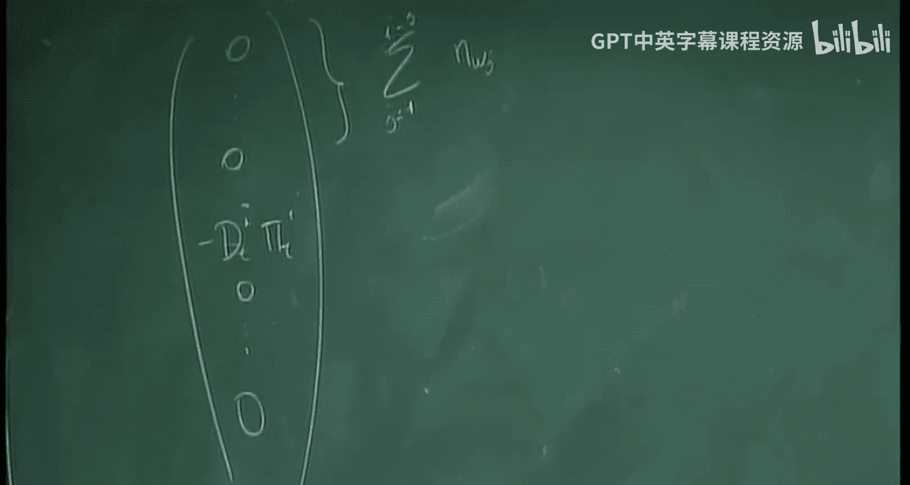

But the fact is。Then use sum with respect to T and all the nodes。Vectctorors of that form。

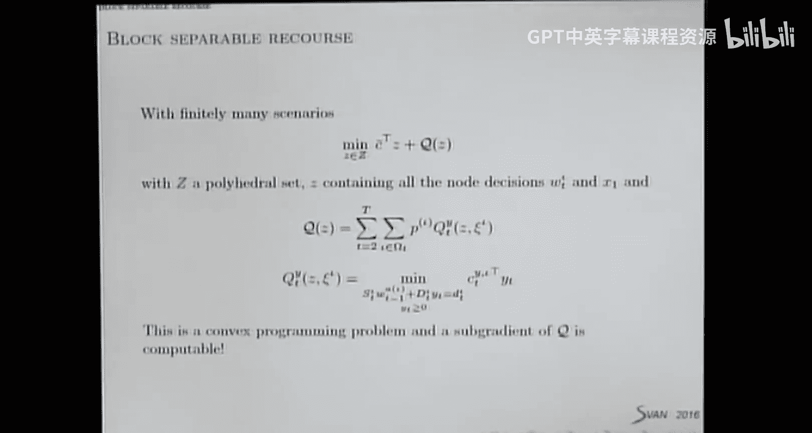

Depending on the the， the sub differential， you have this block moving， but you make the sum。

 you have a sub gradient yet。 So if you sum here。

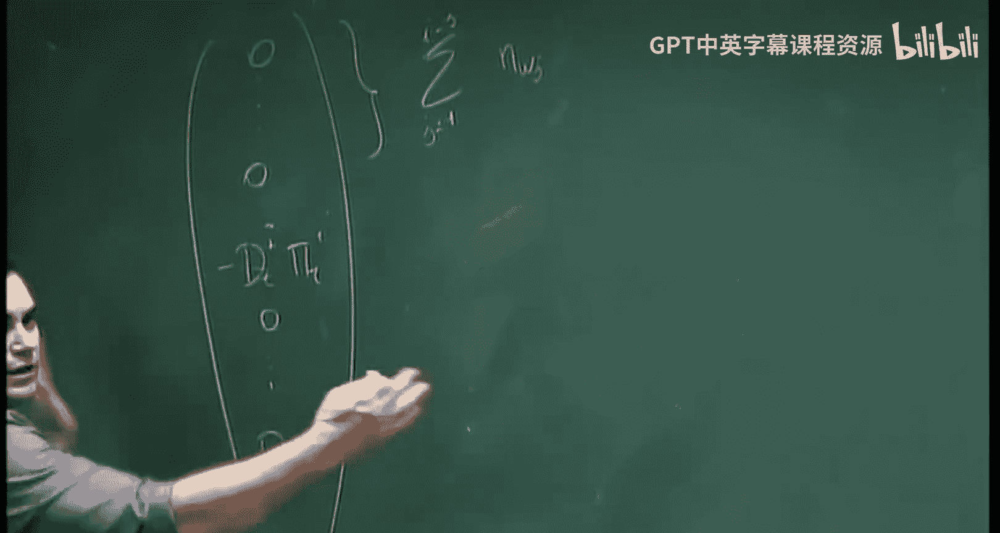

audit的ity。All the， the nodes。Then we get a point。 that is。In the sub differential of this function。

 So it's not a big deal to compute this as sub gradientdient for this function， okay。Well。

 we can use the simplest method， not the simplest， the simplest of the gradient。

 This is a cut planning method。

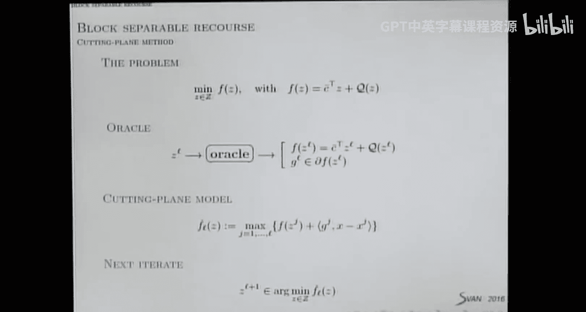

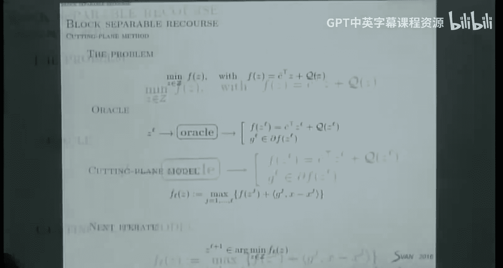

Well， not yet。 here got a pen mode。 But the fact is this is the function we want to solve to minimize。

Over this feasible set， we can construct a black box or an oracle for each。V or Z we give。We can。

Sove。One of those。LEP is for each node， get a duals variable computer sub gradientient。

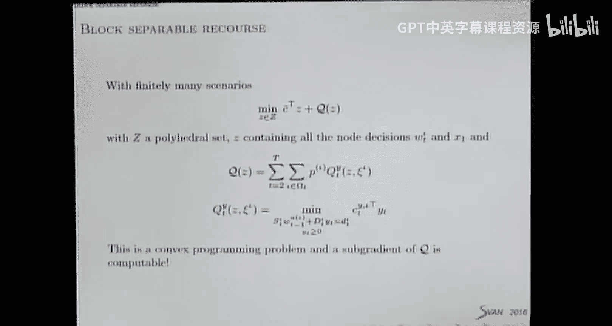

And。We have， you can just sum everything。The function and a subient for the function。 That's not a。

So， difficult。With it is oracle information， you can keep it along the pro iterative process。

 You construct a cut model。And at each generation， you can just get。Minimize this model。

So we don't have records that idea one node to communicate to。The previous one， the father and so on。

 No， you don't need here。 That's much simpler。The price we are paying for this is。

These variables Z can be really large because you together all the variables W along the node。

 This is why I said this is this method is interesting。

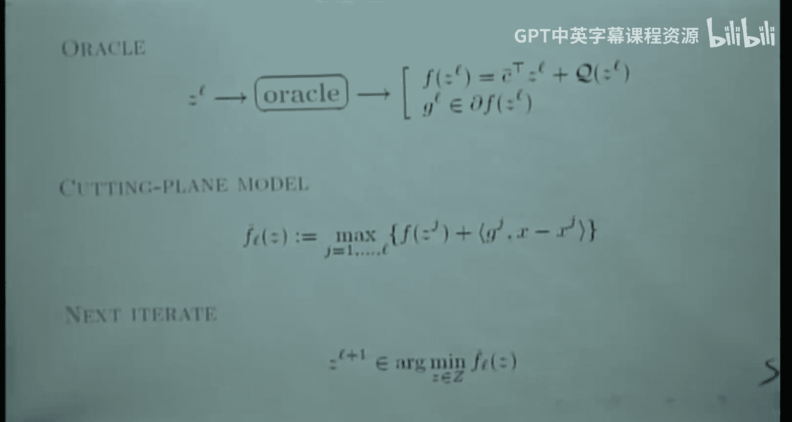

When the the dimension of each variable here is small。Because。This is LP。If can it can be。

Reretty large。Well， the algorithm just to remember。

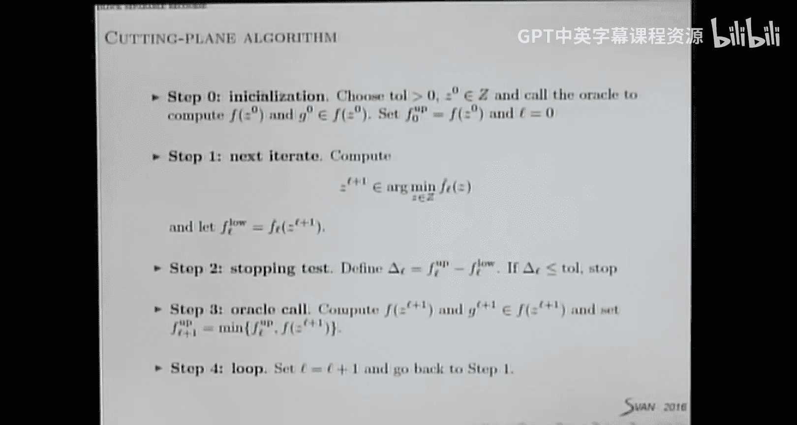

Well， meization。 we need a further lens to stop an initial point。 And that's a feasible set。

We called the Oracle。Compute the value of the function at that given point， a sub gradientdent。

 we can define。 well， that's the only value you know so far。 This is the upper bound。

And then step one， you compute the next deterator by solving this LP。It's clear that LP， right。

When we solve this LP， well， the idea is， once again， we have polyhedral function。

This is polyhedro Y。 This function is polyhedro F。Because the sum of optimal value of LP。

So have finitely many LPs。 your sent together this a convexing polyheedro function。Well。

 ideas at at each edition， were going to add。Cuts， approximating this function。Well。

 when we minimize the model is we are going to minimize this model here。

 that is the approximation we have for the function。This will be。A lower bound。So we test。

If the difference between up and lower bounds are small enough， we stop， Otherwise， we continue。

Call the Oracle in this new point。Computer the value of the function。 sub gradientant。

We updateate the upper bound。If this point gives us a better estimate， good， we update。 Otherwise。

 we keep the last one and the better approximate。Because we know in cutine method。

This is not monotton。You cannot ensure that the sequence。Fz L。Is mono to fuck。Can very oscillate。

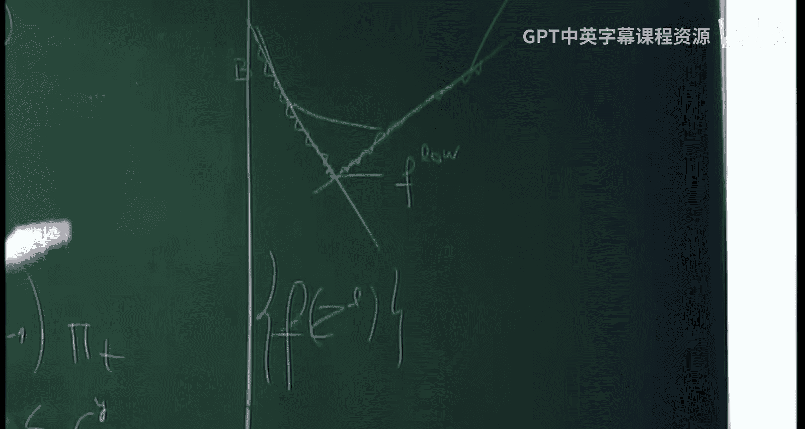

And网。Once we update here， we update the iteration。Counter and restart。And your continue。

 start on the conum over here。And。Well， this atic brain math you have already seen。

 cloudud has already explained the approved shiprov conversions。Of this method。啊。Well。

 we give a toleranceance。Suppose this， this feasible set is compact。

And then they could algorithm thes optimal to multi gap lower than a tolerance and smaller than a tolerance in finitely many traditions。

呃。So， in fact， this Zbar yielding this yielding this upper bound is。Approximate solution for your。

Probably not。嗯。Cuddia approve the conversiong of this cutplan method。

I have all another conversion and I approve。 I think it's shorter， and I like it。

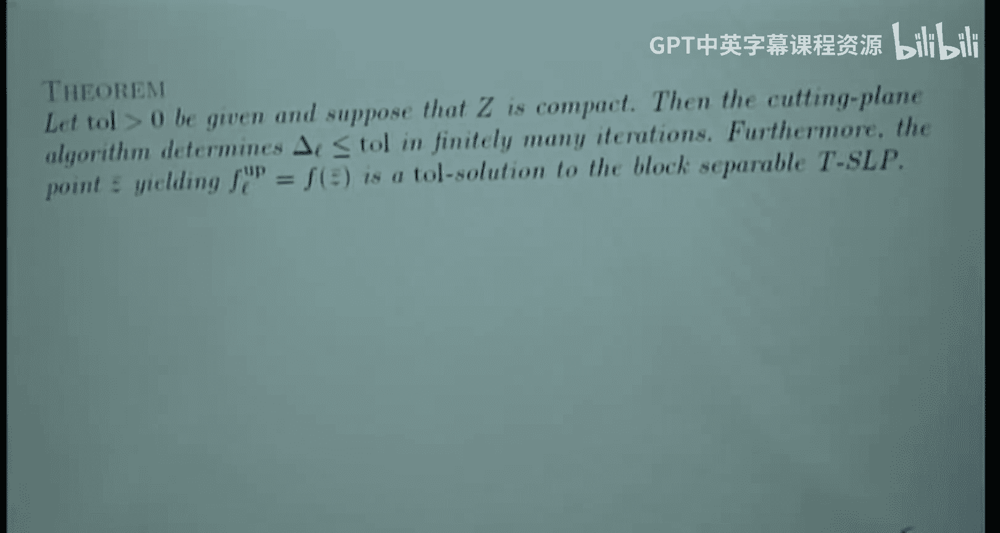

I'd like to share it with you。It's really simple。In short。

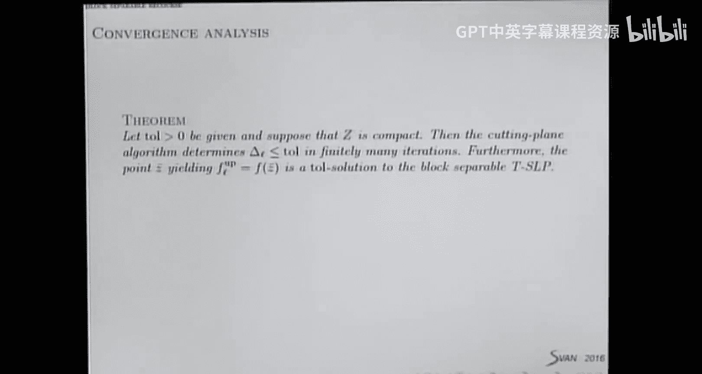

Well， after each generation。We know that。By our definition。This lower bound。

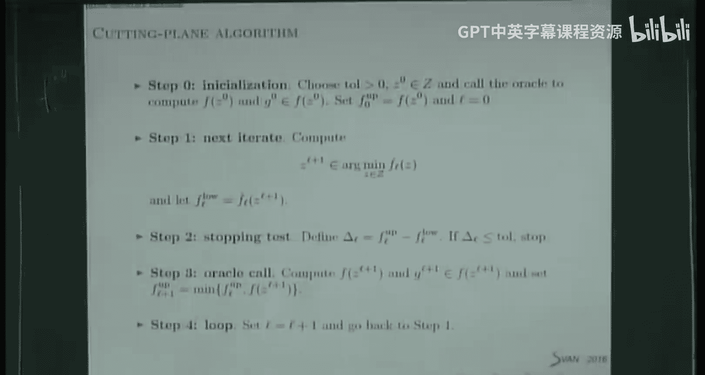

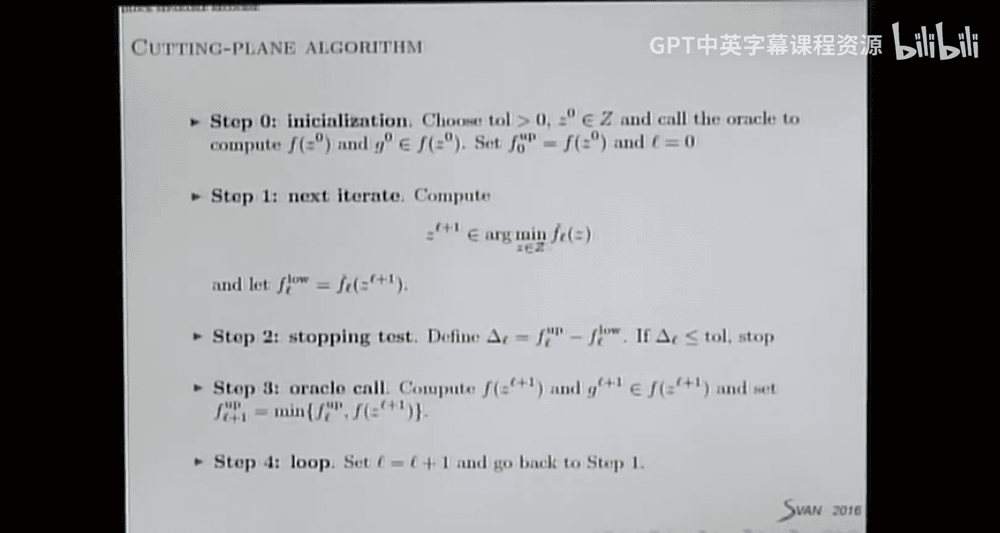

L。This时光。2。Ds model。Ititation。L plus one。This is our definition。

 The definition of the cut plane model is。The maxs。Maxum over all the iterations up to iteration L。

off。Also the啊。But I'm at this point。Okay。So I'm taking the maximum of all the cuts。In particular。

Get any cut here， for example。A。That's true， right。If I is smaller than L。This is true。

We can continue。Right like this。Of Sch inequality。Well， we are assuming。

That the feasible set is compact。Our function， we know， this convex。

W means that this sub gradient compound is bounded。 So there exists。

A constant bound is sub gradientient。All will be financial fact。This is a constant bond in this。

And also， this is。Any point in the past。Well。It's worse than our。Upper bound at that iteration L。

 because these upper bound by definition the minimum of all those points。Okay。Now yeah almost then。

Because if you pass this part to the other side， and bring。I flow to this side。 we are going to have。

It's bigger than。Yes。Elements， minus F。来了。Divided by this constant。Hes the best upper bound we have。

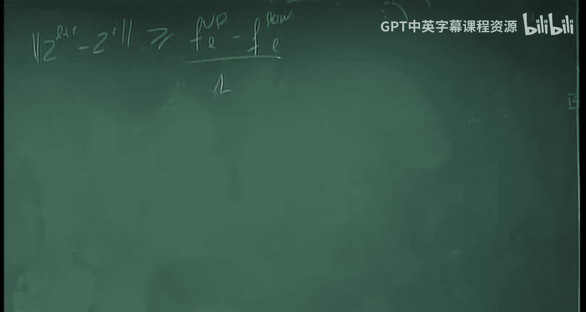

Like we define here。嗯。Is the best of all the the the， the， the value of the function。By definition。

 it's the best。Bunt。

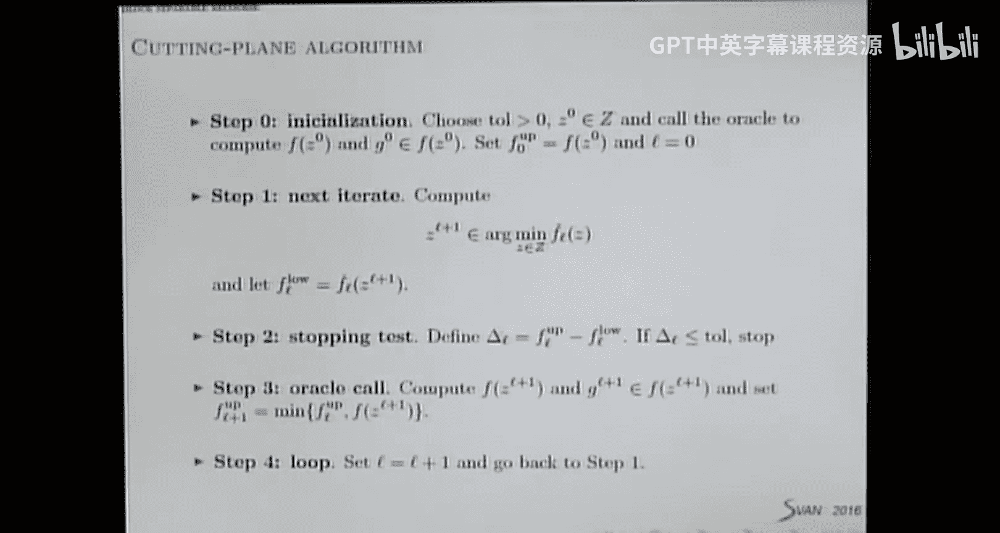

No， it's not stars。 This is I， sorry， it was looking like a star。Is I any iteration。

This upper bound is better than the the value of the function ever。Igieration。Well。Better。

 at least not worse。呃。Here we have the gap。And this is our constant。Okay。

But this eye is can be anyone。Any eye along the tradition。So， we can get。The feasible sets compact。

 So we know that there exist a sub that cons。We can just take here the sub sequence。You can just。

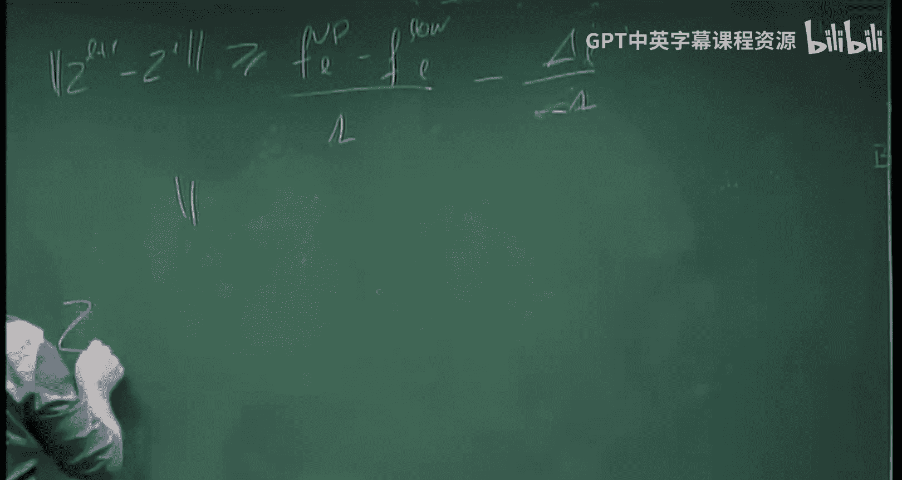

Right， for example， a sub sequence L J minus。Plus one， for example， all J。This。Is。RLG。Hey J。Well。

Sorry， this is equal。And the gap is now increasing， we can also write like that。It's not increasing。

And now we can put here， plus one。And this is the constant。But this subequ。This difference goes to 0。

 if you take the limit here。So， if you take the limit。Jy， going to。Infin。This drives。

They optimal the gap to 0。So， the proof is done。And it's really short。We just use the definitions。

 I think it's nicer。Well。We are concluding。The fact here。

This algorithm convers if the toleranceance is 0。 You have a finite convergence be once again。

 Y it's because of the co， the function is polyhedro。

Something that we haven't mentioned yet is the fact the algorithm also cons。

If Z is a mix of the entire variable。The only change。

 the only thing we will change is here in the algorithm。 In fact， the algorithm will not change。

It works exactly like it is。 The difference is， if this set is not convex。

 you have a mix of inter variables here。You cannot。 This will not be a LP。

But a mixed inter linear problem problem。 This is going to be harder to solve， of course。

But you can solve it if you can solve it， if you have a good tool。

Are you powerful tool for solving this sub problem。The algorithm works。

 So we have also in encompasss in co consideredate stochastic programs with mixed of inter variables。

 I mean， this is approach。Now， how we， the question is how we define sub sub gradientdients for these interger variables well。

In this case， when we pass。When we pass the inter variables。For the sub problems。Go I pass Z is inge。

 It comes here with and this notation W。 It's intege。 This is a parameter。 It's fixed here。

 Your optimization is in Y。Everything is convex。 The， the sub gradientient is the same。

 Nothing changed。Your question is important， because。Suppose that here y is mixed at in。 And then no。

 we are lost in this case。 Then you have to use branch about techniques is more complicated。

 much more complicated。My assumption is， if only Z。Contains mixed inter variableable。 Why is。Contins。

 and then we don't have any problem。The only difficult， additional difficult is in solving。

There's a problem。Because now it's harder。But the rest works perfectly。The same。嗯。Of course。

 you could instead， you don't need to minimize this up to optimality。

 You just find a feasible point here， and then you call your orac。

And you can use also some regularization， but it works the same way。 Okay， and the fact is。

 having the。With integral constraints makes sense in applications。 As I told you。

 the example I told you。Ne planning problem。 You make investments。

 your investments in general are interesting decision。 I， for example， I want to。

 to construct one pipeline。I don't want to construct one but three pipeline。So this makes sense。

 but of course， once again。Z， this variable should not be so big because if it's so big。

 that sub problem will be really， really hard to solve。Well， that's， that's it for today。

 Do you have questions， I'm just checking here in the Web。 if you have questions。Well。

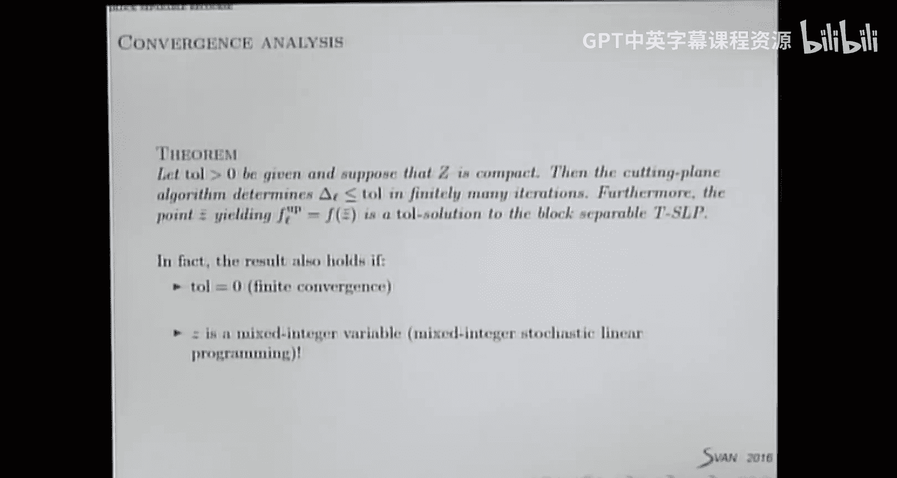

Nope。关上诉。Okay。