# 随机规划基础课程：17：多阶段问题的对偶分解方法

在本节课中，我们将继续学习多阶段随机规划问题，但这次我们将聚焦于线性情况，并通过求解其对偶问题来寻找解决方案。我们将重点处理非预期性约束，并介绍一种利用拉格朗日松弛进行问题分解的实用方法。

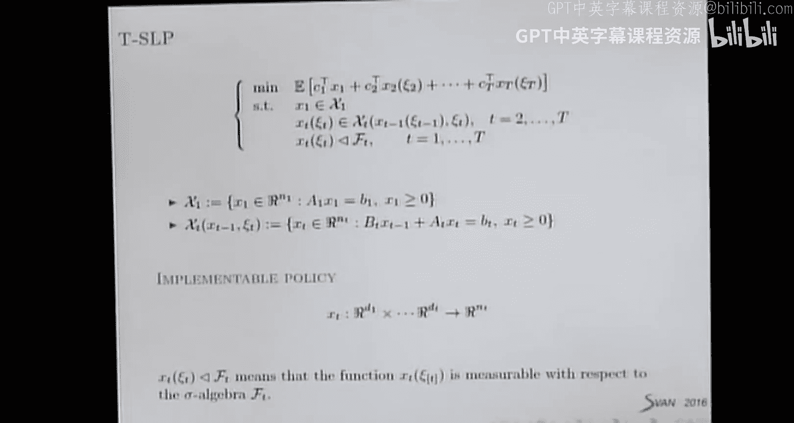

上一节我们介绍了多阶段随机规划的一般形式，本节中我们来看看如何通过处理其对偶问题来求解。

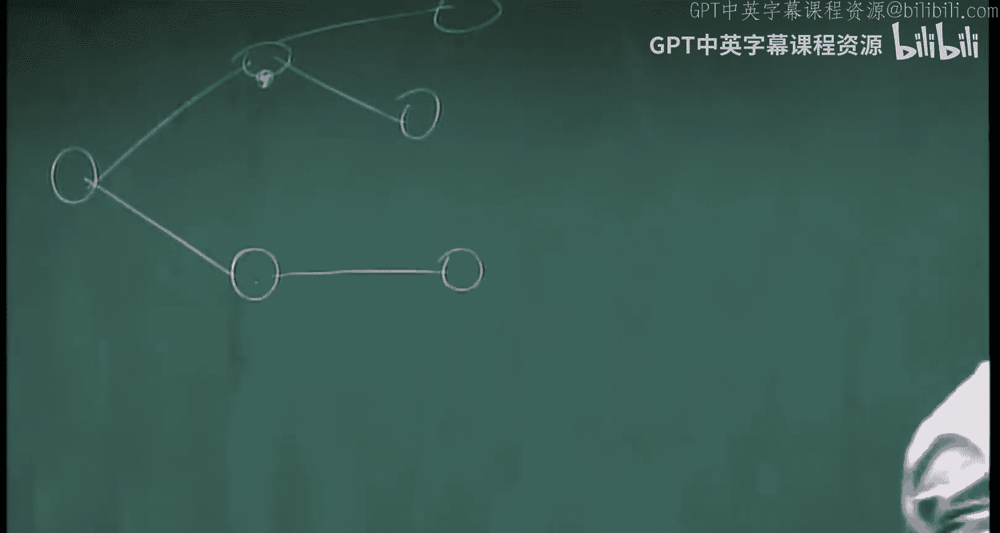

## 问题回顾与修正

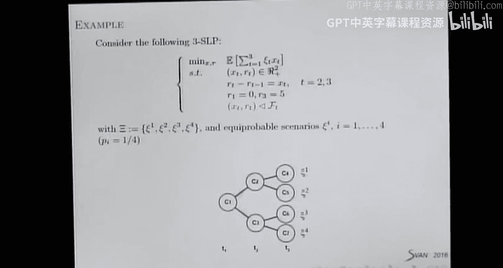

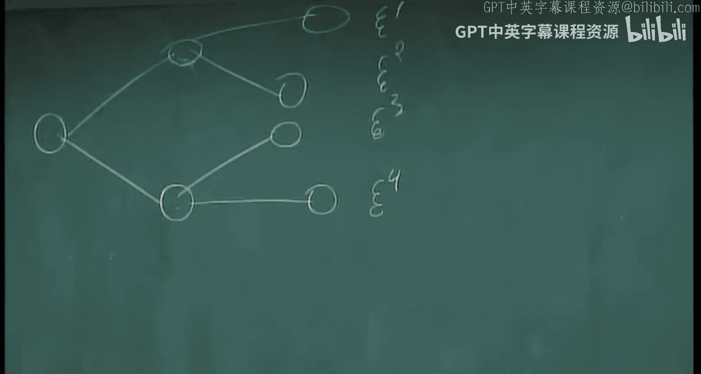

首先，对上一节课的一个表述进行修正。在介绍可分递归问题时，关于函数子梯度的矩阵表述有误。正确的形式应为与向量 `W` 相关的矩阵 `D`，感谢 Francisco 的指正。

现在，我们回到今天的主题。我们将处理多阶段随机规划的另一种表述，即一般形式下的线性情况。

**线性多阶段随机规划问题** 可以表述为：
```
minimize E[ Σ_{t=1}^{T} c_t(ξ_t)^T x_t(ξ_t) ]
subject to:
    A_t(ξ_t) x_t(ξ_t) + B_t(ξ_t) x_{t-1}(ξ_{t-1}) = b_t(ξ_t), 几乎必然 (a.s.)
    x_t(ξ_t) ≥ 0, a.s.
    x_t 是 F_t 可测的 (非预期性约束)
```
其中，`x_t` 的决策依赖于随机过程 `ξ_t` 的历史信息。我们称满足这些条件的策略为 **可执行策略**。如果该策略还满足所有约束条件，则称之为 **可行策略**。

我们使用 `x_t` 是 `F_t` 可测的来表示非预期性约束。这意味着在时间 `t` 所做的决策，只能基于到时间 `t` 为止已知的信息，而不能预知未来。

## 非预期性约束的示例

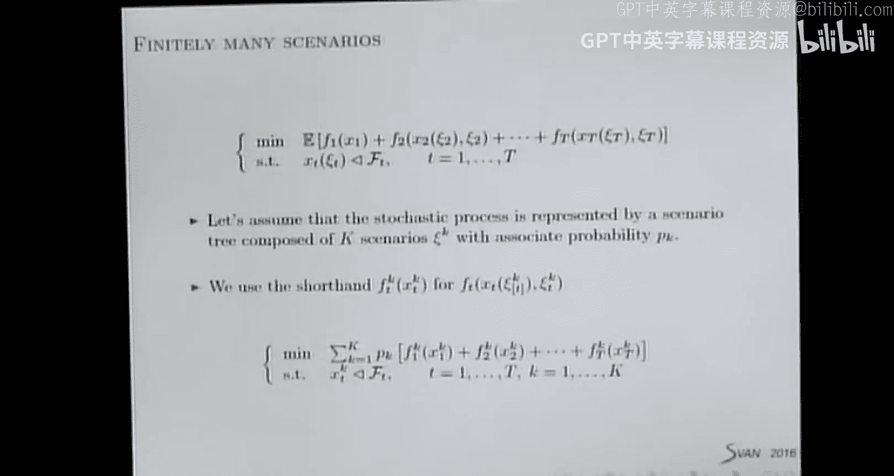

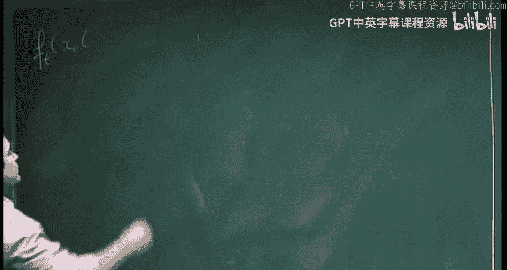

为了更好地理解，考虑一个简单的三阶段例子。

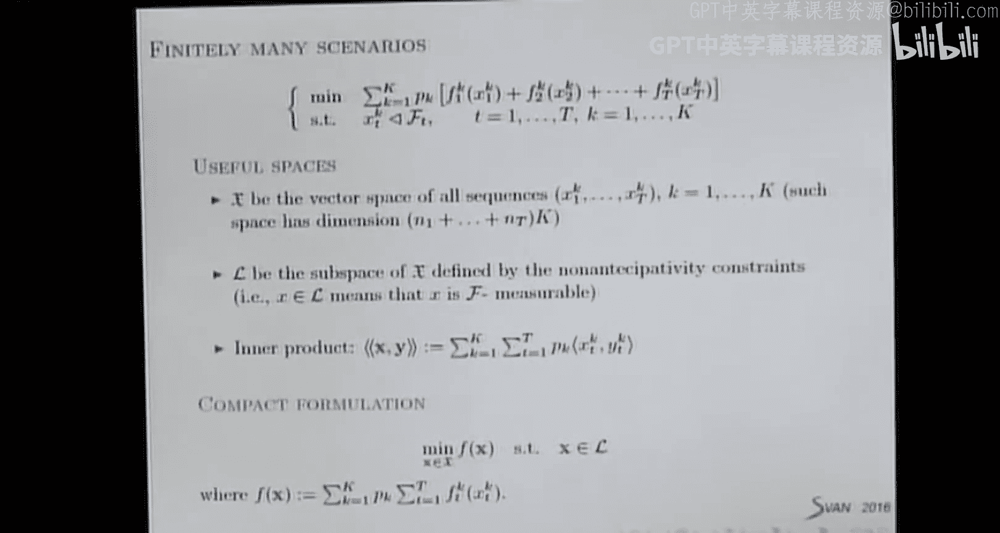

假设一个三阶段过程，每个阶段决策变量在 `R^2` 中。其场景树如下图所示，包含四个最终场景。

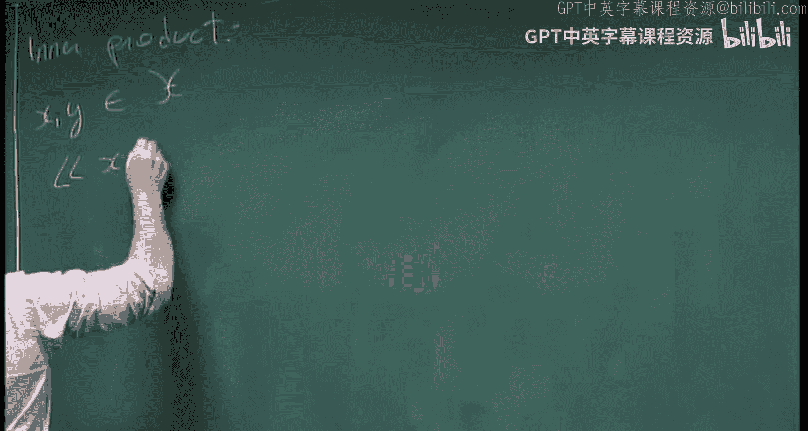


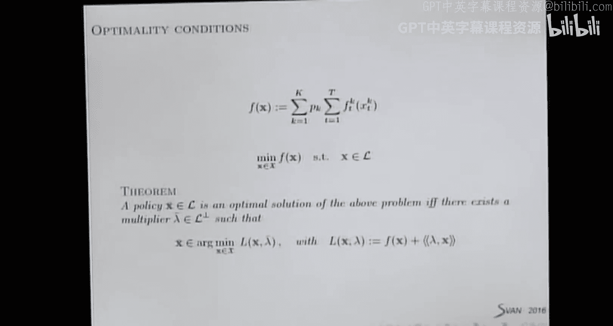

对于每个场景树节点，我们都需要做出决策。为了确保非预期性，我们为每个场景复制决策变量，但要求在某些节点上这些复制变量必须相等。

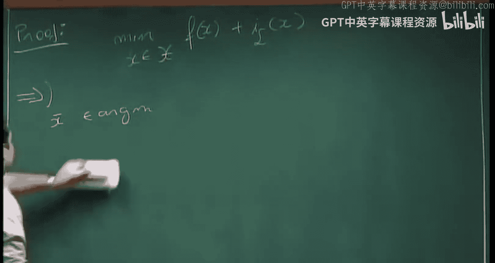

以下是具体做法：
*   在根节点（阶段1），所有四个场景的决策必须相同。
*   在阶段2的第一个节点，场景1和场景2的决策必须相同。
*   在阶段2的第二个节点，场景3和场景4的决策必须相同。
*   在阶段3的每个叶子节点，决策可以不同，因为未来已确定。

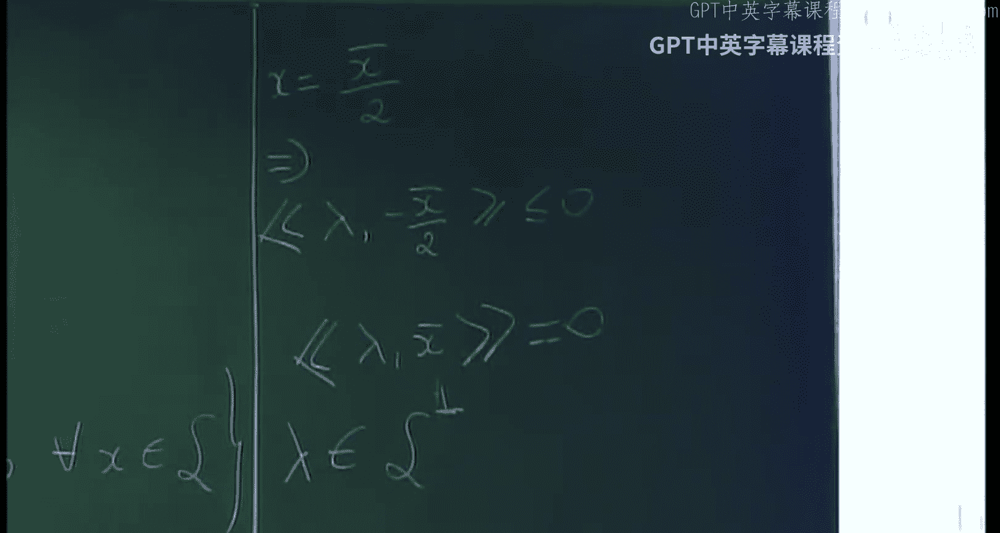

通过这种方式，我们增加了变量的数量（为每个场景复制决策），但引入了等式约束来保证非预期性。这使得原问题转化为一个大型线性规划问题。

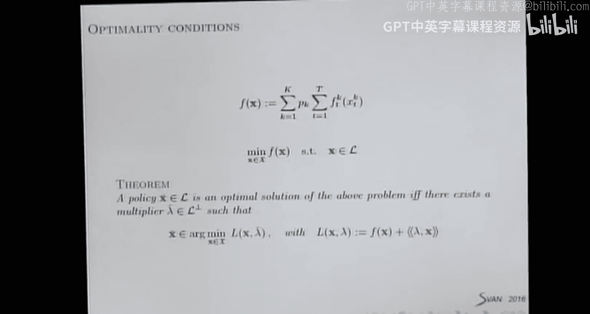

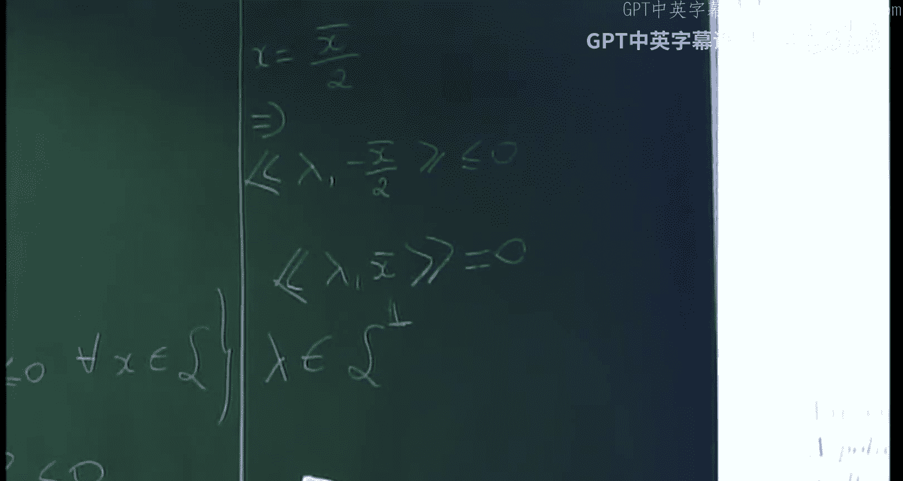

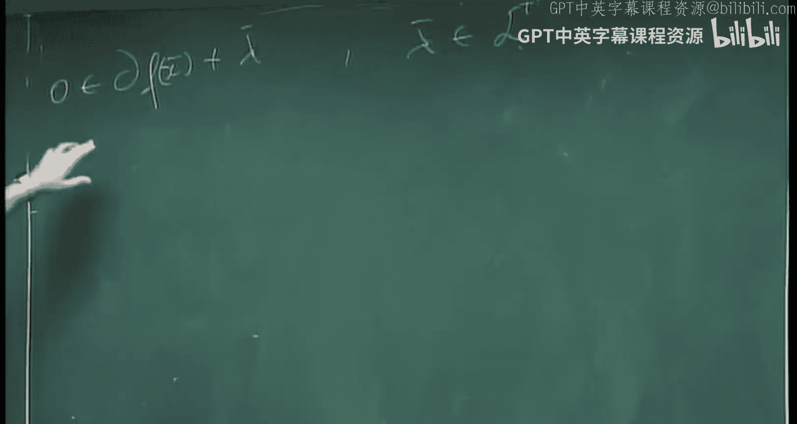

虽然这种方法使问题规模变大，但其优势在于，我们可以松弛这些非预期性约束，从而将大问题分解为多个更小的、可按场景独立求解的子问题。这正是对偶分解方法的核心思想。

## 紧凑形式与对偶理论

为了理论推导的方便，我们将问题改写为更紧凑的形式。

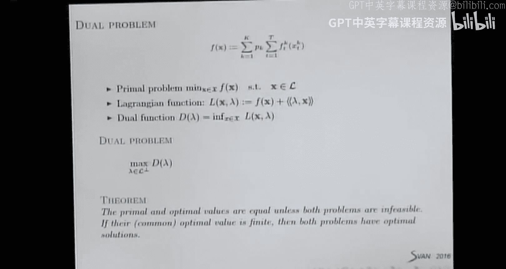

首先，定义包含所有场景所有阶段决策的大向量 `X`：
```
X = (x_1^1, ..., x_T^1, x_1^2, ..., x_T^2, ..., x_1^K, ..., x_T^K)^T
```
其中，上标 `k` 表示场景索引。

定义满足非预期性约束的子空间 `L`。`X ∈ L` 意味着决策策略是适应性的（即可测的）。

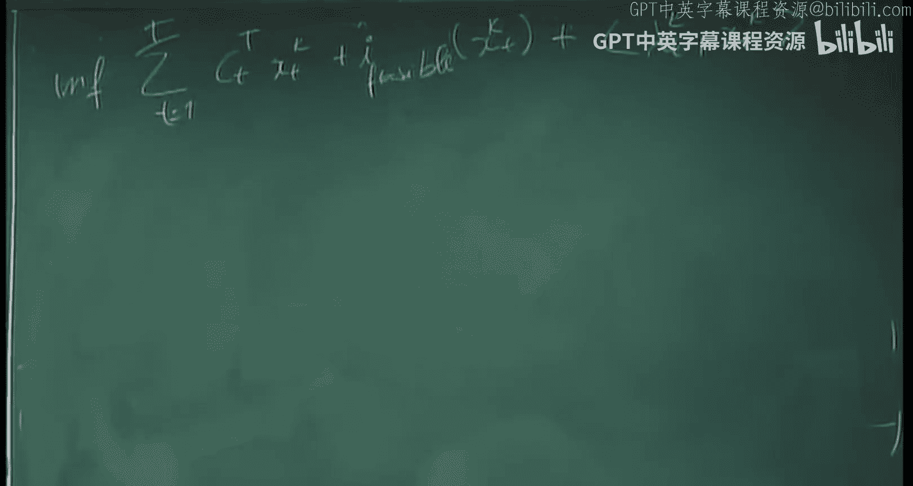

接着，我们定义一个新的内积，用于后续的对偶分析：
```
⟨X, Y⟩_π = Σ_{k=1}^{K} π_k Σ_{t=1}^{T} (x_t^k)^T y_t^k
```
其中 `π_k` 是场景 `k` 的概率。

利用指示函数，我们可以将原问题等价地写为：
```
minimize F(X) + δ_L(X)
```
其中 `F(X)` 是线性目标函数，`δ_L(X)` 是子空间 `L` 的指示函数（在 `L` 上为0，否则为+∞）。

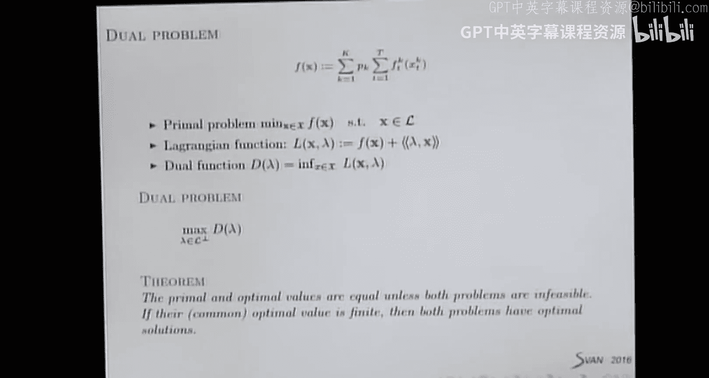

基于此，我们有以下关键定理，它连接了原问题与拉格朗日松弛问题：

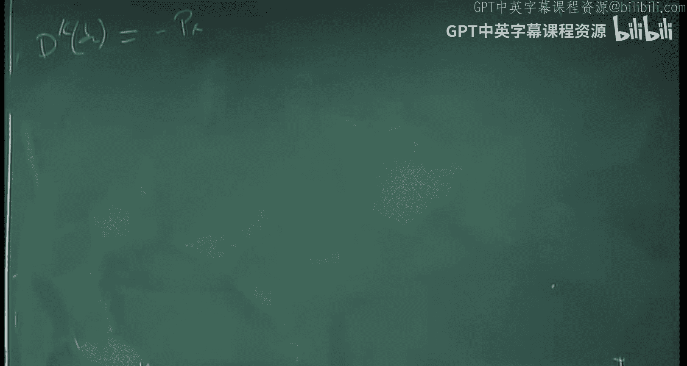

**定理**：一个策略 `X*` 是原问题的最优解，当且仅当存在一个乘子 `λ* ∈ L^⊥`（`L` 的正交补空间），使得 `X*` 也是如下拉格朗日函数的最小值点：
```
L(X, λ) = F(X) + ⟨λ, X⟩
```
并且 `X* ∈ L`。

该定理的证明利用了最优性条件和子空间法锥的性质。由于原问题是线性规划，且约束为线性子空间，无需约束规格条件即可保证强对偶性成立。

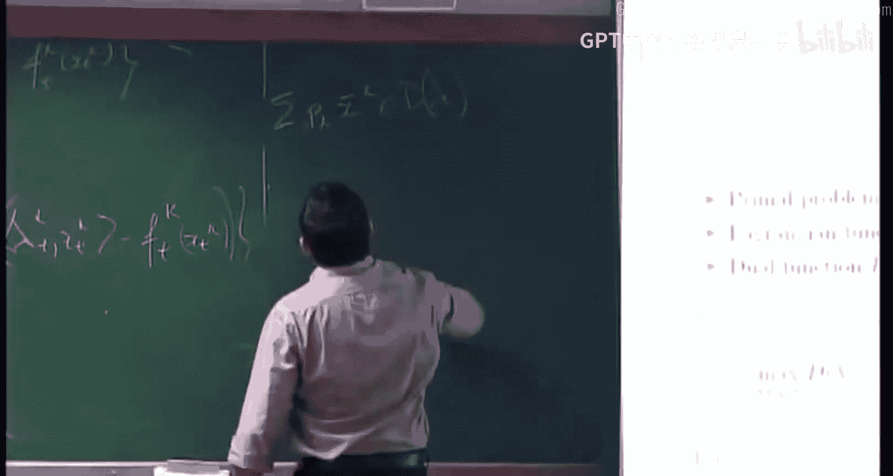

这个定理的重要性在于，它表明我们可以通过求解对偶问题来获得原问题的最优解。

## 对偶分解

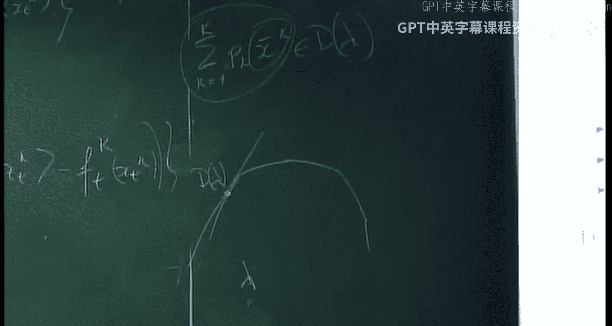

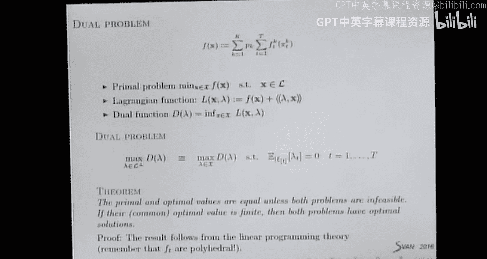

根据上述定理，我们定义对偶函数：
```
D(λ) = inf_{X} { F(X) + ⟨λ, X⟩ }
```
由于 `F(X)` 是线性的，且我们引入了内积 `⟨·,·⟩_π`，可以证明，这个对偶函数可以分解为各个场景子问题的和：
```
D(λ) = Σ_{k=1}^{K} π_k * D_k(λ)
```
其中，每个场景的子问题 `D_k(λ)` 为：
```
D_k(λ) = minimize Σ_{t=1}^{T} [ c_t^k^T x_t^k + (λ_t^k)^T x_t^k ]
         subject to: A_t^k x_t^k + B_t^k x_{t-1}^k = b_t^k, for t=1,...,T
                     x_t^k ≥ 0
```
**注意**：这里的 `λ_t^k` 是对应于场景 `k`、阶段 `t` 的乘子分量。

这是一个重要的分解。**对偶函数 `D(λ)` 的求值，等价于独立求解 `K` 个（场景数量）较小的线性规划问题**。每个子问题只涉及一条从第一阶段到最后阶段的完整场景路径，完全忽略了其他场景。乘子 `λ` 起到了惩罚作用，迫使最终解满足非预期性约束。

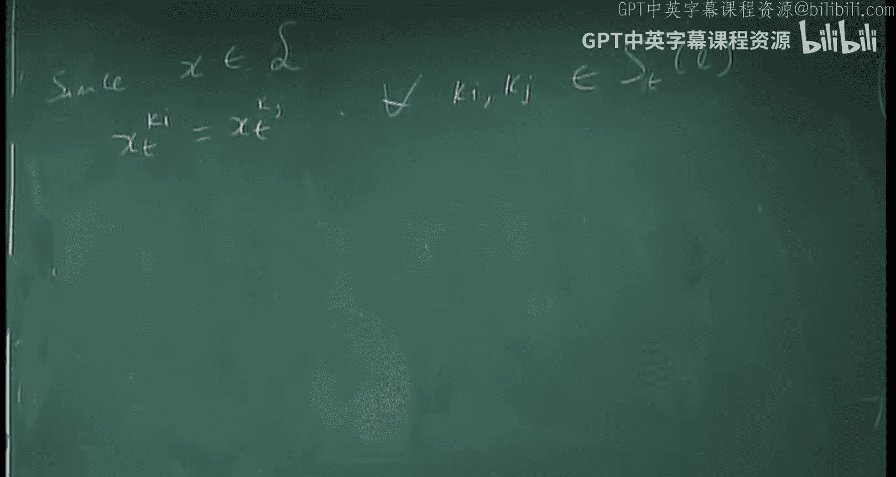

## 次梯度计算与算法


我们的目标是最大化对偶函数 `D(λ)`（因为原问题是最小化，其对偶是最大化）。`D(λ)` 是一个凹的、分段线性的函数。


为了使用如次梯度法或割平面法等一阶方法求解这个对偶问题，我们需要能够计算对于给定 `λ` 的函数值 `D(λ)` 和一个次梯度。

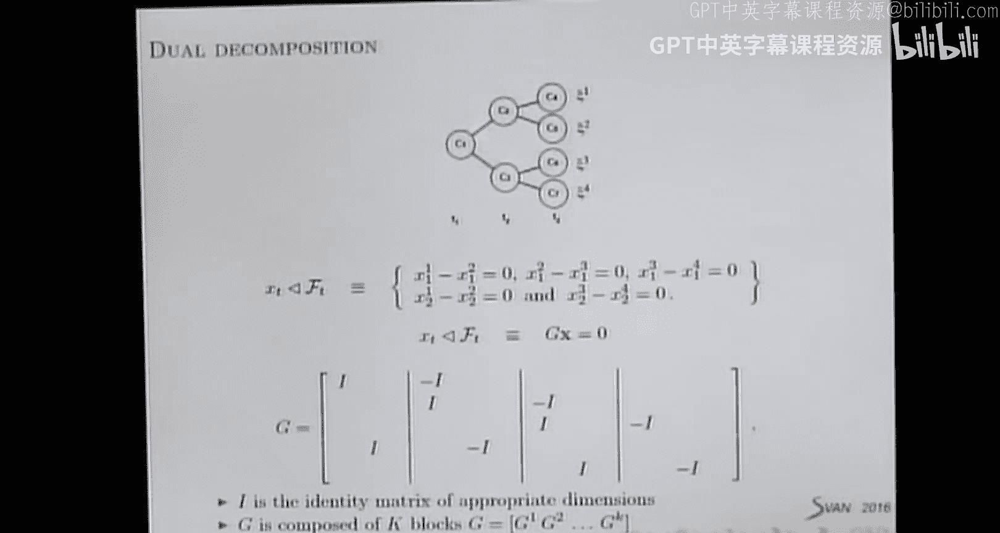

*   **函数值计算**：如前所述，求解 `K` 个场景子问题，将其最优值按概率加权求和。
*   **次梯度计算**：对于一个给定的 `λ`，设求解场景 `k` 子问题得到的最优解为 `X_bar^k`。那么，向量 `G = (..., π_k * X_bar^k, ...)`（按场景和阶段排列）就是 `D(λ)` 在 `λ` 点的一个次梯度。

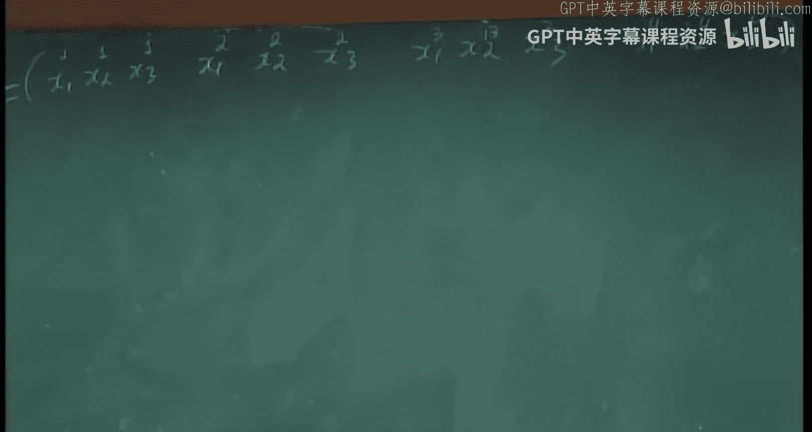

有了函数值和次梯度，我们就可以应用 **割平面法** 来求解对偶问题。

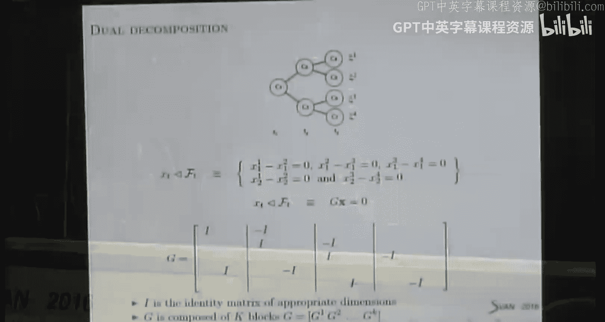

割平面法的基本步骤如下：
1.  初始化一个对偶乘子 `λ`（例如设为0）。
2.  调用“预言机”（Oracle）：求解所有场景子问题，得到 `D(λ)` 的值和一个次梯度 `G`。
3.  `D(λ)` 的值给出了原问题最优值的一个**下界**。
4.  利用得到的次梯度构造一个线性割（支撑超平面），添加到对偶问题的近似模型（一系列割的集合）中。
5.  在某个有界集合（例如一个足够大的范数球 `||λ|| ≤ M`）上，最大化当前割平面模型。这个最大值给出了原问题最优值的一个**上界**。
6.  用新的 `λ`（最大化割平面模型得到的解）重复步骤2-5。
7.  迭代进行，直到上界和下界的差距小于预设容差。

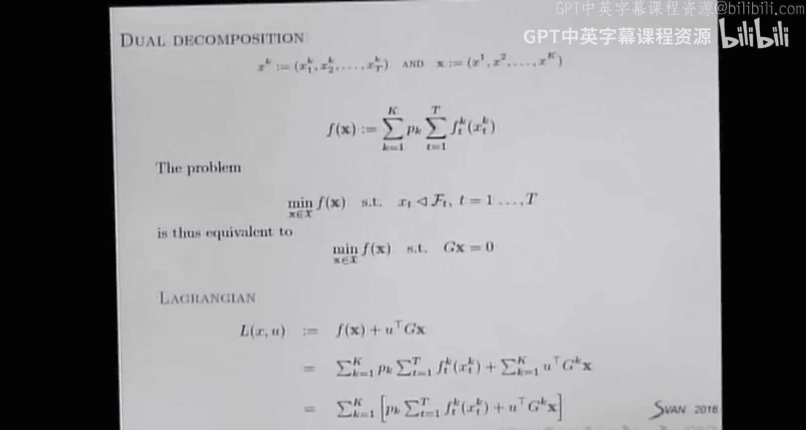

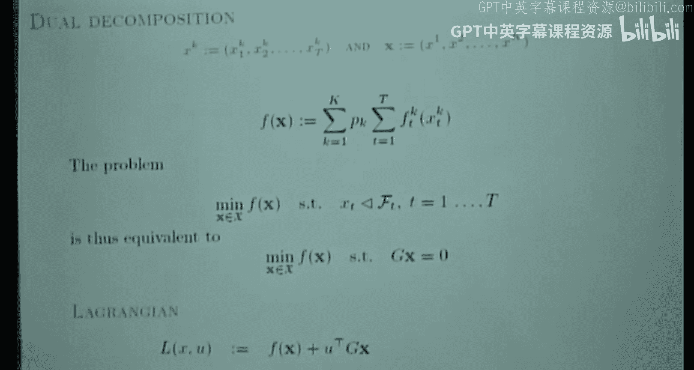

**需要注意**：为了保证算法收敛，我们需要假设界 `M` 足够大，以确保包含了最优对偶解。如何选取合适的 `M` 是一个实际问题。

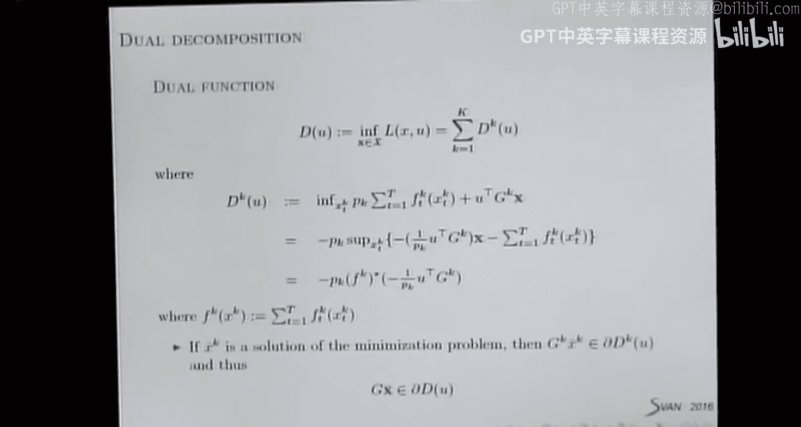

## 恢复原问题最优解

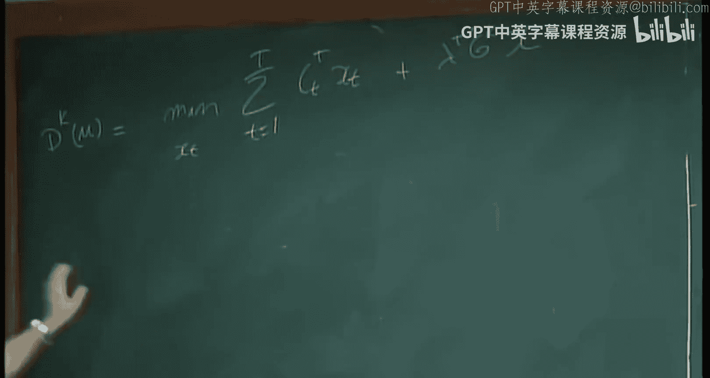

求解对偶问题后，我们得到了最优对偶值和对偶乘子 `λ*`。然而，我们通常更需要原问题的最优决策 `X*`。

一个重要的结论是，**通过割平面法迭代过程中产生的场景子问题最优解，我们可以构造出原问题的最优解**。

具体而言，在割平面法的第 `j` 次迭代中，我们得到对偶点 `λ^j` 和对应的各场景最优解 `X_bar^j`。可以证明，存在一组非负的凸组合系数 `α_j`（`Σ α_j = 1`），使得原问题的最优解 `X*` 可以由这些历史解构造出来：
```
X* = Σ_j α_j * X_bar^j
```
其中，`X_bar^j` 是第 `j` 次迭代中所有场景最优解按原变量结构拼接成的大向量。这个构造过程保证了 `X*` 不仅满足所有场景内的约束，也满足非预期性约束，从而是原问题的可行最优解。

这样，我们不仅得到了最优值和对偶乘子（具有边际成本等经济解释），也恢复了最优的决策方案。

## 总结

本节课中我们一起学习了求解线性多阶段随机规划问题的对偶分解方法。

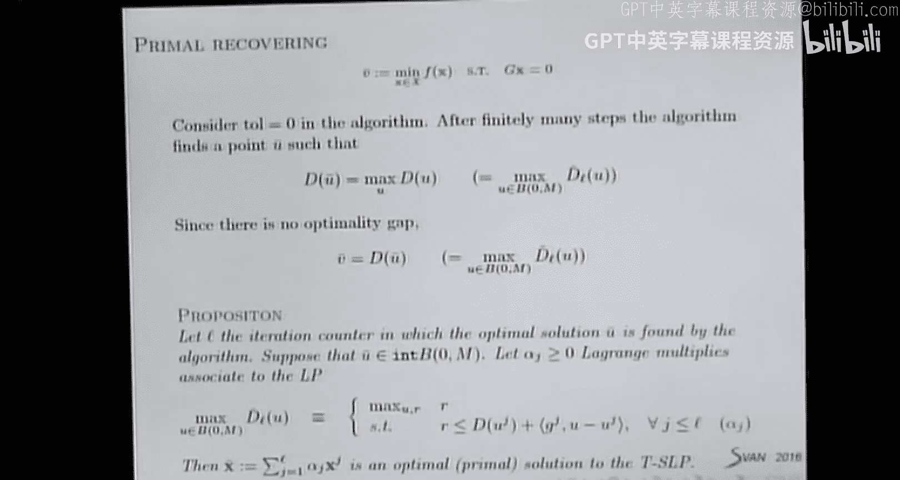

1.  **核心思想**：通过引入拉格朗日乘子松弛非预期性约束，将大规模的原问题分解为多个较小的、可按场景独立求解的线性规划子问题。
2.  **关键步骤**：
    *   将非预期性约束表述为等式约束，并定义相应的子空间 `L`。
    *   利用对偶理论，将原问题转化为最大化凹的对偶函数 `D(λ)`。
    *   对偶函数可分解为各场景子问题之和，使得函数求值和次梯度计算非常高效。
3.  **求解算法**：使用割平面法等一阶方法求解对偶问题。每次迭代需并行求解所有场景子问题。
4.  **恢复原解**：算法收敛后，可以从迭代历史中构造出原问题的最优可行决策。

这种方法的优势在于它利用了问题的结构，通过分解降低了每次迭代的计算复杂度，特别适用于场景数众多但每个场景的子问题易于求解的情况。在下节课中，我们将证明如何从对偶解恢复原问题解，并可能介绍其他相关的对偶分解方法。