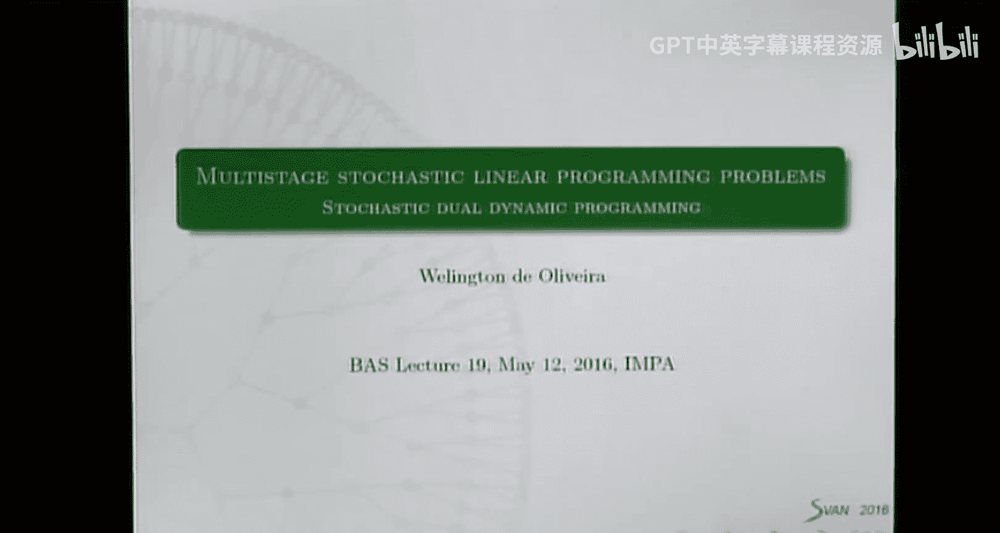
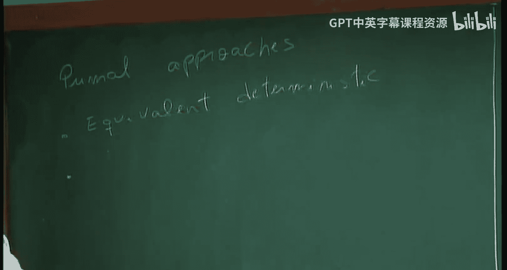
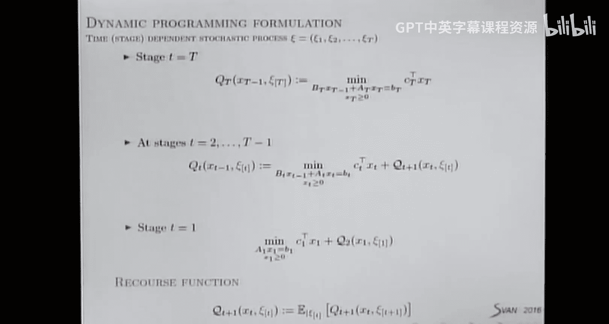
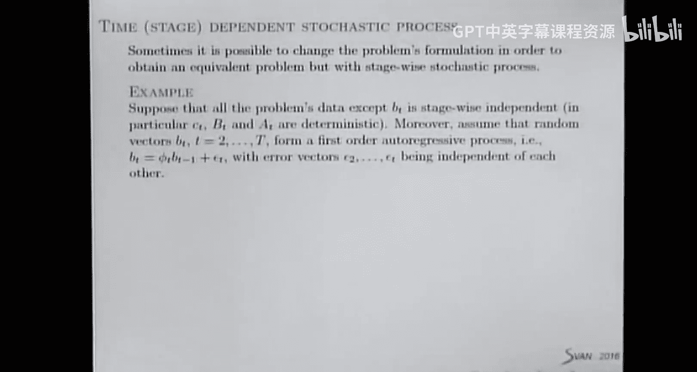
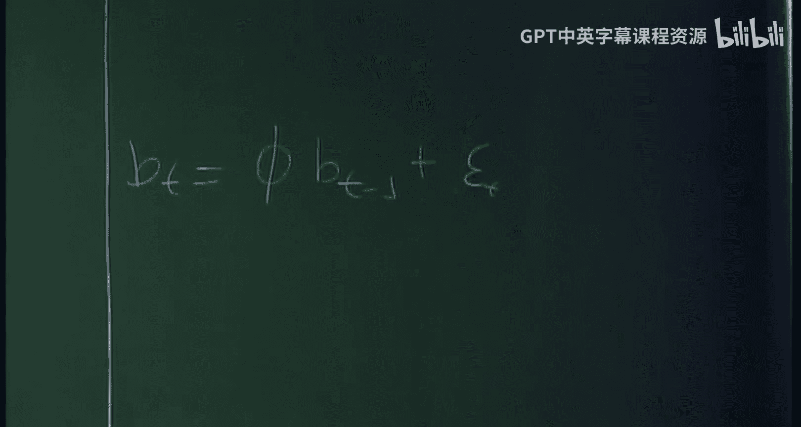
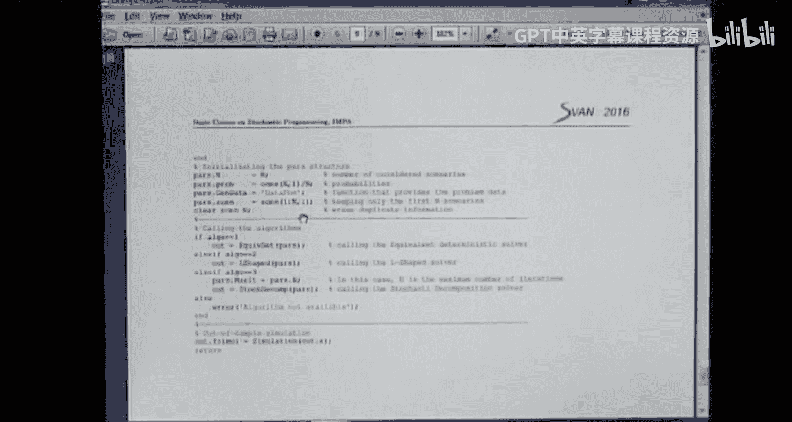

# IMPA《随机编程｜Basic Course on Stochastic Programming 2016》中英字幕（Claude-3.5-sonnet p19 -19-Basic Course on Stochastic Programming - Class 19.zh_en -BV1tH92YXEnd_p19-

Okay， good afternoon。 We come to the bus lecturec number 19。

Today is going to be the the last class about multit Caline eye program products。

 I think you are already full of this subject。 So this is the last one。 and then。

It will change the subject。嗯。Well， what we have seen about the about the Mo stage stochastic linear program problem。

Well， we have seen an approach for dealing with the prim problem and approach to deal with the dual one。

For the prim mall case。P猫。Appros， we saw。The equivalent， the termminist。Theteministic。And also。

 we saw the nested composition。

Well。We saw that this is a very naive approach。 We can deal only with a certain just a few number of scenarios。

 because in this approach， we writeite our problem as a large LP。

 So we have problems with in memory in computer。 so we cannot solve large problems using this approach。

Then nested， the composition。We can deal with larger scenario 3 because we decompose the problem at every node of the the scenario 3。

So， this is more efficient。And we saw also， dual approach。One was the the dual the composition。

We saw， also。The augmental action， for this case。Augment the lag engine。Plus。There a cob。methodeth。

Okay， the difference here is。We modated the known anticiativity constraints as。A set of constraints。

 these linear constraints in this。In typepe。And then。When we relax this constraint in our problem。

 we end up also with the a structure that we can decompose and solve smaller sub problems。

In this case， smaller sub problems are related to the， the。To the problem used one scenario。

 but for the entire timing horizon from the first stage up to the last one。呃。

So this one drawback of this， de compositionposition is that dual variable has a has a large dimensional。

呃，对对对对。The number， large dimensional variable， the do all one here。 So we have a con。

Convergence is low。Have。Perhaps you using another kind of method。Not the the cut painting method。

 but I regularized the composition could be faster， but we will have a problem with dimension here。

It's the same problem here， but here。Well， because it's we are using an augmented aation。

's we are regularizing our problem。 It's natural that we are going to perform less iterations to converge。

 However， each generation is more expensive in this case。 because this。

 the sub problems are not decomposable So we need to use some tricks。 and you。

 you apply the code method to approximate the sub problems。 and then so。I will do our problem。

In any case。We can recover a premo solution using just a convex combination of using lagian multipliers of the the。

 the sub problem。 So it's easy to recover premo solutions。 So that's not a big deal。

But in every approach， we have started。We are assuming that it's given a scenario3 and we solve our problem based on the scenario 3。

And as a。We have been seen in the mini course scenario generation solving the problem with only 1，3。

 scenario 3 is not enough ideally。 We should solve many times for different samples。

 and then we can have some estimators of the dual of the optimal value and also optimal solutions。

Well。Today， we' are going to see a method。 It's also on this class， is Primo。However。

 it combines sampling。It's useful when the scenario 3 is very large。 The larger is the3。

 the better is the solution that you， you can get the estimation。 However， if you think of scenario。

 a very large scenario 3 using nest at decom， you have many nodes。Let's thinkin。

We have to solve one LP for each one of the the nodes。 So if the large is very。

 if the three is very large， we have to solve many PR program problems for every duration。 Remember。

 the the nest of the composition， we have a forward path path。

We are going to solve the LPs in this direction。 then a backward pass。That。We are going to construct。

Cty planning models for the requires function。Imagine if you have many nodes。

 it's going to be very difficult to solve。You mood stage aousastic program with a large scenario3。

And this disadvantage advantage is also happens in every one of those metals， mainly here。

 but every one of those metal， you have problems。Well， of course， if you have many nodes， you。

 it means that you have many scenarios。 If you have many scenarios， this。

 the compositionposition is also expensive and。As well， the last one。Well， so today。

 we are going to consider a very large scenario。We are going， we are going to try to solve。

The problem for a fix of the3。However， we are going to use sampling。Indu。

 is like for ever for a given it， we are not going to do a forward pass passing through all the notess。

 but some of the notes。EWellow， if you are using sampling。Well， the the idea is， well。

 if the large is very large， if the trees is very large sorry。Instead of passing through the a nodes。

 you get just a few of them。You make a forward pass。

 then you come backwards because the method is based on the nest of de composition。

And it turns that every television is much cheaper than the nest of decom。However。

 we are using simply you can have some errors， you have some difficulties that we are going to start today。

Well。And for dealing this， this is not a very general method because we need some assumptions on a stochastic process。

The assumption is stage wise。Independence。保收。Let's come back with our notation。

 So we are interested in sort linear Mo stage stock linear program。Rundal vector can be， as usual。

 the， the cost C， these matrix， the records matrix A and the demand vector B。We are very familiar。

With the dynamic programming equations。嗯。And I I call your attention here for this notation because here it means that we are considering how the history should get。

TheWhat's important there is we are going to have here。A problem for each this node。啊。Plus。

 requires function。 That depends on the。This stage， this variable。But also。The history。

So this history means while we are here here we have our constraints。Well。

 we are going to have a requires function， different one in this node。And also。For for。

 one of the nodes you have a different recourse function。呃。And。Today， we are going to consider。

 So this is the case of。Time stage， the time independence stochastic process。

It means that what's going to happen in the future depends。Where we are today。嗯。If you are here。

 you have different futures。Point。But with you， we assume stagewise is independent process。

It means that the future。For each one of the nodeles。Is the same。It's like。So I can， I can。

Let me draw another tree here。Okay， for this， for the future of this node， we have。Blue。Green。

Orange去。And here。For example。I have white。Have yellow。Here。Ylow。So it doesn't。

 doesn't matter which node we are E are we are at this stage， The future is the same。Okay。

 this stochastic process。 Well， of course， the decision X we are going to make at this node。

We depend the decision you made here， but the uncertainty， No， the uncertainty is independent。

 This what the， this scenario that will be revealed that in this node is the same here。

 The uncertainty are the same。Well， another way to write this3。

Is like that。And here we。你咯。And white。This is alternative way。To right。This is another3。

So it's the same， the same representation。1， the same three but of different representation。

What's important here。Well we saw when we have。When the， the。

 the stochastic process depends on the time we have a records function for every node here。But here。

 the future is the same so far。All those。Notes。We have only one records function。So， forever node。

Our records function is the same。XD。And here， you not depend。On the history， because， well。

 doesn't matter if you are this node or that or that one， the future is the same。

 So we just represent。In this form。What is written。那 here。Okay。嗯。

So this is an assumption we are making。So not all this stock cast stock cast process satisfy this assumption。

 of course。But there are significant classes of stochastic problems， that find this。And also。

 when it doesn't satisfy。We can also make a trick to convert a sachastic program with time。

 time dependent process in a stagewise， independent process， Depend on the class。

 I will give you an example。Okay， this is just the three draw more or same。Same idea。Well。

 here is an example。Sometimes it's possible to change the problem。

 The problem is formulation in order to obtain an equivalent problem。

 but with a stagewise stochastic process。呃。Okay， we write down this。Again。This is our problem。St。

So let's consider this a problem。 And let's take a look at those assumptions。So。

 we are supposing here。That the problem was that accept this vector B。Is stage wise independent。

So it means that if you have uncertainties related to matrix B， matrix A or vector C。

 this uncertainty doesn't depend on the past on the time， okay。But this one depends on the time。

So we don't have a stagewise independence assumption in this case， because of this vector B。L， now。

 let's make an assumption that the sas process of this vector B follows a auto aggressive process。

Which is。The value we have today。Depends linearly。On the value we have yesterday。

Plus。Aund of value here。啊。Abspsilon。嗯T。Okay。Now， in this case。This is aroundol because Epom is R。

But when we are forecasting。Realizations for the time T。 We know what happened in the past。So。

 with this assumption。Well， we can make a tweak and transform this this sort problem in a stage wise。

 independent one。 So how we can do that。

The trick is the fault。We can。啊。啊。I this function， This is。A function Q。Depending on T。X t -1。

The history。Be can。Right this， you know。Like。Min。I pass vector Bt。嗯。

Then are you right what comes in this part in this argument。呃。This equation。I use this formula。

Instead of writing BT， Ill write this one。BT。that equation。In this sense。The random variable here。

 sorry， the， the variable， precision variable is。X T。No。No negative。

And you consider B as a variable tool。But I don't know。 it doesn't need to be non negative。

 can be free。The fact here。What becomes random。Vor C， we know that if it' random is。Stagewise。

 independent， the same for B and matrix A。And now。We are assuming that。This random identity。

 this random variable is independentent 2。Independent， so。

All the random variables here are independent in this case。 But we have this additional variable。

This problem， you can write it as。Q。To formulate this problem。

 we need this value what happened in the past。 So you passed to it to， to， to， to this LP。

What do you use it？Plus， this past。What's random here。Is this。K see。T。😊。

That doesn't depend on the past。Ksity， in this case， will be。I don't know see。A。And。爱ps。Now。

 this new random this new stochastic process is staized independent。And well。

 if you give different names here。We have a multi stage stochastic problem。

Under the assumption of the stagewise， independent sa process。So it's just a small trick。

What comes here。Well， no。This new random vector。And that's it。So if you stochastic process。

 in case we we could have more theorems here， depending on the past。 You could use the same trick。

 You are going to， to enlarge the decision variable， only that， but it's possible to make this trick。

And this is。this trick is very useful。 For example， here in Brazil， people use this for the。

In the planning power system， planning problem。Cause if you think of。

Many here in Brazil that we depend the to generate electricity。

 You depend on the level of reservoirs in the hydro plantsants and the amount of water arriving today depends on the rain that happened last month。

 for example， And we have a process。Not so simple as this。

 but you have a process stochcastastic process， satisfying this assumption。

 So we can do the same trick and end up with stagewise independent。Probum。Well， I just。Yeah。

 here is what I wrote on the black， on the blackboard。No。A， iss a simple click trick。So。

 as you can see。This is stage wise independent？嗯。Of course， we can use。We can apply the。

Nest at decomposition。To solve our Mo stageto cast problem based on this3。Okay。

 we have used to compare。With this one stage， this is time dependent。 You have main nodes。You have 1。

2，3，4。5，6，7，8，9，10。And here we have one，4。6， you have less nodes， much less nodes here。

 And if you increase this three， increasing the time of horizon or the number of children。

 if you know we each in node， you are going to see that the。

 the difference with the number of nodes between these two3 you going to be。

The difference will be bigger。But we can apply the vendors decomposition to solve a stochastic program based on these three。

 No problem。And， well， the idea is the same。We approximate the records function。

By a cutplan model we， we win， this is not a novelty because we are saw。 So these。

 those are the cut plane。the cuts， the cuts appmating the requires function。

When we approximated at the first stage， we saw we have a lower bound for the optimum value。

Based on the lag multiplier related to those constraints， we can compute。The， the coefficient。

 coefficients for the， the cuts。And appromating the function。 and this is our cutplan model。

 just the maximum of those cuts。By the way， in the exercise list。We have to。

 you have to compute cuts。the same idea here and just change the index。 You can compute those cuts。呃。

Well。I think I wrote here just to recall， this is the nest decomposition。Apped to this problem。

So the first is to happen。Since we don't have any cut， the first step。

 you approximate this function just by a lower bound。 For example， we could consider R。

 you put a variable R where。This here。So when you go for the first time in a forward step。

 you can just take ignore ignore this variable here。

And just making decisions without seeing the future。Meoppi decisions that， of course， are not good。

So youll go in a forward step。 So each one of those LEDP for all the nodes。

 So you have to visit all the nodes of the three。 going a forward。Visiting。When you。

 when you arrive at the end， we have， we have。Upper bound， for give iteration。

Uper bound on the doctrine value。Solving again， when you solve those LE P， we con。

 we have lag multipliers。 We can construct a cut app the requires function in each node。

Note that to construct this cut here， we have to go for and the the forward the pass accessing this scenario this。

 this branch of the tree。And then we are able to compute this code。In this three。

 if you make a sampling， for example， on a forward pass， I just want to take this scenario。You go。

 when you arrive here， you don't have any guarantee that the value will be a upper bound when you come backwards。

 well， we can compute cuts here， but we cannot compute cuts for the other nodes。So in this way。

 making something just take you one path to go in the forward pass。Is not a good strategy。

 in this case。So you have to visit every node。What we'll say when you come back， well。

 so here we solve again the nodes。And you cut your computer cut。For this note。

 the route node and the process repeat and you go， then you come back。Plus， and so on up to。

 we approximate very well。 the records function。 And we saw that the method as that the composition stops after finitely manycious and it finds the optimum。

Of a scenario3 based of the program problem。So we always， we， we know。

 we always know that the forward path。You compute the upper bound backward past a lower bound。

And we stop when those bounds are small enough。Well。In this case。

 we are not taking account the the assumption of stagewise independence。

 We are visiting all the nodes。 No assumption。 So this the methodology works in a more general。

Context of。Margiinnal setting。Oftocast process。 So let's take advantage of this assumption。

 What happens。Well。We can simplify。This is step， step one。And here will be a bit obscure。 But we can。

 we are going to discuss this part， stopping test。 but the main。Point is。

 step1 is going to be simplified。So it's like the method we are going to see。

Explore the our assumption， the forward the path path。 When you come backward， you do。

Exactly what we do for the， the， the nest de composition。 Okay， so let's focus on。This part here。

How can we take advantage of our assumption。Well。The first。Important thing is。

Under the assumption of stagewise independence， stock process。

 we have only one records function for each stage。Why this is important。

Imagine that example I told you I， we select a scenario before the pass， and that's it。

 Then you come backwards。But I mentioned it， well， we can compute a cut for this node， but we cannot。

 We're not able to compute a cut for the other nodes。For the other requires function。

 But here's the only one requires function。 So if you take。For example。This path。Not forward to pass。

We come back here。Since we have a decision X here， we can compute。So of those two。

 the LP related to the two nodes， compute。A cut for the function。 But our function is only one。

So if you take only one scenario， you can still update。

 improve the the category plane approximation of this function because you only have one。

And then if you only have one。Let's think at the， the， the first at the beginning of the process。

 the teleative process。Next the composition， you take all the scenarios。But the first iteration。

 we make me up decisions because we just ignore ignore the future。

 You have no representation of the cutlenium not， no， no cuts representing the course function。

 which's like you close your eyes and make a decision here。

 And then you are going to correct those decisions in the backward pass。嗯。Of course， well。

 we are going to make a lot of useless decisions at the first pass because you don't know anything about the future。

 You make a wrong decision here there and so on。 And you solve many LP。

 You came back it was a difficult a time consuming iteration with wrong decisions。

 And you know that strong because the beginning of process the iterative process。Now， imagine here。

 beginning of itative process。 I don't know the future。 No cuts。 I just take one scenario。

 for example， and I go easily， faster， just one scenario。

 and I come back and back backward pass adding cuts to this requires function。Again。

 go with one scenario， a different1。 I can just random it， draw it randomly。

And come back adding cuts。 So every will be much cheaper because you are considered only one scenario to go。

And well， you can consider as many as scenarios you wish in the forward path path。Of course。

 if you consider less scenarios， you'll go faster。 You come faster。 But then backward is。Back there。

 there is a difference in the。In the complexity。The computational effort， we are making the backward。

Pass， but I will leave this。For later on， later。Because I want to show the， the algorithm。Well。

 let me see here。There exists only one requires function， well， thanks to our assumption。

And chosen seminar in D 3 touch this requires function， as I explained it。

 because we have have only one。W requires function representing in the future。The future cost。呃。2。

Even if you choose only one scenario in the forward pass， the backward pass visits all the nodes。

That's true。Suppose here， you take this scenario to go。So when we want to add a cut here。

 we have to visit the children notes of this one。 You have two。

And then you compute a car appxiating this function。 Then you are in the root node to compute a cat。

 You have to visit， to visit all the children nodes。So at the end。

 you visited all the nodes of the tree， the backward pass。It's not the case here。

 If you take this scenario to go。And then we come adding cuts。Well， we don't visit all the nodes。

 For example， don't visit those nodes here。呃。Okay， this is what I've just said。Book。

This idea of selecting a sample of scenarios in the tree to make the forward the pass。

Is the main idea behind the is stochastic dual dynamic program。Just call it the SDP。And this method。

Made in Brazil， by pering pintu in。Beginning of 90s， if I'm not mistaken。呃。This matter。

Made possible to deal with a much larger scenario 3， multi stageage scenario 3。So this is a very。

 very powerful tool for， for dealing with multi stage stochastic linear programs。

 Now that our extension people are using this approach for dealing with non nonlinear programs， too。

It's a very， very。呃。Important， too。So it start here。 was proposed here in Brazil。 So the。

A electrical system。Uses this method。 And then this was used in other countries。

 So many people nowadays using this method and making research on this。algorithmgoth。

And it works as phones。Well。Let's make some assumptions here。

So the main assumption is this stagewise independence。

Then that we have did the request function are finite。Valild， so we are assuming， for example。

 we are assuming relatively completely recoursear。Our scenario 3 has a finite number of scenarios。

That I call， I put in this set。 Okay， I call this set， all the scenarios of the three。嗯。

I present in the considered three。In the forward， the past。At each it of the algorithm。

 So you think like the nest decomposition with sampling in the forward pass。At each generation。

We are going to select some scenarios of the tree。To make。They forward the path， not all of them。

 just some。So when we arrive at the end。With a smaller sample， this is a subset of this one。 Okay。

 just some scenarios。So when you arrive at the end。Solving all those LP。

We can estimate an upper bond。If you make the， if you。

 if you compute the expectation of all the costs related to the scenarios we visited here。

We can compute。And just estimating an upper bound。We cannot ensure。

That this value is indeed upper bound， okay。Just an approximation。呃。Then a backward pass。

 it's like in the nest of decomposition by considering only the points x that we constructed during the forward path。

So， for example。If I take this scenario。So here I defined an x1 K of the tradition。Okay。

 here I defined x 2 K。X 3。Okay。U。If I take。Another scenario。So here is the same decision。

 But here I have another one。I call it tilt。Okay。图。

So when we are going to con construct the backward path。We are going to solve those Alips。

 when we send。This x tilt to those nodes is solve。Teleies and construct a cut。

Here we have another point， because we passed it。Through this node。

 we can send this X also to the future computer cut， and we will take the maximum of the cuts。

 You have approximation for this。But see， we， we haven't computed any point at this node at this it。

 So we don't need to send any。 We don't have anything here to send to the future to construct some nodes。

It's seen it's clear。It happens that。The number of LP in the backward。

Pass depends on the number of scenarios。Is， is a proportion。 It's like a sum。But not here。

 if you consider here， here's the product。 If you have consider all the scenarios， the。

 the number of nodes you are going to visit from the backward past， this is。

It's a product of the nodes， the children nodes， the product of children nodes here is a sum of children nodes。

 So this is much cheaper。 It's a sum。You are going to visit us。Sove less LP。

 although you are visiting all the scenarios， but we are solving less LP。When you come back。

Backward pass at the node， the No the root node， you have to solve this LP as the NA decomposition。

And this is going to be a lower bound。 This the optimum value is a lower bound for the optimum value。

 why。Because our requires function， we know this convex at advertising。

 we are appating this function from below。So。If you visit at this point here。

 probably the requires function here will be better。But well， you didn't visit。

 So the request function can be a bit can be poorer。 but although is。Is approximation from below。

When you solve the note。Roruutin old， we have a lower bound。 So what do you know。

Backward pass still ensures a lower bound for the optimum value。 However， forward pass， no。

So how can we stop the method， We don't have na。Optimal gap。

 You just know that the lower bound is indeed a lower bound， but that estimate for the upper bound。

 Well， we don't know。 sometimes the sometimes this estimate when you come here in the following pass。

 this estimate can be under。Relowable。 We never know This can happen。Well， and。

 there are research in this area how to stop the SDDP algorithm。

 ensuring that you are an approximate， you have got an approximated solution for your problem。Well。

 there are research on that。 We are not going to， to discuss this。I would say that。

One way of stopping the algorithm is fix the number of traditions。I don't know。 You make。300。

300 pass， for example， forward pass。It's some way。 do you stop And what you have， this is what it is。

 And you keep in mind， is approximation。The lower bound is approximation for the optimum value。

And the solution you are going to have is an approximate solution for the， the optimal policy。

 only that。There is this method here。 that there is a test you can also use， but you don't have。

 I think we don't have a warrant， the guarantees that。This will be satisfied。It it's like。Well。

 the upper bound。Let me see。This is a tie here。So we know that those2，2， trees are equivalent。

 equivalent。 Let's take a look at this one。So for example， in a forward path。I select this scenario。

This one to go。So in the total， we have six scenarios and the far the pass， we just consider it2。

So we are going to have here。This is approximation for the upper bound。Thats basic。

Only on that sample of two scenarios， we talk at this iteration。In this case。Of the costs。Each stage。

Well。This is， indeed。啊。St has process， a random variable。

 This is a random variable because you chose this randomly， the scenario randomly。And we can ensure。

 well， you can use some confidence intervals。Well and say that。This belongs to a certain。Now。

 in fact， we can think that。An upper bound。If you consider all the scenarios belongs to。啊。

I interval set， for example， did I write here。Deson。This is sample variance。In our case。

 two scenarios。So this we can， we can say that， well， an upper bond is with probability。

 in this case，95% inside this interval， this confidence interval。Well。It's like。We have。Lower bound。

We have。Upper bound。We have an interval confidence。For this upper bound。Okay， those streams。

And one alternative to stop is when this the lower bound， when this difference here。This upperpper。

And is when this distance is small enough， then you can say that， well， with a probability of 95%。

 the， the difference between the upper bound and lower bound is less than the given tolerance。Okay。

 this is that way。 but we don't have， we cannot ensure， I think the。The size of this interval。

 the length of this interval depends on this sample variance。

And the sample variance depends on your problem。So if you have， if you are dealing with。

Some data with high， its high variance， a large variance。

 It's natural that this interval will be larger。 And you can S perhaps if you use this test。

 we are going to stop。Sooner because， well， this is， no， I know。 if it's larger， no， indeed。

 we are going to stop later。But everything depends on the variance。Well呃。

I think one of the most people are stopping the SDP if maximum number of iteration， right， Philip。

 but you have more experience than me on this matter。Please。I， I think I。

 I think I have written this。呃。Another light。 So the what Philips said is the phone。We can stop also。

 well， you fix it on a maximum number of iteration， and we stop when。The up， the， the lower bound。

 because at average ratio， you are going to in increase your lower bound because we are adding more cut。

 mark more cuts。So when you see that we are not moving so much。

 So you've go forward to come back or then you are more or less the same place。 You can think， well。

 this is， perhaps I'm。Near to the optimum， I will stop here。That's， that's our way of stopping。

 But this， this， all of these。Are heuristics， okay。嗯。Okay， a very simple version of a。

As the D P algorithm is the following。 So as I told you， we。

 we are based on the nest of decomposition with some change。 The first change。

 the most important change is the forward path path Here。

 we are just going to draw rendering draw some， some scenarios。To make the forward pass。

We estimate an upper bound can be useful or cannot be useful， depends on your stopping test。

The backward the。Pass is essentially， essentially the same。 However， we are going to。

 to solve this LP for all the X related to the scenarios we made the for pass。How you。

 you are going to update date the cutting premium models。And we stop according to some criteria。

 some heuristic。呃。Okay， that that's it。IS。The idea behind is simple。 and this is very powerful。

 And in practice， you see that， well， you can solve problems that you could not imagine to solve if using other approach。

 other approaches。Because of the size of the tree。Some remarks here。

You can vary the number of number of scenarios in the past。 So according to a good friend of mine。

 Vito dimmatous， he uses the first iterations。Just a few scenarios to make the forward path until you have some。

More or less good approximation of the requires function。 And so that we can we。

 we may increase the number of scenarios to make the forward pass。 So in this way。

 you accelerate the， the， the algorithm。 The first iteration is going to be the first iterations are going to be cheaper。

Because you are considered less scenarios。Of course， if you consider more scenarios， more cuts。

 better pro you have a better approximation， but the requires function。 It a trade off。

For conversion scenarios， we assume that every scenario。

Is with probability 1 chosen infinitely many times where the forward pass if the algorithm looks forever。

I think， this is important assumption for the。Con， it means。If you run your algorithm forever。

The assumption is。You visit this any scenario。 Let's fix this scenario。

 You are going to visit scenario infinite Italy， many times。If you run your algorithm forever。

 which means you are going to visit all the scenarios not only once， but infinite Italy many times。

And I think this is a result of about Elcanli theodem。 if you just make sampling。

 if you choose randomly scenarios， you can ensure this。there is a lamb。That ensures this this。

 this is a。This result， if you choose randomly。 and if you run your algorithm forever with high probability。

 probability 1 with probability 1， we are going to visit every scenario infinite many times。

 with probability 1。For example， well， for instance。

The conversions of SDP is based on with probability 1。

And because we have to assume that with probability 1， are going to visit all the senators。

The algorithm may stop when the lower bounds stabilize。 And that's what Fi said。

You fix a minimum number of iteration， for example， after that minimum of iteration。

 you're going to check you don't。 You not change this bound so much or you may stop。

So an interesting property of the SDP method is that the computational complexity of one run。

Of the evolved backward and the forward steps。Step procedures is proportional to the sum of the sample data。

 this is what I explained and not the multiplication of the children old so this is。Its cheaper。

Here we just consider the so far in the course we are using。

 you are considered just a neutral risk version。But。From next to week1。

So we are going to study So home P is going to teach some risk measures。So外关注。

To deal with more evolving expressions， not only the expectation。For the records function。Well。

About the conversion analysis。So， in fact， the conversation software， the D P was made some。

Years after the paper proposing the methodology。For different researchers。呃。And the idea。

Is the following。Why this math works？We are the linear case。 Let's assume that every。This set。

Is bounded for every stage， for every scenario have bounded sets。

You have a scenario 3 with finitely many scenarios。And we are assuming。

Recor relatively complete recourse。 It means that this function is finite valid for every x we choose。

Let's make this assumption。Well， if you draw scenarios randomly。

We are going to visit each one of the scenarios infinitely many times。

 if youre running the algorithm forever。It's natural。 And at every stage。

 we have only one records function。Which is polyhedral， convex polyhedral。It's now and Apple。

 every generation are going to add more cuts。So it's natural that eventually。

I will cut the approximation。Will coincide。With the through requires function。If make。诶。

Enough passes forward and backward passes。 So that's the idea behind the。The。

 the convergence analysis nice。 And， well， because this requires function has finite。

 we can approximate it using finitely many。cuts， a you consider a new cut。

 eventually you are going to converge。So， this is the idea。Behind the the。The conversation analysis。

And if you check the proof of this proposition in this paper。

 we are going to see that it's exactly what I'm saying here。 I I read that paper。

 So this is why I'm gonna explain。 And the the ideas there is's just this based on that。 It's not。

 it's not difficult。 You have to argument。All， your assumptions。 And then you get this convergence。

 which says with probability 1。After a sufficient， a sufficiently large number of backward and forward steps。

 the algorithm。Of the algorithm， the forward step procedure defines an optimal pause for the problem。

 And you have that the lower bound will be。The optimum value of the problem based on sity 3。

That's the result。We have， for this case。There are other methods based after SDDP， people start to。

To make research on this argument， try to improve。For example， there are methods that。Doesn't。

Draw remember drop scenarios， but nodes。 For example， this case would draw this node。

 but not in the future。And well， with， when you solve this node。

 we can also get some sort of improvement on the request。

 the cutplan for cut plane model for the request function。And， well。

 it seems that you have more information have a better approximation。

People say that this is strategy of selecting random in chosen choosing random in nodes。

Instead of scenarios is better when you have a large a tree with many children nodes。

And this idea of chosen scenarios is better when you have a long horizon。But is smaller。

Less number of children notes。 So there are differences strategies to。と。Try to improve the SDDP。

 But SDDP， I think， is， is the main algorithm。It is for sure。

 the main algorithm of this class of combining sampling and optimization。That is another method。

Which does the falling。 It's called， it's called。Cpss。C it planning。And partialel sampling。呃。

At every tradition， the forward path。Just select one scenario to go。

And it doesn't have backward path。 is the fault。You choose， for example， this scenario。

 you come here， solve this LP。 When you solve this LP， you， you get for free some。The cuts。

 you can compute the cuts because you have for free delegration multiiers， you can compute a cut。

 And when you solve this just once， you can compute a cut here。 And then you move forward。

 get this node solve computer cut here。 approximation。 a poor approximation， but you can compute。

And then it doesn't have a backward pass。 It comes here again and select， for example。

 random another scenario and does default。 And it has also a conversion syns always with with probability one。

Because， well， depends on the。If you are visiting all the scenarios or not， many times。But， well。

 the main algorithm is this S DDP。Do we have questions about this method。Some comments。Philip。

 do you have comments。 You are an expert。能。嗯。Yeah。Okay。Well， so I finish this。 I。

 I don't finish the class now， but we stop with this with the material， new material。

 And I would like to discuss with you the exercise list。

So if you have some question about the exercise list， we can discuss a bit。

 I will perhaps like to give you one or two devices。And。Well。

 you are supposed to provide this list the exercise on June 2， right。Should second。

From next week on well。Next week， on8又又。You give some， some classes。 And at the end of the course。

 I will come back。To study some more efficient optimization methods for the two stage stochastic program。

 to two stage setting。Okay， so I think for Mo stage that's all。 I don't。

 I'm not sure if onean probably will talk about it， but I think in in terms of algorithms。

 I think this is all for dis course。And then we are going to come back at the end of the course the two stage。

 but more efficient methods and much more efficient。呃。Let me open here the exercise list。

So the other students who are following us by YouTube。 But if you have questions， just write me。

Are you answering。呃。Well， first of all。Do you have questions about the list。

 You can ask in Portuguese if one is Spanish I don't think I can understand well。No questions。Okay。

Okay， so the question was， can。Can we change the code。

Make some change in this last part of the code here。 you mean。Yeah， yes， no。 here you， you can。

 you can， you can change。 So you， you， if you think you can improve something here or if you want to make another test。

 So you have freedom to change this part of the call。 For example， here。

 there is something that Philippi pointed out in the list of exercise。

 we are not asking for to perform out of sampling simulation with the solution with anybody the equivalent deterministic method。

BBut in this case here， if you use this algorithm at the end， we are going to make some simulation。

If you want to make simulation， it's okay， but。It's not。 We are not asking this in the list。Well。

 so here。You can change。However， I would like you to keep。The input structure。So I would like to。

 to pass， for example， the number of scenarios and the algorithm we are going to， to use。

 because when you send us your codes， we are going to test。 And well， I would like to say。

 I use would would like to verify if your code works if any equal to。5，5。

50 scenarios and algorithm 2， for example， And I see。If youre going crashes。 while I you open。

 I will see what's going on， what's， what's the mistake。 And we are going try to， to help you。

 But I would like to keep the。Input structure， the output。 Well。

 I would like to have the optimum value CP P CPU time。

 I would like to have a number of iterations when it's applicable。 So if you want to return some。

 some， some information or other information。Oh， it's up to you。 No problem。

Let me see if there is something。Okay， no， not here。嗯。This is important because， well， this data。

PBM generates the， the data of our test problem。So we are going to。

 to code your programs at the end of the course， we are going to make evaluation an exam。

And the the exam will be based on your code。 So we are going to give another problem。

 and you are going to use your codes to to run that problem to solve a given problem。

 And what we are going to give another function here for you， for example， and you come here。

 change for the new function。 and you， when you run your code， it should work。

So this is what we expect。So try to， to make your implementation very general and think of。

We are going to give you another problem with different assumptions， and your code should solve it。

 Philip。嗯。mhm。😊，You， you are going to speak。 I'm going to search here the bibi cut。好。Okay。

 it returns optimalal or feasibility cut。Okay， okay。Lets。I'm going to discuss this， okay。

This is the function。Fhiip mentioned could be big cut。Well， the question was。

 what Philip Me was the following。He tried for many scenarios to compute here the optimality cuts and feasibility cuts。

 I don't know where I wrote this， in this part。Contain the cuts coefficient。Okay， depends on the in。

 right。And all the scenarios you tested are feasible secondt。

 This is also have happening with Adrianrianno。I， I， I am not sure， but okay。

 I am almost sure that this problem has requires relatively relatively complete recourse。

So if you don't find any invisible sub problem， I think it's normal because this is a nice problem。

 okay。However。Try to find that to change parameters or something to test your implementation of feasibility cuts。

 because in the exam。We can give， we can provide you another problem。

 which doesn't satisfy the relative complete requires assumption。

 And then we are going to we are called。Must be ready to compute feasibility cards。Okay。Oh。Okay。

 you just just let me repeat the your， your question2 here。 So the comment was。

The implementation of the second question， Second question was L shaped method。Was is lower。

 is lower than the equivalent deterministic。And you mean， you think that because of the B Cu。

 the B Cu script is taking。Much time。嗯。Okay， you can。

 you can warm start inization if initialization here make some tricks to try to improve this B B cut routine。

Okay， yeah， the Matlab， the Li plug doesn't have this functionality of I think， worm start。

 I think it doesn't have。 if you want to make worm start here， you have to make it on your own。

 You have to code it。For example。How you called it， You have to solve。N Lps。For example。

 the first station， save those dus。Do our problems。 Do our solutions。The se。

 when you call this function again， you have some doo feasible solutions。That you can apply。

To one start your problem。 But pay attention， this。

 this works depending on the assumption of your LP。It't work for all the case in our problem。

The implementation we asked you to， to do the the。Is considering everything is stoastic。

 The s is stochasticity can be in Q， T W。 And that's it age。

If you pay attention when you were dealing with this list。

 you realize that in the problem we gave to you only age is random。Only on when only age is random。

 if you consider the dual problem here。You see that the dual feasible set is the same for every scenario。

 and then you can do one start。However， if the cu depends on uncertainty。You can still do one start。

 but it's more sophisticated。 It's not so that simple。Okay。But you， you mentioned it。

The equivalent deter determinist is faster than the L shaped。

 And the idea that's true if you are considering just few scenarios。Because。This is a good test。

 R the two wrote， the two scripts， the equivalent the deterministic and the shape the method and。

Vary the number of scenarios。 You are going to see that for small scenario， few scenario。

 a few scenarios。The equivalent deterministic is much faster。

And when you increase the number of scenarios， then their shape starts to become faster。

And the comparison。 And well， if the number of scenarios large enough。

 you cannot solve using the equivalent deter termmins， but you still can solve using L shape it。

 So that's the， the advantage of L shape it。Okay。Well。哎呀。I didn't test。 I don， I don't remember。

 In fact， I test。 You mean how much time my code takes to solve the equivalent deter termminis used in 200 scenarios。

2000 scenarios。呃。Well， I don， I， I， I， I did this test， but I don't know。 I think it takes some time。

 It's not quick。 It's not quick。I think it was。 But this depends on the， the computer。 Okay。

 if you have a powerful computer， it's natural that the。

 the equivalent and the term squ for this number of scenarios will be faster then they'll shape it。

 My computer， for example， is not so that good。 I have just few memory。

 So if I have the issues with memory， they'll shape it， we will be faster， so。You cannot。

 This will depend on the computer you use， okay。And。

Perhaps you have some of you happily with Adrianrian tried to run the equivalent and determinist here。

Using 2000 scenarios， and his computer crashed。Had the F you two have。And what， what's the。

 the main difficulty here iss because you have to mount a very large mattress。

I'm putting all the scenarios。And。This is the problem。 You have shoes with a memory there。

So this is why we wrote try。It it would depend on your computer。 You may not be able to solve。Well。

 my first implementation， I have to say， I tried the 2000， and I couldn't solve。

 My computer crashed the tool。But I saw that。 I was doing something。Nive， when I was a mountaining。

 that's the， the， the， the。The hint I would like to give。

So I was doing something I even when I was mounting the mattress。

 If you pay attention that matrix you mount here， it's full of zeros。 It's a really sparse mattress。

😊，So for dealing with sparse mattress in Matla， you should use the function。Its spae。

So if you define， well。You are going to have。A four。For， I don't know， for scenarios。And。And here。

 every time you do a loop， you are going to increase your mattress。

 perhaps I think a good practicing is to define the size of the mattress outside and not enlarging it inside a loop。

Its better。 defining a matrix， the size you are because you know the size of that matrix。

 you make a computation， you know the size。 So define before。

 And here are're going to fill up that matrix。So define your max， I don't know how you call it。

 but using the functioning spars。Search this in the Matla help。

That we are going to get some explanations。 And when I use this parrse to mount the matrix matrix。

 then I could solve it with 2000 cent。 So that's a hitta I would like to give。

Another thing I would like to mention。Yes for， this is for all the， the solves。

Try to make it as general as general as possible。 So， for example。

 don't assume that the probability is one over n。Don't assume that only the vector age is random。

 So assume that everything is random。Because for the exam。

 we can give you a very different problem with everything around them， not the you。

 the problem cannot have the assumption， may not have the assumption of a relative complete recourse。

We can。 We may change the probability。 We may give you a file with the scenarios probability。So。

 make it general。So as general as possible， because this will help you in the exam。Okay。呃。

I would like， I， I on also want to give you some devices about the input and outputput。For example。

 this biC is script。So Francisco yesterday mentioned。 well。

 but why should I return with the same input， Okay， I pass the， the input update something。

 and then I come back with everything。 But outside of this script， I， I have in memory。

 all the information I'm passing here。 Why I should keep it back。I know for this for this list。

 this is not so much not efficient。But， we are。We advised you to do like that because in the project。

 you are going to have to make some modifications in the black box。 for example。

 where I'm starting or， or on the amounturs that we are going to explain。And in this case。

 when you use more information is smarter black boxes， you need to。To leave the， the black。

 the the black box with more information。 So I know in this list， this is naive。

 But please keep this， this format because going to be useful later。Questions of the list。

Has someone tried to。To code this method。As this， this is well， today。

 we saw the first method to combining optimization sampling。 This is。

 this is also combine is optimization sampling， but for the two stage。

The idea is different from S TDP。Buts interesting。 has someone， has someone you have。Where。嗯。K。

 you mean K。嗯。啊。Well。What is important here is to preserve you make this combination。

 What's important you preserve thisequality。You can， you have an order。Yeah。

 you have other ways to preserve the same inequality。You may test it if you wish。

 So this is one rule There are more。Okay。So， you can test。And this method is like。

The first iteration I draw， I generate one scenario called the second stage。

 construct a cut second iteration。I have one scenariogene。 I generate one more。And so this new one。I。

 I get approximation for the， the， the previous scenario。

 I make a construct a cut and update the previous cut using this rule。嗯。

When you run the code for this method in the L shape， you are going to see that this one。

 it runs at begin really fast。But then at the end， you are going to have issues with memory also。

So I would like you to， to have this experience and。Well。

 pointing out what you like in one method what you like in another one， it's that idea I。

 I have already explained。I， I don't believe that there is a method that's better for all problems。

 But depending on the problem， you can choose the a nice method for dealing， for solving。

So here I think you are going to get to have an idea。You have to test with other。Or there problems。

 But once you have called the， the， the three。Svers， you have the structure of the black box。

 You can code another black， another。Function to generate your part enter your data。

For another problem， for example， where it is。So if you have a problem that you would like to solve and you。

 I don't know you are interested， just make it code a new routine here。And test your service。

More questions。Okay， no we're great。嗯。Footnote。对。Oh。嗯。No， are you familiar with La latex。Okay。

 at the beginning， you just put the。比是。Package， something like that。And。M style。end quote。Just that。

You， you use this。 And when because I use this package to do。To write like that。Then there is a。

 there is a comment when you you want to put your code。 Okay， in a part of the text。

 Then we are going to start there another text begin。

There is a comment respect related to this M cool that I don't remember now。

 But if you search in the help， you are going to find a comment here。

 I don't know which is the command。 I forgot。And。And the same code。Lbel， and here。

You put your mudlab code。 It's just a controversy C， a copy paste。

 You get your file on matlab Co and paste here。 It becomes beautiful like that。😊，Ohま。No， no， no。

 it's no。 No， it's not， it's not so that it's simpler。I have this。 Okay， no， but it's not the case。

 but this is not mandatory。 Okay， that's just to help us to correct。 It's not mandatory。 If you're。

 if you are not familiar with a latex， you don't want to use it。Okay， just use Microsoft Word。

 No problem。 Just， but try to make it。Easy to read。

It's going to be easier for us to correct More questions。 you have。睇。

Okay， guys， so we finish this class now， and I will see you at the end of the course。

