# IMPA《随机编程｜Basic Course on Stochastic Programming 2016》中英字幕（Claude-3.5-sonnet p26 -26-Basic Course on Stochastic Programming - Class 26.zh_en -BV1tH92YXEnd_p26-

So I was mistaken。 Sorry for that。

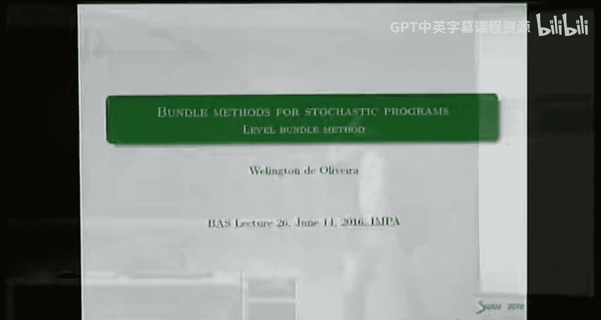

嗯。So we are going to last class。 We studied the proximal bundle method。

 but we haven't studied the conversion analysis。 So in the first part of this class。

 we are going to study the conversionence analysis of proximal bundle method。 And then we。

 we change to we switch to another bundle method， which is the， the level variant。

 just to recall some。

Some ingredients of proximal bundle method。Well， the problem of interest。

Is minimizing a convex function。Over a convex set。So， here we are shown。Is a convex function。

Is a convex set。This that probably Heed in general， it's it has a easy structure。

 could be the whole R N， for example。The proximal bundle method we have。Okay。

 this is assumption of our problem。So one of the ingredients of proximal bundle method is a model。

We call it。F M， aration K。Which is the maximum。Of unionizations。And that these linear， well。

 the number of organisation is bounded。 from it belongs to this。Bundlow of information。

And this is just an index set。Contained。1，2。Well， in fact。

 we have extra information in this bundle also， which is the aggregategregal linearization。嗯。

Im gonna。Nanization。Which is。Dnalization。We call it index。'm sorry， I don't know here's correct。

You put this index a。Which is， by definition。Yeah。I don't know。

 I don't remember where I put the the index。And well do next it to 8。我说。嗯。This point solves。So。

 this point。Is the unique solution。Of our Q P program。Which is。If I'm not mistaken。

 I put in this here。Is that correct。河东人民不。How I use it。O， doesn't matter。Okay。

 but here we are minimizing over our feasible set。Something that sh I， I didn't。Mention last class。

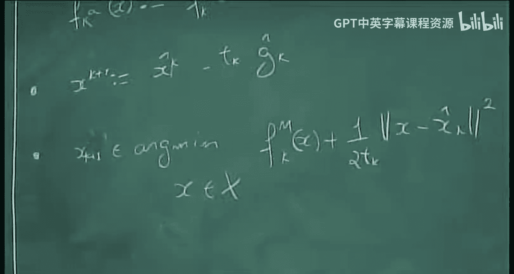

Is the following。If you replace。The model， by the function itself。嗯。have， if you are minimizing。

This there。This is a proximal method。Because we have the function itself。So， but in our case。

 we are concerned about stochastic optimization。 So this function。

Could be in two stage setting or a mode stage。Program problems。 So it's hard to evaluate。

 So solving this problem。To define iterate is can be as difficult as solving the problem itself。

 not considering this part。Well， the advantage of proximal bundlemeter is we replace this difficult function by a simple model。

 and this model can be this one， for example。嗯。So this justifies in the name， the term proximal。

 because it's related to the proximal method。Well， I think we have more ingredients。 We need to。

Should remember。嗯。We have the。Predicted。Decrease。That we call it。Okay。

The value of the function at the last series。Le stability center。

We show that this predicted decrease can be written like。Using the aggregated。Yeah who。This。

And we also。2。It's important。This is， by definition。So we。

 we show that this aggregated the is non negative。 The the the predicted decrease can be written this form。

And we had an important inequality， which was。哦。

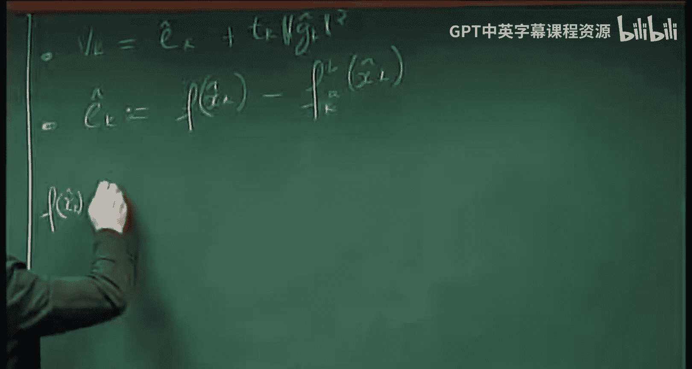

If I'm not mistakeakn is this。This for。All feasible。

So what we want to do is to generate a sequence of points。

such that the aggregateator error vanishes and also this norm。So if this is 0， this is 0。啊。

It have opt。So， we have that。The last stability center。So this is optimal。 This is what we want。啊。

Okay。I think this is all。 We are now ready to see the conversion analysis of this method。

As I said before。We're going to see the conversion channelss。

 and then we switch to another variant of bundle methods。Well， okay， this is I've just。Tal it about。

I should recall also the algorithm， how the algorithm works。Well， we have a initial point。

 We call the oracle。And。We call the oracle。 We have the linearization。 We have the F the first。Sorry。

 he should， should be a M here。We have the first model。 We solve the Q P program。

 We have X K plus one so that we can compute this direction G the expected。Predicted decreasees。

So this is our stopping test。If you have enough decrease of the function。

 we update disability center。Otherwise， we keep the stability center。Fix it。Despite part。

We enrich the model。And we loop。This is the algorithm。 we saw last class。

And for the convergence analysis， we need to consider two excluding cases。The first one is when the。

 the algorithm generates infinite Italy many serious steps， which means。The sequence。

Of stability center。It's infinite。My has a。In Italy， many terms。And the other case。

 is when this is finite。啊。Well， this is our goal to show that these two measures go to 0。

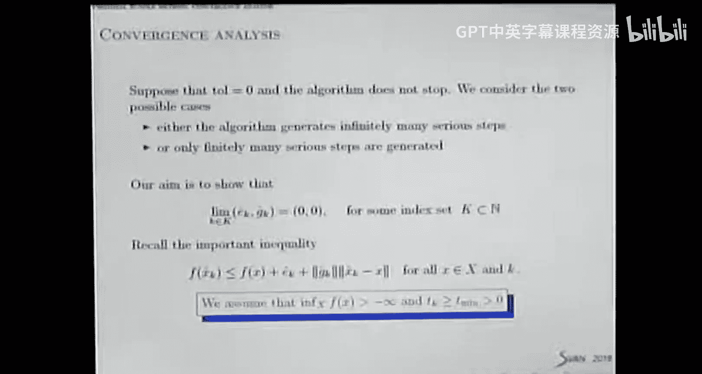

And we are going to rely on the assumption that。呃。The function is bounded from below。

 So this is weaker。 Then I assume that the， the the the program has an optimal solution。

 This is weaker。Okay， we can think that the problem has a solution， for example， to be easier。

 And we are assuming that the pros parameter is bounded away from 0。

But it is since hearing a definition of our， our， of our algorithm。嗯。Okay。

So our analysis will focus on these two cases， okay。呃。

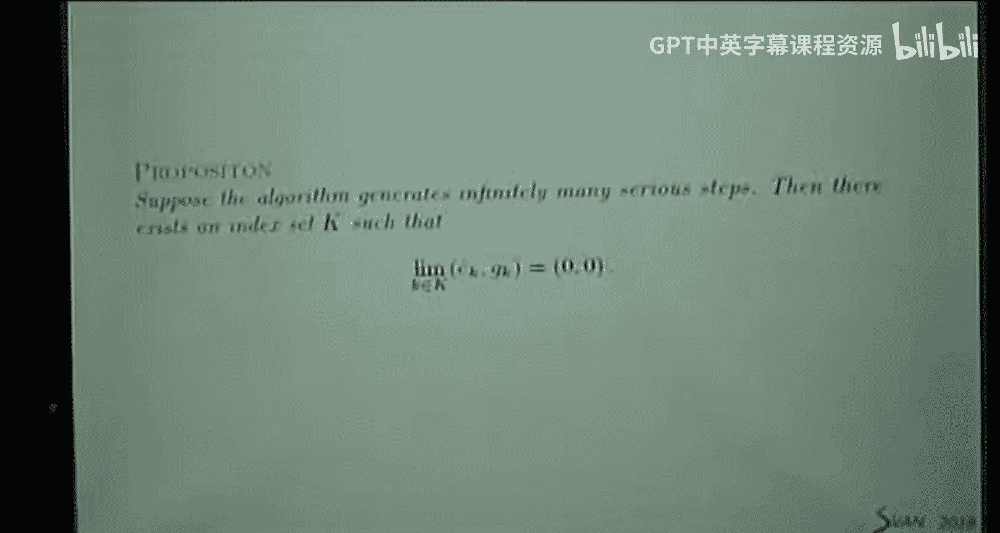

Let's consider the first case， in which。The algorithm generates infinite Italy， many serious steps。

And I want to show。

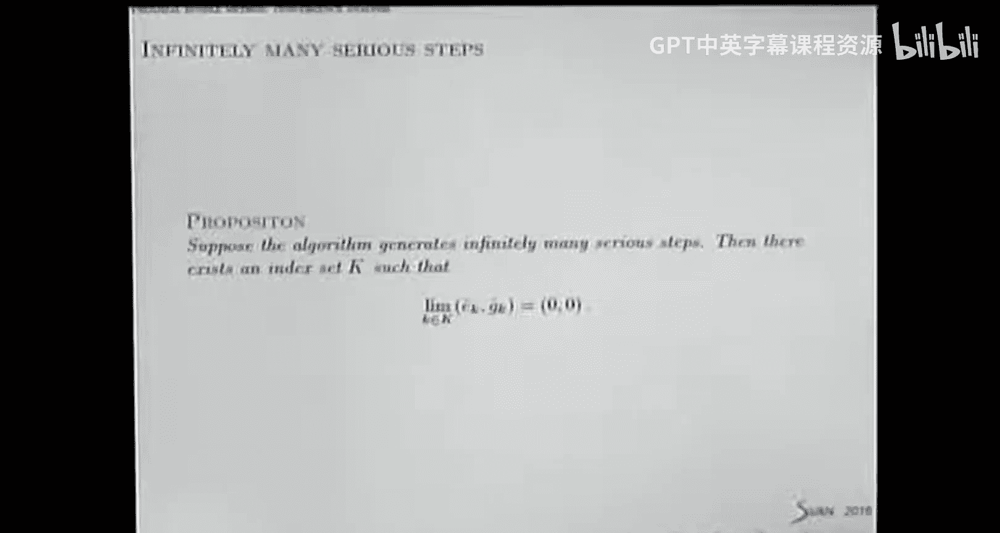

That the two measures go to 0。This is not hard to show。So we know that iterate is declared series。

0 step，0，0 iterate。文。This one。Here。see how like。

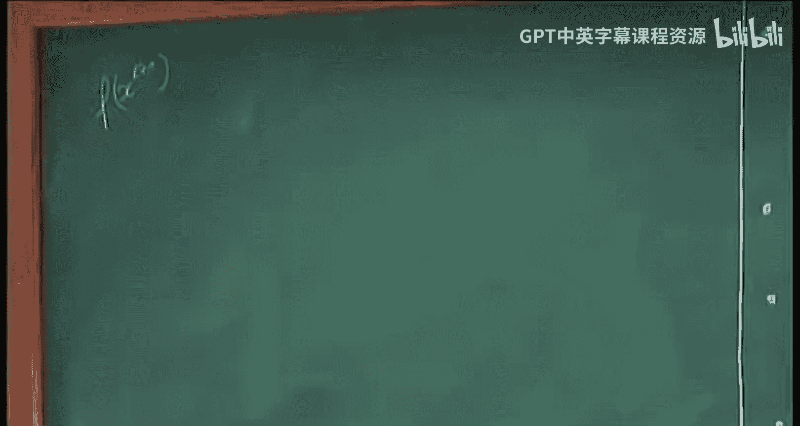

F it。Okay。

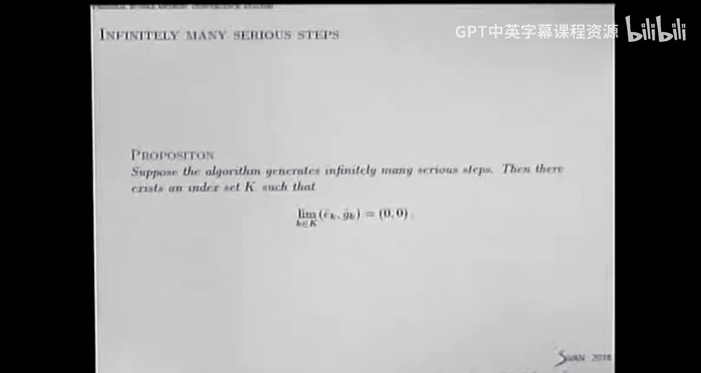

This ka is a number between 0 and 1， and here is。They predict the decrease。So this is their rule。So。

 let's define。可。Of all。Nation。In which。So this is the same then。嗯。Well， since we define this counter。

It doesn't matter if I put a hat here or not。 is the same。

 I'm just referring to the element of the sequence。That resulted in a。serious step。

We can write these in this form。And we are assuming that this sequence is an infinity， so。And。

Go to infinite， plus infinite。啊。So， I can write this。S。搞吧。But。Less than or equal。Okay， something。

We know that。 This is。Or negative。And we， with some。Dister。Over L。This will be。The first term。And。

We assume that the function is。Hes bounded from below。So， this is。Something。This is finite。

So you have shown that this sequence。呃。This theory。Converse， so this implies。That。Limit。Of key。

Its equal 2，0。Where this index set。K。Is equal to。K1 and so one。K2。や酸。And so on。呃。Okay。

 we are almost done。Because now we are going to use this definition。Here。So we know that 0 is equal。

So we assume that this decay is bounded。

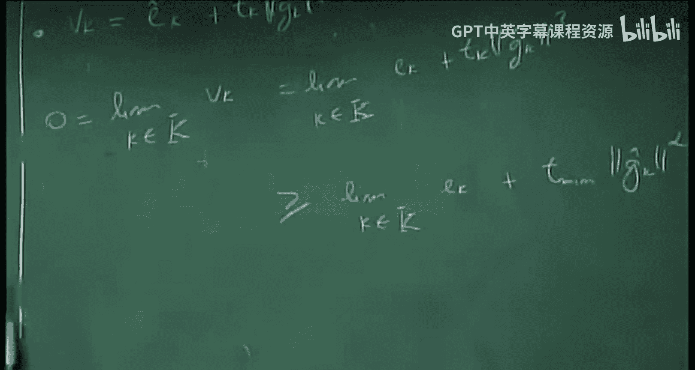

And， of course， this is positive。 We have shown this is positive。And do have our result。Okay。So。

 this is the first part。For the other case is a bit more involving。 in fact， is。A lot more。

 much more involved。So we， we split。

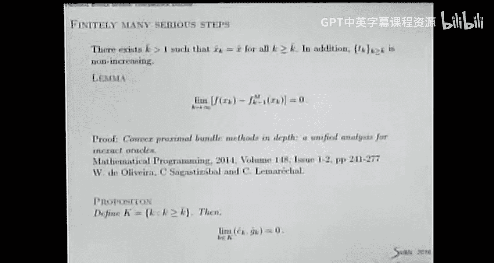

Into thislemma。So， this is a。Similar result。But to show this result， we need thislemma。And here。

 it is。Where。The bundle management。Comes into play。 B management， I I mean， by。

We choose our bond of information。Such that。The new linearization。The linearization。

And the aggregate linearization is in the bundle。So if you use only this information， it's enough。

To have this result。This is a technical。 I'm going to to skip the proof of this result。

 If you are interested， you can see， for example， in this， in this paper。 In fact， in this paper。

 you， you， you have all the theory to， to prove conversion analysis analysis of。Many bundle methods。

 So it's a complete the articleical paper in this， in， on this subject。

So we are going to assume this。 Let's assume。And let's move to this part。

 which is not so that difficult。Now。Now， we are going to assume。That。This inequality happens。

Only financially many times。Okay， so。If it happens on if in。For Italy， many times。There exist。

A barque。Such that。F of X K。B。Greater than。In fact， I can write like that K plus1。搞吧。So。This happens。

Okay。Largeger equal equal to curve。K bar。 So if is inequality is not satisfied， it means that。X。

 K is fixed。 We are not changing disability center。Okay， so it's fixed it。

 You can assume that it's fixed。For all all K belonging。To this other set。To define it there。Okay。

 so this guys fix it。 Now， we are not。Changing the distributed center。呃。To have。To prove our result。

We start from dilemma。The demo ensures that。0 is equal。做。This is the land吗？Okay。

 now we assume that K is。Large。So if this is true， we can just。Say like that。

Not take a sub sequenceequ。And we are going to use this inequality。

With k replace K plus  one replaced by k。

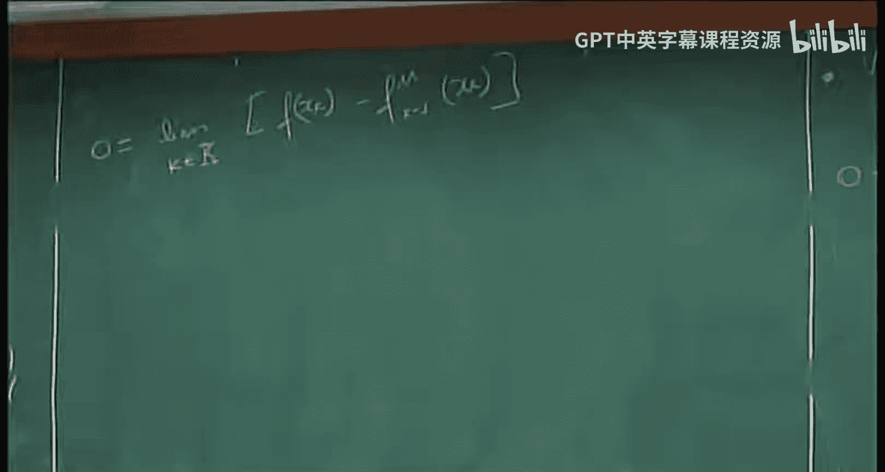

So， this will be。一共。呃。Are you replace。This by。Mus。卡巴。V K，-1。And here， I just repeat。啊。Okay。

 so we have the value of the function at the last table center minus the model。So， this is the。

Predicted decrease。This is。V K-1， minus k。V came in this one。Or just simply。And this is。那哪个地。

Then we use the same argument here。And we have a result。Okay， the idea is the same。So far。

And and here we are done。This implies the result。This goes to you。

Notes that we have different index set。For the noll step。

For when you have finitely remaining a zero step， this is the index set。And what we saw previously。

The key。 I had to era it。But was related to。

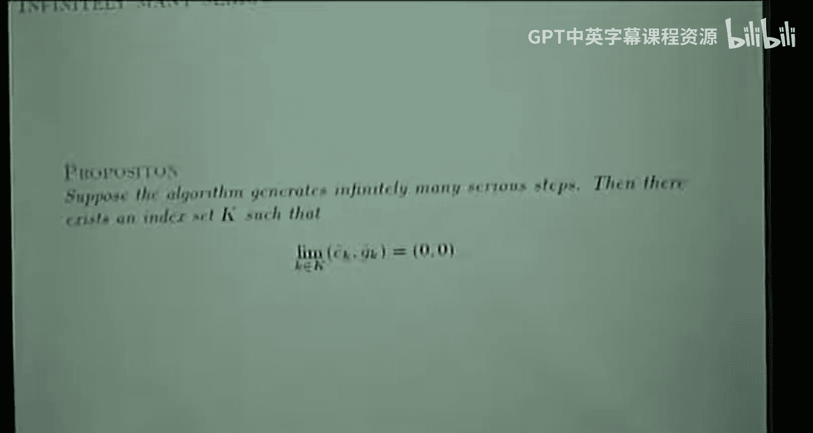

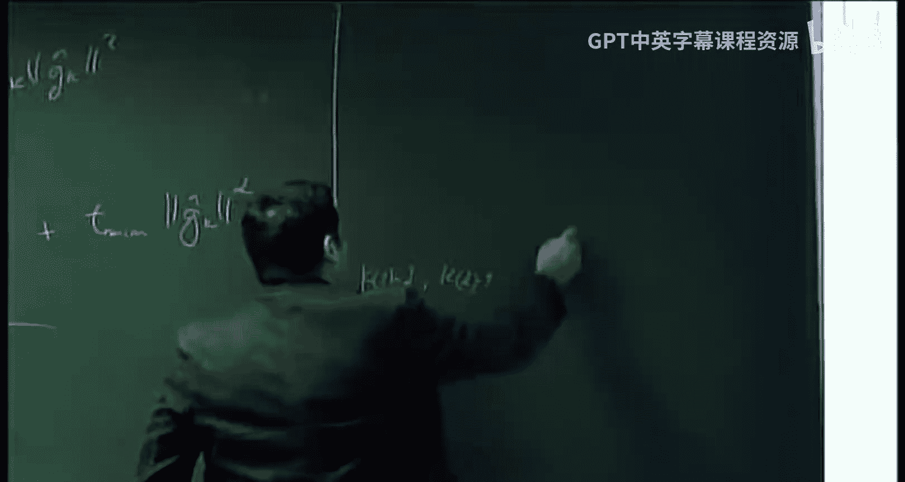

认死我。So different index set。 But the important thing is。

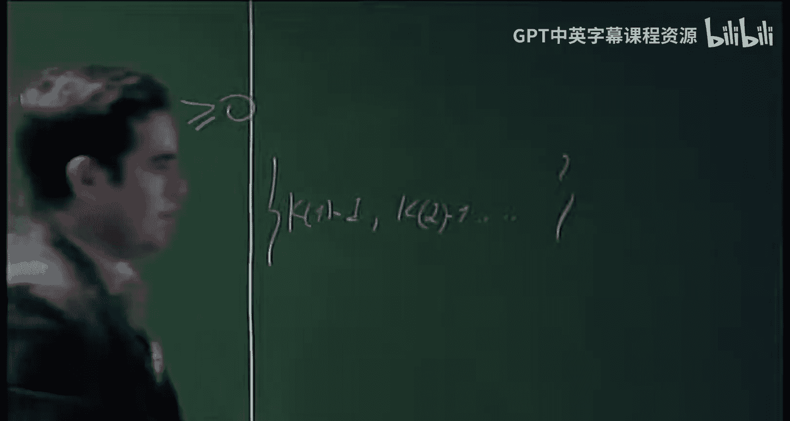

The important measures。Vanish。In both two， in the two possible cases。

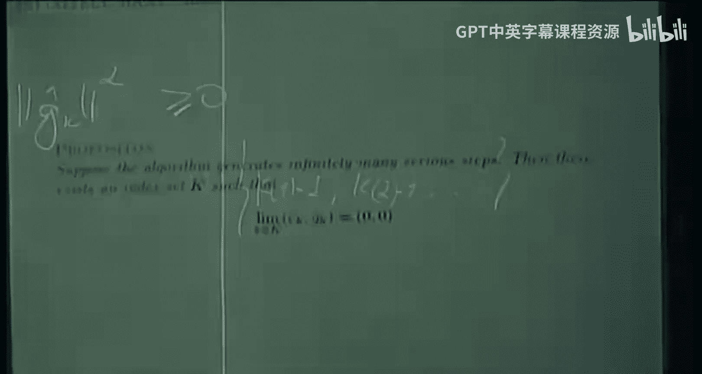

With this， we can improve。The main T or M。And in fact， here， I'm using minimum， but could be in。

 as I said。The our analysis only relies on， on the boundness of the function F。

And to show this Ethereum， well。The first item there exists a index set index index set K such that this limit is 0。

 So these we have seen for the two。Possible case。 So this is already done on just the two previous propositions。

this eating is done。 The second the it。This function。Converses to the。

 the bound to the minimum value of the function。我 the info。How you show this。Well， we know that。

That sequence is monotton。We know that this sequence is monotton because the sequence is developed the function evaluated at the stability center。

 So it decreases oh。Can be fixed for some iterations along nu itates， and then the cr again。So。

 but an important thing is it doesn't increase。

And。To simplify， let's assume。Let's assume that this sequence。Is bounded。

This is just to simplify the proof。 The proof of that theorem doesn't require this assumption。

 This is why it's not written there。I'm assuming here， just to simplify。So when， when you get this。

 for example， when this happens。This is the case。When。F。Is corive。A方向。Like opening arms。

 So a function like that。We have， for example， the first established center。

And you know that the function value the sequence decrease。 So we are going to only decrease。

It means that in no way we can come here up or here up。 So it means that the sequence has to be。

In this regime。For example， or at least。This region。So if the function is coerciive， this sequence。

Is bounded。It's bound， for example， it the feasible set bound bounded itself。But once again。

 this is just to simplify。The conversion centers。Doesn't assume。Boundness of this sequence。Okay。

 if the sequence is bounded， remember that inequ equality。Okay， this is true。For。All feasible point。

We use the first item。So if apply the limit here。You be less than or equal to。F of x。

 if you apply the limit here， this is 0。This is 0 because we assume this sequence is bounded。

The vanishes。And for all。X， so it means。That this sequence。Converse。To the opportunity side。And。Well。

 by dis inequality。Any cluster point。 So you know that it exists。Un excited here。

Any cluster point of the sequence of stability center。Is。A solution。

 optimal solution for the problem。So this is the third item。A accumulation points， if they exist。

Is a solution。

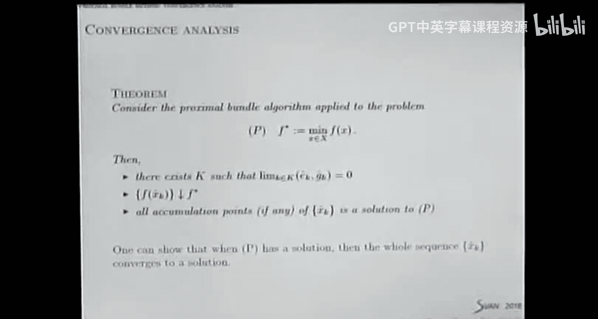

So the problem， well。嗯。Why if N， if it we may， if you take you the in here and assume that the function is bounded from below。

 but you don't need to assume that you have a solution。

So you don't have a cluster point in this case， That is a solution because there is no solution。

 But if you have a solution， then any cluster point of this sequence。Solves your problem。 And。

 in fact。If you assume that we have a solution， then the entire sequence we can show this is a more general result when we are assume only in exactly we are assume that this function is computed in exactlyly。

 But if you assume that we can evaluate this function exactly。 So， in fact。

 we have a stronger result， the entire sequence。Converse to a solution。Re result is stronger。

We have that。This。Converse。土啊。Optimal solution of the problem， the entire sequence。um。

It's not difficult to show this， but I'm going to skip。Because I want to talk about the other method。

Well， in this conversation channels， well， was not difficult to approve the conversion channelss of this method。

Because I。I didn't enter in the tails into the tail in this lemon。

 Perhaps is the the most in difficult part of the convergenence analysis。

It's not that the idea is difficult。 It's too many details。The idea is not so that complicated。Well。

With this theorem， we。

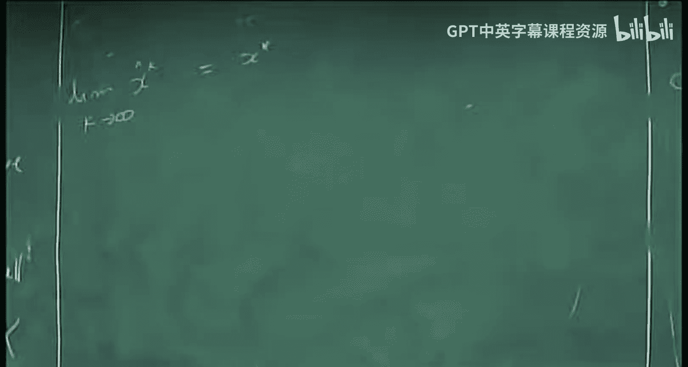

We finish this the analysis of this method， the proximal bundle method。

So now we are going to consider another。Valianant of bundle methods。That's a newer variant。嗯。

It was proposing。1995 by two Russians and one French guy。And the three guys。Hold quo the Mar。

Acade Milovsk and Mrrov and the three guys hold the dancingtcing prize。 That is the。

 the most important price in optimization。The three guys， not for this this work for the Kahi。

 of course。嗯。Well。So now we are going to start this one。The。

 the proximal one was developed in 70s and this one in the 90s。

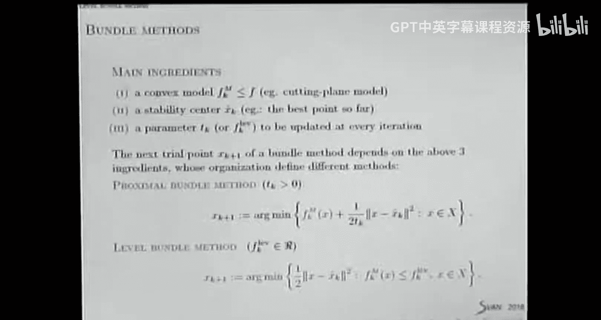

And they are closer。Qusly related。 So the difference here， we move the model。To the constraints。

Instead of this pro parameter， we have a level parameter。 In fact， here， if you look it closely。

This is the level set of the model。And the word。Making projections。Onto the level set。

 the models level set。I think I have written something here。2。

It turns out that depend on these two parameters。The solution of the proximal study problem is also a solution of this one。

And。To have an idea why this is true， let's start from here。The proximal bundlemeter。

The exit city to 8。Is the unique solution。Why unique， because the function is strictly convex。

 The feasible sets convex So the solution is unique。Okay， this is approximately solid problem。呃。

If you multiply the objective function by a constant， do not change the solution， right。

 a positive constant。So I will multiply by Tk。Okay， so is the same thing。If I subtract。

A constant will not change。The optimal solution。So， I was。Subtract by。A parametermeter。Okay。

Nothing changed。 Now， look at this。T K as a lagian multiplier。Optimmal agreement。

 if you see this as a optimal。Lren multiplier。So this is the whole function。After the problem。

So if this is the optimal。Like there什么不。Is the same solution here。So， they are related。

Each other by this result。 But， in fact， the point the this parameter here。

Not necessarily this the gra multiplier the optimum。 Well， this is only the odd article and and。

In theory， impact。The methods， they are。They behave differently from each other。

 You have this result in theory。 But in practice， the behavior is different。Okay。Yeah。

There is a third。I didn't Were not going to startud， but there is a trust regime bundle method also。

Which is。You minimize。내 뭐요。Over a feasible set。And。You don't want to。Get away from your center。So。

 this。A parameter， that's diameter of the ball。 So this is a regimeium method。It's another variant。

We are not going to start this。In fact， there is a fourth。1。Which combines this two。

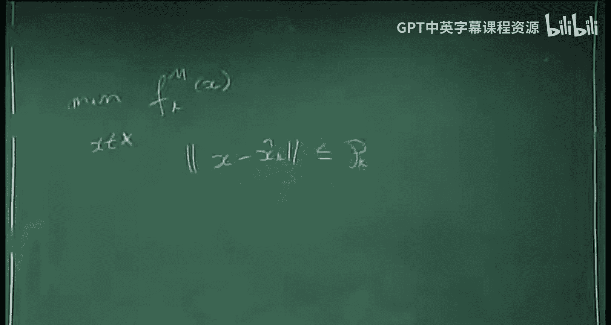

So this is。Ttorization。Bundle math。That is one another one。Doubly stabilized。Bundle method。

Which defines the to date by。M my the model。Subject to the module。So if you neglect this part。

 to have a proxima  one， If you neglect this， we have the level bundle method。

 So this is why it's doubly stabild because we use it two kind of stabilization。

 the quadra one and the level set one。And the advantage of this method here is when you solve it。

 you have a La， you get a lagent multiplier for this constraint。 and this lag multiplier。

Multipliier helps to update this stick。 That's the only the， the the main idea of this。

 in including this constraint here to update this product。 Okay， but we're not going to start this。

Neithative。Let's focus on this one， the level variant。How it works。Well。Once again。

 our model will be the same as the proxima 1。 We start finish point。 have called the orac。

 We have a linearization。We are going to assume that it's given a parameter。

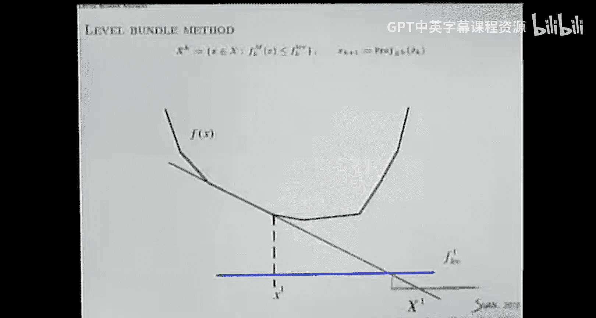

With this parameter， we define this level set for the model level set composed by the points。

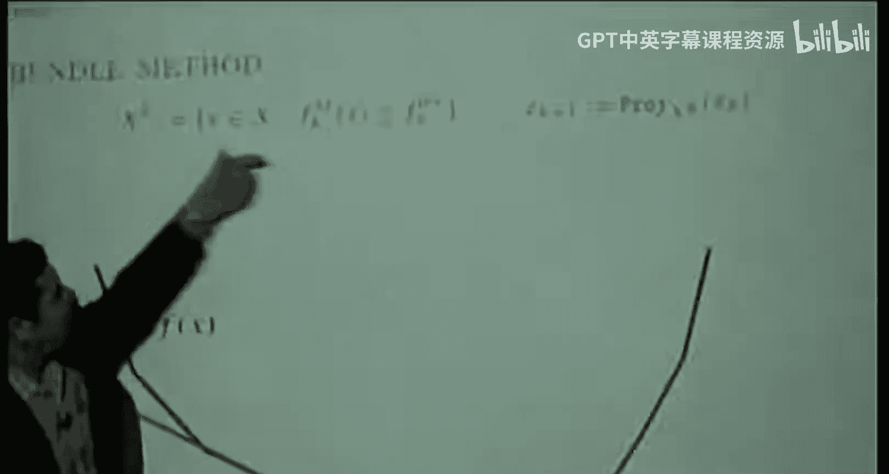

That。The model is under this parameter， just the， the green region here。

And the idea is the next hit to8 is the projection of this guy。

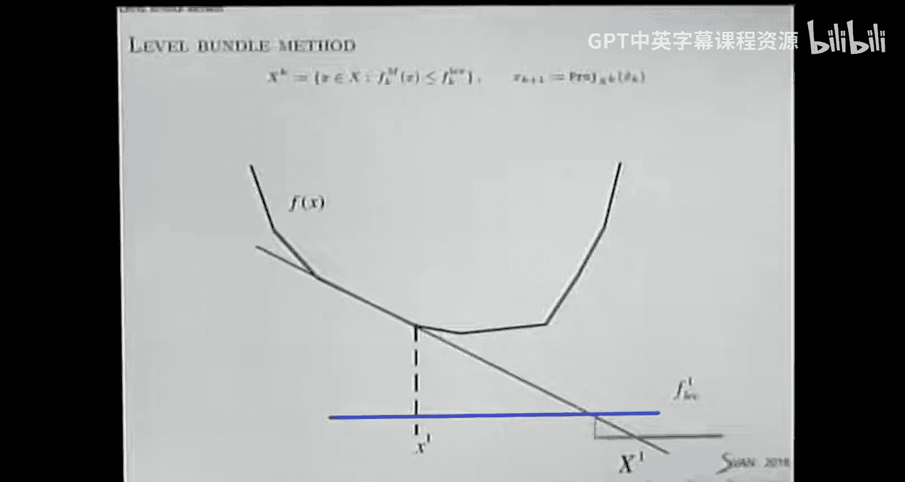

Onto that set。So we don't need compactness here。Also， if you project。You have here。

 So this was supposed to be X hat and this X。 Sorry for that。

Once you have the new candidate to evaluate the function， computer and other linearization。Somehow。

 we need to updateedate。Our。Level parameter。 I'm going to show how to update this parameter。

Suppose it's given here。 This is the new level parameter。

Now the level set for the model is this green Reg。And we project the stability center。

 the best candidate， which is this one onto that region。Here。😔，In this case。

 we decrease the value of the function。 So this guy now becomes the stability center。

we need another level， per enter。And going like that， to be converge。呃。One thing here。

 it's worth mentioning。

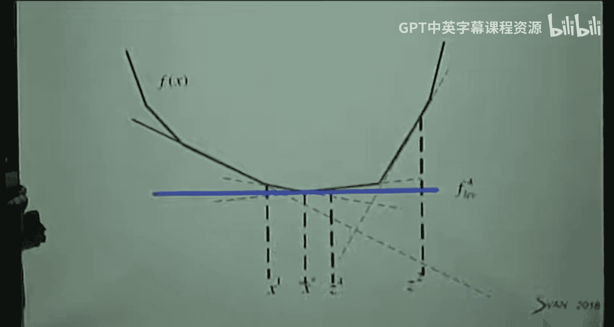

Is that。If you keep this parametermeter here， fix it， the map will not work。And the proximal part。

 and the proximal bundle method。

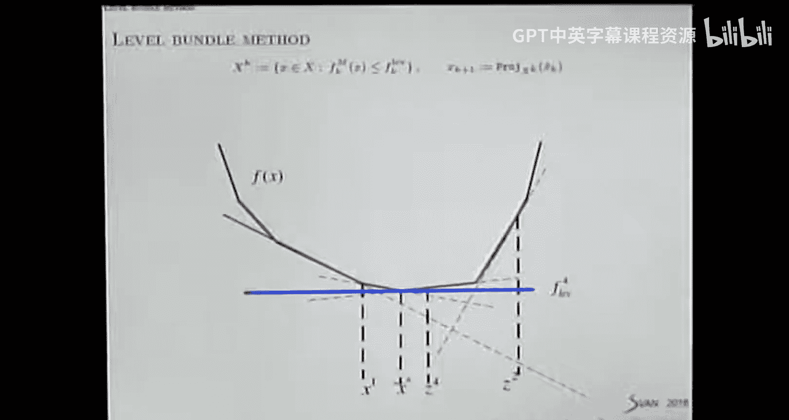

We could have the parametermeter T K fixed， for example， equal to one。So， it will。Impact the。The。

 the， the， the conversion and the conversion will the。

 the algorithm will be faster or not depend on how you update this product。 But if keep it fixed。

 it will work。But with the left on the method， no， you have to update that parameter at。诶。A。

But the fact is， to this parameter is easy。

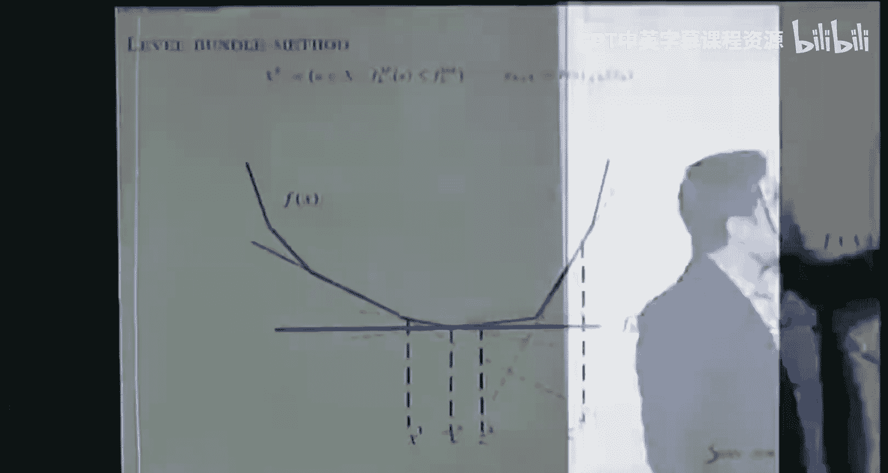

Yesし。2。You have a double。

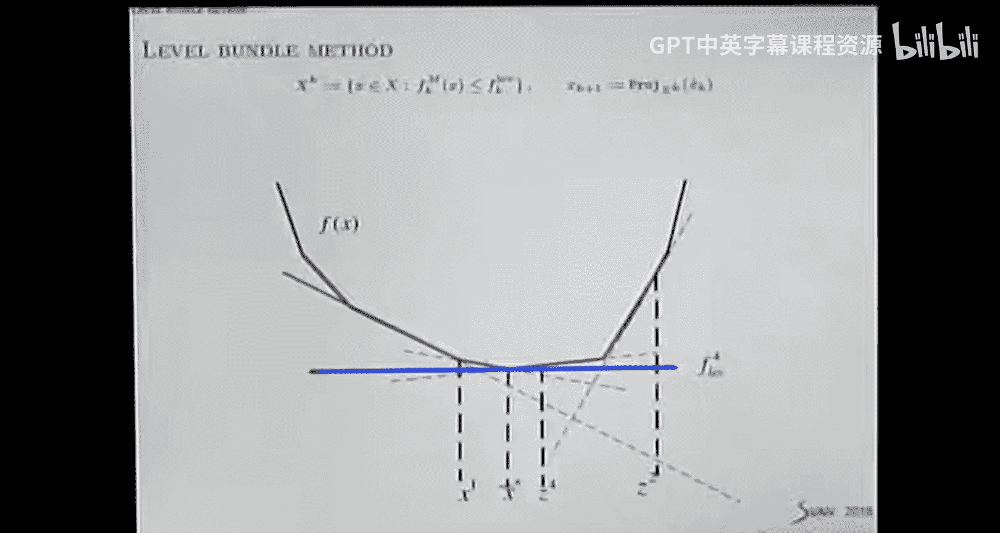

Suppose， no， suppose that this T K is the lag multiplier of this constraint。So in this case。

 this is the dual function。If you have a dual optimal La multiplier， you fix here and you minimize。

 it's like you are， you are defining our dual function。 If this is optimal。

 the solution will be also solution of this one。The interpretation is here that I'm using。

 assuming that this is。A la multiplier。Sorry， could you repeat your question。No， no， we're not。

 We are just choosing it by a given rule。We don't have this。With the rule we are using in practice。

 we don't know。 We don't have a way to ensure this in practice， this is only in theory。嗯。Okay， good。

嗯。I want to show how to update the， the level parameter。I called。This set the level set of the model。

Set of points， feasible points， such that。The model value for the model。Is less or equal。

 less than or equal too。不来说。ほな对。嗯。Okay。We could think of the fine。This guy， you are going to do this。

 in fact。This parameter。You belong to upper bound of your function。Sorry。Lower。And the upper bond。

We can take， for example， for example。Ging a gamma。Between01。For example， we can take。

I'm not sure here。 Perhaps I have tose， but let me see。Mus okay。OK到了。F up。

Just a convex combination between these two values。So for starting the method。

 we should assume that we know a lower bound for the function。This is not too risk restrictive。

And the upper bound， Well， we know we have a feasible point。

 We call the oracle and you get a value of the function。 This is upper bound for your optimum value。

The level parameter can be as simple as that。 Just a convex combination。呃。Well， if I write this。

This will be。I want to write this in another way。 I think the way it is written。In these slides。So。

And not exactly。 You can wish。The first level I bundle matter to compute that every time you have to have an update date here。

 you have to update this guy。 But then we see that this is not mandatory。

 And I'm I'm going to show you why。So this we update data at every， the app。 It's not easy。

 You have this information。 This is not difficult。To update the F flow。为什么。ItSt here。

So this the same thing。Or you just can say that。This level of parameter parameterter。Is。F flew。Plus。

 a fraction。O。The dualalta gap。

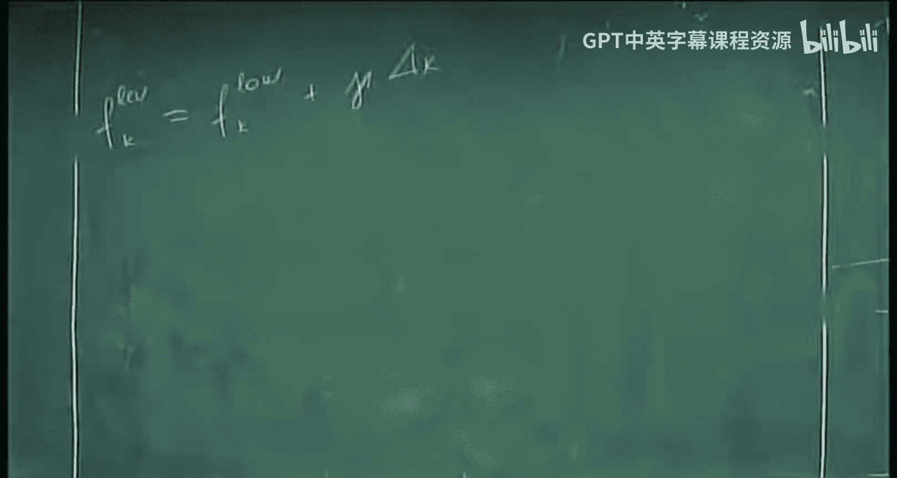

Do I the gap。Is F F K minus。F looking。And we， can， we stop the method。When this。Optimimate the gap。

Is。Less than a。U到。嗯。How we the， the， the point rise by clta。How we， we。

 do we have to compute this lower bound at avertration。The idea is。We can do that， for example。

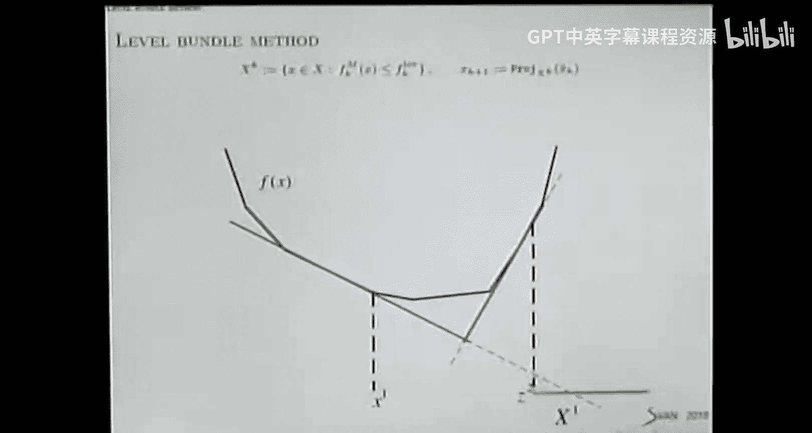

If you minimize the model。You get a lower bound。So this is is how the first life abundant matters。

Was proposed。 So at aration， you have to solve two study problems，1。

 which is like the added shaped method， cat method， minimizing the model to get a lower bound。

And once you have a lower bound， you make a combination between your up and the lower bound。

 and you find a level of parameter in between here。So you know， this is your upper bound。

 This is your lower bound， and the F left is in between。And now to define the exiter  rate。

 we need to solve a Q P。So， two sub parameters。To at every tradition。However， we don't need。

To to minimize the cutippen model to update the lower bond。The rule is the following。

 Keep the lower bound fix it。 You start with something。And you keep it fixed it。 until。

 when you try to project onto this。

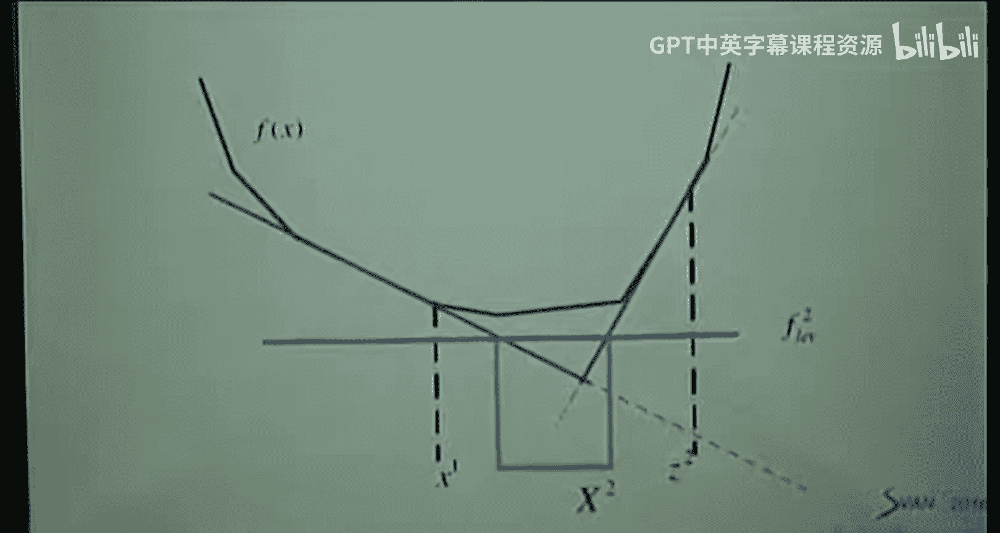

Set， and you find that this set is empty。What happens when this。Sa is empty。嗯。I could use here。

Suppose， this is true。And。This set。Cons。60万。Is that clear。Because， well。This model is approximation。

This is true。Because。The model。Approximates the function from below。呃。This implies that。If。

The level set。Is empty。It implies that this set is also ampt。If this set is a， means that this value。

Is a lower is a lower bump for the optim van。So， it implies that。This guy。Is strict。Lower than。

The up thread。So how we can do， in this case。We just take。F。The next one。We will receive。This guy。

And then。You define the next one。マです。按你共体呢。个。So the idea just to be lazy。 Okay。

 you will start with a lower bound。 You are lazy and you keep that lower bound fixed that you have。

This level parameter。And when you try to project on the level set， well。

Most of the Q P solves to make this projection will return you with a flag saying that this set is invisible。

 feasible。 Yeah， it's invisible。 For example， if it's feasible， you have the。The projection。

 the point， if it's invisible， the software you pro you tell you this set is in。 In this case。

 you make this update date。Toate again a1 per m， and continue。And。

One thing that doing this procedure。If you keep， this guy， fix it。

It doesn't imply that the level parameters fixed。 It implies that it' is going to decrease。Because。

 well， although the you are lower。Your lower bound is fixed， but your upper bound can decrease。

So you are going to decrease the gap。 If you decrease the gap， you are decreasing your level。

And this is going to be useful for our conversionence analysis。But just。

 this is just to say you have two alternatives to update this level product。

 You can apply this rule always， but to update the lower bound。At averageration by Soviet LP。

 or if you are。You don't want to spend time solving AliP。 Just keep it fix it。

And you have to be careful here。2。If。If you define。

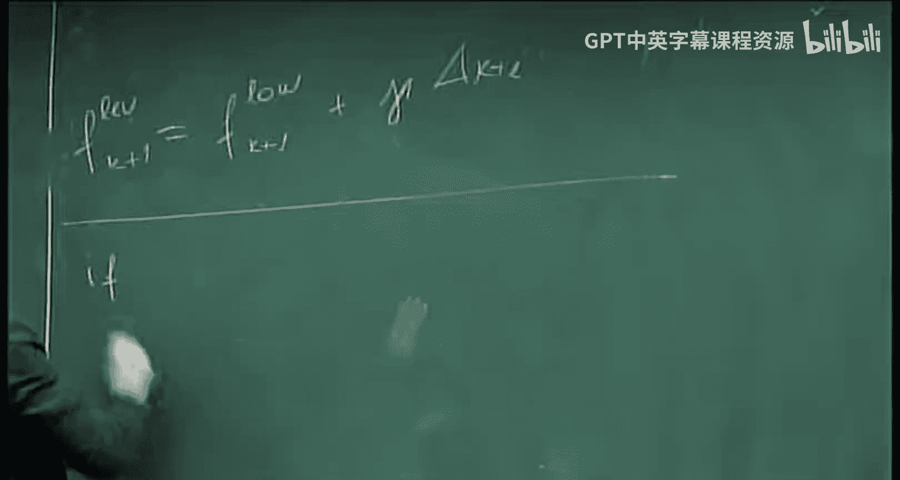

Effthello。Eal to the。The solution of this LP。这样。Think like that。You should define this way。

And using this rule。You ensure that。The level。Set。Is no name。F。Okay。Why。Because same。

Defining the lower bound。 by minim the model。 The model is is in in red。

 If you minimize the lower bound is here。And then we take the level parameters something greater than this lower bound。

 So it means that your level set here。😊，You'll be no empty。And this， you don't have problems。

 you don't need to check if youre a Q P solver。 youll provide this information if the set is feasible or is in。

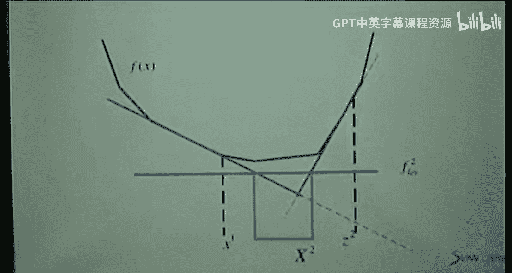

呃Well。Let's move forward。One thing that I like very much in this method is the fact that you have freedom to choose your stability centre。

The stability center doesn't need to be necessarily the best point you have。It could be， for example。

 the previous itererate。Could be the initial point。The idea is。Well。

Remember in the promal bundle math， you want to you have a stability center。

 which is the best point you know so far。 And you define an exiter rate not far away from that point。

 and because you have a quadra term。Now， in the projection， the okay。

 this co in proximal mono map gives you a stabilization of your method here。

 The stabilization is in the level set is in the level。 is in the the feasible set， which is。The。

 the level set， this is your stabilization。So it doesn't。

 I know that the next will be defined in that level set。

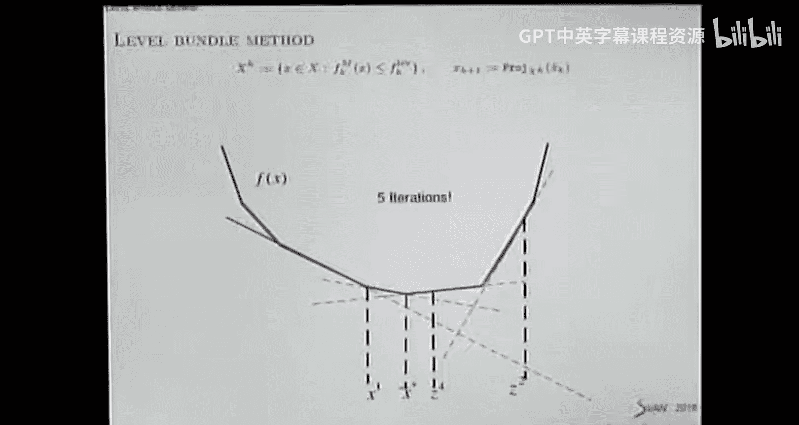

But since we are working with projections， My level set can be far away。

 and I can just project there。So the point that I'm projecting。

 the projecting point doesn't need to be the best point so far。

You can have just a fix that can keep it fixed it。And， but in practice。

 it's better if you upate this point sometimes， for example。

 using the serious step rule that we studied。This first a rule。

Was the rule proposing the first level a bundle method。It's good， but it has a drawback。 For example。

 it doesn't allow you to keep the bundle of information bounded。

 You have to gather all the information。If you keep it fixed or according to this series tab。

 then we can delete some linearizations。Okay。So this is quality， in my opinion。嗯。It's better。Okay。

 it's not clear in theory。 It's， you see this when you are you have implementations。

 If you compare your implement， you implement a bundle。

 life a bundle method and you use this rule or this one。For example， if you use this one。

 you see that the first or the third。Work bad。Impacts。Not because it's far。

 but depend on the position you are that initial， that point is。 you have a。

A convex set in that case is polyhedral。 sorry， but well， you can project far away on that point。

And they find here。Or if you update data at some point， you are in the other side。

And you are going to update。 So you are going to define different it。

 depending on your stability center。Now， which one is better？ It's not clear in theory。

 You just see this in practice。So I， I like this rule here。For example。呃。Update  level parameter。

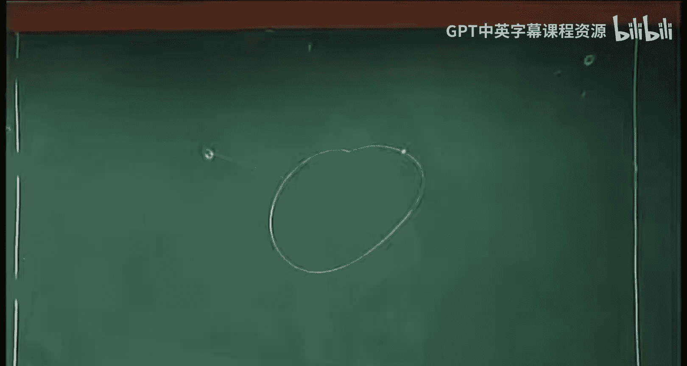

That its crucial。 Okay， this we have already discussed and the， the level bundle matter。

 it gives you some flexibility。嗯。For example， in this paper here。

 we dealt with an exact value of the function sub gradientdient。And here we worked with in general。

 Hubert spaces。 and here we worked on mix of the inge。Optimization problems。

So when the the a feasible set is。Mix at the inage。 So the projection is not orthotgonal anymore。

 You have some problems， but still have。a good algorithm with nice conversionence results。

 And in practice， it works reasonably well。嗯。Well。But I'm not going to enter the in these variants。

Let's focus on a simple variant。For all to analyze the。Conversionence。

We are going to assume that the feasible set is compact。This is just to。

To simplify the conversion channels， it doesn't need to be compact。 Okay， doesn't need just first。

Simplicity。嗯。Okay， we are going to applyly to， to employ this Catplan model， Martin Neo here。

We have this first result。Well。Remember the， the way we update the proximal Bo math was you。

 you focus on your stability center from your ability center， get this direction and this step。

 The proximal point， you know this guy it's given this T K。Here in the level。

 this guy you don't know it。 It's a lag multiplier of this。Constraint。

 so when you solved your projection problem， you are going to to get。La multiplier。

 that is this sticky。Okay， and here it's。This first part。Is the adjust the optimal conditions。

Of for our problem。This point is the unique solution。Of the projection problem。そ。Take A T conditions。

The optimal condition of this problem。Well give。This apppidating。And this D K。At the fact here。

 we don't know if it's 0 or not。 Well， in fact， it's different from 0。Is your projection。

Projecting point。Is outside your level set。A the ideas like that。For example， here。

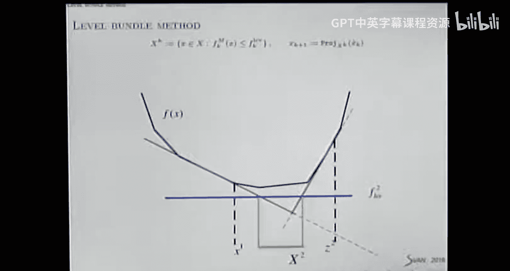

The projection projecting point is outside of the level set， if you project。This point onto to that。

 your constraint will be active。 If yourre constraint will be active， you。

 you are going to have a non0 lag multiplier。 So T K will be strictly positive in this case。嗯。

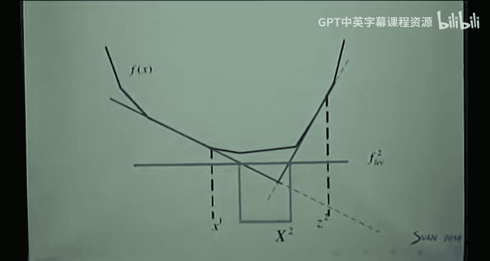

So， this is why。This step size will be strictly positive。Because of that assumption。And。This is0。

 This is just K K T conditions， okay。You can move this guy to the objective function and then using the assumption of the feasible sets polyhedro。

 or has a。ANo empty interior， relative interior。And。Well， just K K T conditions。 This。

 this inequality here。There is a detail。 This is different from the proximal bundle metal。

 because here we are dividing this guy by T K。Just a comment on that。

This P of x belongs to this sub financial。 The sub financial of the indicator function is the normal con。

 So， in fact， this is a con。If you multiply by a positive constant， is inside the con。

So this is why you just multiply divide here by T K just to get this nice structure， okay。

But the idea is the same than the proximal one。Dis inequality。

 the aggregate aggregated linearization is the same idea as we show it in proximal bundle Earth。

 What's new here。It's just this result。 And this one I'm going to show。呃。

This result says the falling。We have a level set with many union， and who make a projection。Now。

 if you remove all the linearizations and keep only this one， the aggregated one。

If you do the projection again， we are going to get the same point。Okay， it。

 the fact that this linearization， it condenses out the， the useful information for your own methods。

So this is why it's important to you if you delete some linearization。 If you keep these one。

 it's like you are keeping relevant information in your bundle。To show that result。啊。嗯。So。

We know that this lag multiplier。Is strictly positive because our projecting point is outside of。The。

 the， the level set。Well， by this inequality， by this equality。We know that。네 뭐。To this point。

Is equal。图。The level bottom。嗯。thetu of this。

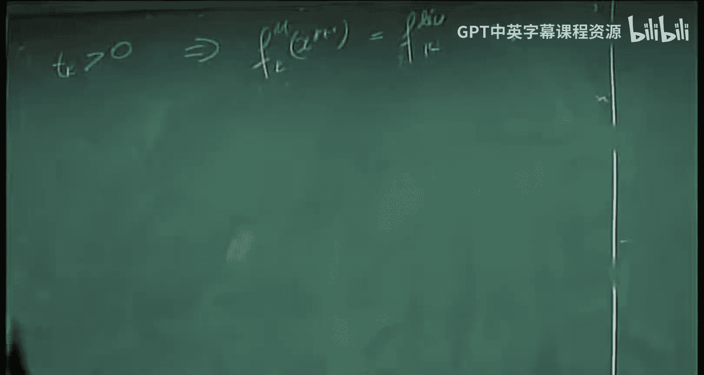

For example， here。

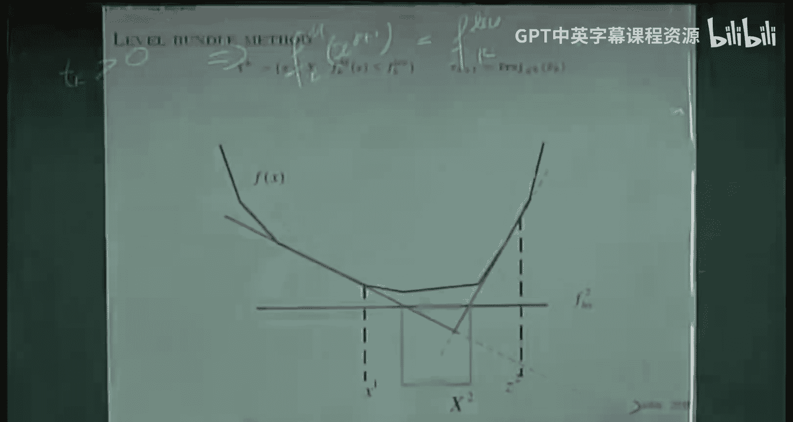

In blue the level parameter， if you project this point on the level set。The， the， the。

 the model at this point coincides with the level， okay。This is intuition。

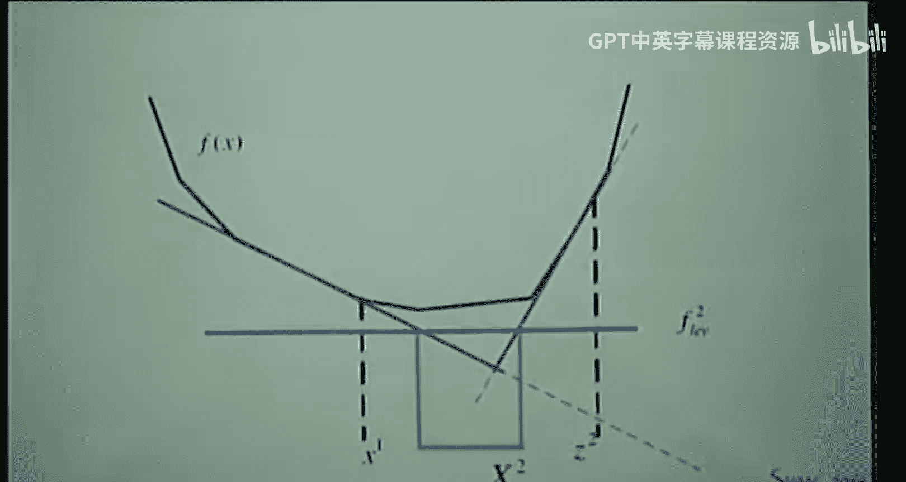

Okay。So， this is true。That aggregate。Level set。Feaible points。Such that。You aggregate linearization。

This is a definition。The aggregate linearization。 If you use the definition， youll be。The model。Here。

 Oh， sorry。O， O。It's okay。Okay， on the definition of this linearization。

 now we we are going to use that this value coincides with this。

And we are going to use the definition ofjihat。This will be。This will be a。X。Hot。Minus x K plus1。

Divided by T。Okay。Times。Well。We have shown that。嗯。We have shown that。D inequality。For all X。In this。

Set。This is just the projection。This implied that。X play， x K plus1。Is the projection on that point。

That set of the project， the projection of this point on't that set。

But the x K plus1 is the project is this projection here。So we have quality。Okay。

 so this is just to emphasize that this linearization， indeed。

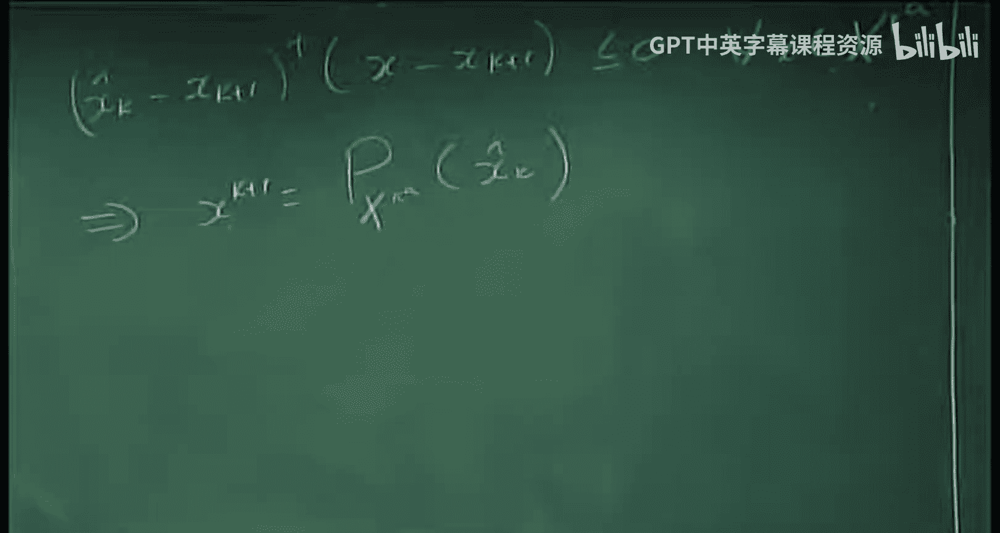

Summarize the useful information of your model。Okay。The algorithm。Just， this is one possibility。

 I'm assuming here that the feasible set。Is compact。 It doesn't appear。

 We don't need compactness here in the algorithm， but for the conversion channels。

 we use this assumption。 However， as I said， this is just to simplify。呃。Okay， the idea is the same。

 Well， here we start with a gamma that is to for the convex combination。

 the lower upper and lower bound to define the level per enterter。An had who had a cupa。

 Here have a gamma。We need a lower bound。If you don't have a lower bound for your problem。

How can computer ease。Computing in a easy manner， a lower bound。So in this algorithm。

 we assume that the feasible sets compact。For example， if you don't know any lower bound。

 you can just define。You are first lower bound。S。The minimization。Of this linearization。

Over your feasible set。 So this is aization。 and the variable here is x。So， this is LP。Okay。

 if you solve this LP， you have a lower bond。Of course， this can be really loose。 It can be。

Very far away from the， the optimum value。 But it's a way of computing allow。

 If you don't have a candidate for it。Well， you call the aac or your black box。

 You have those information。 You define your upper bound。And well。

 the financial stability center is the first point。You define here。The optimal gap。

 if it's small enough， you stop otherwise。You may choose another stability center or not。 As I said。

 this is not mandatory。You can keep it fixed forever。嗯。Well， you have a lower bound。

 You have this optimal gap。 you define your levels parameter。And you try why I wrote here。

 try to obtain the exit to rate， try because， well， depend on your rule to update date F law。

Your feasible set can be aped。This is why try。If the Q， P， Q P is invisible。

 this is easy rule to up the lower bound。In this case， you have to come back here。And restart。呃。

Otherwise， if you， if you manage to compute the nexter rate， you call the Oracle， you update the。

 the upper bound。You update your bundle。Yeah， it's the bundle management。 I come back to step 1。

 That's a simple algorithm。And mainly when your feasible set compact， it works really well。

 really well。 If you compare this with。A cut method。 Well， it's much faster。Is it because the， the。

 the projection gives you a sort of stabilization and the algorithm much faster。It's much faster。

Well， just。嗯。When applied to a stochastic program。To stage stock program。

 This algorithm is known as level de composition。And the level bundle method applied to stochastic problem is。

is named it。Level the composition。And。In my PhD Tsis， I worked with a method for this kind of method。

For a stochastic program。And we published a paper showing that are now very similar to this one。

 some new features。Was 70% faster than Ali shaped，70% faster。And one year later， less than one year。

 year later， some group of researchers from Europe has shown that， in fact。

 the algorithm for their experiments in real life problems was almost 80% faster than any shaped。

It's。Well， but we have to exploit the oracle， in fact， to have this。This speed。

 you have to exploit your oracle when computing the function of value， the function here。

 The fact is， you need to evaluate their function exactly only at certain points。 That's the trick。

 So in this way， is， you。You can save some time。 CPU time。Some know a lot， in fact。Well。

 this is the lower bound updating。 I already explained。 this is one alternative。

 why the in the cut method， you don't have this constraint。Why I put this constraint。

 Because we may delete some linearization。 And if it delete some linearization。

Your lower bound is not a monoton， for example。 So to keep it monoton， you add this constraint。

But simple constraint。And， well， it's adisable when they are function。If you。

 if you update your lower bond by this rule， it's likely you are going to perform less iterations。

So if you perform less iterations。Because， well， you have a better estimate of the lower bound。

 then you can your product will be well set。And you are going to perform less iteration。

 If your oracle is expensive， you are going to perform less oracle calls。 It's better to use this。

 So what is my， my device is。If the oracle is more expensive， you。

 you need more time in the oracle than to solve this LP。I advise you to solve this LP。

 at every edition。Because you are going to save some oracle calls。

 But if your oracle call is just easy。It's much faster than solving this LEDP。 So don't use this。

 Just keep the lower bound fixed then update and the physical set temp。That's。A rule that works well。

 in practice。呃。Okay， just bundle updating。Nothing new here。

I'm just saying we can just keep these tool linearizations。Your bundle。1 different rule to。

 to the F stability center is this one。You keep your stability center fixed it。When。You decrease。

Your gap by a certain fraction。And then， you update。呃。For example， let's start the first iteration。

 This L is 0 or one I don all0。 The first iteration。

 you have a bond because you start with a lower bond。 and call the orrc。 You have a upper bound。

 So you have this gap。The first iteration， you keep your stability center as the first point。

 first it， and you keep it fixed it。When your gap is less than or equal to this dira of the initial。

Optimal gap。Then you up a data or Sa center。And you update this counter。

 this is counting how many times you updated the stability sent。And then the process repeat。

 this just a rule that also works well。 That idea。 Well。

 the metal works if you keep disability center fixed it forever。Okay。

 but if you are updating this way。It's matter in practice。Okay。Or using the。

 the serial step rule as an proximal bundle method。嗯。Okay， I think the。嗯。No。

 let's give the intuition for the con and analysis。 And I have to finish it in the next class。

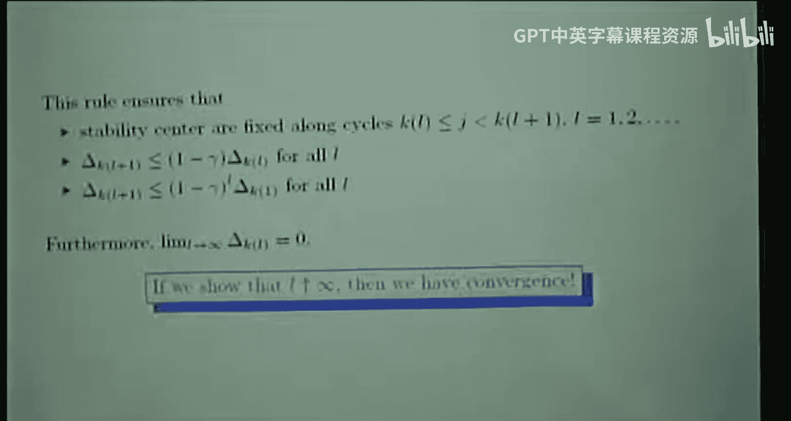

The idea is， we are going to split our iteration。Our iterations into cycles。And this cycle is。

Deine it as the data ratios in which you keep disability center fix it。Okay， so。Between。To centers。

 you have a set of linear of iterations。 And we call this a cycle， okay。And this is by。

 by this definition here。 if you use this step 2， the algorithm， by this definition。

For the stability， when you change your stability center， you have this inequality。

If you expand this inequality， you are going to arrive in this one。 Here's the first initial gap。

Well， it says that。If you change stability center many times， it means that if you。

 you have many cycles。L it goes to inf to in plus infinity。 then you have conversions。

So for this simple variant of level bundle method， what we want to do is to show that。

The number of stability center we are going to up the Dis center goes to infinitefin。

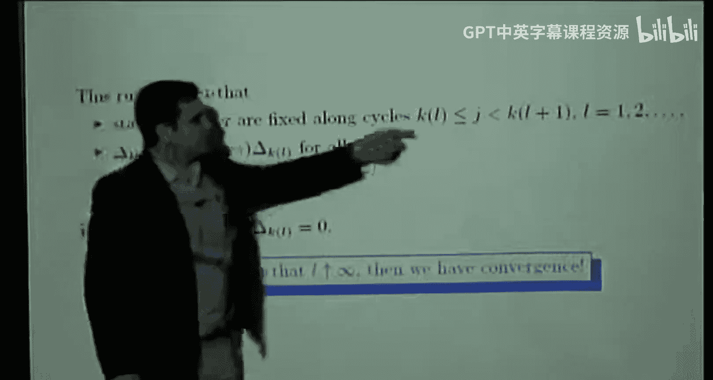

By using it again。This simple rule。Well。For showing。De。Discounter goes to infinitefinite。

We have to show that。After， finite many times。You are going to satisfy this inequality。

You keep a stability center， fixed it。 You perform iterations。So after finitely manyters。

You have disequality。 This is what you have to prove。If you have this inequality。

 we increase the the counter and you proceed again。呃。In fact， I said I。

 I said wrongly here that we have to show that the number of times you update stability center goes infinite。

This is not the right thing to say。Because。In this rule。

 what's important is we need to satisfy thisequality。 You have to show this inality。

 Youll be satisfied infinitely many times。 This is stability center。

 Just say you can update your stability center。 For example， keep it fixed。Doesn't give a rule。

 You can keep this guy fixing。And man， this guy could be outside our feasible set。

Doesn't need to be feasible， in fact。 that idea D， I'm， I'm。

 I'm projecting a point far away from a set。 So I don't care from where I'm projecting。

On to this set， I can then projecting want to project that point or this one or that one doesn't matter。

 needs to be fixed for some iterations or fixed forever。 doesn't matter。 And for some iterations。

It means。This cycle here。呃。Okay， so next class， we are going to work on these assumptions to show that。

 in fact。This L goes to infinitefin。 If you have a toleranceance equal to 0。

 But this is the subject of next class we finish here。

