# 随机编程基础课程：27：利用智能预言机加速优化

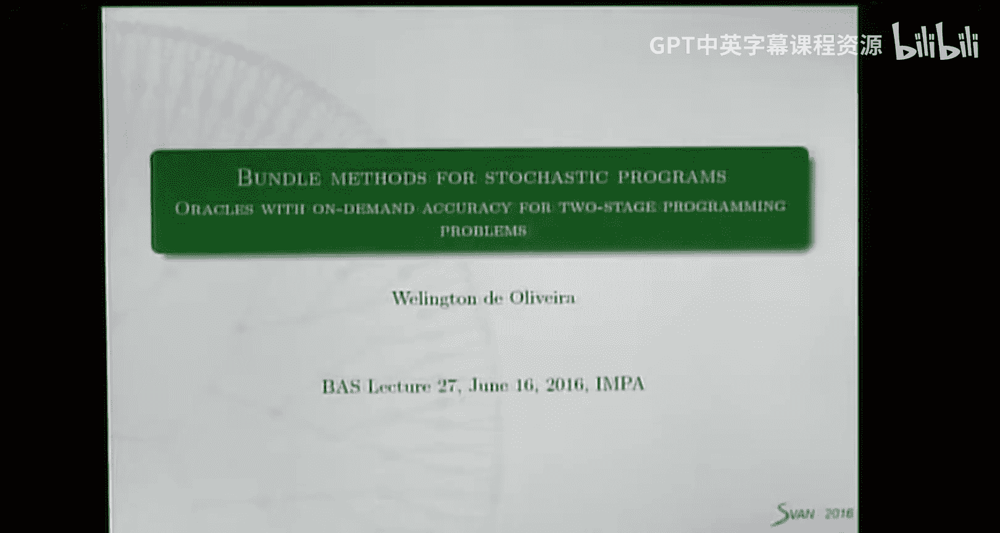


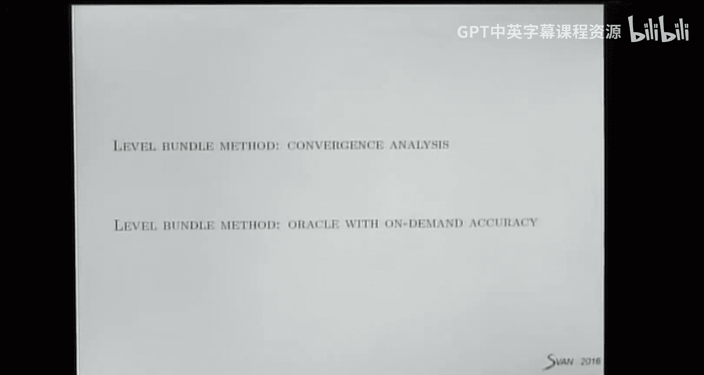

在本节课中，我们将继续学习束方法，并探讨如何利用两阶段随机规划问题的结构来加速优化过程。我们将重点介绍一种称为“智能预言机”的技术，它通过控制计算精度来减少每次迭代的计算成本，从而在整体上节省CPU时间。


上一节我们介绍了基本的水平束方法及其收敛性分析。本节中，我们将看看如何将这种方法应用于两阶段随机规划问题，并利用其结构设计更高效的预言机。

## 算法回顾：水平束方法

首先，我们回顾一下上一节课介绍的水平束方法算法。该算法只需要设置一个参数 `gamma`，这简化了参数调优过程。

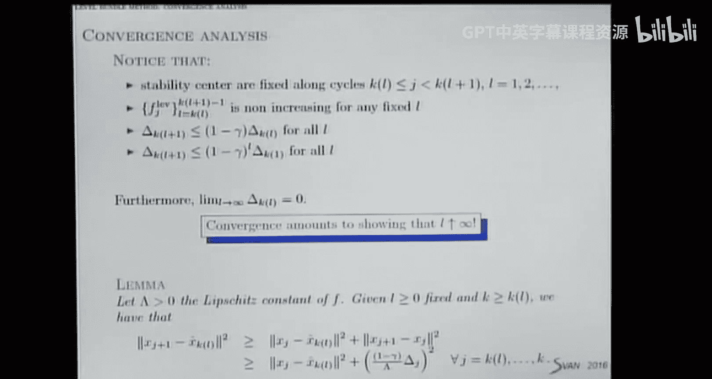


**算法步骤：**
1.  **初始化**：给定初始点 `x1`（作为第一个稳定中心），设置参数 `gamma`（通常在0到1之间，理论最优值约为0.23），以及最优间隙的容忍度。
2.  **计算下界**：通过求解一个线性规划问题（例如，在可行集上最小化第一个线性化函数）来获得目标函数最优值的下界 `low`。如果不知道，可以简单计算。
3.  **设置水平参数**：水平参数 `f_level` 是上界 `up` 和下界 `low` 的一个凸组合：`f_level = (1 - gamma) * low + gamma * up`。它被用来定义水平集。
4.  **求解子问题**：将当前稳定中心投影到由割模型定义的水平集上，得到试探点 `x_k+1`。这通过求解一个二次规划（QP）完成。
    *   如果QP可行，得到 `x_k+1`，转到步骤5。
    *   如果QP不可行（水平集为空），则更新下界：`low = f_level`，然后返回步骤3重新计算水平参数。
5.  **调用预言机**：在点 `x_k+1` 处计算函数值 `f(x_k+1)` 和次梯度 `g_k+1`。用 `f(x_k+1)` 更新当前最优上界 `up`。
6.  **束管理**：将新的线性化信息（函数值和次梯度）加入束中。可以采取两种策略：
    *   **添加**：直接加入新的线性化。
    *   **压缩**：删除所有旧的线性化，只保留最新的线性化和一个聚合线性化。聚合线性化是之前所有次梯度的凸组合，其系数来自QP问题的拉格朗日乘子。实际上，可以删除那些对应拉格朗日乘子为0的线性化，因为它们对定义当前试探点没有贡献。
7.  **更新稳定中心**：检查是否显著减小了最优间隙。如果是，则将 `x_k+1` 设为新的稳定中心，并增加计数器 `L`。
8.  **收敛性检查**：如果最优间隙 `up - low` 小于容忍度，则停止；否则，返回步骤3。

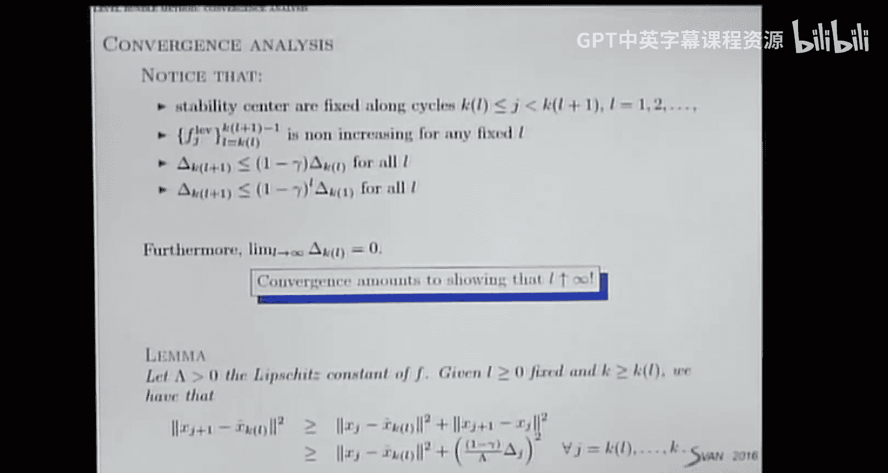


该算法的直观理解是，通过将迭代过程划分为以稳定中心不变的“周期”，并证明在每个周期内，迭代点会逐渐远离稳定中心，且步长与当前最优间隙成正比。由于可行集有界，这种远离不可能无限进行，因此周期长度有限，算法最终会更新稳定中心并减小最优间隙，从而收敛。

## 应用于两阶段随机规划

现在，我们将上述方法应用于标准的两阶段随机线性规划问题。

**问题形式：**
```
最小化 c^T x + E[Q(x, ξ)]
约束条件： Ax = b, x >= 0
其中，Q(x, ξ) = 最小化 q(ξ)^T y
约束条件： T(ξ)x + W(ξ)y = h(ξ), y >= 0
```

在传统的L形方法或近似束方法中，“预言机”（即第二阶段问题的求解）需要为每个场景ξ精确求解线性规划（LP），以得到精确的函数值和次梯度（由对偶变量给出）。

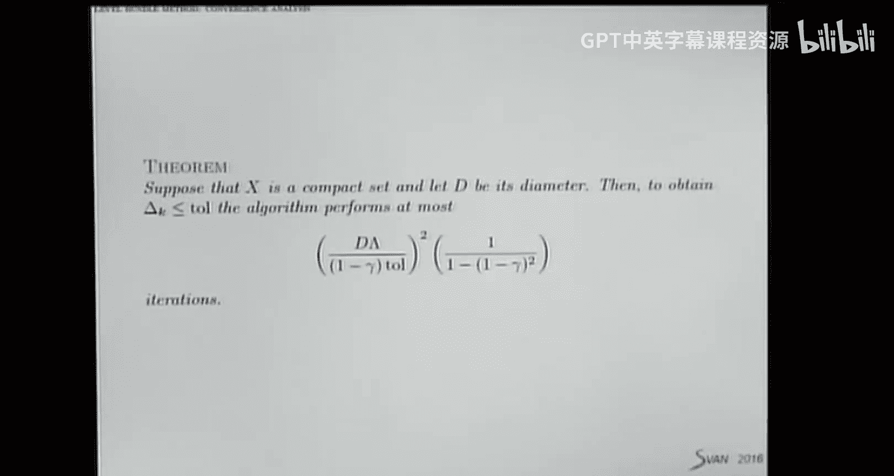

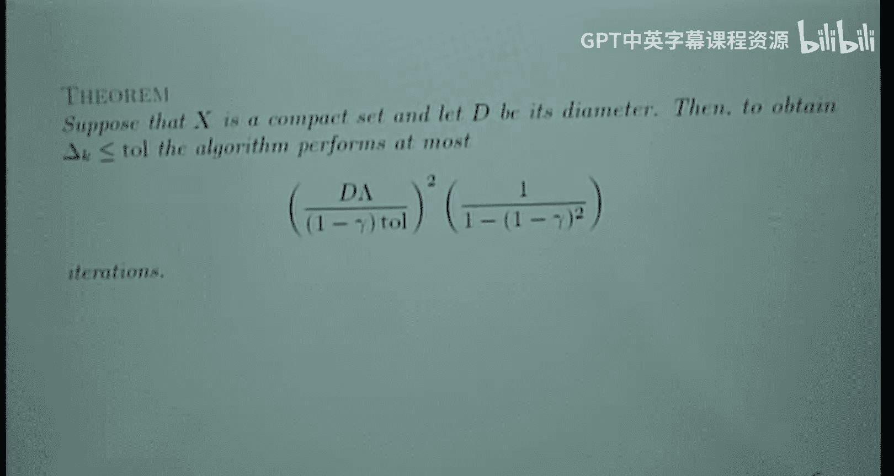

**智能预言机的思想**：我们不精确求解所有LP，而是为一部分场景提供快速近似解，从而得到一个近似的函数值和次梯度。我们以一种可控的方式引入这种不精确性，确保算法仍然收敛，并且由于每次预言机调用更廉价，总体CPU时间减少。

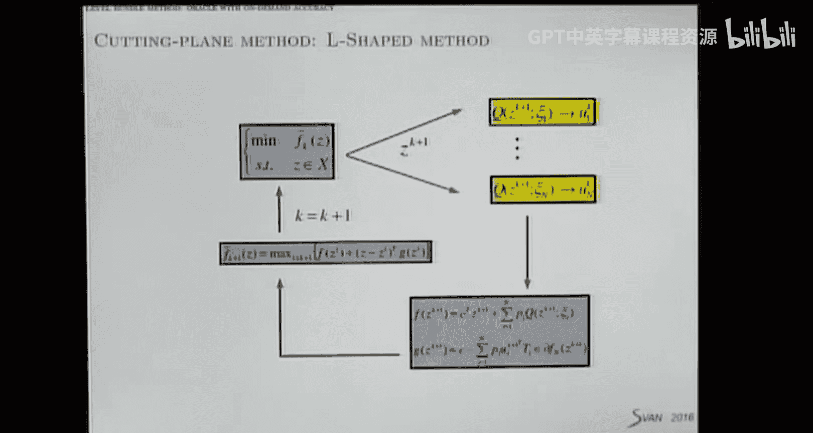

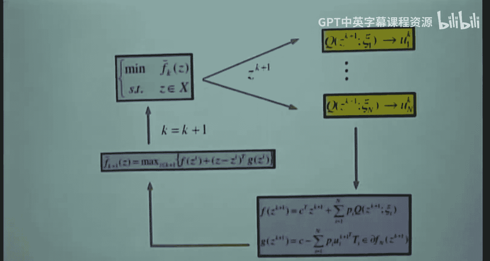

## 智能预言机的类型

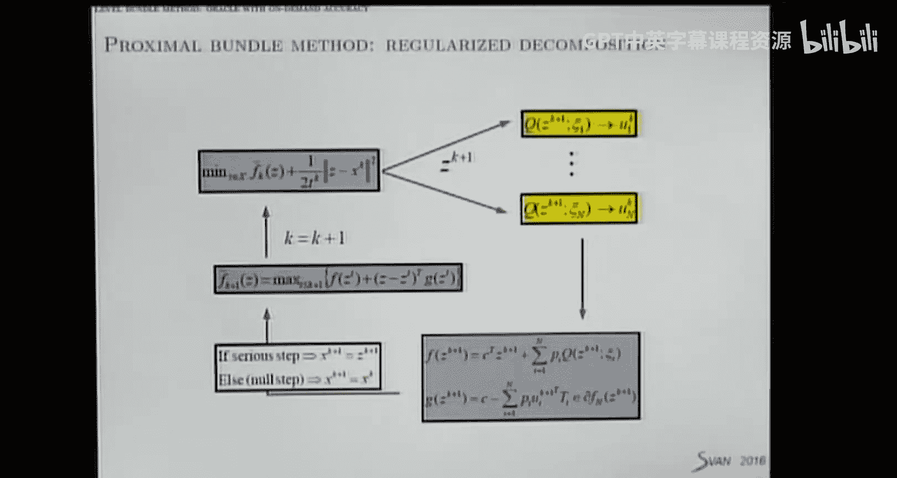

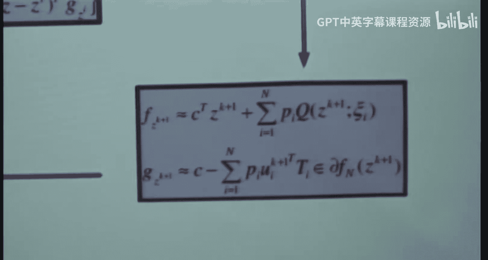

关键在于如何处理预言机的不精确性。我们主要关注能提供“下近似”的预言机。

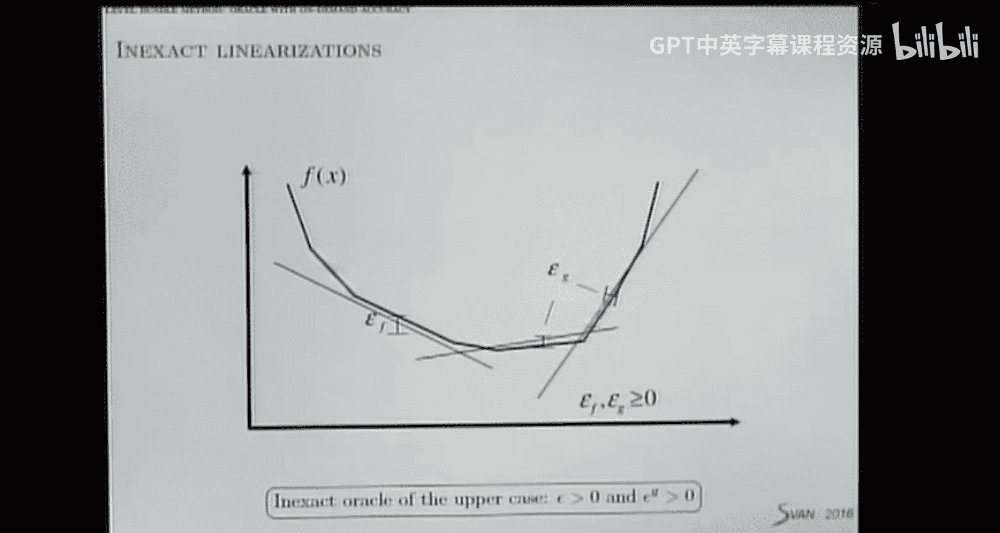

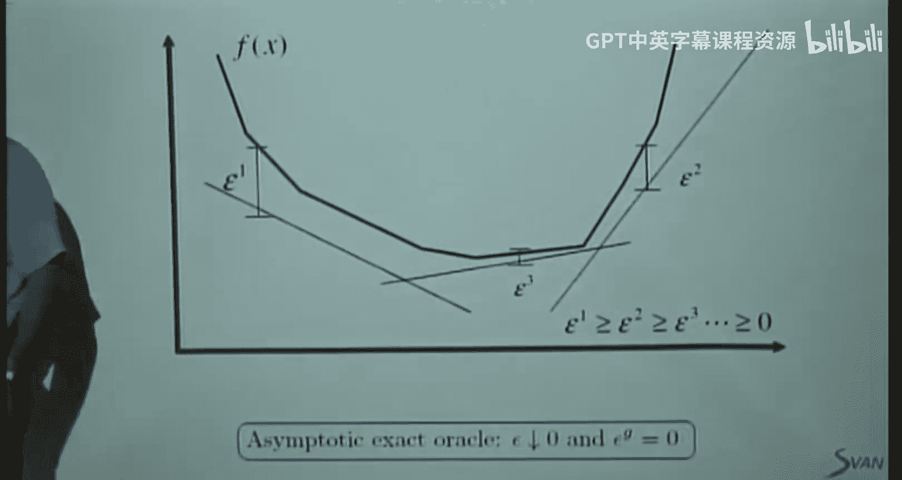


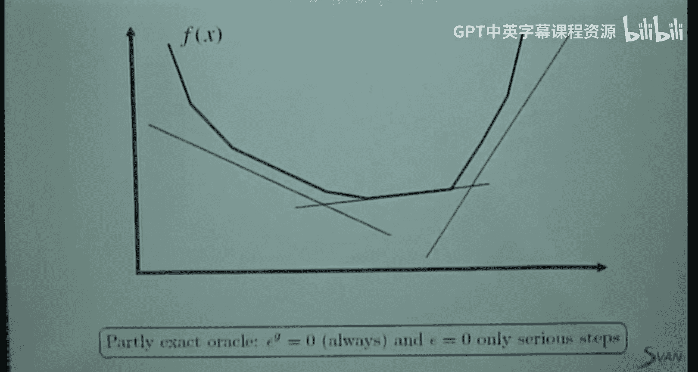

*   **精确预言机**：提供精确的 `f(x)` 和 `g`。这是传统方法。
*   **下预言机**：提供近似值 `f̃(x)` 和 `g̃`，并确保 `f̃(x) <= f(x)`，且近似线性化不会“切割”掉真实函数。即，对于所有 `y`，有 `f̃(x) + g̃^T (y - x) <= f(y)`。这保证了我们的割模型始终是真实函数的一个下近似。
*   **可控精度的预言机**：我们向预言机传递一个点 `x`、一个误差上界 `ε_bar` 和一个目标值 `target`。预言机的工作流程如下：
    1.  首先，利用历史对偶点快速计算一个初始下近似 `f̃_0(x)`。
    2.  检查 `f̃_0(x)` 是否已经大于 `target`。如果是，说明当前点 `x` 不够好（函数值可能太高），立即停止并返回当前近似值，不再花费更多计算。
    3.  如果 `f̃_0(x) <= target`，则开始逐个场景更精确地求解LP（例如使用内点法）。每解完一个场景，就更新近似值 `f̃_j(x)`。
    4.  在求解过程中，持续检查当前近似值 `f̃_j(x)` 是否超过 `target`，或者近似误差是否已小于 `ε_bar`。一旦满足任一条件，就停止计算并返回当前的 `f̃_j(x)` 和对应的次梯度近似。

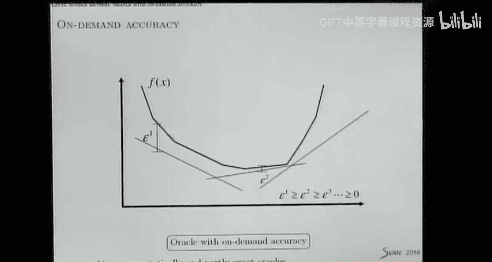

**参数设置**：
*   `target`（目标值）：通常设置为当前最佳上界 `up`，或者 `up` 和 `low` 的某个凸组合。它用来判断一个点是否值得进行精确计算。
*   `ε_bar`（误差上界）：随着算法进行，最优间隙 `up - low` 减小，我们也可以逐步减小 `ε_bar`，要求预言机提供更精确的近似，最终趋向于精确解。

## 集成智能预言机的水平束方法

将可控精度的下预言机集成到水平束方法中，只需对原始算法做少量修改：

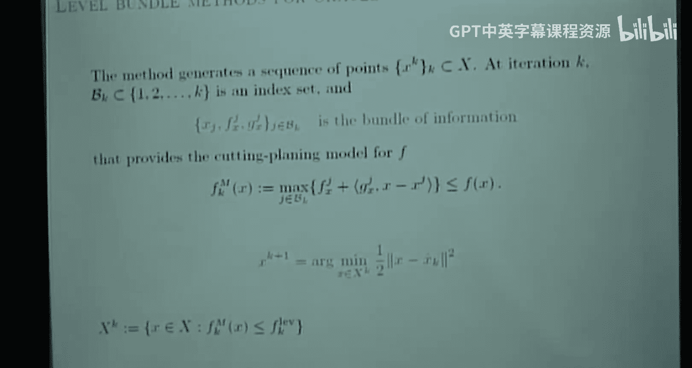

1.  **步骤4（调用预言机前）**：根据当前的最优间隙更新传递给预言机的参数 `target` 和 `ε_bar`。例如，`target = up` 或 `target = (1 - γ) * low + γ * up`；`ε_bar` 可以设为与最优间隙相关的一个小量。
2.  **步骤5（调用预言机）**：调用智能预言机，传入当前试探点 `x_k+1`、`target` 和 `ε_bar`。获得近似函数值 `f̃_k+1` 和近似次梯度 `g̃_k+1`。
3.  **步骤5（更新上界）**：由于我们得到的是下近似 `f̃_k+1`，真实的 `f(x_k+1)` 未知。但我们可以确定 `f(x_k+1) <= f̃_k+1 + ε_bar`。因此，我们用 `f̃_k+1 + ε_bar` 来更新上界 `up`，这仍然是一个有效的上界。
4.  其余步骤（束管理、更新稳定中心等）保持不变。

## 数值实验与效果

研究表明，采用智能预言机可以显著加速求解。
*   在测试的150个两阶段随机线性规划问题中：
    *   使用传统的精确L形方法需要超过7小时。
    *   在L形方法中集成智能预言机技术，时间减少到约1小时。
    *   使用集成智能预言机的水平束方法，总CPU时间进一步减少到约2小时，总体获得了72%的CPU时间缩减。

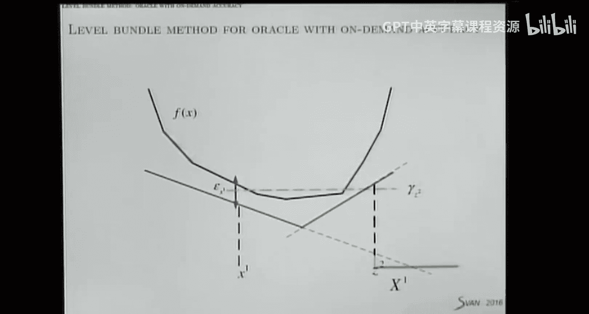

这证明了利用问题结构设计智能预言机，是加速随机规划问题优化的有效手段。

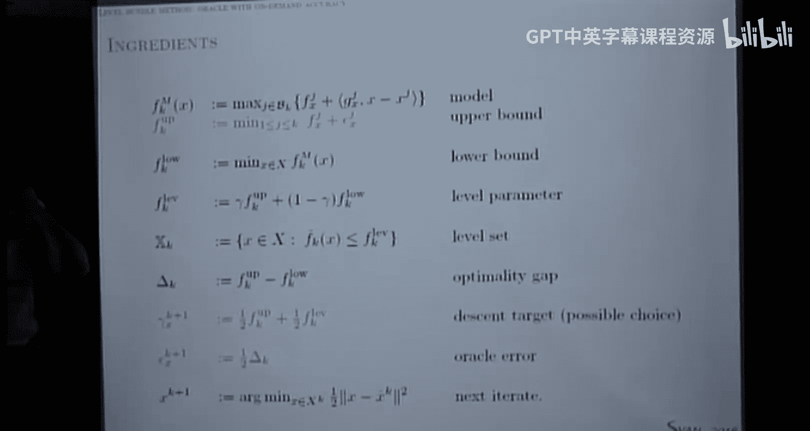

## 总结

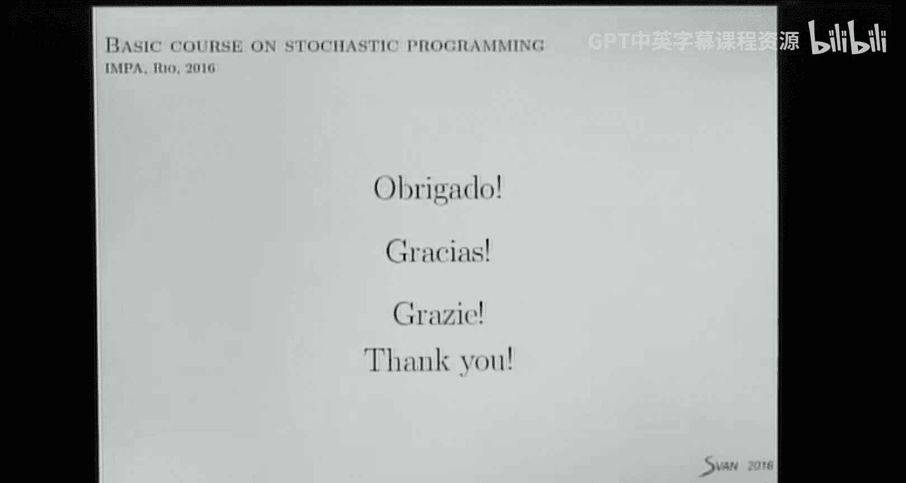


本节课中我们一起学习了如何将水平束方法应用于两阶段随机规划，并引入了“智能预言机”的概念。关键点在于，通过向预言机传递目标值和误差容忍度，我们可以控制第二阶段问题求解的精度，避免在不 promising 的点上浪费计算资源。这种利用问题结构、管理计算精度的思想，可以显著提升优化算法的整体效率，是解决大规模随机规划问题的重要策略。