# 6：连续分布与最优性条件


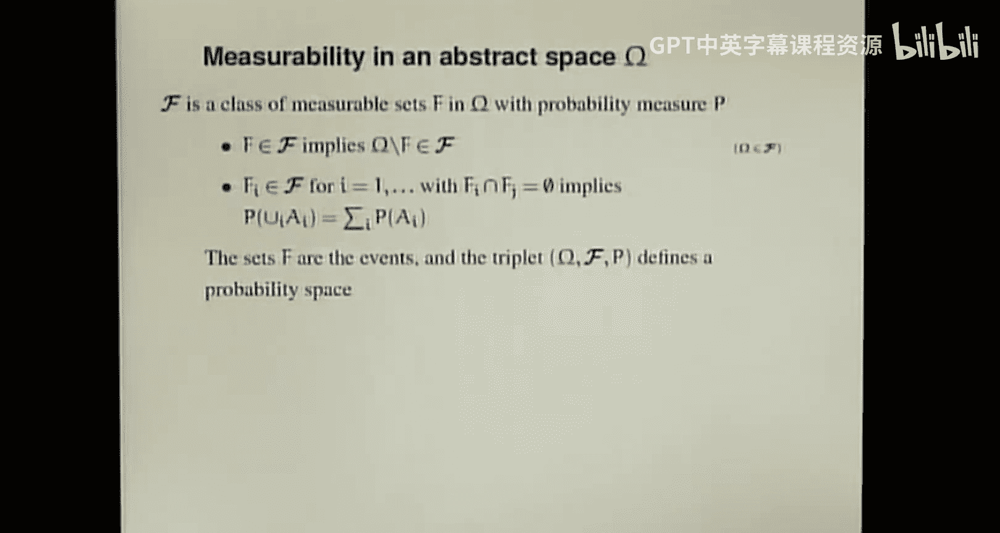


在本节课中，我们将学习连续分布下的补偿函数特性，并证明两阶段随机线性规划的最优性条件。

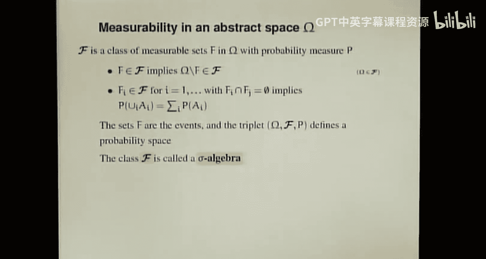


## 课程概述


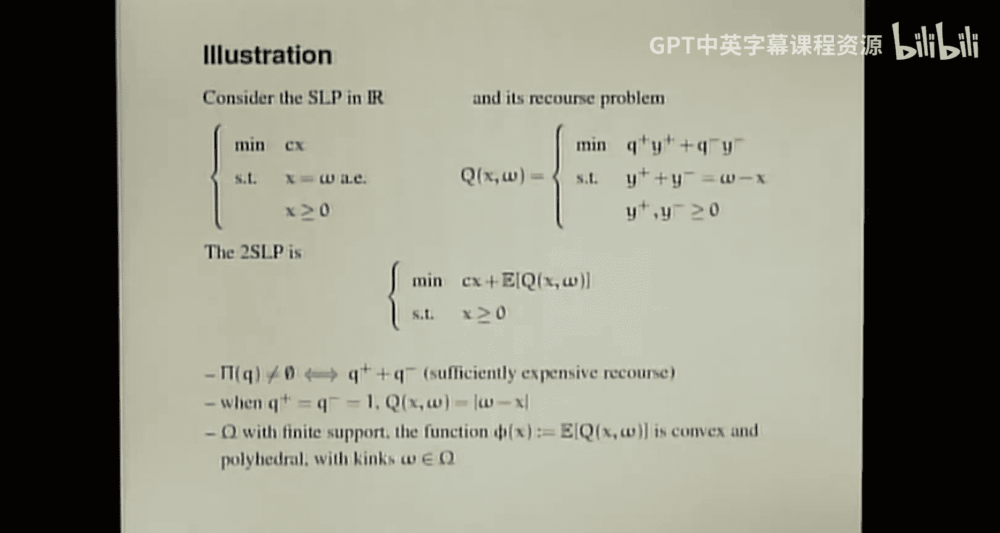

上一节我们讨论了离散分布下的补偿函数，本节我们将探讨当不确定性服从连续分布时的情况。我们将看到，补偿函数会变得平滑，并学习如何推导随机线性规划的最优性条件。

## 概率空间与σ-代数


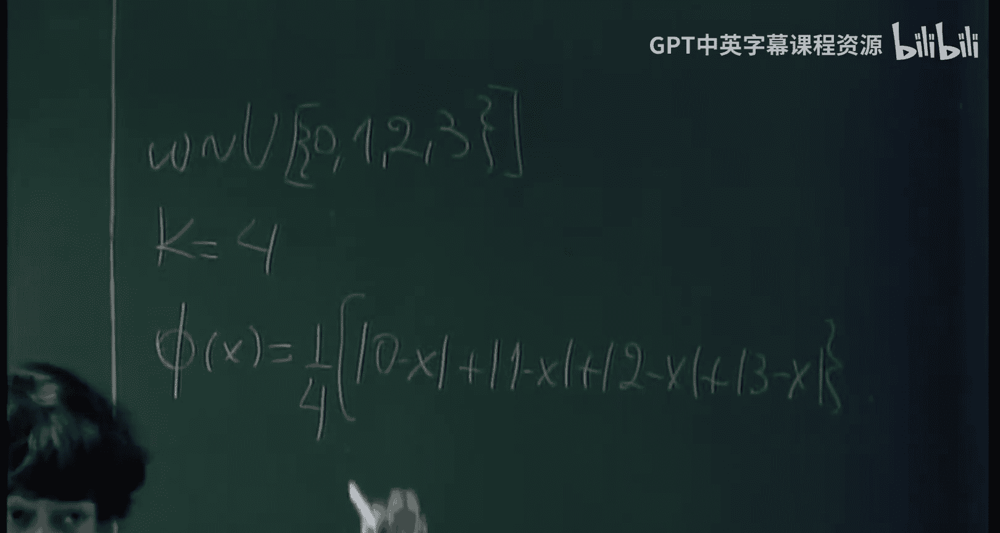

首先，我们需要澄清一个关于可测集类的重要概念。在概率空间中，我们有一个三元组 `(Ω, ℱ, P)`，其中：
*   `Ω` 是样本空间。
*   `ℱ` 是可测集类，称为 **σ-代数**。
*   `P` 是概率测度。

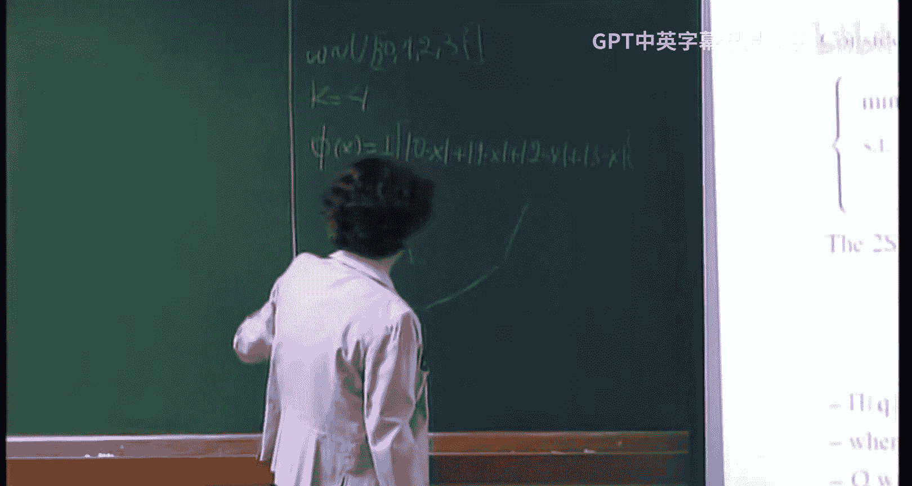

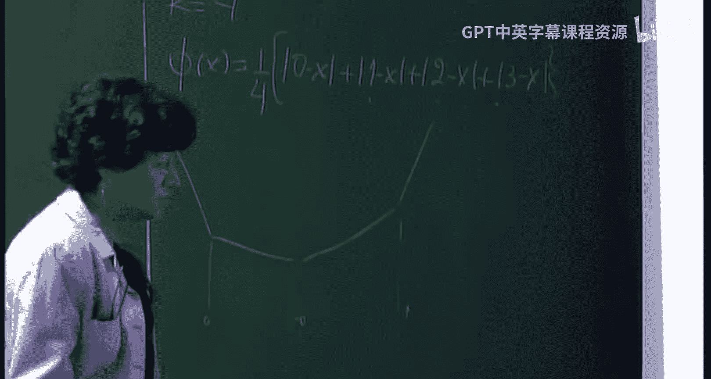

我之前提到 `ℱ` 是一个“滤子”，这是不准确的。滤子概念适用于多阶段问题，其中不确定性是逐步揭示的。对于我们现在讨论的单阶段问题，`ℱ` 就是一个σ-代数。

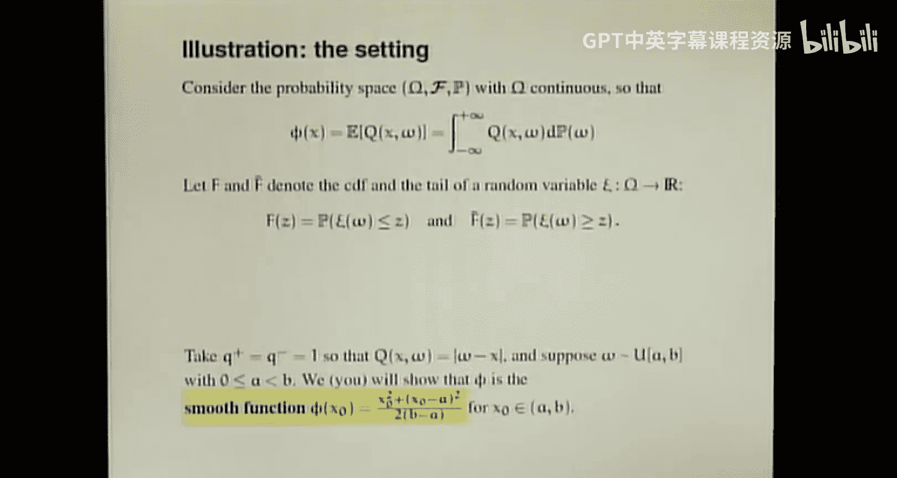

## 连续分布下的补偿函数

为了说明补偿函数的所有性质，我们考虑一个简单的例子，它足以展示我们感兴趣的特性。

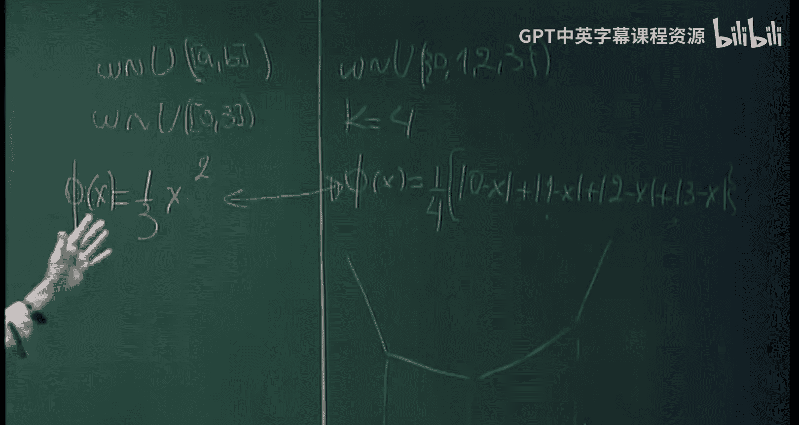

我们有一个随机等式约束，通过引入补偿变量 `y⁺` 和 `y⁻` 以及相应的补偿成本，我们将其转化为一个可处理的两阶段随机规划模型。对于每个一阶段决策变量 `x` 和不确定性的每个实现 `ω`，这变成了一个线性规划问题。

当补偿成本设为1时，补偿函数简化为绝对值函数 `|ω - x|`。在有限支撑集（离散分布）的情况下，期望补偿函数 `φ(x)` 是分段线性的凸函数，其不可微点（拐点）位于每个可能的 `ω` 值处。

**核心问题**：当 `ω` 服从连续分布时会发生什么？
变化在于，期望值不再是求和，而是关于概率测度的积分。

为了便于计算，我们使用**累积分布函数** `F(z) = P(ξ ≤ z)` 和**尾分布函数** `F̄(z) = 1 - F(z) = P(ξ ≥ z)` 来重写积分，这样我们就可以在实数域上进行积分。

### 示例：均匀分布

我们考虑补偿成本为1的情况，因此补偿函数为 `|ω - x|`。假设 `ω` 服从区间 `[a, b]` 上的均匀分布，例如 `[0, 3]`。

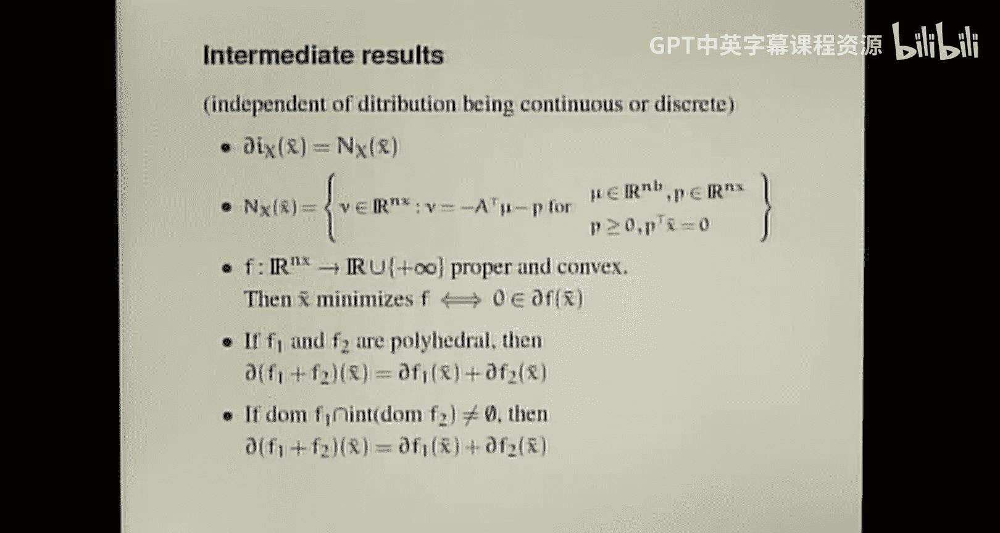

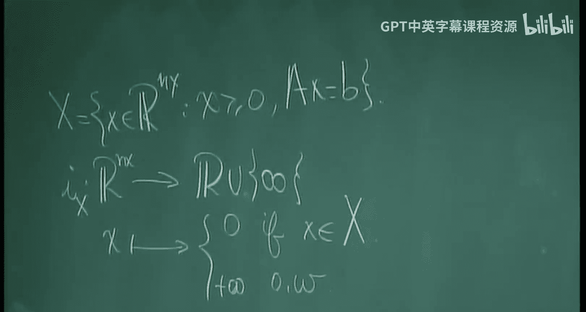

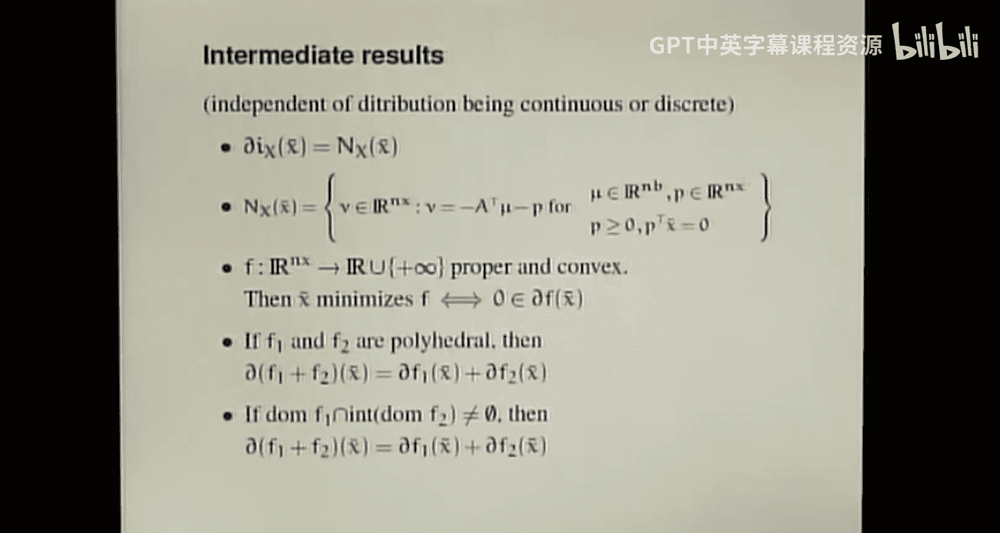

我们将证明，期望补偿函数 `φ(x)` 是一个平滑的二次函数。具体形式如下：
`φ(x) = (x² + (x - a)²) / (2(b - a))`
当 `a=0`, `b=3` 时，函数简化为 `φ(x) = x²/3`。

以下是证明所需的关键步骤和关系：

**关键结果**：对于一个取非负值的随机变量 `ξ`，其期望可以表示为：
`E[ξ] = ∫₀^∞ P(ξ ≥ z) dz = ∫₀^∞ F̄(z) dz`

**应用到补偿函数**：补偿函数可以分解为正部和负部：`|ω - x| = (ω - x)⁺ + (x - ω)⁺`。然后我们可以分别计算这两部分的期望。

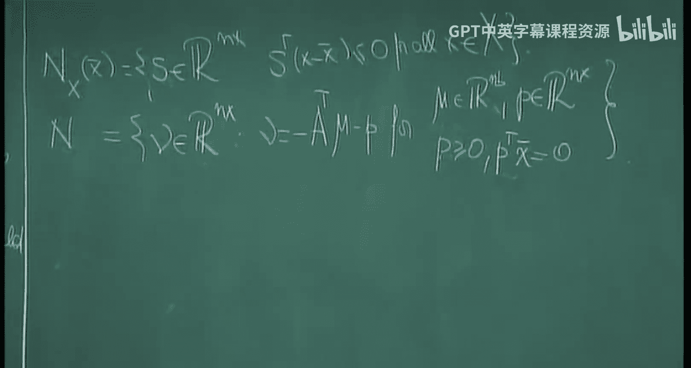

对于区间 `[a, b]` 上的均匀分布，可以证明：
*   `E[(ω - x₀)⁺] = ∫_{x₀}^b F̄(z) dz`
*   `E[(x₀ - ω)⁺] = ∫_a^{x₀} F(z) dz`

将这两个期望相加，并对简单的被积函数进行积分，即可得到上述的二次函数 `φ(x)`。


**练习**：请完成上述推导，证明均匀分布下的期望补偿函数公式。请在下次课前将解答发送至指定邮箱。

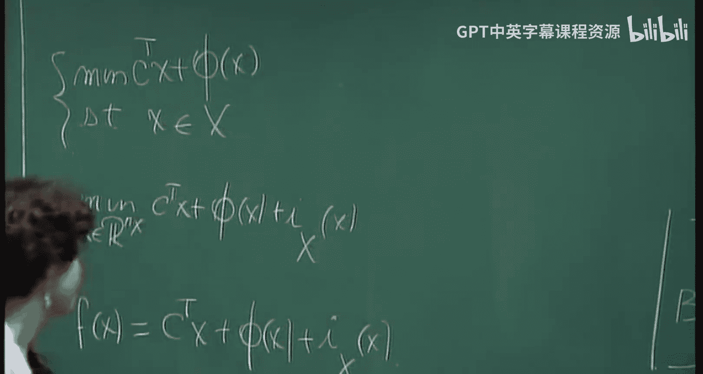

## 最优性条件

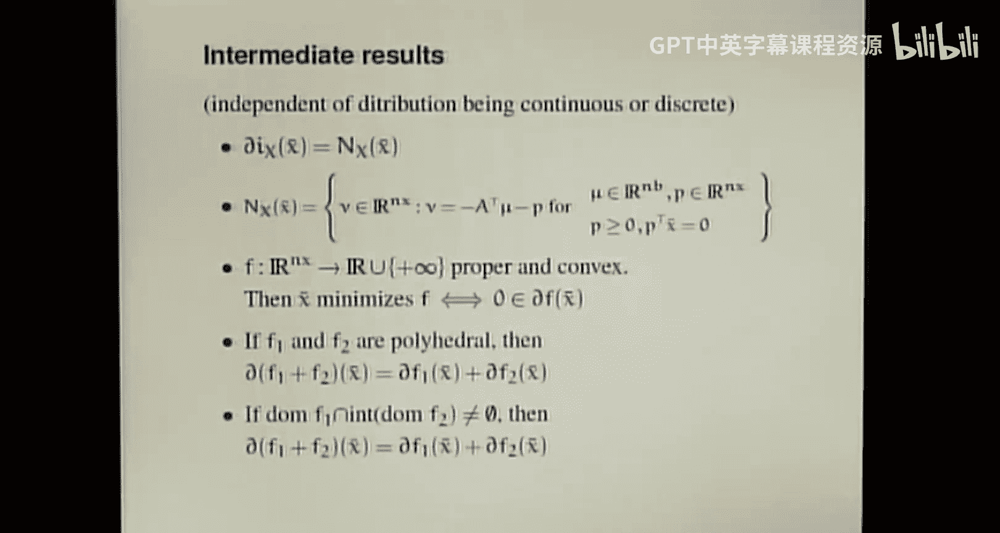

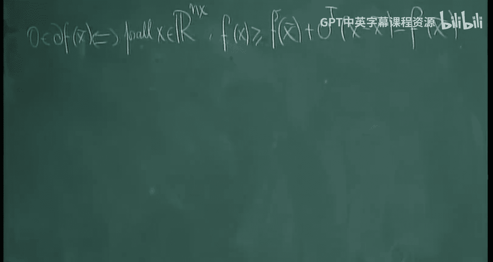


现在，我们转向最优性条件。我们有两阶段随机线性规划问题，其形式为：
```
最小化 cᵀx + E[Q(x, ξ)]
约束条件： x ∈ X, X = {x ≥ 0 | Ax = b}
```
其中 `Q(x, ξ)` 是第二阶段的补偿函数值。

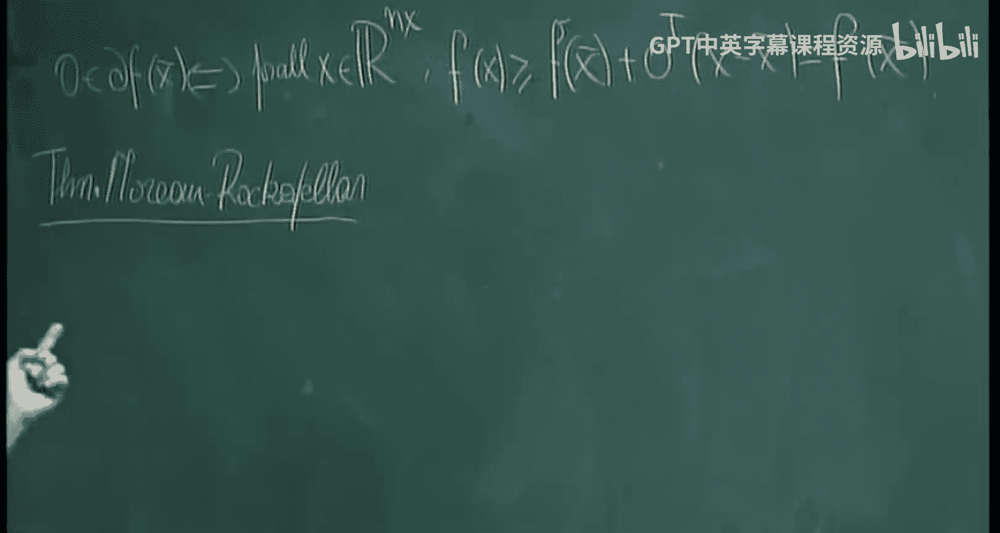

最优性条件是一组不等式系统，任何点要成为该问题的最优解，都必须满足这些条件。这涉及到原问题的可行性，以及与第二阶段问题对偶形式相关的乘子。

### 理论基础

为了进行证明，我们需要一些独立于分布形式的基础结果。

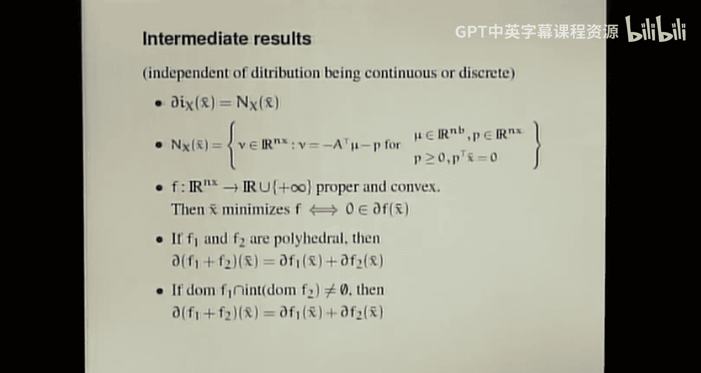

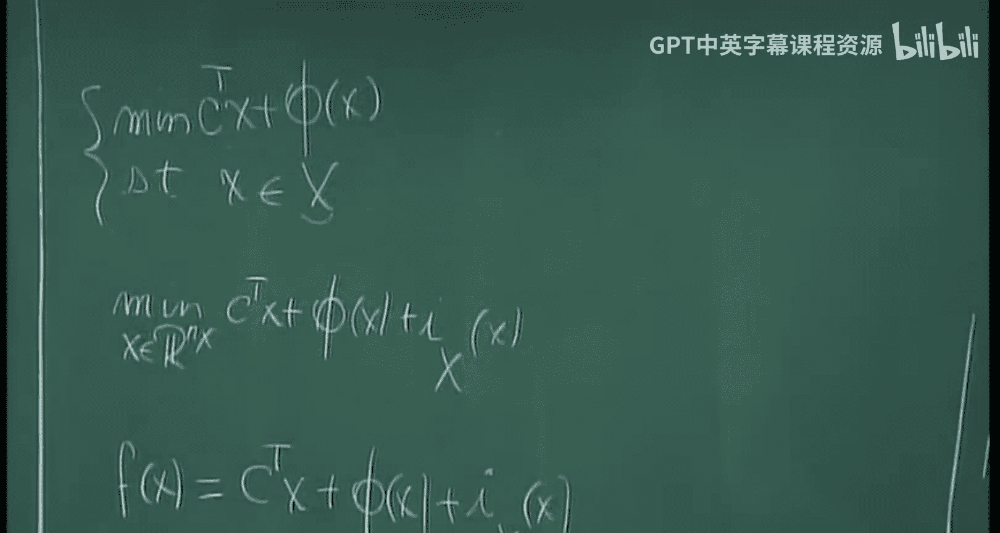

**1. 集合的示性函数及其次微分**
集合 `X` 的示性函数 `I_X(x)` 定义为：在 `X` 内取值为0，否则为 `+∞`。如果 `X` 是非空闭凸集，则该示性函数是正常凸函数。

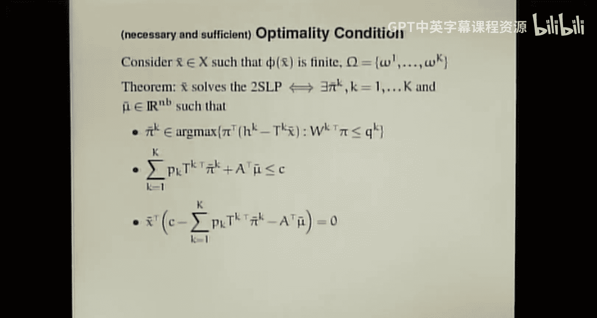

函数 `f` 在点 `x̄` 的次微分 `∂f(x̄)` 是所有满足以下条件的向量 `s` 的集合：
`f(x) ≥ f(x̄) + sᵀ(x - x̄)`, 对所有 `x` 成立。
对于示性函数，可以证明：如果 `x̄ ∈ X`，则其次微分就是集合 `X` 在点 `x̄` 处的**法锥** `N_X(x̄)`。

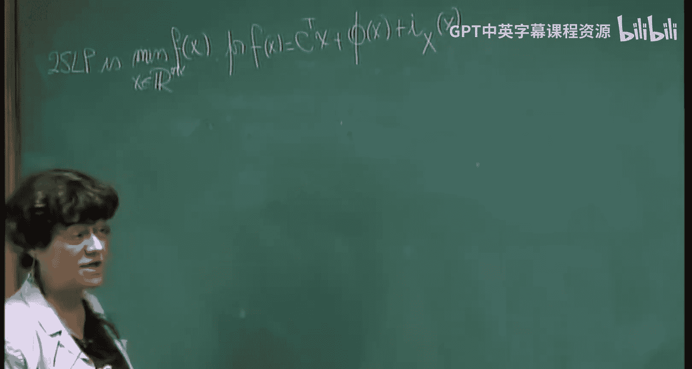

**2. 多面体集合的法锥**
对于我们的多面体集合 `X = {x ≥ 0 | Ax = b}`，其在点 `x̄` 处的法锥具有特定形式：
`N_X(x̄) = { ν ∈ Rⁿˣ | ν = -Aᵀμ - p, 其中 μ ∈ Rᵐ, p ≥ 0, 且 pᵀx̄ = 0 }`
关系 `pᵀx̄ = 0` 称为互补松弛条件。

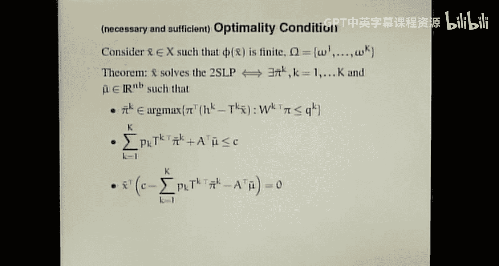

**3. 凸函数的最优性条件**
对于一个正常凸函数 `f`，点 `x̄` 是全局最小点的**充要条件**是：
`0 ∈ ∂f(x̄)`
这推广了可微函数中梯度为零的条件。

**4. 次微分的加法规则 (Moreau-Rockafellar 定理)**
对于两个正常凸函数 `f1` 和 `f2`，在一定的约束规范下（例如函数为多面体函数，或它们定义域的内部有交集），有：
`∂(f1 + f2)(x̄) = ∂f1(x̄) + ∂f2(x̄)`

### 有限支撑集情况下的最优性条件

在有限支撑集（K个场景）的情况下，我们的目标函数 `f(x)` 可以分解为三部分：
`f(x) = cᵀx + φ(x) + I_X(x)`
其中 `φ(x) = Σ_{k=1}^K p_k Q(x, ξ_k)`。

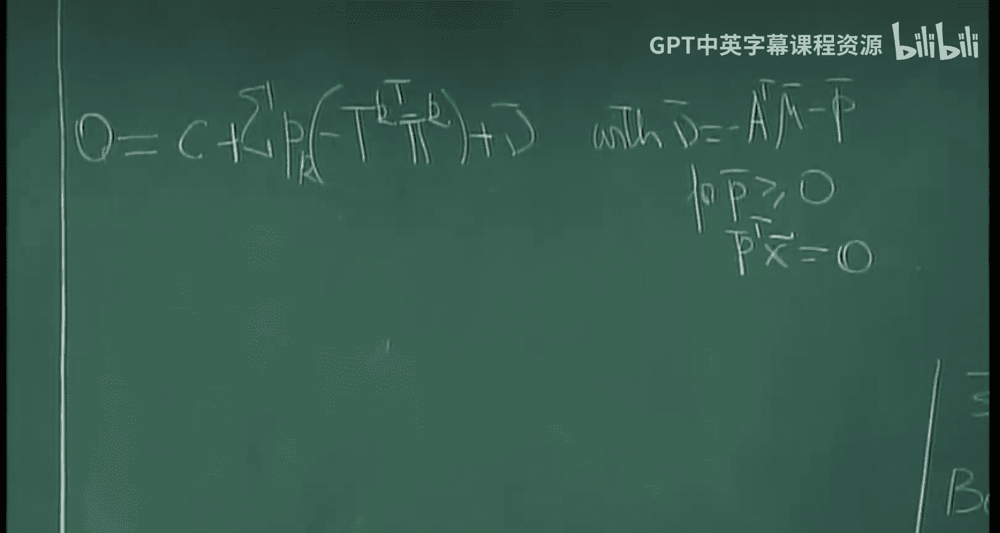

*   `f1(x) = cᵀx` 是线性函数，其次微分为单点集 `{c}`。
*   `f2(x) = φ(x)` 是多面体凸函数（因为离散分布），其次微分为 `Σ_{k=1}^K p_k ∂Q(x, ξ_k)`。而 `∂Q(x, ξ_k)` 可以通过线性规划对偶理论来描述。
*   `f3(x) = I_X(x)` 是多面体集合的示性函数，其次微分为法锥 `N_X(x̄)`。

由于这三个函数都是多面体函数，我们可以应用 Moreau-Rockafellar 定理。因此，`x̄` 是最优解当且仅当：
`0 ∈ ∂f(x̄) = {c} + Σ_{k=1}^K p_k ∂Q(x̄, ξ_k) + N_X(x̄)`

将法锥 `N_X(x̄)` 的具体形式 `{-Aᵀμ - p}` 代入，并利用 `∂Q(x̄, ξ_k)` 的表达式，经过代数运算，我们可以得到以下等价的最优性条件：

**定理**：点 `x̄` 是两阶段随机线性规划问题的最优解，当且仅当存在乘子 `p̄_k` (对于每个场景 k) 和 `μ̄`，满足：
1.  **对偶可行性**：`c ≥ Σ_{k=1}^K p_k T_kᵀ p̄_k + Aᵀμ̄`
2.  **原问题可行性**：`x̄ ∈ X`，且 `p̄_k` 是第二阶段问题（对偶形式）在场景 `k` 下的最优解。
3.  **互补松弛**：`x̄ᵀ (c - Σ_{k=1}^K p_k T_kᵀ p̄_k - Aᵀμ̄) = 0`

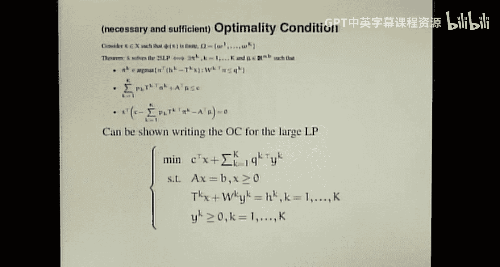

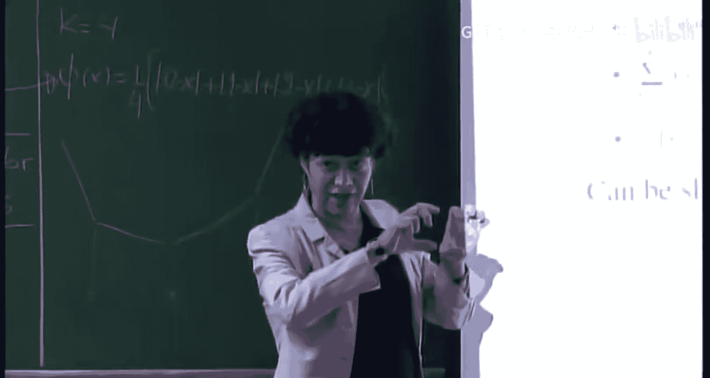

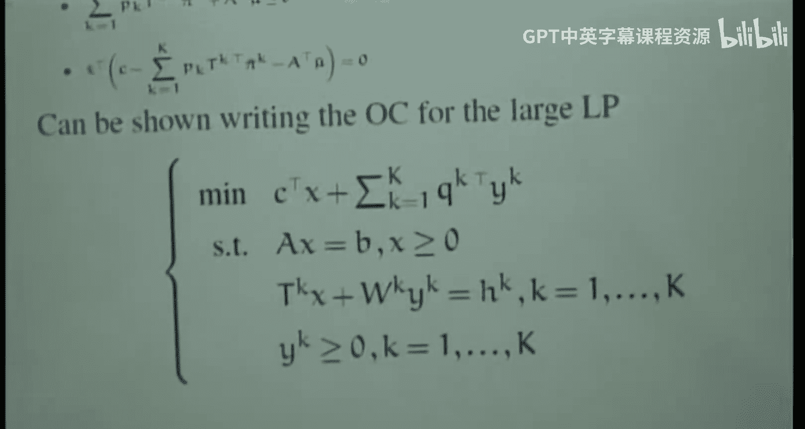

这些条件类似于线性规划中的 Karush-Kuhn-Tucker (KKT) 条件。

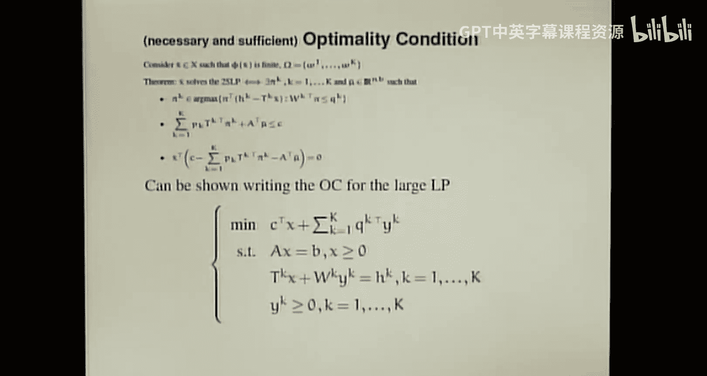

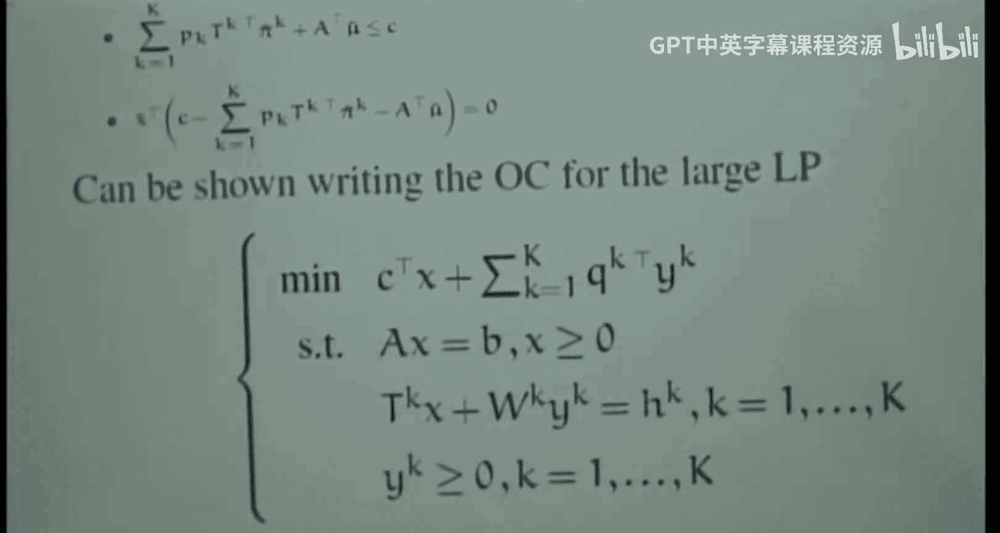

### 连续分布情况下的最优性条件

对于连续分布，推导过程本质相同，但期望补偿函数 `φ(x)` 不再是多面体的。然而，在我们考虑的简单补偿（补偿矩阵为 `[I, -I]`）等特定情况下，函数 `φ(x)` 具有全空间的定义域，这满足了 Moreau-Rockafellar 定理中定义域内部相交的条件，因此次微分的加法规则仍然成立。

主要区别在于，乘子 `p` 不再是一个有限维向量，而是一个依赖于场景 `ω` 的**可测函数** `p(ω)`。最优性条件中的求和变成了关于概率测度的积分（期望）。

对于简单补偿的情况，最优性条件变为：
1.  `c ≥ E[Tᵀ p(ω)] + Aᵀμ̄`
2.  `x̄ ∈ X`，且对于几乎处处的 `ω`，`p(ω)` 是对应第二阶段对偶问题的最优解。
3.  `x̄ᵀ (c - E[Tᵀ p(ω)] - Aᵀμ̄) = 0`

## 课程总结

本节课中，我们一起学习了：
1.  澄清了概率空间中σ-代数与滤子的区别。
2.  分析了连续分布（特别是均匀分布）下期望补偿函数的性质，证明了它会成为一个平滑的二次函数，并布置了相关的推导练习。
3.  系统推导了两阶段随机线性规划的最优性条件。我们引入了示性函数、法锥、次微分和 Moreau-Rockafellar 定理等工具。
4.  证明了在有限支撑集情况下，最优性条件可表述为涉及场景乘子的一组等式和不等式。
5.  将结论推广到连续分布情况，指出此时最优乘子是一个可测函数，最优性条件以期望形式表达。

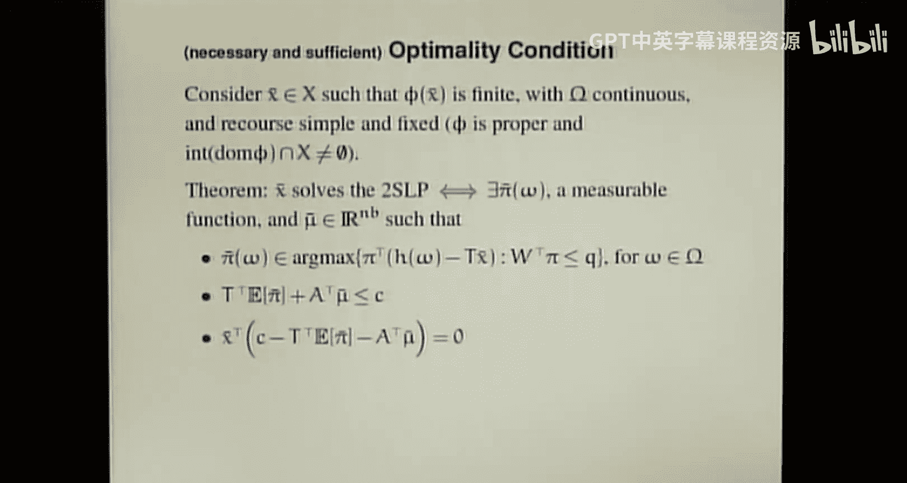

这些最优性条件不仅是理论分析的基础，也为设计求解算法（如基于梯度的算法、分解算法等）提供了关键洞察。