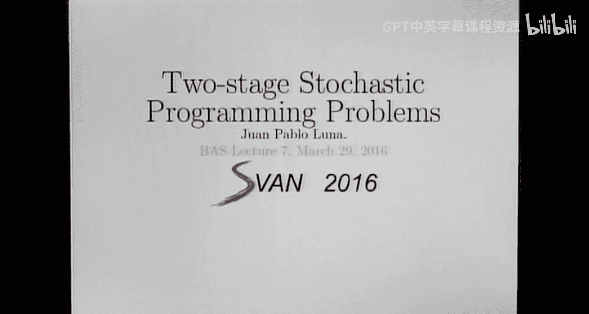
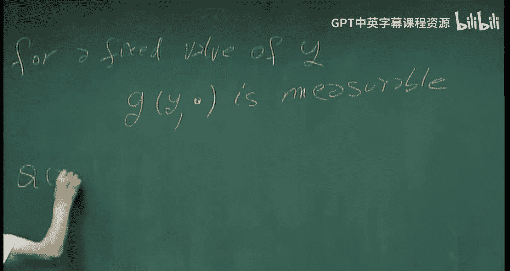
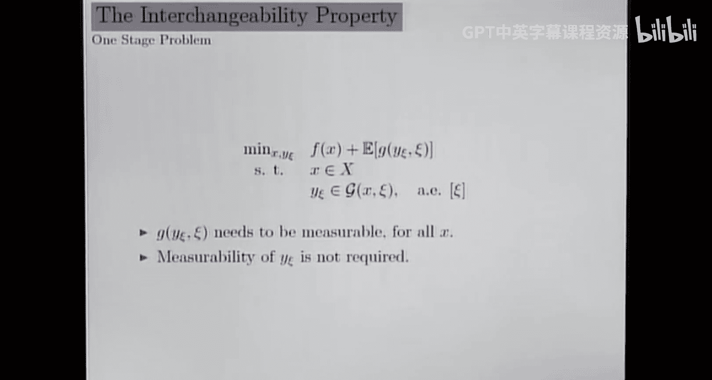
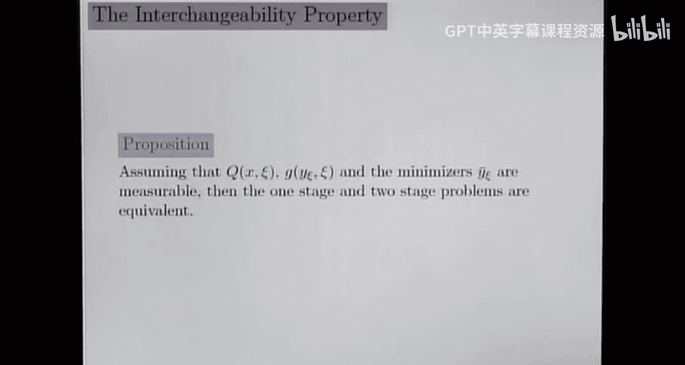
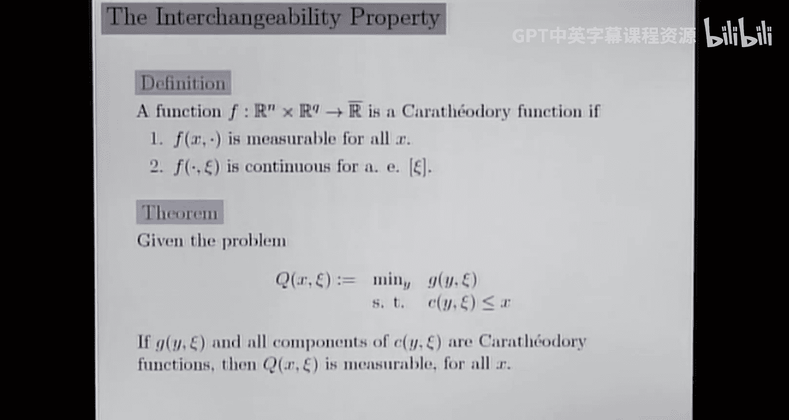
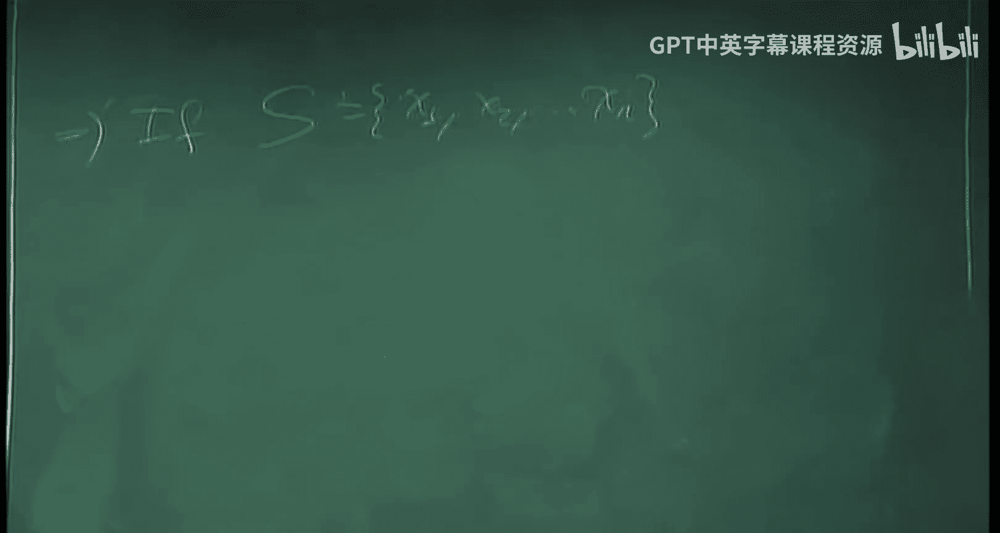
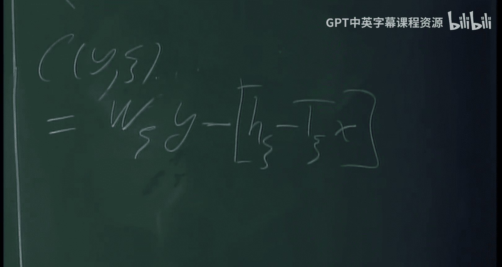
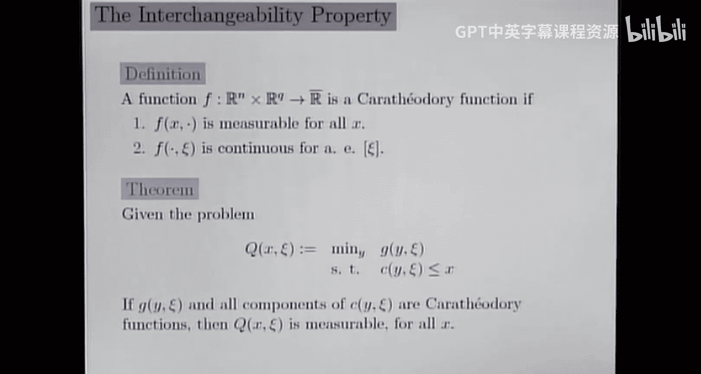
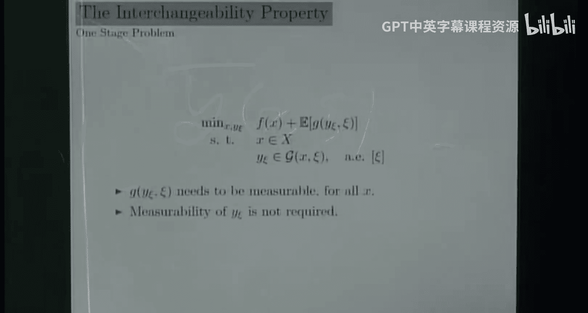
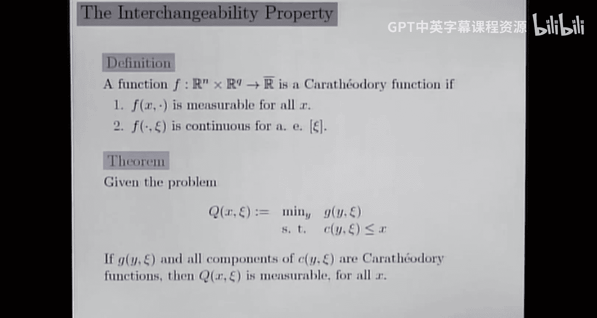

# 7：可交换性定理与可测性 🔄

在本节课中，我们将学习随机规划中的一个核心概念：可交换性。我们将探讨如何确保两阶段问题中的第二阶段价值函数是可测的，这是计算期望值并建立问题等价性的基础。课程将介绍特征函数的概念，并解释在何种条件下，我们可以安全地在期望和优化运算之间进行交换。

---

## 引言与问题背景

上一节我们讨论了两阶段随机规划问题的两种等价表述。现在，我们来看看这两种表述等价性背后的一个关键前提：第二阶段的优化问题必须产生一个可测的价值函数。

考虑一个广义的两阶段问题：

**第一阶段：**
$$
\min_{x \in X} f(x) + \mathbb{E}[Q(x, \xi)]
$$

**第二阶段（对于给定的 $x$ 和随机实现 $\xi$）：**
$$
Q(x, \xi) = \min_{y} \{ g(y, x, \xi) : y \in S(x, \xi) \}
$$

为了计算期望值 $\mathbb{E}[Q(x, \xi)]$，函数 $Q(x, \cdot)$ 必须是关于随机向量 $\xi$ 可测的。然而，$Q$ 本身是一个优化问题的最优值，其可测性并非自动成立。

---

## 一个反例：不可测的价值函数

为了理解问题的严重性，我们来看一个 $Q$ 不可测的例子。

*   设概率空间为 $[0,1]$，配备勒贝格测度。
*   随机变量 $\xi(\omega) = \omega$。
*   设 $N \subset [0,1]$ 是一个不可测集（勒贝格测度理论中已知存在此类集合）。
*   定义函数 $g(y, \xi) = [\text{sgn}(y - \xi)]^2$，其中 $\text{sgn}$ 是符号函数。
*   考虑优化问题：$Q(\xi) = \min_{y \in [0,1]} g(y, \xi)$。

分析表明，该问题的最优解和最优值为：
$$
Q(\xi) = \begin{cases}
0, & \text{if } \xi \in N \\
1, & \text{if } \xi \notin N
\end{cases}
$$
由于集合 $N$ 不可测，函数 $Q(\xi)$ 也不是可测函数。因此，期望值 $\mathbb{E}[Q(\xi)]$ 没有定义。这个例子说明，我们需要对问题施加一些条件来保证 $Q$ 的可测性。

---

## 特征函数与可测性保证

为了保证可测性，我们引入一类性质良好的函数：**特征函数**。

**定义（特征函数）：**
一个函数 $h: \mathbb{R}^n \times \Xi \to \mathbb{R}$ 被称为特征函数，如果它满足：
1.  对于每个固定的 $x \in \mathbb{R}^n$，函数 $h(x, \cdot)$ 是关于 $\xi$ 可测的。
2.  对于每个固定的 $\xi \in \Xi$，函数 $h(\cdot, \xi)$ 是关于 $x$ 连续的（或几乎处处连续）。

特征函数是我们构建可测性理论的基础砖石。对于随机规划，我们通常要求目标函数 $g(y, x, \xi)$ 和约束条件所定义的可行性对应关系 $S(x, \xi)$ 都具有特征函数的性质。

---

## 核心定理：可交换性定理

基于特征函数的概念，我们有以下重要的**可交换性定理**。

**定理（可交换性）：**
假设：
1.  函数 $g(y, x, \xi)$ 和可行性映射 $S(x, \xi)$ 的示性函数都是特征函数。
2.  期望值 $\mathbb{E}[\inf_{y \in S(x,\xi)} g(y, x, \xi)]$ 是有限的（即不为 $+\infty$ 或 $-\infty$）。

那么，以下等式成立：
$$
\inf_{y(\cdot) \in \mathcal{Y}} \mathbb{E}[g(y(\xi), x, \xi)] = \mathbb{E}[ \inf_{y \in S(x, \xi)} g(y, x, \xi) ]
$$
其中 $\mathcal{Y}$ 是所有可测函数 $y(\xi)$ 的集合，且满足 $y(\xi) \in S(x, \xi)$ 几乎必然成立。

此外，如果右边优化问题的最优解 $y^*(\xi)$ 存在，那么它可以取为一个可测函数，并且它就是左边问题的一个最优解。

---

### 定理的意义与应用

这个定理是连接两阶段问题与单阶段紧凑形式问题的桥梁。

*   **等式的右边**：是先对每个场景 $\xi$ 求解第二阶段问题，再取期望。这对应**两阶段问题**的表述。
*   **等式的左边**：是寻找一个可测的决策规则 $y(\xi)$，直接最小化期望总成本。这对应**单阶段紧凑形式问题**的表述。

定理指出，在特征函数的假设下，这两种操作（求期望和求下确界）是可交换的，从而证明了两种问题表述的等价性。

---

## 线性随机规划中的应用

在线性两阶段问题中，可交换性定理的条件自然满足。

**第二阶段问题（原问题）：**
$$
Q(x, \xi) = \min_{y} \{ q(\xi)^\top y : W(\xi)y = h(\xi) - T(\xi)x, \ y \geq 0 \}
$$

**对应的对偶问题：**
$$
\max_{\pi} \{ \pi^\top (h(\xi) - T(\xi)x) : W(\xi)^\top \pi \leq q(\xi) \}
$$

以下是验证过程：

1.  **目标函数**：$g(y, x, \xi) = q(\xi)^\top y$。固定 $y, x$ 时，它是 $q(\xi)$ 的线性组合，因此可测；固定 $\xi$ 时，它是 $y$ 的线性函数，因此连续。它是一个特征函数。
2.  **约束条件**：可行性集合 $S(x, \xi) = \{ y \geq 0: W(\xi)y = h(\xi) - T(\xi)x \}$ 的示性函数也是特征函数。
3.  在通常的规范性条件下（例如原问题或对偶问题可行且有界），期望值是有限的。

因此，可交换性定理适用。特别地，该定理保证了**拉格朗日乘子（对偶变量）$\pi^*(\xi)$ 作为 $\xi$ 的函数是可测的**。这为我们之前课程中分析对偶问题和推导最优性条件提供了坚实的理论基础。

---

## 总结

本节课我们一起学习了随机规划中确保模型严谨性的核心内容：

1.  **可测性问题**：两阶段问题第二阶段的價值函数 $Q(x, \xi)$ 必须可测，其期望才有意义。我们通过一个反例看到了不可测性可能发生。
2.  **特征函数**：我们引入了一类性质良好的函数——特征函数，它对于固定的第一个变量是可测的，对于固定的第二个变量是连续的。这是保证后续定理成立的关键假设。
3.  **可交换性定理**：这是本节课的核心结果。该定理表明，在特征函数和有限期望的假设下，求期望运算和优化运算可以交换次序。这严格证明了两阶段问题与单阶段紧凑形式问题的等价性。
4.  **在线性问题中的应用**：我们验证了线性随机规划问题天然满足可交换性定理的条件，因此其模型是良定义的，并且拉格朗日乘子具有可测性。

理解可交换性定理是深入理解随机规划模型基础的关键一步，它确保了我们在后续计算和分析中所操作的对象都是数学上良好定义的。