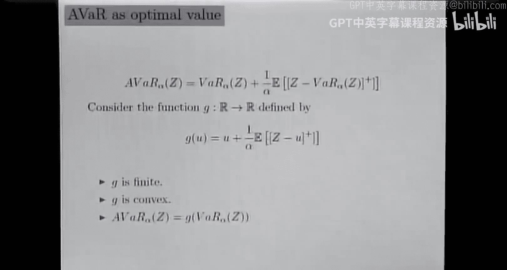
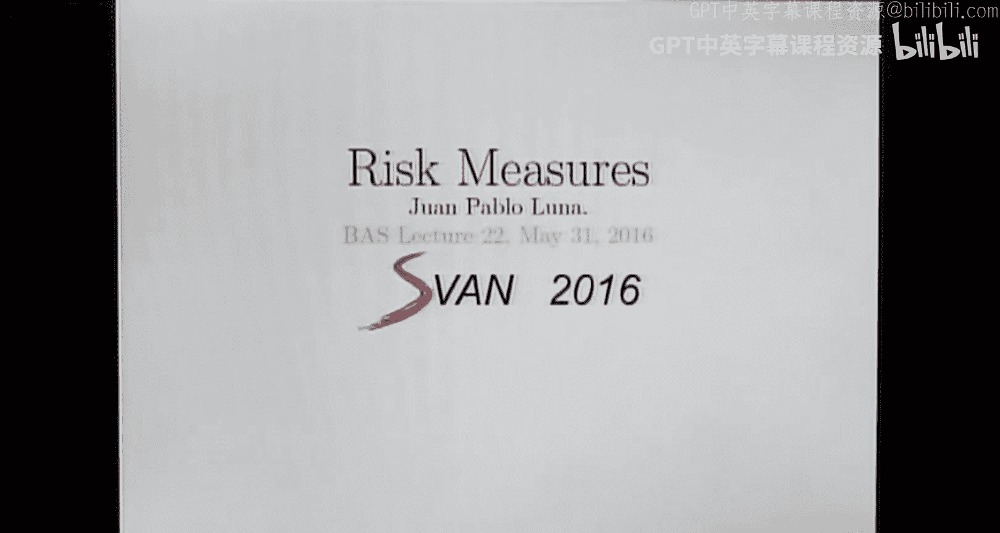
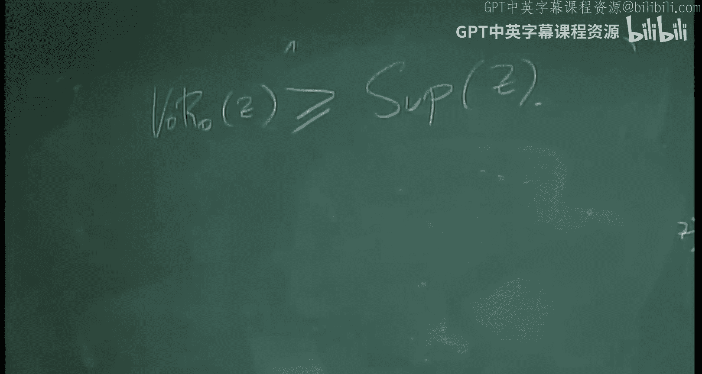
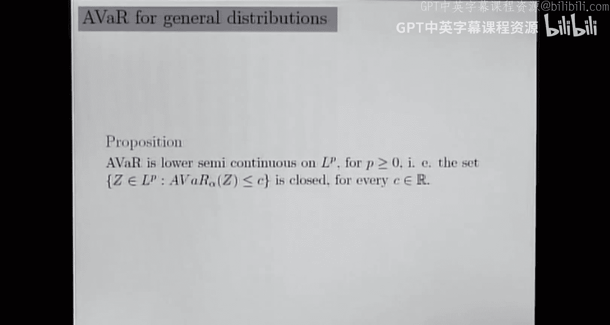

# 22：平均在险价值与风险度量

在本节课中，我们将继续学习风险度量，重点探讨平均在险价值（Average Value at Risk, AVaR）的性质。我们将看到，与在险价值（VaR）不同，AVaR对风险容忍度的变化更为敏感，并且是一个一致性风险度量。



上一讲我们介绍了在险价值（VaR）及其局限性。本节中，我们将深入探讨其改进版本——平均在险价值。


## 回顾与定义



首先，让我们回顾一下上一讲的关键点。对于一个给定的风险容忍水平 α，我们知道以下不等式成立：
```
P(Z > VaR_α(Z)) ≤ α ≤ P(Z ≥ VaR_α(Z))
```
当随机变量 Z 在 VaR_α(Z) 处连续时，这两个概率相等。然而，当该点存在“原子”（即概率质量）时，VaR 对 α 在该区间内的微小变化并不敏感。

今天，我们将继续研究平均在险价值（AVaR），并会看到这个新的风险度量对风险水平的变化是敏感的。

上一讲中，我们为连续随机变量定义了 AVaR。当 Z 是连续随机变量时，AVaR 被定义为在 Z 超过 VaR 的条件下的期望值：
```
AVaR_α(Z) = E[Z | Z > VaR_α(Z)]
```
由于连续性，这个定义很清晰。然而，对于一般的随机变量（例如离散型），这个定义并不直接适用。

一个有趣的发现是，对于连续随机变量，AVaR 可以通过以下优化问题的最优值来计算：
```
AVaR_α(Z) = min_{u ∈ R} { u + (1/α) E[(Z - u)^+] }
```
其中 `(x)^+ = max{x, 0}`。并且，这个优化问题的一个解就是 VaR_α(Z)。

基于这个结果，我们尝试为一般的 L1 可积随机变量 Z 给出一个通用的 AVaR 定义：
```
AVaR_α(Z) = inf_{u ∈ R} { u + (1/α) E[(Z - u)^+] }
```
这个定义总是有限的，并且是连续情况下的良好推广。很容易看出，AVaR 总是大于等于 VaR：
```
AVaR_α(Z) ≥ VaR_α(Z)
```
因为 VaR 是该优化问题的一个可行解。

## 风险水平趋近于极端值时的行为



在深入探讨 AVaR 的性质之前，我们先来看一些关于 VaR 在风险水平趋近于 0 或 1 时的理论结果，这些结果对未来有用。

### VaR 在 α=0 时的扩展定义

对于 α ∈ (0,1)，VaR 的定义为：
```
VaR_α(Z) = inf { t : F_Z(t) ≥ 1-α }
```
其中 F_Z 是累积分布函数。我们可以尝试将这个定义扩展到 α=0：
```
VaR_0(Z) = inf { t : F_Z(t) ≥ 1 }
```
这个集合可能为空（此时下确界为 +∞），也可能有限。这代表了一种极端的风险厌恶态度。

### 相关性质

以下是几个重要的关系：

1.  **单调性**：如果 β ≥ α，则 `VaR_β(Z) ≤ VaR_α(Z)`。这意味着风险容忍度越低（α 越小），VaR 值越大，即越厌恶风险。
2.  **极限行为**：当 α ↘ 0（从右侧趋近于0）时，`VaR_α(Z) → VaR_0(Z)`。
3.  **与本质确界的关系**：可以证明，`VaR_0(Z) = ess sup(Z)`，即随机变量 Z 的“最坏可能”值。这证实了 α=0 时代表极端的风险厌恶。

这些结果表明，随着 α 趋近于 0，VaR 度量收敛于最坏情景下的结果。

## 平均在险价值（AVaR）的性质

现在，让我们回到 AVaR 的主要性质。与 VaR 类似，AVaR 也具有单调性：

*   当 α ↘ 0 时，`AVaR_α(Z)` 增加，并收敛于 `VaR_0(Z) = ess sup(Z)`。
*   当 α ↗ 1 时，`AVaR_α(Z)` 减少，并收敛于 `E[Z]`，即期望值。这代表风险中立。

更重要的是，AVaR 是一个**一致性风险度量**。这意味着它满足以下四个性质：

1.  **平移不变性**：`AVaR_α(Z + c) = AVaR_α(Z) + c`，对于任意常数 c。
2.  **单调性**：如果 `Z_1 ≤ Z_2` 几乎处处成立，则 `AVaR_α(Z_1) ≥ AVaR_α(Z_2)`。
3.  **次可加性**：`AVaR_α(Z_1 + Z_2) ≤ AVaR_α(Z_1) + AVaR_α(Z_2)`。
4.  **正齐次性**：对于 λ ≥ 0，有 `AVaR_α(λZ) = λ AVaR_α(Z)`。

以下是这些性质的简要证明思路：

*   **平移不变性**：在定义式 `u + (1/α)E[(Z+c - u)^+]` 中，令 `v = u - c`，即可得证。
*   **单调性**：利用 `(Z_1 - u)^+ ≥ (Z_2 - u)^+`（因为 `Z_1 ≤ Z_2`），然后对优化问题取最小值。
*   **次可加性**：利用不等式 `(x+y)^+ ≤ x^+ + y^+`，并分别对涉及 `Z_1` 和 `Z_2` 的部分进行最小化。
*   **正齐次性**：对于 λ > 0，可将 λ 从期望中提出；对于 λ = 0，可直接计算。

由于 AVaR 在 α → 0 时的极限是 `ess sup(Z)`，而一致性性质在极限下得以保持，这意味着 `ess sup(Z)` 本身也是一个一致性风险度量。这与非零 α 下的 VaR（不满足次可加性）形成鲜明对比。

## AVaR 的表达式与敏感性

对于一般的随机变量 Z，AVaR 有一个介于两个条件期望之间的表达式：
```
E[Z | Z > VaR_α(Z)] ≤ AVaR_α(Z) ≤ E[Z | Z ≥ VaR_α(Z)]
```
当 Z 连续时，等号成立。当 VaR 处存在原子时，AVaR 会根据风险容忍度 α，取这两个条件期望之间的某个值。

这解释了为什么 AVaR 对 α 敏感。考虑概率：
```
p_> = P(Z > VaR_α(Z)) 和 p_≥ = P(Z ≥ VaR_α(Z))
```
我们知道 `p_> ≤ α ≤ p_≥`。当 α 接近 `p_>` 时，投资者非常厌恶风险，AVaR 接近上界 `E[Z | Z ≥ VaR_α(Z)]`（即包含最坏情况原子的期望）。当 α 接近 `p_≥` 时，投资者更容忍风险，AVaR 接近下界 `E[Z | Z > VaR_α(Z)]`。

因此，与在固定区间内保持不变的 VaR 不同，AVaR 会随着 α 在这个区间内的变化而平滑（或连续）地变化，真实反映了投资者风险偏好的改变。

## 下半连续性与连续性

最后，从数学分析的角度，AVaR 作为从 L1 空间到实数的泛函，具有很好的正则性。

*   **下半连续性**：AVaR 是下半连续的。这意味着其上方图 `{ (Z, t) : t ≥ AVaR_α(Z) }` 是闭集。在凸分析和对偶理论中，下半连续性对于保证分离定理等工具的应用至关重要。
*   **局部利普希茨连续性**：实际上，AVaR 是局部利普希茨连续的。在一个赋范空间（如 Lp 空间）中，对于一个真凸函数，局部上有界性与局部利普希茨连续性是等价的。由于我们可以证明 AVaR 在相关空间中是局部有界的，因此它也是局部利普希茨连续的，这比单纯连续更强。

这种连续性保证了数值计算的稳定性和优化问题中理论结果的适用性。



本节课中我们一起学习了平均在险价值的核心性质。我们了解到 AVaR 是对 VaR 的重要改进，它不仅对风险水平的变化敏感，而且满足一致性公理，是一个更优的风险度量工具。我们还探讨了其在极端风险水平下的行为，以及其良好的数学性质（如连续性）。下一讲我们将继续利用这些性质，深入随机优化问题。