# 24：风险度量的对偶理论

在本节课中，我们将学习凸分析中的一个核心工具——Fenchel共轭，并探讨其在风险度量理论中的应用。我们将从基本定义出发，逐步构建理论框架，最终揭示相干风险度量的对偶表示形式。

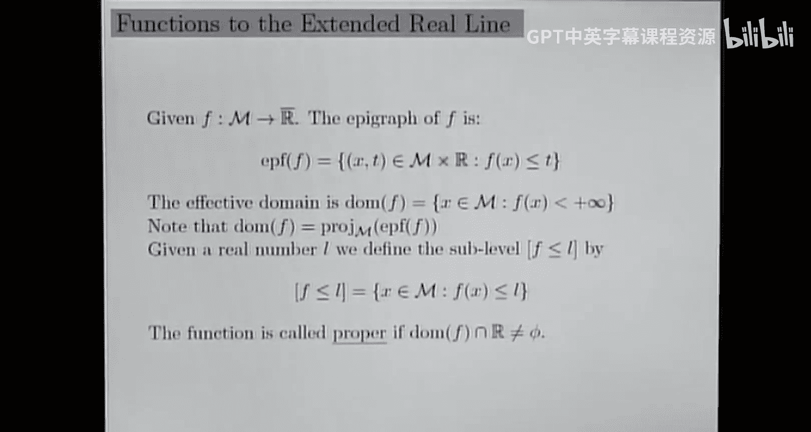

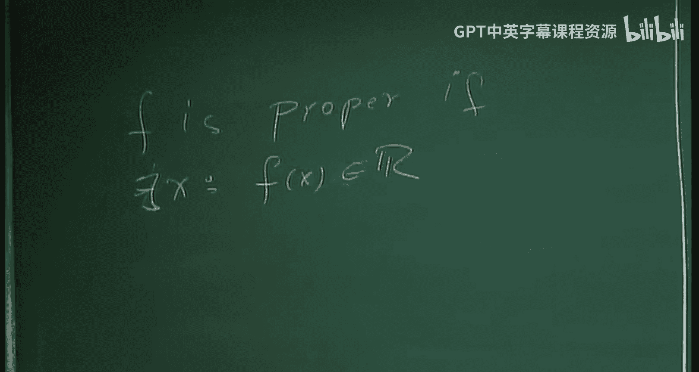

## 基本定义与概念

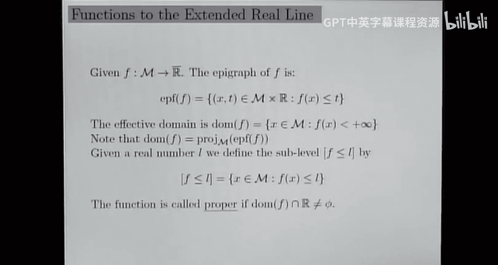

首先，我们介绍一些后续讨论所需的基础数学概念。

考虑一个定义在向量空间M（例如L^p空间）上的函数F，其值域为扩展的实数集R∪{±∞}。对于这样的函数，我们可以定义其**上图**。

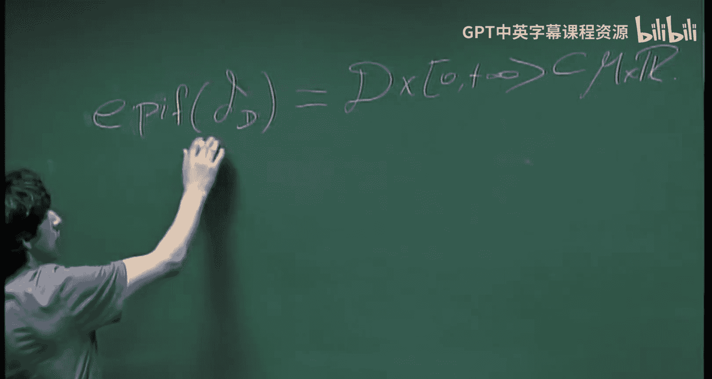

函数F的**上图**是乘积空间M×R的一个子集，定义为：
```
epi(F) = {(x, t) ∈ M × R : t ≥ F(x)}
```
上图直观地表示了函数图像及其上方的所有点。根据函数F的不同，其上图可能是空集、整个乘积空间，或介于两者之间的集合。

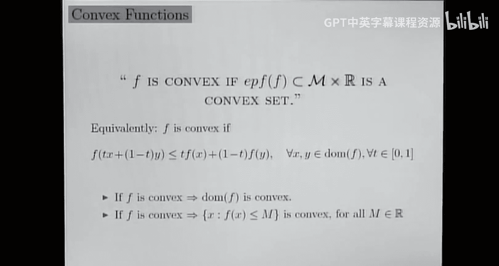

函数的**有效域**是指函数值不为正无穷的所有点构成的集合：
```
dom(F) = {x ∈ M : F(x) < +∞}
```
此外，对于任意实数l，我们可以定义函数的**水平集**：
```
lev_l(F) = {x ∈ M : F(x) ≤ l}
```
如果一个函数F满足其有效域非空，且函数值从不取负无穷，则称该函数为**正常函数**。用公式表示，即：
```
∃ x ∈ M, F(x) ∈ R 且 ∀ x ∈ M, F(x) > -∞
```
正常函数是理论分析中一类“行为良好”的函数。

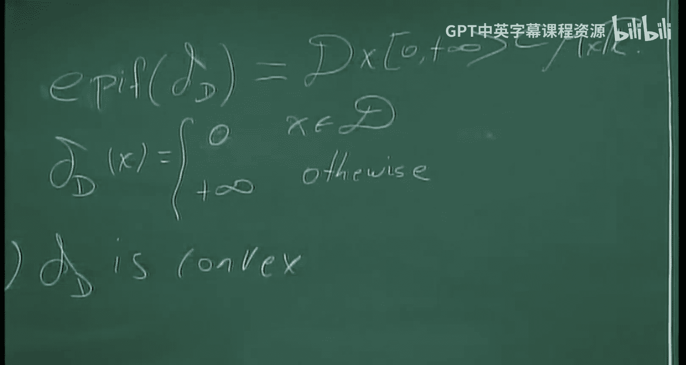

## 下半连续性与凸性

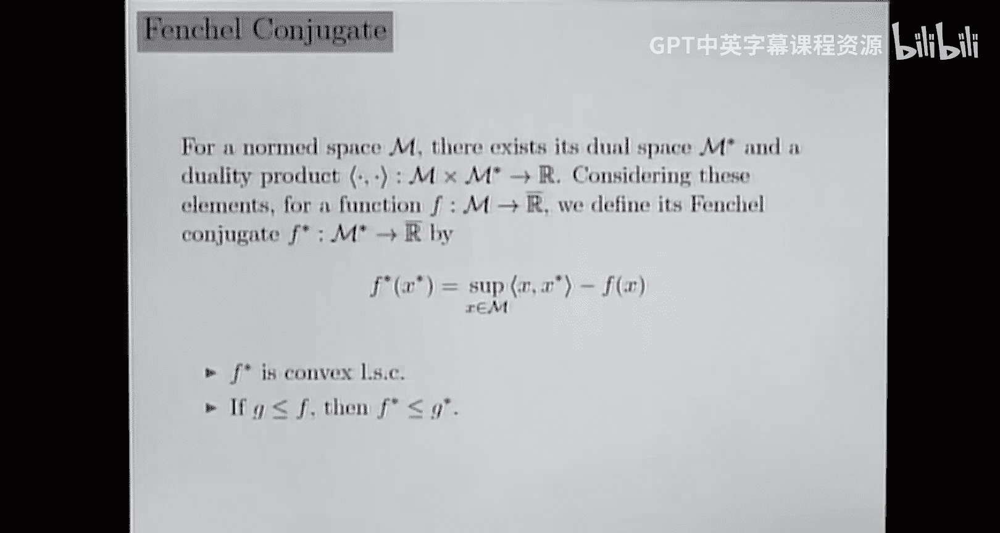

上一节我们介绍了函数的基本结构，本节中我们来看看函数的两类重要性质：连续性和凸性。

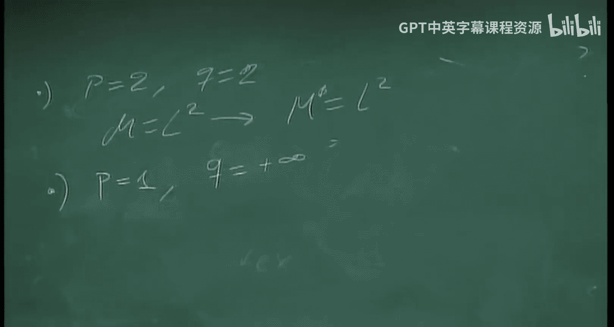

函数F被称为**下半连续**的，如果其上图epi(F)是M×R中的闭集。一个等价的定义是：对于任意实数l，其水平集lev_l(F)都是闭集。

下半连续性是一种正则性条件，在优化理论中非常重要。一个关键的性质是：如果一个函数族{F_λ}中的每个函数都是下半连续的，那么由它们定义的**上确界函数** `F(x) = sup_λ F_λ(x)` 也是下半连续的。这是因为上确界函数的**上图**是所有单个函数上图的交集，而闭集的任意交仍然是闭集。

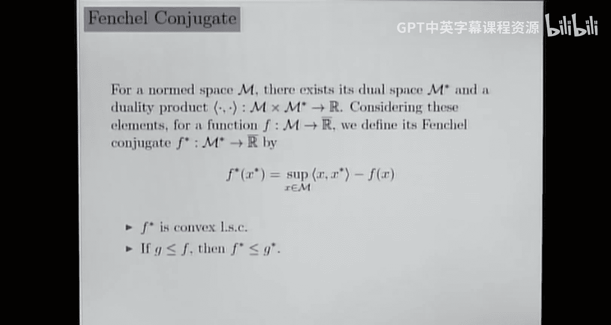

接下来我们定义凸性。函数F被称为**凸函数**，如果其上图epi(F)是M×R中的一个凸集。等价地，F是凸函数当且仅当对于定义域内的任意两点x, y和任意θ ∈ [0,1]，满足：
```
F(θx + (1-θ)y) ≤ θF(x) + (1-θ)F(y)
```
凸函数具有一些很好的性质。例如，凸函数的有效域和所有水平集都是凸集。此外，与下半连续性类似，凸函数族的上确界函数仍然是凸函数。证明思路相同：凸集的交集仍然是凸集。

一个重要的特例是**示性函数**。对于空间M的任意子集D，其示性函数定义为：
```
I_D(x) = 0, 若 x ∈ D
       = +∞, 若 x ∉ D
```
示性函数的上图是`D × R_+`。因此，示性函数`I_D`是凸的当且仅当集合D是凸集；它是下半连续的当且仅当集合D是闭集。

## Fenchel共轭

在建立了凸性和下半连续性的概念后，我们现在可以引入本节课的核心工具——Fenchel共轭。

为了定义共轭，我们需要一个赋范空间M及其对偶空间M*。对偶空间由所有从M到R的连续线性泛函构成。对于x ∈ M 和 x* ∈ M*，我们记它们之间的对偶配对为 `<x*, x>`。在具体空间中：
*   若 M = R^n，则 M* = R^n，且 `<x*, x>` 就是标准内积。
*   若 M = L^p(Ω, F, P)，其中 1 ≤ p < ∞，则其对偶空间 M* 可以等同于 L^q(Ω, F, P)，其中 1/p + 1/q = 1，且对偶配对为 `<x*, x> = E[x* · x]`。

有了这些准备，函数F: M → R∪{±∞}的**Fenchel共轭**函数 F*: M* → R∪{±∞} 定义为：
```
F*(x*) = sup_{x ∈ M} { <x*, x> - F(x) }
```
由于我们允许函数值取±∞，这个上确界总是存在的。

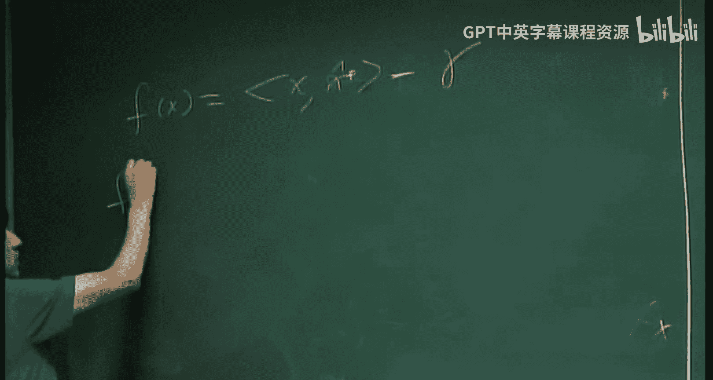

共轭函数有一些非常重要的固有性质。无论原函数F如何，其共轭F*总是**凸函数**且是**下半连续**的。这是因为对于每个固定的x，函数 `G_x(x*) = <x*, x> - F(x)` 关于x*是线性（因此是凸且连续的），而F*是这一族函数的上确界。

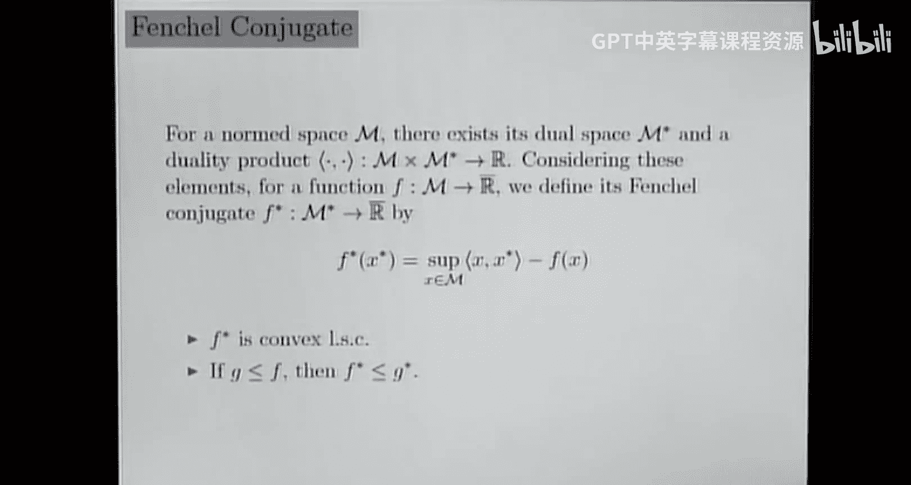

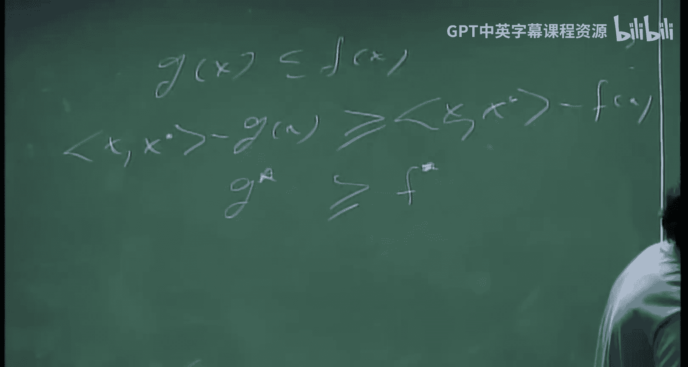

我们可以从几何角度理解共轭。对于给定的斜率x* ∈ M*，共轭值F*(x*)是使得仿射函数 `l(x) = <x*, x> - γ` 整体位于F图像下方（即 `l(x) ≤ F(x)` 对所有x成立）的最小截距γ。换句话说，`-F*(x*)` 是斜率为x*的支撑超平面在垂直方向所能达到的最高位置。

让我们看一个简单例子。考虑函数 `F(x) = max{x, 0}`，即正部函数。通过计算其共轭，我们可以得到：
```
F*(x*) = 0,         若 0 ≤ x* ≤ 1
       = +∞,        其他情况
```
这恰好是区间[0,1]的示性函数。这个结果与我们之前的几何直观相符：只有当斜率在0到1之间时，才能找到位于F图上方的直线。

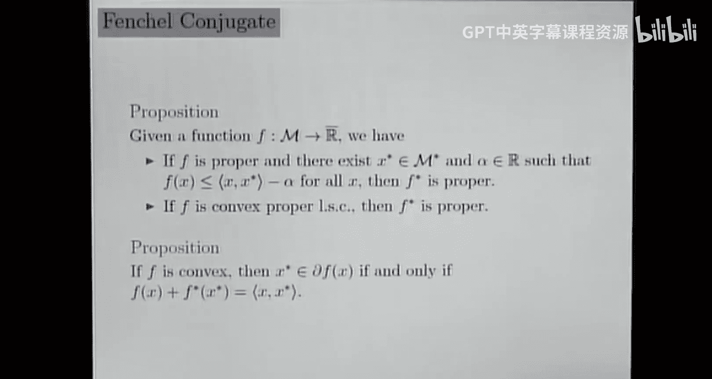

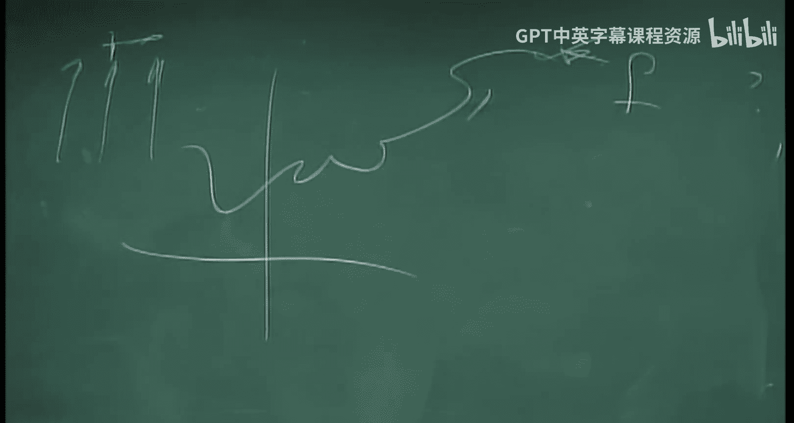

另一个例子是线性函数 `F(x) = <a, x>`。其共轭为：
```
F*(x*) = 0,         若 x* = a
       = +∞,        若 x* ≠ a
```
这可以看作是单点集{a}的示性函数。

然而，如果原函数F“性质很差”，其共轭函数可能退化为恒为正无穷的函数，从而失去信息价值。因此，为了得到有意义的对偶理论，我们通常要求原函数F本身具有较好的性质，特别是凸性和下半连续性。

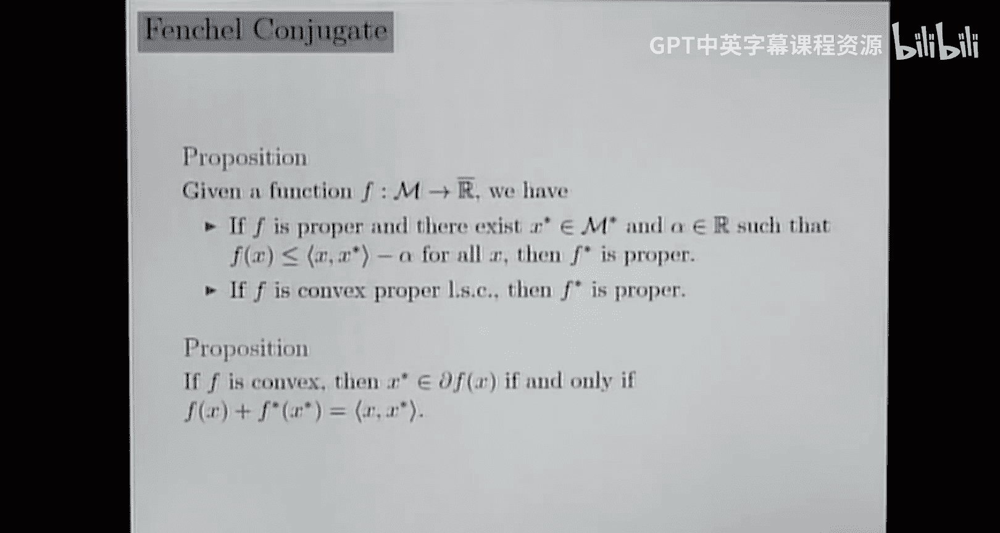

## 共轭运算的性质与Fenchel-Moreau定理

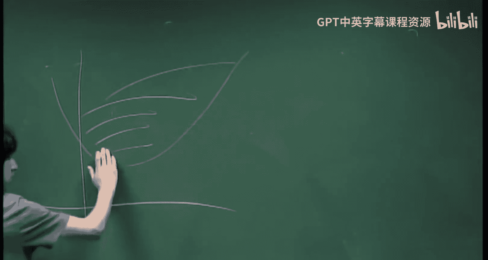

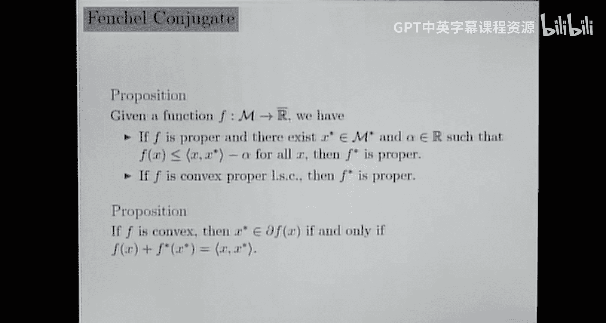

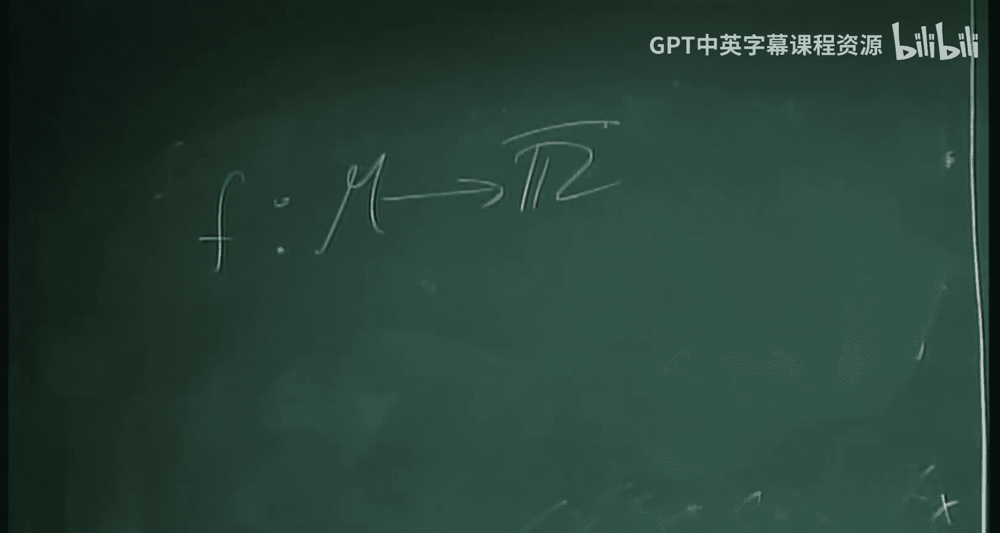

我们已经看到，即使原函数不凸，其共轭也是凸的。那么，对共轭函数再取一次共轭会怎样呢？这就是著名的Fenchel-Moreau定理所回答的问题。

首先，我们有两个基本引理。第一个引理指出，对于任何函数F，其二重共轭F**（限制回原空间M）总是满足 `F**(x) ≤ F(x)`。第二个引理则指出，如果F是正常、凸且下半连续的，那么它等于所有在其下方的仿射函数的上确界。

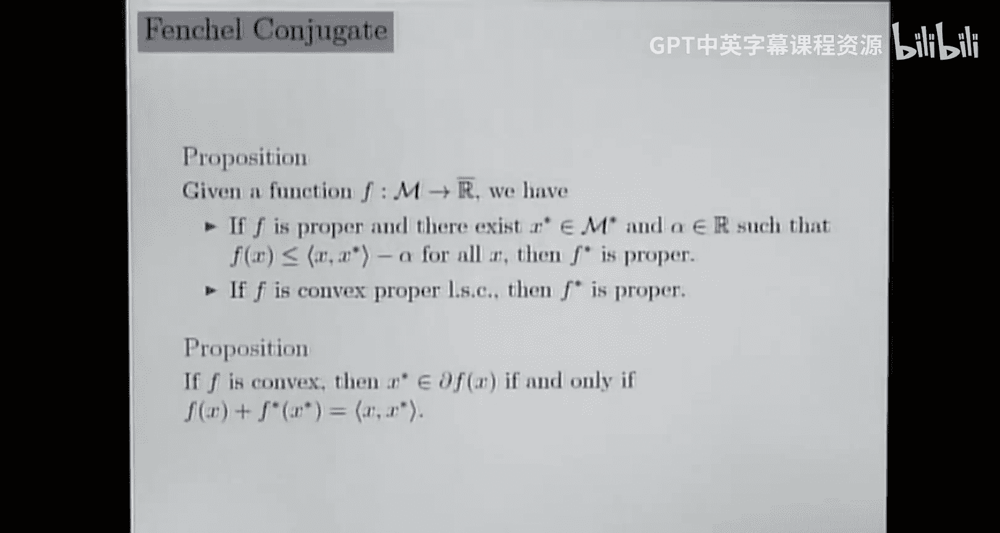

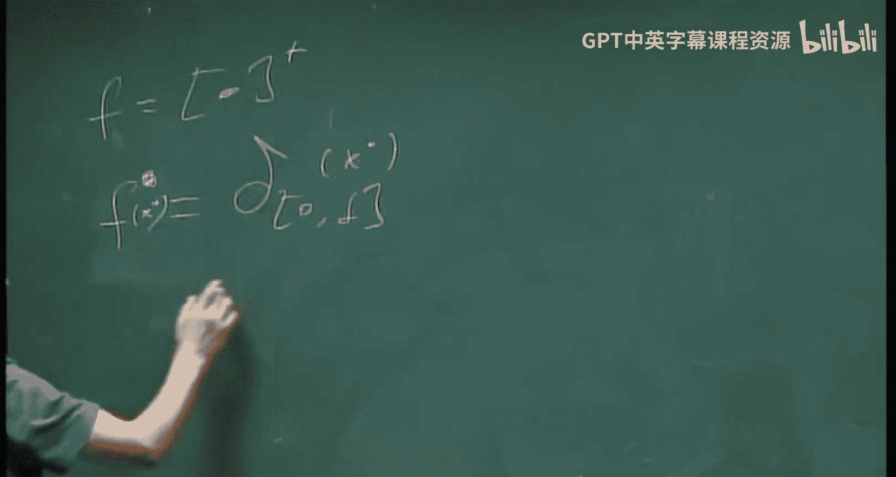

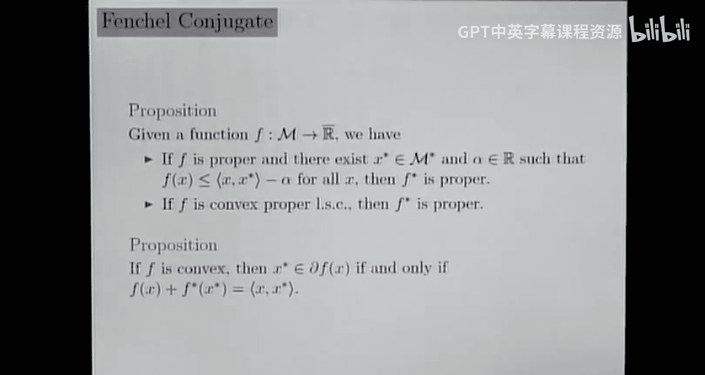

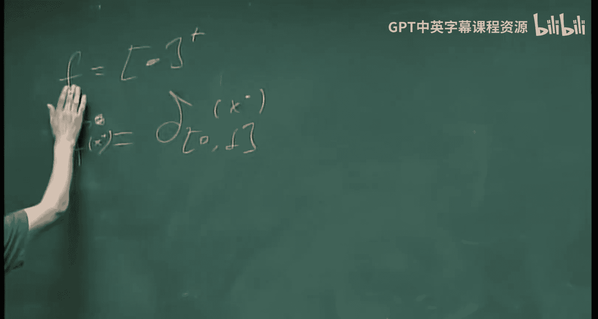

结合这两个引理，就得到了**Fenchel-Moreau定理**：若函数F: M → R∪{±∞}是正常、凸且下半连续的，则其二重共轭等于自身，即：
```
F**(x) = F(x), 对所有 x ∈ M
```
这个定理是对偶理论的基础。它意味着对于一个性质良好的凸函数，其全部信息都编码在其共轭函数中，并且可以通过二次共轭完全恢复。

此外，对于正常、凸、下半连续的函数F，其共轭F*也是正常、凸、下半连续的。并且，F与F*通过以下关系紧密联系：`x* ∈ ∂F(x)`（即x*是F在x点的次梯度）当且仅当：
```
F(x) + F*(x*) = <x*, x>
```
这个关系在优化和变分分析中至关重要。

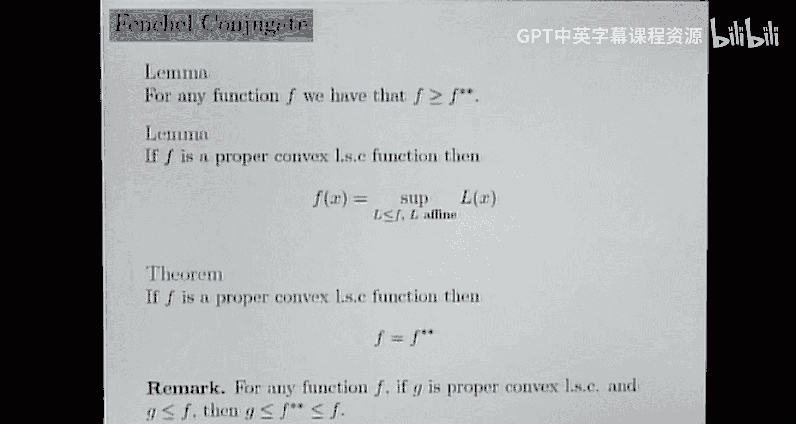

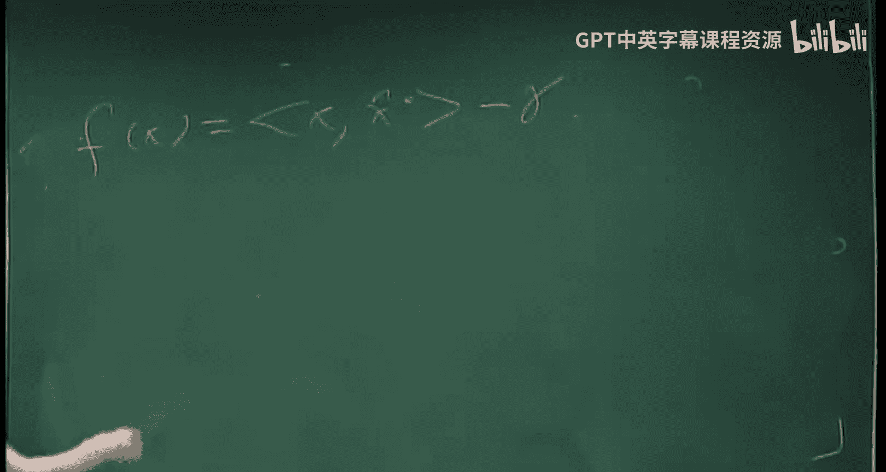

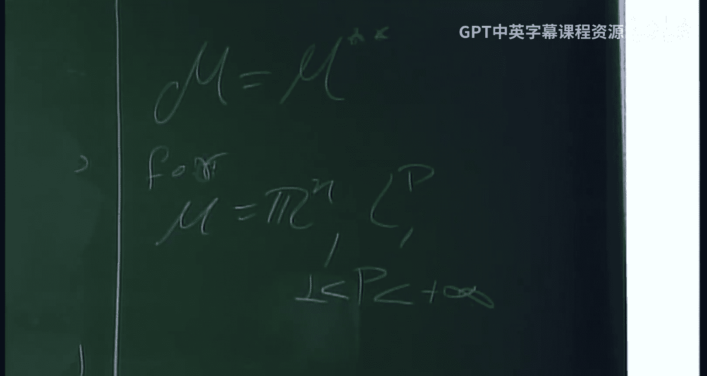

## 应用于风险度量

现在，我们将上述凸分析工具应用于风险度量。设ρ: M → R∪{+∞}是一个风险度量，其中M通常是某个L^p空间。

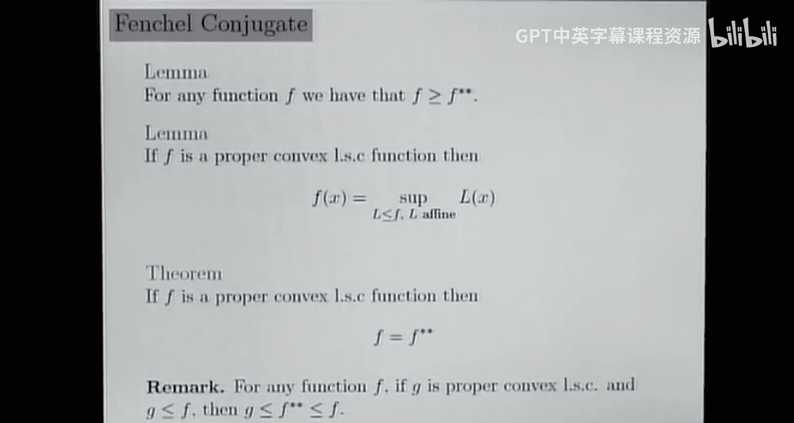

首先，我们可以考察风险度量的性质如何影响其共轭ρ*。
*   **平移不变性**：若ρ满足平移不变性，即 `ρ(Z + c) = ρ(Z) + c`，则在其共轭ρ*的有效域内，所有元素Z*都满足 `E[Z*] = 1`。
*   **单调性**：若ρ是单调的，则在其共轭ρ*的有效域内，所有元素几乎处处非负，即 `Z* ≥ 0`。
*   **正齐次性**：若ρ是正齐次的，则其共轭ρ*是一个示性函数。即，在其有效域内取值为0，在有效域外取值为+∞。

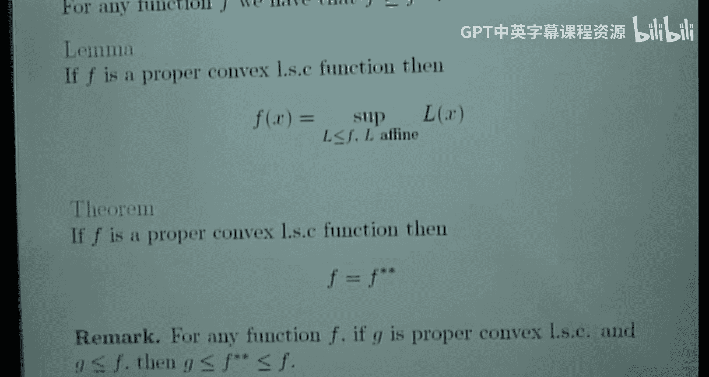

最重要的结果是关于**相干风险度量**的表示定理。假设ρ是一个正常、下半连续的相干风险度量（即满足平移不变性、单调性、次可加性和正齐次性）。那么，ρ必然是凸函数。根据Fenchel-Moreau定理和对偶性质，存在一个闭凸集U ⊆ M*，使得ρ可以表示为：
```
ρ(Z) = sup_{Z* ∈ U} E[Z* · Z]
```
其中集合U中的元素满足：`Z* ≥ 0` 且 `E[Z*] = 1`。集合U正是共轭函数ρ*的有效域 `dom(ρ*)`。

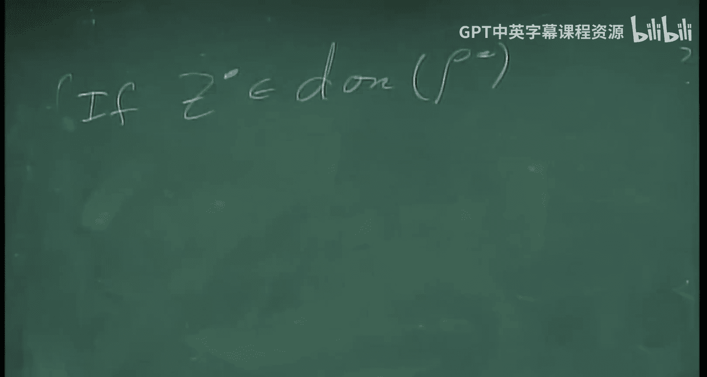

这个表示定理具有深刻的金融意义。集合U中的元素可以解释为**概率测度变化的密度**（因为非负且期望为1）。因此，任何相干风险度量都可以看作是在一族“广义场景”或“概率测度”下取期望损失的上确界。这为风险度量提供了一个清晰的对偶解释。

此外，风险度量ρ在0点的次微分∂ρ(0)恰好就是这个对偶集合U。而对于一般的点Z，其次微分∂ρ(Z)则是U中使得上确界 `sup_{Z* ∈ U} E[Z* · Z]` 达到最大的那些元素Z*构成的集合。

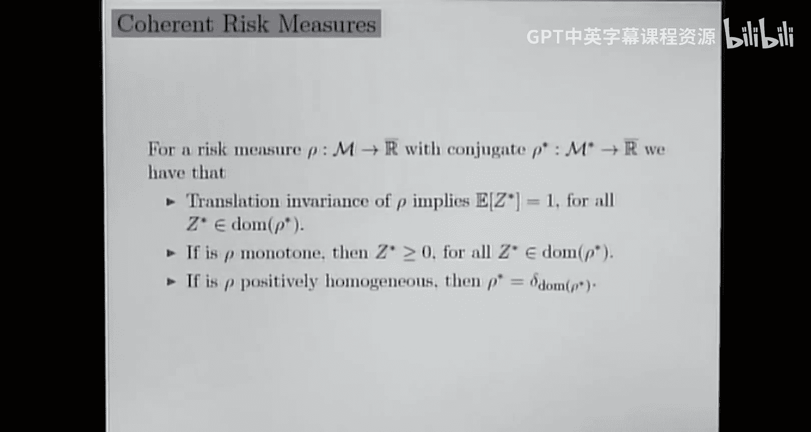

两个极端例子是：
1.  **期望风险度量**：此时U只包含一个元素，即恒为1的密度，`ρ(Z) = E[Z]`。
2.  **最坏情况风险度量**：此时U包含所有满足条件的密度，`ρ(Z) = ess sup(Z)`，即Z的上确界。

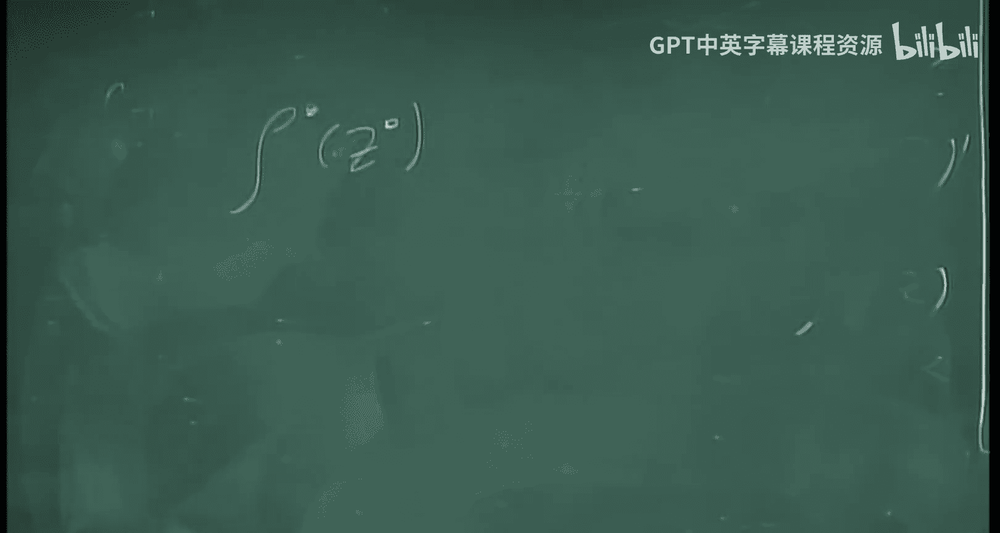

## 案例：平均风险价值（AVaR）

最后，我们应用该框架分析平均风险价值（AVaR）。对于置信水平α，AVaR定义为：
```
AVaR_α(Z) = inf_{u ∈ R} { u + (1/α) E[ (Z - u)_+ ] }
```
这是一个相干风险度量。根据表示定理，它必然存在一个对偶集合U_α。可以证明，这个集合为：
```
U_α = { Z* ∈ L^q : Z* ≥ 0, E[Z*] = 1, 且 Z* ≤ 1/α 几乎处处成立 }
```
因此，AVaR的对偶表示为：
```
AVaR_α(Z) = sup { E[Z* · Z] : Z* ≥ 0, E[Z*]=1, Z* ≤ 1/α }
```
进一步，对于给定的随机变量Z，设u*是定义AVaR的那个优化问题的一个解。那么，AVaR在Z点的次微分∂AVaR_α(Z)由所有满足以下条件的Z* ∈ U_α构成：
```
Z* = 1/α, 在集合 {Z > u*} 上
Z* = 0,   在集合 {Z < u*} 上
Z* ∈ [0, 1/α], 在集合 {Z = u*} 上
```
如果Z是连续型随机变量，那么集合{Z = u*}的概率为零，此时次微分∂AVaR_α(Z)只包含一个元素，该元素在{Z > u*}上取值为1/α，在{Z < u*}上取值为0。这意味着AVaR在Z点实际上是可微的（在某种推广的意义下）。

## 总结

本节课中我们一起学习了Fenchel对偶理论及其在风险度量中的应用。我们从凸函数、下半连续性、上图等基本概念出发，引入了Fenchel共轭运算，并阐述了其核心性质——共轭函数总是凸且下半连续的。随后，我们介绍了关键的Fenchel-Moreau定理，该定理表明性质良好的凸函数可通过其二重共轭完全恢复。

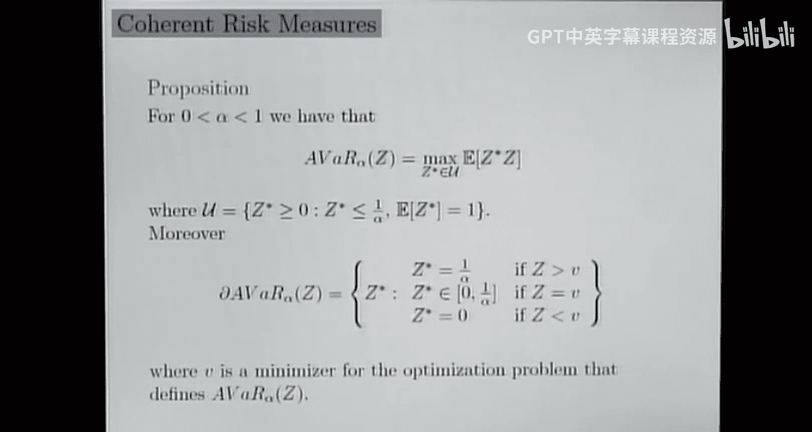

最后，我们将这套理论应用于风险度量。我们证明了任何正常、下半连续的相干风险度量，都存在一个对偶的闭凸概率密度集合U，使得该风险度量可以表示为在这族密度下取期望的上确界。这一对偶表示不仅深刻揭示了相干风险度量的数学结构，也为其计算和解释提供了有力工具。作为例子，我们详细推导了平均风险价值（AVaR）的对偶集合和次微分形式。