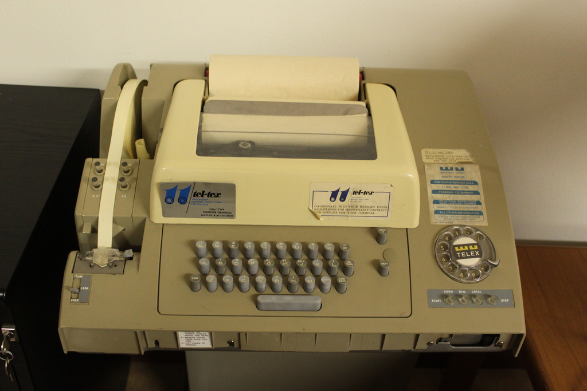
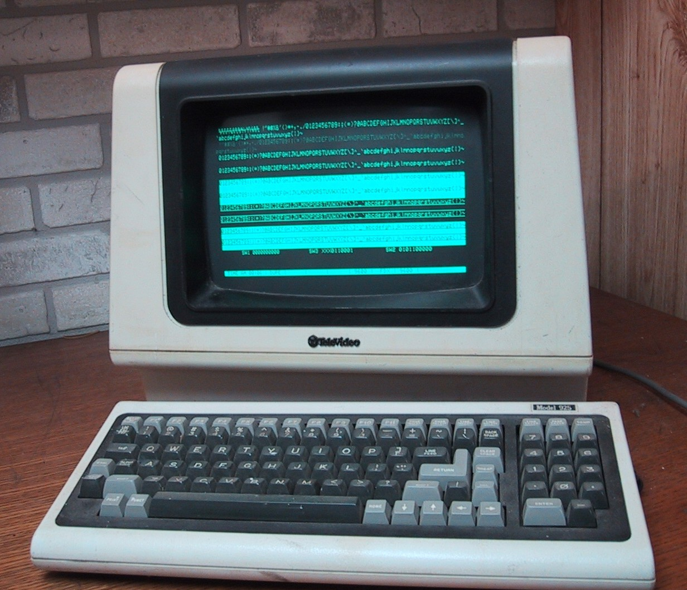

# 命令行

当我开始编程时，还没有图形显示。所有的计算机输入和输出都是使用文本完成的。

计算机由许多用户共享。每个用户从终端连接到计算机（称为终端，因为它是从计算机到用户的连接的终点）。

最早的终端看起来像是打印机和键盘的组合。（当我上中学时，有时会被允许玩一个使用这样的打印终端的计算机。）



后来，打印终端被能够显示 25x80 字符矩阵的 CRT 显示器所取代（包括 ASCII 字母、数字和一些特殊图形字符）。



用户通过键盘键入命令与计算机交互。计算机通过在终端上“打印”命令的输出来回应。

Kotlin 函数 println（“print line”）（或 Python 中的 print，或 C 中的 printf）的名称来源于很久以前的一段时间，输出确实是打印在纸上的。

第一批家用计算机，如 Commodore C-64，仍然是基于文本的。当 IBM PC 在 20 世纪 80 年代初问世时，它使用了基于文本的操作系统（MS-DOS），直到大约 10 年后 Windows 3.1 出现。

在大约 25 年前广泛传播的图形用户界面中，用户通过鼠标点击与计算机交互。这看起来比编写文本命令更容易，但也更受限制。您可以用文本表达命令，执行相当复杂的操作，这些操作手动操作需要您点击数百次鼠标才能完成。因此，命令行在软件开发中仍然被广泛使用，并且在一些其他地方也是如此：例如，旅行代理人使用的标准界面是命令行界面。

在本课程中，我们将从命令行运行和调试 Kotlin 程序（至少在课程开始时是这样）。

在 Windows 中启动命令行，请按下 Windows+R 键（即按住 Windows 键并按“R”键）。您应该会看到一个文本字段，您可以在其中输入命令。输入 cmd 来启动 Windows 命令行。

（如果您使用的是 Mac OSX 或 Linux，您可以简单地打开“终端”程序。但是，下面列出的许多命令是不同的。例如，您应该说 ls 而不是 dir。）

就像在本教程中一样，请不要只是阅读。现在就试一试。

以下是最重要的命令列表：

+   显示当前目录中的文件的命令是 dir，

+   显示当前日期的命令是 date /t，

+   显示当前时间的命令是 time /t，

+   显示消息的命令是 echo message，

+   清屏的命令是 cls，

+   显示或更改当前目录的命令是 cd，

+   创建新目录的命令是 mkdir，

+   显示文件内容的命令是 type，

+   删除文件的命令是 del，

+   更改文件名的命令是 rename，

+   打印最常用命令的帮助命令是 help。

您通常可以通过输入命令名称后跟`/?`来获取有关某个命令的帮助，例如像这样：

```
C:\Users\otfried\Documents>rename /?
Renames a file or files.

RENAME [drive:][path]filename1 filename2.
REN [drive:][path]filename1 filename2.

Note that you cannot specify a new drive or path for your destination file.
C:\Users\otfried\Documents>

```

请立即尝试，并熟悉通过命令行与计算机进行交互。在键入文件名的前一个或两个字符后，您可以使用 Tab 键来完成文件名。您还可以使用上下键来重复以前的命令。
