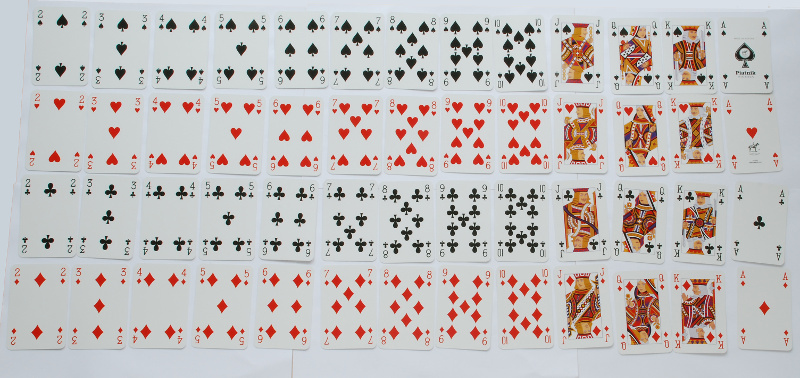

# 数据类

对象是面向对象编程的基础。在 Kotlin 中，每个数据都是一个对象。每个对象都有一个类型，比如 Int、Double、String、Pair、List<Int>或 MutableList<String>。对象的类型决定了你可以对对象做什么。当你使用一个对象时，你应该把对象看作一个黑盒子，你不需要知道对象内部发生了什么。你只需要知道对象做了什么，而不需要知道它是如何实现功能的。

一个类定义了一个新类型的对象。你也可以把一个类看作是对象的“蓝图”。一旦你定义了一个类，你就可以根据蓝图创建对象。

#### 数据类

类的常见用途是定义具有多个属性的对象。例如：

+   平面上的一个点有一个\(x\)-坐标和一个\(y\)-坐标。根据应用程序的不同，坐标可以是整数，也可以是浮点数。

+   一个日期有年、月和日。

+   一个学生对象至少有一个姓名、一个学号和一个专业。

+   一张扑克牌（比如在黑杰克中）有一个花色（梅花、黑桃、红心或方块）和一个点数（2,3,…,10, J, Q, K, A）。

    

这样一个简单的类被实现为一个数据类：

```
>>> data class Point(val x: Int, val y: Int)

```

Point 表示一个二维点。它有两个字段，即 x 和 y。我们可以这样创建 Point 对象：

```
>>> var p = Point(2, 5)
>>> p
Point(x=2, y=5)

```

注意到 Point(2, 5)看起来像一个函数调用，实际上它是对 Point 类构造函数的调用。

一旦我们有了一个 Point 对象，我们可以使用点语法访问它的字段：

```
>>> p.x
2
>>> p.y
5

```

我们也可以使用 println 打印 Point 对象。

```
>>> println(p)
Point(x=2, y=5)

```

我们可以使用==和!=比较两个 Point 对象。只有当它们的所有字段都相等时，两个点才相等。

```

>>> val q = Point(7, 19)
>>> val r = Point(2, 5)
>>> p == r
true
>>> p == q
false
>>> p != q
true

```

现在让我们看看上面的其他示例：一个日期对象可以这样定义：

```
>>> data class Date(val year: Int, val month: Int, val day: Int)
>>> val d = Date(2016, 4, 23)
>>> d.month
4
>>> d.day
23

```

一个学生对象可能看起来像这样：

```
>>> data class Student(val name: String, val id: Int, val dept: String)
>>> val s = Student("Otfried", 13, "CS")
>>> s.id
13

```

一个黑杰克卡片对象可能看起来像这样：

```
>>> data class Card(val face: String, val suit: String)
>>> val c = Card("Ace", "Diamonds")
>>> c.suit
Diamonds
>>> println(c)
Card(face=Ace, suit=Diamonds)

```
