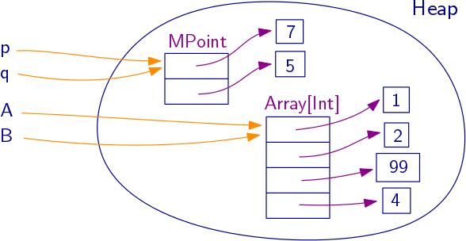
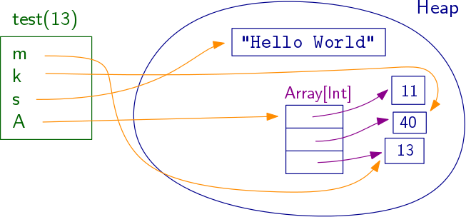

# 不可变和可变对象，引用和堆

在构造后状态无法更改的对象称为不可变（不可更改）。不可变对象的方法不会修改对象的状态。在 Kotlin 中，所有数字类型、字符串和元组都是不可变的。我们上面定义的 Point、Date、Student 和 Card 类都是不可变的。

实际上，如果我们尝试更改 Point 的坐标，我们会收到一个错误：

```
>>> p.x = 7
java.lang.IllegalAccessError: tried to access field ...

```

换句话说，一旦创建了一个 Point 对象，其字段就不能被修改。

可以定义一个可变的 case 类：我们需要在字段名称前面加上 var 关键字：

```
>>> data class MPoint(var x: Int, var y: Int)
>>> val p = MPoint(3, 5)
>>> p
MPoint(x=3, y=5)
>>> p.x = 7
>>> p
MPoint(x=7, y=5)

```

请注意，即使我们将 p 定义为 val 变量，我们仍然可以更改点 p 的\(x\)-坐标。请记住，这只意味着名称 p 将始终指向相同的对象。可以更改此对象内部的字段。

可变对象可能导致棘手的错误。考虑以下代码：

```
>>> val p = MPoint(3, 5)
>>> val q = p
>>> q.x = 7
>>> q
MPoint(x=7, y=5)

```

此时的 p 的值是多少？令人惊讶的是，p 也发生了变化：

```

>>> p
MPoint(x=7, y=5)

```

MutableList 对象当然是可变的，因此它们也可能出现相同的效果：

```
>>> val a = mutableListOf(1, 2, 3, 4)
>>> val b = a
>>> a[2] = 99
>>> b
[1, 2, 99, 4]

```

（再次注意，即使我们已将 a 定义为 val 变量，仍然可以更改 a 的内容。）

#### 引用和堆

为什么会发生这种情况？要理解这一点，我们需要了解变量如何存储对象。

所有对象都存储在运行时系统的一个区域中，称为堆。对象不能存在于其他任何地方。

变量只是堆上对象的名称。您可以将变量视为对堆上对象的引用。该引用唯一指示堆上的对象。（如果您学过 C，可以将此引用视为指针。实际上，它可能并不真正是内存地址。）

赋值操作（如上面的`val q = p`或`val b = a`）在堆上为对象创建一个新名称。p 和 q 实际上是同一个 MPoint 对象的两个不同名称，a 和 b 是同一个 MutableList 对象的两个名称：



对于不可变对象，这种问题永远不会发生，因此最好在可能的情况下使用不可变对象。

#### 局部变量

现在我们知道所有对象都存储在堆中，您可能想知道变量名称，即引用，存储在哪里。

作为对象字段（或列表中的元素）的引用存储在堆中的该对象内部。

大多数其他引用都是某个函数或方法的局部变量。它们存储在称为激活记录或函数的堆栈帧的一部分内存中。激活记录在每次调用函数时都会自动创建。例如，这个函数

```
fun test(m: Int) {
  val k = m + 27
  val s = "Hello World"
  val a = listOf( s.length, k, m )
}

```

有四个局部变量，分别是 m、k、s 和 a。（方法的参数是局部变量，唯一的区别是运行时系统在调用方法时会自动将参数值复制到变量中。）

下面显示了在调用 test(13) 时的 test 激活记录和堆，就在函数返回之前：



#### 垃圾回收

Kotlin 对象是由垃圾回收的：如果运行时系统内存不足，它将检查堆上的所有对象。如果一个对象不再有任何指向它的引用，那么这个对象就不再有用，将被删除。很难预测垃圾回收会在何时发生。如果只运行一个小程序，则可能根本不会发生垃圾回收。

垃圾回收使程序员不必担心内存管理。还有其他一些语言不提供自动垃圾回收。例如，在 C++ 中，程序员负责内存管理。C 或 C++ 程序经常出现错误，即创建但从未销毁对象，因此越来越多的未使用和无法使用的对象填满堆。这样的程序被称为含有内存泄漏。
