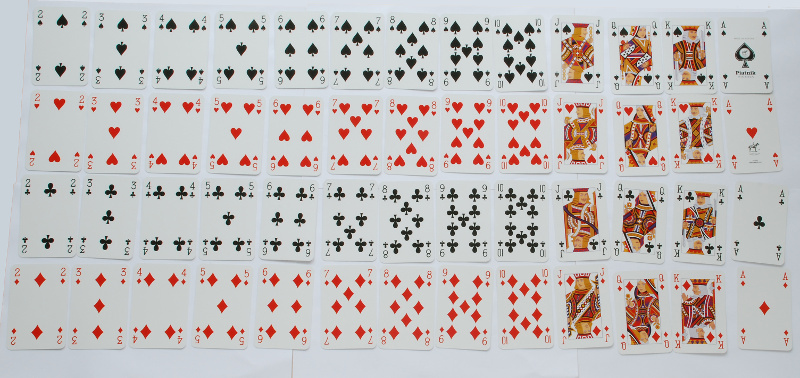

# 更多关于类的信息

到目前为止，我们所有的类都是数据类，因为编译器为这些类提供了一些很好的支持：一个合理的`toString`方法，相等性测试，它们可以用作集合中的元素或映射中的键。

数据类是为具有一些基本属性的对象而设计的，比如数字和字符串，并且对它们的定义有一些限制。在本节中，我们将使用一般的类—我们将在最后回顾它们的区别。

#### 构造函数参数

在创建对象时，我们经常为构造函数提供参数，就像我们创建日期时一样：

```
  >>> var d = Date(2012, 4, 9)

```

参数`2012, 4, 9`对应于在类声明中类名后的括号中出现的参数`year`、`month`和`day`。构造函数参数可以是`val`字段、`var`字段或类的构造的参数。

这里是一个不可变的`Point`类。两个类参数都是`val`字段：

```
class Point(val x: Int, val y: Int) {
  override fun toString(): String = "(%d, %d)".format(x, y)
}

```

这里有一个可变的矩形类`Rect`来存储一个与坐标轴平行的矩形。类参数是`var`字段：

```
class Rect(var corner: Point, var width: Int, var height: Int) {
  init { require(width > 0 && height > 0) }
  override fun toString(): String = "[%d ~ %d, %d ~ %d]".format(corner.x, 
      corner.x + width, corner.y, corner.y + height)
}

```

第一个类参数是一个`Point`对象，所以我应该像这样创建矩形对象：

```
>>> var r = Rect(Point(10, 20), 50, 20)
>>> r
[10 ~ 60, 20 ~ 40]

```

假设我不喜欢这个，我想要能够通过给出四个数字来创建矩形，就像这样：

```
>>> var r = Rect(10, 20, 50, 20)
>>> r
[10 ~ 60, 20 ~ 40]

```

我仍然想要能够将左上角存储为`Point`对象，但是因为类参数现在看起来不同了，我不能在类参数列表中定义`corner`字段。相反，我需要像这样做：

```
class Rect(x: Int, y: Int, var width: Int, var height: Int) {
  var corner = Point(x, y)
  init { require(width > 0 && height > 0) }
  override fun toString(): String = "[%d ~ %d, %d ~ %d]".format(corner.x, 
      corner.x + width, corner.y, corner.y + height)
}

```

现在`corner`字段在类的主体中被定义。类参数`x`和`y`只是`Rect`类型对象构造方法的参数，它们不是类的字段：

```
>>> r.corner
(10, 20)
>>> r.width
50
>>> r.height
20
>>> r.x
error: unresolved reference: x
>>> r.y
error: unresolved reference: y

```

所以类的每个`val`或`var`在类的主体中的出现都定义了一个类的字段。每个字段都必须用一个初始值进行初始化。当对象被构造时，将使用此值。

#### 隐私性

让我们定义一个累加器，一个从零开始的计数器，我们可以给它加上一个值（[accum1.kts](https://github.com/otfried/cs109-kotlin/raw/master/tutorial/52-objects/accum1.kts)）：

```
class Accumulator {
  var sum = 0
  fun add(n: Int) {
    sum += n
  }
}

```

这次类本身没有类参数，所以在创建`Accumulator`对象时不需要给出任何参数：

```
>>> var acc1 = Accumulator()
>>> acc1
Line46$Accumulator@747f281
>>> acc1.add(7)
>>> acc1.add(13)
>>> acc1.sum
20

```

（注意，由于`Accumulator`不是数据类，它默认有一个相当丑陋的`toString`方法。我们需要重写`toString`以获得更好的输出。）

不太好的是，我们可能会意外修改`Accumulator`对象的`sum`字段：

```
>>> var acc2 = Accumulator()
>>> acc2.add(7)
>>> acc2.add(23)
>>> acc2.sum = 0 // Oops
>>> acc2.add(19)
>>> acc2.sum
19

```

使用累加器类的程序员在这里犯了一个错误，并将`acc2.sum`设为零—所以现在最终结果是错误的。

这是一个展示隐私重要性的例子。一个客户端——也就是使用我们类的代码——应该将对象视为黑匣子。客户端不应该需要或想要知道对象是如何实现的，只能使用对象提供的方法与其通信。我们的 Accumulator 对象应该有两个操作：将一个数字添加到当前总和中，以及读取当前总和。不应该可以修改当前总和。

我们可以通过禁止客户端代码访问存储当前总和的字段来实现这一点。为此，我们将该字段声明为 private。然而，这意味着我们根本无法访问它，因此我们必须添加一个新方法来读取求和的当前值（[accum2.kts](https://github.com/otfried/cs109-kotlin/raw/master/tutorial/52-objects/accum2.kts)）：

```
class Accumulator {
  private var current = 0
  fun add(n: Int) {
    current += n
  }
  fun sum(): Int = current
}

```

这是我们正确使用它的方式：

```
>>> var acc1 = Accumulator()
>>> acc1.add(7)
>>> acc1.add(13)
>>> acc1.sum()
20

```

但是现在看看当我们犯一个错误并尝试更改总和时会发生什么：

```
>>> acc1.sum = 0
error: function invocation 'sum()' expected
error: variable expected

```

由于 sum 不是一个字段而是一个返回值的方法，我们无法对其进行赋值。

即使我们试图直接更改字段 current，编译器也会捕捉到这个编程错误：

```
>>> acc1.current = 0
error: cannot access 'current': it is 'private' in 'Accumulator'

```

实际上，甚至查看 current 的值都是被禁止的（这就是为什么我们需要 sum 方法）：

```
>>> acc1.current
error: cannot access 'current': it is 'private' in 'Accumulator'

```

private 关键字意味着该成员只能从类内部的方法中访问。你可以用它来修饰字段和方法。因此，私有方法是只能从同一类中的其他方法调用的方法。

#### 一个二十一点游戏

为了看到一个更有趣的例子，让我们来编写一个二十一点游戏。我们首先需要一个代表扑克牌的类。记住，有四种花色，分别是梅花、黑桃、红心和方块，以及 13 个面值，即 2 到 10、J、Q、K 和 A。



由于这是一个简单的类，我们应该将其制作成一个数据类。无论如何，我们都会重写 toString 以获得一个漂亮的字符串表示（[blackjack1.kt](https://github.com/otfried/cs109-kotlin/raw/master/tutorial/52-objects/blackjack1.kt)）：

```
val Suits = arrayOf("Clubs", "Spades", "Hearts", "Diamonds")
val Faces = arrayOf("2", "3", "4", "5", "6", "7", "8", "9", "10", 
		    "Jack", "Queen", "King", "Ace")

data class Card(val face: String, val suit: String) {
  init {
    require(suit in Suits)
    require(face in Faces)
  }

  override fun toString(): String {
    val a = if (face == "Ace" || face == "8") "an " else "a "
    return a + face + " of " + suit
  }

  fun value(): Int = when(face) {
    "Ace" -> 11
    "Jack" -> 10
    "Queen" -> 10
    "King" -> 10
    else -> face.toInt()
  }
}

```

注意 value 方法，它返回卡片的点数。

```
>>> val c1 = Card("Ace", "Diamonds")
>>> val c2 = Card("Jack", "Spades")
>>> val c3 = Card("8", "Hearts")
>>> c1
an Ace of Diamonds
>>> c2
a Jack of Spades
>>> c3
an 8 of Hearts
>>> val hand = listOf(c1, c2, c3)
>>> hand
[an Ace of Diamonds, a Jack of Spades, an 8 of Hearts]
>>> for (c in hand)
...   println("Card $c has value ${c.value()}")
Card an Ace of Diamonds has value 11
Card a Jack of Spades has value 10
Card an 8 of Hearts has value 8

```

接下来我们需要一个 Deck 类，它存储整副牌，并允许我们从牌堆中抽取牌（[blackjack2.kt](https://github.com/otfried/cs109-kotlin/raw/master/tutorial/52-objects/blackjack2.kt)）：

```
class Deck {
  private val cards = mutableListOf<Card>()

  init {
    generateDeck()
    shuffleDeck()
  }  

  private fun generateDeck() {
    for (suit in Suits) {
      for (face in Faces) {
	cards.add(Card(face, suit))
      }
    }
  }

  private fun shuffleDeck() {
    for (i in 1 .. 52) {
      // 0..i-2 already shuffled
      val j = random.nextInt(i)
      val cj = cards[j]
      cards[j] = cards[i-1]
      cards[i-1] = cj
    }
  }

  fun draw(): Card {
    assert(!cards.isEmpty())
    return cards.removeAt(cards.lastIndex)
  }
}

```

注意 Deck 没有类参数，因此可以简单地通过 Deck() 来创建它，不需要任何参数。让我们仔细看看类的前几行：

```
  private val cards = mutableListOf<Card>()

  init {
    generateDeck()
    shuffleDeck()
  }  

```

第一行定义了一个名为 cards 的 val 字段。该字段用一个空的可变列表进行初始化。因此，在 Deck 对象可以被使用之前，这个列表必须填充实际的卡片。这是通过两个方法调用 generateDeck() 和 shuffleDeck() 来完成的。它们都是 Deck 的私有方法：也就是说，它们是 Deck 的方法，但不能被客户端代码直接调用。它们纯粹是为了类的内部使用（在我们的例子中是在构造函数中使用，以设置一个正确洗牌的 52 张二十一点卡片的牌堆）。第一个方法 generateDeck 用 52 张卡片填充数组，第二个方法 shuffleDeck 将它们重新排列成随机顺序。

最后，draw 方法不是私有的：它是为了让 Deck 的客户端从牌堆中抽取一张牌而设计的。

这是使用 Deck 类的一个例子：

```
>>> val deck = Deck()
>>> for (i in 1 .. 10)
...   println(deck.draw())
a King of Spades
a 3 of Diamonds
a Jack of Hearts
a 7 of Hearts
a 10 of Diamonds
an Ace of Spades
a Queen of Clubs
a 4 of Clubs
a 2 of Clubs
a Jack of Clubs

```

现在我们有一个可工作的牌堆，我们可以编写客户端代码，也就是我们可以实现完整的二十一点游戏。这里是实现一个游戏的 main 函数（你可以下载整个程序 [blackjack-game.kt](https://github.com/otfried/cs109-kotlin/raw/master/tutorial/52-objects/blackjack-game.kt)）。请注意，由于我们已经隐藏了存储卡片、洗牌和管理牌堆的所有复杂性在 Card 和 Deck 类中，因此阅读这段代码是多么容易。

```
// Play one round of Blackjack
//  Returns 1 if player wins, -1 if dealer wins, and 0 for a tie.
fun blackjack(): Int {
  val deck = Deck()

  // initial cards
  var player = mutableListOf(deck.draw())
  println("You are dealt " + player.first())
  var dealer = mutableListOf(deck.draw())
  println("Dealer is dealt a hidden card")

  player.add(deck.draw())
  println("You are dealt " + player.last())
  dealer.add(deck.draw())
  println("Dealer is dealt " + dealer.last())
  println("Your total is ${handValue(player)}")

  // player's turn to draw cards
  var want = true
  while (want && handValue(player) < 21) {
    want = askYesNo("Would you like another card? (y/n) ")
    if (want) {
      player.add(deck.draw())
      println("You are dealt " + player.last())
      println("Your total is ${handValue(player)}")

      // if the player's score is over 21, the player loses immediately.
      if (handValue(player) > 21) {
	println("You went over 21! You lost!")
	return -1
      }
    }
  }

  println("The dealer's hidden card was " + dealer.first())
  while (handValue(dealer) < 17) {
    dealer.add(deck.draw())
    println("Dealer is dealt " + dealer.last())
  }
  println("The dealer's total is ${handValue(dealer)}")

  // summary
  val player_total = handValue(player)
  val dealer_total = handValue(dealer)
  println("\nYour total is $player_total")
  println("The dealer's total is $dealer_total")

  if (dealer_total > 21) {
    println("The dealer went over 21! You win!")
    return 1
  } else if (player_total > dealer_total) {
    println("You win!")
    return 1
  } else if (player_total < dealer_total) {
    println("You lost!")
    return -1
  } else {
    println("You have a tie!")
    return 0
  }
}

```

要编译游戏，我们需要 Date 和 Deck 类（来自 blackjack2.kt）以及游戏函数（来自 blackjack-game.kt），所以我们可以这样编译：

```
$ ktc blackjack2.kt blackjack-game.kt 

```

我们通过 blackjack-game.kt 中的 main 函数来运行游戏，就像这样：

```
$ kt Blackjack_gameKt
Welcome to Blackjack!

You are dealt an 8 of Spades
Dealer is dealt a hidden card
You are dealt a 5 of Clubs
Dealer is dealt a Queen of Hearts
Your total is 13
Would you like another card? (y/n) y
You are dealt a 9 of Diamonds
Your total is 22
You went over 21! You lost!

Play another round? (y/n) n

```

#### 那么数据类呢？

在之前的章节中，我们已经学习了数据类。在本章中，我们开始讨论普通类。那么它们有��么区别呢？

简短的答案是：数据类适用于没有隐藏状态的小对象。我们的 Deck 类就是一个具有隐藏状态的对象的例子，即牌堆上的当前卡片。

长答案是，数据类与普通类在以下方面有所不同：

+   对于普通类，toString 方法只会打印类名和一些十六进制字符串。对于数据类，它会打印类名和所有字段的值。如果我们想要一个漂亮的 toString 方法用于普通类，我们需要重写 toString 方法并自己定义它。

+   对于普通类，相等运算符 == 和 != 只检查两个引用是否指向同一个对象。对于数据类，如果它们的所有字段都相等，则两个对象是相等的：

    ```
    >>> class Normal(val x: Int)
    >>> val n1 = Normal(7)
    >>> val n2 = Normal(7)
    >>> val n3 = n1
    >>> n1 == n2
    false
    >>> n1 == n3
    true
    >>> n2 == n3
    false
    >>> data class Data(val x: Int)
    >>> val d1 = Data(7)
    >>> val d2 = Data(7)
    >>> val d3 = d1
    >>> d1 == d2
    true
    >>> d1 == d3
    true
    >>> d2 == d3
    true

    ```

    如果你想重新定义普通类的 == 和 != 的含义，你必须定义一个 equals 方法。

+   不可变数据类对象可以作为集合的元素或映射的键使用。对于普通类，只有在你定义 equals 和 hashCode 方法时才能起作用，但这超出了本教程的范围。

+   多个数据类字段可以一次性提取：

    ```
    >>> data class Date(val year: Int, val month: Int, val day: Int)
    >>> val d = Date(2012, 9, 12)
    >>> d
    Date(year=2012, month=9, day=12)
    >>> fun extract(date: Date) {
    ...   val (y, m, d) = date
    ...   println("$y/$m/$d")
    ... }
    >>> extract(d)
    2012/9/12

    ```

    赋值语句`val (y, m, d) = date`有效是因为`date`是一个数据类对象。对于普通类，你需要定义`componentX`方法。

+   数据类自动拥有一个复制方法，允许你制作副本并选择性地更改一些字段，例如像这样：

    ```
    >>> d
    Date(year=2012, month=9, day=12)
    >>> val d1 = d.copy(month = 12)
    >>> d1
    Date(year=2012, month=12, day=12)

    ```

    对于普通的类，你需要手动定义这样一个方法。
