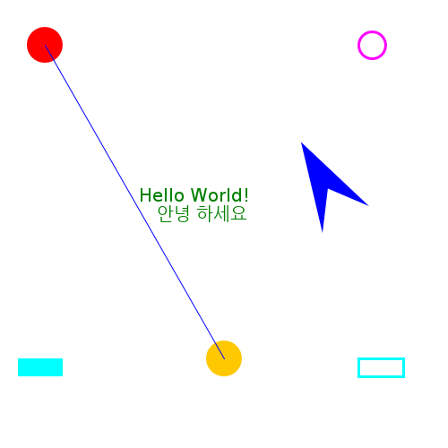

# 绘制图像

要绘制内容，首先需要一个画布来绘制。我们将使用[BufferedImage](http://docs.oracle.com/javase/7/docs/api/java/awt/image/BufferedImage.html)，一个位图图像，您可以通过提供所需的像素宽度和高度来创建它。

然后我们使用我编写的一个小包来绘制这个图像。（当然，您也可以使用标准的 java.awt 函数来执行此操作。但是 java.awt 界面有点过时，使用 cs109ui 包的优点是您可以以后在 Javascript 和 Android 上重用完全相同的绘图代码。）

绘制完成后，您可以使用 javax.imageio.ImageIO.write 函数将图像保存到文件中。

下面是一个完整的示例，展示了一些绘图功能（[drawing.kts](https://github.com/otfried/cs109-kotlin/raw/master/tutorial/92-drawing/drawing.kts)）：

```
import java.awt.image.BufferedImage
import org.otfried.cs109ui.ImageCanvas
import org.otfried.cs109.Color
import org.otfried.cs109.DrawStyle

// Size of image
val w = 500
val h = 500

// create an image
val image = BufferedImage(w, h, BufferedImage.TYPE_INT_RGB)

// get ImageCanvas for the image
val g = ImageCanvas(image)

// clear background
g.clear(Color.WHITE)

// draw two filled circles
g.setColor(Color.RED)
g.drawCircle(50.0, 50.0, 20.0)  // FILL is the default
g.setColor(Color.ORANGE)
g.drawCircle(250.0, 400.0, 20.0)

// draw an unfilled circle with a pen of width 3
g.setColor(Color.MAGENTA)
g.setLineWidth(3.0)
g.drawCircle(415.0, 50.0, 15.0, DrawStyle.STROKE)

// draw a filled and an unfilled Rectangle
g.setColor(Color.CYAN)
g.drawRectangle(20.0, 400.0, 50.0, 20.0, DrawStyle.FILL)
g.drawRectangle(400.0, 400.0, 50.0, 20.0, DrawStyle.STROKE)

// draw a line
g.setLineWidth(1.0)   // reset to default
g.setColor(Color(0, 0, 255)) // same as Color.BLUE
g.beginShape()
g.moveTo(50.0, 50.0)
g.lineTo(250.0, 400.0)
g.drawShape(DrawStyle.STROKE)

// draw a non-convex quadrilateral:
g.save()              // save current coordinate system
g.translate(360.0, 260.0) // move origin to here
g.rotate(-30.0)           // rotate 30 degrees counter-clockwise
g.beginShape()
g.moveTo(0.0, 0.0)
g.lineTo(30.0, -40.0)
g.lineTo(60.0, 0.0)
g.lineTo(30.0, -100.0)
g.closePath()
g.drawShape()
g.restore()           // restore current coordinate system

// draw some text
g.setColor(Color(0, 128, 0)) // a darker green
g.setFont(20.0, "Batang")
g.drawText("Hello World!", 155.0, 225.0)
g.drawText("안녕 하세요", 175.0, 245.0)

// done with drawing
g.done()

// write image to a file
javax.imageio.ImageIO.write(image, "png", java.io.File("drawing.png"))

```

生成的绘图如下：



#### 颜色

使用 org.otfried.cs109.Color 对象指定颜色。有一些预定义的颜色：

+   Color.BLACK

+   Color.BLUE

+   Color.CYAN

+   Color.DARK_GRAY

+   Color.GRAY

+   Color.GREEN

+   Color.LIGHT_GRAY

+   Color.MAGENTA

+   Color.ORANGE

+   Color.PINK

+   Color.RED

+   Color.WHITE

+   Color.YELLOW

要创建另一种颜色，请提供其红色、绿色和蓝色组件，作为介于 0 和 255 之间的整数：

```
val color = Color(0, 200, 0)  // slightly darker green

```

您还可以从 24 位整数构造颜色：

```
val color = Color(0x00c800)  // slightly darker green

```

#### 绘图样式

每个形状都可以用两种方式绘制：作为填充形状绘制，或者使用“笔”沿着形状的轮廓绘制（或两者兼而有之）。

您可以使用以下常量之一选择绘图样式

+   DrawStyle.STROKE 以绘制形状的轮廓（在这种情况下，线宽很重要）；

+   DrawStyle.FILL 以填充形状（这是默认值，始终可以省略）；

+   DrawStyle.STROKE_AND_FILL 来执行两者。

#### 文本字体和对齐方式

要绘制文本，您需要使用 setFont 在 ImageCanvas 上设置字体。您可以像这样提供一个点大小：

```
  canvas.setFont(16.0)

```

或者使用标准名称之一"Monospaced"、"Serif"或"SansSerif"，或系统中安装的实际字体的名称设置不同的字体：

```
  canvas.setFont(16.0, "Serif")

```

调用 drawText 时，您可以选择将文本对齐到其左边缘、右边缘或水平中心。对齐方式通过常量进行选择

+   TextAlign.LEFT（这是默认值，可以省略）；

+   TextAlign.CENTER；

+   TextAlign.RIGHT。

#### ImageCanvas

org.otfried.cs109ui.ImageCanvas 对象执行所有绘图。您可以使用其 width 和 height 属性来查询画布的大小（但是您当然也可以检查原始的 BufferedImage）。

ImageCanvas 的基本方法包括：

+   清除（clear）函数清除整个画布为指定的颜色；

+   setColor(color: Color) 设置未来绘图操作的颜色（有关 Color 类型，请参见上文）；

+   setLineWidth(width: Double)设置轮廓绘制的笔宽度；

+   drawRectangle(x: Double, y: Double, width: Double, height: Double, s: DrawStyle) 绘制矩形；

+   drawCircle(x: Double, y: Double, radius: Double, s: DrawStyle) 在 \((x,y)\) 处以半径 \(r\) 绘制一个圆；

+   setFont(size: Double, face: String) 设置文本绘制操作的字体（参见上面的示例）;

+   drawText(text: String, x: Double, y: Double, a: TextAlign) 在位置 \((x, y)\) 绘制对齐的字符串;

+   done() 在完成绘制时建议调用此方法。

#### 更复杂的形状

要绘制除了矩形和圆之外的形状，您需要使用 ImageCanvas 的 shape 方法：

描述形状时，沿着轮廓走。首先，调用 beginShape()，然后调用 moveTo(x, y) 前往轮廓的起点。现在，通过一系列的 lineTo(x, y) 调用来描述形状的边界。您可以通过调用 closePath() 来完成轮廓，这将返回到起点（您在调用 moveTo(x, y) 时设置的位置）。对于填充形状，通常要调用 closePath，对于轮廓（描边）形状，这取决于您是否希望该形状是封闭曲线。

最后，调用 drawShape 来绘制形状。

#### 变换

您可以修改坐标系统以便更容易地指定您的对象：

+   translate(x: Double, y: Double) 使点 \((x, y)\) 成为新坐标系的原点;

+   rotate(degrees: Double) 顺时针旋转坐标系;

+   scale(sx: Double, sy: Double) 缩放 \(x\) 和 \(y\) 方向的坐标系统（因此调用 scale(2.0, 2.0) 会使您的绘图尺寸加倍）。

通常，您只想临时修改坐标系，并在完成绘图的某个部分时返回到原始坐标系（请参阅上面代码中的四边形）。通过在更改坐标系之前调用 save()，并在想要返回到先前设置时调用 restore() 来实现这一点。

#### 透明度

通常，后绘制的形状会覆盖先前绘制的形状（计算机图形学中的“画家模型”）。

但是，您可以调用 setAlpha(alpha) 来设置未来绘制操作的透明度。当 alpha == 255 时，绘图是不透明的并完全覆盖以前绘制的内容。当 alpha == 128 时，您以 50% 透明度进行绘制：结果是原始颜色的一半与新绘制颜色的一半的混合。

#### 测量文本

方法 textWidth(text: String) 返回在当前变换和字体设置下绘制文本的宽度。
