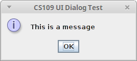

# CS109UI 模块

我编写了一个简单的模块叫做 cs109ui，它使得可以编写具有简单图形用户界面的程序，而无需了解 Swing 库或担心基于事件的编程。我们在[CS109](http://otfried.org/courses/cs109)中的几个项目中使用这个模块。

#### 基本用法

要使用该模块，你需要按照 installation page 中的说明进行安装。

该模块创建一个窗口。你可以通过绘制图像（使用这里解释的操作）来填充这个窗口，然后调用 show。

setTitle 命令设置窗口的标题。

这是一个基本示例（[uitest1.kt](https://github.com/otfried/cs109-kotlin/raw/master/cs109ui/uitest1.kt)）。函数 draw 绘制到一个 java.awt.image.BufferedImage（与 drawing example 中的绘图代码完全相同）。

```
import org.otfried.cs109ui.*
import org.otfried.cs109ui.ImageCanvas
import org.otfried.cs109.Color
import org.otfried.cs109.DrawStyle

import java.awt.image.BufferedImage

fun draw(image: BufferedImage) {
  // get ImageCanvas for the image
  val g = ImageCanvas(image)

  // clear background
  g.clear(Color.WHITE)

  // draw two filled circles
  g.setColor(Color.RED)
  g.drawCircle(50.0, 50.0, 20.0)  // FILL is the default
  g.setColor(Color.ORANGE)
  g.drawCircle(250.0, 400.0, 20.0)

  // draw an unfilled circle with a pen of width 3
  g.setColor(Color.MAGENTA)
  g.setLineWidth(3.0)
  g.drawCircle(415.0, 50.0, 15.0, DrawStyle.STROKE)

  // draw a filled and an unfilled Rectangle
  g.setColor(Color.CYAN)
  g.drawRectangle(20.0, 400.0, 50.0, 20.0, DrawStyle.FILL)
  g.drawRectangle(400.0, 400.0, 50.0, 20.0, DrawStyle.STROKE)

  // draw a line
  g.setLineWidth(1.0)   // reset to default
  g.setColor(Color(0, 0, 255)) // same as Color.BLUE
  g.beginShape()
  g.moveTo(50.0, 50.0)
  g.lineTo(250.0, 400.0)
  g.drawShape(DrawStyle.STROKE)

  // draw a non-convex quadrilateral:
  g.save()              // save current coordinate system
  g.translate(360.0, 260.0) // move origin to here
  g.rotate(-30.0)           // rotate 30 degrees counter-clockwise
  g.beginShape()
  g.moveTo(0.0, 0.0)
  g.lineTo(30.0, -40.0)
  g.lineTo(60.0, 0.0)
  g.lineTo(30.0, -100.0)
  g.closePath()
  g.drawShape()
  g.restore()           // restore current coordinate system

  // draw some text
  g.setColor(Color(0, 128, 0)) // a darker green
  g.setFont(20.0, "Batang")
  g.drawText("Hello World!", 155.0, 225.0)
  g.drawText("안녕 하세요", 175.0, 245.0)

  // done with drawing
  g.done()
}

fun main(args: Array<String>) {
  setTitle("CS109 UI Test #1")
  val image = BufferedImage(500, 500, BufferedImage.TYPE_INT_RGB)
  draw(image)
  show(image)
}

```

我们编译并运行程序：

```
$ ktc uitest1.kt
$ kt Uitest1Kt

```

程序会打开一个像这样的新窗口：


请注意，尽管主函数已经返回，程序尚未终止。要结束程序，你必须手动使用鼠标关闭窗口。

#### 更新显示

你可以通过绘制一个新图像并再次调用 show 来更改窗口的内容。（你可以绘制到之前的相同图像或使用新图像。）

在窗口变化之间等待一段时间，你可以执行一些简单的动画，比如让对象在窗口内闪烁或移动。

这里有一个简单的示例，展示了一个闪烁的正方形。首先，正方形以红色出现一秒钟，然后以蓝色出现一秒钟。五秒后程序会自动终止（[uitest2.kt](https://github.com/otfried/cs109-kotlin/raw/master/cs109ui/uitest2.kt)）：

```
import org.otfried.cs109ui.*
import org.otfried.cs109ui.ImageCanvas
import org.otfried.cs109.Color
import org.otfried.cs109.DrawStyle

import java.awt.image.BufferedImage

fun draw(image: BufferedImage, color: Color) {
  val g = ImageCanvas(image)
  g.clear(Color.WHITE)
  g.setColor(color)
  g.drawRectangle(100.0, 100.0, 300.0, 300.0)
  g.done()
}

fun showWait(image: BufferedImage, color: Color, ms: Int) {
  draw(image, color)  // draw rectangle
  show(image)
  waitForMs(ms)       // wait ms milliseconds
}

fun main(args: Array<String>) {
  setTitle("CS109 UI Blinking Rectangle")

  val image = BufferedImage(500, 500, BufferedImage.TYPE_INT_RGB)

  showWait(image, Color.WHITE, 500)  // 0.5 sec white picture
  showWait(image, Color.RED, 1000)   // 1 sec red rectangle
  showWait(image, Color.WHITE, 500)  // 0.5 sec white picture
  showWait(image, Color.BLUE, 1000)  // 1 sec blue rectangle
  showWait(image, Color.WHITE, 5000) // 5 secs white picture  

  close() // close window and terminate program
}

```

同样，你可以使用以下命令运行：

```
$ ktc uitest2.kt
$ kt Uitest2Kt

```

现在你可以编写有趣的程序，比如[Simon project](http://otfried.org/courses/cs109/project-simon.html)：你可以使用终端进行文本输出和文本输入，使用窗口进行图形输出。

#### 动画

通过快速更新窗口，我们可以编写一些简单的平滑动画。这里有一个示例，让一个红色球在屏幕上平滑移动（[uitest-animation.kt](https://github.com/otfried/cs109-kotlin/raw/master/cs109ui/uitest-animation.kt)）：

```
import org.otfried.cs109ui.*
import org.otfried.cs109ui.ImageCanvas
import org.otfried.cs109.Color
import org.otfried.cs109.DrawStyle

import java.awt.image.BufferedImage

fun draw(image: BufferedImage, x: Double, y: Double) {
  val g = ImageCanvas(image)
  g.clear(Color.WHITE)
  g.setColor(Color.RED)
  g.drawCircle(x, y, 40.0)
  g.done()
}

fun main(args: Array<String>) {
  setTitle("CS109 UI Animation test")

  val image = BufferedImage(500, 500, BufferedImage.TYPE_INT_RGB)

  var x = 30.0
  var y = 30.0
  while (x < 500.0) {
    draw(image, x, y)
    x += 2
    y += 1
    show(image)
    waitForMs(10)
  }
}

```

#### 键盘输入

如果我们想要更进一步，我们可以通过窗口与用户进行所有交互。我们可以使用 drawString 函数在窗口中显示文本。下一步是允许用户通过在窗口中按键来控制程序。

这是使用 waitKey 函数完成的。它会等待用户按下一个键，然后返回所按下的字符。这里有一个简单的测试程序（[uitest3.kt](https://github.com/otfried/cs109-kotlin/raw/master/cs109ui/uitest3.kt)）：

```
import org.otfried.cs109ui.*
import org.otfried.cs109ui.ImageCanvas
import org.otfried.cs109.Color
import org.otfried.cs109.DrawStyle

import java.awt.image.BufferedImage

fun draw(image: BufferedImage, color: Color) {
  val g = ImageCanvas(image)
  g.clear(Color.WHITE)
  g.setColor(color)
  g.drawRectangle(100.0, 100.0, 300.0, 300.0)
  g.done()
}

fun main(args: Array<String>) {
  setTitle("CS109 UI Keyboard Input Test")

  val image = BufferedImage(500, 500, BufferedImage.TYPE_INT_RGB)

  draw(image, Color.RED)
  show(image)

  println("Now press some keys inside the CS109 UI windows")
  println("Pressing 'q' will terminate the program")

  while (true) {
    val ch = waitKey()
    println("Got character $ch")
    if (ch == 'q')
      close()  // close window and terminate program
  }
}

```

窗口出现后，尝试在窗口上聚焦时键入键。您应该在终端上看到消息“Got character”。按下“q”键将终止程序。

#### 对话框

我们可以通过使用额外的弹出窗口（通常称为“对话框”）使我们的程序更加专业。

最简单的方法只是向用户显示一条消息。用户必须按下“确定”才能继续程序。例如，使用这段代码

```
  showMessage("This is a message")

```

我们将得到这个弹出窗口：



稍微有趣的是，我们可以询问一个是/否问题，用户可以通过按下两个按钮中的一个来决定：

```
  val yesno: Boolean = askYesNo("Do you like this?")

```

它看起来像这样：


askYesNo 函数将用户的选择作为布尔值返回。

最后，我们可以要求用户输入一个字符串：

```
  val name: String = inputString("What is your name?")

```

它看起来像这样：


再次，该函数返回用户输入的字符串。（如果用户按下“取消”或关闭弹出窗口，则返回空字符串。）

#### 高级功能

在模块中还有一些更多的可能性：从窗口接收鼠标按钮点击，另外两个对话框，以及设置用户输入的超时。当这些对项目有需要时，我会记录这些内容，但你也可以随时查看[示例代码](https://github.com/otfried/cs109/tree/master/cs109ui)。
