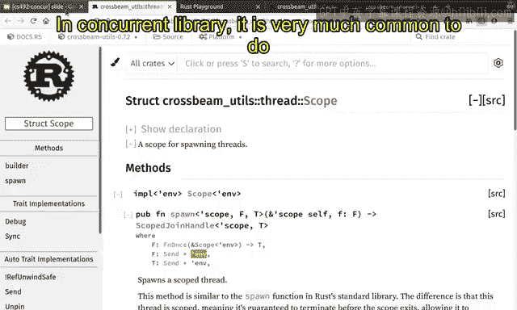
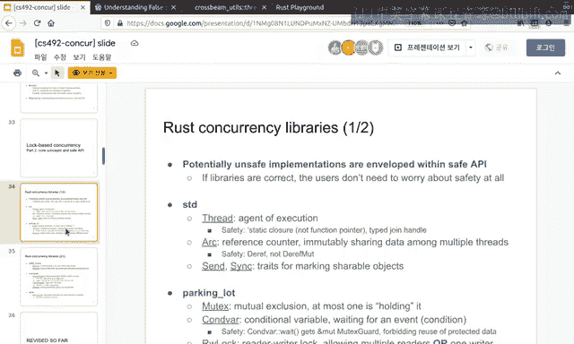

# Rust并发编程：10：基于锁的并发与Crossbeam API 🛠️

在本节课中，我们将学习Rust中广泛使用的并发库——Crossbeam。它是许多Rust程序（例如Firefox）中部署的关键库。作为该库的维护者之一，我将分享其内部实现细节，这也是我们在此研究它的原因。

## Scoped Thread API 🧵

上一节我们介绍了Rust标准库中的线程。本节中我们来看看Crossbeam如何通过`scoped thread`来放宽标准库线程的某些限制。

在Rust标准库中，`std::thread::spawn`函数要求闭包`F`和其返回类型必须是`'static`的。这意味着数据必须能够移动到程序的整个生命周期。但这有时限制过强。例如，我们可能希望声明栈变量并在多个线程间共享它。标准库线程不允许这样做，因为函数类型和返回类型必须是静态作用域的。

相反，Crossbeam的`scoped thread`放宽了此约束，允许以安全的方式共享作用域内的变量。以下是一个来自Crossbeam文档的示例：

```rust
use crossbeam::thread;

let greeting = String::from("Hello, world!");

thread::scope(|s| {
    s.spawn(|_| {
        println!("Thread 1 says: {}", greeting);
    });
    s.spawn(|_| {
        println!("Thread 2 says: {}", greeting);
    });
}).unwrap();
```

此代码创建了一个字符串`greeting`，并在两个线程中共享它。每个线程都不可变地借用`greeting`变量并将其打印到屏幕。使用标准库的`thread::spawn`函数无法实现此操作，因为它要求闭包是`'static`的。

为什么`scoped thread`是安全的？原因在于作用域`s`在生成线程之前定义，并且`scope`函数保证在其闭包结束时，所有在其内部生成的线程都将被等待（join）。因此，在作用域结束后，不再存在对`greeting`变量的引用。这确保了所有线程在`greeting`被丢弃之前都已退出。

在C++等语言中，这种共享通常很难实现，因为对生命周期和作用域的微小误解就会导致程序错误。然而，在Rust中，`scoped thread` API提供了安全的抽象，使我们能够以安全的方式在多个线程间共享数据，而无需担心潜在的不安全行为。

## Cache Padding API 🧱




在并发编程中，**伪共享**是一个常见问题。本节中我们来看看Crossbeam如何通过`CachePadded`类型来缓解此问题。

伪共享发生在多个处理器（或线程）访问同一缓存行中的不同数据时。例如，假设有三个线程P1、P2、P3，它们分别访问自己的数据，但这些数据位于同一缓存行中。如果P2向其数据写入值，则其他线程的缓存行将因此失效，即使它们访问的是不同数据。这会严重影响性能，因为线程的操作会相互干扰。

因此，在并发编程中，应确保多个线程访问不同的缓存行。`CachePadded`类型通过将底层数据`T`填充到缓存行边界来实现这一点。如果底层数据`T`的大小为8字节，`CachePadded<T>`的大小将是64字节或128字节（取决于架构），即在类型`T`周围填充零以使其大小为缓存行的倍数。

例如，在并发队列的实现中，队头指针和队尾指针需要被并发访问。如果它们位于同一缓存行中，对队头的操作和对队尾的操作会相互干扰。通过使用`CachePadded`分别包装这两个指针，可以确保它们位于不同的缓存行中，从而避免伪共享。

```rust
use crossbeam::utils::CachePadded;

struct Queue<T> {
    head: CachePadded<AtomicPtr<Node<T>>>,
    tail: CachePadded<AtomicPtr<Node<T>>>,
}
```

当怀疑存在伪共享时，请使用`CachePadded`。它易于使用，并能有效提升并发数据结构的性能。

## Channel API 📨

我们已经对通道有所了解。本节中我们来看看Crossbeam通道提供的更通用功能。

Rust标准库提供了MPSC（多生产者单消费者）通道。Crossbeam通道则是MPMC（多生产者多消费者）的，这是最通用的通道形式。这意味着多个线程可以同时向通道发送数据，也可以同时从通道接收数据。

你可以通过`unbounded`函数创建一个无界通道（容量无限），也可以通过`bounded`函数创建一个有界通道。当有界通道已满时，尝试发送数据将返回错误。

```rust
use crossbeam::channel;

let (sender, receiver) = channel::unbounded();

// 多个线程可以持有 sender 的克隆并发送数据
let sender2 = sender.clone();
std::thread::spawn(move || {
    sender2.send(42).unwrap();
});

// 多个线程也可以接收数据
std::thread::spawn(move || {
    let msg = receiver.recv().unwrap();
    println!("Received: {}", msg);
});
```

通道的使用非常简单，但其内部实现较为复杂，我们将在课程后期讨论。

Crossbeam通道一个非常有趣的功能是提供了`select!`宏。它可以同时尝试从多个通道接收（或发送）数据，比循环检查所有通道更高效。

```rust
use crossbeam::channel::{self, select};

let (s1, r1) = channel::unbounded();
let (s2, r2) = channel::unbounded();

// ... 在其他线程中向 s1 和 s2 发送数据 ...

select! {
    recv(r1) -> msg => println!("Received from r1: {:?}", msg),
    recv(r2) -> msg => println!("Received from r2: {:?}", msg),
}
```

在实现Actor模型或其他库时，通道的`select`功能将非常有用，我们将在课程后期讨论这一方面。

## 总结 📝

本节课中我们一起学习了Crossbeam库的三个关键API：
1.  **Scoped Thread**：允许安全地在线程间共享作用域内数据，通过确保线程在数据丢弃前结束来保证安全。
2.  **Cache Padding**：通过填充数据到缓存行边界来避免伪共享，提升并发数据结构的性能。
3.  **Channel**：提供了MPMC（多生产者多消费者）通道，以及强大的`select!`宏，用于高效处理多个通道。



Rust的并发库通常都有完善的文档，清晰地解释了各种概念和用法。请阅读相关文档以深入学习。如果遇到问题，可以在项目的issue跟踪器中提问。