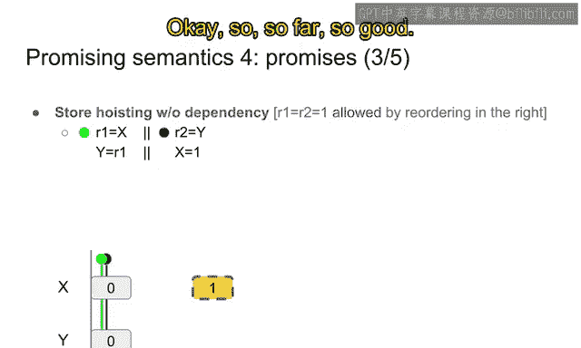
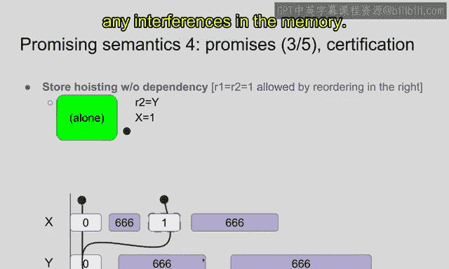
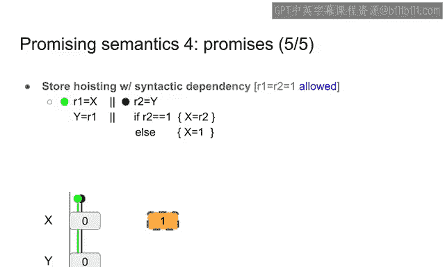
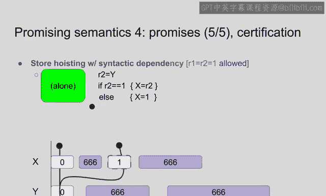
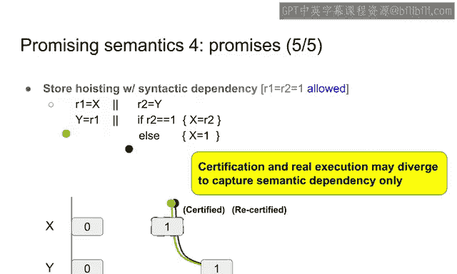
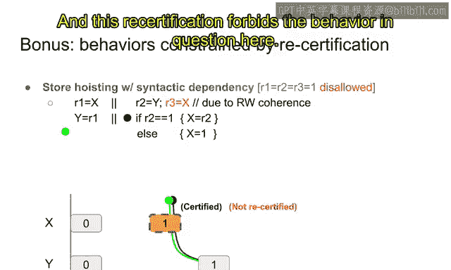
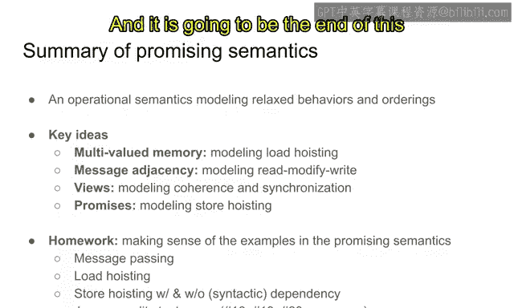
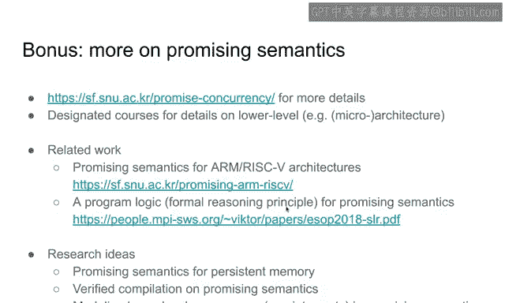

# KAIST《Rust并发编程｜CS431 Concurrent Programming 2020 fall》中英字幕（豆包翻译 - P13：-13-Promising Semantics (2_2).zh_en - GPT中英字幕课程资源 - BV1oi421h7b2

In this video， we are going to study the last idea of the semantics， which is promises。

Is is one of the key ideas of this promising semantics。

 so this the name of semantics is named in such a way。

So it is promisesman because it is it supports promises， basically。

So the promise is basically trying to model store hosting store hosting means that a latest store may be reordered across an earlier instruction so that the latest store may be executed beforehand。

🤢，So。It is in the in the field of the concurrent programming。

 it is known as a major open problem for a programming language semantics of the concurrency because of the following reasons。

 so it is it doesn't seem very difficult at first， but it is actually a little bit difficult for the following reasons。

So let me first explain what is store hostisting， so this example is as we discussed in the previous videos。

 the store hoisting， the left thread is reading from X and then writing the red value to y。

In the in the second strand， Y is red and then axis is return1。The question is。

 is it possible to observe R equals r2 equals 1 at the same time？

It should be possible because in the left thread， the X ones store may be reed across the first door。

First read because they are accessing different locations。

 so their compiler may reorder those two instructions or architecture may reorder those two instructions as well。

If it happens， if they are reed， the stored hoisting behavior is of Jebovo because x may be stored first and then x is red here。

 and then y is written 1， and then the written value 1 is red here。

So by just ordering these two instructions， sequential consistency or interleaving semantics exhibit the behavior in question。

 and namely iron equals all t equals 1。So it should be possible。Then now。

 let us see a little bit different program than the previous one。 Now。

 this is the the same program except that the story instruction here is。X equals R 2。

 instead of x equals 1。So effectively， the left thread is copying the value of x to y。

 and the right thread is copying the value of y to x。Then in this example， the behavior。

 the same behavior R equals r t equals 1 should be forbidden。

Because the value1 is just auto of thin air they are copying values and from the initial state where all the values are0。

 all the value you can get should be0 because only they are copied one is just popping from a thin air。

 So that's the reason why this behavior is called auto thin hair behavior。

 and also this behavior should be forbidden in any。Any。Psible， possible semantics。

So it is not only strange， but it also breaks all the original principles principles that we will learn in the remaining of this course。

 So if you allow this behavior， then you really cannot program the。

You really cannot use synchronation patterns in conquercur programming。

 This should really be forbidden。What is complicated a little more about this problem is that okay。

 you may see that the differences between the two examples is that the first example has no dependency between the two instructions in the restrict。

😊，And the second example has a strong dependency between the two instructions， so you may say that。

 oh， we allow the first behavior by reoring the two instructions。

 allowing redering of the two instructions because they are independent with each other。

 and we can disallow the reoring of the second example because there is a strong dependency between the two instructions。

However， it is not that simple because of the third example here。 so in the third example。

W is red first， and then depending on the red value。If it is one， x equals R 2 is executed。

 and otherwise x equals one is executed。 So basically。

 this is the mixture of the two examples above the left thread is the same as usual。

 and the right right， the first instruction is the same。 but the second instruction is mixed。

 If or one is one， then it is going to use the instruction from the。ASecond example， x equals r 2。

 and if it is0 or other values， then the first example instruction is executed， which is x equals 1。

😊，So the behavior in question R only equals R 2 equals 2， in order to get this behavior。

 you should take the branch， so r2 should be 1 and x equals r2 should be executed。

So you may guess that， oh， this instruction should be forbidden。

Because the instruction that is executed is the same with the instruction that is executed in the second example。

 So the second and third instruction execute the same instructions so we should not allow this behavior as well。

So， it is。A plausible argument。 another reason is that there is a dependency between the two instructions。

So reading from Y has a dependency on the writing to X。So first there is a control dependency。

 so that the condition is using R2。 So depending on the value of R 2。

 this instruction may be executed or not。Second， the data。

 there is a data dependency x equals x y is red and the red value R2 is assigned to x。

 So there is a dependency in two ways on this control dependency here。And their dependency here。

But it is not the case。 so in the real world， this should be allowed。

Under contrary to what you may imagine from the the similarity with the second example。

 So this else Ex1 plays a key role here。 So let me let me explain why this should be allowed in any plausible any sane semantics for programming language concurrency。

So first of all， compiler may forward。R 2 equals one in the then branch。The reason is that in the vr。

 you may be absolutely sure that oh， R 2 should be 1。Because Article 1， branch is taken。

So rt is 1 in this branch， so as a result you may replace R 2 with1。

This is called a store forwarding or constant propag optimization in the compiler pipeline。

So it is one of the most basic and the most widely used optimizations。

 so it is really impossible to turn off this optimization so because everyone uses this optimization。

So you you have to take that this x equals or 2 may be replaced by compiler or with x equals 1。Now。

The then branch and else branch has the same instruction。 This is replaced with x cos 1。

 and this has x cos 1。 So x cos 1 is executed regardless list of whether or2 is one or not。

So what is happening here is that a compiler may hostist this x equals 1 out of this ifl statement。

 so regardless of R equals 1， x equals 1 can be put out of this branch。😊，So。

 though it may be executed right after reading from Y before going into this ethanna else。

And then if the else is can be removed because there is no instructions inside this if else。

So as a result by this two step transformation， we may get the first example here。

 executing x equals 1， and then do nothing。😊，The third example may be transformed by the compiler to the first example。

 and as a result， the first behavior at this behavior in question should be allowed。

So amissororize the situation here。 The third example looks very suspicious。

 so it is almost the same。 it looks like almost the same with the second example。

 so you may guess that this should be forbidden。However， there is a concrete example。

 concrete explanation why this should be allowed。The reason is that compilers。Perform optimizations。

 That is widely used optimizations。And the optimization may transform the third example into the first one。

 thereby allowing this behavior。 and actually this behavior is observable when you compile this program into。

 for example， x 86 I。For example， arm architectures or risk5 architectures。So the question。

 the challenge here is that we we need to find a semantic model。In the in the this semantics。

 aware the first example and the third example is allowed， but the second example is disallowed。

 The key here is that allowing the third example here。How to allow this behavior。

 even though there is a dependency between the first instruction and the store instruction。

That is basically the key。Problem of this。Modeling， store hostisting in concurrenency smatics。Okay。

 so let me explain the idea here。 So how to allow the third example。

 So the key here is the key goal here is， is I said allowing hoisting of sematictically independent rights。

 so in this example this is。Independent， this is dependent。

 This is synactically dependent because there is a data and control dependency。 But as you see。

 the compiler optimization may remove the dependencies。

 So there is no true engineering dependency between this read and this right。

So we need to find a way to decide with whether there is a semantic dependency of like in example1 and3。

 or there is no semantic dependency as in the example too。

The idea is that semantically independent rights are always rightable in the future。

 So regardless of the execution， there is a way to execute a future right。If it is possible。

 if it is the case， then the right is seally independent from the current program counter。

And as a result， we may hostist the always writeritable store。For now。

 because it is medicalally dependent。So let me see the example here。At this point of time。

 we want to store the store here。 The store is here。

 but we want to execute the store at this point of time。But you can see that。From in this execution。

 so x equal equals 1 will be always executed。Regardless of the value read from Y。

 Mexicoco 1 is always executed。However， in the second example are the。

The exit co 1 is not always executable。If， for example， you read y cos 0。

 then you are going to write x equals 0， not x equals 1。So at this point of time。

 you cannot hoist a store because it is unclear whether you are going to store x1 or not。

In the third example。At this point of time， surprisingly， S equal 1 is always writeriable。

So it's the reason。If y is reading one， then you are going to then branch。

 then you are going to write x  one。Otherwise， you are going to go to Alices branchch。

 then you are going to execute execute one。So regardless of the value right from y。

 you're anyway going to write x equals 1 in the future。😊，So this is compatible with this notion here。

Exxicoson is always righttable in the future， for the third example。In other words。

 Xco one is mathematically independent， right？From the point of view at this point。

 when the pro encounter is here， x equal equal one is always writeable。 and as a result。

 this can be hoisted at this point。So at this point， x equals 1 may be executed by the semantics。

 so that's the key idea， so we need to allow the cho thing based on this notion of semantically independent rights。

😊，So how to do this。As I said， the mechanism or idea here is that we allow speculatively right。

A thread to speculatively write a value， or in other words。

 we are going to say a thread may promise to write。

And other thread should always be able to write its promises in the future。 For example。

 if it has promise to write xs 1。It needs to be able to fulfill the promise by actually storing x equal 1。

And this is the way of modeling hoisting and as a result。

 if a thread has already promised to write a value x equals 1。

 the other thread may read the value because the promise value is not only just a promise but it is also an actual thing。

😊，It is a hoisted store， so the other thread may fairlyly read from the hoisted value。

So that is basically the mechanism。And this is the highlight level mechanism and let me explain how this idea can be applied to the above example more precisely。

So this is their example， the first example store hoisting without dependency。

So let me explain why this should be allowed in the promising semantics here。So。Let's first， execute。

Let's first promise to write Xs 1 from the second thread。So let's say that this， this。This block。

 which is， which looks different from this normal block。 it is a a promised block。So let me say that。

 oh， threat2， once2 promise to write x equals 1。So it is the only thing you can do for to get this behavior because if you read first。

 then you are going to get the value 0 at this point in of time when you read the value。

 then the value should be 0 and as a result you cannot get the behavior in question。

So the only action that is enabled by the promising ss is promising to write x equals 1 by the second strand。

Okay， so so far so good。

But in order to promise to write a value， you need to make sure that at this point of time you are going to be able to write xs 1 in the future。

So， let me see why。So first， the thickest thread。These two。Be executed alone。 So in other words。

 in from the threat to point of view， threat one cannot do anything， cannot help B。

To promise to write S equals  one。So the hosting should be happened from。

For my own information that it is the reason why I am going to hide the threat one。

And in the Str2 point of view， I need to be able to fulfill the promise by actually writing x equals 1。

And we may， we should。Well， we should also assume that there is an interference from the other threads by filling out the memory。

 The current memory is filled out by some other things so that I cannot assume the the。

The behavior of the other threads， Other threats may arbitrarily interfere with the memory so that I should be able to。

Deal with such interferences。 So under any kind of any circumstances any in under any interferences。

 I need to be able to fulfill the promise by writing X Co one。😊。

So now let's assume that the interferences and and you can read a 0 from y updating the view to not updating the view at all because your view is already on the value 0。

 and then you can。😊，Fuul fitit the promise by storing 1 to x。

So that's the reason why this example is allowed。 I mean。

 you can promise to write x equal one because it is you are going to be able to， you are actually。😊。

You have an ability to fulfill the promise。 You are able to write x equals one under any circumstances and under any interferences and。

😊，And you alone。 The threat to alone can fulfillfil the promise without any help from this thread one。

And under any circumstances or any interferences in the memory。

So that's the reason why this promise is certified， that means that oh， from Strputu's point of view。

 x equals 1 can be executed before or hoisted in such a way that it can store to before reading from Y。

And this certified right enables the thread1 to read x equals 1。 So from C one's point of view。

 it can read the value here。😊，Because the certified value is also a valid value and the other thread can read this block。

So Exco one is right here。 It can be right here。And then it also enables the third one to write y equal  one。

😊，And now it is the time for certain1 to execute the behavior。 So first。

 it may read y equals 1 because it is already written in the memory。And furthermore。

 it can finally fulfill the promise， the Xs one。But beforehand。

 it needs to make sure that the the action here reading from。Reading from。

Why the value1 and can be certified again。Because。I said that in in any case。

 you need to be able to fulfill the province。So so when you execute a threat2。

 which has an ongoing promise for each step， you need to recertify the fact that you are going to be able to fulfill the promise。

So let me explain this point later。 in any case， in every step you need to verify you are going to be able to fulfill the promise。

 So it at this point of time， it is also certified because you can just write x equals one here。

 So it is a recertified in this step。😊，And finally。

 you can actually fulfill the promise by writing x equals 1， finishing the execution。

So if it is the execution， then the behavior in question。

 which is iron equals or equals 1 is exhibited。So more of the story is that x equals 1 can be hoisted because there is no dependency between the first and the second instruction in the right strand。

And this is semanically captured by the promising semantics because at the at the beginning at the beginning of this execution。

 I suppose one may be certified， promised。And certified。And as a result， ineffective。Effectively。

 the store may be hoisted， so the effect is that the store is hoisted because x equals 1 is put in the memory for the first step。

And the second thread， I mean， in the and the second in the first thread may read x equals 1 and then write x y equals 1。

Then the second thread may read y equal one and then fulfill the promise buying。

And this all the behaviors are used to justify the fact that Xco 1 can be hoisted。

 and that is represented as the fact that x 1 is promised at the beginning of this execution。Okay。

 so far so good。And。This is the second example of where the store hoisting should not happen because of the auto linear behavior wax x is copied to y in the left thread and y is copied to x in the second thread。

So the value 1 should not popping from the out of thin for both R1 and R2。How to do this。

 So suppose that we want to promise the same value by the second threat。Exxios one。But in this case。

 it is not certified。The reason is that the second thread cannot execute it alone and write x equals1 from the second threat。

Because the only value you can reliably read is y equal 1， y equal 0。

 and then x equals 1 cannot be executed because the only value you can write is 0， x equals 0。

So this is not certified and as a result x equal  one is not promised in other words。

 x equals 1 cannot be hoisted across the all insertion and that the reason why the behavior in question cannot happen in this example in this promise in semantics。

😊，So let me explain the final example where there is a syntactic dependency。

 but there is no semantic true dependency between the first and the second instruction。So the， the。

 the， the story is almost the same for the third with the， the first example。

The second thread needs to promise to write x equals 1。

And let me certify this execution。The second right， it reads。

It needs to fulfill the promise by writing x equals 1。

 and you need to make sure that you can actually do that。😊，Alone。

 without any help from this word thread and。In under any circumstances and under any interferences that is represented in the memory as an additional nonomomistically added memory blockss。

😊，So you need to make sure that under any intros in the memory， you need to be able to alone fulfill。

 I mean， store x equals 1 in the future。😊，So， let me explain why。

The second thread may read x y co0 and as a result， you can go to the else branch。😊。

And then you can write exco swan in this branch。😊，So the， the value， the。

The the promise is actually fulfillable。 We can later actually execute Tos1 in this case。

So Xcos 1 is fulfilled。And you may you may note that。This is certified， thanks to this Elwch。

Because at the beginning， you should go to the Alice branch and then you can write Xco 1。😊，So。

 this is the。This is the reason why the second thread is able to promise to write x equals 1。The al。

Now， the story is almost the same for a left thread。 It is reading one from the promised value。

 and then it is writing y equal1 finishing its execution。

Now story is the same for the first instruction。In the second thread， it may read y equal 1。

And after reading y course 1， as I said， we need to recertify the execution。😊。

So here the execution is recertified。But。With the different branch。So you already read y equals 1。

 So R 2 should be 1。So in the certification， you need to go to the then branchch。

And then execute x equals R 2， which is1。 so x equals 1 is anyway executed。😊。

But the more of the story is that in the initial certification， in the first certification。

 the L branch was taken， so x equals 1 is executed。😊，But now the， after reading Y 1， then the the。

The recertification， the second certification is going to execute the then branch。

 so x equals to R2 is executed。😊，Instead of ways， x equal equals 1。So， it is very much。

Different from the early example， the promise the two certifications are taking different branches。

Different instructions， basically， but with the same effect in the memory xs 1。

So that's basically the reason why this mechanism of promises and certification captures the syntactic depend and the difference between syntactic and smatic dependencies。

So even though the instructions that are executed are different。

 which means there is a syntactic dependency， they are doing the same thing。😊。

So there is no sematictic2 dependency。So this mechanism captures the difference between them。

And next in the van branch， it can actually execute the x equals 1， fulfilling the promise。

 And there is no more need to。A certify again because there is no ongoing promises。

 and the execution is finished。So far second so this example is also explained with the mechanism of promising certification because the promising certification distinguishes is relied on sematic dependency instead of syntactic dependency and it actually accounts for the compiled optimization that is performed on the pro language concurrentency semantics。

😊，Okay， so， so as I said， certification， certifications and real execution may diverge to capture semantic depend。

😊。

Here is a bonus example where you're going to use C the。the need for recertification。So。

 this behavior。The left thread is the same， but in the right thread。

Our3 cos x is executed in between the first and the second instruction。So。

The behavior in question is that is it possible to read Rs equals 1 as well in addition to irons r2 equals 1？

In essence， it should be forbidden。Because there should be RW coherence。

 this read and this right should be ordered， and as a result， this read cannot read from the later。

Right， right。 That's the reason why this behavior is， should be forbidden in the example。I mean。

 in the semans。And let me explain how to forbid this behavior in the Pro semantics。搜。In the same way。

 you may be able to promise to write X equals 1 in this example as well。Almost for the same reason。

 this is certified in the second example。And then the left right may execute the two instructions。

 reading x equals 1 and writing y equals 1 and the second in the second example。😊。

In the second thread， you may execute。😊，Y cause you may read Y equal 1 and exit cost 1。However。

 after reading these two values， y equals 1 and x equals 1， and the view is updated to this point。😊。

You cannot recertify。Because at this point of time， this value。

 this message here cannot be fulfilled at all， because your view is already here。

 then you cannot write to the message where you are already on here。

Recall that you can only read and write on the area here that is after your current of view。

It is on the current view said that this cannot be fulfilled by by the second thread in the promising semantics。

And this the reason why this behavior is forbidden， or in other words， x equals one cannot be。

Wistted across the。This in this instruction， the reading from X。

 if this read need to read from the latest store here。

So that's basically the behavior in which recertification actually is necessary recertification without recertification。

 you may have to allow this behavior。But it doesn't happen in the。In the， in the in the promise。

 because it。Requires recertification and this recertification for this。

 the behavior in question here。

Okay， let me summarize the technical content of the promise semantics。

 It is an operational semantics based on view and promises that is trying to model the relaxed behaviors and orderings。

😊，So that there are four key ideas。 One is memory valued multivalued memory。

 it's towards the entire history of the stores， and it is used to model the load hoisting。

And is the second idea is memory adjaency for modeling a readmod rights such as F add and comparing swap。

😊，And the third example third idea is views， which is modeling coherence and synchronization。

And we also discuss such examples as a coherence and the message passing really acquire message passing and fences。

And also we saw the idea of promises and this promises is used to models through hoisting。

And the key idea was modeling the sman true dependency using the idea of promises and certifications。

And this is an informal homework so that you don't need to submit to the GG。

 but please make sense of the examples in the promising semantics。

 Please understand why if these behaviors are allowed and is these behaviors are forbidden in the promising semantics。

So there are many examples， message passing， load hoisting， store hoisting。

 as we discussed in the previous slides， and there are dozens of test cases in this link。

 Java causality test cases。And please make sure that those examples are making sense in the Pro semantics。

 but except for those three， because they are not correct or they differ from our understanding of the concurren semantics。

 so only for those the other examples， please make sure those examples in the Pro semantics。😊，Okay。

 so far we discuss the the， the。Promise semantics。 and it is the going to be the end of this video。

 But I'd like to present one more slide on if you are interested in Pro semantics。

 please go see if such materials。 So this is the paper。

That is presenting promise semantes。And。There are also more low level semantics for this promising semantics。

 so there are promising semantics for arm and risk 5 architectures。

 so they share almost the same ideas but they are tailored to arm and risk 5 architecture relaxed memory semantics instead of CNC+ plus program language level concurive semantics。

😊，We are also working on the X 86 architectures promising semans， and it it is going to be。Or now。

 I mean。Published probably this year or or next year。

And there is a program logic that is a formal reason principle for promising semantics。

And there are a bunch of research ideas on top of this promise cosmeticmans。

We are almost finished working on promises meant for persistent memory。

 which is a new emerging class of stories between the。😊，The the D and SSD。So， this is some。

I' much faster than a0 and。Performance is almost on par with the D。

 but the data is not gone when the the the the， the system is crushed。 even though the crash。

 the system is crushed， the value is still there in the persistent memory。

But it may ca that due to the cache coherance or some buffering。

 the value that is written in the program may not persist in the persistent memory。

 so we need to define a precise semantics for this persistent memory， in other words。

 which memory can be stored in the persistent memory when the system crashes。🤢。

And we almost finished working on this promise semantics and we are going to publish this year。😊。

And we can also think of a perfect verified compilation for this promising semantics。

 why we can verify or prove the correctness of compiler optimizations on top of this promise semantics。

😊，Or we can model some ISA level concur features like interrupt or other kindness or。

 or cache manipulation operations， etcter。So this is basically the research topic I am interested in。

On top of this promising semantics and if you' are interested。

 please refer to these papers or contact me on the future research。

