# KAIST《Rust并发编程｜CS431 Concurrent Programming 2020 fall》中英字幕（豆包翻译 - P15：-15-Lock-Based Concurrency, Implementation of Ticket_CLH Locks.zh_en - GPT中英字幕课程资源 - BV1oi421h7b2

In this lecture， we are going to study other kinds of locks other than spin locks and。

study their key ideas。 So in this video， we are specifically interested in two log implementations。

 which is one is Ten logs and the other is CLH lock。

And I will briefly explain the key idea of those two。

 The first idea for mutual exclusion is by using release acquired synchronation as in spinlock。

We call that in spinlock we are using release acquire synchronation via the message and the lock location to ensure that you are having mutual exclusion。

Once you acquire a log， you always have a latest view on the data and you are always releasing the latest view on the data when you are releasing the log。

 So that is achieved by the release across synchronization from an all log function and。

To the next acquire function of the lock。So yeah， the view synchronization or view transfer is performed from the end of the critical section to the beginning of the another。

And here， the implement in the implementation， the curve， so。A single location is used to do that。

In the spinner。And this key idea is also used in other kinds of locks， for example。

 in T Lax and CH log and。So on。And for。And furthermore。

 the second idea is guaranteeing fairness by ordering and waiting with different locations。

 So let me explain this with a particular example of particular log。

 but let's say that spin log is missing fairness， which is one of the most important criteria for a log implementation。

 which means that if multiple stress are trying to acquire a log at the same time。

 it may be possible that。A single。A threat is repeatedly acquiring the lock。

Without giving any chance for the other thrusts to acquire the lock at all。

And this is a bad behavior of a lung， but spin knock doesn't exclude such a bad behavior。

On the other hand， tick a lock。Is guaranteeing the fairness by， as I said。

 ordering and waiting with different locations。 So I will explain this idea in the implementation of the the implementation of the。

spin。So okay， so now I'd like to first look at the tickla implementation here。

So Tna has two locations， the current and the next， and both of them are atomic word。

So they are actually contain containing the the number。And at the beginning， Ro currently next are 0。

 they are both0 at the beginning of the execution。So far second good。And。😊，When you acquire a log。

 then you are executing fashion a， which is atically increasing the value of next here。And。

 and you are getting the old value of the next。So basically， next， the ticket means that the。

Ulder of the。ACritical section， order of the lock。That is performed by multiple stress。

 So if your ticket is 0， then you are the first to execute the。A a lock。If your ticket is one。

 then your second， if the ticket is two， then your the next ticket is three， you're the next。

And now the critical section are ordered by this ticket。 So you are issuing a ticket as in the bank。

And you are trying to load the current value。And if it is different from the ticket。

 you are just breaking out。And if it is the same， it means that it's your turn。

If current is 0 and suppose that you incremented the next by fashionate here and you get 0。

 and now the next is has just become one。And you know that you are the first to execute this lock。

Because the current is zero。Here you acquire a lot the current。

 and it must be there at the beginning。And it is same with the ticket cat。

 So you are breaking out this loop and return the ticket。 Oh， I am having a turn to execute the log。

 and I am。For example， the first or the second。😊，To execute this lock。 So。

 and this ticket number is returned。And later， when you finish accessing the underlying data。

 you are trying to unlock it。And you are given the T you are given from the lock function。

And now what you're doing here is， oh， I'm done with this underlyingline data and it's the next rest to execute the threat。

So now we increment the current by storing ticket plus one。So this is basically a plus one。

 but the arithmetic is wrapping around when you add from the maximum number of fewer。🤢。

Then you are getting 0。 So it is wrapping around from the。The maximum value to zero。

And here you have to do a release here。Because it must be synchronizing with this acquire for the next next str。

So let's look at the implementation a little more。 So recall that in the spin log。

 there are only one locations。 So the one location is containing one location is。

Indicating whether spin the log is acquired a lot or not。

And the location is used to synchronize two consecutive critical section。On the other hand。

 in this implementation， this current value and the next value are existing， there are two locations。

And the current variable is used to synchronize the two consecutive critical sections。

 So in the previous critical sections on log function， you are storing a value by release。

As we did for the spin knock。And for the next critical session is current unlock lock function。

 It is reading the current value with an acquire。So there must be a release synchronization。

 And as a result， the latest view on on the data that is protected by the log is released by the previous critical sessions on lock function。

And this view。Is latest， and it is acquired by the next critical sections lock function。

 So as a result。InIn the critical section， the threads must see the latest value。

In every critical section。 So thats guaranteed by this release requires synchronation。Okay。

 so far second。And， further。This next variable is used to order multiple。T。

 multiple critical sections， so。It is。 It is different from。So the。

 the order is decided well before this。Current Lisa across synchronation happens。So， the order。

And this order and the synchronization is done with different locations。 This， De discussing the。

In the slide where I said that ordering and weighting are done with different locations。

 So ordering is the distinguished by this color variable and weighting is on this next variable they are different。

 So the reason why it can guarantee fairness is that the fact a this operation is fair in the underlying architecture。

 So when multiple stress are fashion adding at the same time。

 then it is guaranteed that the multiple stress are getting at number。

So it may be possible that a thread is。Getting lower values always。

 but it is possible it must be the case that if multiple， for example。

 three stress are trying to fetch it at the same time， and then they are。

AnyAnyhow succeeding in the operation。 So they get， for example，01，2。Conly。So， so， if。

A function a thread is calling a log， then it at to get the ticket。

And when it just wait for the ticket turn to arrive， then it will eventually。

It is guaranteed that it will eventually get a turn and return from this lock function。

That is guaranteed because this order is。Older is。Decided with a separate location and Fnet is used for ordering the multiple thrust and Fnet is fair。

 That's the reason why this entire tick line implementation is a fair。Okay， so for a second。

 that is the implementation of the first log wed like to discuss which is sticking。😊，So。

So I will summarize the key ideas once again in the end of this video。

And let's turn to the next implementation of the。

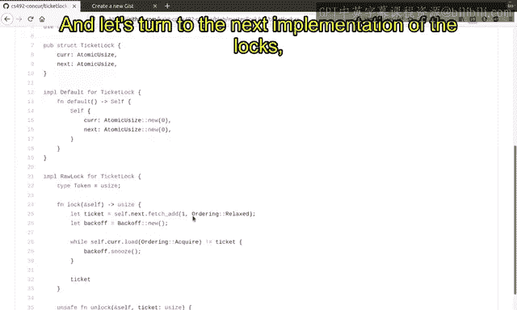

A laxa， which is the Cage lock。

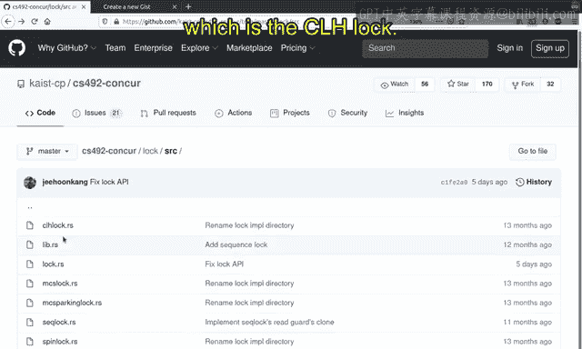

So C， L H is the acronym of people， people names。 their， the last names are one of the。

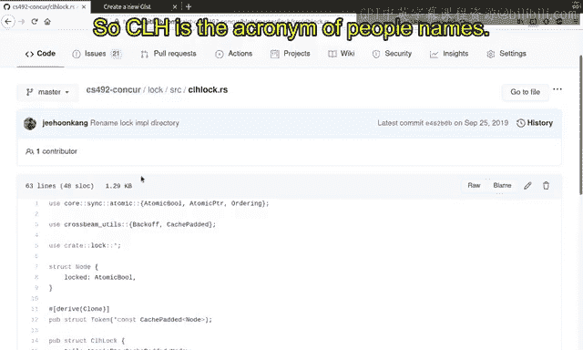

People's less than is C， and the others less than is L and the others less than is H。

 and they collectively。嗯。wrote of paper on this log， and this log is。A famous log for many reasons。

 And I will explain the。

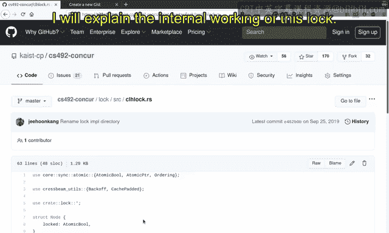

Internal working of this lock。And the sew lock is basically。Linkked list。

And linked list is in the linked list， There's the order among the node， right。

 And each node represents the。Critical section。For each critical section， a new node is created。

And this new note is weighted for。So this is the implementation of the CH log。

 and let me tell you a little bit more about this。😊，Okay and。At the beginning of a CH log。

You are creating。Note a new。A new linked list。And the linked list is actually containing a single node for each node in the linked list。

 it contains only a single boion， which is atomic bullion here。 So note this。😊，I told we pull it。

But unlike the conventional linked list， it is just containing a single value， boolean value here。

But the link is， somehow implicitly。Sttored in the token for each in the each clinical section。

 So I' will explain this a bit more in the。In the in the explanation。

So at the beginning of a C loglog， it is creating a node， a pointer to the node basically。

And this pointer to note is has this type。嗯。Constant immutable pointer or constant pointer to the node。

 which is cache pad。 So here for the reason purposes， this cache pad it doesn't play any。Any。

Interesting role。 so let's say that it's just a constant pointer to note。

And you are creating a new node here。 You are allocating a new node inside a hip。

And the underlying value is false。 Lock is false at the beginning。And this false value is。

And located in the hip。And its pointer is stored in this node。So4 these two functions。

I please consult the。Rot。Ascend art library。Documentation。

 it is basically converting a smart pointer， this box smart pointer into a row pointer that is actually a word。

So at the beginning， you are creating a false node and then I'll return the note。And。As defined here。

 the CH log is containing a single node pointer to the single node。

 which is meant to be the tail pointer。

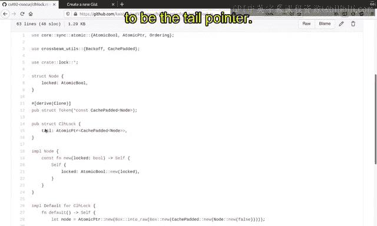

Okay， let's see what's going in here。 So at the beginning， you are creating a box。

And at the beginning of the execution， you are having a。Having a node like here。And at the beginning。

The， the log contains the single node that contains the false box here。So this is the beginning。

Beginning of the lifetime of block， it first contains a pointer to the。

Are false bugs in are located in the hip。

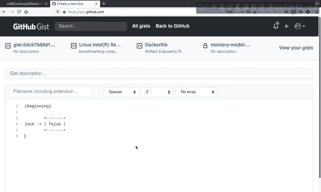

Okay， so far so good。And now， you want to。Implement the lock and unlock function here。

So what's going on here in， let's see what's going on in the log function。So， here。

You are creating a new box here。So that new box has the value true。

And this box is allocated in the hip。Right。And now。You are trying to swap the tail。Poiner。And。I mean。

Yeah。You are trying to。S the tail pointer， the tail pointer becomes this note。

And the old value of the tail is signed here， proof。

So it is it is also an read modified right to instruction。

 It is atomically swapping the original value of tail and the new value of node here。😊。

It is done atomically。So you get the pre pointer。 So what's going on。

 Let's see what's going on in the。

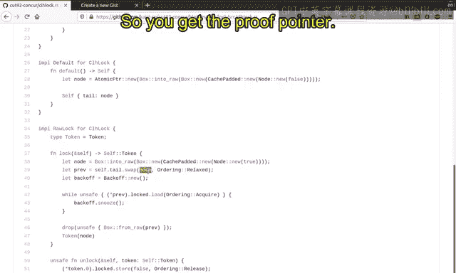

Indeed the。In this diagram。So， you are creating。嗯。You are basically creating。

A new node and URL are are atomically replacing this。So in this diagram， this becomes on the。

This becomes a， this is what was note here in the， in the。In the。In the code。And the first block is。

And in the first block is now。啊。In the pre variable。

 So you so essentially you created a new node that contains the true value here。😊，And also， you are。

You are。Atomically， replace the lock。With the new note here。 So you get the pre block， which is the。

One before the original point original tail before lock function。

And this new node created in the new in the log function is now the new tail。 It is pointed by lock。

 So let's say this is tail。So， this is the。This is the figure right after doing this swap。

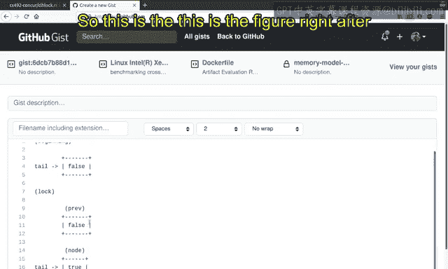

Okay， so far so good。And now。We are。Reading。

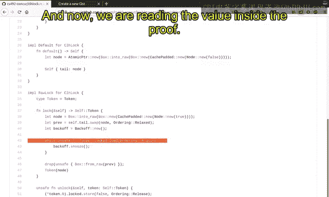

The value inside the proof。So， we are reading this。

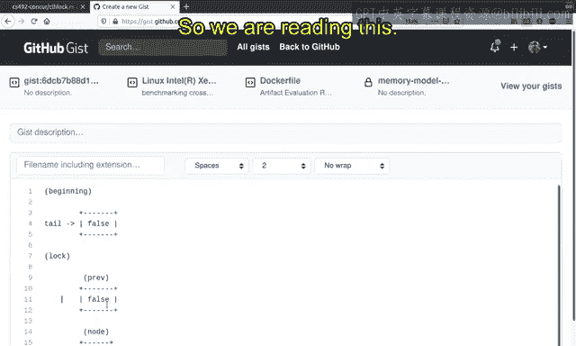

And。We are repeatedly reading this value until this becomes false， basically， if it is true。

 it is loop again。If it is false， then it is breaking out。And as a result。

 then if the control flows to this line， then it is guaranteed that， oh， this curve becomes false。

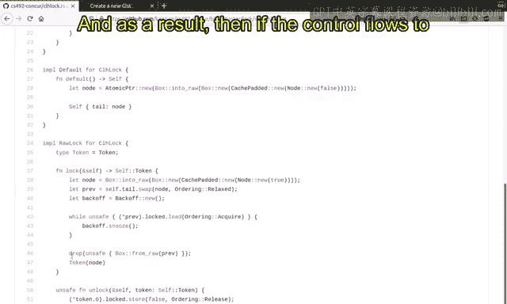

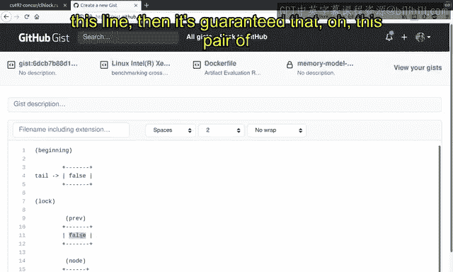

So far so good。And now the we are distracting or delocating the pre box here。 So now this is。

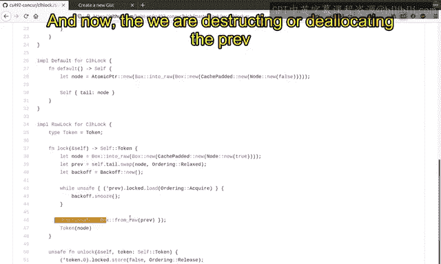

Just deal locatedated。

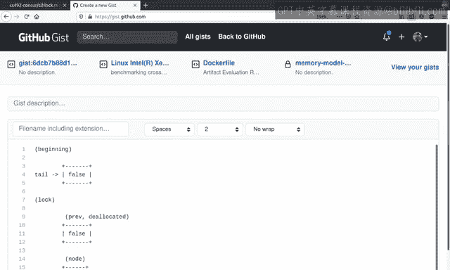

This is by this drop function。 It is restoring the box， and it is dropping the box。

 which automatically delocate the underlying。A location in the hip。Now， the token is returned。

 The token is the pointer to the new node。 So the node here is returned。

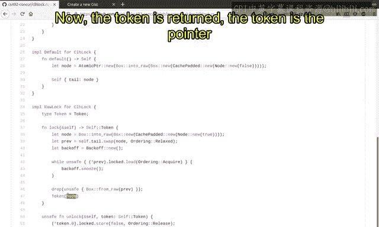

As talking。So that is basically what's going on here。

Now the first is the and this node becomes a new tail and it becomes true and this true means that the critical session is now currently holding the lock。

 is this pointer is currently locked。😊，By the critical section。That just has created this note。

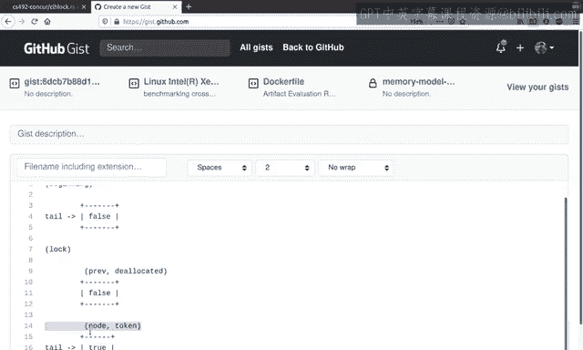

And so first good， and now let's assume that。😊，A new。A new， another， another。Another function。

 Another thread is trying to acquire the。Acquire the。You note here。 So they said that this。

 this node has the name A。And。Now， this a is。The， the pre of the。The next。L function here。

 So a was here。And， and if another thread is calling this log function again。Then。This。

A pair becomes the old tail， which is the a。So if a was in the tail right after the previous rational lock function。

Inside the next thread log function， a becomes the pref。 So this is the same node here。

And now in the code， it is waiting for the have a big PR value becomes a false， but it is true。

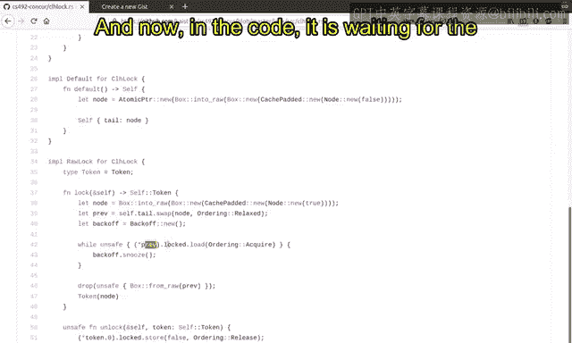

So now it is trying to wait。 is it is repeatedly checking if this becomes false and it is waiting for this becomes false。

 So I dis locked。So it is very much expected because we need to provide mutual exclusion。

If the previous law function is not。Not concluded with the matching or nu function。

 The next luck function should wait， and it is waiting on this location。

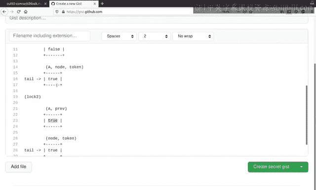

And now。If the previous La function is。

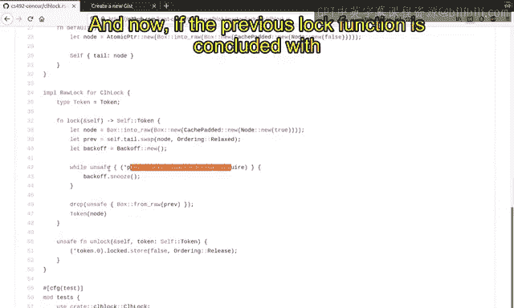

啊。Is concluded with the unlock function by the same thread， for example。

The same side will call the unlock function。With a token。And the token is the node here。

And in the online function implementation， the value is stored with a false。And in this case。

 with a really roting。

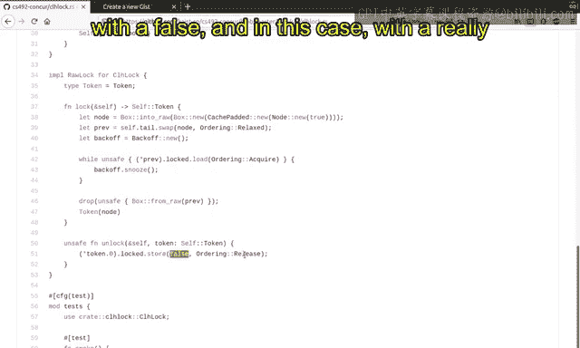

So what happens in this figure is that。And。Let's say that this is accompanied by this is log 1。

And this is， let's say that this is lock， unlock 1。If the， the log one is。

They concluded and it is calling the unlock function。Then it is touring this to false。

And it is released。Right。And。And yeah， this is basically。

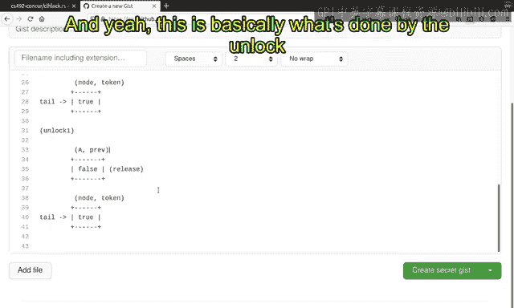

Or was done by the online function online function。 It is touring the false value to the。Tken。

 which is the note here。So。This becomes false by the unlock ones execution。And now。

The second first lock function is able to break the loop here because Eans false。

And it is acquire acquire reading the value here。So it knows that， oh。

 this becomes false then I am breaking the Louv。And now， lock 2。Is delocating the block。

As we did in the lock one function。And then return this function。And it is now like to turn。

 the threat threat to turns to execute the code and access the underlying data。

And now let's see why mutual execution is guaranteed。

 so mutual execution is guaranteed by the release acquired synchronization on this location。😊。

This becomes from true to false。And and in in that time。

 the first on nu1 function is releasing its latest view on the data。And lock 2， in turn。

 is acquiring the view and acknowledges the latest knowledge on the value。😊。

That is done by this variable here。🤢，In the new note here。Okay， that is the motivation。😊。

And that is the。Internal working of these logs。And now， if。If lock 2 function is finished。

 then it is now pointing to a new node which can be weighted for by the other lock functions as well。

Okay， and this is basically the implementation of the CH lock。And now， let's return to the。

The slide here。 and let's read this slide again。 So the implementation is is in this slide。

And the implementation has two characteristics or key ideas。😊，Again， always。

 virtual exclusion is guaranteed by release query synchronization in spin lock in tickenn and CH Do。

 the same。😊，Some location is released and acquired。By consecutive critical sections。

And the location is the single location in the spin log。

And the core variable in the tickm log and for CH log and the MC log we will learn later。

 the ordering location is a new location for each new critical section or each new waiter。And。

Critical section is created a critical section creates a new location and that location is waiteded for。

 so this is basically what's going on here。😊，So that is the key idea。And。

Ticketn and CH log provides fairness how they are separating the role of the awaiting and ordering into two locations or more than two locations。

So in。Stick and mark， the orderings are decided by the current variable and waitinging is done on the next variable。

And for current variable， the ordering is decided by the。The Veette on which is a fair instruction。

Similarly， in sealage lock， the ordering is decided on the tail pointer。And by the swap instruction。

Swabbbe is also fair instruction because it swap it just replaces the old value with the new one and regardless of whether stress is fast or slow。

 it is guaranteed that it is eventually succeeding to execute the swabbb instruction in that sense。

 it is a fair。And this fair instructions guarantees the overall fairness of the log operations。

And that is basically the key idea of guaranteeing fairness。

 ordering and waiting with different locations and and having using the fair instructions for ordering the critical sections。

😊，And here， Ten La is ordering with next 10 waiting with current locations。

And C s is ordering with tail location and waiting on a new location for each critical section。😊。

Okay， so first so good。But what is not particularly。A。Desirable for CHlogg is that in C HL。

 a new node is created by a previous critical section。

And that is still located by a new critical section。So。Each node is。

Alllocated and ded in by different stress。And that is。Undessirable for performers。

And let's see the implementation here in the implementation of C law， the box is created here。😊。

An allocation happens in the lock function。And this node is。Now。

 transfer to the next lock function by this tail operation。And in inside this tail operation are the。

Inside this log operation of the next critical section， the same mode is dropped here。😊。

So it is the evidence that this node is createdating in delocating different rate。And this。

Discrepancy is very detrimental to performance because now the allocation and the allocation is a multid job。

 and usually it will degrade the performance critically。 If allocation。

 the allocation happens in the same thread， and they are well optimized because there is no interaction of the other stress。

 But in this case， there is an interaction of multiple stress， then。Then。

 and that degrades the performance quite significantly。

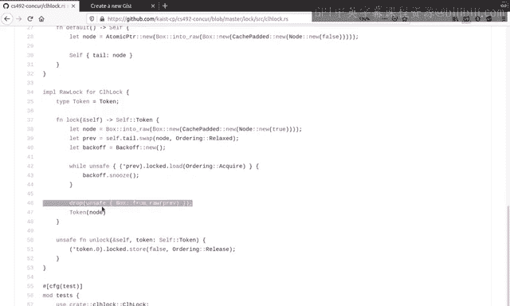

And now。In the next video， we are going to learn the MCS log which resolve this problem。

The allocationation and delocation happens in the same str in the MCS log and as a result。

 they may have a higher performance， better performance basically。Okay。

 this will be dealt with in the， in the， in the next video。 So this is。Basically， was discussing the。

In the next video， were going to study MCS and MCS parking lot locks。

 and they are trying to overcome the performance degradation of this CH log。Okay。

 so there's a homework。 This is not a formal homework you need to turn in， but。

I strongly recommend you to draw an execution in the promising semantics for each log。

 so we already studied the implementations right the implementation of the tick locks and implementations of the CH log。

And。I assume that you are not particularly well。Vd at this locks。

 you just you just saw the implementations。 So you need to understand these locks by actually drawing the figures。

In of the premise semantics and the execution is in the premise semantics of those locks。

 For example， please throw the。Figure for tick log with three locations， for example。For。哦。A the。

For the。Ticken lock， you have to draw。啊。The， the memory for serial locations。

 the current and the next and the data。 So this is from log and next is also from log。

 but data is the data。And I want you to draw the similar figure， as we did for spinak in the slices。

And furthermore， for CH log， the situation is a little more complicated。And you have data。

And you have the location of the floor。The initial note。

And the first critical sections node and the second second critical section is node and on and on and on。

😊，And I want you to draw the promise ses figure for this multiple locations for C， H log and the。EnD。

And they take him up。And you can free share your drawing in the Giubish tracker so that I can give you some feedback。

 but please try to draw the figure on your own and see if it is correct or not and ask if character or not in the Giubish tracker。

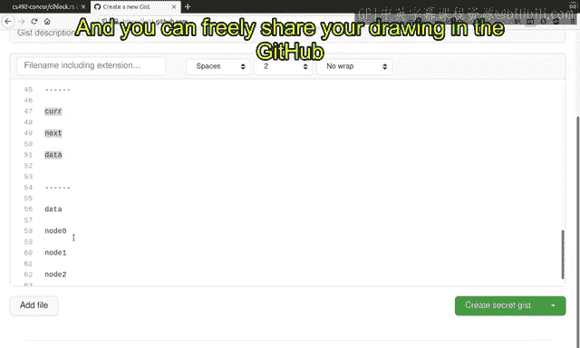

Okay， so far good。 And in this video we studied the two implementations of the locks。

 The one is second log and the other is CH log， and they have two key ideas here。

 So please please look at these two key ideas。 and it it is very important for the overall lock implementations。

 So this is the。😊。

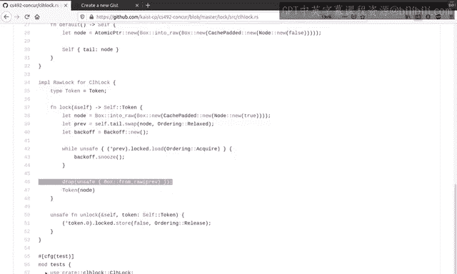

The true key I two key ideas of the lock implementations。And。

TTicking log has log is trying to overcome the previous logs on limitations。

 So spin lock is not fair。 So ticking log is。Introd to guarantee fairness by ticket queuing。 So the。

 the next variable is used to ticket queuing。Lg order is decided by a fair instruction。

But the limitations or the cons of this ticket lock is that it has a slightly complicated API because the lock function returns the ticket。

In the speed log implementation， the lock function doesn't return anything。😊。

Because it doesn't need to。But in the ticketet lock， it should return the ticketet。😊。

Because in the unlock implementation， the ticket is used to advance the current variable to the next one。

So there's trade off。 It is fair， but it has a slightly more complicated API。And for sale each long。

It is trying to improve the scalability by using per critical section。

 spinning location or rating location。 So in the spin lock implementation and tick log implementation。

😊，A the。All the threads are waiting for the single location。All， in the skin lock。

 the single location is weighted for all the stress。

 all the waiters are trying to see if the location becomes a false。And in the ticken log。

 all the threads are trying to read the single location。

 which is the current and see if the current matches with its own ticket。😊。

So a single location is read and written by multi process。😊。

And it is usually detrimental to the performance because there is actually a sharing and this actual sharing has a negative effect on the cacheache Korean protocol。

 and it will incur the cache Korean traffics and cost basically。😊，On the other hand， in the CH log。え。

Only one thread is waiting for our single location。A note is weighted by a single。A single。Yeah。

 cool。A critical section。So it is very much helpful for performance because。

No too stress or contending on the single location。And as a result。

 it is linked to this of spinning location and this per critical section spinning location is greatly improving the scalability。

😊，But the limitation is that it has a space overhead， because you need to create。

New note for each Q section。And。That may be thetrimental to the performance。

 so you have to use wisely， you have to choose wisely among multiple log implementations。

 depending on the situations。And in the next video。

 we are going to study the MCS and MCS parking locks。

 and they also improve upon the previous log implementations for specific purposes。😊。

But they are all having tradeoffs。 No single implementation is outperforming in every aspect。

 So we you have to。You have to study the characteristics of these laws。

 and we will continue to discuss the tradeoffs of multiple logs in the next video。

