# Rust并发编程：16：MCS锁与MCS Parking锁

在本节课中，我们将继续学习锁的实现。我们将研究MCS锁及其变体MCS Parking锁，了解它们如何解决之前锁（如CH锁）的性能问题，并探讨其核心思想与实现细节。

## 概述


在之前的课程中，我们学习了自旋锁、票锁和CH锁。今天，我们将学习名为MCS锁和MCS Parking锁的变体。MCS锁是CH锁的一个改进版本，它试图解决NUMA（非统一内存访问）架构下的性能问题，特别是内存分配与释放的局部性问题。MCS Parking锁则在MCS锁的基础上，让未获得锁的线程进入睡眠状态，以节省CPU时间和能耗。


## MCS锁的核心思想

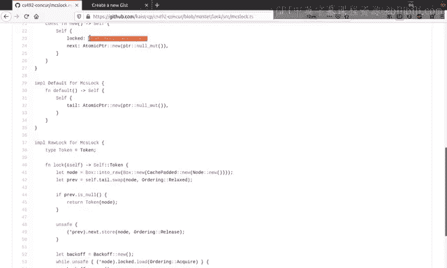

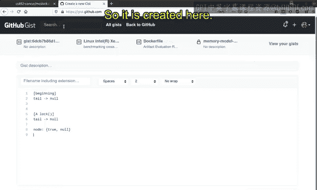

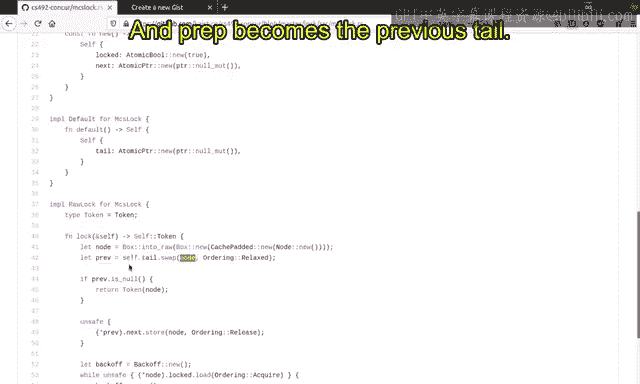

MCS锁与CH锁类似，也使用链表来管理等待锁的线程。其关键改进在于：每个线程创建并操作的节点，最终由同一个线程负责释放。这与CH锁不同，在CH锁中，一个线程分配的节点可能由下一个线程释放，这可能影响内存分配器的性能。


MCS锁的基本数据结构如下：

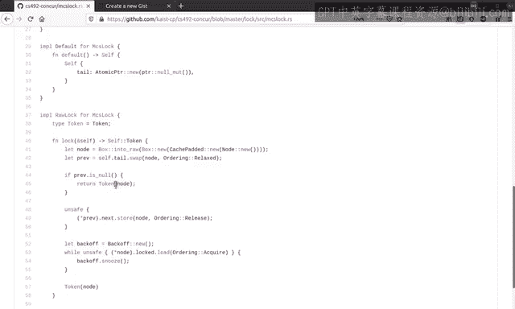

```rust
struct Node {
    locked: AtomicBool,
    next: AtomicPtr<Node>,
}

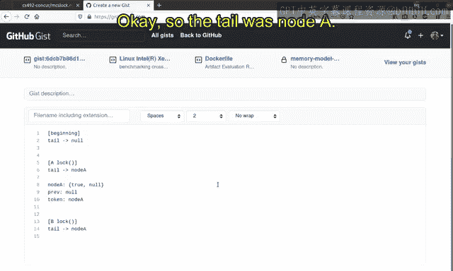

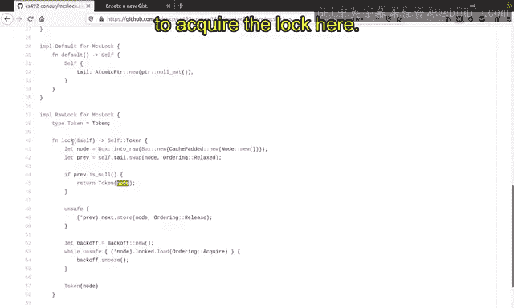

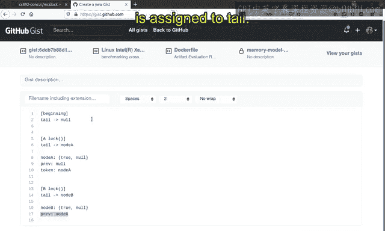

struct McsLock {
    tail: AtomicPtr<Node>,
}
```


每个尝试获取锁的线程都会创建一个新的`Node`。`locked`字段表示该线程是否可以获得锁（`false`表示可以），`next`指向链表中的下一个节点。锁本身（`McsLock`）仅维护一个指向链表尾部的指针`tail`。

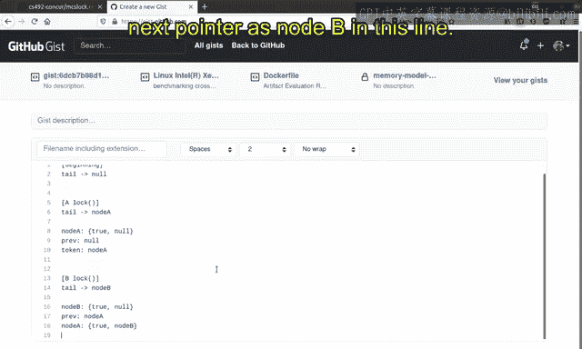

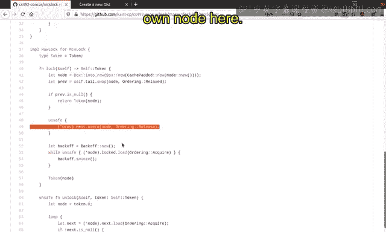

## MCS锁的获取与释放流程


以下是MCS锁工作流程的逐步分析。


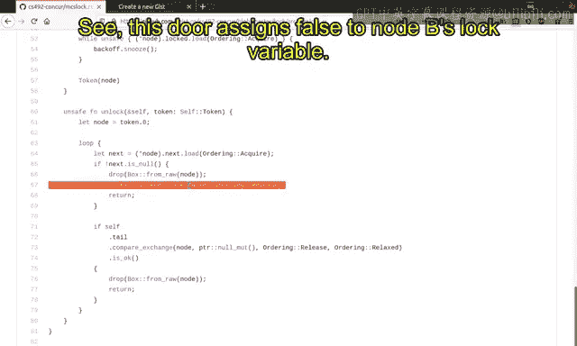

### 场景一：第一个线程（A）获取锁

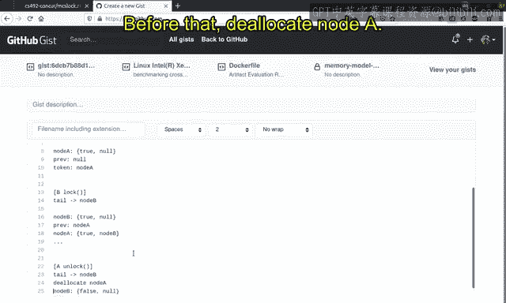


初始时，锁的`tail`指针为`null`。


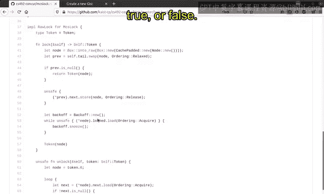

1.  线程A调用`lock`函数。
2.  它创建一个新节点`node_a`，其`locked`字段初始化为`true`（表示尚未获得锁），`next`为`null`。
3.  线程A通过原子交换操作，将锁的`tail`指针从`null`设置为指向`node_a`。交换操作返回之前的`tail`值（即`null`），赋值给变量`prev`。
4.  由于`prev`为`null`，线程A意识到自己是第一个请求锁的线程，因此它成功获取锁，函数返回。此时，`node_a.locked`仍为`true`，但这不影响持有锁的线程A。


### 场景二：第二个线程（B）在A持有锁时尝试获取

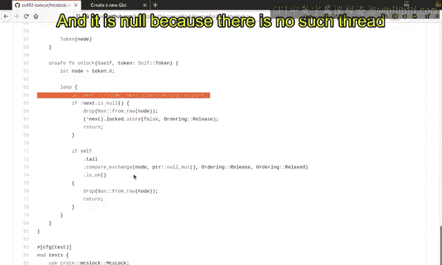

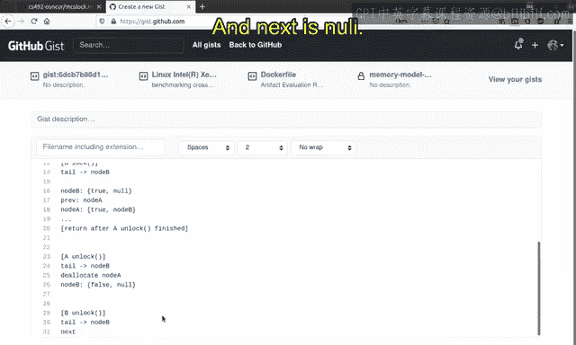

此时，`tail`指针指向`node_a`。

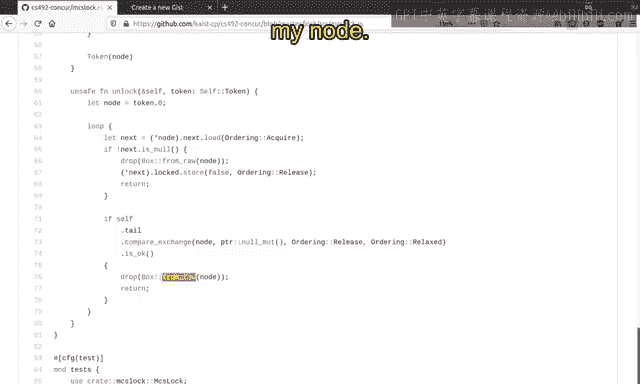

1.  线程B调用`lock`函数。
2.  它创建新节点`node_b`（`locked = true`, `next = null`）。
3.  线程B交换`tail`指针：`tail`从指向`node_a`变为指向`node_b`。`prev`变量获得之前的`tail`值，即指向`node_a`的指针。
4.  由于`prev`不为`null`，线程B知道自己需要等待。它执行 `prev.next.store(node_b, Release)`，将`node_a`的`next`指针指向`node_b`，从而将自己加入等待队列。
5.  接着，线程B在一个循环中自旋，等待自身的`node_b.locked`变为`false`：`while node_b.locked.load(Acquire) { }`。


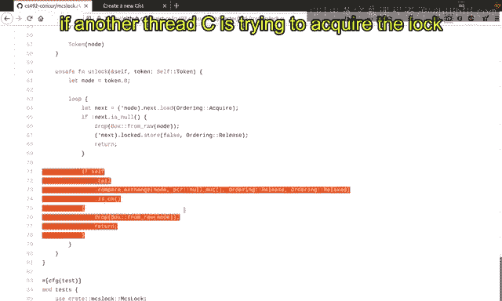

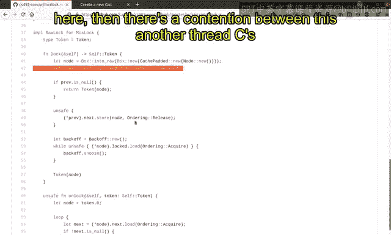

### 场景三：线程A释放锁，线程B获取锁

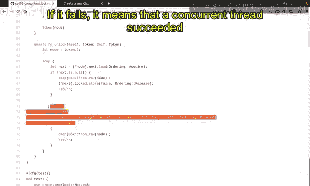

1.  线程A调用`unlock`函数，传入它自己的令牌`node_a`。
2.  它首先读取`node_a.next`。如果`next`不为`null`（即指向`node_b`），则说明有线程在等待。
3.  线程A将等待线程（`node_b`）的`locked`字段存储为`false`：`node_b.locked.store(false, Release)`。
4.  这个操作使得正在自旋的线程B的`while`循环条件变为假，线程B得以退出循环，从`lock`函数返回，从而成功获取锁。
5.  线程A随后可以安全地释放（`drop`）其节点`node_a`。

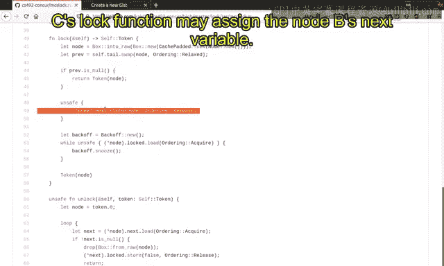

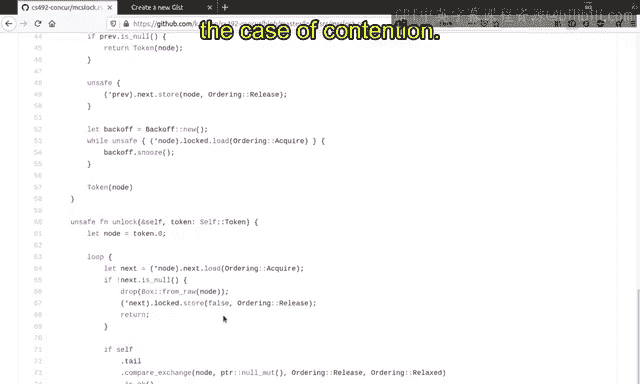

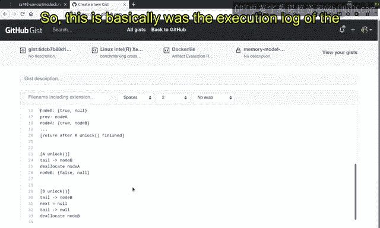

### 场景四：线程B释放锁时无等待者

1.  线程B调用`unlock`，传入`node_b`。
2.  它读取`node_b.next`，发现其为`null`。
3.  线程B尝试使用**比较并交换**操作，将`tail`指针从指向`node_b`重置为`null`。如果操作成功，说明在检查`next`之后、执行CAS之前，没有新的线程加入等待队列，锁完全空闲。
4.  线程B随后释放其节点`node_b`。

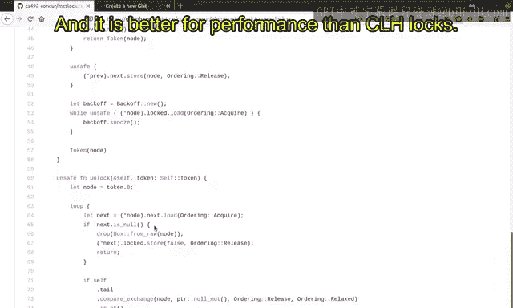

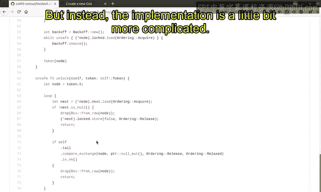

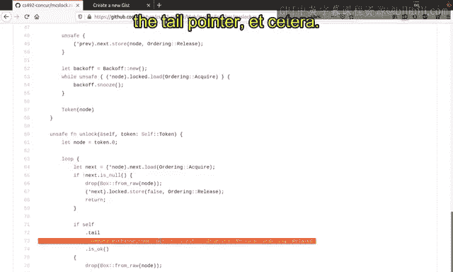

如果在步骤3的CAS操作执行时，恰好有新线程C尝试获取锁并成功将`tail`指向了自己，那么线程B的CAS操作会失败。此时，线程B会回到步骤2，重新加载`node_b.next`（此时已被线程C的`lock`操作设置为指向`node_c`），然后执行场景三中的步骤，将`node_c.locked`设为`false`以唤醒线程C。


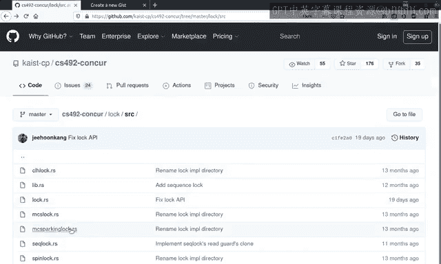

## MCS锁与CH锁的关键区别

MCS锁的主要优势在于内存管理的局部性。在CH锁中，一个线程分配的节点可能被下一个线程释放。而在MCS锁中，**分配节点和释放节点的始终是同一个线程**。这通常能带来更好的性能，因为许多内存分配器针对“分配与释放在同一线程”的场景进行了优化。

其代价是实现稍显复杂，需要仔细处理`next`指针的设置和`tail`指针的原子比较交换操作。

## MCS Parking锁

MCS Parking锁是MCS锁的一个变体，其核心思想是：当线程无法立即获得锁时，不是进行忙等待（自旋），而是让线程进入睡眠状态。

以下是MCS Parking锁与MCS锁的主要区别：

1.  **节点结构**：节点中包含一个指向当前线程的句柄（例如`std::thread::Thread`），用于后续唤醒。
    ```rust
    struct ParkingNode {
        locked: AtomicBool,
        next: AtomicPtr<ParkingNode>,
        thread: Thread, // 用于唤醒的线程句柄
    }
    ```
2.  **等待机制**：在`lock`函数中，如果线程需要等待（即`prev != null`），它不会自旋，而是调用`park()`方法使当前线程进入睡眠状态。
    ```rust
    while self.locked.load(Acquire) {
        park(); // 线程在此睡眠
    }
    ```
3.  **唤醒机制**：在前驱线程的`unlock`函数中，当它确定有后继等待者时，除了将后继节点的`locked`设为`false`，还必须调用`unpark()`方法来唤醒正在睡眠的后继线程。
    ```rust
    next.locked.store(false, Release);
    next.thread.unpark(); // 唤醒等待的线程
    ```

**一个重要的顺序问题**：唤醒（`unpark`）操作**必须**在存储`locked = false`**之后**进行。如果顺序颠倒，可能会发生以下情况：
1.  先执行`unpark()`，唤醒线程B。
2.  线程B被调度运行，检查自己的`locked`字段，发现仍为`true`（因为`store`操作还未执行），于是再次调用`park()`进入睡眠。
3.  此时，`store(false)`才被执行，但线程B已经再次睡眠，可能无人唤醒，导致死锁。

因此，正确的顺序保证了被唤醒的线程一定能看到`locked`为`false`的状态。

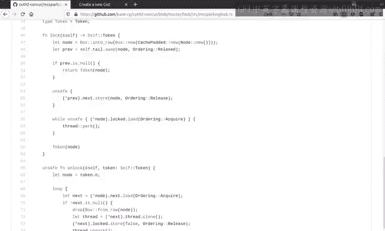

## 内存顺序详解

在MCS锁的实现中，内存顺序保证了同步的正确性。主要涉及以下同步关系：

1.  **锁获取的同步**：`lock`函数末尾的`Acquire`加载（或等待循环中的`Acquire`）与`unlock`函数中`store(false, Release)`的释放操作同步。这保证了持有锁的线程在临界区内的所有写操作，对下一个成功获取锁的线程是可见的。
2.  **节点传递的同步**：当一个线程在`lock`中设置`prev.next = my_node`（使用`Release`顺序）时，这个操作与后继线程在`unlock`中加载`self.next`（使用`Acquire`顺序）同步。这确保了节点指针的安全传递。
3.  **尾指针的顺序**：对`tail`指针的交换操作通常使用`Relaxed`顺序，因为它不直接承载线程间的数据同步语义，仅用于确定线程获取锁的顺序。真正的同步发生在每个节点的`locked`字段上。

## 各类锁的权衡总结

以下是本课程涉及的几种锁的权衡对比：

*   **核心思想**：
    *   **互斥**：通过释放-获取语义保证。
    *   **公平性**：通过排序和在不同地址上等待来保证（票锁、CH锁、MCS锁）。
*   **自旋锁**：简单，但在高争用下性能差，不公平。
*   **票锁**：通过排队保证公平性，API稍复杂（需要返回票号），所有线程仍在同一地址上自旋。
*   **CH锁**：通过链表实现每个临界区一个自旋地址，提高了可扩展性（减少缓存争用），但需要为每个临界区分配节点（空间开销），且节点可能被其他线程释放。
*   **MCS锁**：改进了CH锁，确保节点在同一线程分配和释放，性能更优，但实现更复杂，且多了一次CAS操作。
*   **MCS Parking锁**：在MCS锁基础上，让等待线程睡眠，节省CPU和能耗。但线程的停放与唤醒本身有开销，在争用程度不高时可能降低性能。

选择哪种锁取决于具体的应用场景（争用程度、性能要求、能耗考虑等），通常需要进行基准测试。

## 总结

本节课我们一起学习了MCS锁和MCS Parking锁。MCS锁通过确保节点的分配与释放位于同一线程，优化了CH锁在NUMA系统上的性能。MCS Parking锁则在此基础上引入了线程睡眠机制，以降低能耗。我们详细分析了它们的算法流程、关键代码逻辑以及内存顺序如何保证正确性。最后，我们回顾并比较了目前已学的各种锁的优缺点，为在实际并发编程中选择合适的同步原语提供了依据。


在接下来的课程中，我们将开始学习并发数据结构，这是构建高效并发程序的核心内容。