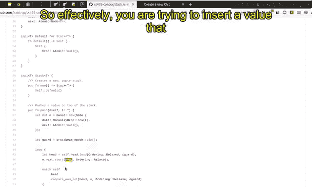
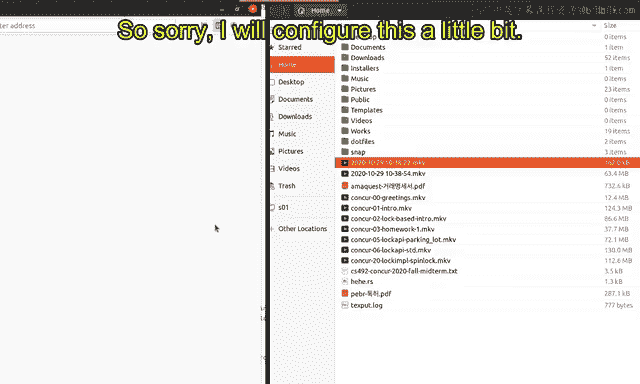
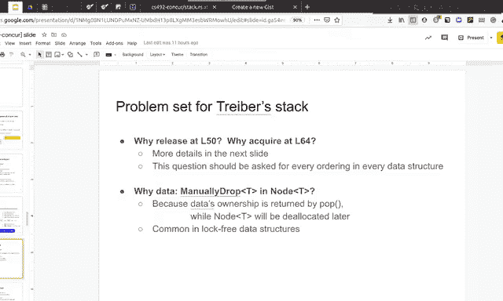
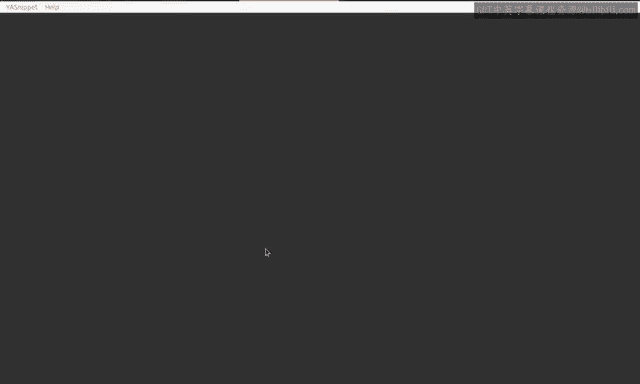
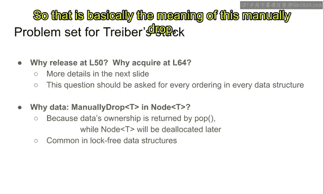

# Rust并发编程：P18：无锁数据结构与Treiber栈

## 概述

在本节课中，我们将开始学习无锁数据结构。我们将了解无锁数据结构的核心概念、它们如何避免传统锁带来的问题（如死锁和活锁），并通过一个经典示例——Treiber栈——来具体理解其实现原理。我们将重点关注如何通过单指令提交点来保证并发操作的进展。

---

## 从锁到无锁

在之前的课程中，我们学习了并发数据结构如何比受锁保护的顺序数据结构提供更好的可扩展性，并以锁跳表为例进行了分析。

从现在起，我们将专注于所谓的**无锁数据结构**。

“无锁”的字面意思是**没有锁**，即数据结构不受锁保护。但它还有更深层次的技术含义，我们稍后会定义。本节课将介绍无锁数据结构的概念和一些代表性示例。

在本学期（2024年）的作业中，作业5将要求实现一个名为“分离有序链表”的无锁数据结构，它本质上是一个哈希表。作业6将实现用于无锁数据结构的垃圾收集器。因此，你将能够亲手实现最重要的无锁数据结构之一——哈希表。

---

## 锁带来的问题

让我们思考一下锁。锁只允许一个线程访问共享数据，结果导致其他线程可能暂停或停滞。

如果一个线程持有锁并执行昂贵的计算、I/O操作，甚至崩溃而永不返回，那么其他线程就无法获取该锁，也就无法继续执行自己的操作。

因此，可能会发生**死锁**。死锁是指线程持有使进展变得不可能的资源。例如：
*   线程A持有锁L1，并试图获取锁L2。
*   线程B持有锁L2，并试图获取锁L1。

在这种情况下，A和B都无法继续执行，因为A无法获取L2（L2被B持有），B也无法获取L1（L1被A持有）。结果就是死锁，它们完全无法进展。

在并发编程中，死锁很常见。一种应对措施是，即使发生死锁，我们也可以检测到它并终止其中一个操作。例如，B持有L2导致了死锁，我们可以选择B作为牺牲品，直接丢弃其操作。这样L2就被释放，A就能获取L2并继续执行。从整个系统来看，这保证了某种进展（至少A能进展）。

但这并非完美的解决方案，因为可能存在**活锁**的情况。活锁与死锁形成对比：线程确实在执行操作，但系统不断终止操作，导致没有线程能取得有意义的进展。

假设有三个线程A、B、C，它们以特定顺序竞争锁L1、L2、L3。死锁检测器可能不断选择并终止某个线程来打破僵局，但随后又可能立即陷入新的类似僵局，导致线程被循环终止。从整个执行过程来看，没有线程取得实际进展，因为它们不断被死锁检测器终止。

这类问题是**无锁**技术要对抗的敌人。无锁的基本目标是彻底避免此类情况，确保至少有一个操作能够取得进展。

因此，无锁作为一个技术术语，不仅意味着没有锁，还意味着**进展保证**——至少有一个操作应该能进展。如果你使用锁，那么它几乎总不是无锁的。有趣的是，即使你不使用锁，也可能无法保证无锁。为了提供这种进展保证，我们需要比简单地不用锁付出更多关注。

---

## 核心思想：单指令提交点

实现无锁的关键思想是，确保操作在一个称为**提交点**的单点上取得进展。

假设我们要设计一个栈，并实现其`push`和`pop`操作。我们的目标是确保**单条架构指令**负责将更改提交到数据结构。通过这样做，我们可以利用架构本身提供的进展保证。

硬件架构保证，如果有多个CPU核心和多个线程，那么至少有一个线程或核心能够执行下一条指令。此外，如果下一条指令是像`compare-and-swap`这样的“读-改-写”指令，架构保证至少有一个核心的该指令会成功。

通过利用架构的保证，我们可以设计出无锁软件。使用单条RMW指令作为提交点，我们可以看到，即使多个线程同时访问这个栈（一些在`push`，一些在`pop`），至少有一个操作会成功，因为它们的RMW指令中会有一个成功。

这基本上就是几乎所有无锁数据结构的高级核心思想。提交点通常必须是**读-改-写**操作，因为单纯的“读”不改变内存状态，不能作为提交点；而单纯的“写”也几乎不可能作为提交点，因为写入的值可能被任意覆盖，写指令本身不提供足够的保证。

实际上，RMW指令在历史上就是为了支持这种单指令同步点而被引入到大型机中的。

这个单指令提交点的想法确实能击败无锁的敌人：
*   **线程暂停**：单条指令要么完全执行，要么完全不执行，不会被中断或干扰。
*   **死锁与活锁**：粗略地说，因为没有锁，所以我们没有死锁和活锁问题。

如果我们设计好这个单指令提交点，就可以保证不会出现死锁或活锁问题，因为至少有一个操作会成功。

作为额外的益处或副作用，我们还实现了**可扩展性**。因为与锁不同，多个线程之间的争用只发生在单条指令上。在使用锁保护的并发数据结构中，锁内会执行多条指令，在此期间其他线程无法进行。而在使用单指令提交点的无锁数据结构中，我们有效地将争用减少到仅一条指令，因为其他指令只是在为提交做准备或进行提交后的清理，它们根本不发生争用。这就是为什么通过这种思想可以实现更好的可扩展性。

---

## 示例：Treiber栈

现在，让我们看看如何在一个具体示例——**Treiber栈**——中实现上述思想。Treiber栈是最古老的并发无锁数据结构之一。

Treiber栈本质上是一个**单向链表**，其中头指针`head`指向栈顶。下图展示了这种栈的结构：

```
head -> [42] -> [37] -> [666] -> null
```

当你`push`一个值时，你会在链表头部插入一个新节点。当你`pop`一个值时，你会移除链表头部的节点。这样就实现了后进先出的栈行为。

### `pop`操作流程

假设线程A试图从栈顶`pop`一个值：
1.  **读取头指针**：读取当前的`head`指针（指向包含42的节点）。
2.  **读取`next`指针**：读取头节点（42）的`next`指针（指向包含37的节点）。因为我们要移除42节点，新的`head`应该指向37。
3.  **执行`compare-and-swap`**：尝试原子地将`head`指针从指向42改为指向37。
4.  **处理结果**：
    *   如果`CAS`成功，`head`现在指向37，42节点被移出栈。可以安全地返回42。
    *   如果`CAS`失败，意味着`head`指针已被其他线程改变。需要回到步骤1重试。

### `push`操作流程

假设线程B试图向栈中`push`一个新值（例如99）：
1.  **读取头指针**：读取当前的`head`指针（指向37）。
2.  **创建新节点**：创建一个新节点，其`value`为99，`next`指针指向读取到的`head`（37）。
3.  **执行`compare-and-swap`**：尝试原子地将`head`指针从指向37改为指向新节点（99）。
4.  **处理结果**：
    *   如果`CAS`成功，新节点（99）被插入到链表头部，栈变为 `head -> [99] -> [37] -> [666] -> null`。
    *   如果`CAS`失败，意味着`head`指针已被其他线程改变。需要释放或重用新节点，并回到步骤1重试。

这里的`compare-and-swap`操作就是我们之前讨论的**单指令提交点**。如果这个`CAS`成功，整个操作就成功；否则，操作失败。这条指令决定了操作的成功与否。

---

## 代码解析

现在让我们查看课程仓库中Treiber栈的实现代码。它使用`crossbeam`库提供的原子类型和内存管理工具。




以下是核心结构定义：




```rust
pub struct Stack<T> {
    head: Atomic<Node<T>>, // 原子化的头指针
}

struct Node<T> {
    data: ManuallyDrop<T>, // 手动管理drop的数据
    next: Atomic<Node<T>>, // 原子化的下一个节点指针
}
```

*   `Atomic<Node<T>>` 是一个可以安全进行原子操作（如`compare_and_swap`）的指针。
*   `ManuallyDrop<T>` 包装数据，防止Rust自动调用析构函数，这对于无锁数据结构中的延迟回收至关重要。

### `push` 方法

```rust
pub fn push(&self, t: T) {
    // 1. 为本次操作创建一个“防护”（guard），与垃圾回收相关，目前可忽略其细节。
    let guard = pin();
    // 2. 创建新节点，其next指针暂为空。
    let mut n = Owned::new(Node {
        data: ManuallyDrop::new(t),
        next: Atomic::null(),
    });
    // 3. 循环尝试，直到push成功。
    loop {
        // 4. 读取当前头指针（Acquire顺序，用于同步）。
        let head = self.head.load(Acquire, &guard);
        // 5. 将新节点的next指针设置为读取到的head。
        n.next.store(head, Relaxed);
        // 6. 尝试提交：原子地将head从旧值换成新节点（Release顺序）。
        match self.head.compare_and_set(head, n, Release, &guard) {
            Ok(_) => {
                // 7. CAS成功，push操作完成。
                return;
            }
            Err(e) => {
                // 8. CAS失败，head已变。恢复n（旧节点）用于下次尝试。
                n = e.new;
            }
        }
    }
}
```

### `pop` 方法

```rust
pub fn pop(&self) -> Option<T> {
    // 1. 创建防护。
    let guard = pin();
    // 2. 循环尝试，直到pop成功或栈为空。
    loop {
        // 3. 读取当前头指针（Acquire顺序）。
        let head = self.head.load(Acquire, &guard);
        // 4. 将裸指针转换为引用，以便访问节点内容。
        let h = unsafe { head.as_ref() }?; // 如果head为null，栈空，返回None。
        // 5. 读取头节点的下一个节点指针。
        let next = h.next.load(Relaxed, &guard);
        // 6. 尝试提交：原子地将head从当前头节点换成下一个节点（Release顺序）。
        match self.head.compare_and_set(head, next, Release, &guard) {
            Ok(_) => {
                // 7. CAS成功，头节点已移除。
                // 8. 安全地读取并返回头节点的数据。
                //    使用ManuallyDrop::take来取得所有权，防止后续自动drop。
                let data = ManuallyDrop::into_inner(unsafe { ptr::read(&h.data) });
                // 9. 标记原头节点可被安全回收（延迟销毁）。
                unsafe { guard.defer_destroy(head); }
                // 10. 返回数据。
                return Some(data);
            }
            Err(_) => {
                // 11. CAS失败，head已变，重试。
                continue;
            }
        }
    }
}
```

---

## 关键细节与同步





### 内存顺序：Release与Acquire

在代码中，`push`操作的`compare_and_set`使用`Release`顺序，而`pop`操作中加载`head`使用`Acquire`顺序。这是为了实现线程间的**同步**，类似于消息传递。

考虑以下场景：
1.  线程A写入一个值 `x = 42`。
2.  线程A `push` 一个信号到栈中。
3.  线程B `pop` 到这个信号。

我们希望确保线程B在`pop`之后，能看到 `x == 42`。为了实现这种“先写后读”的可见性保证，需要在`push`（写入/发布）和`pop`（读取/获取）之间建立同步关系。

*   `Release`顺序：保证该操作**之前**的所有写操作（如`x = 42`）的结果，对于其他线程中**后续**以`Acquire`顺序读取同一位置的线程是可见的。
*   `Acquire`顺序：保证该操作**之后**的所有读/写操作，都能看到其他线程中**之前**以`Release`顺序写入同一位置的所有写操作的结果。

因此，`push`中的`Release`和`pop`中的`Acquire`配对，确保了数据（如`x = 42`）能正确地从生产者线程传递到消费者线程。

### `ManuallyDrop`的作用

`ManuallyDrop`用于包装节点中的数据。它的作用是防止Rust编译器自动插入对数据的`drop`调用。

在`pop`操作中，我们将节点的数据返回给了调用者。这个数据的所有权已经转移。然而，节点本身（包含`next`指针的壳）可能还需要在内存中保留一段时间（因为其他线程可能仍在访问它），直到垃圾收集器安全地回收它。

如果我们不使用`ManuallyDrop`，当节点最终被回收时，Rust会尝试再次`drop`其中的数据，这会导致双重释放或逻辑错误。使用`ManuallyDrop`后，我们明确表示：“这个数据的生命周期由我手动管理，你不要自动`drop`它。” 在`pop`中，我们使用`ManuallyDrop::into_inner`手动取得了数据的所有权并返回。

### 延迟销毁 (`defer_destroy`)

`guard.defer_destroy(head)` 并不会立即释放`head`节点占用的内存。它只是通知垃圾收集器（`crossbeam`的`epoch`机制）这个节点已经不再被数据结构引用，可以安排在未来某个安全的时刻（当没有线程可能再访问它时）进行回收。这是实现安全无锁内存管理的关键。



---

## 总结

本节课我们一起学习了无锁数据结构的基础。我们首先探讨了锁带来的死锁和活锁问题，引出了无锁设计对**进展保证**的需求。其核心思想是利用硬件的原子操作（如`compare-and-swap`）作为**单指令提交点**，来保证至少有一个并发操作能够成功。

我们深入分析了**Treiber栈**这一经典无锁数据结构的实现，包括其`push`和`pop`操作的算法流程、使用`crossbeam`库的代码实现、以及关键的同步细节（`Release`/`Acquire`内存顺序）和内存管理机制（`ManuallyDrop`与延迟销毁）。

Treiber栈是最基本且有趣的无锁数据结构之一。在接下来的课程中，我们将学习更复杂的无锁数据结构，如队列。而在本学期的作业中，你们将有机会亲手实现一个更复杂的无锁数据结构——分离有序链表，它将作为一个高性能的并发哈希表。