# Rust并发编程：P19：Michael-Scott无锁队列 🧠

在本节课中，我们将要学习Michael和Scott提出的无锁队列。这是第一个无锁队列实现，由Michael和Michael Scott两位作者提出。巧合的是，两位作者的姓氏分别是Michael和Scott，而名字都是Michael。这个队列与Treiber栈类似，都是一个单向链表。它由一个头指针指向。队列从头部弹出元素，并向尾部推入元素。这与栈不同，在Treiber栈中，你从同一个头指针进行推入和弹出操作，而在这个队列数据结构中，你从头部弹出，向尾部推入。作为一个优化，队列维护了一个尾指针。尾指针是一个物理位置，试图指向队列的尾部。这样做的原因是，当你向队列推入一个元素时，你不想遍历整个队列。相反，你可以加载尾指针，它被假定指向链表的靠后部分，然后从尾指针开始尝试减少遍历次数。但尾指针不一定指向实际的尾部节点，因此需要谨慎处理。尾指针在队列中，但它不需要是实际的尾部，它仍然指向某个节点。你可以在此处的代码中看到实现。在本视频中，我将简要解释这个队列的一些实现细节。

与Treiber栈类似，我们使用CAS操作来同步队列中的操作。对于弹出操作，你将对头指针执行比较并交换操作，这与我们在Treiber栈中的做法相同。另一方面，对于推入操作，你将从尾指针开始遍历以找到尾部节点，然后执行CAS操作。因此，最后一个节点的`next`指针指向这个新节点。你正在执行从该节点指针到新节点的CAS。

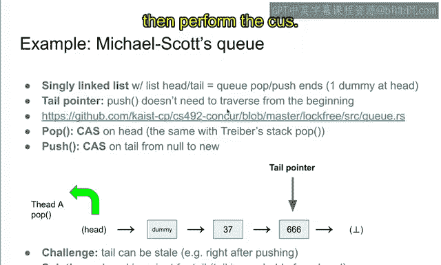

## 可视化操作流程 📊

让我用动画来可视化这个想法。为了执行弹出操作，你首先遍历头指针，实际上你需要遍历两次，然后执行一个CAS操作。这基本上就是使用循环来实现Michael-Scott队列弹出操作的过程。需要注意的一点是，你将不是从这个节点，而是从下一个节点获取值。原因是这个节点是虚拟节点。它是一个哑元，不包含任何有用信息。它只是占位，而实际的头节点值是37。因此，当你在此阶段执行弹出函数时，我们将检索值37并返回它。

另一方面，为了执行推入操作，你首先检索尾指针，并通过遍历`next`指针来找到实际的尾部节点。你可以通过检查某个节点的`next`指针是否为`null`来判断它是否是尾部节点。然后你创建一个新节点并执行比较并交换操作。在执行从该节点指针到新节点指针的比较并交换之前，你创建节点并将其`next`指针设置为`null`，然后比较并交换该节点的`next`指针，从`null`指针交换为新节点。这有效地在链表（即队列）的末尾插入了一个新节点，从而实现了先进先出。

## 核心设计与挑战 ⚙️

这基本上是主要的设计选择，但还有一些实现细节需要考虑。这里的主要设计选择是尾指针。我们指定了这个尾指针。但你可以看到，在推入一个新节点后，尾指针就变得过时了，因为尾指针实际上指向的是旧的尾部，而不是实际的尾部。因此，我们需要在队列末尾推入一个值后，通过将尾指针从旧节点更改为新节点来修复尾指针。这里的挑战是尾指针可能已经过时。我们对此挑战的解决方案是放宽了对尾指针的不变式要求。因此，尾指针实际上不需要是实际的尾部，正如你在推入一个值后所看到的，它不再是实际的尾部。但我们希望建立一个不变式：尾节点指针可以从头指针到达。这在执行开始时是正确的，头在这里，现在头变成了这里。这里的尾指针可以从虚拟节点或37节点到达。为了维持这个不变式，我们需要处理头指针和尾指针之间的关系，但我们仍然可以轻松地建立这个不变式：尾指针可以从头指针到达。

让我在下一张幻灯片中详细解释如何建立这个不变式。

## 算法概述 📝

这是Michael-Scott队列在一张幻灯片中的算法。让我先解释一下，然后我们去看代码，看看那里发生了什么。

在推入操作中，你首先找到实际的尾部。回想一下并发线程，例如线程C。假设C也试图推入一个值。但尾指针是666，实际上可能的情况是，实际的尾部是由另一个线程新插入的。因此，尾指针是过时的，它包含一个旧值。如果是这种情况，我们将通过从这个尾指针开始遍历来找到实际的尾部。这是第一个节点，我们读取它的`next`指针，由于`next`指针不是`null`，这个节点不是尾部。因此，我们继续遍历，在这里我们将读取`next`指针，这是节点指针。这就是为什么这个节点是链表的实际尾部。通过这种方式，我们将找到实际的尾部。同时，我们也尝试更新尾指针。现在我们假设我们在这里检索到了实际的尾部，并尝试通过执行尾指针上的比较并交换操作，将尾指针从原始尾部更新为新的实际尾部。如果成功，我们就在帮助其他线程，因为我们正在将尾指针更新为最新值。这将帮助其他线程更有效地遍历到实际的尾部。但它可能会失败，因为可能另一个线程已经将尾指针更新为其他值。如果是这种情况，我可能会失败，但这没关系。这意味着尾指针已被其他线程更新。这和我更新了尾指针一样好。我保证我或其他人更新了尾指针。这可能是实现同步所需的一切。因此，更新尾指针成功与否并不重要，重要的是尾指针被某人更新了。通过这种方式，我们通过执行尾指针上的比较并交换操作来更新尾指针，从原始尾指针值更新为新节点。

作为第二步，我们尝试通过执行尾指针的`next`指针上的比较并交换操作来追加一个新节点。如果我们成功，那么我们就有效地成功插入了一个新节点，操作成功。如果CAS不成功，那么我们需要重试。通过检索新的尾部，CAS失败的原因是某个其他线程已经在尾部执行了CAS。因此，我们需要遍历刚刚被并发线程更新的新尾部，然后在那里追加节点。所以如果失败，你应该从头开始重试，如果成功，那么整个操作就成功了。之后，如果通过CAS追加新节点成功，那么你就为其他线程更新尾指针。

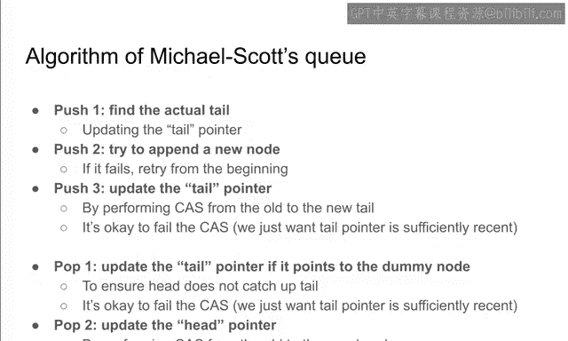

在这张幻灯片中，线程B成功地将一个新节点推入到这里。但尾指针变得过时了。因此，线程B通过将尾指针从666更新到这里的新节点来帮助其他线程。这有助于尾指针不那么过时，这是一种优化方式，让其他线程能更有效地遍历到实际的尾部节点。正如我所说，在这一步中，我们同样执行从旧尾节点到新尾节点的CAS。在这里CAS失败也是可以的，因为这意味着其他线程中的某个线程成功地更新了尾指针。因此，这里重要的是尾指针被某人更新了。所以，我是否成功执行CAS并不重要。

## 弹出操作流程 🔄

另一方面，弹出操作是这样进行的。它首先读取尾指针，并检查尾指针是否指向虚拟节点。在这里，如果尾指针指向这个虚拟节点，这意味着在更新头指针后，头指针跑到了尾指针的前面。头指针和尾指针的顺序颠倒了。这对队列来说是不好的。如果尾指针指向虚拟指针，为了防止头指针超过尾指针，我们尝试将尾指针从这个虚拟节点更新到下一个节点37。因此，如果这里的CAS成功，那很好；如果CAS不成功，那也没关系，因为这意味着尾指针不再指向虚拟节点。因此，通过执行CAS（如果尾指针指向虚拟节点），我们确保尾指针不再指向虚拟节点。之后，我们通过执行从第一个节点到第二个节点的CAS来更新头指针。如果它失败，那么你可以从头开始重试；如果你成功，那么意味着弹出操作成功完成。正如我所说，如果尾指针指向虚拟节点，则更新尾指针。通过这样做，我们可以建立这里的不变式：尾指针必须可以从头指针到达。在将尾指针从虚拟节点更新到37之后，即使在我们弹出一个值、从队列中移除虚拟节点之后，我们也可以建立尾指针可以从头指针到达的不变式。因此，建立“尾指针可以从头指针到达”这个不变式很重要。你可以看到，在弹出这个虚拟节点后，这个37节点成为新的虚拟节点，因为它是第一个节点。在Michael-Scott队列中，第一个节点始终是虚拟节点，它可能包含值，但这没有意义。它只是虚拟节点。

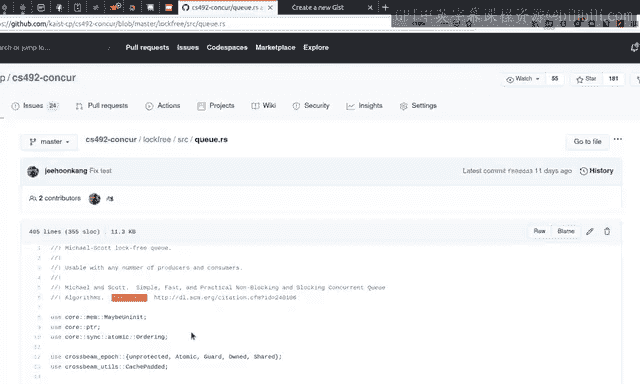

这就是一张幻灯片中的算法，现在我想去看看实现，并逐行阅读。这个算法大约在25年前发表，所以它是Michael和Scott提出的相当古老的算法，但当需要无锁队列时，它仍然被广泛使用。

## 代码结构解析 💻

首先，我们再次有`CrossbeamEpochPin`和`CrossbeamEpochMutT`，它们是缓存填充的。让我逐行解释其余代码中发生了什么。

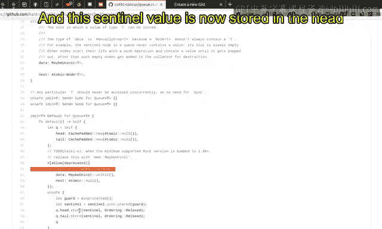

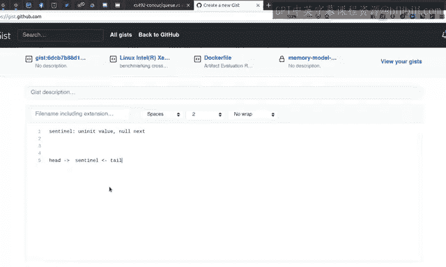

队列基本上指向两个节点。所以有两个指针，`head`和`tail`，它们指向一个节点。一个节点通常由数据和下一个节点指针组成。我们将其标记为`MaybeUninit`，这意味着数据可能未初始化，这特别有用，因为我们有一个虚拟节点。在队列开始时，虚拟节点的值是未初始化的，所以我们希望在类型中明确标记节点中的数据可以是未初始化的，例如由于虚拟节点。它还包含`next`指针。所以和往常一样。节点应该有一个指向下一个节点的`next`指针。队列指向两个节点，一个是头，另一个是尾。

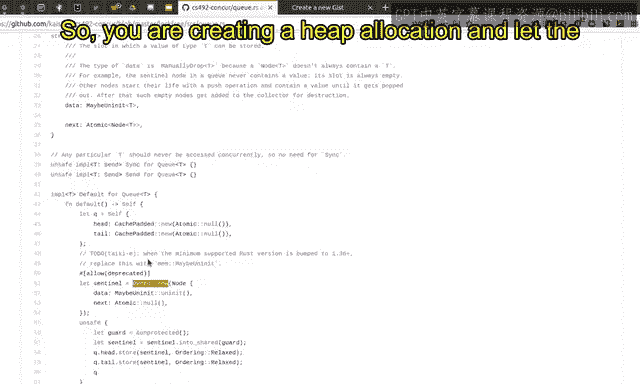

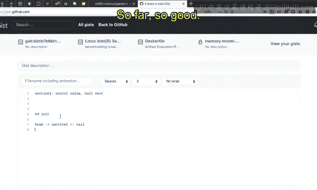

在队列开始时，它将在这里分配队列。所以你将创建一个队列，并且这将是被返回的队列。但我们不返回这个节点指针。在队列生命周期开始时，我们需要插入一个虚拟节点。在任何时候，队列都有一个虚拟节点。这就是为什么我们要放置虚拟节点。它是一个虚拟节点，我们创建一个哨兵节点。这里的哨兵意味着我们正在创建初始的虚拟节点。它不包含数据。我们正在将`next`指针设置为`null`指针。所以它是具有`null`指针的未初始化数据，这就是初始的虚拟节点。这个哨兵值现在存储在头指针和尾指针中。

让我们看看那里发生了什么。哨兵有未初始化的值，没有`next`指针。在队列生命周期结束时，头指针指向哨兵节点。同时，尾指针也指向哨兵节点。这个哨兵是在堆上分配的。所以你可以看到你正在创建一个`Owned`，在`crossbeam`术语中，这意味着在堆上分配数据。你正在创建一个堆分配，并让头指针和尾指针指向堆中的哨兵节点。

这就是初始的内存布局。到目前为止一切顺利。

现在我们返回这个队列。在设置了头指针和尾指针之后，现在让我们看看如何向队列推入一个值。

你被给予一个对守卫的引用，这意味着守卫证明你可以访问共享内存中的数据结构。它基本上是一个证明，表明你可以访问共享内存中的数据。你首先要做的是创建一个新节点。回想一下，你需要创建一个带有新数据和`null`指针的新节点。你在堆上创建它，这样你就可以将这个新指针、新节点附加到队列的尾部。

首先，你在这里创建一个新节点。这个`into_shared`意味着这个新节点有两种类型：`Owned`和`Shared`。`Owned`意味着没有其他线程可以访问这个节点，而`Shared`意味着其他线程可以访问这个节点。通过调用`into_shared`，我们有效地释放了对这个节点的部分所有权。到目前为止，我们拥有这个新节点，但从现在开始，我们释放了独占所有权，并承认这个新节点可以在多个线程之间共享。

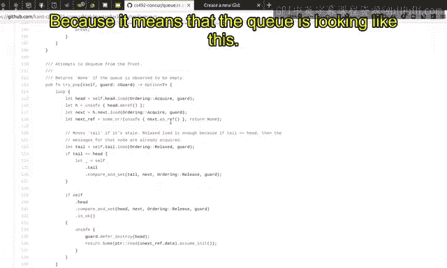

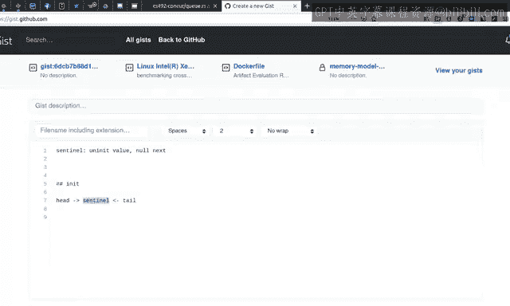

我们使用循环，因为如果我们没有成功将新值插入到队列末尾，我们应该用同一个节点重试。我们首先加载尾指针。正如我所说，尾指针是乐观的，所以它实际上不需要指向真正的尾部，但它实际上指向队列中的某个节点。我们加载尾指针，解引用它，并读取尾节点的`next`指针。如果尾节点的`next`指针不是`null`，那么尾节点实际上不是真正的尾部。因此，我们将尾指针移动到下一个节点。我们执行尾指针上的比较并交换操作，将尾指针从旧的尾节点交换为尾节点的`next`指针。这就是这里所做的第一步。正如我所说，它不需要成功。如果成功，那很好，我移动了尾指针；如果不成功，我未能移动尾指针，但通过失败，我知道其他某个线程成功地将尾指针移动到了某个下一个节点。所以尾指针现在被更新了。因此，你想从这里重新开始尝试。

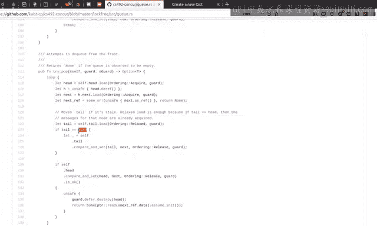

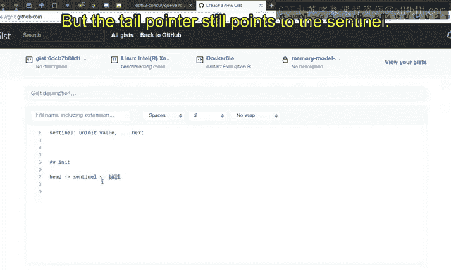

否则，如果`next`指针实际上是`null`指针，那么尾节点实际上是真正的尾部。现在，我们尝试通过执行比较并交换操作来追加一个新节点。这就是这里的比较并交换操作。我们在尾节点的`next`指针上执行比较并交换操作，有效地将尾节点的`next`指针从`null`指针交换为新节点。如果成功，那就太好了，我们以与上述相同的方式帮助移动尾指针，然后返回。否则，如果不成功，那么我们知道我们没有成功推入一个新值，操作失败。所以我们再次从头开始重试。

这基本上就是推入函数的实现。

让我们去看看`try_pop`函数的实现。

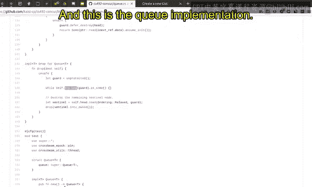

我们读取头指针，然后它有一个`next`指针。再次使用循环。如果这个`next`指针是一个`null`指针，那么`as_ref`返回`None`。如果`next`不是`null`指针，那么它返回对`next`指针的引用。如果`next`是`null`指针，那么我们返回`None`。因为这意味着队列看起来像这样：头指针指向某个节点，而该节点指向`null`指针，这意味着队列只包含虚拟节点，即队列为空。所以这意味着此时我们应该返回`None`。

我们尝试在必要时更新尾指针。我们读取尾指针，如果它与头指针相同，这意味着尾指针和头指针都指向虚拟节点。就像这里一样。可能的情况是，它的`next`指针可能是其他东西，但尾指针仍然指向哨兵节点。如果是这种情况，则满足此条件：尾指针和头指针同时指向虚拟节点。那么，如果是这种情况，我们像往常一样更新尾节点。在更新尾节点之后，无论我们是否成功，我们都知道队列的尾指针不再指向虚拟节点，因为它已经被更新了。现在我们可以执行头指针上的CAS操作。我们执行头指针上的CAS操作，将头指针从原始头指针交换为下一个节点。如果成功，我们通过执行此操作销毁头节点，然后返回下一个节点的值。所以我们不从虚拟节点检索值。虚拟节点在这里是头节点，我们从下一个节点检索值。正如我之前解释的，虚拟节点的值没有意义。它已经被一个弹出操作取走了，所以我们需要从下一个节点检索值。我们对虚拟节点进行垃圾回收，因为头指针不再被队列的头指针指向，所以我们需要销毁它。但是，可能的情况是，一个并发线程可能同时引用同一个头指针并引用它的`next`指针。这就是为什么我们不应该立即释放这个头指针、这个虚拟指针。相反，我们依赖`crossbeam`，我们只是说我们延迟销毁头指针。`crossbeam`的epoch机制将在没有线程当前访问同一节点时自动处理并稍后释放这个堆分配。目前，让我们假设你可以使用这里给出的守卫来延迟销毁。

在`drop`实现中，我们只是再次循环，弹出节点并释放分配的节点。这基本上是队列最简单的实现。

## 关键问题解答 ❓

这是关键的实现。现在我们回到解释算法的幻灯片。这些步骤实际上在Rust代码中相当直接地实现了。请阅读列表，并请阅读队列实现，你可以立即将这些步骤与Rust实现联系起来。与Treiber栈一样，我为Michael-Scott队列准备了一些问题集，你可以在期末考试中看到。我将逐一回答这些问题。

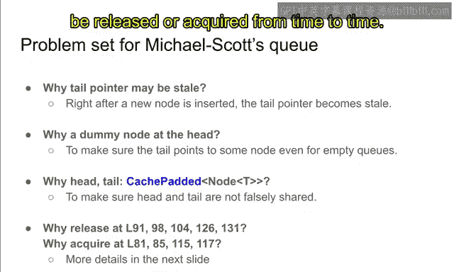

**问题1：为什么尾指针可能过时？**
这已经在之前的幻灯片中回答了。在插入一个新节点后，你可以看到尾指针变得过时。这就是为什么尾指针可能不指向实际的尾部节点。

**问题2：为什么需要虚拟节点？为什么不直接指向队列中的第一个节点、第一个值？**
主要原因是，通过这样做，你可以保证尾指针有地方可指。回想一下，在队列生命周期开始时，哨兵虚拟节点被头指针和尾指针同时指向。但如果没有这样的节点，并且头指针指向`null`指针，你必须将`null`指针分配给尾指针，因为没有节点可指。如果是这种情况，我们就无法建立“尾指针可以从头指针到达”这个不变式。因此，为了建立尾指针可以从头指针到达的不变式，我们指定了一个虚拟节点。仅仅是为了建立这个不变式。通过使用虚拟节点，特别是对于Michael-Scott队列，我们有效地建立了可达性不变式。

**问题3：为什么头指针和尾指针是缓存填充的？**
这与之前的Treiber栈实现类似。我们希望尽可能地将`head`和`tail`变量分开，这样它们就不会被错误地共享，因为`tail`和`head`是并发操作的点，你可以并发地在`tail`和`head`上工作。为了实现更高的性能，我们需要将它们分隔在不同的缓存行中，以防止共享。这就是为什么我们用缓存填充来填充头指针和尾指针，以确保头指针和尾指针驻留在不同的缓存行中。

**问题4：内存顺序（Ordering）的解释**
与Treiber栈一样，我们试图理解为什么某些顺序是`Release`，而某些是`Acquire`。我们想要建立一些不变式。为了建立这些不变式，这些顺序必须是`Release`或`Acquire`。Michael-Scott队列保证了一个指针，例如这个指针指向这里的节点A。这个指针值具有`Release`视图。这个值，即指向A的指针，在promising语义中应该具有`Release`视图。它的视图应该大于或等于A的值和A指向B的`next`指针。这就是不变式：它的指针的`Release`视图大于或等于所指向节点A的值和A的`next`指针。这就是我们想要建立的不变式，以证明这个Michael-Scott队列的功能正确性和安全性。让我们看看如何通过`Release`顺序来维持，以及如何通过`Acquire`顺序来利用它。

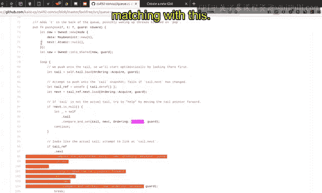

现在我们可以看这里的代码示例。例如，这里有`Release`顺序。我们想要比较并交换尾指针，从旧指针到新指针。这里我们使用`Release`顺序。它应该是`Release`的原因是，这个尾指针将指向某个节点，我们需要建立这样一个事实：这个尾指针的`Release`视图大于或等于所指向节点（这里的`next`）的值和`next`指针。实际上，这是由这里建立的。这个`next`指针是`Acquire`的，因此，这个`next`指针的构造视图大于或等于`next`指针的值和`next`指针的视图。所以这里`Release`了。因此，尾指针的`Release`视图将大于或等于这个下一个节点的值和指针。这是通过这个`Acquire`和这个`Release`建立的。

同样的情况也发生在这里。新节点在这里创建，我们希望`Release`它，以建立不变式。同样，我们也希望在这里建立事件。新节点成为新的尾节点的`next`指针，所以我们需要`Release`它，因为我们希望将关于这个新节点的视图知识转移到尾节点的`next`指针。通过比较并交换。这就是为什么它必须是`Release`的，并且新节点被写入该位置，必须用`Release`完成。同样的情况在这里。下一个节点被写入尾指针，所以它必须是`Release`的。知识本身在这里被`Acquire`，而`Acquire`的知识在这里被`Release`。这两个是匹配的。这两个`Release`与这里的知识匹配。堆分配的知识在这里和这里被`Release`。这就是为什么它应该是`Acquire`的，而它应该是`Release`的。

此外，这也必须是`Acquire`的，因为我们试图在这里解引用`next`指针。你知道，为了做到这一点，我们需要在这里`Acquire`尾指针，以便我们总是看到`next`指针的最新值。否则，我们可能会看到一些过时的`next`指针，它甚至可能是`null`指针。为了防止这种情况，我们应该`Acquire`这个尾指针，以便对`next`指针的解引用将看到最新值。同样，在这里，我们使用`Acquire`读取这个头指针，以便从头指针检索最新的`next`指针。我们也在这里`Acquire`它，以便检索下一个节点的最新值。回想一下，这里我们基本上是在检索虚拟节点。在这里，我们从`next`指针检索下一个节点，我们将从该节点返回值。这就是为什么我们需要`Acquire`这个以获取写入`next`指针的最新值。所以，值在这里写入。为了让这里读取最新值，这必须是`Acquire`的。为了将虚拟节点的`next`节点读取为最新的，它必须是`Acquire`的。这就是为什么这两个是`Acquire`的。

这个可以是`Relaxed`的，因为如果读取尾指针只是为了检查它是否与头指针相同，并且如果相同，我们已经在这里读取了头指针。因此，这里没有道德理由去`Acquire`尾指针。如果我们进入这一行，如果`tail`等于`head`，那么我们实际上已经`Acquire`了尾指针，因为我们在这里`Acquire`读取了头指针。此外，出于同样的原因，它必须是`Release`的，所以我们必须`Release`关于`next`指针的信息，这些信息在这里被`Acquire`，所以线程的当前视图拥有关于下一个节点的最新信息，并且在这个时间点被`Release`。当`next`指针被写入时。同样的情况发生在这里，`next`指针被写入头指针，我们需要使用`Release`顺序来完成。

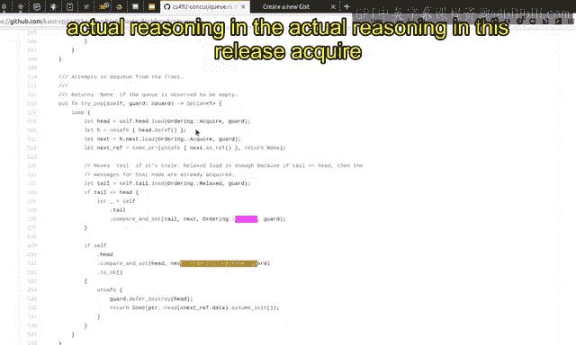

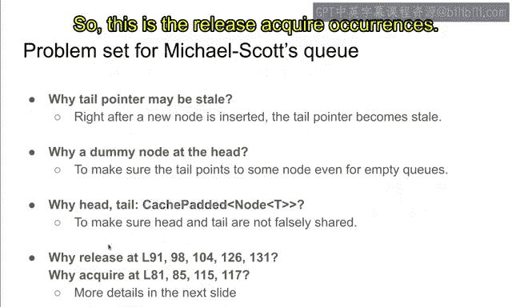

到目前为止一切顺利。这基本上就是顺序中发生的事情。我希望你能理解幻灯片中解释的`Release`-`Acquire`顺序的实际推理。这就是`Release`-`Acquire`顺序的发生。`Release`和`Acquire`的原因是为了建立和利用这个不变式。只有满足这个条件，我们才能安全地返回值。否则，如果不满足这个不变式，那么从弹出操作返回的值可能是错误的。如果`Release`-`Acquire`没有像这样正确使用，它可能读取一个非常过时的值，这个值不是队列中应有的值。如果这个不变式没有建立，弹出操作可能会返回一个非常奇怪的值。这就是为什么我们在这个时候进行`Release`-`Acquire`。

## 总结 📚

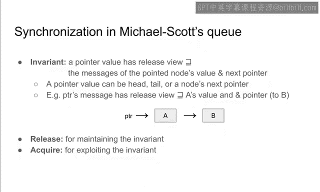

到目前为止，我们学习了Michael-Scott队列，就像在前一个视频中一样，我们学习了它的操作、顺序和同步不变式。我希望这能为你解释一些东西，我强烈鼓励你在Github问题跟踪器中提问。我知道这相当棘手，有时很难理解这里的一些同步问题。这就是为什么我敦促你如果有任何疑虑、问题或评论，就提出问题。通过提问是有效学习的方式。如果不提问，我几乎可以肯定你将无法掌握前一张和这张幻灯片的内容。它们相当密集。所以我希望你能在Gi跟踪器中提问。