# KAIST《Rust并发编程｜CS431 Concurrent Programming 2020 fall》中英字幕（豆包翻译 - P20：-20-Lock-free linked lists.zh_en - GPT中英字幕课程资源 - BV1oi421h7b2

In this video， we are going to study the lock free singlely linked list。

 and it has roughly three variants， and we are going to study all these three variant in a uniform way。

So let me start with explaining the the memory layout of the linked list。Okay， so let me first。

Start with writing the memory layout。Okay， as usual。This is a link list that has that head pointer。

And this head pointer is pointing to a note。And it has a value， for example， survey 3。

And then it has a next pointer。And also， it contains the next node， for example， containing 42。

That is pointing to another node， for example，101。And that is pointing to the no pointer。

So this is an example memory representation of a singlely linkedist that is also luck free。

So there are three operations。 The first one is。Insert。And the second one is delete。

And the third one is lookup。Insert is basically inserting a value。

And deletion is deleting a value and lookup is checking if the value。

 the given value is present in the linked list or not。So we assume that the link list is sorted。

 so if you are going to search for， for example。A 43。You first look up the head pointer。

 read the story 7， it is less than 43， so you move on。You go to the node 42。

 and this is also less than 43。 So you move on。And you are reading the value 101 which is bigger than 43。

 so you immediately conclude that oh， there is no such a value for a3 inside this linked list。

 the reason is that there is I looked up all the values from the beginning to a note containing 101。

And， but there is no value of 43。And there is there because its link sorted。

 there is no43 after the node 11。So even if this is not a node pointer。

 we no longer have to traverse the remainder of these linkes because after 101。

 we know that there is no such a note。Okay， so for second。

And all these three operations has a similar implementation。You first look for the。

You first look for。The places where you are going to insert the little lookup。

You first traverse the head pointer and 37 and 42 and 101。

 and this is the point where you finish your traversal。

So because forestry should be between 42 and 101。Here you kinda know that。 oh。

 this is the point where 43 should be there， but actually it is not。

 so we can insert one or we cannot delete 43 or we the look results is on。Failure。

 there is no forestry inside the linked list。 So we can decide these kind of decisions when you look at this note。

From 42 to，1，1， there is no 43 between these two， so we can either insert delete it or look up for is3 accordingly。

So all these algorithms are consisting of two phases。 The first phase is traversing。

Traversing to the， the the node。For example， here the node is between 42 and 101。

And the second is doing the operation。By inserting or deleting or looking up the value。

So all these list operations are consisting of these two phases。

 and actually they share the same traversecing algorithm。

And there are actually three traversecing trapverse strategies。

 the oldest one is what is due to Harris。And another strategy is due to Harris and Michael。

And another is， due to Harrys。Hli。😔，Oh， I， Im not sure of the the， the， the。Spelling。

 but probably this correct。 How each of it。And as I said， there are three ops insert。And delete。

And the lookup。And it is basically the three， there are three tracing strategies and three operations。

 so by combining this we can get9 combinations， Harris insertion， Harris deletion， Harris lookup。

 Harris micro insertion， Harris micro deletion， Harris lookup， etc。😊。

So in the remaining of this video， we are going to learn the travering strategy and how to perform these operations。

So let me first begin with operations because it is a little bit easier to deal with because it is really easy。

So for example， you found this two twoos， 42 and 101。So。

If you somehow figured out your value should be between a node and the next one。

 you can perform the operations as follows。First， for insertion， you can do that。

 so there are two nodes。And you want to insert a new node。

Then what you do is that you create a node and then point its next pointer to the next block。

And perform。A comparison swap。On the previous nose， next pointer。

The date basically what's going on in the insertion。

If multipleplaceers are trying to insert the same node at the same time。

 it is okay because the cost will resolve the race condition。If your operation succeeds in the cost。

 then it is the case that your entire operation of insertion succeeded。Otherwise， if the cost fails。

 then your insertion is failed。And only one thread can succeed in casting the same next pointer。

 so that's the reason why even though multiple stress are trying to insert at the same position。

 only one will succeed and it is basically coordinating the multiple stress concurrent axises。

So this was insertion。And let's discuss the de。So how to delete a note， So， for example。You are。

Traverse sing。This， And you want to delete this note。And what you do is that you read the next note。

And you perform a comparing swap。On the previous node， next pointer。So by doing so。

 you can effectively removing。The node inside here。But in order to synchronize with insertion。

 you need some extra care。So the reason is that if insertion and deletions are happening at the same time。

 maybe it is the case that you may lose an insertion。So suppose that。In a linked list。

 you are inserting a new node here。So you can do that by performing a class here。

And at the same time， maybe another thread is deleting this node at the same time。

These two operations may succeed concurrently。This is， this is delete。And this is insert。So。

 they are。Operating on the different locations， it is the next pointer of this。

 and this is the next pointer of this。And they can succeed at the same time。But it should not。

 because this insertion information is lost。Because the next pointer of this becomes the this node。

 there is no， I mean， because after discuss， this node， the information is lost。And as a result。

 this node cannot be reached from the beginning。Effectively， you are losing the inserted node。

 even though the insertion succeeded， this is not reachable from the beginning， that is the problem。

So how to deal with this so to deal with this in the delete operation。

 you are first going to mark the next pointer as the logically deleted。

 so let me explain this with the figure again。😊，So。Okay。And。In deletion。

Before doing a classs on this pointer。You are first marking this pointer as deleted。

By doing some affection or in operation。So after deleting it。

 you are going to delete marking change this pointer value。😊，For example。

 changing the least significant bit of this to one。And only after this is succeeded。

 you are going to。performform the cost。 So this is the。First operation to do for deletion。

And the second operation is performing a class here。And。

What is different from the previous operation？ So in the previous operation。

 it just performed the custom on the first link without without changing the second link。

But in this revised implementation， you first tag。The second link as logically deleted。

And then you update the first link by changing the the it to the next pointer to the next to the next pointer。

And the benefit of that is that the insertion here。😊，And the logical deltion here。

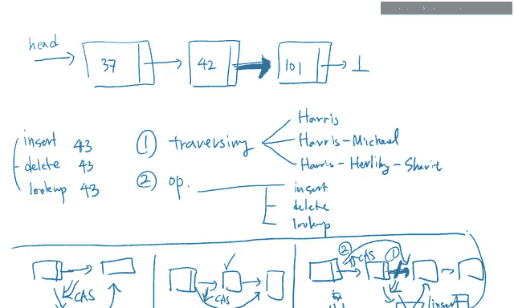

These two are now。

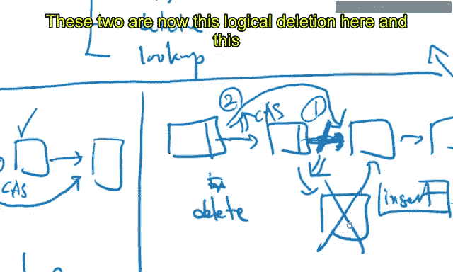

Okay。This logical de here。😊，And this insertion here。😊。

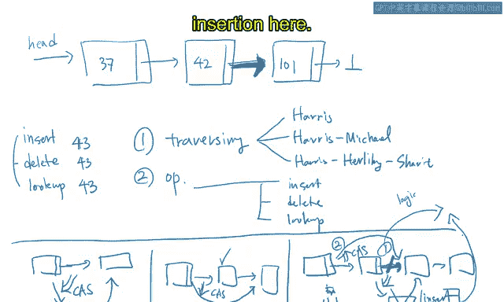

So， they are performing the。The d， the， the。

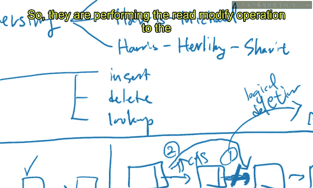

They are performing the radio modify operation to the same location， the same pointer location。

And as a result， they are coordinated。If the logical deleion performs first。

 then the node is deleted。If the insertion is performed first， then the new node is inserted。

But they are not happening at the same time。 If logical division is happening。

 then you cannot insert a new node because the pointer is changed， your cost will fail。😊。

On the other hand， if an insertion happens before the logical deleion。

 then the logical deletion will fail。😊，Because the next pointer is no longer the one you are aware of。

 It is updated to point to the inserted new node。So the codination is adorned at this point。

And the race is resolved between the logical division and the insertion in this next node next pointer。

So that what that's what's going on in this insertion and delusionion and they are their contention。

And as a result。😊，You just cannot perform cars in the deletion operation。

You have to first logically delete the node by marking the next pointer as。Or logically delete。Okay。

 so in the deletion， you have to first mark this as logically deleted by taking it with， for example。

 one in the least significant bit。And then。Compars perform the compare swap up later。

So let let's say that this is the logical deletion。Which means that even though the node is there。

 we are logically we have already logically deleted the node。😊。

And this is a physical de because we are actually deleting a node from the linked list。😊。

So logically， so the link list no longer contains the value if it is logically deleted。

Even though it is not yet physically deleted， we know that this we。

 we have to assume that this value is already deleted。So， that's basically the。

The protocol of this insertion and deletion。And look up is very easy。😊。

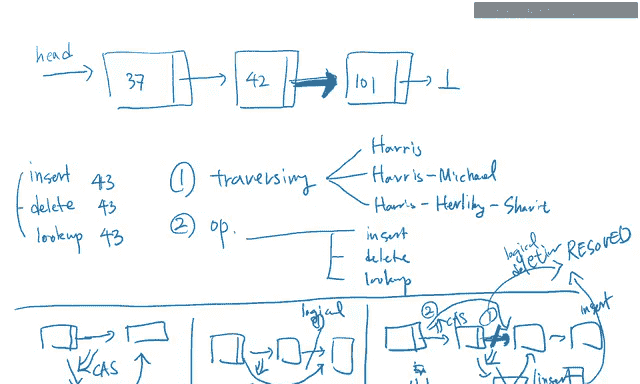

Finally， we are discussing the Luca。And you can just go to the link and see if your value 43 is there or not。

If the value is there， you find the value and if there's no value， then you didn't find the element。

So that's all。 And look up is easy。So please look at this。

 the synchronization between insertion and deletion。

Probably this is the most interesting point of the lock free Sly linked list。😊。

This will probably be asked in the exam。So， please。Please， look at this。

And now let's turn to the travel trip strategy。So I said that there are three traveral strategies。

 one is Harris， and the other is Harris Michael， and the other is Harry Holy Shabbd。

And I'd like to explain these strategies in a different slide。Okay， and。Okay。

There are roughly three strategies。 So I'm going to explain one in。Here。

So the first strategy is Harriss strategy。So at the beginning， you are aware of the two nodes。Always。

 you are。Pointing to the two consecutive notes。 And I say that this is a prev。And this is current。

So first are good。And when you traverse， you are going to go to the。

I'm going to read the next pointer here。And。😊，After one traverseor， you are going to  point2。Pv。

An current。So the original pre is pointing to the first node and the original current is pointing to the second node。

And in the next iteration， the pref becomes the original current and current becomes the actual current。

At the next pointer of the current。And on and on and on， so if， if it is the I mean。

 this is basically the no more case for all the tra strategies， Harris， Harris Michael， Harris。

 Holly Shabbit， they share the same tra strategy。😊。

By looking at the next node itly am moving what is called cursor to the next pointers and on and on and on。

But what is different among these three is how to deal with a logically deleted node。So for example。

 let's say that。😊，Let's say that you read the next pointer here。You write the next pointer。

And suppose that this is a logically deleted node。So this is。

 let's say that this is marked with one at its least significant bit。And you know that， oh， actually。

 this node is deleted。😊，This note is logically deleted already。So we should not， for example。

 look up the current node， or we should not add a new node after this node。

Or we should not delete a node the next node by performing a comparison swap to the next node。

 It cannot be done in this way。Because this node is already deleted， we should not do that。

 So this is basically the meaning of this logical de， logical deletion。

So even though there is a node in the linked list， you cannot do any operations in this node because it is logically deleted。

 That's the meaning of this logical de。So okay， so what do you do？So。In the。Indi。😔，Hary strategy。

 So we are going to， if you met a。You met。Logically deleteleting node。

 then you further traverse the new node。And you are trying to fix the list by physically deleting the node。

For example， this is not yet logically deleted。Then。😊。

And suppose that this node is not yet logically deleted。😊。

Then what you're going to do is that you are updating。The previous node。

 next pointer are from the logically delete node to the。New note。

So that is basically done by this Harris wrist。And if there are。So， suppose that。

Suppose that this is also logically deleted。And you traverse until you find the。logical컬 이 de note。

So there can be multiple nodes between this pair pointer to the non logically deleted node。

 and if you meet the first non logically deleted node。

 then you are going to update the previous node next pointer to the first non logically deleted node。

So basically， when travering the node node in the Harris traso。

 you are going to continuously fix the linked list by actually physically deleting the logically deleteletd node。

So this is basically the herey strategy。And Harris Michael's strategy is similar。

But it is a little bit different。And what it does is that。If this is logically deleted。

Then you are going to just fix the previous link from this to this。Always。

You're not going to update the the multiple nodes at the same time。 You are only fixing one node。

 You are only logically deleting you are you are deleting only one logically deleted node physically。

Only one is physically deleted by a single fix by a cast from class of the previous pointer from the the this node to the next node。

There's no such a way that on the。The cast is performed on the。On the next to the next note。

 it is not Harriss Michael。 Harris Michael only perform cards from a note to the next note。

 not next to the next note。So this is， basically the。Harris。Michael。Strategy。So。Okay， so far so good。

 and we are。We covered the two strategies。And the remaining strategy is Harry Hurley Shabbd。

And what do you do？Even so， in this strategy。Even though we made a logically deleted node。

 we just keep going。Without fixing the note。Without fixing the linked list。

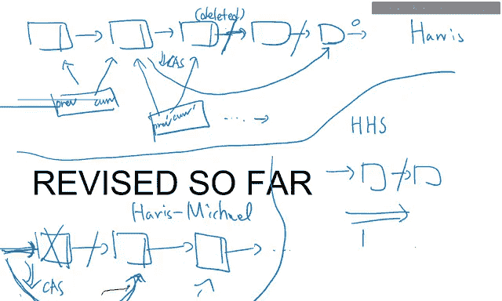

So。This is usually done for an operation that should be executed fast。

 So if you want to traverse fast， then you can choose not to fix the link list at all。

So there is logical utility node。 that's okay。 Just leave it there。 you continue to traverse。

Until you find a value。So that is basically the strategy of Harris Holly Chait。

And it can be used for a fast lookup。 if you don't want to fix the link list for the others in your lookup。

 then you use this strategy。So these three are the three representative。

 the travel source strategy that should be。That is that is widely used for a single linked list。

And actually these three can be represented uniformly。

 and that is what is done in the reply story source code。So from now on。

 I'd like to go to the source code and read the lines by one line lines line by line。And okay。

 let's move on to the。Move on today。Source code。And here is the source code。And in this source code。

 we are going to see the node。 First， there's a node。And as usual， the。Okay， I'm sorry。

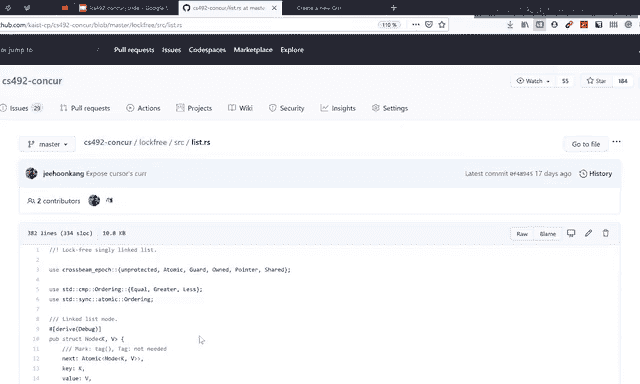

Okay。O， now you can see the。Code here。 Okay， so note is， as usual， contains the key。

But here we have key and value。 So in the。In the previous explanation in the drawing。

 I only left only drove drew the。The， the key。But in general。

 we can design a map that is mapping keys to the values。

And we can do that by storing both key and value in the same node at the same time。

But in the previous drawing I only draw a key for simplicity， but in this implementation。

 we have both key and value for generality。And this node is also having the next pointer。

 the next is an atomic pointer to the node。So that is pointing to the next node， basically。And also。

 a list is just a pointer atomic pointer to the node。 So so far。

 this is very much expected from the the， the memory layout of the linked list。😊，So first second。

And here are some code for creating a new list， and the。And the delocating the list。

 it is basically itrating through the the nose and dropping one of them。 I mean。

 dropping each of them。

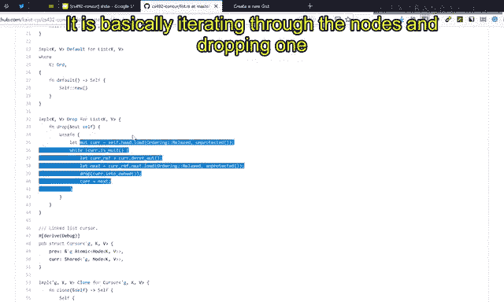

And。Here is cursor that is basically the an artifact for the traveror。

I said that at each iteration of a traversor， you have to remember two pointers。

 one is the previous pointer and the other is current pointer。And the propose is that you。

 if you want to remove the current pointer， then you have to fix you have to change the previous nose next pointer。

And that is stored in this， and the current node is stored in here。

So there are two pointers on one is pointer to the previous node next pointer。

 and the other is the pointer to the current node。So at any point of time in the traversesor you are always remembering this two data and this two data is abstracted as cursor。

So this cursor is the same cursor， the same word as the mouse cursor， it is pointing to something。

 mouse cursor is pointing to somewhere in the screen and this linkedless cursor is pointing to some nose。

😊，And that's the reason why it is called cursor。So you can clone the cursor because you can traverse twice from the same cursor。

 basically。And at the beginning， the node can node next pointer is null。

 and it is created by storing the given key value。So， first second good。

And let's see how to traverse a cursor。And cursor is at the beginning。So， I mean。Okay。

 let's see this。At the beginning， there is a list， and you can。You can create a headcuror。

That is pointing to the head。And the previous is the head pointer itself。

 the linked list head pointer is written in the cursors previous。😊。

And then the K current node is pointing to the actual head node in the linked list。

So they are preing cursor and it is quite obvious that this prev is pointing to the current node because you just read from the head pointer here。

And so far so good。😊，And。If you get the point head cursor， that is pointing to the head node。

And you can traverse using this cursor to retrieve a value。And as I said， there are three strategies。

 The first strategy is fine Harris， and the second strategy is fine Harris Michael。

 and the third strategy is Harris， Holy He and Chad。😊，And let's first look at this find Harris。

And you are going to。Move on。 So this preex is going to be the current the current current node。

And you read the card note。You dereference the current node。 And if its the nu pointer。

 then we are then。We are done because we finished traverscing the entire link list。

And we I know that， oh， I didn't find the value。 So we want to look up the value the the the key given here。

 but we reached the end of the link list。 So we didn't find the。

 the value that there's a reason why this found can be false here。And after that， we are going to。

You are going to return the font value here。But before that， we need to do some cleanup。

 So that's the code for that。And let's now assume that we successfully dereferenced the ch node。

And the next thing to do is looking up the current knows the next pointer。So four parts are good。

 we know previous and the current node and we are dereferencing the current node in order to retrieve the next pointer。

So， far so good。And now if the next pointer tag is 90。

 which means that the current node is logically deleted and its next pointer is marked with。

 for example， one in each least significant bit。😊，And then we know that， oh。

 kernel node is deleted logically。And。😊，That's basically what's going on in here。

And what we do with this Her list is that， oh， the current node is now logically deleted。

 but we are going to traverse continue traversing because we are going to delete it later。

 And for now， let's move on with only updating the the cursor's current node。

 And let's point to the next pointer。😊，So instead of pointing to previous and current node。

 only the current node of the cursor is updated。In， in this case。

So let's see in the drawing that what is happening。So what is happening at the the line is that。So。

 and this is Harris。So。Okay。And suppose that the pre was here。And the curve was here。

And we just figured out that。This is logically deleted。When what we'll do。

 what you'll do is that just updating。都。The cursorors curtain pointer。

From the old note to the new one。So in thisverseverse strategy。

 it can be possible that the pre and current pointer points to a faraway nose。

If the nodes in between are logically deleted。And if this is also logically deleted。

 we the distance between this pre and curve will be farther away。And we do that。

Until we made a non logically deleted note。 so that's basically what's going on in the source code。

Okay， so first good， and let's move back to the source code here。😊，And we do that。

 we update the current node our current pointer and and begin from the beginning of the loop gain and on and on and on until we know that。

😊，At this point of time， we know that the nodes next the current node is not logically deleted。

Because its tag is 0， which means that it is not logically deleted。Okay， so far good。

If the last node， if now you compare the current node and the key。

And if the current node key is less than the given key， then you need to continue traver。

Because the value， the given key here， may be of there after the current node。So what you do。

 What youll do is that you。You update the current pointer。You update the current pointer with the。

With the。Next pointer。 and you also update the previous node。 I mean， previous pointer。

It is the the the original cars next pointer。So it effectively means that the new previous node will be your old current node and your new current node is going to be your old next node。

And you do it from again。 So this is basically。We are not finishing the loop and we are traversing from the new previous and node from the beginning。

If the values are equal， then we are done， then we are just returning the the2 here because you found the value。

And if the kernels value is bigger， that it means that you didn't find the given key in the linked list。

So you break with false， and the phone becomes false。So overall。

 this found becomes true if and only if you actually found a value inside a link list。

So that is what's going on here。Okay， so。We so without we。

 now we see if the previous next is actually the current。It is the case that the case that if。

It is the case if the current node is not logically deleted。So if it is the case。

 then you just return， whether you found it or not。Otherwise。

 you clean up by removing the logically deleted node between the previous and the current node。

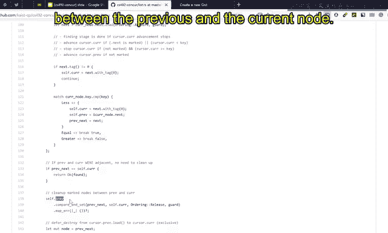

SoSo let's look at the figure again。

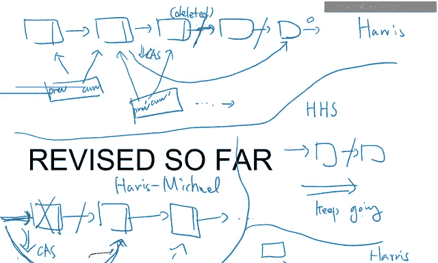

Here。You know that previous is here。And the current is here。Okay， this。Okay， so this the。

So this this and this are the previous and the current pointer from the cursor。

And you know that they are far away。 They are not adjacent。And if it is the case， you want to。

 you want to。嗯。You want to connect this to this。By performing。A comparison swap。

So this is a way of fix the linked list by removing， actually physically removing the nose。

 the logically deleted nose between the previous and the current pointer。😊，So。

If it is comparing and swapped and the logically deleted nodes are physically deleted。

 then it will help help the other threads to efficiently traverse the linked list because the logically deleted nodes are no longer present physically in the linked list。

😊，Okay， so for are good。And let's move move back to the， the code。And here we are updating。

Updating the previous next pointer from the current pointer。I， I mean， I mean， let me say again。

 we are updating the previous pointer。From the original next pointer to the current pointer that is far away from the previous node。

 and we are effectively physically removing or on linking the node in between the previous and current node。

😊，And if we failed， it， it is okay because。嗯。Okay。Okay， so。Okay， so if it is successful。

 we I I know that the logically deleted nodes between the previous and current are actually。😊，A int。

And if it's the case， we are going to。Destroy the oninked nose。

Those between previous and currents will be delocated。But as before for Q and。

 you cannot do that immediately， instead you need to defer the destroy or theloc of those nodes。

The reason is that maybe concurrent threads are having a local pointer to the delocated node I I mean un linkeded node。

 so you need to delocate well after the old thread finished accessing the concurt node。

And it is basically traversing the， the linked list， and basically。啊。Marking those notes as， oh。

 they should be destroyed or delocated later after all the concurt excesses are finished。

And you're doing that for all the node between previous and the current node。And after that。

 you are going to return whether you succeeded in finding the node or not。

So that's basically what's going on in this Harris search strategy。

You search the value and if there are consecutive。Consecutive logically deleted nodes。

 then you actually physically delete them。 So in order to help the others to efficient。

 more efficient to tras next time。So that' is basically the herey strategy。Okay， so first a good。

 and let's move on to the Harris Michael strategy。😊，And it is a little bit simpler。😊。

And it is the same that in the loop you' are going to read the current node and read the next pointer and the next pointer tag is 90。

 which means that the current node is logically deleted already。

Then you are going to update the previous note。The previous note is updated from the current node to the next node。

You can you should do that because the current node is already logically deleted and you need to unlink it from the linked list by updating the previous pointer from the logically deleted current pointer to the next pointer。

And if it is successful， you are going to def destroy the current node。

 which will actually dealcate this node when no other threads are accessing the node。😊。

And you continue by setting up the cursor's new current pointer as the next pointer。And continue。

And you similarly compare the case and do whatever is necessary for the。For searching for the cave。

And what is important in this strategy is already present here， if you found logically delete note。

 you immediately unlink it by updating the previous pointer to the next pointer。😊。

And you do that recursively or iterively until you get the value you found the value here。

The last strategy is even shorter。 and regardless of whether the nodes are logically deleted or not。

 you continue traver。Until you found， so this is basically continuing tra。And if you found the value。

 you check whether the tag is the found for the found node is logically deleted or not。

 and if it is so， then you are going to return false because logically deleted nodes are regarded as not presenting the linked list。

 so you return false and if it is not logically deleted， then you are going to true。

Because it is actually present in the linked list。So that is basically the three strategies that is present for the。

Present for the linked list。😊，And there are Luca function。And after finding the， the， the。The， the。

 the right position for using these strategies， you can either look up， insert or delete。

 So basically， that is the。What's going on here？😊，When you insert， as I said。

 you insert a new node here。And in deletete， as I said。

 we are going to mark the node as deleted by performing a fashion or operation。😊，And furthermore。

 we are going to tag it as a。I mean。Fction or。 and if the tag is already if the next pointer is already tagged。

 which means that it was already logically deleted。

 then you are going to bail out and try from the beginning again。

 and if you successfully marked the least significant bit of the next pointer with one。

 then you are going to。😊，Perform a comparison swap on the previous pointer from the current pointer to the next pointer。

 So it is the same with the same with the what was described in the board。 So in the board。

 I said that。I said that the。啊。Yep， I said that。Okay。Okay， I said that in the deleion。

 you first need to logically delete the node by marking this with。1。

 by fashion or operation on the list significant bit， which is also RMW。

To coordinate with the concurrent possible。Inertion。And only after that。

 you can actually perform a cus on the next pointer。

So you will have to first logically delete and then physically delete later。

 So that is basically the order of the operations。And。

D order is reflected in this implementation in deletion。

 You first mark the next pointer with one in the least significant bit。

 and then you update the previous node previous pointer from the current to the next pointer。😊。

So that is basically the， they what's going on in the， what's going on in the。

Link list implementations。And。The the呃 the the finding。The， the finding for linked this is basically。

Getting the head cursor and find one。And。And the。Returning whether you found the value or not and the cursor at the same time。

And lookup means that you find it。 And if you found it， then you return the value。 Otherwise。

 you turn none。And insertion is also simple。You search for it。 You find it。And you found the value。

Then you， you should not insert more values。 So you just drop the。The value here。

 the the the created node here。And also if and if it is not found。

 then you need to insert into the cursor， so you call just cursor to insert。And if you succeeded it。

 then you return true otherwise you loop again from the beginning。And in de operation， you find the。

K。And if， it， if the value is not found， then you return on。Otherwise。

 you delete the value from the cursor。So if it is successful， you return the value。

 otherwise you do it from the beginning。😊，Because it is not done yet。And as I explained。

 depending on the strategies and operations， there are many combinations， for example。

 there are Harris lookup， Harris insertion， Harris solution， Harris Michael lookup。

 Harris micro insertion， Harris micro dilion。And this HHS lookup， HHS insertion and HHS tuition。

Depending on the Travel search strategy and the operation you need to do for the linked list。

So in this video we studied the lock free link list and their operations。

 theres basically three operations， insertion Jeion Lucup。

 and there are three search strategiesategists， Harris and Harris Michael and Harris Hurley Chavet。

This all they are all fully combinational， so there are nine possible implementation slash operation for this linked list。

😊，And they all can be represented in a uniform way in like this。Okay。

 so far we discussed the algorithms and the rough the synchronization scheme of the insertion and deletion and lookup and in the next video we are going to study why we need to put such orderings like release and acquire at this place or that place。

 for example， we are going to learn why this should be acquired， etc。

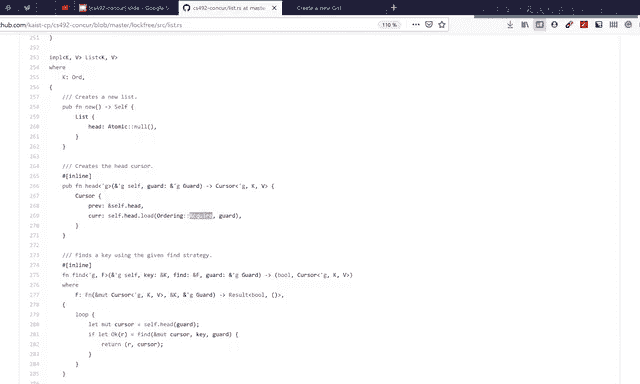