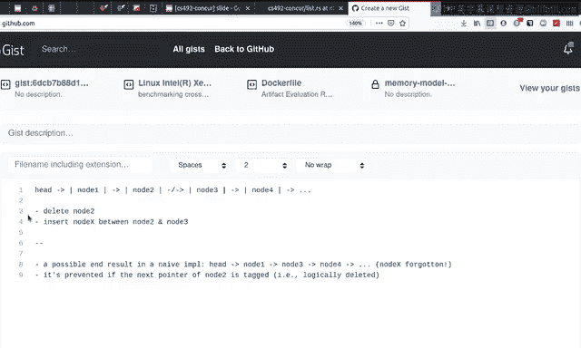
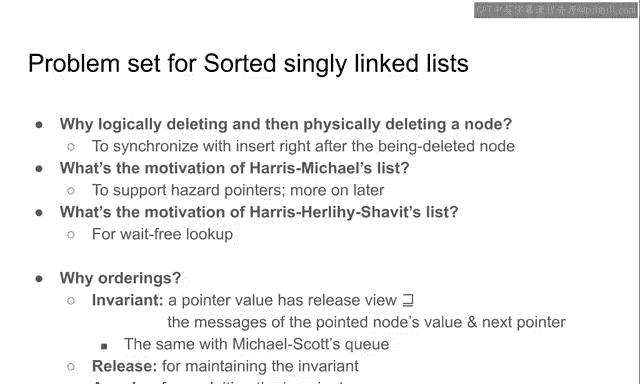
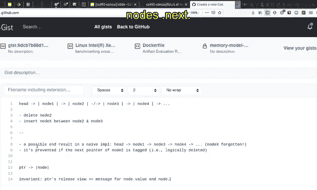

# Rust并发编程：CS431：无锁链表（问题解析）🎯


在本节课中，我们将继续学习无锁单链表。上一节我们介绍了该数据结构的基本算法和同步机制的高层解释。本节中，我们将深入探讨几个关键的设计选择，并解释为何这些同步操作是安全且正确的。

## 设计选择解析

### 为何需要逻辑删除？🔍

在删除操作中，我们首先标记一个节点，表示它已被“逻辑删除”，然后才实际更新指针以“物理删除”它。为何要采用这种两步走的方式？

考虑一个并发场景：一个线程正在删除节点2，同时另一个线程试图在节点2和节点3之间插入一个新节点X。

**错误实现**：如果删除操作直接更新节点1的`next`指针，使其从指向节点2变为指向节点3（`CAS(&node1.next, node2, node3)`），而插入操作同时执行了`CAS(&node2.next, node3, new_node_x)`，那么最终结果可能是：
*   节点1的`next`直接指向了节点3。
*   新插入的节点X虽然被链入了节点2之后，但节点2本身已从链表中移除（不可达）。这导致节点X被“遗忘”，违反了链表的基本规范。

**正确实现（逻辑删除）**：删除节点2时，首先将其`next`指针标记为“已删除”（例如，通过设置指针的最低有效位为1）。这个标记后的指针值（记为 `node3_tagged`）与原始指针值（`node3`）不同。
*   如果**逻辑删除先成功**，那么插入操作的`CAS(&node2.next, node3, new_node_x)`会失败，因为`node2.next`的当前值是`node3_tagged`，而非预期的`node3`。插入失败。
*   如果**插入先成功**，那么`node2.next`变成了`new_node_x`。此时，删除操作尝试的`CAS(&node2.next, node3, node3_tagged)`也会失败，因为当前值不是`node3`。逻辑删除失败。

通过逻辑删除，我们协调了并发删除和插入操作，防止了节点被遗忘的情况。逻辑删除后，节点在物理上仍可能存在于链表中，因此后续需要由某个线程（可能在遍历时）完成物理删除（即更新前驱节点的指针）。



以下是三种物理删除策略的动机：

*   **Harris策略**：在遍历时，可以一次性物理删除多个连续的逻辑删除节点（跳过它们）。这通常性能更高。
*   **Harris-Michael策略**：每次只物理删除一个逻辑删除节点。其动机与**危险指针（Hazard Pointers）** 这种广泛使用的内存回收方案兼容。危险指针（我们将在课程后期详细学习）不支持Harris策略，但支持Harris-Michael策略。
*   **Harris-Herlihy-Shavit策略**：在遍历（如查找）过程中，完全不进行物理删除，直接跳过逻辑删除的节点。这使得查找操作非常快速，延迟极低。物理清理工作可以交给低优先级的后台线程执行。这种策略适用于查询性能至关重要的场景。

## 同步正确性证明 🛡️

现在我们来探讨，在宽松内存模型下，为何这些算法是正确的。与栈和队列类似，我们需要建立并维护一个**不变式（Invariant）**。

**核心不变式**：链表中的每个指针（头指针或节点的`next`指针）都有一个与之关联的**释放视图（release view）**。该指针的释放视图必须**大于或等于（≥）** 它所指向节点的`key`值和`next`指针所对应消息的时间戳。



**公式化表示**： 对于任意指针 `ptr` 指向节点 `N`，有：
`release_view(ptr) ≥ timestamp(N.key) ∧ release_view(ptr) ≥ timestamp(N.next)`



**操作原则**：
*   **写入（写指针）**：通常使用 **`Release`** 语义，以确保写入操作能**维护**上述不变式——将当前所知关于指向节点的信息“发布”出去。
*   **读取（读指针）**：通常使用 **`Acquire`** 语义，以便**利用**不变式——安全地获取指针所指向节点的最新内容。

让我们结合代码中的内存顺序（`Ordering`）来分析：

1.  **遍历中的读取（Acquire）**：
    ```rust
    // 在 `find` 函数中
    let mut next = unsafe { (*curr).next.load(Ordering::Acquire) };
    ```
    这里以`Acquire`读取`curr.next`。因为在下一次循环迭代中，`next`将成为新的`curr`，我们需要确保能安全地解引用它并访问其`key`和`next`。`Acquire`语义保证了我们能观察到该指针所指向节点（即`*next`）的最新值。

2.  **指针更新（Release）**：
    ```rust
    // 在物理删除（`tidy`）或插入时更新前驱节点的 `next` 指针
    prev_next.store(new_next, Ordering::Release);
    ```
    这里以`Release`更新`prev.next`。因为我们将该指针指向了一个新的节点（可能是跳过了被删除节点，或指向新插入的节点）。通过`Release`写入，我们**建立并发布了**关于这个新指向节点（其`key`和`next`信息，这些信息在之前可能通过`Acquire`读取获得）的不变式，使得其他线程后续的`Acquire`读取能看到一致的状态。

3.  **仅检查标记（Relaxed）**：
    ```rust
    // 检查指针是否被标记（逻辑删除）
    if next_tagged(next) { ... }
    ```
    这里读取指针可能仅用于检查其标记位，而不需要立即解引用它指向的节点。因此，可以使用`Relaxed`语义，因为此时不涉及与节点内容相关的同步。

**总结**：通过精心安排的`Acquire`（读取）和`Release`（写入）内存顺序，算法确保了“指针释放视图 ≥ 节点内容时间戳”这一关键不变式在并发操作下始终得以维持。这使得线程在遍历链表时，总能基于一致的状态视图做出正确的决策，从而保证了插入、删除和查找操作的安全性。

---


**本节课总结**：我们一起深入探讨了无锁链表的关键设计选择，特别是逻辑删除的必要性及其如何协调并发操作，并分析了三种物理删除策略的不同动机。最后，我们从内存模型和不变式的角度，剖析了算法中同步操作（`Acquire`/`Release`）的正确性原理，理解了为何这些操作能保证并发环境下的数据一致性。