# Rust并发编程：P22：无锁链表的内存排序分析 🧠

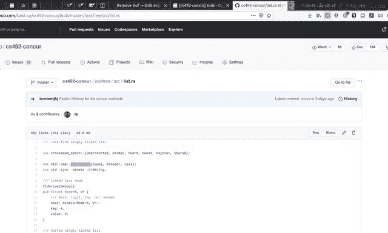

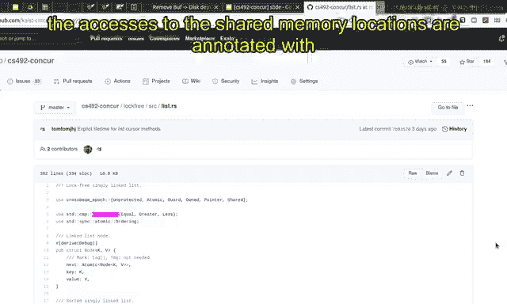

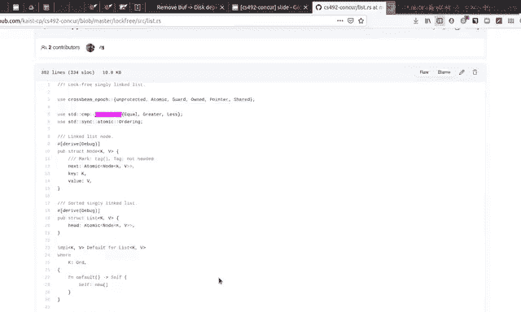

在本节课中，我们将学习如何分析无锁链表中原子操作的内存排序（Memory Ordering）。我们将通过具体的代码示例，理解为何某些操作必须使用 `Acquire` 或 `Release` 排序，而另一些操作可以使用 `Relaxed` 排序。核心在于理解这些排序如何帮助建立和维护数据结构的正确性不变量。

---

## 概述与背景

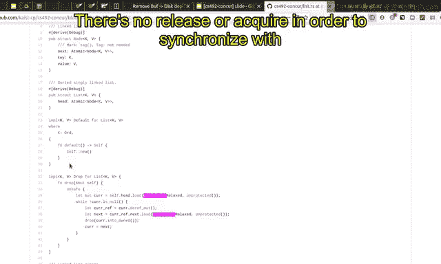

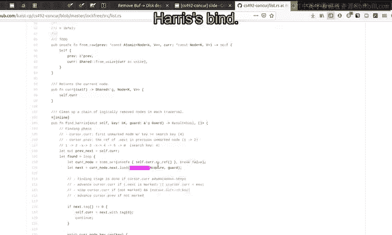

上一节我们介绍了无锁链表的基本结构。本节中，我们将深入分析其实现代码中原子操作的内存排序注解。理解这些排序是确保并发操作正确性和高效性的关键。

---

## 析构操作中的 `Relaxed` 排序

在链表的析构函数（`drop`）中，我们不需要使用 `Acquire` 或 `Release` 排序。

**原因**：当一个数据结构被销毁时，当前线程完全拥有这个链表。我们不需要与其他线程进行任何同步。因此，这里的原子操作可以使用 `Relaxed` 排序，它只保证原子性，不提供同步保证。

```rust
// 示例：析构中的 Relaxed 操作
impl Drop for LinkedList {
    fn drop(&mut self) {
        // ... 遍历并释放节点 ...
        // 此处的 load/store 可以使用 Ordering::Relaxed
    }
}
```

---

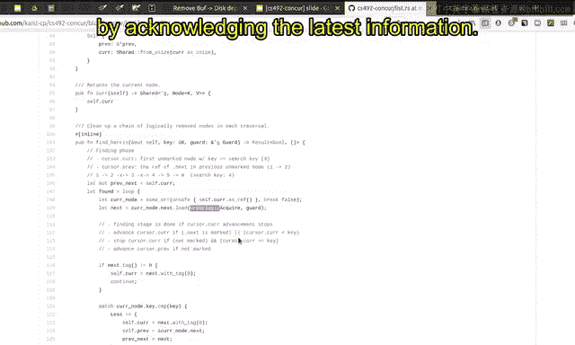

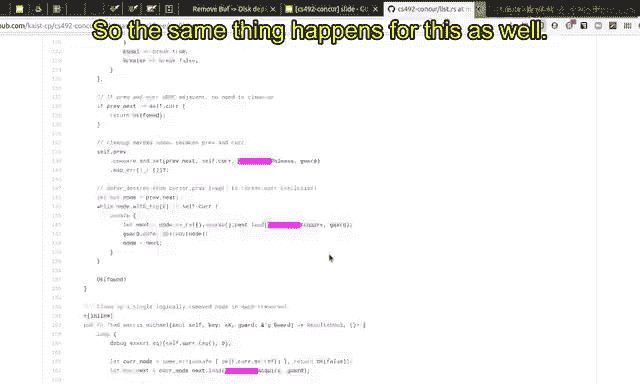

## 遍历操作中的 `Acquire` 排序

现在，我们来看 `Harris` 查找算法中的遍历部分。理解为何读取当前节点的 `next` 指针必须使用 `Acquire` 排序至关重要。

**光标（Cursor）结构**：遍历时，我们维护一个由两个指针组成的“窗口”：一个指向当前节点（`current`），一个指向前驱节点（`previous`）。

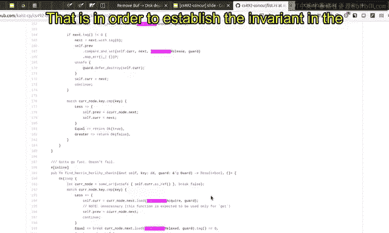

在每次迭代中，这个窗口会向前移动。当前节点的 `next` 指针被读取，并在下一次迭代中成为新的 `current` 指针。

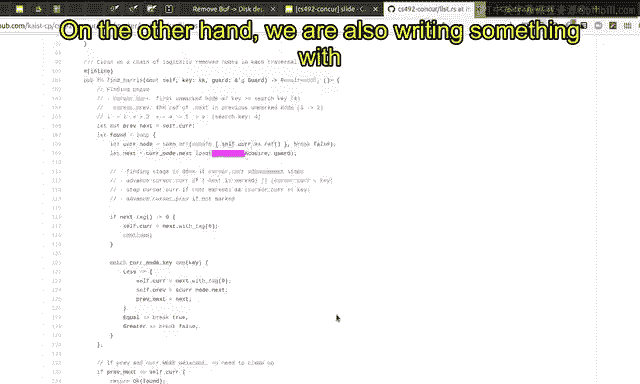

**必须使用 `Acquire` 的原因**：
1.  读取的 `next` 指针值将在下一次迭代中被解引用，用于访问其 `key` 和 `value`。
2.  为了能看到关于这个 `next` 节点（包括其 `key` 和后续指针）的最新信息，本次读取必须使用 `Acquire` 排序。这确保了当前线程能“获取”到之前其他线程对该节点所有 `Release` 写入的结果，从而维护了数据结构的正确性不变量。

```rust
// 示例：遍历中必须使用 Acquire 读取
let next = unsafe { current.next.load(Ordering::Acquire) }; // 必须为 Acquire
// 在下次迭代中，`next` 将成为新的 current 并被访问
```

在 `Harris-Michael` 策略的 `find` 函数中，情况几乎相同。我们读取 `next` 指针，并在下一次迭代中解引用它，因此也必须使用 `Acquire` 排序。

---

## 写操作中的 `Release` 排序

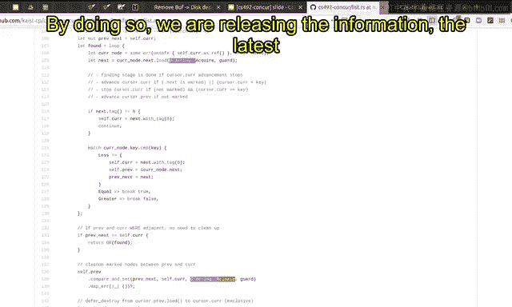

另一方面，我们在写入指针值时需要使用 `Release` 排序。

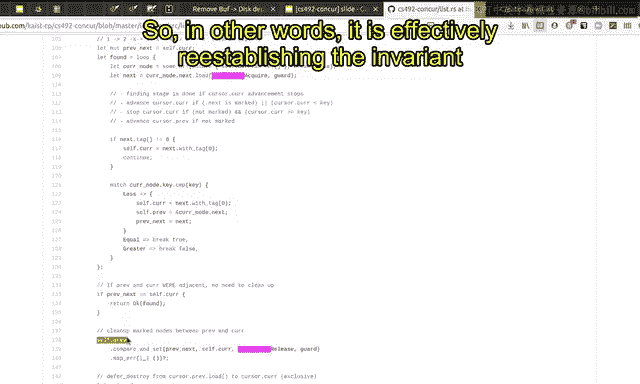

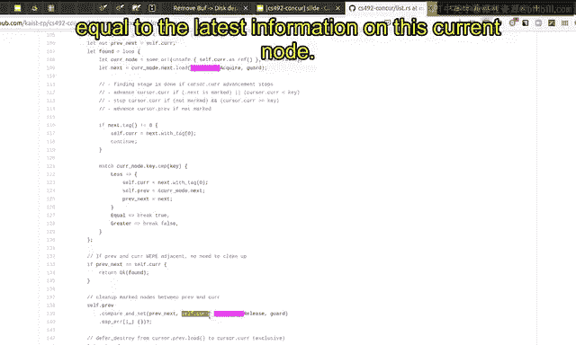

**场景**：当我们覆盖前驱节点（`previous`）的 `next` 指针，使其指向新的当前节点（`current`）时。

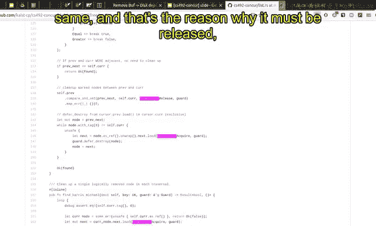

**必须使用 `Release` 的原因**：
1.  我们正在修改共享状态（前驱节点的 `next` 指针）。
2.  我们需要保证，这次写入（`Release`）所“释放”的信息，其版本号大于或等于当前线程所“获取”到的关于 `current` 节点的最新信息版本。
3.  在之前的遍历循环中，我们已通过 `Acquire` 读取获取了 `current` 节点的最新信息。
4.  现在通过 `Release` 写入，我们相当于将 `current` 节点的最新信息“发布”给了指向它的 `previous.next` 指针。这有效地重新建立了“所有指向某个节点的指针，其 `Release` 视图都晚于或等于该节点最新信息”的不变量。

```rust
// 示例：写入指针时必须使用 Release
previous.next.store(current, Ordering::Release); // 必须为 Release
```

在 `Harris` 算法的删除操作中，类似的指针覆盖写操作也必须使用 `Release` 排序，原因同上。

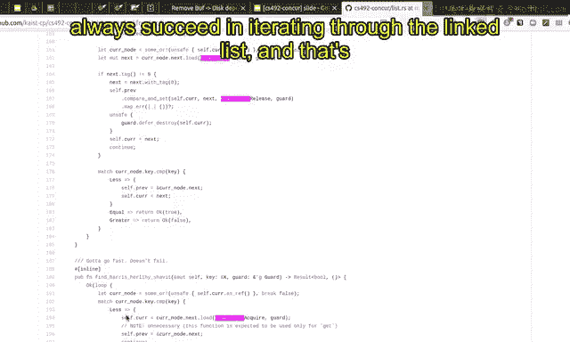

---

## 无写操作与 `Relaxed` 排序

在 `Hazard Pointer`（或类似无锁回收）策略的遍历中，算法不会通过更新链表指针来“修复”链表。

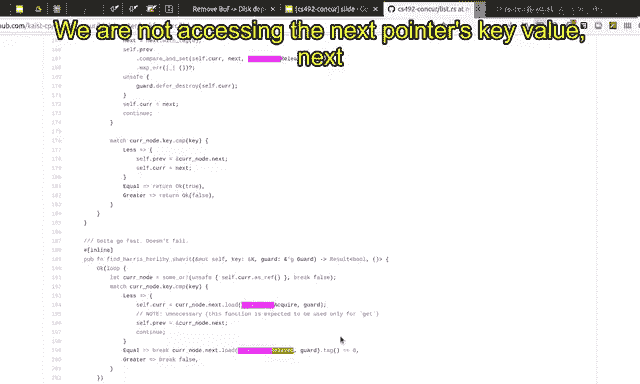

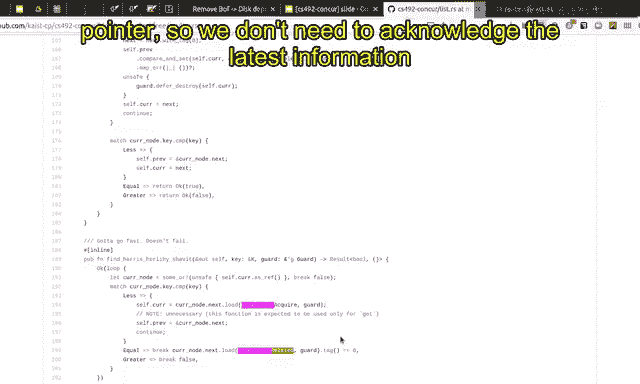

**关键区别**：该策略不覆盖任何指针值，因此整个遍历过程中没有 `Release` 写操作。这也是它被称为“无等待（wait-free）”的原因之一——它甚至不包含 `CAS` 操作，因此遍历总能成功完成，性能可能更高。

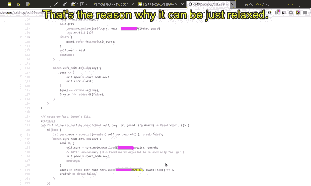

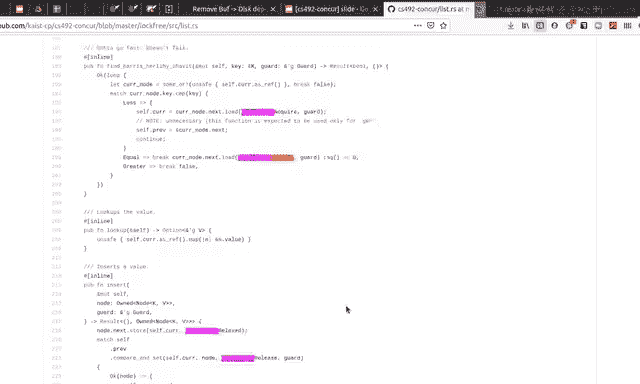

在某些情况下，读取操作也可以使用 `Relaxed` 排序。

**场景**：当我们仅需要读取指针值本身（特别是其标记位 `tag`），而**不打算解引用**这个指针去访问目标节点的 `key`、`value` 或 `next` 指针时。

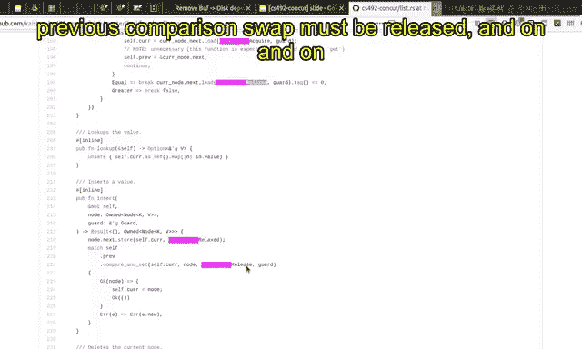

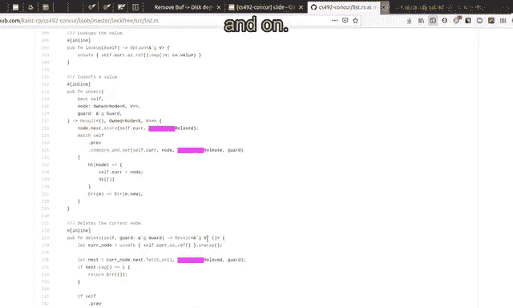

**可以使用 `Relaxed` 的原因**：我们不需要获取目标节点的任何最新信息，只关心指针的原始值（及其标记）。因此，不需要同步，只需保证原子性即可。

```rust
// 示例：仅读取指针值/标记时可用 Relaxed
let next_ptr = node.next.load(Ordering::Relaxed); // 仅检查标记位，不解引用
let is_marked = get_tag(next_ptr);
```

另外，当线程完全独占（拥有）某个节点时，对该节点的读写也无需与其他线程同步，可以使用 `Relaxed` 排序。

---

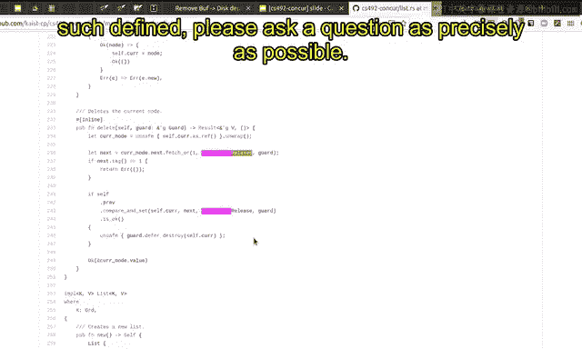

## 总结与练习

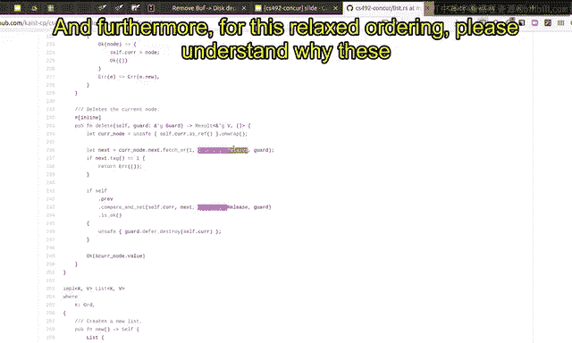

本节课中，我们一起学习了无锁链表实现中内存排序的详细分析：
*   `Acquire` 排序用于读取将在后续解引用的共享指针，以确保获得最新信息。
*   `Release` 排序用于写入共享指针，以发布最新信息并维护指针与节点之间的不变量。
*   `Relaxed` 排序可用于无需同步的场景，例如仅读取指针值、操作线程私有数据或析构时。

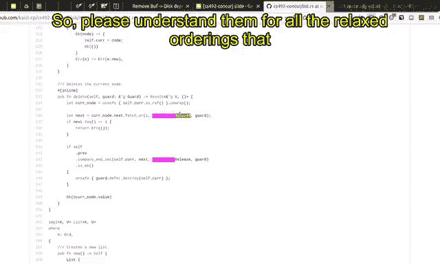

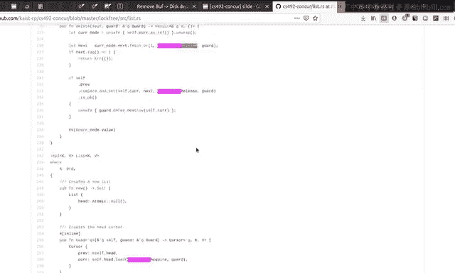

为了巩固理解，建议进行以下练习：
1.  列出代码中所有的 `Acquire`、`Release` 和 `Relaxed` 排序。
2.  对于每个 `Acquire` 和 `Release`，理解其为何必须使用该排序（基于不变量的理由）。
3.  对于每个 `Relaxed`，理解其为何可以放松排序要求。
4.  如果对任何排序的设定有疑问，请尝试精确地描述问题。

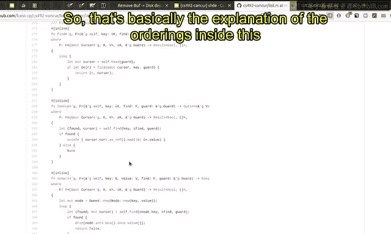

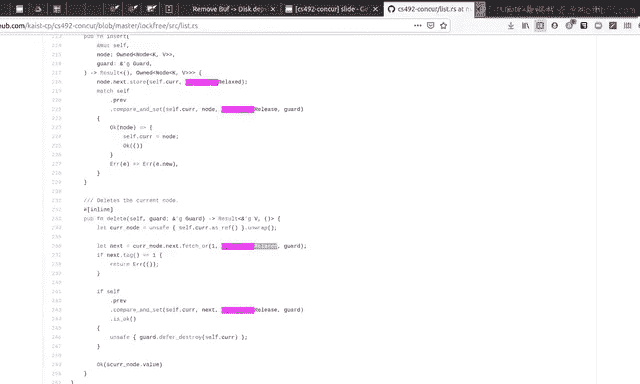

通过这样的分析，你可以深入理解并发代码中内存排序的设计逻辑，并能够自行验证其正确性。