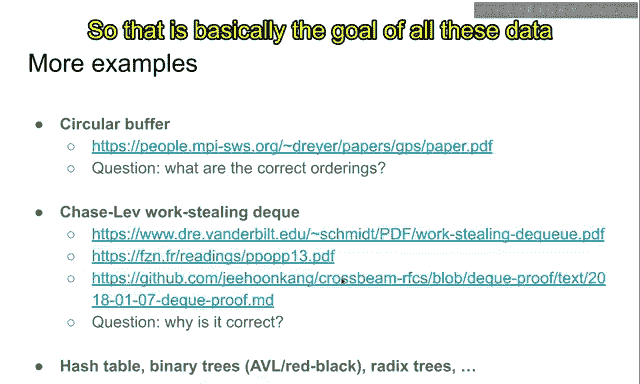
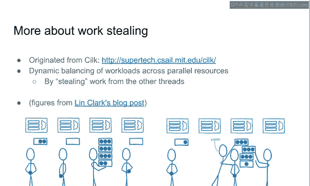
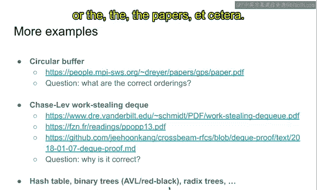

# KAIST《Rust并发编程｜CS431 Concurrent Programming 2020 fall》中英字幕（豆包翻译 - P23：-23-Other lock-free data structures.zh_en - GPT中英字幕课程资源 - BV1oi421h7b2

In this video， we are going to give some reference to the more examples of lock free data structures。

So so far we studied Q stack and inlist， and they are the most basic ones and to study the luxuryfr concurrency。

 you probably need to start with those data searchers。

But there are many other interesting data searchers， so please refer to many data searches like this。

For example， there is a circular buffer or what is usually called ring buffer。

So this per has a fixed size array and there are two ends of the Q。So in the first end。

 we are going to push value and the other end， and we are going to pop up value from that。So this。

 you can think of this This as a fixed length， fixed size， a Q or raQ。

And what is particularly interesting about this is that you are going to reuse the Q as a circle。

If you use up the buffer by pushing all the values。And then you're going to go to the first element。

And if it， it is empty， then you're going to push the value to that。

So we so the basically the buffer array is used as a ring。

The next element of the last item is the first item。

So that's the reason why it is a circular buffer or a ring buffer。

And coning buffers are very widely used among communications between， for example。

 CPU and the accelerators， CPU， GPU， a CPU， FPGA， or even the communication among the accelerators。

So this is probably the the and also this is used between useful communication between the user space and the corner space in the operating systems。

For example， if a user program want to send data to the kernel asynchronously。

It just add the item to the queue。And the queue is a circular buffer。

So that's basically what's going on in the how it can be used in the。In the。

 in many use cases of synchronous and communication among multiple agents。Also。

 there are a data structure that is called Chaselab Workling Decu。And the Q means that it is a Q。

But you can push and pop at the both end of the queue。

But explaining the queue is a little bit different。

 So a single thread can push and up from a single end。And for the other end， multiple stress are。

Able to pop data from the other end。So it is basically a step。But on another thread。

 one thread is using it as a step。But the other threads may steal an item from the other end。

The oldest Ttan may be stolen by the other threats。So that is basically stack with a stealing end。

And it is widely used in task management， as I will explain in the next slide。

So its design is described in Man， and in this article article。

 I specifically proved the correctness of this work vacuum。So so if you're interested in this。

 please read the papers and my proof about this orchestraing that queue。

And there are also hash tables， binary trees and regiistries。

 and many other concurd data search that is lock free。Among them。

 the hash table is basically the homeworkOock 5 for homeworkO 5。

 you are going to implement the split order link list， which is basically a Cond hash table。Conqued。

 resizable hash table。And in the previous semester， the homework 2 was about binary search3。

 that is concurrent， but in this semester we didn't do that。Also there are concurrent retry。

 concurrent B3， concurrent transactional tree， concurrent copy write， the data structuresers， etc。

 etc， there are so many concurrent algorithms and they all share a similar spirit that they want to allow more concurrent accesses to the different part of the data structure。

So that is basically the goal of all these data searchers and if you are interested please go go search for these data searchers and see what's going on there。

😊。

And among them today， we are going to study a little bit about orchestraing a little bit more。

As I said， Oting is a step， basically。And only one thread can push Shamp pop an item to the step。

Rell that tech is a lifeel， less seen for out。So the， the newest item is popped by the， the。

 the owner of the stack。But what is interesting about thisvocusing dec is that the other end。

 the oldest itemtan， it can be stolen by the other thread。So why this is important。

 why this notion is important is that you can dynamically distribute the menu work across multiple threads very efficiently using this work selecting that queue。

For example， may there ace stress， so this figure illustrate a stress。

And each stress has a list of work。For example， this thread has two words。

And it is working on some work。And this is working on some work， but there's no remaining work。

It has many work， it has one work， and this is working on one work。But the problem is that。Oh。

In this， this and this。This red and this red。They don't have a work。Then what do we do？

What do you do is that we want to still work from the other threat。And suppose that this。

 beles thread， it has many work。And if the other threat acknowledge that。

If you want to steal the work from this threat。That is basically picturing that there are a lot of work that is stack up here。

 and the this thread and this thread are stealing some of the work from the middle strand。

So by doing so， we can efficiently and dynamically distribute multiple work across multiple CPUs or course。

And it will achieve a very good performance even much better than static scheduling。😊。

Because it is guaranteed that no stress is just idle。If there is some work to do。

 then it is automatically distributed among multiple CPUs。As a result。

 the strawput or utilization may be increased。But in order in order for this scheme to work fast。

 we have to make sure a few。A few properties to hold。

The first thing is that we need to divide this work。A little bit， I mean， as much as possible。

 I mean， not as much as possible， but we N least needs to have many work so that they can evenly distribute to multiple stress。

Suppose that there is only one work that is very， very super big。Then even though we apply this game。

 they the only one thread can work on the big job。And its utilization will be bad。

Only if the big job can be split and distributed across multiple cores。

 the outputput will be increased。That's the reason why we are， we need to guarantee that we， I mean。

Ad you needs to split the job。But。But if we split the jobs too in in a too fine grain way。

 it it it is the case that。The synchronization among multiple CPUus。

 its cost will dominate the processing time。So we need to somehow adequately distribute the work。

If the work is for example， too fine grained and there are too many tests。

 test management cost will be going higher and higher， so we want to prevent such a case。

So it doesn't need to it， it should be。 It should not be too big。 And at the same time。

 it should not be too small。And furthermore。We need to guarantee that the threat that is owning the queue。

The threat should be firstly accessing the queue。So the walk stealing， the stealing event。

 happens very rarely。It happens only if there is a threat that is that has no more work to do。

But usually it is a very， rare event compared to the event that a thread is pushing or popping an item to its job queue。

So we need aymmetry here。If once red is accessing its own queue， it must be fast。

If the other threads are stealing the from the queue， then it can be a little bit slow。So。

 there's an asymetry。And chase left the queue is trying to exploit this sesmitry by designing the algorithm in such a way that push and pop is very fast。

😊，But stealing is a little bit， a little bit slow。So it is implemented in that way。Again。

 if you're interested， please go read the implementation and the paper about rock selling the queue。

Okay this is pretty much everything I prepared for this video。

 there are many other examples of Lockfr data searchers and the walkstanding that queue is one of the most interesting example among the multiple lockfr implementations。

😊，So if you're interested， please go study the blog post or the。The， the papers， etc cetera。

