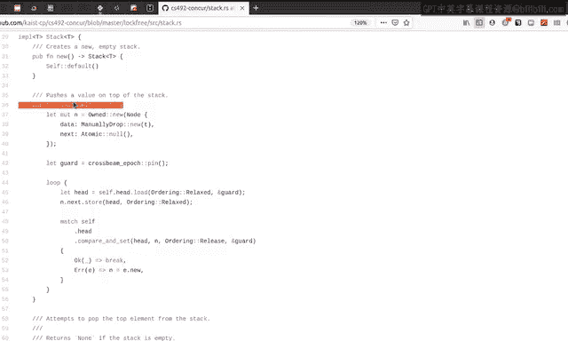
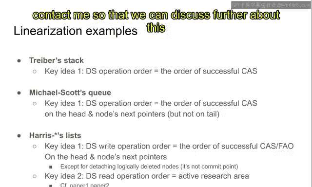
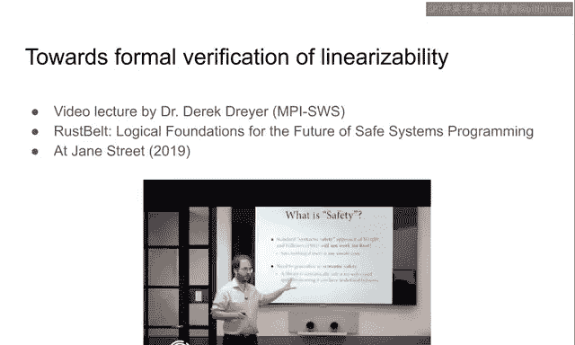
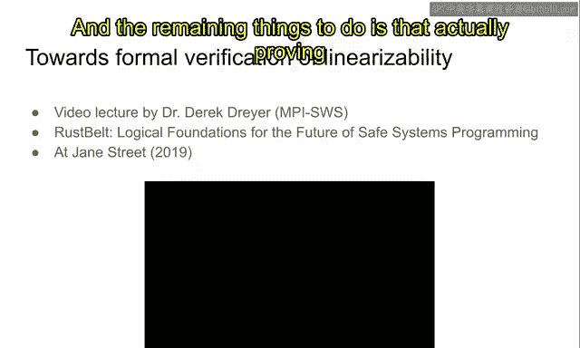
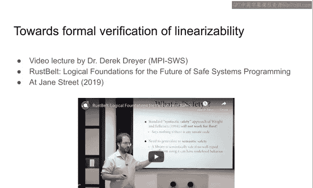

# KAIST《Rust并发编程｜CS431 Concurrent Programming 2020 fall》中英字幕（豆包翻译 - P24：-24-Linearizability.zh_en - GPT中英字幕课程资源 - BV1oi421h7b2

In this video， we are going to study the specification of concurrent data structures。

 which is usually called linearizability。As the word suggests。

 the meaning of this linear relig is that the operations。

 all the operations on a single concurren defiature can be linearized。

 or there is a total order among the operations that are just congruent with each other。

So let me explain the definition a little bit more， but before that I'd like to ask discussion。

 so what should be the right specification of a Concor data searcher？

So the con data structure is much more complicated than the sequential data structure in the fact that multiple stress may concurrently access the same data structure at the same time。

And the specification must be as simple as possible。And this specification， however。

 needs to take into account the possibility that multiple stress are concurrently accessing the same data structure at the same time。

😊，But nothing more。So the right specification， which must be simple for a conquer data structure。

 is that。Its complication over the sequential data structure specification is that。

Multiple stress may have a different order of operations。 I mean， I mean。

 multiple stress may perform concurrent operations。

 and it should be the only complication over sequential data structuress。

 It is the high level idea of to answer this question。 What is the right specification。

 It must be as simple as possible。 And。And as a result。

 the only complication of concurrency is the order of operations， nothing else。In particular。

 the order of instructions should not matter when analyzing or giving a specification to the concur datas。

 the particular instruction， particular list of instructions doesn't matter。

 It shouldn't matter in the specification because the specification should be as simple as possible and it is bad to take into account the the order of instructions。

 It is very bad specification。So as a result， we are trying to come up with a good specification for concurrenne diactures and the golden standard of this area is usually called contextual refinement。

 which means that。TheThe concurd data structures， as if an abstract data structure。

And in which they are the， you can perform operations on the abstract data search without worrying about instructions。

So these abstract data structuress have an interface that is either pushp or other data operations。

 but it should be the case that。At every time， single instruction doesn't matter in the specification of this abstract structure。

The actual concrete data structure have concrete instructions。

 and these instructions are actually executed， and it is the specification from the program languages or architecture。

😊，But the specification of this concur a itself。😊，They don't need to be related to single instructions。

What we want is that the specification is that， oh。

 it is working as if there is an abstract data structure instead of a concurrent implementation of these concurrent data structuress。

😊，And this abstract data only have a few APIs， for example。

 pushP or iteration or other kinds of highle APIs， instead of concrete instructions that will be executed in architecture or program languages。

And this contextual refinement means that the Cond data structure works as if a corresponding abstract data structure。

While even though CDS are implemented using concrete instructions。

 the specification is that they work as if it counterpart abstract data searchers， for example。

 concurrent Q， concurrent stack， or things like that。And the linear relig。

 which is usually the specification for the concurrent data structures， it is just for a kmma。😊。

For the end goal， which is the contextual refinement。And linear relig basically means that as I said。

 all the operations can be ordered according to some order。

 here we are going to say the order is R and all of these CDS operations can be ordered using this R and the order operations are congruent with each other。

So as far as this property is held， it is very easy to derive the contextual refinement。So。

Now let's study the properties of this linear re first。As I said。In an execution。

 there is a data structure and there can be multiple operations on the same data structure。

And to satisfy the linear relig， there should exist a total order。

 which I'm going to say are among all these conquered data structural operations。For example。

 if if there are five operations push， push， pop pop up。

 and then the R orders this five instruction five operations in some way， for example。

 it can be push， push， pop up， push or push， pop， pop， push， push or some just。List of operations。

 some， some reoring of these operations are such a orderdering。And further。

 this reed order R must satisfy the following three properties。The first thing is that。Okay。

 suppose that a push operation happens before another pub operation。Then in the order R。

 the push operation must be ordered before this pub operation。

And this happens before it's defined in such a way that if the view。

At the time that01 is finished is smaller than or equal to the view that is at the beginning of this operation。

 then we're going to say this01 happens before or2。So， again， the definition is that all ones。

End view is smaller than oracle to the O2th beginning view that's the the definition of happens before。

Okay， so first so good。And if such a thing happens。

 then it must be the case that01 should be strictly happening before or two。As the view suggested。

And it's the reason why we have to order a one before or2 in the linearization， total order R。

Of this linearibility criteria。So one of the examples is that if a single thread performs two instructions。

 a push and pop。Then the earlier pushing operation must be ordered before the later P operation。

So it is implied by the fact that the older push instruction happens before the later pub instruction inside a single thread。

So if that is the case， then the push should be ordered before the pub operation。

So this is the first criteria for the first course criterion for the linearization order are here。

And the second criterion is that。In order for art to be a linearization order。

 then it should satisfy this property。Which means that。Okay。

 we ordered operations for a single data structure。

And they should behave as if these ordered operations are acting against a sequential data structure。

For example， you pushed 42 to the pub。And。Let's say that another pub operation is ordered after such a push operation in this linear edition order。

Then it must be the case that the pop should give you 42。 You just push pushed 42。

 So just right after。Pop operation must return 42。It should not return， for example， sorry 3。

 because it breaks the sequential data structure specification。

The operations in the order R must be acting as if they are acting on a single sequential data structure。

Without this， we cannot say that， oh， this is a con stack because it doesn't act like a stack。

 actually。And the third criteria is a little bit more specific to concurrency， which is that。

For example， you push a value to the stack and you pop the same value from the stack。

 then the pusher and the upper must be synchronizing with each other。And as a result。

 the push operation must happen before its corresponding a pub operation。

So suppose that you pushed for it， too。And another thread popped up for it， too。

Then there is a synchronation as if there is a release and acquire synchronation。

Recall that release acquired synchronation requires that the release right happens before the acquire right by transferring the view from the pusher。

 I mean， from the release right to the message to the acquire read。

The same thing must happen here if you push a value and another thread pops the same value。

Then there should be synchronization， I' if there was a release acquired synchronization。😊。

And as a result， the view should transfer from the pressure to the underlying stack to the Pa。

So that is basically the。Requirement， the S， Y N requirement of this linearability。So， if。

An order satisfies these three properties at the same time， then that is a linearization order。And。

You can say that， oh， if on execution。If if for an execution there exists on R that satisfies these all three properties。

 then we can say that the execution is linearizable。😊。

And if a program's all executions are linearizable， then we can say that， oh。

 this program or this data structure is linearizable。😊，In other words。😊。

An implementation of data structure is linearizable， if all its executions are linearizable。😊。

And an execution is linearizable if is there exists a linear or original order for the data structure that satisfies all these properties at the same time。

So test basically the meaning of linear re。So let's understand the meaning of this from a little bit high level view。

At the high level view， the linear loglig means that。Oh， there is an execution。

 then the operations on some concretecurd data structure have resulted in some output。😊。

You push the 42 and you puff some value， you push value， you pop some value， etc cetera， et ceter。

 You performed multiple options on the list， for example， for stack。

And what is going to what linear ability mandates is that the operations result， for example。

 returning 42， returning 37， etc ceter， they should behave as if there is an underlying sequential architecture that serves the operations and the value must satisfy such a property that the all operations are congruent with each other according to some stack specifications。

So。Because this is so much close to contextual refinement from proving from this to this。

 proving from linear eligibility to contextual refinement is not that difficult。

 So the right specification for CS is contextual refinement。

 but in turn it is really similar to linear eligibility。😊。

If you are interested in the technical details of the linearlig a little bit further。

 then you can consult this document that I wrote a few years ago。

And this idea is basically illustrated with an example of。A stacked if I occur correctly。

So if you want to dig further about this， I will refer you to this document。So first second good。

Okay， in the previous slide， we discussed what is the right specification of the CSs and we just said that this is the linear re。

And now the next question is that how to prove the linearizability in the presence of a concurrent implementation。

 how to prove the concurrent， I mean， how to prove the linearizability of the given concurrent data structure。

😊，So it is actually an active area of research， even for now。

 so I don't have a decisive answer or definitive answer for this question。😊。

But there are a few wisdom that I think that you can understand。

 even without knowledgeist on the formal purifications of these concurdiaultures。Okay。

 so in order to prove the linear reibility， the first thing to do is finding the linearization order。

😊，The proof should begin with finding the linearizationization order for a given implementation and for a given valid execution。

 according to for example， promising semantics， you need to find out the linearization order among multiple operations。

And after that， you can use some logics to prove actually that the the picked order is actually linearization order。

And there are roughly two key ideas in finding a linearization order。Okay。

 the thing is that you first order right operations。For example。

 you push P our both right operations because you are actually modifying the underlying data structure。

And you order such operations according to the order of comparison of instructions。

And we are usually going to say the crucial comparison of instruction as a coming point。Okay， and。

We observe that many concur data structures when they write something to the if they modify the data structure。

 and they usually have a comparison route or other kinds of reader modify right atomic instructions。

And one of the points is actually committing the operation。

And we are going to say that is a coming point。For example。Let's say， a fun example。

In the stack implementation。When you push about you。Thenan。This comparison swap is the coming point。

If you succeed in cutting this head pointer， then you successfully push the value。Otherwise。

 if you failed in this class， then it effectively means that you fail to insert a value。

The same is true for this costs， as well。When you succeed in a class in the pub operation。

You actually succeeded in removing a value。Otherwise， if this cost fails。

 then the entire operational P has been failed。You didn't succeeded in removing an element。

So this class and this class is determining whether an operation is successful or not。

And that is usually called the Come point。And the key idea for finding out the linear addition order is that we order operations according to the execution order of these custom instructions。

😊，For example， if this instruction is executed before this instruction。

And then the corresponding push operation is ordered before the corresponding pub operation。

Otherwise， if this class operation is executed before this class operation。

Then the corresponding pub operation is happening before the corresponding push operation。

So that is basically the key idea。

So again， so in return form， the first key idea is that other right operations。

 according to their coming point execution order。Recall that not all data structures have such a coming point。

 for example， the chase left the queue Im mentioning here。

 it doesn't have a single cost operations that is regarded as a coming point。

For those kind of niche data structures， we need to find the lineareration order a little bit differently。

 but for most of the data data structures， for example， stack and Q and D here in the list。

All the right operations that smartifies the data structure， they all have coming points。

 and we need to。If we need to。啊。We can linearize the operations according to the single instruction coming point。

Okay， and let's move on to the second idea。 The second idea is that， okay。

 we have ordered those right operations that modifies the data structure。😊。

But how about the read operation。For example， a stack or queue may have is empty。Fengseng。

That checks whether the data structure is empty or not。It doesn't modify the data structure at all。

 It does text whether the data structure is empty or not。

So we cannot apply the the first key idea to such operations。 It doesn't modify at all。So。

 if that happens， then。Then we can， we can do some heuristic。 that means that。

If a reading read operation is a reading from a data that is written by some right operations coming point。

 then we can order the right operation just before the read operation。

So we are interested in from where this ri operation is from。

And we can just insert the read operation right after the corresponding on read operation that writes the value that is read by this read operation。

😊，Usually it works， especially ET in the stack N Q can be easily linearized in this way。

And you can immediately understand why this should be correct。

 It should be correct because the the result of this is empty operation is empty method is determined by the red value。

And the red value is determined by the value that is just written by the the just previous right operation。

So we， it is very natural to put the read operation right after the right operation。But as I said。

 there are a few data structures that doesn't have the coming points。And also。

it is a little bit unclear how to put a read operations to among these write operations。 I mean。

 I set a general rule of thumb or general design criteria， but it doesn't explain everything。

So there are some cases that it is a little bit difficult to pick the corresponding right operations for for a read operation。

So if that happens， we need to think a little bit more about this。

 but that is beyond the scope of this lecture， so I'd like to。

 if you're interested in this kind of topics， please contact me to study further about the lineariz of data structuress。

Okay， so far so good。And I'd like to move on to the。Examples here。Tri a stock。

The data structure order is the order of successful costs as I studied just before。

 pushush and P operations are working on the same head pointer and the order of the successful cost operation on the head pointer is the linearization order of the tri stack。

😊，On the other hand， the Micas Q in it is a little more complicated because its operations work on different locations。

But it doesn't matter regardless of there are only a single location or multiple locations the。The。

 the， the operation order for micro Sky Q， the push and pop orders is the successful cost。So。

 if push operation。Perform the class before a pub operation performing a class。

 Then they are ordered in such a way。But， but recall that in Microsoftasksq， we are。

We are helping the others by updating the tail pointer。So the tail pointer， the custom。

 the tail pointer， it doesn't matter for the operation order。Because it is not a come point。

The comic point is always on the hat pointer or the next pointer。

And the order of the cus on those head and the next pointers is the operation order。

And the up the order of the and the cast of on the tail pointer doesn't matter in the in the determining the order of the operations in the micro class queue。

Her lists a little bit more complicated。And as I said。

 the right operation orders is determined by the order of successful class or fashion or instructions。

😊，And they hat in the next pointers， and it is almost the same with the matrix class queue。And also。

 we don't need to take into account the de of detachment of the logically deleted node inside the hair list。

Because it is for happening the other thrusts， it doesn't consist of a a coming point。

So that's the reason why we need to determine the order of right operations in lists。Not with the。

 the， the， the deching detachment of the logical it he knows。

We only need to consider the successful cast on the head and of next pointers without thetachment of the logically detailed nose。

But。What is more complicated in this list is that the read operations order is really difficult to even specify。

Supose that they already so。Insert or removal operations in from the list。

And opposed that there is a concurrent travelole of the linked list。

And this traverol is effectively a read operation， but it is really difficult to figure out whether this read happens before a concurrent write。

 a concurrent push or concurrent removal or the I mean。

 it is really difficult to determine the order among those two。😊。

Because it may be possible that even though the execution of the detachment is executed before removal。

 it is possible that the。The read operation， the travels operation， may read the sta value。

That is already overre in the shared memory。But it can read from its own cache。 So it may。

 it may read a sta value that points to the already detached note。So such a thing。

 such a kind of complication is not yet resolved completely in the literature。

 in the academic literature。😊，So it is。 it remains an active research area， even to today。

So actually your TH1 and I are actively working on this kind of giving specifications for data search and the underlying garbage collectors。

 so if you're interested in this kind of research， please contact me so that we can discuss further about this kind of research project。

And furthermore， I only set the linearization order today。

And the remaining things to do is that actually proving the linear eligibility for the execution。

 given an execution and given an linear regression order。

 you need to actually prove the three criteria for the linearization order about the view and the sequential specifications and the synchronization。

😊。

And this video is a very brief tutorial on how to do that。😊。

So you're not required to understand every details of that。

 but I hope that you can grasp the general failing of what's going on in proving。

 actually proving the linearizability of a di。So this is a lecture given in the last year and， and。

 and as a。Requirement for。On attendance， I I will require you to watch this video。As。

 as well as this video， as well。

