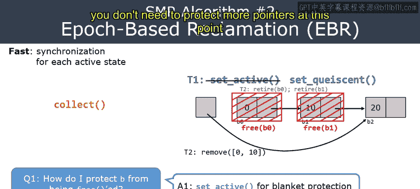
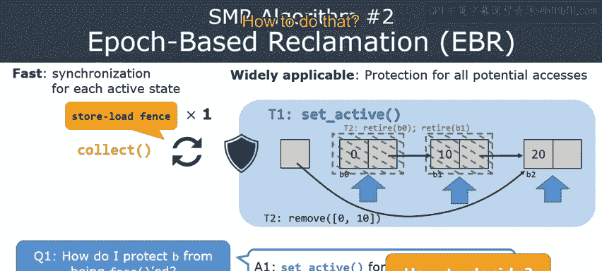
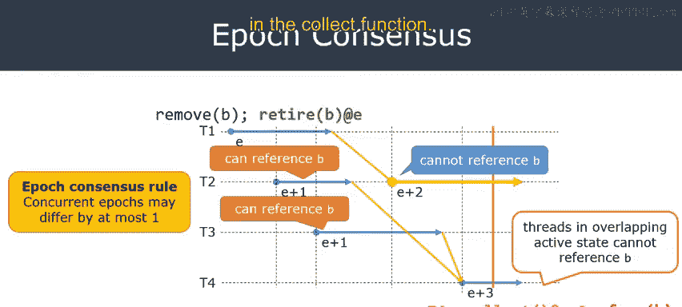
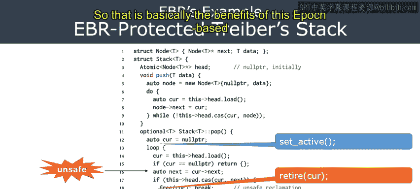
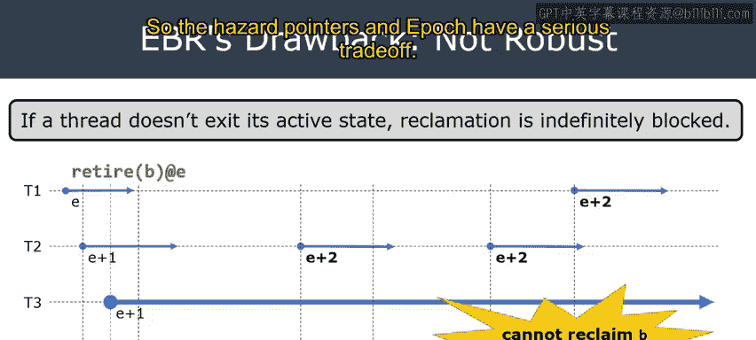
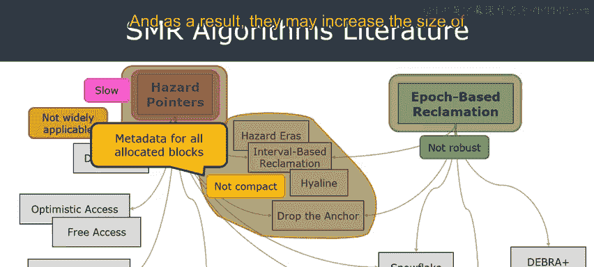
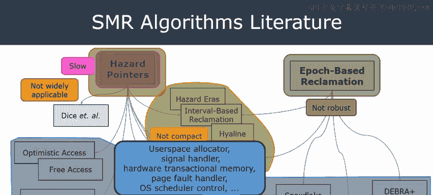

# Rust并发编程：CS431：第26讲 - 基于纪元的回收（EBR）

## 概述

在本节课中，我们将学习一种称为**基于纪元的回收**的安全内存回收算法。上一节我们介绍了危险指针算法，本节我们将探讨EBR如何解决危险指针的一些局限性，并理解其工作原理、优势与不足。

## 从危险指针到基于纪元的回收

在上一节中，我们学习了危险指针算法，用于安全地回收并发数据结构中的内存。然而，危险指针有几个显著的缺点：
1.  **难以使用**：其API较为复杂。
2.  **速度较慢**：每次迭代都需要昂贵的内存屏障。
3.  **不支持某些有用的同步模式**：例如，它不支持链式退休模式。

基于纪元的回收算法旨在解决所有这些问题。它速度更快，支持链式退休等模式，并且API更易于使用。因此，在本课程中，所有实现并发数据结构的作业都将使用EBR，而不是危险指针或其他方案。

## EBR的核心思想

所有SMR算法都需要回答两个问题：
1.  **如何从访问者的角度保护一个内存块B不被释放？**
2.  **从修改者的角度看，何时可以安全地释放内存块B？**

这两个方面相互同步。如果处理正确，我们就能在所有访问都完成后安全地回收内存。



### 问题一：如何保护内存？

在EBR中，线程通过调用一个名为 `set_active` 的函数来保护内存。这个函数提供了一种**全面保护**：它并非保护单个指针，而是保护从此刻起该线程将要访问的所有指针。

以下是一个示意图，说明了这个过程：
```
线程T1通过调用set_active保护所有指针。
由于是全面保护，T1可以安全地从头指针遍历到B0、B1、B2等节点。
```
这种机制之所以快速，是因为我们不需要在每次迭代时都发出昂贵的内存屏障。我们可能需要在 `set_active` 开始时发出屏障，但在此之后，遍历链表中的所有节点都不会产生额外成本。



### 问题二：何时可以安全释放内存？

从修改者的角度看，例如，在将内存块B从数据结构中分离后，需要调用 `free` 函数。何时可以安全执行此操作？答案是：当没有任何处于**活跃状态**的线程可能访问B时。

我们称一个线程在调用 `set_active` 后处于活跃状态。如果没有活跃线程正在访问B，那么B就不再受任何人保护，因此可以安全地释放。

假设线程T1通过将头指针从B0更新为B2，从链表中移除了B0和B1两个节点。它随后会调用 `retire` 函数，因为B0和B1已从链表分离，必须在稍后释放。目前，我们只是标记这些节点为“已退休”，以便在执行的后期阶段处理它们。

现在，负责回收的 `collect` 函数想要释放那些已退休且不受保护的节点。目前，B0和B1虽然已退休，但仍受到T1活跃状态的全面保护。T1并没有特别保护B0和B1，它只是保护了所有将要访问的指针，因此B0和B1也受到保护。

当T1完成对链表的遍历后，它会调用 `set_quiescent` 函数。这标志着T1活跃状态的结束，意味着T1不再访问共享内存块。

在 `set_quiescent` 被调用后，`collect` 函数便可以释放B0和B1，因为它们已退休，且不再受T1保护。因此，`collect` 函数可以安全地释放这两个内存块。

## EBR的优势总结

综上所述，EBR具有以下优势：
*   **速度快**：在活跃状态期间，无需为每次迭代调用昂贵的内存屏障。
*   **适用性广**：特别适用于链式退休等同步模式。即使B0和B1已被链式退休，T1仍然可以安全地遍历它们，因为它们受到 `set_active` 的全面保护。
*   **易于使用**：其API比危险指针更简单。我们只需要标记并发访问的开始和结束，并将 `free` 替换为 `retire` 即可。

## 深入原理：纪元共识

现在，我们需要更深入地回答：其他线程如何推断出内存块B不能被任何活跃状态访问？

EBR的高层思想基于**纪元共识**。以下是其核心规则：

1.  **活跃状态**：每个线程通过调用 `set_active` 和 `set_quiescent` 来标记其开始和结束访问共享内存块的范围。指针不应在同一线程的不同活跃状态之间共享。
2.  **纪元标注**：每个活跃状态都被标注一个**纪元**。纪元本质上是一个时间戳，是一个从0开始的自然数（如10，11，100）。新活跃状态的纪元由算法自动分配。
3.  **纪元共识规则**：**并发活跃状态的纪元最多只能相差1**。例如，如果线程T1的活跃状态纪元为E，那么与其并发的线程T2的活跃状态纪元必须是E或E+1，不能是E+2或更大。

这个共识规则是EBR算法安全性的核心。没有它，我们就无法保证算法的安全性。

## 何时释放内存？纪元+3规则

在理解了纪元共识规则后，就很容易回答第二个问题了：何时可以安全释放内存块B？



假设内存块B在一个纪元为E的活跃状态中被退休。那么，**在纪元E+3时，可以安全地释放B**。

这个“+3”看似神奇，但可以通过下图解释：
```
假设B在纪元E的活跃状态中被退休。
- 在纪元E或E+1，其他线程仍可能引用B，因为B被移除的信息可能尚未传播。
- 在纪元E+2，根据纪元共识规则，标注为E+2的活跃状态必须发生在标注为E的活跃状态之后（因为它们相差2，所以不并发）。因此，E+2的活跃状态不应再引用B。
- 在纪元E+3，所有对B的引用都必须发生在E+3开始之前。并且，所有并发线程的纪元至少为E+2，它们都不应引用B。因此，此时可以安全释放B。
```
因此，只要满足纪元共识规则，在退休纪元加3的时刻释放内存就是安全的。不同的EBR变体可能有不同的具体规则，但核心思想是相似的。

## 如何将EBR应用到并发数据结构

将EBR应用到并发数据结构（如栈的`pop`操作）非常简单。与危险指针相比，所需的改动更少。

以下是需要插入的指令：
1.  **在开始访问共享内存之前**，调用 `set_active`。例如，在`pop`操作中，在进入循环访问栈顶节点之前调用。
2.  **在结束所有共享内存访问之后**，调用 `set_quiescent`。例如，在`pop`操作完成并离开循环之后调用。
3.  **将直接的 `free` 调用替换为 `retire`**。这样，EBR算法会在确保所有线程都完成访问后，再实际释放内存。

相比之下，危险指针要求在使用前保护每个单独的指针，并在保护后验证指针是否仍然有效，这更容易出错。而EBR只需标记并发访问的边界，大大简化了使用。



## EBR的缺点：缺乏健壮性

然而，EBR有一个显著的缺点：它**不够健壮**。如果某些线程行为不当，可能会无限期地延迟内存的释放。

考虑一个场景：一个“坏”线程T3进入活跃状态（纪元E+1）后，永远不调用 `set_quiescent` 来结束其活跃状态。根据纪元共识规则，所有后续线程的纪元最多只能是E+2（因为与E+1并发）。因此，纪元无法推进到E+3。



回想一下，在纪元E退休的内存块B，需要等到纪元E+3才能被释放。由于纪元被T3卡住，B将永远无法被回收。这意味着，单个行为不当的线程就可以阻塞整个系统的内存回收。


## 总结：危险指针与EBR的权衡





本节课我们一起学习了基于纪元的回收算法。我们来总结一下危险指针与EBR的主要特点：

| 特性 | 危险指针 | 基于纪元的回收 |
| :--- | :--- | :--- |
| **速度** | 较慢（每次迭代需屏障） | **较快**（全面保护，减少屏障） |
| **适用性** | 有限（不支持链式退休等） | **广泛**（支持多种模式） |
| **易用性** | 复杂（需保护单个指针并验证） | **简单**（标记开始/结束即可） |
| **健壮性** | **健壮**（个别线程不影响回收） | 不健壮（坏线程可阻塞回收） |

这两种算法代表了不同的权衡。后续的许多研究试图结合两者的优点，但通常难以同时满足所有理想属性（快速、广泛适用、健壮、紧凑、可移植等）。


课程最后简要介绍了一项新研究——指针与纪元结合的重声明，它试图同时满足所有这些属性。但鉴于其复杂性，本课程不深入讨论。希望本节课能帮助你理解危险指针和基于纪元的回收这两种最基本、最古老的安全内存回收算法。