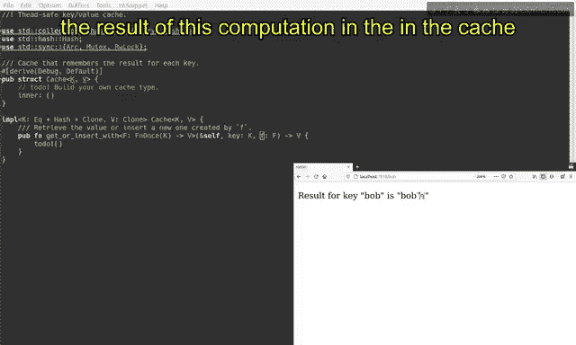
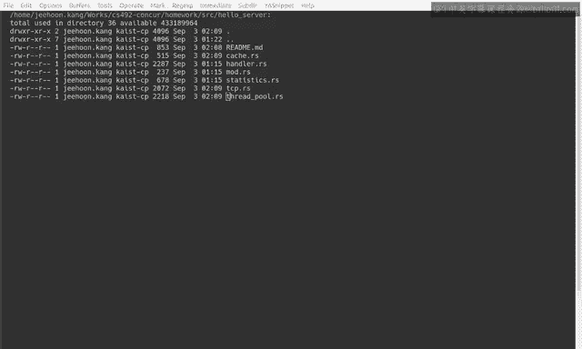

# Rust并发编程：CS431：作业1 - 并行Web服务器 🚀

在本节课中，我们将学习如何完成作业1：实现一个并行的Web服务器。我们将了解服务器的基本功能、提供的骨架代码结构，以及需要你亲自实现的三个核心组件：**缓存**、**可取消的TCP监听器**和**线程池**。

## 概述

作业要求实现一个支持并发的Web服务器。该服务器能够处理HTTP请求，对耗时计算的结果进行缓存以提升性能，并能优雅地关闭并打印访问统计信息。我们已为你提供了大部分骨架代码，你的任务是完成三个关键部分的实现。

## 服务器功能演示

在 `homework1` 目录下，你可以使用命令 `cargo run -- hello server` 来运行服务器。

启动服务器后，它会打印一些日志。当你在浏览器中访问 `localhost:7878` 时，服务器会返回一个错误页面。如果你访问一个有效路径，例如 `/alice`，服务器会先执行一个耗时的计算（导致几秒钟的延迟），然后返回页面结果。

关键在于，计算结果会被缓存。因此，首次访问 `/alice` 会有延迟，但刷新页面时，结果会立即从缓存中返回。同样，首次访问 `/bob` 会再次触发耗时计算和延迟，但随后的刷新会立即得到响应。

当你想终止服务器时，可以按下 `Ctrl+C`。此时，服务器会打印出访问统计信息，例如各个页面的访问次数。

## 代码结构解析

上一节我们了解了服务器的外部行为，本节中我们来看看其内部的代码架构。骨架代码主要位于 `src/lib.rs` 文件中。

`main` 函数是程序的入口点，它负责协调各个组件：
1.  创建一个包含7个工作线程的**线程池**。
2.  建立用于在线程间传递任务和报告的信道。
3.  创建一个**可取消的TCP监听器**，绑定到 `localhost:7878`。
4.  当按下 `Ctrl+C` 时，会触发监听器的取消操作，从而清理所有资源。

服务器主要包含以下几种并行执行的线程：
*   **监听器线程**：接受新的TCP连接。
*   **工作线程**（属于线程池）：处理具体的HTTP请求。
*   **报告器线程**：收集并统计访问报告。
*   **主线程**：协调以上所有线程。

这些线程通过 `crossbeam` crate 提供的**无界和有界信道**进行通信，共同实现了一个真正的并行Web服务器。

## 需要实现的组件

了解了整体架构后，现在我们将聚焦于你需要完成的三个核心部分。

### 1. 缓存实现

缓存是一个键值存储，核心方法是 `get_or_insert_if`。其逻辑是：根据键查询值，如果存在则立即返回；如果不存在，则执行提供的闭包函数来计算值，将结果存入缓存后返回。

这个闭包函数可能非常耗时（例如需要几秒钟），因此缓存结果对性能提升至关重要。



以下是该方法的签名：
```rust
fn get_or_insert_if<F>(&self, key: K, f: F) -> V
where
    F: FnOnce() -> V,
```
你需要实现这个结构体和方法，确保在并发访问下的正确性。

### 2. 可取消的TCP监听器

我们需要在标准库 `TcpListener` 的基础上封装一个可取消的版本 `CancelableTcpListener`。

它需要提供与底层监听器相同的API，但额外增加一个 `cancel` 方法。`cancel` 方法需要设置一个取消标志，并**唤醒可能被阻塞在 `accept` 操作上的监听器线程**。

在 `next` 方法（用于获取下一个连接流）中，需要检查取消标志。如果标志为真，则返回 `None` 表示连接流已终止；否则，返回底层监听器的下一个连接流。

这里涉及到原子操作与内存顺序：
*   在 `cancel` 方法中写入标志时，使用 **`Release`** 顺序。
*   在 `next` 方法中读取标志时，使用 **`Acquire`** 顺序。
内存顺序的详细含义将在后续课程中讨论，目前请按此要求实现。

### 3. 线程池实现

线程池管理一组工作线程。其核心API包括：
*   `new(size)`: 创建一个指定大小的线程池。
*   `execute(job)`: 向线程池提交一个任务（闭包）来执行。
*   `join()`: 等待所有已提交的任务执行完毕。

实现思路是，在线程池和工作线程之间建立一个**信道**。`execute` 方法将任务发送到信道中，每个工作线程则循环从信道中接收任务并执行。

为了实现 `join` 方法，你需要一个机制来跟踪**正在进行的任务数量**。当这个数量降为0时，`join` 方法才可以返回。

本课程最终的期末项目也是关于实现线程池，你可以从那里借鉴许多代码。

## 总结



本节课中，我们一起学习了第一个作业：并行Web服务器的实现。我们分析了服务器的功能、骨架代码的整体结构，并明确了需要你完成的三个核心组件：**缓存**、**可取消的TCP监听器**和**线程池**。实现这些组件后，你就能运行一个如演示所示的、支持并发处理和结果缓存的高效Web服务器了。