# Rust并发编程：P6：Rust语言基础与所有权模型 🦀

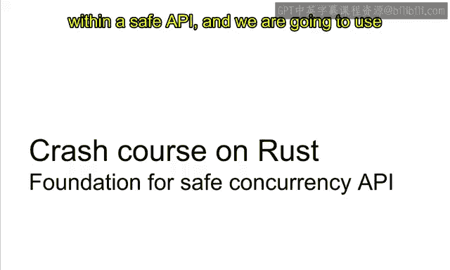

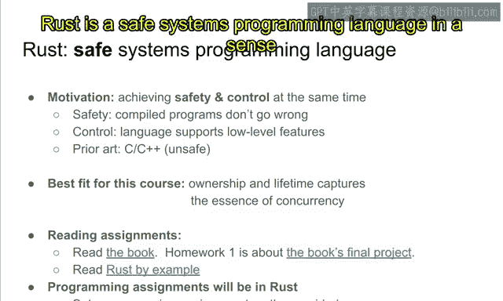

在本节课中，我们将学习Rust语言，它将成为我们进行并发编程的安全基础。Rust提供了一种方法，可以在安全的API内部封装所有不安全的操作。我们将学习如何做到这一点。

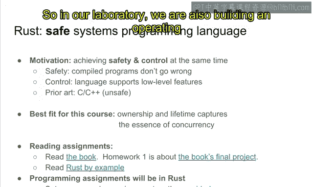

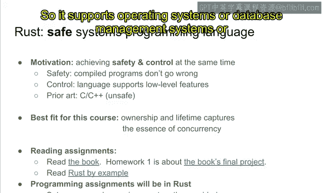

## 概述：为什么选择Rust？

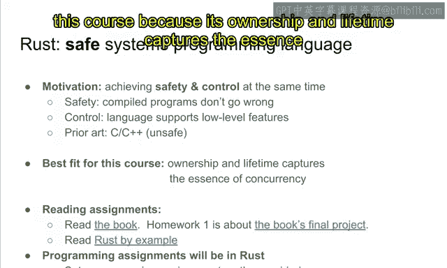

Rust是一种安全的系统编程语言。它让程序员能够在无需担心底层实现细节的情况下，实现绝对的安全性。

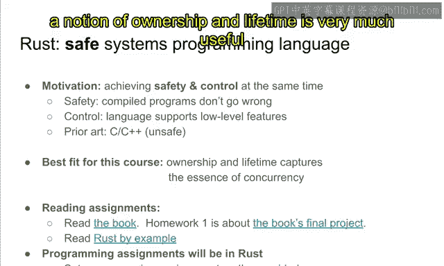

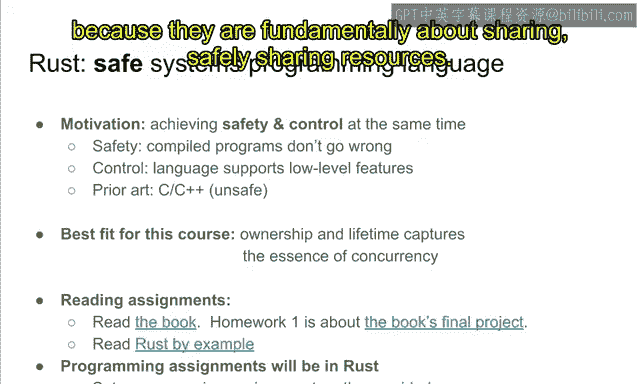

其核心动机在于，C++是不安全的，这正是Rust诞生的原因。Rust的目标是同时实现**安全**和**控制**。


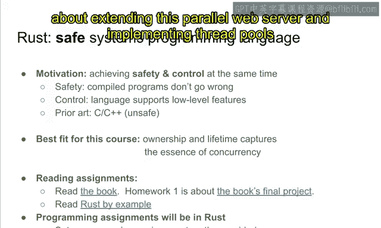

*   **安全**意味着：如果你编写的Rust程序满足某些条件，那么编译器保证，当你将其编译为汇编程序时，该程序不会出错。这是由编译器和类型系统保证的。
*   **控制**意味着：它支持所有必要的低级编程特性，例如操作系统开发。在我们的实验室中，我们也在Rust之上构建操作系统。它支持操作系统、数据库管理系统或所有其他类型的系统编程。

为了实现这一目标，现有的技术是C和C++，但它们非常不安全。正如我们在之前的视频中讨论的，你可以很容易地“搬起石头砸自己的脚”，例如，在自旋锁内部泄漏一个指针。C/C++无法检测到这种不安全的API使用方式。这是C/C++与Rust之间的主要区别。

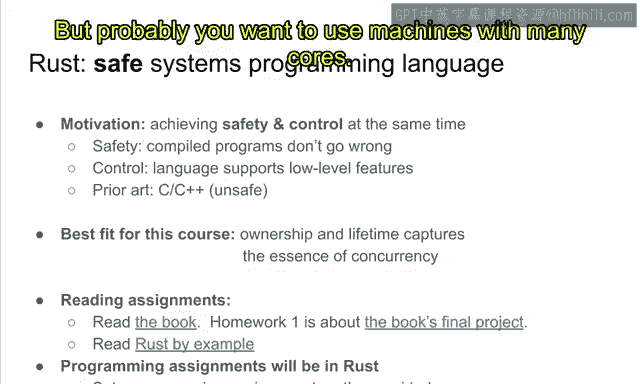

Rust非常适合本课程，因为它的**所有权**和**生命周期**概念抓住了并发的本质。回想一下，并发从根本上讲是关于**共享可变状态**的。为了推理这些共享可变状态，**所有权**和**生命周期**的概念非常有用，因为它们从根本上关乎如何安全地共享资源。Rust提供了这样的工具，我们将用它来编写并发程序。

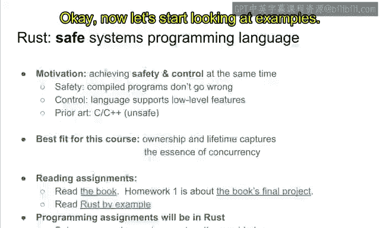

## 课程安排与准备 📚

以下是本课程的一些阅读和编程作业安排。

**阅读作业：**
*   阅读《The Rust Programming Language》一书。该书包含约20章，每章不长。读完所有章节后，最后一章是关于构建一个并行Web服务器的。
*   作业一是关于扩展这个并行Web服务器，实现线程池、缓存和并发请求处理器。为了完成作业一，你可能需要阅读整本书。
*   第二个阅读作业是阅读《Rust by Example》一书，它列举了许多Rust程序示例。这些示例让你能获得关于Rust编译器和类型系统的实践经验，它们比《The Rust Programming Language》更实用。

**编程作业：**
本课程中预计有五到六个编程作业。所有编程作业都将使用Rust完成，因此你需要为作业编写一些Rust程序。请设置好你的编程环境（我们提供的服务器或你自己的机器）。我们仅支持Ubuntu 20.04，任何运行该版本的机器都可以，但你可能希望使用具有更多核心的机器，这也是我们提供服务器的原因。无论如何，请设置编程环境，并确保你可以编译和运行示例（例如，一个“Hello World”程序或作业零的Web服务器）。

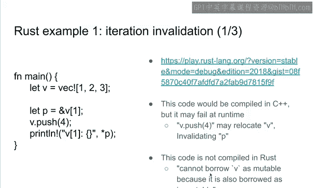

## Rust的核心示例：所有权与借用

现在，让我们通过一个示例来了解Rust的强大之处。以下是一个展示Rust所有权系统如何工作的例子。

```rust
fn main() {
    let mut v = vec![1, 2, 3]; // V 是大小为3的向量的所有者
    let p = &v[0]; // P 不可变地借用向量的第一个元素
    v.push(4); // 尝试可变地借用 V 以推送值4
    println!("{}", p); // 尝试读取 P 指向的值
}
```

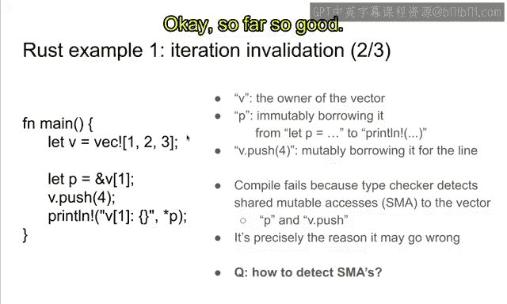

这段代码在C++中可以编译（尽管是糟糕的代码），但在Rust中无法编译。编译器会报错：`cannot borrow `v` as mutable because it is also borrowed as immutable`。

**原因分析：**
`push`操作可能导致底层向量重新分配内存。如果发生这种情况，指向第一个元素的指针`p`可能会失效，因为它指向的是旧的内存区域。这可能导致解引用未使用的内存区域，从而引发错误。

Rust编译器通过所有权规则在编译时检测到了这种潜在冲突：
1.  `v`是向量的所有者。
2.  `p`在第3行**不可变地借用**了向量`v`（获取了引用）。
3.  在第4行，`v.push(4)`试图**可变地借用**同一个向量`v`。
4.  从第3行到第5行，`p`的生命周期与`v.push(4)`的生命周期在第4行**重叠**。
5.  根据Rust规则：一个资源要么可以被多个代理**不可变地借用**（只读），要么只能被一个代理**可变地借用**（读写），但不能同时存在可变借用和不可变借用。
6.  这里`p`（不可变借用）和`v.push`（可变借用）试图同时访问`v`，违反了规则，因此编译器拒绝编译。

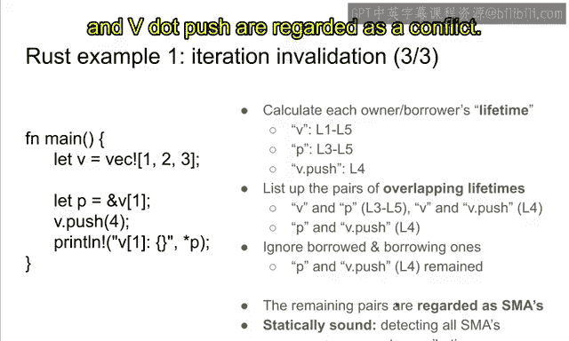

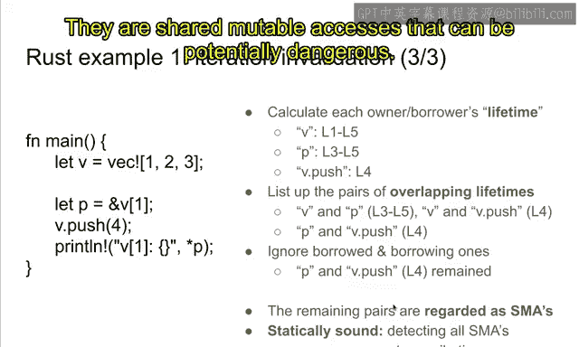

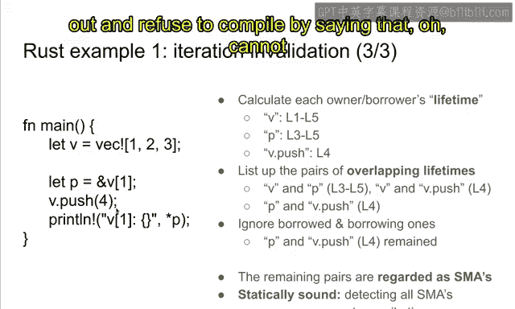

这种推理是**静态可靠**的。在编译时，你可以在不遗漏任何冲突的情况下，检测出所有冲突的共享可变访问。虽然它可能因为无法分析某些复杂关系而**拒绝**一些实际上是安全的程序（即不完全），但在实践中，通过稍微调整代码结构来满足所有权规则通常并不困难。

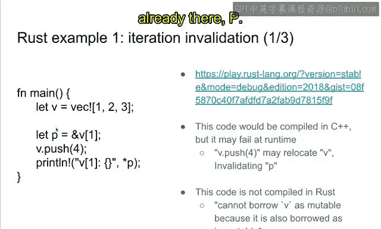

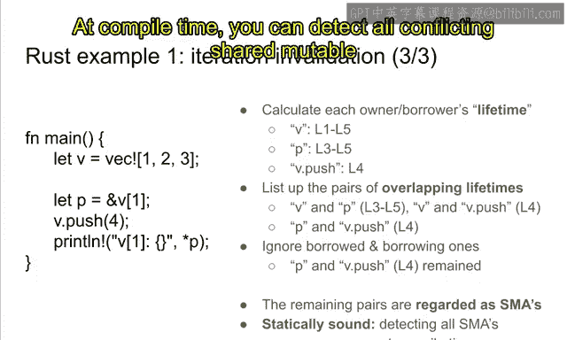

## Rust的所有权原则 🧱

上一节我们通过示例看到了所有权冲突。本节中，我们来深入理解其背后的核心概念。

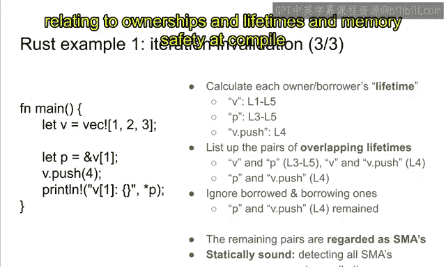

Rust的关键概念是**所有权**。所有权是一个代理访问和销毁资源的能力。如果你拥有一个资源（例如一个向量）的所有权，那么你可以安全地销毁它，或者向其中推送/弹出值。

默认情况下，所有权是**独占**的。这意味着如果我拥有一个向量，那么其他人就不能拥有它。该向量只归我所有。

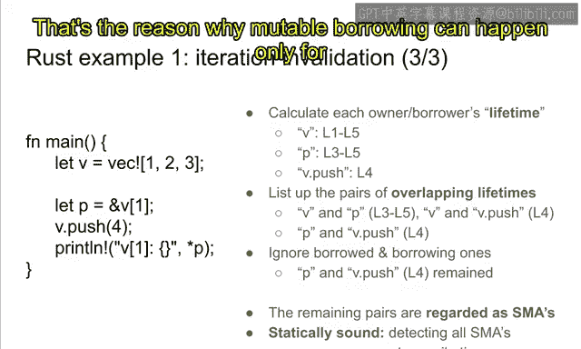

但为了允许共享，所有权可以被**借用**。即使对一个向量的所有权是独占的，它也可以被借用。
*   它可以被**可变地借用**给一个单独的代理。
*   或者被**不可变地借用**给多个代理。

这个想法非常适合并发，因为每个线程都可以被视为一个代理。通过借用规则，你可以相当确定一个资源不能同时被共享和修改。因为一个资源要么只能被一个代理可变地借用，要么可以被多个代理不可变地借用。

Rust编译器静态地强制执行这一规则：**默认情况下，不允许对底层资源进行共享可变访问**。类型系统在这里强制规定：要么可变地借给单个代理，要么不可变地借给多个代理。

这很容易使用，因为如果你违反了任何所有权规则，编译器会报告每一个违规。你可以立即知道问题出在哪里，并轻松定位和修复。正如所说，它在静态意义上是**正确**的，因为如果一个程序通过了Rust编译器的类型检查，那么它保证在任何情况下都不会出错。

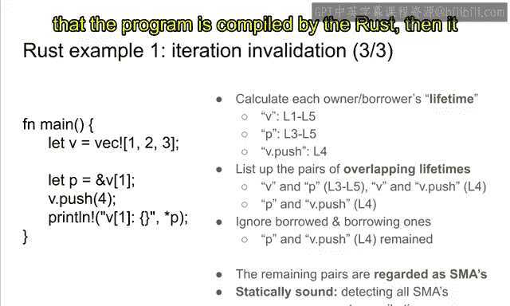

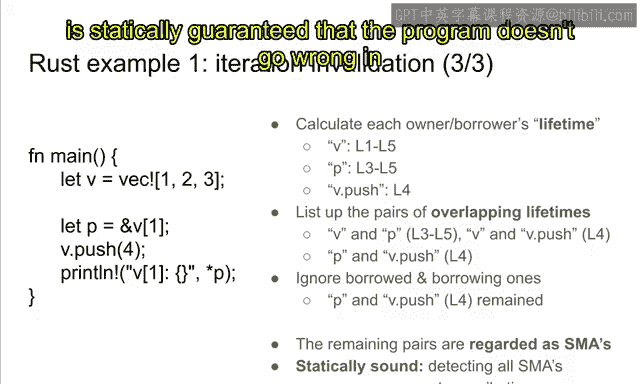

## 内部可变性：安全地打破规则 🔧

到目前为止，我们解释了所有权原则。但对于并发编程，我们特别需要第三个概念：**内部可变性**，它允许我们在安全的前提下“弯曲”规则。

其动机在于，“无共享可变访问”这条规则对于并发编程来说**太强**了。在实际的并发程序中，它永远不会被满足。例如，如果你有一个在多个线程间共享的栈，那么这个栈资源显然会被多个线程同时修改。这里确实存在共享的可变访问。我们需要**驯服**它，但不能简单地移除它，因为这是共享栈的本质。

我们在Rust中可以期望的是：我们可以系统地“弯曲”规则，允许对栈进行共享可变访问，但以一种**系统安全**的方式进行。共享可变访问在并发中是不可避免的，但你可以驯服它。

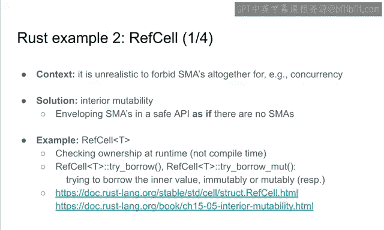

**核心思想是：将可能不安全的实现封装在安全的API之内。**
例如，一个并发栈的实现可能使用了非常复杂、不安全的底层操作，Rust编译器无法分析其绝对安全性。但我们可以做的是，确保其**API是完全安全的**。栈的用户无需了解实现的所有细节，也能编写出安全的程序。用户只知道API，只要按照API使用，就能保证程序不会出错。任何这些API调用的组合都不会导致错误。

这就是**内部可变性**的意义。本质上，内部可变性所强制实施的是：从使用API的用户角度来看，并发栈的工作方式**就好像没有共享可变访问一样**。API给人的感觉是没有共享可变访问。

### 示例：`RefCell`

`RefCell`是内部可变性的第一个例子。它基本上包含一个值，你可以借用或可变地借用它。但与通常的引用不同，你可以在同一时间（通过运行时检查）可变地借用和借用它。

考虑以下场景：有两个函数`f1`和`f2`，根据某些复杂的不变量，它们不会同时返回`true`。Rust编译器在编译时无法分析`f1`和`f2`的具体值，因此它会保守地认为可能存在冲突，从而拒绝程序。但作为程序员，你知道根据不变量，程序实际上是安全的。

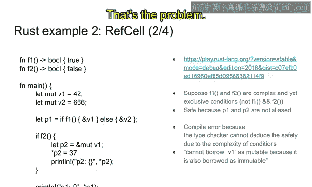

这时，你可以使用`RefCell`。`RefCell`在**运行时**检查借用规则。`try_borrow_mut`方法会尝试可变地借用底层值，如果当前已被借用（无论是可变还是不可变），它会失败（返回`Err`）。这样，程序就可以在满足运行时条件的情况下安全执行。

**总结：** `RefCell`提供了一种内部可变性，它在安全的类型中封装了共享可变访问（这些访问在编译时无法被分析）。其API之所以安全，是因为在API层面，它表现得好像没有共享可变访问。`try_borrow_mut`表现得像是在不可变地借用底层值，即使它实际上是在可变地借用。这个实现本身可能是不安全的，但Rust无法推理其实现。关键在于，如果实现经过程序员检查确认正确，那么所有可能的API使用方式都是安全的。

为了实现内部可变性，你需要使用`unsafe`关键字来包装实现。`unsafe`是连接“无共享访问的API”和“有共享可变访问的实现”之间的桥梁。`unsafe`就像一个标签，表明程序员需要手动检查所有`unsafe`代码块的安全性。Rust编译器不保证这些`unsafe`块的安全性，但用户只需要检查这些标记出来的片段即可。

## 并发示例：安全的锁 🛡️

最后，我们来看一个与并发相关的例子。如前所述，C++的锁是不安全的，因为它可以解引用底层值，并且其指针可能被泄漏。但这不应该发生，因为在释放锁之后，根本不应该再访问底层值。

为了在Rust中禁止这种情况，它实现了所谓的`Deref` trait。你可以从锁保护对象（`MutexGuard`）中解引用出底层值。但解引用得到的引用有一个**生命周期**，它不能超过保护对象本身。这是由Rust类型系统保证的。

例如，以下代码试图让一个引用（`data_ref`）的生命周期超过其来源的保护对象（`guard`），Rust编译器会检测到这种所有权/生命周期问题并拒绝编译。

```rust
// 假设的伪代码，展示概念
let guard = mutex.lock().unwrap();
let data_ref: &i32 = &*guard; // 从guard解引用得到引用
drop(guard); // 提前释放guard
println!("{}", data_ref); // 错误！data_ref的生命周期不能超过guard
```

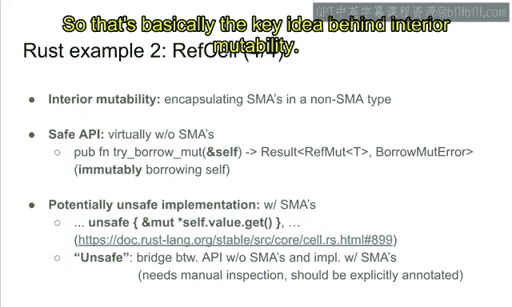

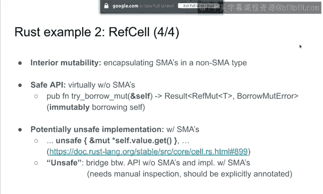

正如你所见，所有像这样的并发难题都可以用Rust类型来推理。这就是为什么我们将使用Rust作为本并发课程的实现语言。

## 总结与下节预告 🎯

本节课我们一起学习了Rust的所有权类型系统。Rust的动机是在存在共享可变资源的情况下，同时实现**安全**和**控制**。

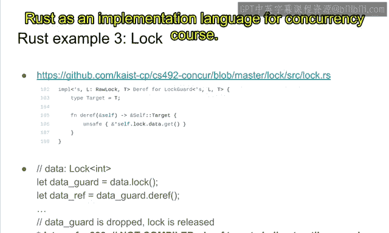

Rust的关键思想是：
1.  **首先强制执行所有权规则**：默认情况下，这意味着不应该有共享可变访问。
2.  **同时允许通过内部可变性来“弯曲”规则**：这允许你以非常受控的方式管理共享可变访问。

其好处是：
*   你可以安全地分析可变访问的安全性。如果内部可变性在一个类型（例如锁或`RefCell`）中安全地实现，那么该库的用户就不再需要担心程序的安全性，他们可以安全地使用而无需任何顾虑，因为API是安全的。如果底层不安全的实现是正确的，那么所有可能的API使用方式都是安全的，这是由Rust编译器保证的。
*   其次，存在不安全的实现，但它们被明确标记了出来。你只需要手动检查那些代码，而不用担心其余代码的安全性。

这正是我们将使用Rust进行并发编程（其核心就是共享可变访问）的两个主要原因。

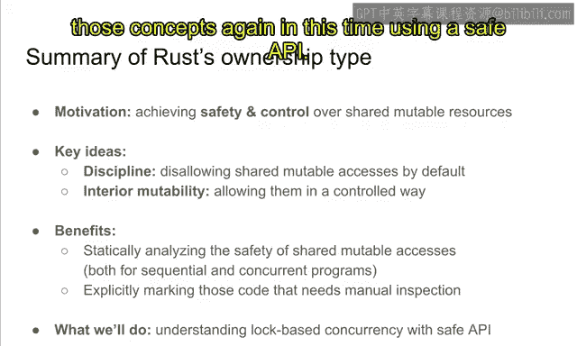

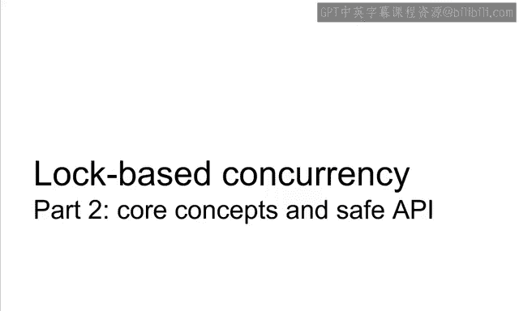

在下一讲中，我们将继续学习基于锁的并发，但这次是使用安全的API。你们许多人已经知道线程、原子变量、互斥锁或条件变量，但这次你们将使用安全的API重新学习这些概念。这将是下一个视频的主题。