# Rust并发编程：P7：基于锁的并发与std库API 🧵

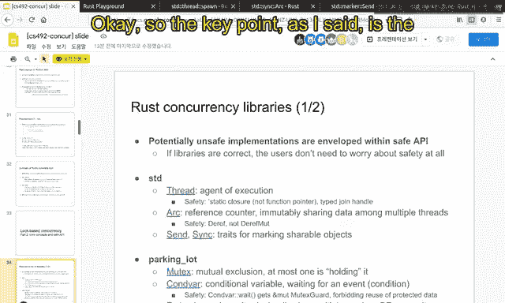

在本节课中，我们将要学习Rust标准库（std）中提供的一些核心并发原语。这些库的关键在于，虽然其内部实现可能涉及不安全代码，但它们通过安全的API封装起来。这意味着用户在使用这些API时，完全无需担心其内部实现的安全性，只要正确使用API，就不会引发未定义行为或其他不安全行为。这是Rust提供的关键抽象。

接下来，我们将通过一个具体的示例程序来逐步解析这些API。

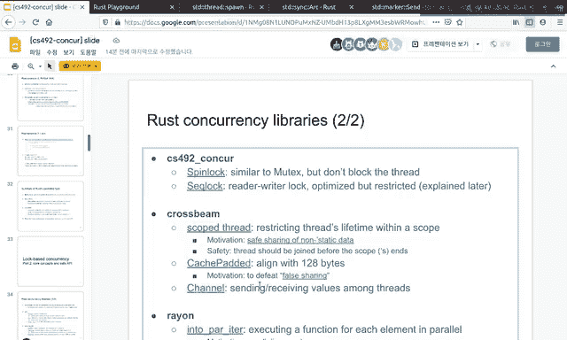

## 示例程序解析

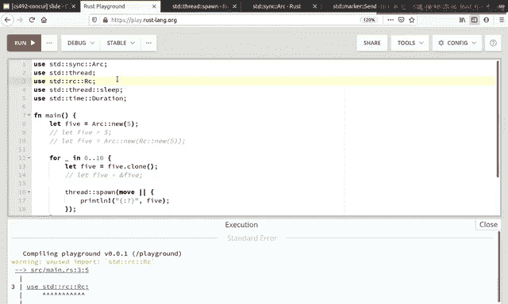

以下是一个使用`std::thread`和`Arc`（原子引用计数）的简单并发程序：

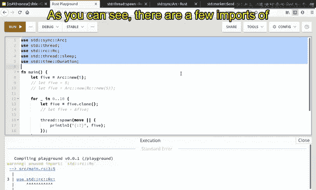

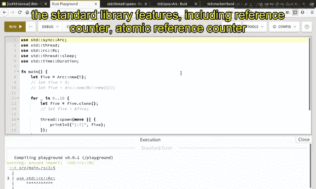

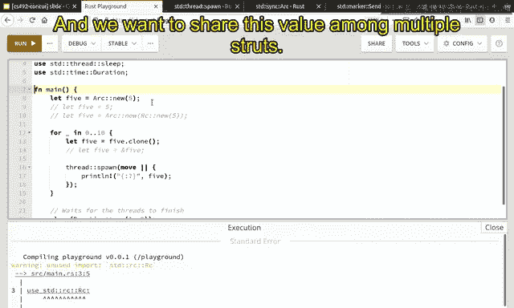

```rust
use std::sync::Arc;
use std::thread;
use std::time::Duration;

fn main() {
    let five = Arc::new(5);
    for _ in 0..10 {
        let five = Arc::clone(&five);
        thread::spawn(move || {
            println!("{}", five);
        });
    }
    thread::sleep(Duration::from_secs(1));
}
```

这个程序创建了一个值为5的`Arc`，然后循环10次，每次克隆这个`Arc`并生成一个新线程。在每个线程中，打印出`Arc`持有的值。最后，主线程休眠1秒等待所有子线程完成。

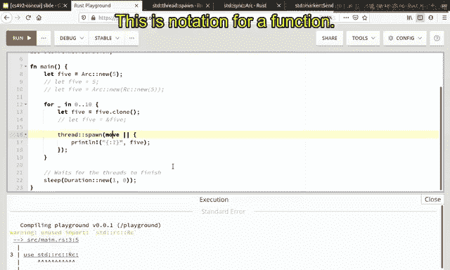

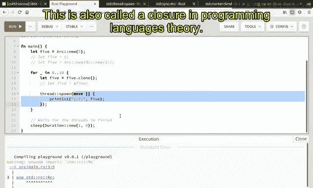

上一节我们介绍了程序的目标，本节中我们来看看其内部工作原理。

### `Arc`（原子引用计数）的工作原理

`Arc<T>` 是一个线程安全的引用计数指针。它的核心作用是允许多个线程安全地共享同一数据的所有权。

*   **初始状态**：当 `let five = Arc::new(5);` 执行时，创建了一个指向整数5的`Arc`，其引用计数为1。
*   **克隆（Clone）**：在循环中，`let five = Arc::clone(&five);` 会**增加**底层数据的引用计数（从1变为2），并返回一个新的`Arc`实例。这个新实例指向同一个整数5。
*   **移动（Move）到线程**：`move`关键字表示闭包将获取（移动）其捕获变量的所有权。这里，新克隆的`Arc`实例被移动到新生成的线程中。
*   **线程结束与丢弃（Drop）**：当每个线程执行完毕，其作用域内的`Arc`变量会被丢弃。`Arc`的`Drop`实现会**减少**引用计数。
*   **最终清理**：循环结束后，主线程中原始的`five`变量（引用计数为1）在`main`函数结束时被丢弃，引用计数减为0，此时底层数据`5`才被真正释放。

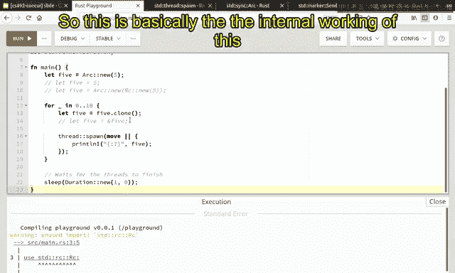

因此，整个过程中引用计数的变化是：初始1 -> 克隆10次后变为11 -> 10个子线程结束各减1 -> 主线程结束减1 -> 最终为0并清理数据。

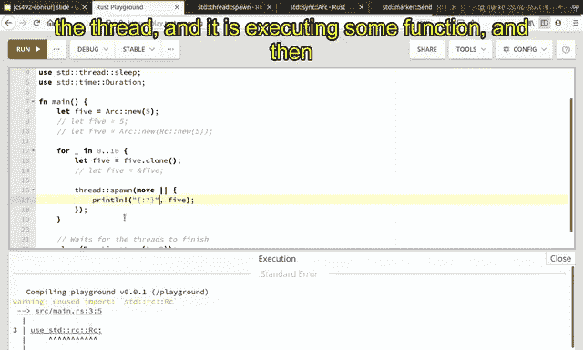

## 核心API详解

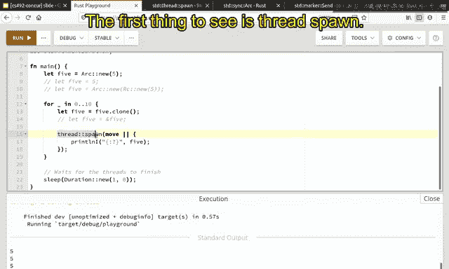

理解了示例的流程后，我们来深入看看其中用到的几个核心API及其约束。

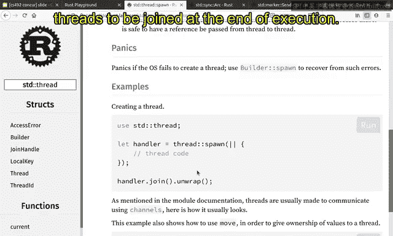

### 1. `std::thread::spawn` API

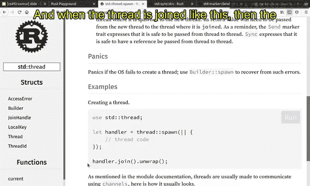

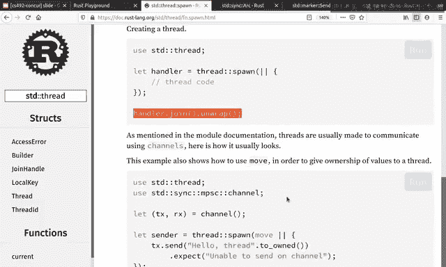

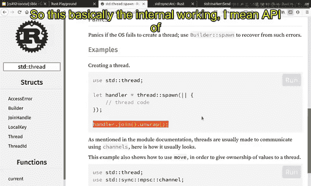

`spawn`函数用于生成一个新线程。它的函数签名精确定义了安全使用的条件：

```rust
pub fn spawn<F, T>(f: F) -> JoinHandle<T>
where
    F: FnOnce() -> T + Send + 'static,
    T: Send + 'static,
```

以下是该函数签名中各个约束条件的解释：

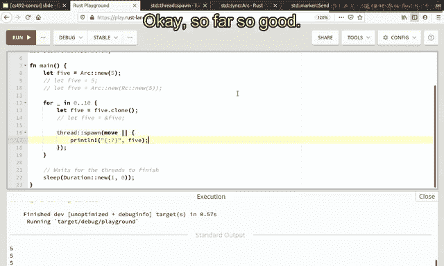

*   **`F: FnOnce() -> T`**：参数 `f` 必须是一个可调用一次（`FnOnce`）的闭包或函数，它不接受参数并返回一个类型为 `T` 的值。
*   **`F: Send + 'static`**：闭包 `f` 必须满足两个特质（Trait）约束。
*   **`T: Send + 'static`**：闭包的返回值 `T` 也必须满足同样的约束。

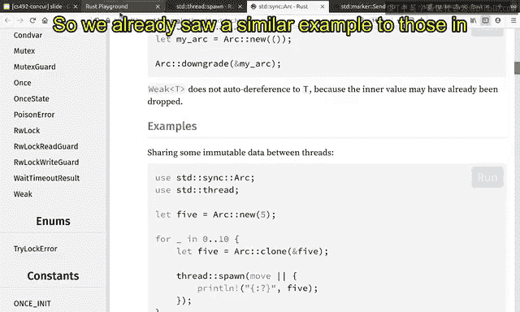

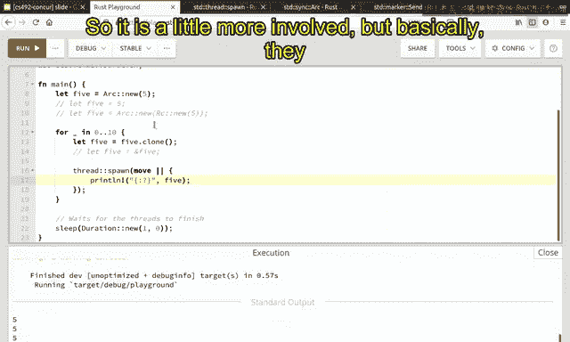

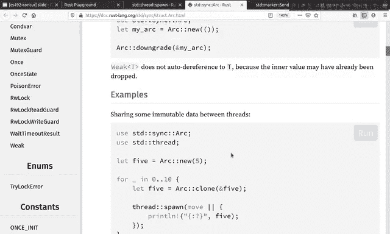

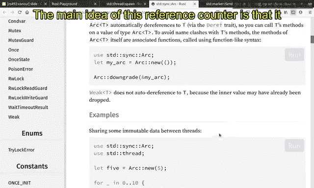

那么，`Send` 和 `'static` 生命周期具体意味着什么呢？我们通过两个例子来说明。

#### `Send` 特质的意义

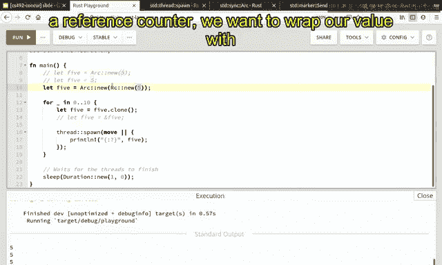

`Send` 标记一个类型可以安全地跨线程边界转移所有权。我们用一个反例来说明：

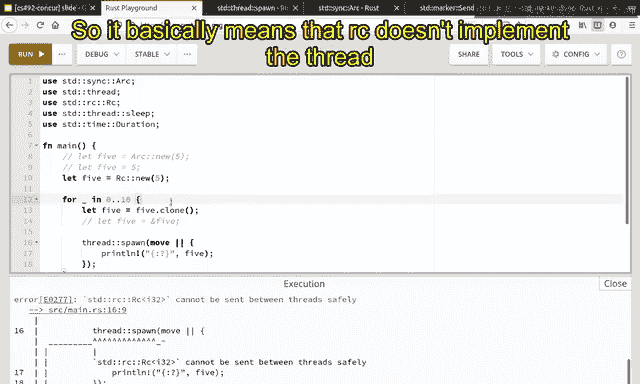

```rust
use std::rc::Rc; // 非原子引用计数，非 Send
use std::thread;

fn main() {
    let five = Rc::new(5);
    thread::spawn(move || { // 编译错误！
        println!("{}", five);
    });
}
```

这段代码无法编译。错误信息会指出 `Rc<i32>` 不能安全地在线程间发送（`Rc<i32> cannot be sent between threads safely`）。因为 `Rc` 的引用计数操作是非原子的，不能承受多线程并发修改，所以它没有实现 `Send` 特质。而 `spawn` 要求闭包是 `Send` 的，因为它要被移动到另一个线程执行，因此编译器拒绝了此代码。与之相对，`Arc` 使用了原子操作管理计数，实现了 `Send`，因此可以用于多线程。

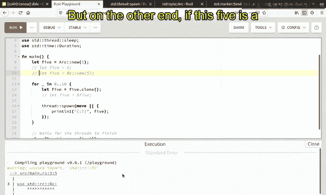

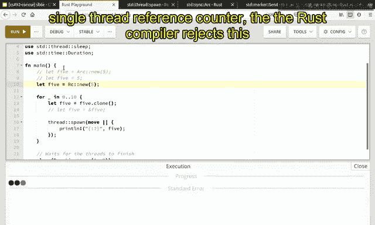

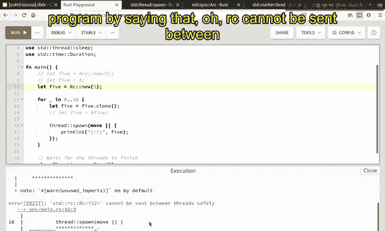

#### `'static` 生命周期的意义

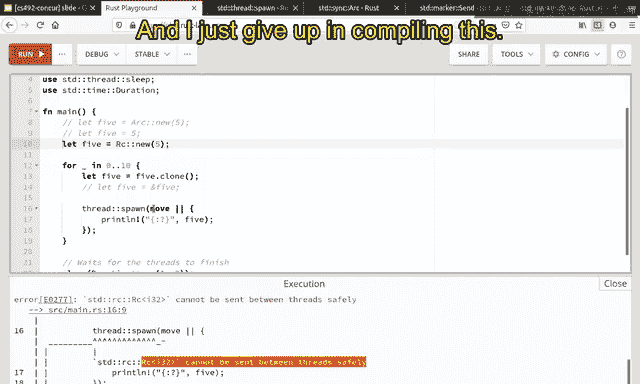

`'static` 生命周期要求数据在整个程序运行期间都有效。这防止了悬垂指针。看另一个反例：

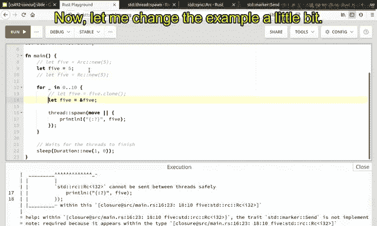

```rust
use std::thread;

fn main() {
    let five = 5;
    let ref_to_five = &five;
    thread::spawn(move || {
        println!("{}", ref_to_five); // 编译错误！
    });
}
```

这段代码也会编译失败。错误信息提示 `five` 的生命周期不够长。因为 `ref_to_five` 是对局部变量 `five` 的引用，其生命周期仅限于 `main` 函数。而新线程的执行时间是不确定的，它可能在 `main` 函数结束、`five` 被销毁后才尝试访问这个引用，从而导致悬垂指针。`'static` 约束强制要求闭包捕获的数据必须拥有静态生命周期（例如直接拥有所有权的数据、`Arc` 等），从而避免了此类问题。

**总结一下**：`spawn` API 通过 `Send` 和 `'static` 约束，在编译期就保证了线程间数据传输的安全性和数据的有效性，将常见的并发错误扼杀在编译阶段。

### 2. `Arc<T>` 的约束

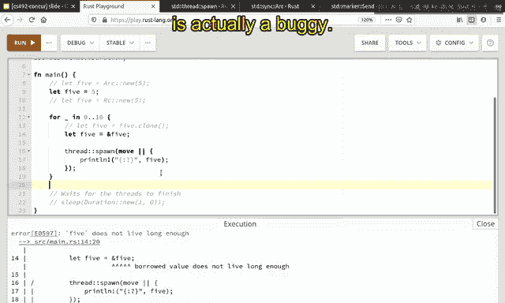

`Arc<T>` 本身也有约束，它要求其内部类型 `T` 满足特定条件，才能保证整体的线程安全：

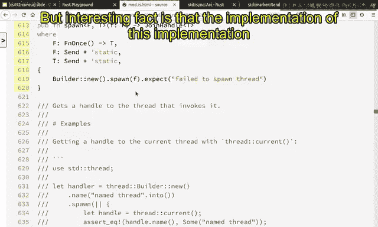

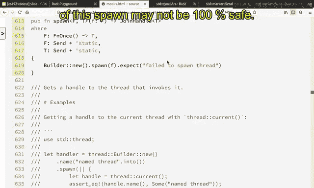

```rust
impl<T> Arc<T> {
    pub fn new(data: T) -> Arc<T>
    where
        T: Send + Sync + 'static,
    { ... }
}
// 实际上，Arc<T> 实现 Send 和 Sync 的条件是：
// T: Send + Sync + 'static
```

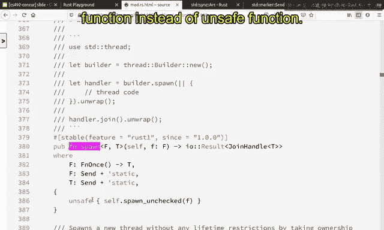

这意味着：
*   只有当 `T` 是 `Send` 时，将 `Arc<T>` 移动到另一个线程才是安全的。
*   只有当 `T` 是 `Sync` 时，通过 `Arc` 的不可变引用（`&Arc<T>`）在多线程间共享访问 `T` 才是安全的。
*   `'static` 约束通常与 `T` 本身是否包含引用相关。

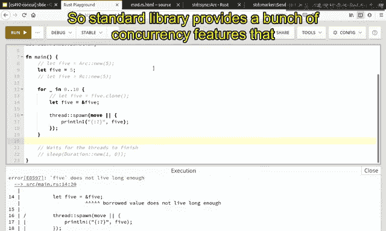

例如，`i32` 实现了 `Send` 和 `Sync`，所以 `Arc<i32>` 也自动实现了 `Send` 和 `Sync`，可以安全地用于我们的示例程序。

## 关键概念：`Send` 与 `Sync` 特质

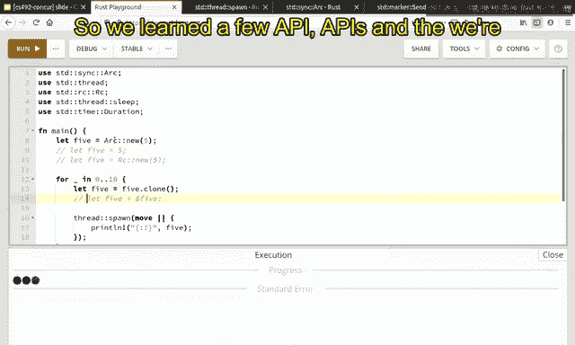

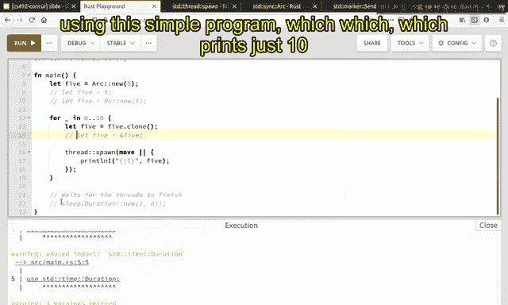

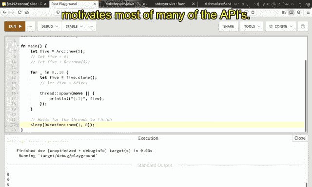

`Send` 和 `Sync` 是Rust并发编程的基石标记特质（Marker Trait）。

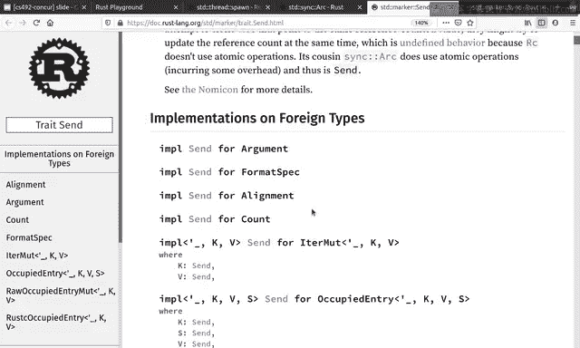

*   **`Send`**：如果一个类型 `T` 实现了 `Send`，意味着将 `T` 的所有权从一个线程转移到另一个线程是**安全**的。绝大多数Rust类型都是 `Send` 的。反例是包含非原子引用计数（`Rc`）或裸指针（`*mut T`）而没有特殊同步的类型。
*   **`Sync`**：如果一个类型 `T` 实现了 `Sync`，意味着通过不可变引用（`&T`）在多线程间共享访问是**安全**的。这通常意味着 `T` 的内部状态要么是不可变的，要么是通过线程安全的方式（如互斥锁 `Mutex`）保护的。

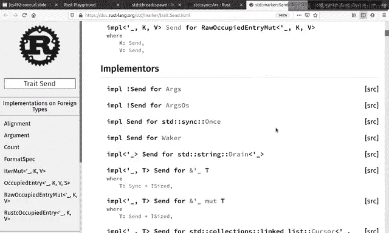

它们之间存在一个重要的理论关系，这个关系也体现在标准库的源码中：

```rust
// 如果 &T 是 Send 的，那么 T 就是 Sync 的。
// 这意味着可以安全地将 &T 的引用跨线程传递。
unsafe impl<T: ?Sized + Sync> Send for &T {}

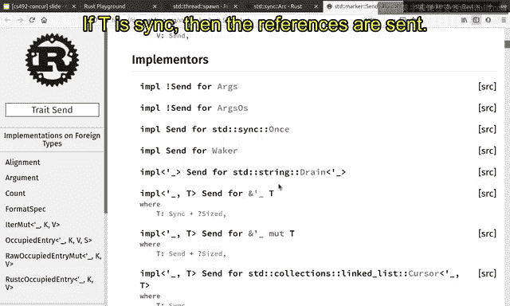

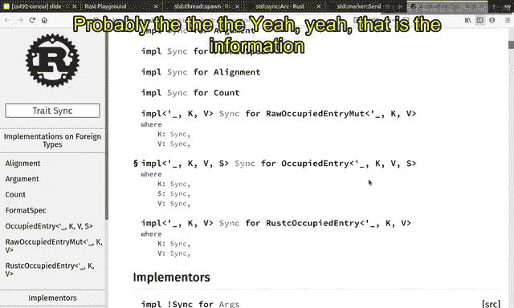

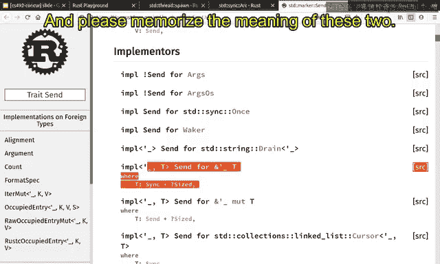

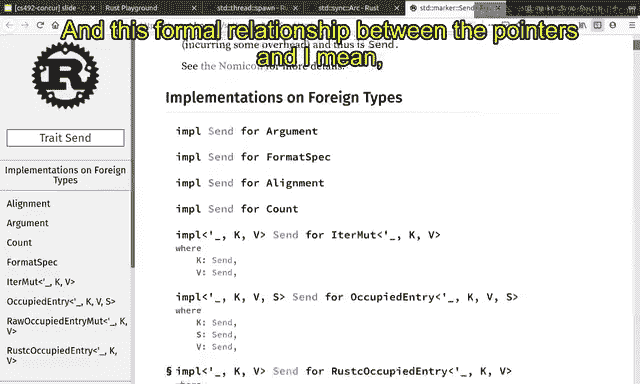

// 这个关系是定义性的：T 是 Sync 当且仅当 &T 是 Send。
// 用代码表示逻辑关系，并非直接实现。
// `Sync` 的定义本质上等价于要求 `&T: Send`。
```

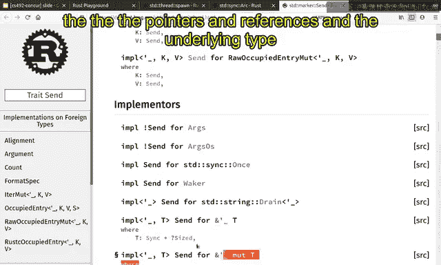

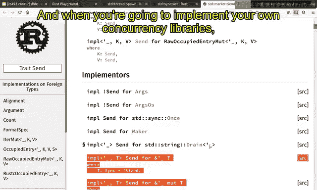

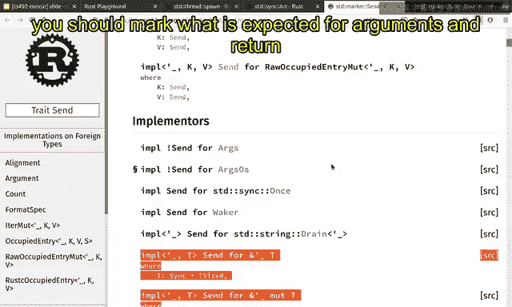

**简单记忆**：
*   **`Send` 关乎所有权移动**（线程间传递值）。
*   **`Sync` 关乎引用共享**（线程间共享 `&`）。
*   一个类型是 `Sync` 的，等价于它的不可变引用是 `Send` 的。

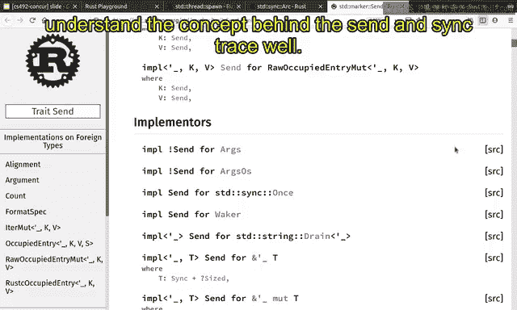

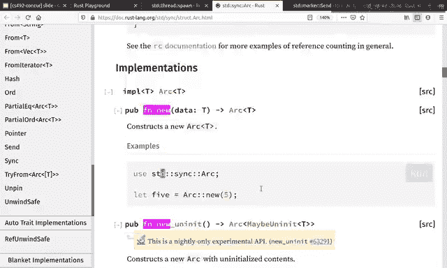

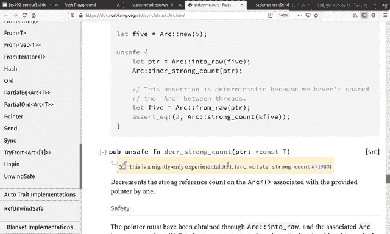

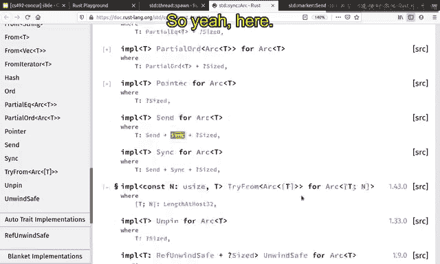

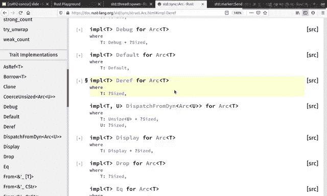

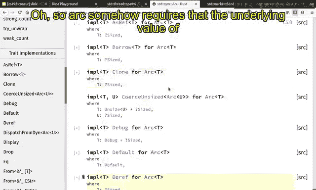

理解并正确应用 `Send` 和 `Sync`，是设计和实现安全Rust并发库与数据结构的关键。

## 总结

本节课中我们一起学习了Rust标准库中基于锁的并发编程基础。我们通过一个具体的多线程示例，深入剖析了：
1.  **`std::thread::spawn`**：用于创建新线程，其 `Send + 'static` 约束在编译期保障了线程安全。
2.  **`std::sync::Arc`**：原子引用计数智能指针，用于多线程间安全共享数据所有权。
3.  **`Send` 与 `Sync` 标记特质**：并发安全的类型系统基石，`Send` 允许跨线程转移所有权，`Sync` 允许跨线程共享不可变引用。

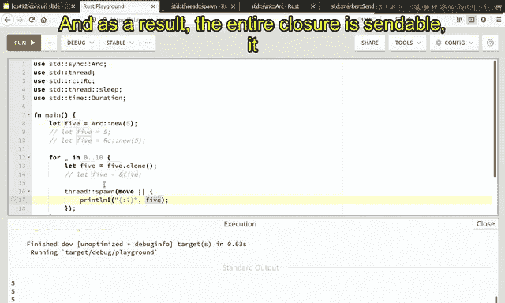

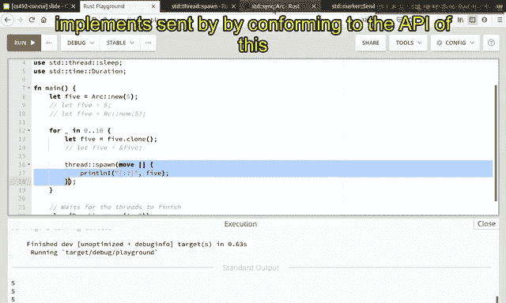

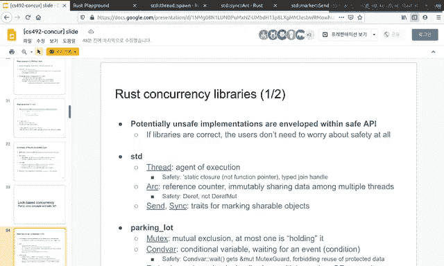

Rust并发库的核心哲学是：**将潜在不安全的实现用安全的API封装起来**。编译器通过类型系统和特质约束（如 `Send`, `Sync`, `'static`），在编译阶段就排除了数据竞争、悬垂指针等大量经典并发错误，使得开发者能够以更高的信心编写并发程序。这些概念不仅是Rust特有的，也深刻反映了系统级并发编程的通用原则。