# KAIST《Rust并发编程｜CS431 Concurrent Programming 2020 fall》中英字幕（豆包翻译 - P8：-08-Lock-Based Concurrency, API of parking_lot.zh_en - GPT中英字幕课程资源 - BV1oi421h7b2

In this video， we are going to continue to study concurrency libraries in rusts by looking at what is called parking lot。

Pking lot provides a few very basic concurrency libraries， including Mus。

 conditional variables and reiteital lock， it provides a lot of many other features。

 but here we only study the three。So here is a representative example of the use of muraes。

 and here we are going to just use a few APIs of the muex。 So let's study this code。😊。

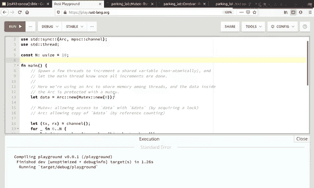

This is， by the way， copy and pasted from this example in this parking la muttax documentation。

 So if you are not aware of something I mentioned， please read this document。

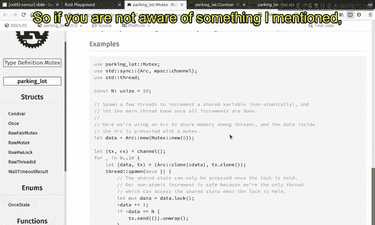

An S Christmas。Okay， we are first creating a ut protected value here0 is the value that will be protected by a muex。

😊，And it is wreck by a mutex and then wreck by an arc we just learned in the previous video。So。

 basically， the the。The purpose of these two are or a little bit different when you wrap a mutex inside。

 when you wrap a value inside a Muex， then it allows you to mutably access the。

Underline data with the onlyable immutable references。

 So you are requiring when accessing the internal data you need to acquire or lock。

So this acquisition of a lock is exclusive by implementation of the Mux。

 That's the reason why only you can access the underlying data mutably only when you have immutable references so all the accesses are somehow interleaved by the working of the internal locks。

😊，When you acquire a lock， no other threats can access the internal data。

 That's the reason why it is safe to access the underlying data mutably using only a shared references。

Okay， and this muax allows meable access to data with only a shared references。😊。

But the purpose of this arc is that these shared references can be copied when it is reduit orrc because it is reference counted because it is reference counted。

 you can just freely copy the reference data without worrying about the scope here。😊。

By reference counting。 So if we hold arc reference。

 then you don't need to worry about all the scope at all。

 as far as you have an reference counted pointer， then it will be the underlying data will be alive。

 So that's the reason why we wrap this muax with an arc。

 So that the reference counter it can be freely shared to another thread without worrying about all the scopes。

Okay， at this program， we are creating a channel which we will study in the later part of the video。

 but let's say that the channel is two endpoints， one is transmitter， and the other is receiver。

When you send a data from a transceiver， I mean。Transmiter。

 then the receiver can get retrieve the data from the transmitter。 So basically。

 that is a queue from transmitter to the receiver。And there are 10 strands and is defined as 10 here。

So for test threats， we are going to create a new thread。There will be 10 new stress。

And for each new thread， it is going to be given a reference reference counted pointer to the shared data。

 And also， it is also given a transmitter。😊，Transmiter here can be freely cloneed。 so as a result。

 multiple stress can send the data to the same channel at the same time。😊，At this example。

 tensors are simultaneously and concurrently sending values to the same channel at the same time。😊。

So anyway， this thread that this newly respond is given a reference counted pointer to your data and a transmitter to the channel。

😊，And as usual this pen， the sp function requires that this underlying en closure is sent and statically scpt。

😊，And data is T X is also sendable and statically sced。 So that is well， well typed。

 and that is compiled by， happily compiled by rust。😊，So inside the function。

 it is going to try to acquire a lock。So as I said。

 mut axis just allowing mutable access to data only with the mutable immutable references。

 the reason is that it it requires you to acquire a lot。😊，So here it is acquiring a lot。

And data is basically a handle that proves that you have acquired a lot。And using this data。

 you can freely mutate the underlying data， which was initially zero。

 and it can be incremented by one in this thread。😊。

And it is perfectly safe because after you got the you a you acquired a lock。

 then you are the only one that miserably accesses the underlying data。

 So it is very much safe to increment the data by one。😊。

And if it is the same with the number of stress， then it is sending a value to the channel。

It is a very simple program。 you have tense rest and each thread is incrementing the underlying data by one after acquiring a log。

 and then the less thread that increment the value is sending a value to the channel。😊。

And here in the main thread， it is going to receive the value that is sent by only one thread。

 the less thread， the less thread sent the value， and the main thread receive the value here。😊。

What is interesting about this Mux API is that at the end of this scope， when data is dropped。

 the data is basically approved that the U acquired a lot。😊。

And when this proof is dropped at the end of the scope， the lock is automatically released。😊。

And as a result， another threat can acquire the underlying data s。Afterwards。

So it is safely it is automatically guaranteed， as we discussed in the previous lecture。

 that this lock guard is automatically released here。😊。

So that's the benefit of the API of this mus over other languages。😊，And okay。

 and as we discussed in the previous lecture， it is quite guaranteed that the underlying data state pointer should not be linkeded in the。

 in the worst。😊，Because whener when the reference to the underlying data is leaked。

 then the ro compiler will automatically detect the leak and reject compilation。😊，So as a result。

 this data is 100% safely protected by this lock in in specifically in this case。

 it is perfectly safe。😊，Safely protected by this mus here。So this is the purpose of the muux。

Mex is a little bit different from spin lock in that spinlock is does not block the thread。

 It just loops and see if the lock is acquireable。 And if it is aable， it does that。😊。

But on the other hand， in Mus， when you cannot acquire the log because log is already held by another threat。

 then it is going to slip。So it is basically the main difference between Spilak and Mus。

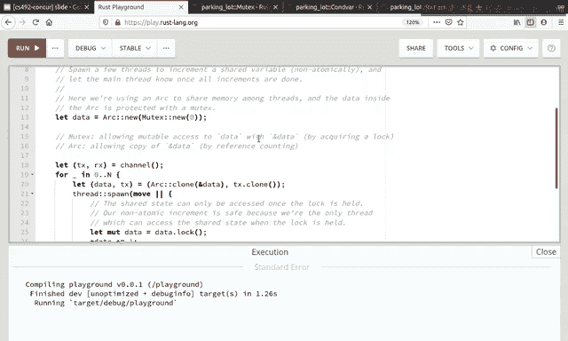

Okay， so we learned the first API of this parking lot which is Muax and if you want to know more APIs。

 please read this document that is this page has a link to the Muex and you can go to these dos。

s and here you can see the examples and all the explanations here。😊。

It actually provides much more APIs than I just described in this short video。

 but most of them is very useful for very specific use cases。

 but for now let's just learn very few basic APIs of this muax which is creation of a new mux and each use of Arc mux pattern here。

😊。

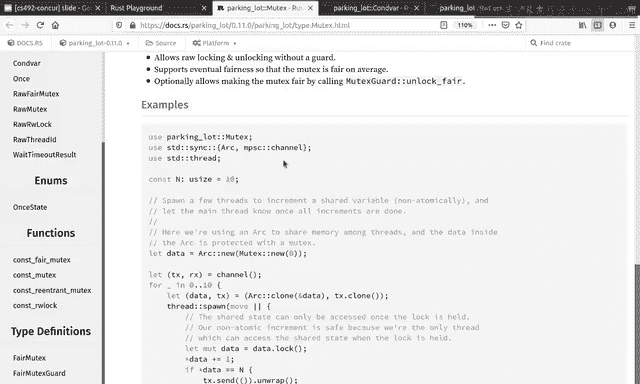

And also the luck here that is for accessing the internal data mutably。😊，Okay。

 the second API we will learn from parking lot is a conditional variable here。

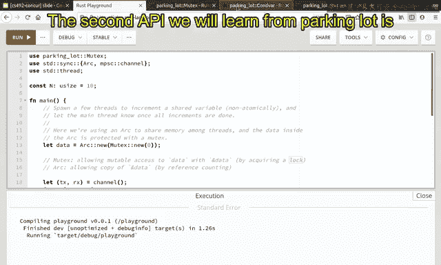

So conditional variable is basically， let's say， let's read this。

 represents the ability to block a threat such that it consumes no CPU site time while waiting for an event to occur。

So conditional variable is basically waiting for event or condition to occur。

 It is a variable that is waiting for the condition to occur。😊，So， let's see the。Example here。

 examples tell us a lot more about this conditional variable than the explanation， I think。😊，Okay。

 before using a conditional variable， there should be a muex。😊，So it is almost always the case。

Conditional variable is always associated with the mudex。And here。

 let's see this muox is associated with a conditional variable。😊，Okay， and this is paired。

And you're going to spot a thread。 And inside this thread， you are going to acquire a log。Which。

 whose name is started。And and you， in this thread。

 you are going to set the started variable as true。Okay。

 something is started and that is signified by the fact that the underlying value here sort is assigned with2。

😊，It was originally false。 now， it is true。So this is the condition that the conditional variable wants to wait for。

It is the event that is waited for and thats the reason why here we are going to notify all those who are waiting for this conditional variable。

 notify I mean one it is going to notify one。😊，Of the waiters for this conditional variable。

On the other end， in this main thread， it is going to OK lock and see if it started。😊。

If it is it is started， it is very much okay and we don't need to worry about the conditional variable and the media exists at all。

 Oh， its started and we can do interesting things。😊，But otherwise， if it is not yet started。

 we have to wait for the。We， we have to wait for this another thread has started the event。

 So we are going to wait it。😊，And， and in this in at this time。

 we are going to give a memorable reference to the lock guard to the this API weight。

So the semantics of this conditional variable is that when you start waiting for。😊，Event。

 then you are going to give a lockguard and it mirror reference。😊，And automatically。

 at the beginning of this function， this lock is released automatically。😊，And as a result。

 this another thread is able to acquire the same luck here。😊，Okay。

 and now it is true and it is notified。 And at the end of this function。

 this lock code for this lock， which is reading started， is automatically released。😊，And okay， now。

 after the started lock is released， then this thread can investigate whether it can wake up。😊。

It first C conditional variable is notified。😊，It is notified here， so it is able to wake up。😡。

The event has arrived， so I am happy to wake up。😊，And。😊，At the same time。

 it should investigate that it is able to acquire the same log again。

So at the beginning of this weight， the lock is automatically released。😊。

And at the end of this weight， the lock， the same lock should be automatically acquired。

So that's the meaning of this API。The semantics of this API。And if that happens， you know that， oh。

 I was notified to wake up。 and as a result， it is guaranteed that the started variable should be true after I waited。

😊，And as a result， we can establish the invariant that at this line after you checked whether the start is true or you waited for the condition。

 then it is guaranteed that the other threat has already。😊，Notified the， the。

 the starting of the event。Sties is already set2 before this line。啊。

Regardless of whether you return or false at this line， after reading up， you read。

 you are quite guaranteed that the variable is true。😊，Because you're notified by here。Okay。

 that is basically the huge case of conditional variable waiting for an interesting event to happen。

😊，And in this example， this conditional variable is waiting for the other threads to set started as true。

😊，What is interesting about this API is the fact that the weight requires a mutable reference to the lock guard。

😊，Which means that。Which means that the lock is will be automatically released and acquired。

 And as a result， there is， there can be an intervening。😊，Acquired lack of the other threats。

 Other threats may inter interfere with with in between。And it can change the variable。

And as a result， we cannot hold a pointer that is acquired before the invocation of this and edit it later after the invocation of this weight。

 so let's see an example of what I said。😊。

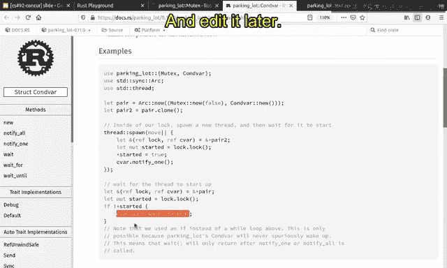

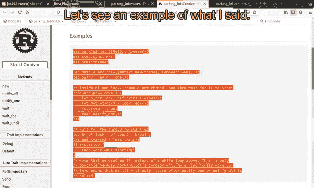

So， here is。The example that is just copy and pasted from the documentation。

 and it is happily executed。😊，Then let's say that。We get the reference to this sorted here。

And we're going to print it here。You can see that。It is not compiled because it is。

Imutably share I mean immutably borrowed here and again， mutably borrowed here。And as a result。

 there is a conflict between these shared mut excesses and the Ro is just fail to compile it。

And it is very much expected because this S， the value of S can be。

Can be changed during the invocation of this rate because the underlying log is released and then acquired again。

😊，And in between， the value of S can be changed by others。And as a result， it is unsafe。

To get a shared reference to the share started here and then use it here。😊，We should not do that。

That's the reason why this weight requires a mutable reference to the lock guard。

 this mutable reference。😊，This allows this reuse of this pointer across this function call if it is printed here。

 it is very much okay because it is not across the function call to this weight。

 but this is not okay because it is across a function call weight which will release and acquire the underlying lock。

😊，It is very much unsafe。And you can see that the API of this weight automatically handles that。😊。

So it guarantees that this thanks to these mutable references。

 it is always safe to use this wave function。😊，That is basically on what is provided by the API of parkingless conditional variable。

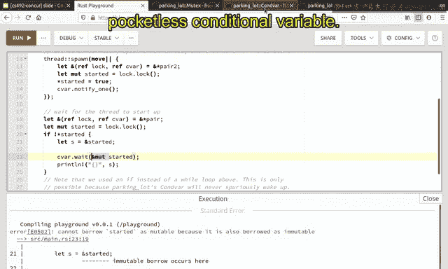

Okay， so far step good。This conditional variable provides only safe APIs。

 and there are there are a few unsafe APIs， but you can just you can just avoid that only using safety API this 100 percent as to guaranteed that the all API calls。

 all combinations of API calls will be safe。

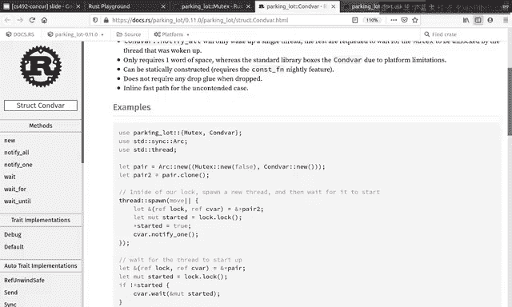

The last example we are going to learn from parking lot is what is called Ri light rock or Al rock。

That means that you can can acquire a lock。Read only for risk or you can acquire a luck also for rights。

So it is very much similar to muttax， but it provides a reader writer asymmetric APIs。

 So here is an example。😊，You can create a read write lock here。😊。

And you can acquire a log for multiple times， but only for risk。

It is also very much safe because they are all reading the data， underlying data。

 and it is safe for multiple agents to read the same data at the same time。😊。

It is guaranteed by the API。But on the other hand， only one thread access can acquire a log with right axises。

😊，So here if you acquire the lock using a right access， then you can write to it。

 but you can be the only one that holds a lock。😊，So there is a symmetry when we。

 when you only need reading the data that you acquire the lock with read access and you need to write the value。

 then you acquire a lock using the right axises。😊，It can be much more efficient when the Oload is read mostly。

 when read mostly data is protected by Ri write log， then almost all the time they can be shared。

 all risks can be shared only when a few write happen， the concurrencies are gone。😊，Otherwise。

 they can concurrently access by reader stress。Okay， so far we we studied3， the API so parking lot。

 which are all 100% APIs， the APIs that we learned so far are 100% safe。😊。

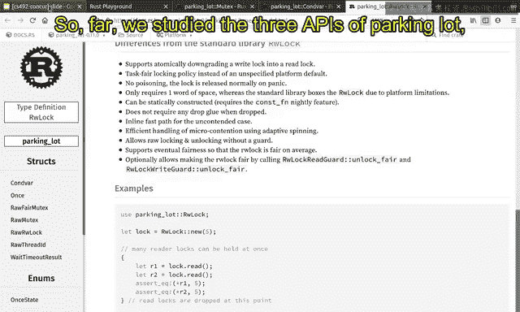

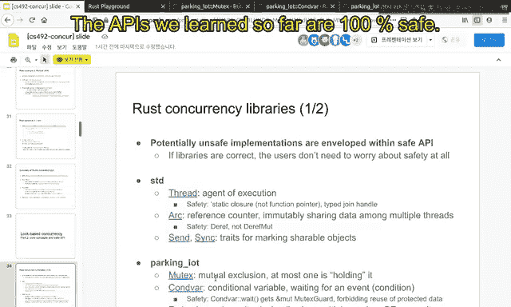

And they are Muexes conditional variables and the A lock。And in the next video。

 we are going to continue to study the those inside the other three libraries。

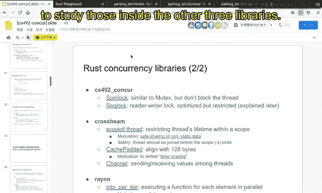