# 1：配置Visual Studio Code远程开发环境 🛠️

在本节课中，我们将学习如何安装Visual Studio Code，并配置其远程开发环境以连接到指定的服务器（例如Arimo服务器），从而为后续的Rust并发编程课程作业搭建工作环境。

## 概述

我们将分步完成以下任务：下载并安装Visual Studio Code，安装必要的远程开发插件，配置SSH连接到远程服务器，以及在远程环境中安装Rust开发所需的特定插件。最后，我们将验证环境配置，包括构建和调试一个Rust项目。

## 安装Visual Studio Code

首先，请访问Visual Studio Code的官方网站。下载适用于您操作系统的安装程序并完成安装。这是一个简单的步骤。

安装完成后，您将看到Visual Studio Code的主窗口界面。

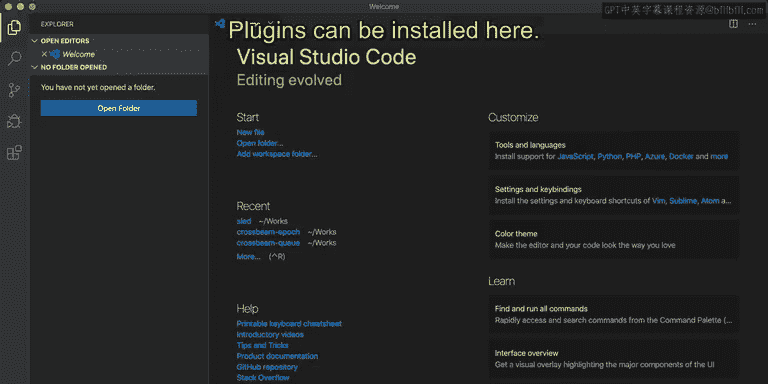

## 配置远程开发环境

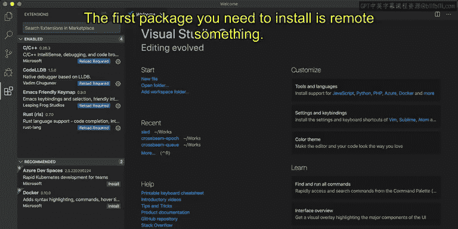

为了设置远程工作环境，您需要安装一些扩展插件。

插件可以在左侧活动栏的扩展市场中进行安装。以下是需要安装的第一个插件包。

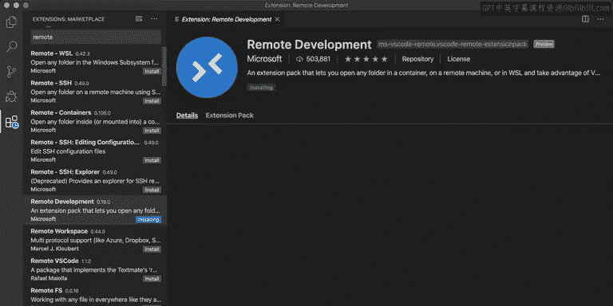

您需要安装的插件列表如下。

首先，请搜索并安装名为“Remote Development”的扩展包。点击“Remote Development”然后进行安装。

安装过程可能需要一些时间。安装完“Remote Development”插件后，您可以在窗口左下角找到一个类似“><”形状的按钮。

点击该按钮后，将弹出远程连接选项。请点击“Remote-SSH: Connect to Host...”按钮。

随后，系统会列出您配置文件中已配置的SSH主机。例如，在我的设置中已经配置了名为“CS420”的主机。点击该主机名，将会弹出一个新窗口，显示正在连接到远程桌面。

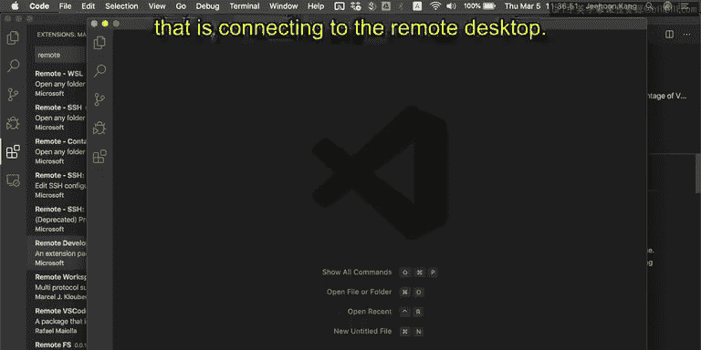

此时正在打开远程连接，并会在远程主机上安装一些基本的服务器端功能。

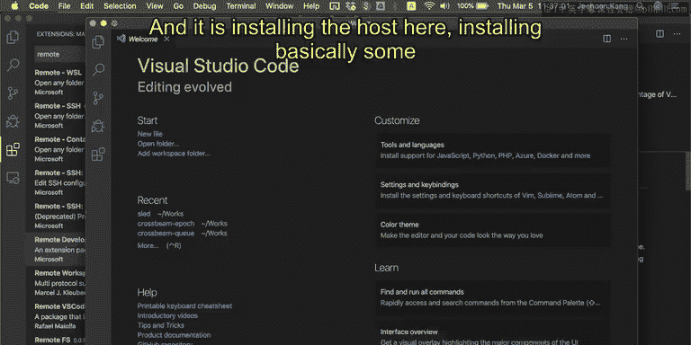

## 在远程服务器上安装插件

成功连接到服务器后，您需要在远程机器内部安装一些插件。点击扩展按钮，然后搜索所需的插件。

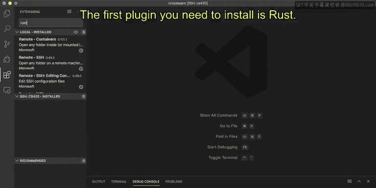

您需要安装的第一个插件是Rust语言支持插件，其名称为“rust-analyzer”。

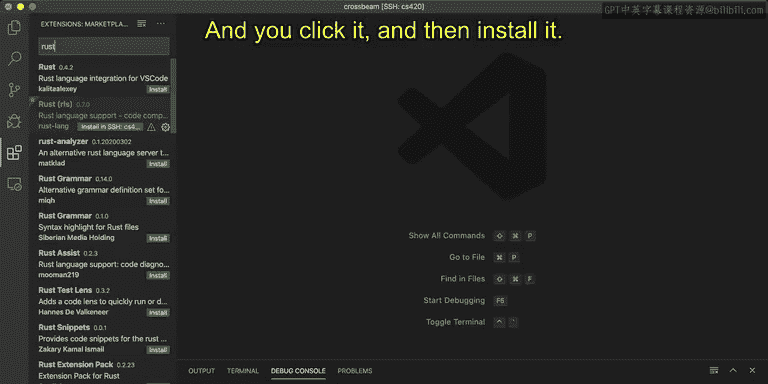

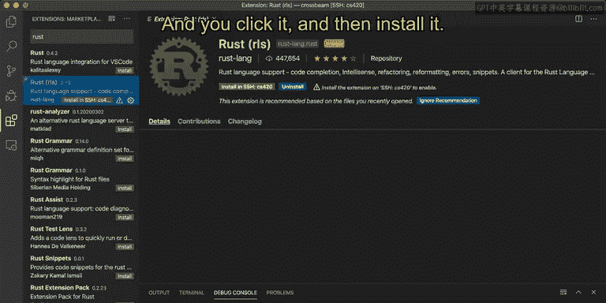

找到后，请点击安装。

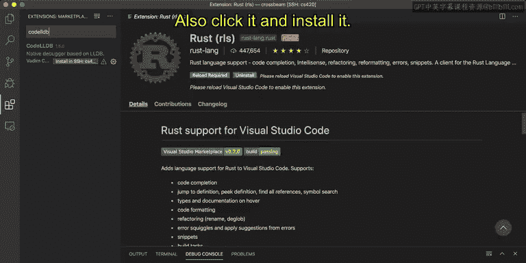

然后完成安装过程。

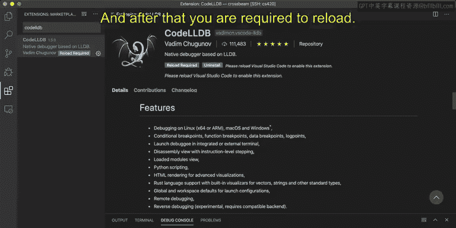

您需要安装的第二个插件是“CodeLLDB”，这是一个调试器扩展。同样地，点击并安装它。

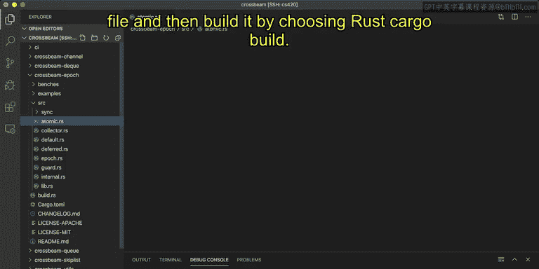

安装完成后，系统可能会要求您重新加载窗口。

## 验证环境：构建与调试Rust项目

现在，您可以打开一个Rust项目进行验证。这里以名为“crossbeam”的Rust项目为例。

例如，您可以打开`crossbeam`仓库的源代码，并查看某个文件。然后尝试构建项目。

通过选择运行`cargo build`命令来构建项目。您需要安装Rust工具链，系统会引导您完成安装。同时，构建过程也就开始了。

实际上，您正在构建这个项目的历史版本。同时，系统也会安装一些必要的依赖。让我们再试一次，运行一些构建任务。

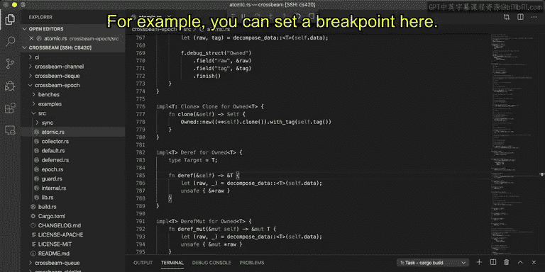

再次构建后，可以观察构建过程中的输出。构建完成后，状态显示正常。

与此同时，您可以点击调试按钮开始调试。系统会使用LLDB调试器，并自动为您创建一些调试配置文件，使您能够立即开始调试。

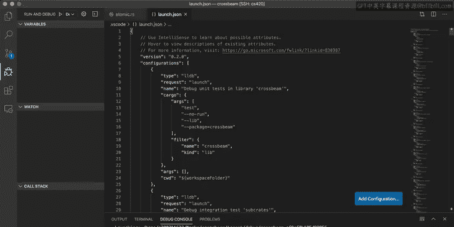

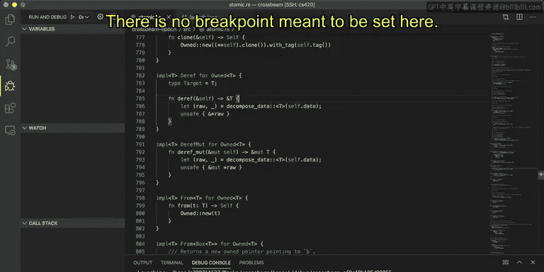

例如，您可以在此处设置一个断点。我打算在这里设置一个断点。

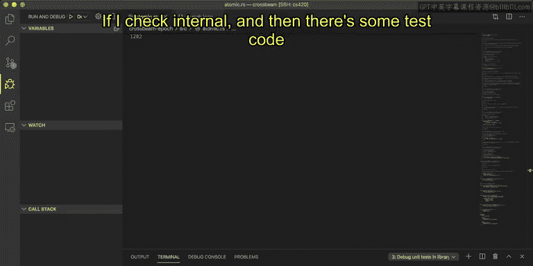

然后开始调试。哦，这里似乎没有成功设置断点。

断点本应设置在这里。但是，如果我检查内部代码，会发现下面有一些测试代码。在那里设置断点，然后开始调试。

它没有在断点处暂停。您可以检查并选择调试配置文件。例如，在此时，我需要选择`crossbeam_epoch`。

您需要选择测试配置：`Debug unit tests in library ‘crossbeam_epoch’`。然后开始调试游戏。调试器会尝试执行代码。

是的，它成功在代码的指定位置中断了。然后，您可以执行“单步跳过”到下一行，或“单步进入”函数调用内部等操作。

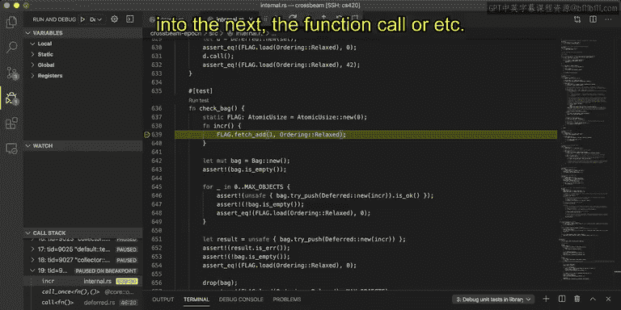

这就是在配置文件内部进行调试的过程。

## 总结

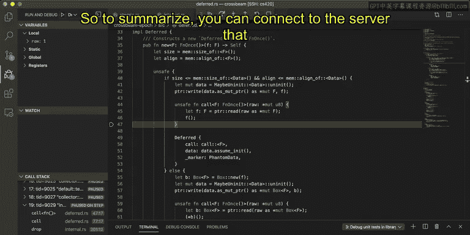

本节课中，我们一起学习了如何连接到名为“CS420”的服务器（我将在另一个视频中提供具体连接方法），如何在VS Code IDE内部进行连接，如何执行Rust代码，以及如何调试Rust代码。

我希望大家都已经为完成课程作业设置好了工作环境。

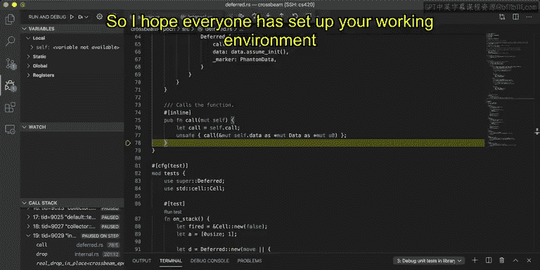

