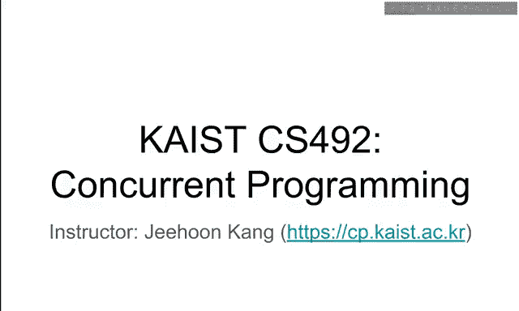
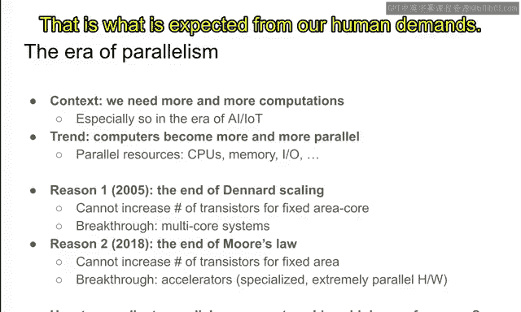
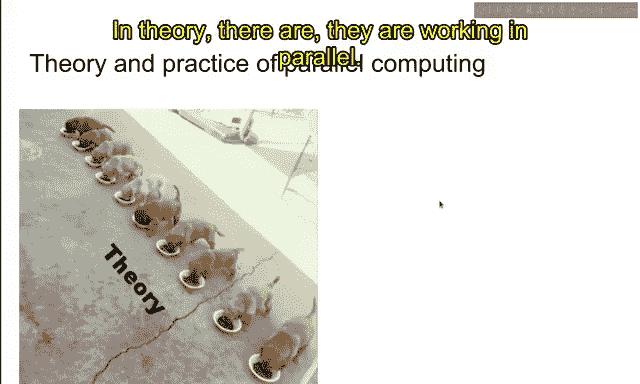
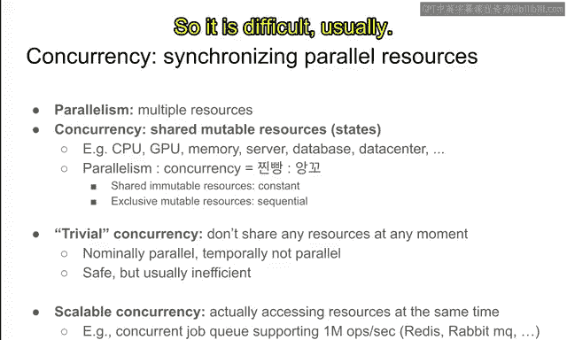
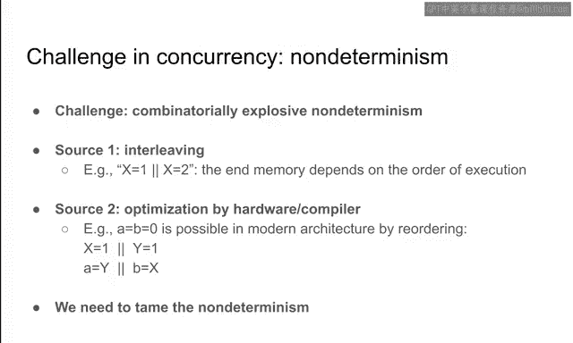
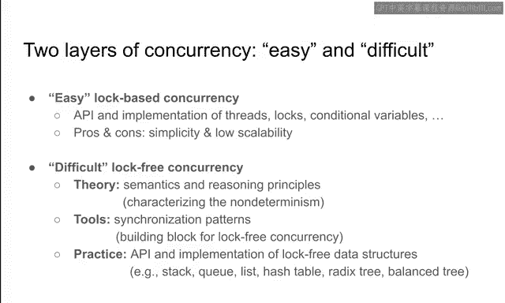

# 3：课程介绍与概述

在本节课中，我们将学习《Rust并发编程》课程的基本信息、课程结构，并探讨并发编程的核心概念、挑战以及学习路径。我们将从课程主页的使用说明开始，逐步深入到并发编程的本质。

## 课程主页与要求

首先，我们来了解课程的后勤安排。课程主页是 `github.com/k-cp/this`。请仔细阅读主页上的README文件，其中包含了完成本课程所需了解的所有信息。

所有课程公告和问题讨论都应在GitHub的Issue Tracker中进行。请关注课程仓库，以便新的公告和问题能自动发送到您的邮箱。

本课程不设固定的线下答疑时间。我们要求您先在Issue Tracker中提问。请前往仓库查看现有问题，如有新问题，请创建一个新的Issue。

此外，每节课后都需要提交一份测验答案，以确保您确实观看了视频。我会针对每节课的视频内容提出几个问题，您需要将答案提交到 `xjikac.kr` 这个网站。您的账户已经创建，请前往仓库的README和公告中查看详情。

同时，请签署荣誉准则。这是计算机学院的标准要求，旨在确保您遵守学术诚信规则。请阅读并签署该准则。

总而言之，请仔细阅读课程主页，并完成考勤和荣誉准则相关的任务。

接下来，我们来看看评分标准。本课程的作业非常重要，占总成绩的60%。如果您未能按时完成作业，将无法获得好成绩。

此外，我们会有期中和期末考试。但由于COVID-19疫情的不确定性，考试安排可能会有所调整，评分方案也可能随之变化。

考勤方面，每节课后都需要在指定网站提交测验答案。如果您参加了大部分课程或回答了大部分测验，则没有问题。如果您错过了大量测验，则会影响成绩。考勤的具体评分方式尚未最终确定，但请务必观看视频并尽可能多地提交测验答案。

以上是课程的基本信息。如果您有任何疑问，请先仔细阅读主页的README。如果仍有问题，请在Issue Tracker中提问。

## 并发编程的时代背景

现在，让我们开始介绍并发编程。这是21世纪著名的场景之一：李世石与AlphaGo的对弈。这场对局是人工智能时代的开端。

李世石落下了第一子。众所周知，最终结果是AlphaGo以4:1获胜。这是一场一边倒的胜利，震惊了所有人。当时，大多数人都认为李世石会赢，因为他是围棋界的顶尖大师。我也曾认为AlphaGo不会如此强大。

然而，与大多数人的预期相反，AlphaGo赢得了胜利。2016年，我作为一名研究生，在实验室观看了所有比赛，并意识到一个新时代已经来临。人工智能确实将改变人类历史，而战胜李世石正是这一变革的标志之一。

如今，人工智能应用已无处不在，并在某些领域表现出色。例如，最近的GPT-3模型在语言理解方面非常出色，可用于需要理解语言的应用程序。每天都有大量AI应用涌现，它们正在改变我们的生活。

在AlphaGo与李世石对弈的背后，是庞大的计算集群。你可以看到许多重复的机架，内部的计算单元也被大量复制，并通过网络解决方案连接起来。

这种资源冗余和复制的原因在于，为了战胜李世石，AlphaGo需要进行大量的并行搜索。对于并行搜索，这些并行机器将非常高效。我们可以将搜索任务分发到大量相同的机器上，从而获得大约100倍的加速。击败李世石的AlphaGo版本就是一个大规模并行机器。四年后的今天，支撑AlphaGo的TPU（张量处理单元）正变得越来越并行和密集。

因此，在人工智能时代的背后，也是并行计算的时代。如今，我们正处在并行化的时代。为了迎接人工智能和物联网时代，我们需要越来越多的计算能力。

趋势是计算机正变得越来越并行。这里的“并行”含义广泛，包括CPU、内存、I/O资源、GPU、神经处理单元、FPGA等各种并行部署的资源。

我们需要更多并行性的原因主要有两个。第一个原因大约在2005年出现，即“登纳德缩放定律”的终结。这意味着我们无法在固定面积的芯片上不断增加晶体管数量，因为功耗会持续上升。因此，我们无法在单个计算单元中简单地塞入更多晶体管。

为了应对缩放定律的终结，我们引入了多核系统。我们开始设计双核、四核、八核系统。如今，在2020年，桌面CPU甚至有16核，服务器级CPU甚至有64核。据我所知，拥有118个核心的CPU正在设计中，并将于明年交付客户。因此，核心数量正在快速增长。

第二个趋势是“摩尔定律”的放缓。这意味着我们无法保证单位面积内晶体管数量能像过去那样持续高速增长。虽然光刻技术越来越精细，但晶体管数量的增长已变得非常缓慢。

为了应对这个问题，主要策略之一是引入“加速器”。加速器是专门化且极度并行的硬件。CPU是通用处理器，可以执行几乎所有计算任务。而加速器则不同，它们只执行一小部分操作，但效率极高。它们针对特定工作负载进行了专门优化，因此可以成为极其并行和高效的硬件。

GPU就是最重要的加速器类型之一。最初用于图形处理，如今也专门用于AI应用、视觉应用，甚至数据分析等。支撑AlphaGo的TPU也是一种著名的加速器。许多初创公司也在尝试开发更专注于AI应用的NPU。

这两个趋势迫使我们思考多核系统和异构资源。我们不仅拥有CPU，还有GPU、NPU、TPU，甚至SSD和FPGA等。如今，我们拥有丰富的并行和异构资源，未来这一趋势将继续。为了满足人类对更多计算的需求，将引入越来越多的并行性和异构性。

现在的问题是：我们拥有了强大的并行资源，这很好。但如何协调这些共存的并行资源，以实现更高的性能？我们需要以某种方式协调这些并行资源，让它们协作而非竞争，以实现统一的计算目标。例如，我们希望使用并行资源计算AI图，它们需要协调以实现该目标。

## 并行与并发的挑战

通常，实现高性能并行计算被认为有些困难。理论上，并行计算应该像这样工作：有多只狗在同时吃饼干，它们并行工作。

然而，实际情况通常是这样的：它们在竞争相同的资源，有些资源甚至完全没有被利用。理论上我们希望前者，但大多数时候我们只能实现后者这种混乱状态。

让我解释为什么会发生这种情况，以及如何安全高效地同步这些并行资源。首先，让我介绍“并发”的概念。

“并行性”基本上定义为存在多个资源。如果存在许多资源，我们可以说这些资源之间存在并行性。

而“并发”则关乎共享的可变状态。它被定义为共享的可变状态或共享的可变资源。例如，CPU、GPU、内存都被多个进程共享。服务器被多个进程或多个虚拟机共享，数据库被多个连接共享，甚至文件系统也被多个用户共享。所有这些资源都是可变的。显然，CPU是可变的，它们的寄存器值不断变化；数据库也可以不断更改。

并行性和并发性就是这样定义的：多个资源和共享的可变资源。问题在于，共享的可变资源是利用多个资源的关键。

你可以想象，没有并发的并行性并不那么有趣。例如，如果资源是共享的但不可变，那么资源就是常量，不会产生任何困难或有趣的事情。它们都是常量，在开始时定义，无法更改。因此，在计算方面并不那么有趣。

另一方面，独占的可变资源是顺序的，不涉及并行性。我们无法共享这些资源，因此无法利用这些资源提高性能，因为它被单个代理专门拥有，无法并行使用。

因此，为了通过并行性实现高性能，我们确实需要处理并发性，处理共享的可变资源。如何安全高效地使用这些并发的共享可变资源，是实现并行性高性能的关键。

到目前为止，我们讨论了并发性本质上是关于共享的可变资源。有一种处理并发的简单方法。并发性众所周知是困难的，是编程中所有困难的根源。

但有一种处理并发的简单方法：在任何时刻都不共享任何资源。这意味着，在任何时刻，如果一个资源只被单个代理拥有或使用，那么即使资源可以被共享，但在任何时刻它都被代理独占，就不会产生并发带来的困难。

它在名义上是并行的，因为许多代理可以访问此资源，但在时间上是顺序的，因为在任何时刻它都被单个代理独占，没有并行性。这显然是安全的，因为没有共享可变访问带来的问题，但通常效率低下，因为在任何时刻资源都不能被共享，只能被分时复用，而不能同时使用，因此可能效率低下。

另一方面，我们真正想要实现的是可扩展的并发性，即同时实际访问资源。例如，我们希望设计一个并发作业队列，支持每秒100万次操作。

在现实世界中，这样的系统以Redis或RabbitMQ等形式部署。例如，RabbitMQ是一个作业队列。如果Web服务器想要请求执行作业，它只需将作业抛给作业队列。这个队列不断被工作线程拉取，工作线程从队列中获取作业并执行。

我们同时有大量并发连接，因此这样的并发作业队列必须尽可能快。这就是为什么我们希望并发作业队列能够支持每秒100万次操作。这大致相当于当今单台服务器可以处理的并发连接数。

对于这种可扩展的并发性，多个代理实际上可以同时访问同一个作业队列。从这个意义上说，它是真正共享的可变资源。它被例如100万个句柄共享，并且是可变的，因为作业可以添加到队列或从队列中移除。

为了支持这种真正可扩展的并发性，问题在于通常难以推理。它肯定是高效的，正如我所说，它可以支持每秒许多许多次操作。但通常这种可扩展的并发性在安全性和正确性方面有点难以推理，尤其是如何确保队列的正确性，即它确实像一个队列一样工作，在存在共享可变访问的情况下。这通常很困难。

## 并发困难的核心：非确定性

让我解释为什么它很困难。困难的本质在于非确定性。并发之所以困难，是因为它引入了组合爆炸式的非确定性。“组合爆炸”基本上意味着非常非常多的非确定性。

第一个非确定性来源通常称为“交错执行”。假设有两个线程。一个是 `x = 1`，另一个是 `x = 2`。问题在于，根据线程执行的顺序，最终内存中的值可能是1或2。

如果 `x = 1` 在 `x = 2` 之前执行，那么最终内存应该是 `x = 2`。另一方面，如果 `x = 2` 在 `x = 1` 之前执行，那么最终内存应该是 `x = 1`。这种交错的可能性数量基本上与指令数量的阶乘相对应，是组合爆炸的。在这个例子中，我们只有两种交错，但如果我们有很多线程和很多指令，可能性很容易达到数十亿甚至更多。

第二个非确定性来源是硬件和编译器的优化。例如，仍然看这段代码。有两个线程，假设小写字母 `a` 和 `b` 是寄存器，大写字母 `X` 和 `Y` 是共享内存位置。并假设在执行开始时 `X` 和 `Y` 都等于0。

在左侧线程中，先向 `X` 写入1，然后从 `Y` 读取。在右侧线程中，先向 `Y` 写入1，然后从 `X` 读取。问题是：在真实硬件中，是否可能观察到 `a` 和 `b` 都等于0？令人惊讶的是，答案是肯定的，在真实硬件中是可以观察到的。

您可能天真地认为，要么 `X = 1` 先执行，那么 `b` 应该是1；要么 `Y = 1` 先执行，那么 `a` 应该是1。但这种推理在存在优化的情况下会被打破。

特别是，如果左侧或右侧线程中发生了重排序，那么 `a = b = 0` 是可能的。假设硬件或编译器足够智能，能够推断出左侧线程中的两条指令彼此不依赖，那么它可能先执行第二条指令，即先从 `Y` 读取。同样，编译器或硬件可能认为右侧线程中的两条指令彼此独立，因此可能先执行从 `X` 读取，然后再向 `Y` 写入1。如果是这种情况，那么 `a` 和 `b` 同时为0是可能的，因为它们被重排序并在写入操作之前执行。

这种优化和额外的非确定性确实发生在硬件和编译器中，我们需要以某种方式处理，并学习如何应对这种非确定性。

这基本上就是本课程的主题。整个课程致力于理解并发性，理解由并发性产生的非确定性，并且我们想要“驯服”这种非确定性，以确保它实际上有益于我们的目的。

## 驯服非确定性的两种方法

基本上有两种方法来驯服非确定性。第一种方法是关于API。我们将非确定性封装在一个安全的API内。

想想锁、条件变量、线程或其他存在于操作系统实现和系统编程中的抽象。例如，锁有一个非常简单的API：你可以获取锁，可以释放锁。指令交错等问题被封装在锁的实现内部，不再是我们关注的重点。使用锁只需要了解锁的规范：锁的规范是，两个线程不能同时获取同一个锁，即锁一次只能被一个代理持有。条件变量有自己的API，其他并发对象，如并发数据结构或并发垃圾收集器，也都有安全的API。

因此，人们需要知道安全的API以及如何安全地使用它，而不是理解API的所有实现细节。这是驯服非确定性的最重要方法之一。一旦非确定性被封装在API内，我们就可以忘记实现细节，只使用API来使用并发对象。

再举一个例子：考虑一个并发栈。它是一个栈，但是并发的，因此多个线程可以同时访问这个栈。这样的栈的API应该隐藏底层的非确定性。例如，栈的实现内部会包含许多指令（如x86指令），它们可能被重排序和交错执行。但我们不再对如此低级的非确定性感兴趣，因为API会封装这些低级细节。相反，我们只想知道API暴露的高级非确定性。例如，如果两个线程试图向同一个并发栈推送值，那么操作会发生交错：要么线程A先推送值，要么线程B先推送值。但这是预期的非确定性，我们希望通过这种非确定性获得性能优势，这就是为什么我们通常希望向程序员暴露高级非确定性。

这是驯服非确定性的第一种方法。

第二种驯服非确定性的方法是关于实现。如果我们知道安全的API，我们可以忽略实现。但需要有人来实现以满足安全的API。他们应该怎么做才能实际实现这样的并发对象呢？

这里的关键思想或方法是，我们只使用经过充分研究的同步模式，而不是使用任意代码。我们只写下非常成熟的同步模式。例如，锁使用所谓的“释放-获取”同步，而一些并发数据结构使用所谓的“栅栏”同步。

只有少数几种同步模式，可以组合起来以实现必要或期望的协调或同步。我们将学习这些在实现中必需的同步模式。幸运的是，我们只需要了解两三种同步模式，不需要学习成千上万种。

因此，在本课程中，我们将学习这两个方面：现有并发库的安全API是什么（例如锁、条件变量、并发栈、并发工作窃取队列等），以及如何实现并发库（如何实现这样的锁、条件变量、并发栈、队列等，以及如何实现并发垃圾收集器，这基本上是本课程的主要主题）。

## 课程结构：基于锁与无锁并发

我说过我们将学习并发库的API和实现，并观察到并发有两个层次：一个简单，一个困难。简单的通常称为“基于锁的并发”，我在之前的幻灯片中称之为“简单并发”。

这意味着锁基本上规定，在某一时刻，资源应被单个代理拥有。因此，它消除了单个资源的所有并行性。但可能存在多个资源，每个资源都由自己的锁保护，在这种情况下，多个资源可以同时被访问。基于锁的并发消除了并行性，但对于某些情况，它可能足以满足我们的性能目标。这就是为什么我们要学习基于锁的简单并发。我们将学习锁、条件变量或其他与基于锁的并发相关的内容。

这样做的好处是它非常简单，因为我们消除了并行性，不再需要思考非确定性，因为不存在非确定性。它非常简单。但是，由于我们消除了很多非确定性，它可能具有非常低的可扩展性。如果我们用锁保护一个很大的资源，那么这个大资源一次只能被一个线程访问。

因此，我们可能会转向“无锁并发”或困难并发，研究社区的一些作者通常这样称呼。无锁并发基本上不使用锁，而是允许同时并发访问同一个对象，真正允许对同一对象的并发访问。

为了驯服由这种困难并发产生的非确定性，我们将学习无锁并发的理论、工具和实践。理论将包括描述非确定性的数学和推理原则。工具将基于同步模式，即无锁并发的构建块。正如我所说，只有少数几种同步模式，这是好事。我们只需要学习少数几种同步模式。此外，我们还将学习无锁并发的实践：实际无锁对象（如栈、队列、列表等数据结构）的API和实现。我们还将学习一点关于垃圾收集的知识。

## 并发编程的一般建议

以上是对本课程将要学习内容的介绍。总结来说，我们将学习并发库的API和实现，这些并发库通常可以分为两类：简单的和困难的。我们将同时处理两者，学习简单并发的API和实现，以及困难并发的API和实现。

以下是一些适用于大多数并发编程场景的一般性建议。如果课程太长，只需记住这些。

第一个建议是：始终从简单并发开始。当您开始处理共享可变状态时，始终使用锁，始终用锁保护您的资源。只有当锁成为瓶颈，并且锁引入了大量瓶颈时，您才应该转向困难并发。如果简单并发就足够了，就使用它，因为它更简单，更容易推理。高德纳有一句名言：“过早优化是万恶之源。”所以不要过早优化。从简单并发开始。

第二个建议是关于困难并发：一旦理解了理论，它实际上并不那么困难。如果您理解了基本原理和理论，将其应用于困难并发是系统性的，您不需要担心那些神奇的事情。这就是为什么如果您理解了理论，它就不再那么困难了。但另一方面，我必须承认理解理论可能有点困难，需要一些系统的学习，这正是本课程的目标。困难并发的关键在于驯服适当数量的非确定性。您不应该消除太多的非确定性，因为这会引入可扩展性问题；但您也不应该消除太少的非确定性，因为这会引入正确性问题。为了同时实现可扩展性和正确性，您需要消除或驯服适当数量的非确定性。这是困难并发的关键标准。

第三个建议是：您的并发代码可能不会很大。因为大多数事情都可以按顺序完成。并发通常用于高度访问的代码资源，通常很小，通常很简单。所以不会有太多代码要写，但您必须知道其中有很多门道。

在并发程序中引入错误真的很容易，比顺序程序容易得多。这就是为什么调试是并发编程中最重要的活动。但幸运的是，我们有很多工具支持调试：消毒器、压力测试器、断言和逐行调试器等。您将学习如何在调试并发程序时使用这些工具。此外，数学和证明性思维在调试此类问题时非常有帮助，因为它们迫使我们从逻辑上思考程序的安全性。在证明程序正确性的过程中，我们需要处理所有边界情况，思考所有边界情况。因此，这将帮助我们调试代码。

我设想这门课程面向高年级学生，你们中的大多数人已经修过编程语言课程，但这门课并非必需。不过，如果您已经修过编程语言课程，学习本课程会更容易。

本节课到此结束，也是第一天的结束。我希望您能继续注册本课程，以便在本学期剩余的时间里学习并发编程。我希望这门课程既有趣又深入。