# 3：基于锁的并发编程入门 🧠

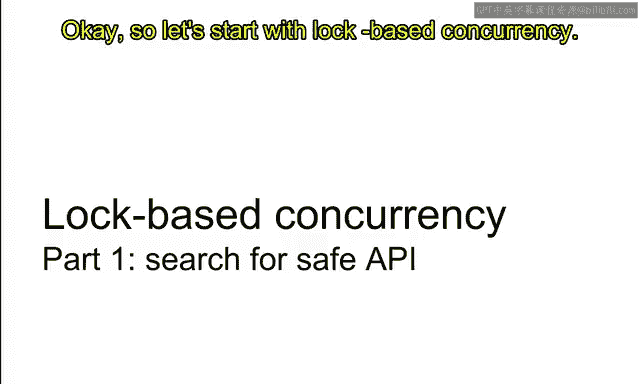

在本节课中，我们将要学习并发编程的基础，从**基于锁的并发**开始。我们将了解共享内存模型、锁的基本概念、传统锁API的缺陷，以及为何需要更安全的高级API。

## 概述：共享内存并发模型

在深入基于锁的并发之前，我们需要先理解**共享内存并发**这一基础概念，这是我们本课程中所有并发学习的背景。

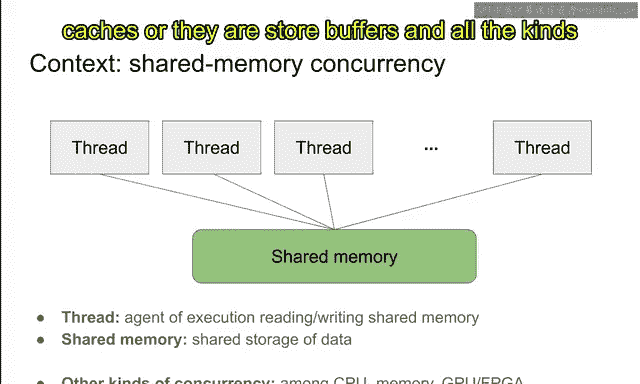

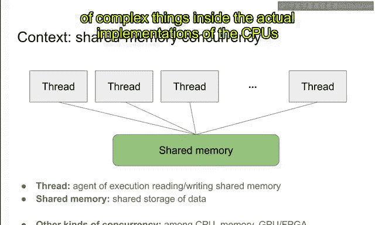

我们假设程序中有多个线程，这些线程同时共享同一块内存。例如，有线程1、2、3……N，它们都共享内存。

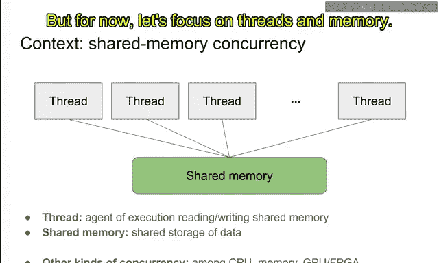

这是一个简化的视图，忽略了实际CPU和内存实现中的缓存、存储等复杂细节。但为了本课程当前的目的，我们暂时只关注线程和共享内存，其他细节将在后续讨论。

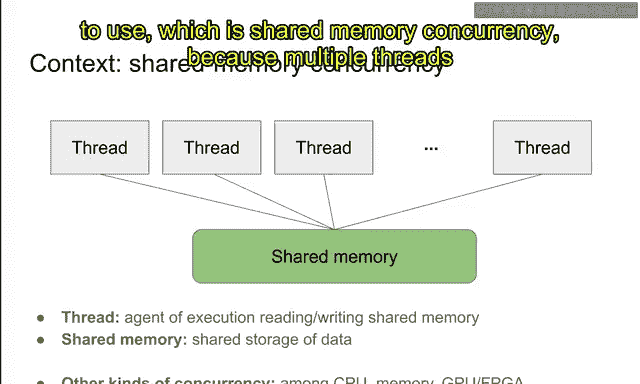


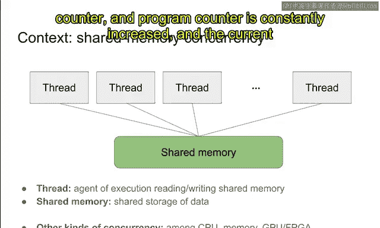


不过，缓存一致性等优化在理解并发中扮演着关键角色，我们稍后会学习它们。但现在，让我们聚焦于线程和内存。


这就是我们将要使用的并发模型——**共享内存并发**，因为多个线程同时共享同一内存。


线程本质上是一个执行自身程序的代理。它通常拥有一个程序计数器，程序计数器不断递增，线程执行当前的指令。


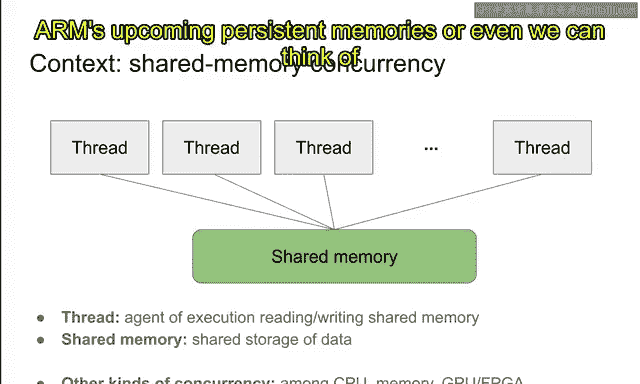

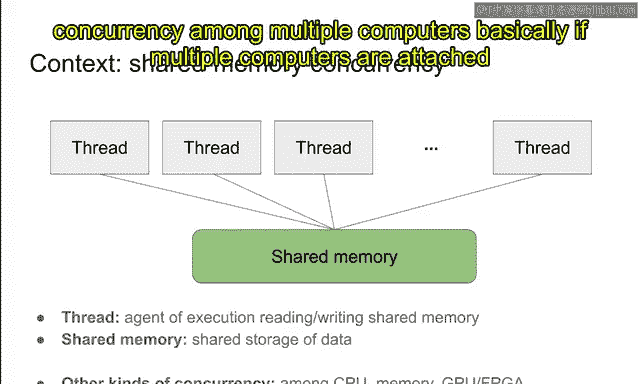

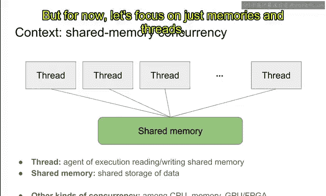

线程拥有一个本地存储，通常称为寄存器或寄存器文件。它独立更新寄存器，并时不时地访问位于栈或堆中的共享内存。它向共享内存发起读写请求，并从中获取响应。在此过程中，它独立执行，并可能执行一些I/O操作，使其效果对外部世界可见。这就是线程的基本概念。

如果你已经学习过操作系统课程，可能对这些概念很熟悉。我在这里重申这些概念，是因为我想强调线程的一个方面：**线程是访问共享内存或共享资源的代理**。另一方面，**共享内存是一种资源**，它是一个共享的数据存储资源，数据被写入和读取。因此，它是一个被多个线程共享的资源。我想强调共享内存的这一方面。


但就目前而言，让我们只关注内存和线程。这是我们当前学习的背景。


## 什么是基于锁的并发？🔒

现在，让我介绍**基于锁的并发**。

“基于锁”意味着在任何时刻，一个内存位置只能被一个代理访问。也就是说，在基于锁的并发中，多个线程不会同时访问同一位置。这基本上就是“基于锁”的含义。

这对应于上一讲中介绍的“简单并发”。正如上一讲所说，这种方法的主要好处是**简单性**。我们基本上消除了所有对同一资源的共享可变访问所带来的有趣并发。因此，它很简单，只有一个代理访问资源，没有实际的并发。

然而，这种方法的缺点是它可能且经常是低效的，因为我们消除了所有并发，结果只有一个代理可以访问单个资源。因此，我们无法同时并行执行多个代理或线程。这是基于锁并发的缺点。

但无论如何，我们从基于锁的并发开始，因为它简单。在我们掌握了基于锁并发的概念之后，我们将学习无锁并发。

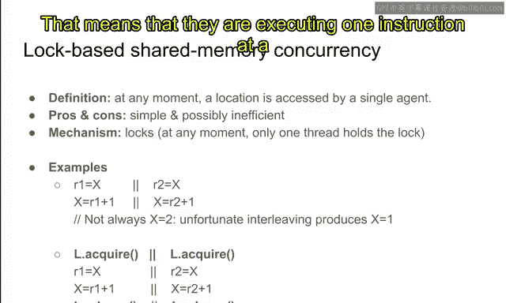

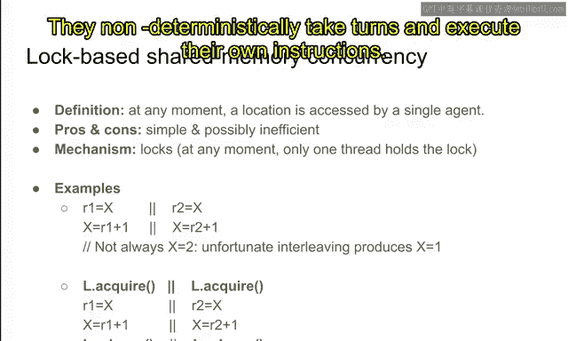

实现或编程这种基于锁并发的主要机制，毫不意外地，就是**锁**。

锁是一个对象，同一时间只能被一个线程持有。锁基本上就像一个门前的物体，只有一个代理可以持有它。如果一个代理持有锁，另一个试图获取它的代理必须等待前者完成使用。这有效地消除了所有并发。

## 一个并发问题的例子

这里有一个例子。假设有两个线程，双竖线表示线程分隔。左边是左线程，右边是右线程。我们假设这些大写字母从现在起代表共享内存位置，小写字母代表寄存器或线程本地寄存器。

这个程序基本上是从 `X` 读取值，加1，然后将新值赋回 `X`。同时，右线程做同样的事情：从 `X` 读取，加1，然后存回 `X`。另外，按照惯例，我们假设所有共享内存位置在执行开始时都是零。

你可能会猜测，最终 `X` 应该是2，因为它在左线程中递增了1，在右线程中也递增了1，所以总共递增了两次，应该是2。然而，这个推理是错的，实际上不会发生。我的意思是，在真实系统中它并不成立，因为线程执行的不幸交错可能产生例如 `X` 等于1的结果。

让我们看看为什么。假设这些线程以交错方式执行，意味着它们一次执行一条指令，轮流执行。


假设在一次执行中，左线程执行第一条指令，从 `X` 读取0并赋值0给 `r1`。然后假设右线程轮换，它再次从 `X` 读取0。现在左线程轮换，将1赋值给 `X`。然后右线程取1，可能 `X` 再次被赋值为1。在这个特定的指令执行调度中，`X` 在两个线程中被读取为0，并在两个线程中被赋值为1。如果是这种情况，最终 `X` 可能不是2，而是1。

这种异常或不幸的非确定性源于 `X` 这个共享内存位置实际上是以共享可变的方式被访问的，因为它们同时访问该位置并修改其内容。这是对同一资源的共享可变访问，它导致了问题，超出了我们对程序应如何工作的思考或想象范围。

## 锁的引入与作用

为了纠正这个问题，我们需要保护对 `X` 的访问。最简单的方法是插入一个锁。

假设 `L` 是两个线程共享的锁，`L` 有两个接口（方法）。第一个是 `acquire`，用于在锁未被持有时获取锁；另一个API是 `release`，如果你持有锁，释放它后就不再持有锁。

现在，在这种保护下，不幸的交错不会发生。因为假设左线程执行这里的第一个指令并获取锁，然后它可以读写位置 `X`。但如果这个线程获取了锁并持有它，右线程就无法进入这一行，因为它必须等待左线程释放锁。它会在第一行等待，`acquire` 函数在成功获取锁之前不会退出。因此，左线程对 `X` 的所有访问必须发生在右线程对 `X` 的所有访问之前。结果，我们的想象或意图得以实现。`X` 最终总是2，因为锁防止了这种不幸的交错。

锁是如此有用的构造，它允许我们进行这样的推理，因为同一时间只有一个代理访问单个资源，我们不再需要推理不幸的交错以及由这些交错产生的非确定性。

## 锁的基本API

到目前为止一切顺利。如前所述，锁有两个API，另外还有一个API `try_acquire`。`acquire` 会阻塞直到获取锁，即等待其他线程释放锁。`try_acquire` 返回是否获取了锁，当另一个线程已经持有锁时，它可能立即返回 `false`（表示尝试获取锁但失败了），或者返回 `true`（表示成功获取了锁）。第三个API是 `release`，用于释放之前已经获取的锁。

这些是锁的基本API，这是所有并发编程中最重要的对象——锁的最重要的API。

如果你能很好地使用这些API，那么就能保证不再有对资源的共享可变访问，我们可能更容易推理并发程序。

## 传统锁API的缺陷 🚨

但是有一个陷阱：这些API**极其容易出错**，非常容易被误用，导致系统挂起或环境被破坏。

例如，如果你在这里不写 `release`，系统就会挂起，因为另一个线程无法获取锁。另一方面，如果你忘记在这里插入 `acquire`，那么最终 `X` 等于2的不变量可能不成立。你需要非常聪明地插入这些API调用，只有成功且正确地插入，系统才能按你的意图工作。

但这样做极其容易出错，原因有二：

1.  **缺乏显式关联**：从API本身来看，使用 `L` 保护 `X` 是有些巧合或隐含的。我的意思是，代码中没有 `L` 和 `X` 之间的显式关系。我们程序员只是知道“哦，`X` 是由 `L` 保护的”，因此我们可以安全地在代码中使用 `X`。但由于没有这种显式标记，我们可能会获取一个并非用于保护 `X` 的锁，或者使用一个并非由这个锁 `L` 保护的资源。如果发生这种情况，所有的不变量都会被破坏，不幸的结果就会出现。

2.  **需要精确匹配**：你需要很好地匹配 `acquire` 和 `release`。不能忘记释放锁，也不能忘记获取锁，并且必须释放你已经获取的锁。如果你释放了不同的锁，那就有问题。

由于这些原因，我认为这些API真的很容易出错。我知道很多程序（如Linux）都是这样实现的，并且维护得很好，但对于初学者和大型代码库来说，仍然非常容易出错。大型代码库在用这种方式编写程序时通常会有bug，因为没有人理解整个代码库，不变量变得极其复杂。如果API处于低级层面，我们无法静态地保证整个程序编写良好。

对于并发编程来说，这个API问题尤其成问题。因为程序员需要时刻关注API，成本很高，并发程序通常比顺序程序有更复杂的不变量，因此程序员需要时刻考虑这些复杂的不变量，这给程序员带来了非常高的认知负荷。即便如此，即使程序员非常关注这些bug，大型系统中通常仍然存在剩余的bug。我见过数百万或千万行代码的并发程序，它们通常有很多bug，因为没有人理解整个不变量，而且这种bug也很难测试，因为它们通常是隐藏的，可能每十亿次才出现一次，因此很难为这类并发程序实现高测试覆盖率。

这就是为什么我们希望为这些锁使用高级API，因为我们想要易于使用且安全的API。如果一个锁API总是安全的，并且防错，那么对程序员来说就容易得多，因为程序员不再需要担心安全性。如果程序使用这种高级API编译，那么就没问题，编译器保证锁会按预期工作。这是一个巨大的好处。如果没有这种好处，程序员必须时刻关注不变量；但如果编译器保证了这个不变量，你就可以忘记它，直接使用高级API，自动就不会有bug。

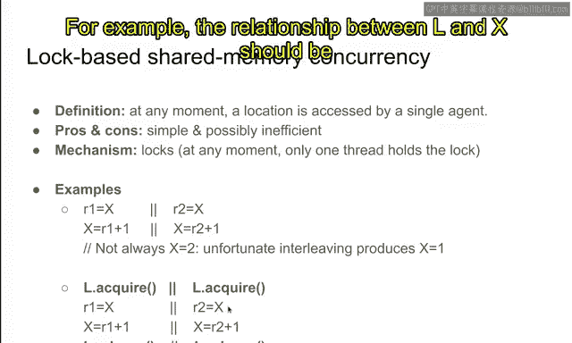

## 高级API的需求与C++的尝试

具体来说，我们想要一个能自动匹配 `acquire` 和 `release` 函数的高级API，并且这个高级API应该显式地将锁和相应的内部资源关联起来。例如，`L` 和 `X` 之间的关系应该在程序中显式标记。这样，就不会混淆哪个锁保护哪个数据。


如前所述，这种高级API成本低，引入的bug少，因为所有bug都会因高级API和编译器而自动消除。

对于锁，已经有很多种高级API，最著名的是来自C++及其**资源获取即初始化（RAII）** 的能力。

这个API的高级思想有两点：

1.  为了自动匹配 `acquire` 和 `release` 调用，我们引入一个RAII类型——**锁守卫（lock_guard）**。当你获取一个锁时，它返回一个 `lock_guard`，而不是什么都不返回。当这个 `lock_guard` 被销毁时，相应的锁会自动释放。因此，只要这个锁守卫存在（只要没有故意忘记它），创建该锁守卫的对应锁就会自动释放。`acquire` 和 `release` 函数被自动匹配。这基本上是锁守卫的意图。

2.  为了以显式的方式关联锁和资源，我们引入一个新类型 `Lock<T>`。这基本上是一个锁和类型 `T` 的数据的配对。它显式地标记了一个锁与 `T` 类型数据的关联。因此，我们不再混淆哪个数据由哪个资源保护。

让我展示这两个思想的例子。这是C++标准库中 `lock_guard` 的API示例。

```cpp
std::mutex g_i_mutex; // 这是一个锁
int g_i = 0; // 共享数据

void safe_increment() {
    std::lock_guard<std::mutex> lock(g_i_mutex); // 获取锁，创建锁守卫
    ++g_i; // 安全地访问共享数据
    // lock_guard 在函数结束时自动销毁，释放锁
}
```

在这个函数中，通过创建 `lock_guard` 来获取锁。`lock_guard` 是一个RAII类型，它证明我已经获取了 `g_i_mutex` 这个锁。之后，我递增共享资源 `g_i`，这是安全的，因为我持有锁 `g_i_mutex`。在函数结束时，`lock_guard` 被销毁，`g_i_mutex` 被自动释放。这就是RAII背后的思想：你使用初始化器初始化这个资源（锁守卫），当它被销毁时，会自动运行一些代码（在这里是释放锁）。这样，我们就不会忘记释放锁，因为锁守卫会自动释放锁。

第二个思想是关联数据和锁，好处是它强制显式化哪个数据由哪个锁保护。类型看起来像这样：`Lock<T>` 类型由两个数据组成：一个具有 `acquire` 和 `release` 函数的低级锁类型，以及一个数据类型 `T`。当你通过调用 `lock` 函数获取锁时，你实际上是在获取锁，然后返回一个锁守卫，这标志着你已经获取了它。当你持有锁守卫时，你可以解引用内部数据，因为这是你已获取锁的证明，因此你有权访问内部数据。这就是为什么我们实现这个操作符的原因。当锁守卫被使用时，它可以自动转换为内部数据的引用。这是可能的，因为我们显式地关联了锁和数据。现在，在完成数据引用后，我们可以通过销毁锁守卫来释放锁，在锁守卫的析构函数中，我们在这里释放锁。因此，我们自动释放了锁。

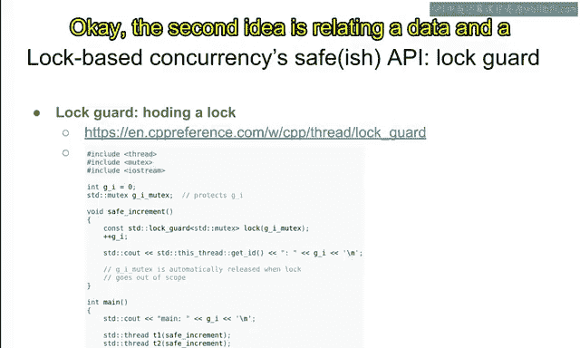

总之，这个API同时实现了两个目标：自动匹配获取和释放，并且显式地关联了锁和数据。

## C++高级API的安全漏洞

到目前为止一切顺利，这是一个相当好的API，我们可以认为它是C++编程语言内部基于锁API的典范，但实际上它并非100%安全。它更安全，但仍然存在大量可能破坏系统的情况。

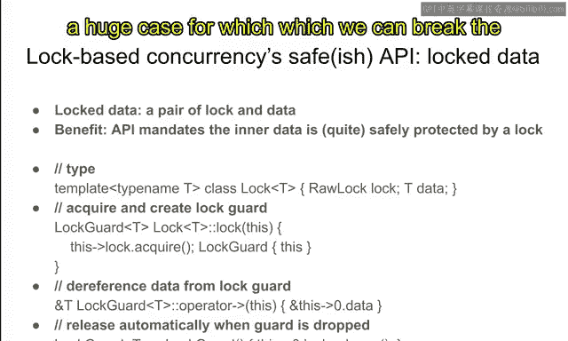

让我们看看这里发生了什么。假设有一个 `Lock<int>` 类型。你在这里获取锁并得到守卫 `guard`。假设你解引用守卫并得到指向数据的指针 `data_ptr`。这在C++中是允许的，因为你获取了守卫，守卫可以转换为指向数据的指针。

现在假设守卫在这里被丢弃或销毁，锁被自动释放。但问题是，指针 `data_ptr` 仍然存在，我们仍然可以在这里解引用数据指针。但如果是这样，就非常不安全，它破坏了锁提供的所有不变量。因为它可以在不持有锁的情况下访问内部数据，因为锁已经在这里被释放了。可能其他线程已经获取了锁并同时访问相同的数据，那么不幸的交错就可能从那里发生。这不再符合预期。

如前所述，这里的根本原因是这个指向数据的指针在守卫被销毁和锁被释放后**泄漏**了。所以 `data_ptr` 在守卫被丢弃后泄漏了，这是根本原因。相反，我们必须强制规定数据指针的生存期不应超过锁守卫的生存期。我的意思是，当守卫被销毁且锁被释放后，数据指针从现在起就不应再被使用。但它却被使用了，而API实际上允许这样做。


你可能认为争论这个API的不安全性是一种学究式的做法，你可能会说这在现实世界中不会发生。但根据我的经验，它确实在现实世界的生产代码中发生，并导致了很多麻烦。它在现实世界代码中发生的原因是，如果允许，程序员会做他们想做的任何事情。如果可以从中获取指针，他们会为了以后的目的而获取。可能是出于好意，他们在这里获取指针并在守卫被丢弃前使用它。但后来，他们忘记了这个不变量，在守卫被丢弃后使用了指针。因此，如果有很多程序员在一个大型代码库上工作，很难保证API按预期使用。所以在我看来，这种API非常容易出错，并且确实在现实世界的生产代码中造成了麻烦。

## Rust的解决方案：基于所有权和生命周期的类型系统

我在这里提出的解决方案是使用基于**所有权和生命周期**的Rust编程语言类型系统。

Rust专门设计用于避免所有此类问题，所以这基本上是一个生命周期问题：数据指针的生命周期不应长于数据守卫的生命周期，这应该在类型系统中得到某种保证。这基本上是Rust类型系统的目的。

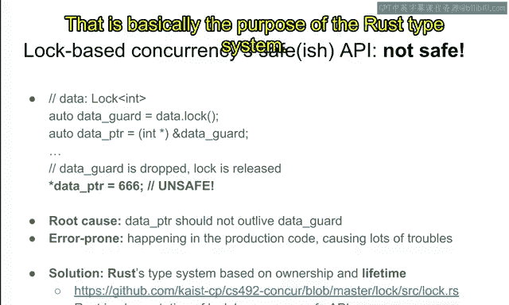

防止库和程序的生存期问题。在Rust类型系统中，我们实际上可以保证这一点。这就是为什么Rust可以解决此类问题。

这也是为什么在本课程中，我们将使用Rust而不是在并发编程中最广泛使用的C++。因为我相信类型系统是非常好的API。它为学习和实现并发库提供了非常好的API。通过学习这个，我相信你可以成为更好的并发程序员。即使你将来在烹饪编程中使用C++，学习Rust并用Rust学习并发也将非常有帮助。

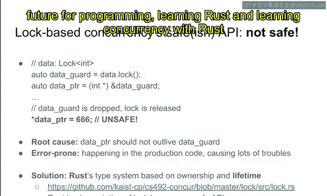

这里有一个具有安全API的锁的安全实现，这个API的安全性已在一篇研究论文中得到证明。这个API将在本课程的后续阶段讨论。

## 总结与预告


总之，这就是为什么C++中的这个API不安全，以及我提到这个API在Rust中可以变得安全。

在深入研究Rust中的安全API之前，我们确实需要先学习Rust。所以在下一个视频中，我们将快速学习Rust，然后回到并发，继续学习基于锁的并发及其核心概念和API。

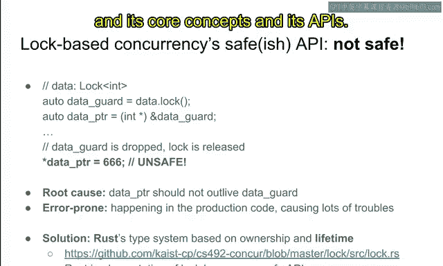


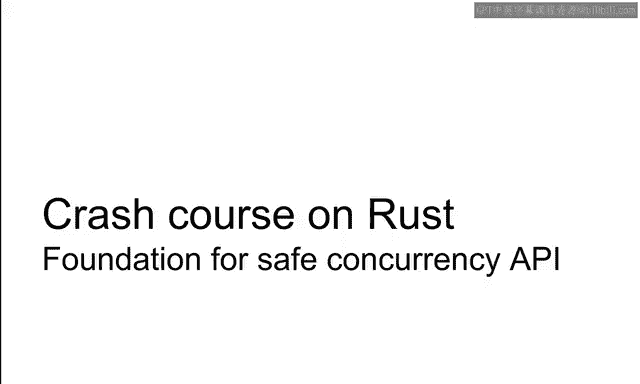

在本节课中，我们一起学习了：
1.  共享内存并发模型的基本概念。
2.  基于锁的并发如何通过限制同一时间只有一个线程访问资源来简化问题。
3.  传统锁API（`acquire`/`release`）的缺陷：缺乏显式关联和需要精确匹配，导致容易出错。
4.  对更安全、高级API的需求，特别是能自动管理锁生命周期并显式关联数据与锁的API。
5.  C++通过RAII模式（如 `lock_guard`）和 `Lock<T>` 模板向这个方向努力，但仍存在指针泄漏导致的安全漏洞。
6.  介绍了Rust的所有权和生命周期系统如何从根本上解决这类安全问题，为学习安全的并发编程提供了更好的基础。


下一节，我们将开始Rust的快速入门课程。