# 9：基于锁的并发与Spinlock/Rayon API 🧵

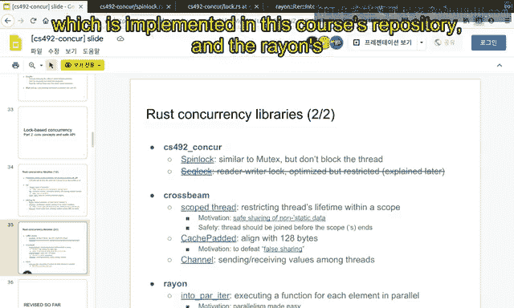

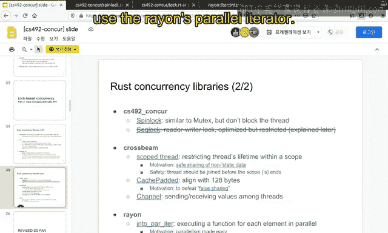

在本节课中，我们将学习课程仓库中实现的自旋锁（Spinlock），以及构建在其他并发库之上的并行库 Rayon 的 `ParallelIterator`。在大多数情况下，人们希望使用并行库，因为它将并发细节抽象到库中。我们将展示使用 Rayon 的并行迭代器是多么简单。

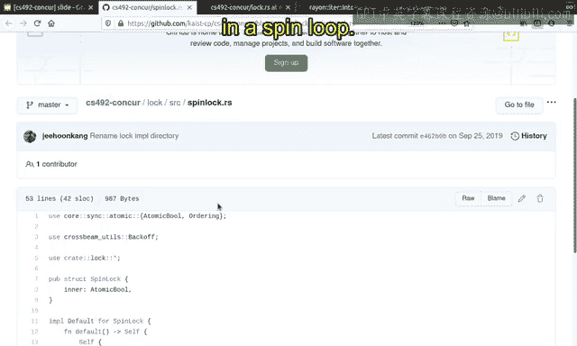

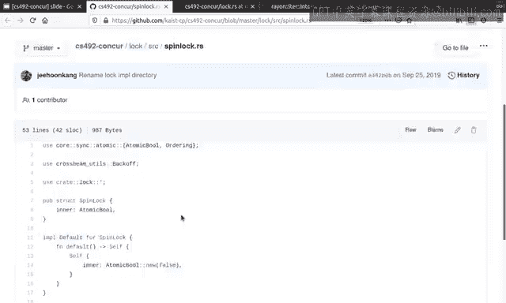

## 自旋锁（Spinlock）介绍 🔄

首先，我们来介绍课程仓库中的自旋锁。你可以在 `log` 文件夹和 `source` 文件夹下搜索 `spinlock.rs` 找到它。它定义了一个自旋锁，其特点是在一个循环中不断尝试获取锁，这也是它被称为“自旋”锁的原因。


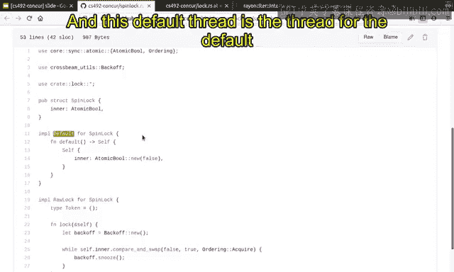

自旋锁的核心是一个布尔值，但这个布尔值可以被多个线程访问，这是它与普通布尔值的唯一区别。它是一个原子布尔类型（`AtomicBool`）。

这个布尔值表示锁是否被持有。如果为 `true`，则表示锁已被某个线程持有；如果为 `false`，则表示锁未被任何人持有。这就是自旋锁内部布尔值的含义。

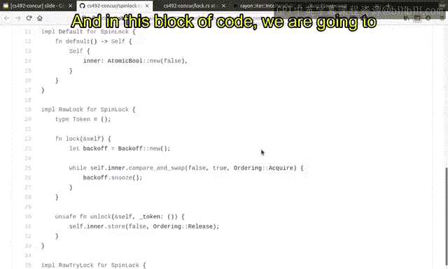

## 自旋锁的默认值与初始化 📝

`Default` trait 为自旋锁定义了默认值。在这个实现中，默认值是 `false`，因为在执行开始时，自旋锁没有被任何人持有。

```rust
impl Default for Spinlock {
    fn default() -> Self {
        Spinlock { inner: AtomicBool::new(false) }
    }
}
```

如果你已经阅读过 Rust 的相关书籍，可以立即看出这段代码的语法成分。`Default` trait 定义在标准库中，用于指定一个类型的默认值。这里的 `self` 指的是 `Spinlock` 类型本身，它创建了一个 `Spinlock` 实例，其内部值初始化为 `false`。

## 自旋锁的加锁与解锁操作 🔐

接下来，我们定义自旋锁的加锁和解锁操作。

`lock` 函数被定义在这里。它需要一个类型参数 `Token`。`Token` 基本上是由 `lock` 函数返回的一个值。`lock` 函数不仅获取锁，还会返回一个类似收据或证明的东西，表明锁被你持有。`Token` 就扮演了这个角色。对于自旋锁，`Token` 只是一个没有实际意义的唯一值；但对于其他类型的锁，可能会有更复杂的 `Token`。因此，对于自旋锁，你可以安全地忽略 `Token` 的内容。

让我们先忽略 `Token`，看看 `lock` 和 `unlock` 函数。

在 `lock` 函数中，我们定义了一个名为 `backoff` 的结构。`backoff` 是一种数据结构，它让处理自旋循环变得更容易。在自旋循环中，不鼓励尽可能快地自旋，因为当某些条件未满足（特别是锁未被获取）时，在短时间内你很可能再次无法获取锁。因此，如果你没有获取到锁，等待一小段时间是有益的。`backoff` 正是做这件事的：当调用 `backoff.spin()` 时，它会等待一小会儿（可能是微秒或毫秒级）。它还会指数级增加等待延迟。一开始，它可能立即返回，希望锁只是暂时被其他人持有；但如果你尝试了一次又一次，多次调用 `backoff`，它会认为“我可能不会很快获取到锁”，因此会等待更久，甚至可能将 CPU 时间让给其他线程（yield）。这就是自旋循环中指数退避的机制。

以下是自旋循环的代码：
```rust
let mut backoff = Backoff::new();
loop {
    if self.inner.compare_exchange_weak(false, true, Ordering::Acquire, Ordering::Relaxed).is_ok() {
        return Token { _private: () };
    }
    backoff.spin();
}
```
它尝试原子地将 `false` 值交换为 `true`。这些操作的确切含义将在后续视频中讨论，但目前只需记住：`lock` 函数尝试原子地将 `false` 替换为 `true`。如果成功，则返回。这是合理的，因为这个函数原子地将 `false` 替换为 `true`，意味着锁被某人持有，而那个人就是我。

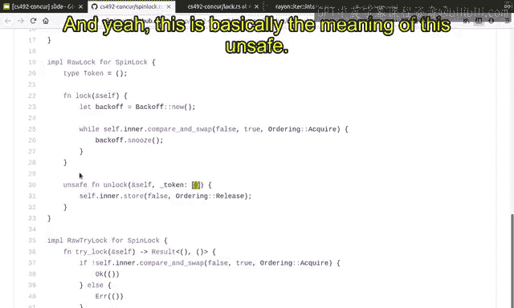

`unlock` 函数非常相似，它只是尝试将 `false` 值存储到原子布尔中。
```rust
unsafe fn unlock(&self, _token: Token) {
    self.inner.store(false, Ordering::Release);
}
```
这意味着：“我完成了对内部数据的访问，因此我通过存储 `false` 值来释放锁。” 这有效地向其他线程表明，锁从现在起由我释放，可以被你获取。

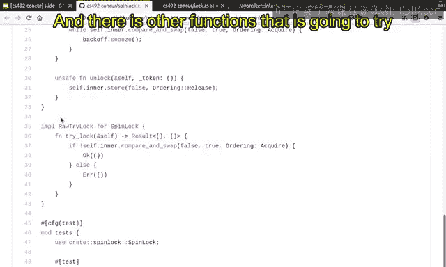

这个函数被标记为 `unsafe`，因为它的函数签名并不总是能保证 API 的安全使用。例如，你不应该解锁一个未被你获取的自旋锁。同时，你必须提供与 `lock` 函数返回的相同的 `Token`。这些并不是由 Rust API 保证的，而是需要 API 使用者来满足的契约。这就是它被标记为 `unsafe` 的原因。其实现并非 100% 安全，因为它有一个契约需要 API 使用者满足，即：由 `lock` 函数给出的 `Token` 应该作为参数传递给这里的 `unlock` 函数。

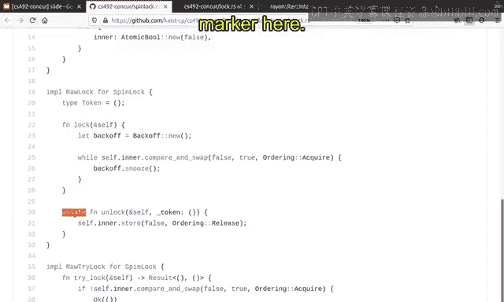

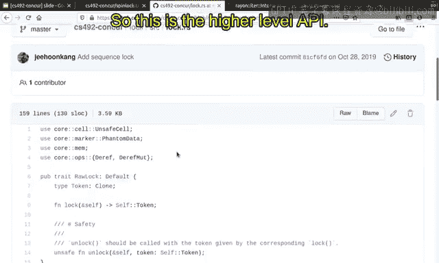

## 尝试获取锁 🎯

还有其他函数尝试获取锁，而不是在这里自旋循环。例如 `try_lock` 函数：
```rust
fn try_lock(&self) -> Option<Token> {
    if self.inner.compare_exchange(false, true, Ordering::Acquire, Ordering::Relaxed).is_ok() {
        Some(Token { _private: () })
    } else {
        None
    }
}
```
它与上面的实现几乎相同，因此在本课程中不详细解释。`compare_exchange` 的含义以及 `Acquire` 和 `Release` 排序的含义将在后续视频中讨论。

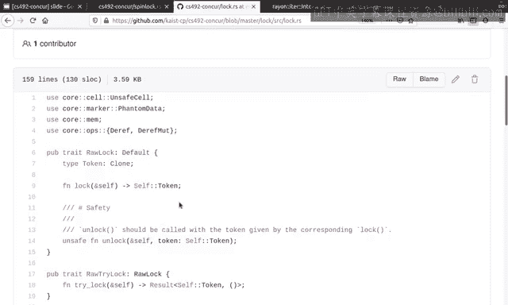

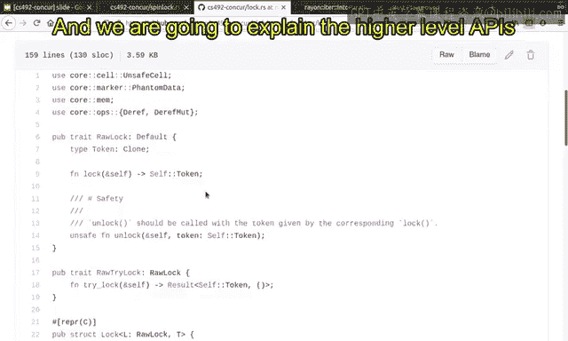

## 高级锁 API 的引入 🚀

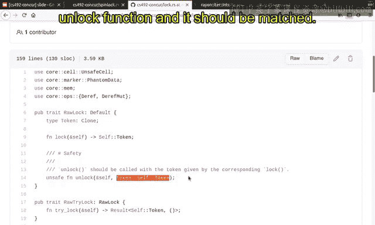

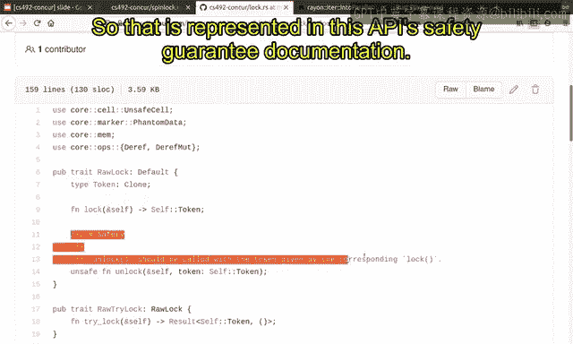

上一节我们研究了自旋锁的 API 以及它们需要被标记为 `unsafe` 的原因。现在，我将解释一个更高级的自旋锁 API，它消除了使用 `unsafe` 标记的必要性。

这是更高级的 API，它定义了一个 trait `RawLock`，所有原始锁都应该满足这个 trait。
```rust
pub unsafe trait RawLock {
    type Token;
    fn lock(&self) -> Self::Token;
    unsafe fn unlock(&self, token: Self::Token);
}
```
这里我们定义了 `Token` 类型和 `lock` 函数（返回 `Token`），以及 `unlock` 函数。正如之前解释的，`unlock` 函数在这里被标记为 `unsafe`，并且只有在与对应 `lock` 函数给出的 `Token` 一起使用时才是安全的。这一点在这里有文档说明，但不由 Rust 保证，期望用户满足这个安全条件。

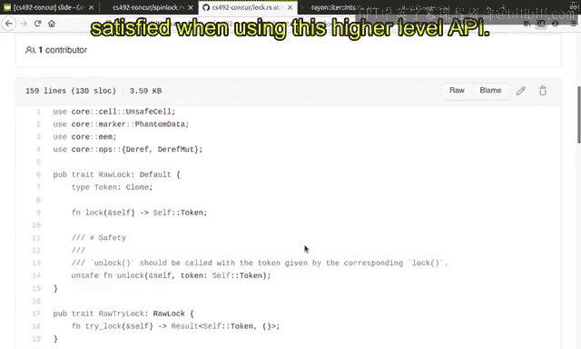

## 高级 API 的优势：满足锁的保证 ✅

回忆一下之前的讲座，我们讨论过锁必须满足两个保证：
1.  加锁和解锁必须匹配。这在这里体现为：`lock` 函数返回的 `Token` 应该提供给 `unlock` 函数，并且必须匹配。这在这个 API 的安全保证中有所体现。
2.  用户应满足的另一个保证是：受自旋锁保护的数据应该与保护它的锁相关联。这两个方面的保证或契约在使用这个高级 API 时会自动得到满足。

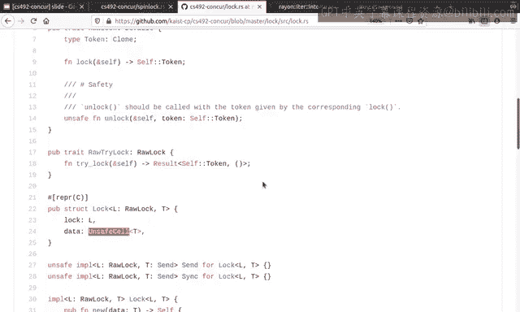

让我解释一下这里的 `struct`，它由锁和数据组成。正如我解释的，锁和数据应该成对出现，它们是一枚硬币的两面，所以我们需要将它们放入一个 `struct` 中。
```rust
pub struct Lock<L: RawLock, T> {
    lock: L,
    data: UnsafeCell<T>,
}
```
这里我把 `T` 包装在 `UnsafeCell` 中，这意味着它具有内部可变性。这是完全可以的，因为在使用锁时，你将仅通过共享引用来可变地访问内部数据。这就是为什么我们需要将 `T` 放入 `UnsafeCell` 中，以表明它是内部可变的数据。在 Rust 中，当你想要定义内部可变性时，你会将数据放入 `UnsafeCell` 中。目前只需记住这一点，如果你对技术细节感兴趣，请在 Google 上搜索 “unsafe cell interior mutability”。

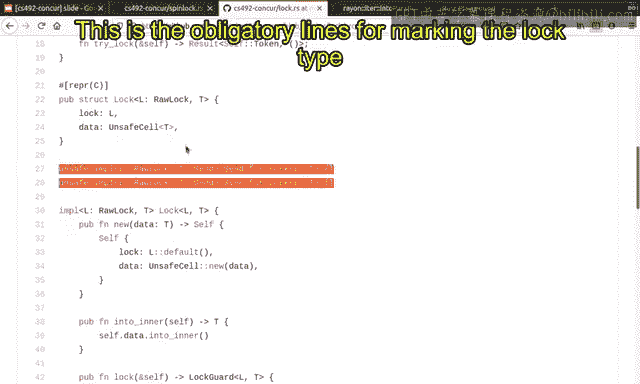

## 锁类型的 Send 与 Sync 标记 📦

这是标记锁类型为 `Send` 和 `Sync` 的必要代码行。
```rust
unsafe impl<L: RawLock + Send, T: Send> Send for Lock<L, T> {}
unsafe impl<L: RawLock + Sync, T> Sync for Lock<L, T> {}
```
底层类型 `T` 必须是 `Send`（可发送的），因为它被多个线程访问。然而，`T` 不需要是 `Sync`（可同步的），这意味着不存在多个线程同时访问数据 `T` 的情况。这是由自旋锁或其他锁的实现保证的。在自旋锁中，当一个线程获取锁时，它是唯一持有锁的线程，因此其他线程不可能同时访问 `T` 的相同数据。这就是为什么它不需要是 `Sync` 的原因。

此外，它们被标记为 `unsafe`，因为正如我所说，这些保证是由锁的实现保证的，而不是由 Rust 类型系统自动保证的。它是由我们自己的、需要手动检查的实现来保证的。这就是为什么这些行应该被标记为 `unsafe`，以表明“我需要手动检查锁类型实际上是 `Send` 和 `Sync` 的”。

## 锁的创建、销毁与守卫 🛡️

当你使用一个原始锁类型（例如自旋锁）和一个数据类型 `T` 来创建锁时，你会得到一个类型为 `T` 的数据，它是受此锁保护的初始值。锁将是默认值（对于自旋锁是 `false`）。此外，数据也被初始化，它被包装在 `UnsafeCell` 中，并被赋予数据值。

你可以销毁锁并获取其内部数据 `T`。这是实现该功能的 API。当你拥有这个锁的完全所有权时，你可以直接销毁锁并获取内部数据，这样它就不再受自旋锁或其他类型锁的保护。

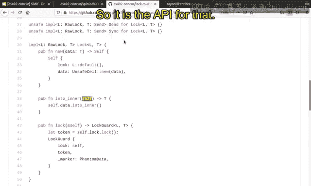

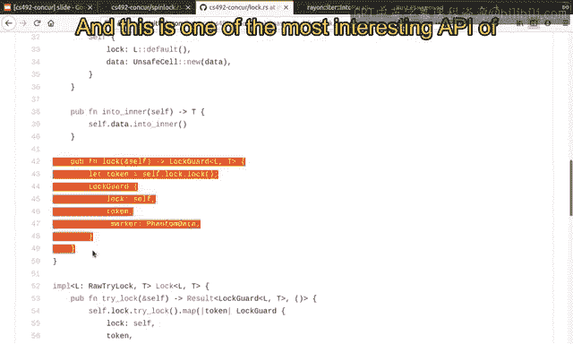

这是此类锁类型最有趣的 API 之一。当你调用 `lock` 方法时，它不仅获取内部锁，还会返回一个 `LockGuard`（锁守卫）。`LockGuard`，正如我们在上一讲中讨论的，是你已获取锁的证明。因此，它持有锁本身和 `Token`。`Token` 由 `lock` 返回，它部分证明了你已获取锁，并且应该被提供给 `unlock` 函数，所以它应该被记住在这个锁守卫内部。

到目前为止一切顺利。这是一种保证或证明锁已被获取的类型。我们如何使用它呢？在锁类型中，它有一个静态保证的范围，用于限定这个 `LockGuard` 的生命周期。回忆一下 Rust 书中的内容：当作用域在这里使用时，这个结构体被保证不会超出给定的生命周期 `'s`。锁守卫应该在生命周期 `'s` 结束之前被丢弃。这就是这个作用域的含义。

这个作用域在这里，因为你使用一个生命周期来获取锁。这是锁的生命周期，它在这里被不可变地借用。这个作用域在这里，锁守卫的作用域只是被复制并粘贴到这个锁守卫中。它是省略的，但仍然保证这个锁守卫不会比这里的锁的生命周期活得更久。这是非常符合预期的，因为锁守卫不应该比锁本身活得更久。它由这里描述的生命周期来保证。

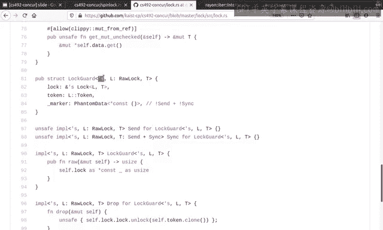

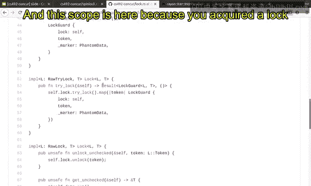

锁守卫还有一个对锁的引用，这基本上就是为什么 `'s` 出现在这个锁守卫的实现中。你还有一个 `Token`，它保证应该被提供给解锁函数。

这里有很多函数，但代码中最有趣的部分是这个 `Drop` 实现。
```rust
impl<'s, L: RawLock, T> Drop for LockGuard<'s, L, T> {
    fn drop(&mut self) {
        unsafe {
            self.lock.unlock(self.token);
        }
    }
}
```
当锁守卫被丢弃或销毁时，正如我们讨论的，底层的锁应该被自动释放。我们如何做到这一点？我们通过使用 `Token` 调用解锁函数来实现。这就是全部，我们只是解锁它。这是我们在锁守卫结束时唯一需要做的事情。

注意，这里的解锁调用被包装在 `unsafe` 块中，因为正如我们讨论的，内部锁的 `unlock` 函数是 `unsafe` 的，它需要保证 `Token` 应该与 `lock` 函数返回的那个相同。但这由我们的实现保证。这里的 `Token` 实际上就是由 `lock` 函数返回的那个。这就是为什么我们满足了原始锁 API 设定的保证或契约。这就是为什么我们不需要将这个函数标记为 `unsafe`。丢弃一个锁守卫总是安全的，因为底层数据结构的不变式是由我们自己保证的。

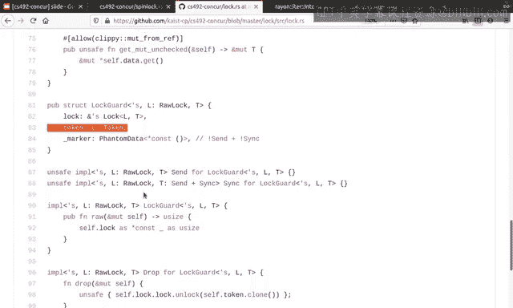

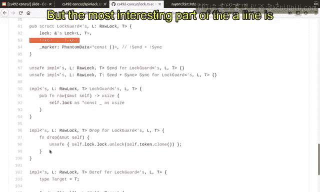

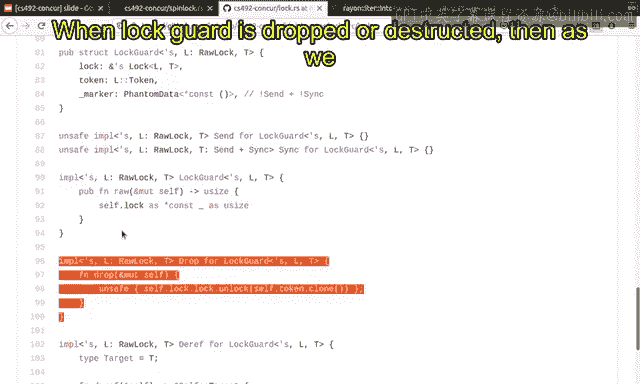

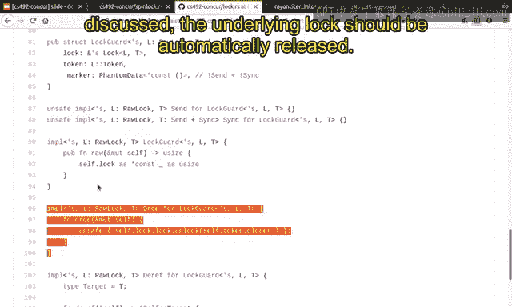

因此，你需要看到这里的 `unsafe` 包装器，这正是我们需要手动检查是否满足保证的地方。

## 使用锁守卫访问数据 🔓

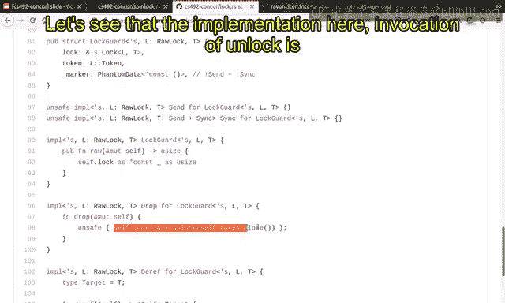

那么如何使用这个锁守卫呢？这两个 `Deref` 实现是问题中最重要和有趣的部分。
```rust
impl<'s, L: RawLock, T> Deref for LockGuard<'s, L, T> {
    type Target = T;
    fn deref(&self) -> &T {
        unsafe { &*self.lock.data.get() }
    }
}
impl<'s, L: RawLock, T> DerefMut for LockGuard<'s, L, T> {
    fn deref_mut(&mut self) -> &mut T {
        unsafe { &mut *self.lock.data.get() }
    }
}
```
当你有一个锁守卫时，你可以解引用内部数据类型。正如我所说，锁守卫保证你已经获取了锁，因此你可以可变或不可变地访问内部数据。这由这两个函数保证。所以，当你有一个锁守卫时，你可以解引用内部数据。其实现是 `unsafe` 的，因为你可以访问内部数据这一事实是由锁的实现保证的。同样，你可以可变地解引用内部数据，其实现也是 `unsafe` 的，原因相同：你是唯一访问数据的人，这个不变式是由自旋锁的实现保证的，而不是由 Rust 的类型系统自动保证的。

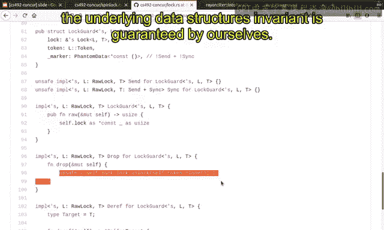

它还有其他类型的 API，使我们的生活更轻松。请在你愿意的时候也看看其他代码。这基本上就是自旋锁的 API 和锁的高级 API 的一些实现细节。

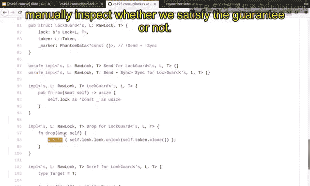

## 从底层并发到高级并行 ✨

到目前为止，我们讨论了许多并发库的低级 API，它们非常底层，涉及锁、线程和条件变量等。现在，让我展示一个非常高级的并行库 API 的示例。

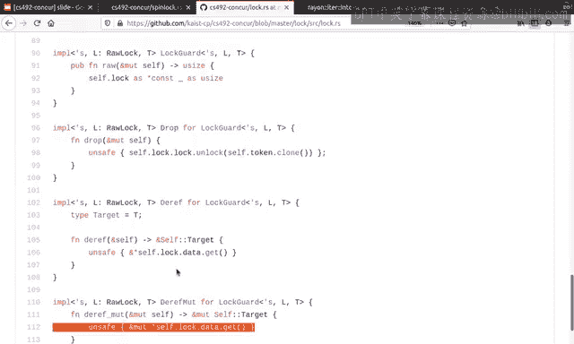

Rayon 的 `ParallelIterator` 就是这种范例的缩影。从现在开始，我根本不想讨论并发。我只有一个从 0 到 100 的包含 100 个元素的区间，我只想并行地对其执行一个操作。这就是我想在这段代码中实现的想法。如何实现？

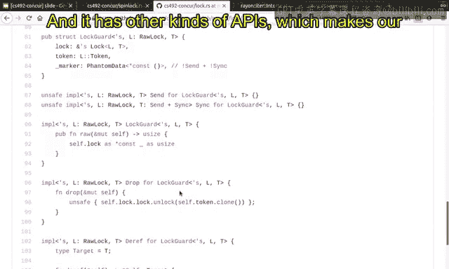

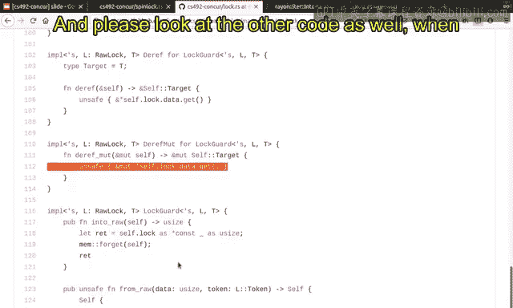

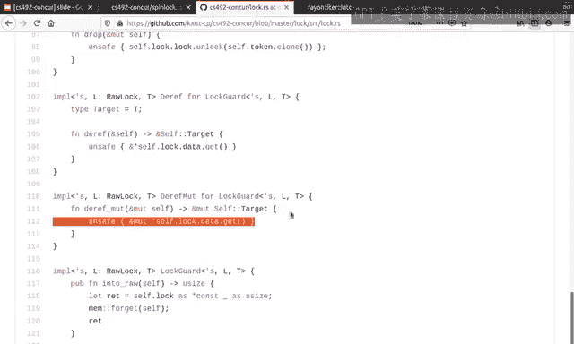

如果要用低级 API 实现，我们需要以某种方式同步多个线程并将工作分配给多个线程。但这是非常底层的细节。我希望库能替我处理这些，而不是我自己来做。

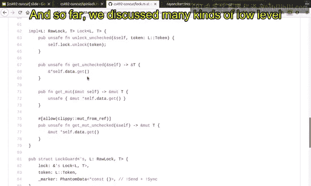


这行代码就做到了这一点：
```rust
(0..100).into_par_iter().for_each(|i| {
    println!("{}", i);
});
```
这行代码自动将工作并行化到多个线程。如果你的 CPU 有，例如，6 个线程，那么它会将工作分配到 6 个线程上。它会自动检测你拥有的 CPU 核心和线程数，并自动将工作分配给多个线程。

这就是全部，这就是并行化你的工作负载所需的全部代码。

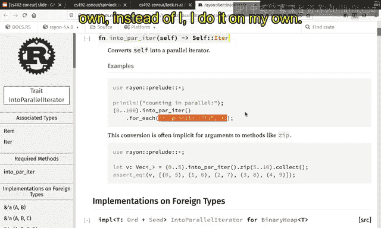

以下是运行示例中复制粘贴的代码。它实际上是并行执行的。从这里到这里，你看不出它是否是真正并行的。但这里有一些稍后执行的值，这恰恰是并行性生效的证据。范围从 50 到 74 的元素在不同的线程中执行，但它们被调度得更晚，这就是为什么它们没有在 75 之前执行。所以这基本上证明了这段代码是并行化的，并且在多个线程中执行，而无需了解任何底层细节。它是非常高级的，甚至没有提到线程，但工作自动分布在多个线程中。

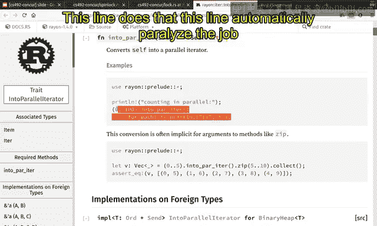

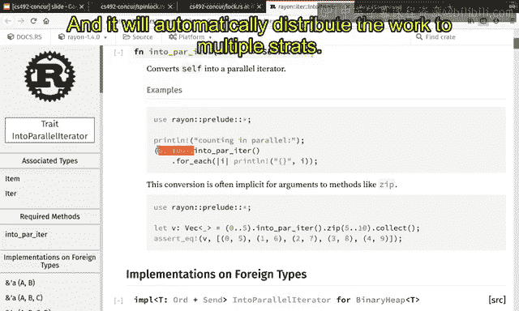

进一步的好处是，这个 API 是 100% 安全的。当你使用 `into_par_iter` 时，你不需要担心这个库的正确性，库作者应该已经在他们的实现中考虑了安全性。

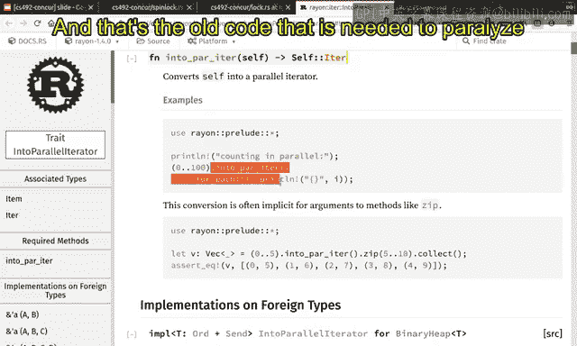

Rayon 在底层是建立在 crossbeam 之上的，crossbeam 是 Rust 的一个重量级并发库。在下一个视频中，我们将学习 crossbeam 及其一些 API。

## 总结 📚

本节课中，我们一起学习了：
1.  **自旋锁（Spinlock）** 的基本概念与底层实现，包括其基于原子布尔值的状态管理、指数退避的自旋循环，以及需要手动匹配的 `lock`/`unlock` 操作（标记为 `unsafe`）。
2.  **高级锁抽象 API** 的设计，它通过 `RawLock` trait 和 `Lock` 结构体将锁与其保护的数据绑定，并利用 `LockGuard` 和 Rust 的生命周期机制，自动管理锁的获取与释放，从而提供了安全、易用的接口。
3.  **并行库 Rayon** 的 `ParallelIterator` 展示了如何通过高级抽象（如 `into_par_iter().for_each(...)`）轻松实现数据并行，而无需直接处理线程创建、任务分配等底层并发细节，极大地简化了并行编程。

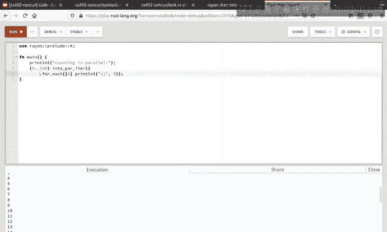

我们从底层的锁原语开始，逐步上升到高级的并行迭代器，看到了 Rust 并发编程中从手动控制到自动管理的抽象层次。理解底层机制有助于我们编写正确高效的并发代码，而利用高级抽象则能让我们专注于业务逻辑，提升开发效率。在接下来的课程中，我们将深入探讨支撑这些高级抽象（如 Rayon）的底层并发库。