# 11：共享内存并发的非确定性


在本节课中，我们将学习共享内存并发编程中的非确定性行为，特别是由指令重排引起的“宽松行为”。我们将通过示例理解这些问题，并学习如何使用内存排序原语（如“获取”和“释放”）来约束这些行为，从而编写出正确且高效的并发程序。

---

## 概述：共享内存的挑战

在共享内存并发编程中，我们面临两个主要的非确定性来源：
1.  **线程交错**：多个线程的指令以不确定的顺序交错执行。
2.  **指令重排**：单个线程内的指令可能被编译器或处理器重新排序。

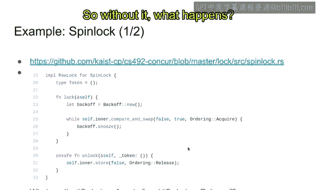

线程交错是并发编程的固有特性，而指令重排则是为了优化性能，但在并发环境下可能破坏程序的正确性。本节课我们将重点探讨后者。

---

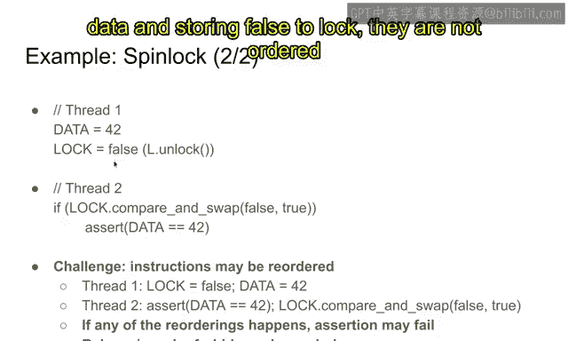

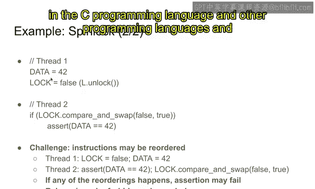

## 自旋锁示例：为何需要内存排序

在上一节中，我们讨论了自旋锁需要使用“获取”和“释放”排序进行标注。让我们通过一个简化的例子来理解其必要性。

以下是自旋锁 `lock` 和 `unlock` 函数的伪代码：

```rust
// lock 函数
fn lock(lock: &AtomicBool) {
    while lock.compare_and_swap(false, true, Ordering::Acquire) != false {
        // 自旋等待
    }
}

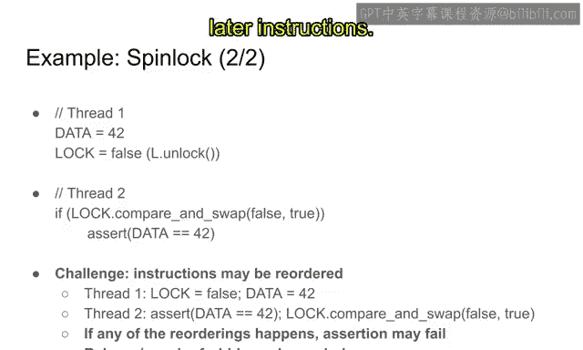

// unlock 函数
fn unlock(lock: &AtomicBool) {
    lock.store(false, Ordering::Release);
}
```

*   `lock` 函数尝试原子地将锁变量从 `false` 改为 `true`，使用 **`Acquire`** 排序。
*   `unlock` 函数将锁变量存回 `false`，使用 **`Release`** 排序。

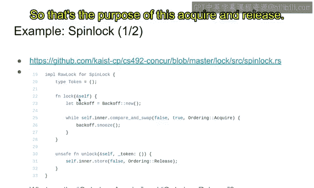

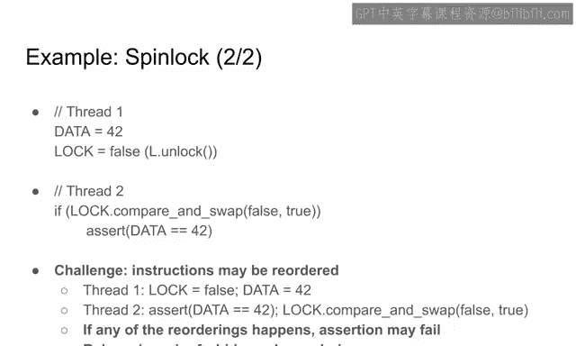

这个算法的逻辑是清晰的：只有一个线程能成功将锁从 `false` 改为 `true`，从而获得锁。释放锁时，将值设回 `false`。

**那么，`Acquire` 和 `Release` 排序的含义是什么？如果没有它们会发生什么？**

---

## 问题根源：指令重排

为了理解内存排序的作用，我们将自旋锁保护共享数据的场景简化为一个“消息传递”示例。

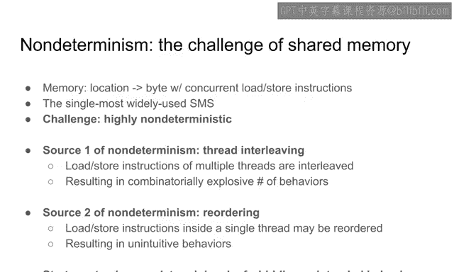

假设有两个线程（Thread 1 和 Thread 2）和一个共享变量 `data`（初始值未定义），以及一个作为信号量的 `flag` 变量（初始为 `false`）。

```rust
// Thread 1
data = 42;
flag.store(true, Ordering::Relaxed); // 类似于 unlock 中的 store(false)

// Thread 2
while !flag.load(Ordering::Relaxed) { // 类似于 lock 中的循环
    // 自旋等待
}
assert!(data == 42); // 断言：此时 data 应该为 42
```

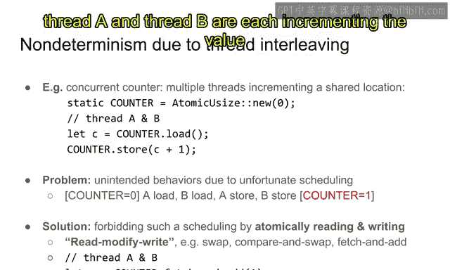

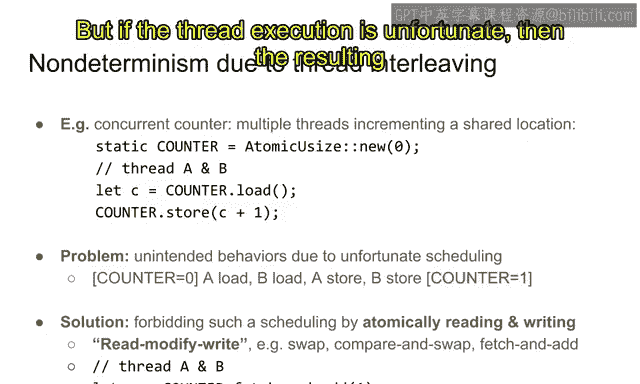

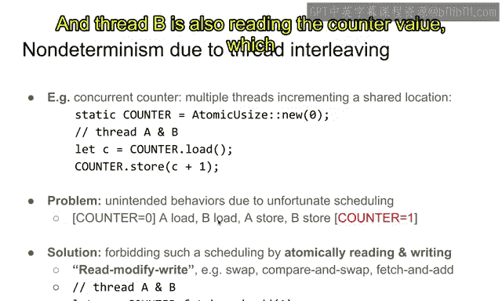

**这个代码的问题在于，指令可能会被重排。**

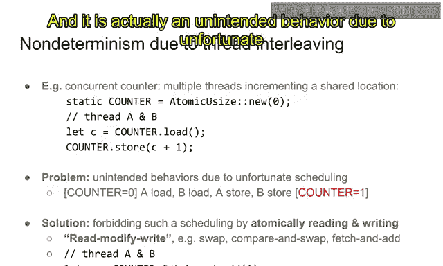

*   在 **Thread 1** 中，`data = 42` 和 `flag.store(true)` 是向不同地址的两次存储。编译器和处理器可能会为了效率将这两条指令重排，导致 `flag` 先被设为 `true`。
*   在 **Thread 2** 中，`flag.load()` 和 `assert!(data == 42)` 是一次加载和一次读取。它们也可能被重排，导致先执行断言。

如果发生任何一种重排，Thread 2 的断言就可能失败，因为它可能在 `data` 被正确写入之前就读取了它的值。

**`Acquire` 和 `Release` 排序的作用正是禁止这类重排：**
*   **`Release` 排序**：确保在 `Release` 存储**之前**的所有内存操作（如 `data = 42`），都不会被重排到该存储**之后**。
*   **`Acquire` 排序**：确保在 `Acquire` 加载**之后**的所有内存操作（如 `assert!(data == 42)`），都不会被重排到该加载**之前**。

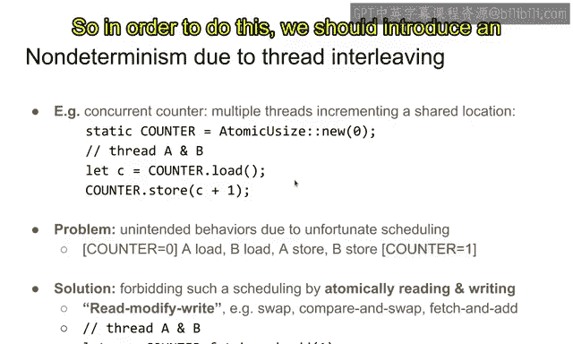

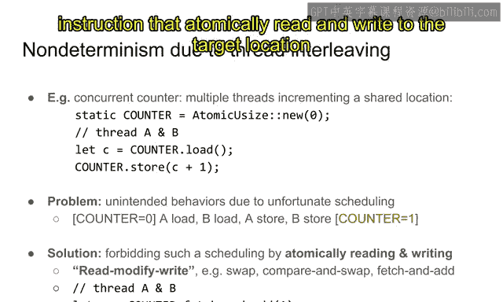

这样，当 `flag` 作为同步点时，就能保证 `data = 42` 的逻辑一定在 `flag` 被设置**之前**完成，并且在 `flag` 被读取到为 `true` **之后**，`data` 的值一定是 `42`。

---

## 非确定性的两大来源

现在，让我们系统地总结共享内存并发中的非确定性。

### 1. 线程交错

这是最直观的非确定性。多个线程的指令以无数种可能的方式交错执行。

**示例：非原子计数器**
考虑一个简单的共享计数器，两个线程都想将其增加 1。

```rust
// 非原子操作
let mut counter = 0;

// Thread A
let tmp = counter; // 读取
tmp = tmp + 1;     // 计算
counter = tmp;     // 写入

// Thread B (执行相同的操作)
let tmp = counter;
tmp = tmp + 1;
counter = tmp;
```

如果执行顺序不幸地交错如下：
1.  A 读取 `counter` 为 0。
2.  B 读取 `counter` 为 0。
3.  A 写入 `counter` 为 1。
4.  B 写入 `counter` 为 1。

最终结果是 1 而不是 2。这是因为“读取-修改-写入”这三个步骤不是原子操作，线程可以在其间被切换。

**解决方法：原子读-修改-写指令**
使用原子指令（如 `fetch_add`）可以确保整个“读-改-写”操作不可分割。

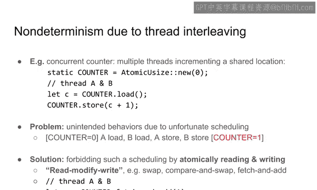

```rust
use std::sync::atomic::{AtomicI32, Ordering};

let counter = AtomicI32::new(0);

// Thread A
counter.fetch_add(1, Ordering::Relaxed);

// Thread B
counter.fetch_add(1, Ordering::Relaxed);
```
`fetch_add` 是原子操作，调度器无法在其执行过程中中断，从而保证了最终结果为 2。

### 2. 指令重排（宽松行为）

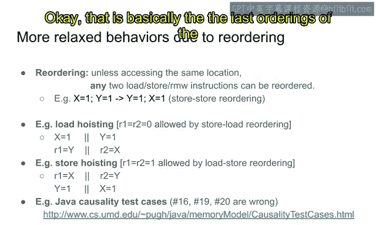

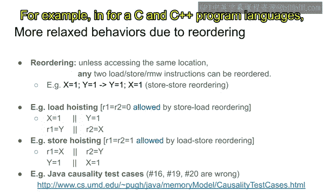

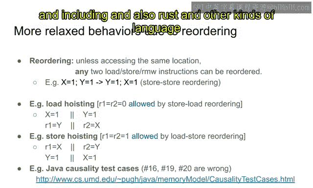

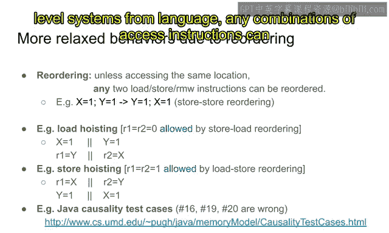

这是更隐蔽的非确定性来源。编译器和处理器会对单线程内的指令进行重排优化，前提是**不影响该线程的串行执行结果**。但在多线程环境下，其他线程可能观察到这种重排，导致违反直觉的行为。

这种**仅因指令重排而可能出现的行为**，在并发编程文献中常被称为 **“宽松行为”**。

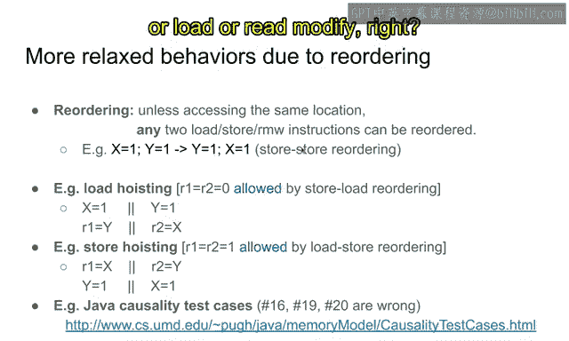

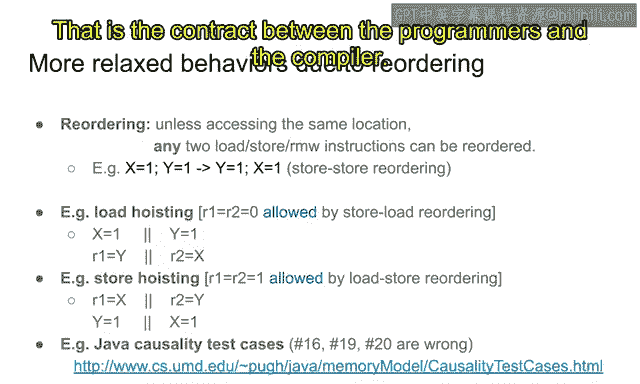

以下是两个经典的宽松行为示例：

**a) 加载上浮**
```rust
// 初始状态: x = 0, y = 0

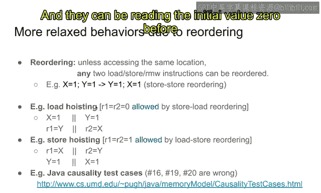

// Thread 1           // Thread 2
x = 1;                y = 1;
r1 = y;               r2 = x;
```
问题：`r1` 和 `r2` 是否可能同时为 0？
*   在纯线程交错模型中，不可能。因为总有一个 `x=1` 或 `y=1` 先执行。
*   在允许重排的模型中，**可能**。因为 `r1 = y` 可能被重排到 `x = 1` 之前执行，`r2 = x` 也可能被重排到 `y = 1` 之前执行。这样两个线程都先读取了初始值 0。

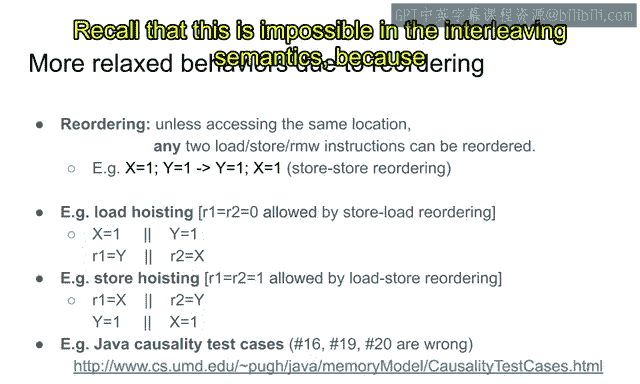

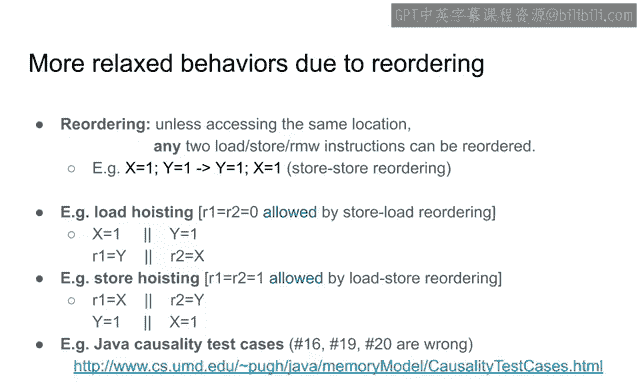

**b) 存储下沉**
```rust
// 初始状态: x = 0, y = 0

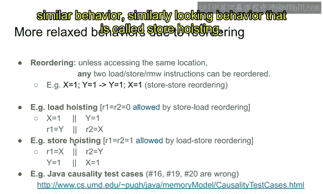

// Thread 1           // Thread 2
r1 = x;               r2 = y;
y = 1;                x = 1;
```
问题：`r1` 和 `r2` 是否可能同时为 1？
*   在纯线程交错模型中，不可能。因为读取操作必须发生在任一写入操作之前或之后。
*   在允许重排的模型中，**可能**。因为 `y = 1` 可能被重排到 `r1 = x` 之前执行，`x = 1` 也可能被重排到 `r2 = y` 之前执行。这样两个读取操作都可能读到对方线程写入的值 1。

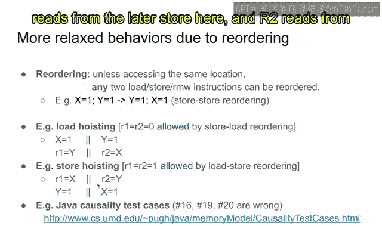

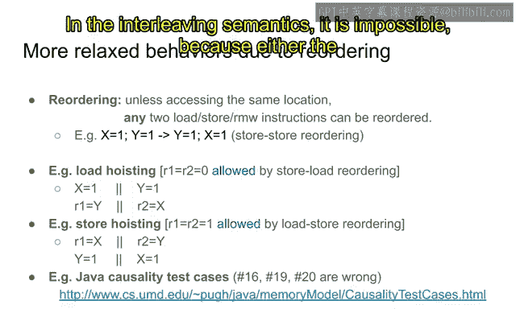

这些行为在真实的 ARM 等架构上确实会发生（尽管概率很低）。正是这种罕见性使得由此引发的并发 Bug 极难发现和复现。

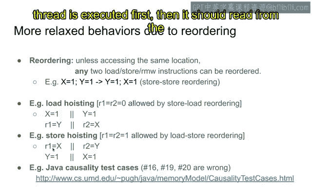

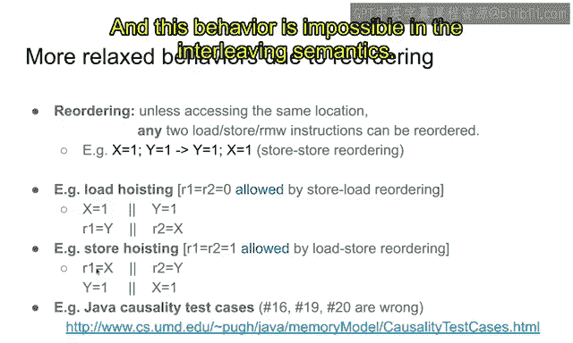

---

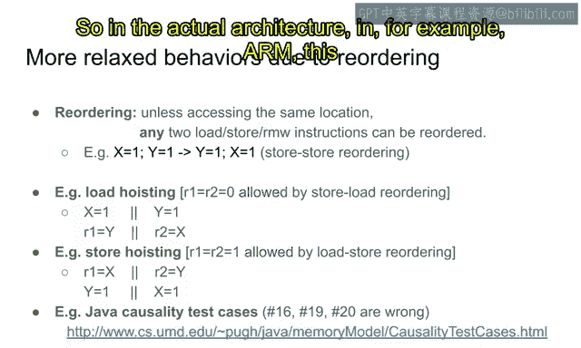

## 如何约束宽松行为：内存顺序

为了编写正确的并发程序，我们需要有能力禁止那些会导致错误的重排。主要方法有两种：

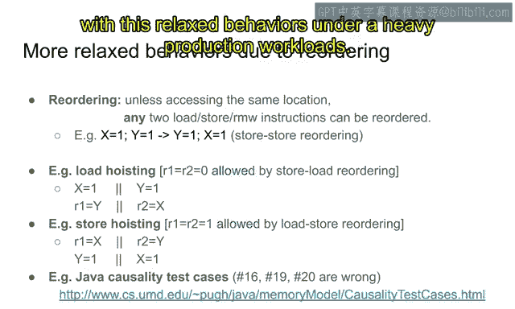

### 1. 使用获取-释放排序

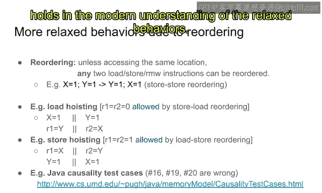

正如在自旋锁示例中看到的：
*   **`Release`**：用于存储操作。保证该操作**之前**的所有内存访问，都不会被重排到该存储**之后**。
*   **`Acquire`**：用于加载操作。保证该操作**之后**的所有内存访问，都不会被重排到该加载**之前**。

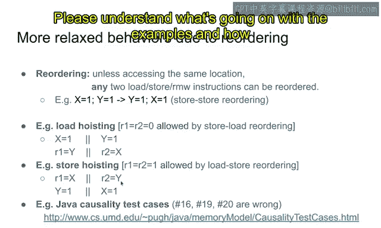

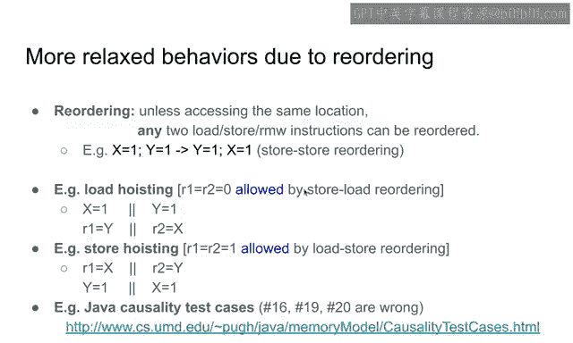

当一条 `Release` 存储与一条 `Acquire` 加载配对成功（即 `Acquire` 加载读到了 `Release` 存储写入的值）时，它们之间就建立了一种“同步”关系。这保证了 `Release` 之前的所有写操作，对执行 `Acquire` 的线程来说都是可见的。

### 2. 使用内存栅栏

内存栅栏是一条独立的指令，它在代码中建立一个屏障。

```rust
use std::sync::atomic::{fence, Ordering};

// Thread 1
data = 42;
fence(Ordering::Release); // 释放栅栏
flag.store(true, Ordering::Relaxed);

// Thread 2
while !flag.load(Ordering::Relaxed) {}
fence(Ordering::Acquire); // 获取栅栏
assert!(data == 42);
```
*   **释放栅栏**：保证在它**之前**的所有操作，都不会被重排到它**之后**。
*   **获取栅栏**：保证在它**之后**的所有操作，都不会被重排到它**之前**。

栅栏提供了比单个操作排序更全局的约束。`Release`/`Acquire` 排序可以看作是特定于某个原子变量的、更轻量级的栅栏。

---

## 对宽松行为建模

为了构建大型、正确的并发系统，我们需要精确理解不同内存顺序（如 `Relaxed`, `Acquire`, `Release`, `SeqCst`）的语义，知道哪些行为被允许，哪些被禁止。

学术界主要有三种建模方法：
1.  **禁止共享内存访问**：通过互斥锁等高级抽象完全隐藏共享内存。这虽然安全，但可能牺牲性能，且不够灵活。
2.  **公理语义**：通过一组数学公理来定义所有合法执行轨迹的集合。它严谨但不够直观，且可能允许一些现实中不存在的“怪异”行为。
3.  **操作语义**：通过定义抽象机器的逐步执行规则来建模。这更符合程序员的直觉，是当前研究的热点方向（如“Promise语义”），我们将在后续课程中深入探讨。

---

## 总结

本节课我们一起学习了共享内存并发编程中的非确定性挑战：
1.  **线程交错**是固有的，可通过**原子读-修改-写指令**来确保关键操作的不可分割性。
2.  **指令重排**会导致**宽松行为**，这是编译器和处理器优化的副作用。它可能破坏程序的逻辑正确性。
3.  我们可以使用**内存排序原语**来约束重排：
    *   **获取-释放排序**：在配对成功的存储和加载操作之间建立同步，保证可见性。
    *   **内存栅栏**：在代码中建立更全局的重排屏障。
4.  理解并正确使用这些工具，是编写高效且正确的底层并发数据结构的关键。为了精确理解这些机制，我们需要借助形式化的模型，如操作语义。

在接下来的课程中，我们将深入探讨这些内存模型，为构建复杂的并发程序打下坚实基础。