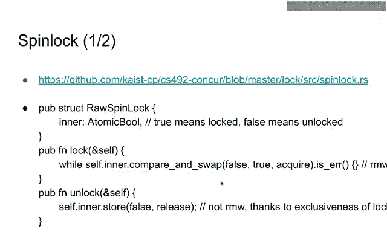
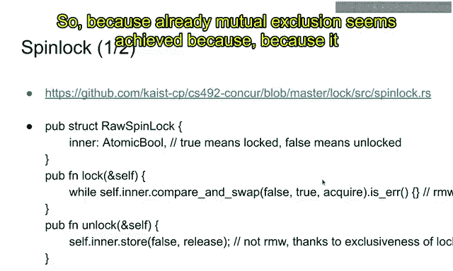
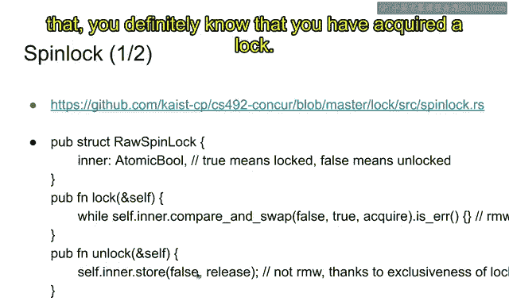
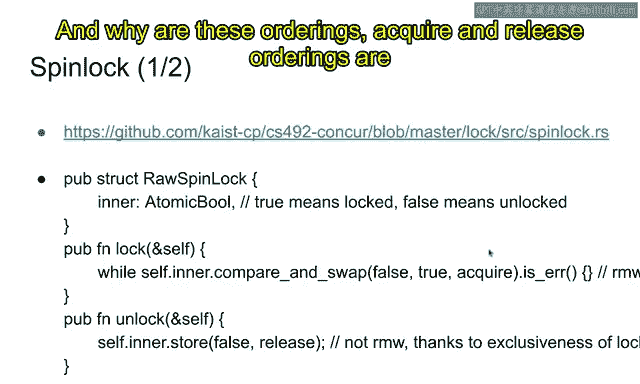
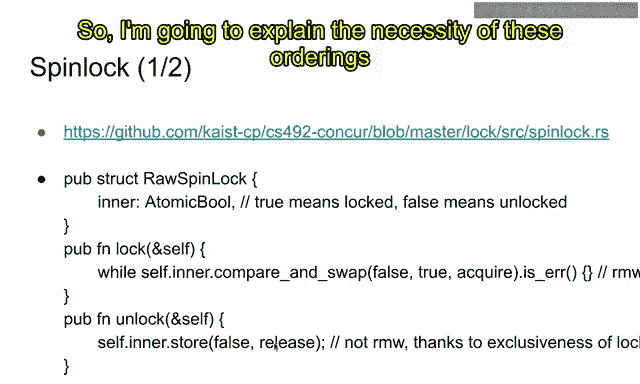
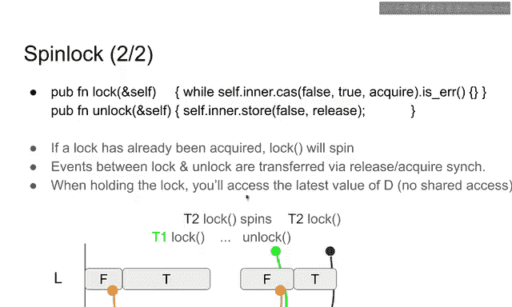

# 14：基于锁的并发，自旋锁的实现

在本节课中，我们将学习锁的实现。在上一节关于基于锁的并发的课程中，我们了解了锁的用例和接口。在本节中，我们将深入探讨具体的实现，理解其正确性以及它们满足哪些属性。

## 锁的作用回顾

锁用于将顺序数据结构当作并发数据结构来使用。例如，向量是最具代表性的顺序数据结构之一，它是一个元素数组，你可以向向量末尾添加元素等。

使其并发的最简单方法是使用锁来保护这个向量。当一个向量与锁配对时，在访问底层向量之前，你需要先获取锁。获取锁之后，你可以可变地访问向量。释放锁之后，其他线程才能获取锁并访问向量。

锁会序列化所有线程的所有操作，因此它完全禁止了并发操作。所有操作都被序列化，同一时间只有一个线程（例如）在访问向量。

锁之所以非常重要，是因为大多数所谓的并发编程实际上都是由这些锁来处理的。在大多数情况下，并发编程试图利用多个资源来测量相同的资源，但它并不特别关注优化或为高性能计算提供可扩展性。在大多数情况下，正确的同步才是目的。

例如，在操作系统中，如果一个数据结构（例如时钟）很少被多个线程访问，那么你可以安全地使用锁来保护这个时钟。如果多个线程试图同时访问同一个时钟，可能会降低性能，但我们的假设是这种情况不常发生，所以锁是足够的。在性能要求不高的服务中，甚至用锁来保护时钟也是可以的。

但是，如果你真的想使你的数据结构具有可扩展性，并希望利用程序允许的并行性机会，你真的需要使用其他方法。因为锁完全禁止并发操作，但在某些情况下，你实际上希望允许多个线程同时访问同一个数据结构。

这基本上是锁的权衡：它易于使用，但不可扩展。

## 锁的API与特性

本仓库包含了锁的实现，你可以看到Rust中的安全API以及实际的锁接口（即实际的锁实现，包括自旋锁、票据锁等）。我们将在课程的后期处理这类锁，今天我们将重点关注这里的API、自旋锁及其实现。

锁有很多种，这些锁之间也存在权衡。人们希望一个锁能同时具备简单、快速、紧凑、可扩展、公平、节能等所有优良特性，但不幸的是，不同的锁具有不同的特性，它们之间存在根本性的权衡。例如，自旋锁是最简单的锁实现，在无竞争时速度相当快，但它不可扩展、不公平，并且通常不节能等。因此，你需要为正确的场景选择合适的锁。

### Send与Sync特性

首先，让我们回顾一下Rust中锁的API。我们已经讨论过Rust中锁的API，包括Send、Sync特性以及包含`lock`和`unlock`方法的API。但为了给自旋锁的实现提供一个具体的背景，我想重新概述一下锁的安全API。

特性是类型的类或谓词。一个特性意味着“这个类型满足某些属性”或“这个类型不满足这些属性”。为了表达某些类型满足某些属性的想法，我们使用特性。

例如，Rust标准库提供了一个`Send`特性。如果一个类型`T`是`Send`，意味着数据`T`可以被转移到其他线程。例如，你可以发送一个旨在并发访问的原子字（`AtomicUsize`）到其他线程。同样，`usize`也可以发送到其他线程。但是，如果你有一个线程本地存储，它不应该被发送到其他线程，因为它特定于某个线程（例如，持有线程ID等），这种资源不能被其他线程使用，这就是为什么这类类型不应该实现`Send`。

另一方面，有一个`Sync`特性。如果类型`T`实现了`Sync`特性，意味着类型`T`可以被多个线程并发访问。也就是说，线程A和线程B可以并发访问数据。例如，旨在并发访问的原子字`AtomicUsize`肯定是`Sync`的，因为这种类型的目的是允许多个线程同时访问它。另一方面，一个不旨在并发的简单字不是`Sync`的，因为你没有特别标记该类型为`Sync`。显然，线程本地存储也不是`Sync`的，因为它旨在由单个线程使用，不应被其他线程访问。

这里有一个非常有趣的属性：`T`是`Sync`的，当且仅当其引用类型是`Send`的。这意味着，`T`可以被并发访问，当且仅当对`T`的引用可以发送到其他线程。这基本上解释了`Sync`的含义：引用是`Send`的，意味着类型`T`可以被并发访问。

请记住这里写的内容，因为`Send`和`Sync`特性将贯穿本课程。如果你有兴趣在Rust中实现并发程序，你将一直使用这些特性。

### RawLock特性

除了标准库提供的两个特性外，我们将使用另一个称为`RawLock`的特性。`RawLock`意味着它具有`lock`和`unlock`函数。我们已经讨论过这个接口，但我想重新表述一下。它有一个`lock`和一个`unlock`。当你对一个`RawLock`调用`lock`时，你将获得一个令牌。该令牌将用于解锁锁。你必须保证由你的`lock`提供的令牌会被返回到`unlock`函数。这是你必须确保满足的保证。

此外，`RawLock`本身也是数据。例如，自旋锁包含一个布尔值，指示锁是否被持有，所以它也是一个资源，并且在锁类型内部包含信息。因此，它也需要实现这个特性。要初始化锁，你需要实现`Default`特性，这意味着你可以创建一个新的`RawLock`类型的默认值。

此外，这个`RawLock`应该是`Send`和`Sync`的，因为这是一个锁，旨在从多个线程访问，这就是为什么它应该同时实现`Send`和`Sync`：它应该可以发送到其他线程，并且应该可以被多个线程同时访问。

这个`RawLock`有许多假设。例如，为了实现自旋锁并声称自旋锁实现了`RawLock`特性，你需要保证自旋锁的一些属性。其中最重要的是关于令牌的，令牌已经讨论过，但你想为自旋锁确保的最重要的属性是：**一次只有一个代理获取了锁**。

锁的目的是互斥。没有两个代理同时持有锁。这是锁的基本属性，你必须确保它得到保证。我们将实现保证这种互斥属性的自旋锁、票据锁和其他类型的锁。

## 锁类型与锁守卫

这是API的描述。使用这三个特性（`Send`、`Sync`、`RawLock`），我们实现锁类型。回顾一下，使用锁，你想在Rust中保证两件事：第一，你想将`RawLock`与数据关联起来；第二，当你完成对底层数据的访问时，你想自动释放锁。这两个结构保证了这一点。

首先，`Lock`类型有两个组件：`L`是一个`RawLock`，`T`是数据。它拥有数据`T`，类型为`T`的对象受`L`锁保护。例如，`L`是自旋锁，那么这就是受自旋锁保护的`T`。如果`L`是票据锁，那么这就是受票据锁保护的`T`，等等。这种类型再次保证了`RawLock`特性的保证：一次只有一个代理获取锁。这个`Lock`类型保证`T`对象完全不被并发访问。因此，只有一个代理可以访问底层数据，这是由这些锁类型保证的。

回顾一下，你想将锁与数据关联，而不是代码区域。你不应该从代码区域的角度来考虑并发编程的安全性，而应该从数据的角度来考虑：哪个资源或数据受哪个锁保护。这要求我们以这种方式思考，因为我们明确地将锁和数据关联起来，这就是为什么这个API自动保证了这种推理方式。

例如，我们有这个类型：`Lock<SpinLock, Vec<usize>>`。这是一个锁保护的数据，锁是自旋锁，数据是一个字向量。或者这个类型：`Lock<CHLock, &TLS>`。这是一个锁保护的数据，锁是我们稍后将学到的CH锁，保护的数据是对某些线程本地存储的引用。在Rust中，我们也可以表达这个想法。这个数据实际上不应该发送到其他线程。但你仍然可以在这里用锁保护它，并且你必须确保，即使它不受保护，因为底层数据不是`Send`/`Sync`的，它不能被其他线程访问。你必须确保这一点。

这种约束将由锁守卫实现。这些是特性约束。这个`Lock`类型是`Send`和`Sync`的，当且仅当底层类型`T`是`Send`的。这个类型不是`Send`的，对吧？这是一个TLS，即使有一个对TLS的引用，你可以立即看到，哦，这个类型不是`Send`的，因为它可以访问不能被其他线程访问的线程本地存储。这就是为什么整个类型，这种锁保护的数据，不是`Send`的，也不是`Sync`的。因为`Lock`类型被定义为`Send`/`Sync`仅当底层类型`T`是`Send`/`Sync`的。这实际上意味着，锁保护的数据只有在底层类型`T`是`Send`的情况下才有意义。这基本上是这个约束的想法。

另一方面，在左边的类型中，向量是`Send`的。即使你创建了一个向量，你也可以安全地将向量发送到其他线程，所以从API文档中可以很明显地看出，`T`在这种情况下是`Send`的，因此这个`Lock`类型也是`Send`和`Sync`的。这就是类型约束或特性约束。这种想法在Rust中使用一种巧妙的方式实现，请阅读代码，看看那里发生了什么，以及如何在这个`Lock`类型中表达这个想法。

### 锁守卫

锁实现了它的第一个目标：它将锁与数据关联起来。第二个结构，锁守卫，实现了这里的第二个目标：当你不再访问底层数据时，你想自动释放锁。

为了实现这一点，你定义了一个新类型`LockGuard`，它基本上是对底层值的访问器。它是你已获取锁的证明。当你为此锁类型调用`acquire`时，你将获得锁守卫，这意味着你已获取并持有锁。它旨在证明锁已被获取。正如我们在上一讲中讨论的，它是一个RAII类型，当它被丢弃时会释放锁，所以这是自动完成的。如果你不故意忘记这个锁守卫，当锁守卫被丢弃时，锁将被自动释放。所有对象最终都会被丢弃，这就是为什么底层锁会被自动释放。

到目前为止，一切顺利，而且非常方便。你不需要跟踪锁，也不需要为所有锁的实现插入解锁函数。通常在C++中，有很多与此相关的错误。你忘记释放锁。这种情况经常发生，并且它使程序的控制流变得非常复杂。在C++或Rust中使用RAII，问题将大大简化。因此，这是使用自旋锁更安全、更简单的API。

此外，这个锁守卫可以可变地解引用为类型`T`。这意味着它是类型`T`的可变访问器。如果你有一个锁守卫，那么你可以获取对与锁关联的底层值的引用或可变引用。如果你有一个锁守卫，它可以被转换为对类型`T`的可变引用。这非常符合预期，因为你持有锁，所以你也应该能够访问内部数据。

此外，如果底层类型`T`是`Send`的，这个锁守卫就是`Send`的；如果底层类型`T`是`Sync`的，它就是`Sync`的。换句话说，锁守卫在`Send`/`Sync`特性方面是透明的。让我这样说：如果`T`是`Send`的，那么你可以将锁守卫发送到其他线程。这意味着你可以获取一个锁，然后将你已获取锁的知识或所有权转移到其他线程。然后其他线程也可以访问数据，因为它实现了`DerefMut`。这就是为什么你必须要求类型`T`是`Send`的，只有当类型是`Send`的，你才能安全地将锁守卫发送到其他线程，以便其他线程可以安全地访问底层数据。其他线程在传递这个锁守卫后，可以丢弃这个锁守卫并释放锁。因此，如果这个锁守卫被发送到其他线程，它实际上意味着锁被一个线程获取，然后被其他线程释放。这是可能的，因为这里的`T`是`Send`的。

同样，如果你获取了一个锁，那么你可以将对数据的引用共享给其他线程。为了做到这一点，你必须确保`T`是`Sync`的。如果`T`可以被多个线程访问，那么锁守卫也可以被多个线程访问并解引用到它们的类型。原因在于，如果`T`不是`Sync`的，那么共享锁守卫是不安全的，因为其他线程可能引用底层数据。为了让其他线程安全地解引用底层数据，类型`T`也应该是`Sync`的。

到目前为止的解释总结如下：`LockGuard`是一个透明的类型包装器，关于`Send`和`Sync`特性。

我已经讨论了许多关于API的保证，这些API和安全性实际上已经针对Rust的所有权类型系统进行了形式化证明。因此，我可以相当确信，只要你满足API的保证，底层实现将按预期工作，无需担心任何问题。这是形式化证明的，意味着有一个证明并且由机器检查。所以这个证明不可能出错。这就是Rust相对于C++的力量所在。

## 自旋锁的实现

以上是关于Rust中安全API的内容。现在我们将专注于`RawLock`的实现。我们想实现一个自旋锁，然后我们必须确保自旋锁满足`RawLock`的保证或规范。我们将从自旋锁开始。

自旋锁在这个文件中实现。这是该文件的摘录。要查看自旋锁实现的每一个细节，请访问此站点并阅读代码。

现在让我们看看自旋锁的结构以及`lock`和`unlock`函数。

我们已经简要讨论了实现，但我想重复一遍，以便解释这里的排序。我们学习了排序：获取和释放排序。这里我们想使用获取-释放排序来推理自旋锁的安全性，基于承诺语义。

自旋锁基本上是一个布尔值，布尔值指示锁是否被锁定。`true`意味着自旋锁被锁定，`false`意味着它被解锁。此外，这个布尔值应该是原子的，因为多个线程试图同时获取或释放锁，所以它应该以某种方式是`Sync`的。为了使布尔值`Sync`，你必须使用这个`AtomicBool`类型。

到目前为止，一切顺利。这是一个原子布尔值。你将像这样实现一个`lock`函数。为了获取锁，你想确保在你获取锁之前，锁是`false`（即解锁状态）。在你获取锁之后，你必须确保锁包含`true`值，因为你刚刚获取了锁。这意味着`lock`函数应该原子地将`false`值替换为`true`值。这就是这个`compare_and_swap`函数的目的。`compare_and_swap`函数原子地将值从`false`替换为`true`。这基本上是锁的目的。

如果这个`compare_and_swap`成功，意味着你成功地将`false`值替换为`true`，那么你就知道你已获取了锁，然后你可以从这个`lock`函数返回，因为你已获取锁。另一方面，你的`compare_and_swap`可能会失败，因为那里的值已经是`true`，你无法将`false`替换为`true`，因为该值不是`false`。如果是这种情况，你必须再次循环。你必须回到循环的开头，并再次尝试`compare_and_swap`。这就是为什么这被称为自旋锁。它在`while`循环中自旋。只有当它成功地将值从`false`替换为`true`时，它才会退出循环并从函数返回。

另一方面，在`unlock`函数中，你只是将`false`值存储到底层值中。你已经获取了锁，所以你知道内部值已经是`true`。你也知道你是唯一知道该值是`true`的人，因为你获取了锁，这意味着其他人根本不持有锁。这就是为什么你可以直接存储`false`值。你不需要将`true`替换为`false`值，因为你已经知道该值是`true`。你可以直接将`false`值存储到内部变量中。这个存储可以帮助其他线程获取锁，因为它们正在等待值变为`false`，而`false`被替换为`true`。在这个线程将`false`值存储到内部变量后，其他线程就可以将`false`值替换为`true`。这就是为什么这可以实现为一个存储。`unlock`函数可以实现为存储`false`。

这里的语法与代码中的略有不同，为了将其放在一张幻灯片中，我做了很多简化，但请访问此站点查看那里的情况。它包含完整的、有效的Rust实现。

此外，你可以注意到这里有获取和释放排序。你可能想知道这是什么意思，为什么需要这个。因为互斥似乎已经实现了，因为它是原子地将`false`替换为`true`，所以不可能有多个线程同时持有锁。并且你可以存储`false`值，因为你肯定知道你已获取了锁。那么，为什么这些排序（获取和释放）甚至是必要的？它们的目的是什么？我将在下一张幻灯片中解释这些排序的必要性。

## 承诺语义下的解释

这是上一张幻灯片的简短表示法。我将解释在持有和未持有锁时，承诺语义中发生了什么。锁旨在保护数据，所以我想向你展示数据将如何演变，以及数据如何通过此实现受到锁的保护。

假设这个亮绿色线程（线程1）和深绿色线程（线程2）试图获取锁。锁在开始时是`false`，假设锁的这个消息知道这个数据的最新值。它有一个视图，一个释放视图，它的视图指向这个数据的最新值。

假设`D`也是数据，并且一些值被写入到这个位置`D`。在访问`D`结束时，锁应该是`false`，并且这个`false`消息的释放视图应该指向这个`D`的最新值。

线程1获取了锁。回顾一下，为了在这个`compare_and_swap`中成功，你必须将一条相邻的消息放到前一个值。它是`false`，现在变成`true`，因为你正在比较并交换`false`为`true`。这就是为什么我们在这里放置`T`消息，紧接在这个`F`消息之后，因为它们应该是相邻的。

锁的目的是，`T1`应该能够访问`D`的最新值。换句话说，`T1`不应该访问`D`的陈旧值。因此，`T1`的视图应该更新为指向`D`的最新值。这就是为什么它应该是获取的。为了总是观察到位置`D`的最新值，你必须获取这个`compare_and_swap`。当这是获取的时，你将获取前一条消息的释放视图，该视图旨在指向这个`D`的最新值。它应该被这个`lock`函数获取。

现在，在`T1`获取锁之后，`T2`可能想获取锁，但它会失败，因为它无法将`false`值替换为`true`，因为这里唯一的`false`值已经被一条`T`消息附加，并且这条`T`消息不能被转换，因为它要求前一个值是`false`。这意味着`T2`无法成功比较并交换该值，它将始终进入错误分支并一次又一次地循环，直到`T1`完成访问并释放锁。

现在`T1`已经获取了锁，这很好，它将能够访问数据`D`。它甚至可以按照自己的意愿修改数据，因为这是由锁API提供的。你获取了锁，所以你可以任意修改数据`D`。假设视图已更新为此，并且它包含了此时`D`的最新值。

现在`T1`试图解锁锁，以便`T2`稍后可以获取锁。回顾一下，内部值存储为`false`。所以你将...哦，对不起，我想先解释一下这里的`T2`情况。`T2`也试图调用`lock`，但它转换失败。它只是读取到最新值是`true`。所以你知道，哦，内部是`true`，所以我无法成功转换，所以你将进入错误分支。因为它是获取的，你知道你在这里获取了视图，因为这条消息释放了它。但你不打算获取锁，所以你基本上在这里自旋，它无法获取锁，并通过一次又一次地读取这条消息在这里自旋。

现在，`T1`解锁锁。回顾一下，你将`false`值存储到内部值中。所以你创建了一条包含`false`值的新消息。但在此时，你将在这里释放。这意味着保证`false`消息的不变量：`false`消息应该指向被保护位置的最新值。这就是为什么你在这里释放它。在此之前，它的视图指向`D`。但为了将这里的知识（你已经获取了这个视图并且`D`的最新值在这里的知识）转移出去，你需要将视图释放到这条消息。这就是为什么这个释放的视图指向这里`D`的最新值。同样，这就是为什么它应该是释放的。对`D`的视图应该在这里释放。

之后，以同样的方式，`T2`可以获取锁。在这种情况下，通过附加第四条消息，并且这个视图也被获取。因此，`T2`也可以看到最新值。因为最新值在这里，并且它被`T1`释放到这条消息，并且这条消息的视图也被`T2`获取。`T2`应该观察到这个`D`的最新值。它不能读取或写入之前的区域。

这基本上是释放和获取同步的目的。总结一下，所有被`T1`修改的信息应该在这里释放到消息中。另一方面，消息视图或信息应该被下一个成功的锁调用获取。因此，`T1`的所有访问都先于`T2`在这里的操作。因此，`T1`和`T2`之间应该没有并发操作。这是通过从`unlock`到消息再到`lock`函数的释放-获取同步来保证的。

因此，这基本上意味着锁和`unlock`函数之间的事件通过释放-获取同步进行转移。

`T2`可以访问值`D`，它可以更新视图，稍后它可以用这里`D`的最新值解锁它的锁。所以这条消息也包含了这里`D`的最新消息。在持有锁时，它是不变量，就像`D`的最新值一样，并且`false`消息在此时持有最新值。

这基本上就是为什么`lock`和`unlock`满足互斥保证的原因，并且这个事实在这个承诺语义图中进行了解释。

## 总结

在本节课中，我们重新审视了Rust中锁的安全API，查看了自旋锁的实现，以及这些自旋锁实现在承诺语义下的执行情况。在这种承诺语义下，你可以以这种方式推理自旋锁的安全性和保证。因此，`T1`在这里的访问严格先于`T2`在这里的访问，这要归功于从`unlock`到这条消息再到获取的释放-获取同步。