# 17：锁耦合链表 🧠

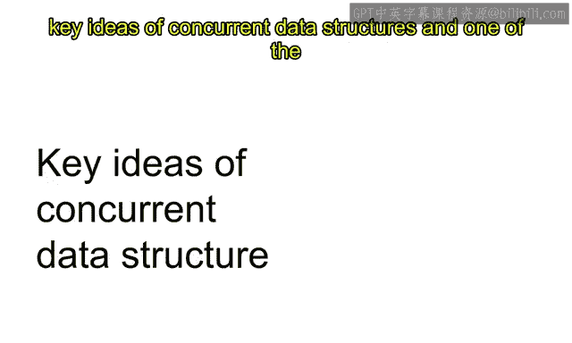

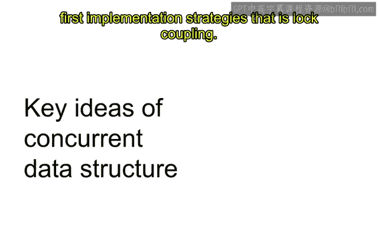

在本节课中，我们将要学习并发数据结构的关键思想，以及第一种实现策略——锁耦合。我们将详细讨论锁耦合链表的具体实现。

## 概述

并发编程的核心是并发数据结构，因为多个线程会尝试访问同一资源，而这些资源本质上就是数据结构。因此，并发数据结构是并发编程的心脏，也是本课程的关键目标。

并发数据结构有三个主要标准：**安全性**、**可扩展性**和**进度保证**。接下来，我们将逐一详细探讨。

## 安全性 🔒

并发数据结构需要满足特定的规范。其中之一是**顺序一致性**。这意味着一个并发队列的行为应该与一个顺序队列完全相同。例如，如果两个线程同时向队列推送和弹出值，那么操作返回的结果应该与它们在顺序队列上操作的结果一致。如果返回随机值，就不能称之为一个正确的并发队列。

此外，还需要**同步保证**。如果线程A推送一个值，线程B弹出同一个值，那么在推送者和弹出者之间必须存在某种形式的同步。这是因为队列可以作为通信通道使用，发送值以传递信号。为了实现这一点，推送和弹出操作之间需要建立同步。

## 可扩展性 📈

安全性是并发数据结构的最低要求，但使用并发数据结构的主要目的是**可扩展性**。我们希望它比顺序数据结构更能适应并行架构。

可扩展性意味着随着CPU核心数量的增加，性能会变得更好。理想情况下，我们希望实现**线性扩展**，即CPU核心数量翻倍，性能也翻倍。但在现实中，尤其是在超过16个线程时，实现线性扩展非常困难。因此，我们需要考虑性能下降的幅度，目标是尽可能减少性能损失。

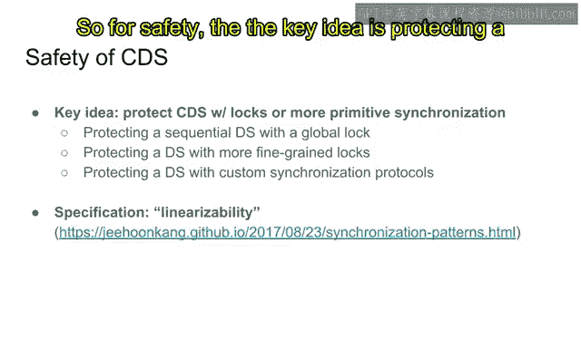

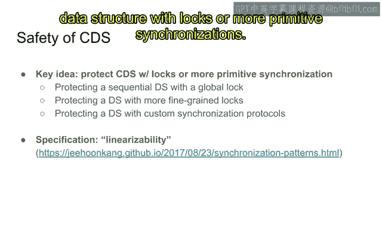

## 进度保证 🚦

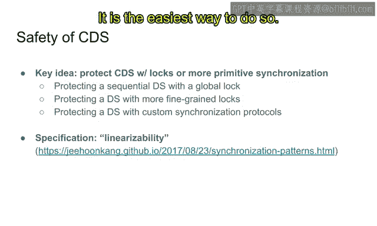

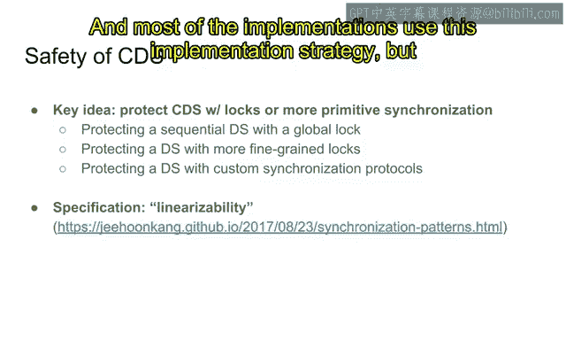

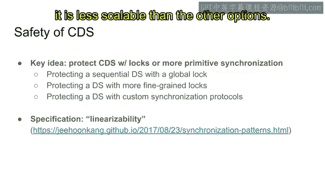

最后，我们需要保证并发数据结构操作的**进度**，即确保操作最终能够完成。

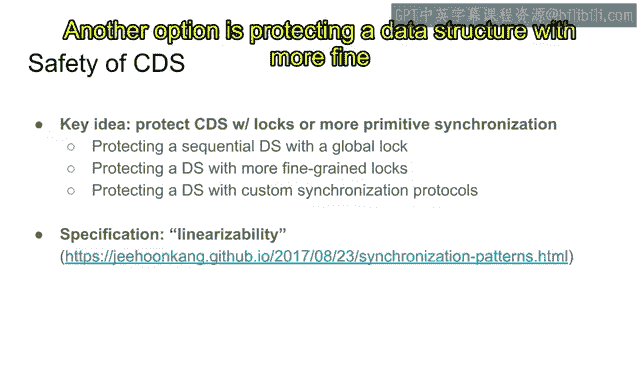

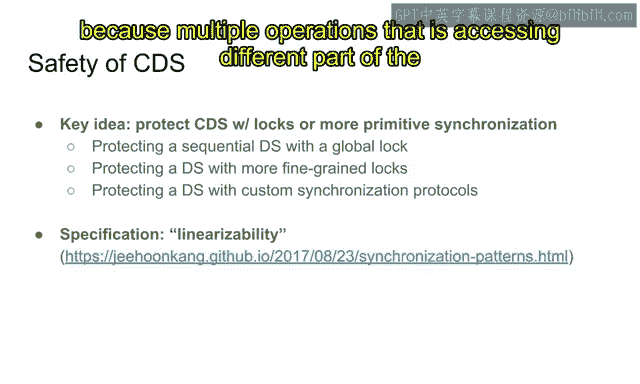

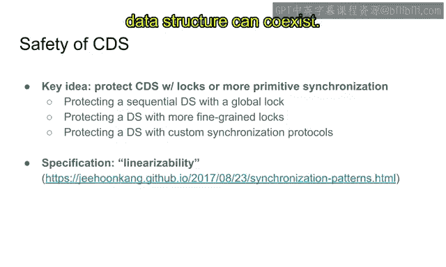

关于进度有多种概念：
*   **无锁**：如果多个线程尝试执行相同操作，至少有一个线程能成功完成其操作。例如，多个线程尝试获取锁时，至少有一个能成功。
*   **无等待**：这是一个更强的条件。它意味着即使存在竞争和许多其他线程，每个线程最终都能轮流成功完成操作。例如，自旋锁是无锁的，但不是无等待的；而票据锁和MCS锁是无等待的，因为它们保证最终能成功获取锁。

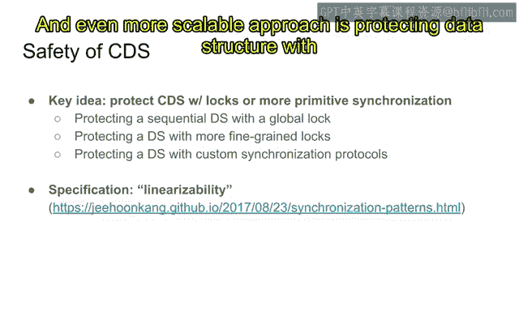

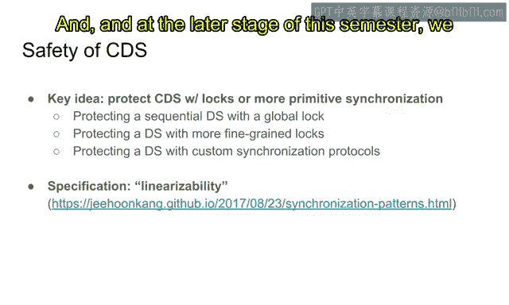

## 实现策略 🛠️

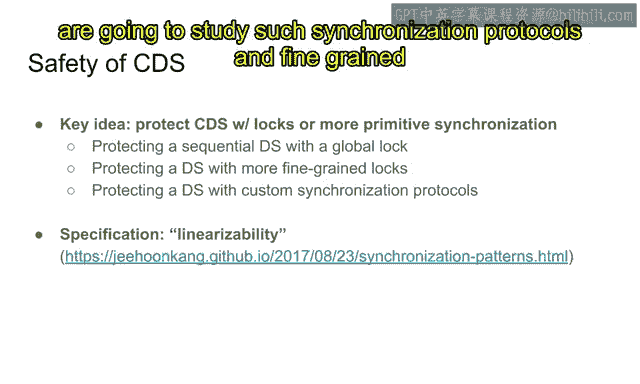

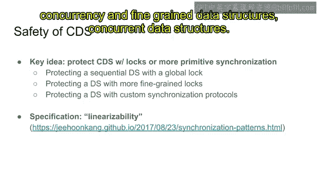

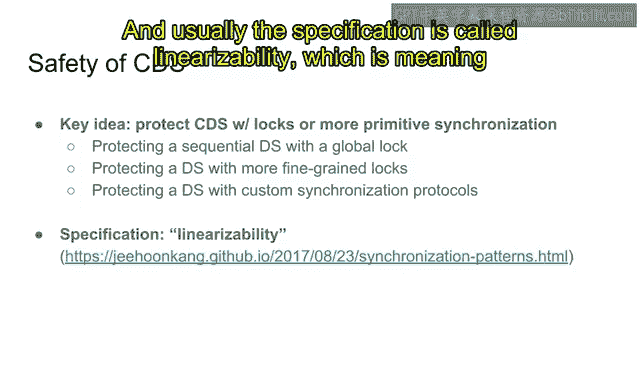

为了实现上述理想属性，有几种策略。

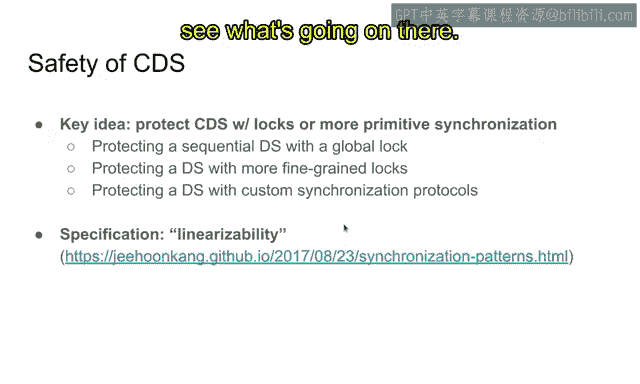

上一节我们介绍了并发数据结构的目标，本节中我们来看看实现这些目标的具体策略。

### 全局锁保护

第一种策略是使用一个**全局锁**来保护整个顺序数据结构。这是最简单的方法，可以将顺序数据结构转变为受锁保护的并发数据结构。许多实现都采用此策略，但它的可扩展性不如其他选项。

### 细粒度锁保护

另一种选择是使用**多个细粒度锁**来保护数据结构。每个锁保护整个数据结构的一个子集。这样做可以大大减少竞争，因为访问数据结构不同部分的多个操作可以同时进行。

### 自定义同步协议

一种更具可扩展性的方法是使用**自定义的同步协议**来保护数据结构。在本学期后期，我们将学习这种同步协议以及细粒度并发和细粒度并发数据结构。

通常，这种规范被称为**线性化**，它结合了顺序规范与同步保证。这个概念在此链接中有解释，如果你感兴趣，可以前往查看。

## 可扩展性的关键思想 💡

正如前面提到的，实现可扩展性的第一个关键思想是通过**缩小锁的保护范围来减少竞争**。使用多个锁，让每个锁保护数据结构的更小子集，从而减少竞争。

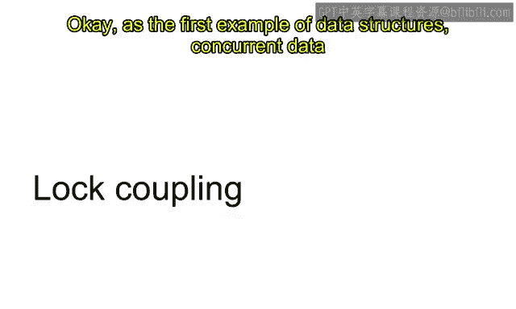

第二个关键思想是通过**避免写入操作来减少缓存失效**。写入操作通常对性能不利，因为它需要获取缓存行，并使其他线程的缓存失效。因此，我们应尽可能避免写入。这种方法通常被称为**乐观并发控制**。你先读取数据以进行某些保证，但在读取后，你无法确定不变量是否仍然成立，需要在稍后再次检查。如果检查成功，则操作成功；否则，可能需要放弃操作。之所以称为“乐观”，是因为它乐观地假设值在一段时间内不会改变。如果假设成立，你将获得性能提升；否则，需要回退。

作为一个案例研究，我们将在学习锁耦合链表后，研究乐观锁耦合链表。

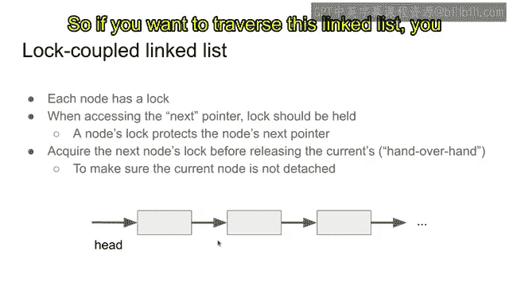

## 进度保证的关键思想 🎯

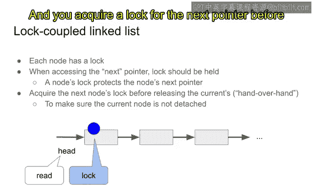

实现**无锁**的关键思想是**将单个读-修改-写指令指定为竞争点**，这样至少有一个CPU核心能成功执行该指令。例如，在自旋锁中，有一个锁变量，多个线程通过某些原子指令尝试更新它来获取锁。硬件架构保证至少有一个线程能成功执行该指令。通过这种方式，我们实现了无锁性：至少有一个正在进行的操作最终会完成。

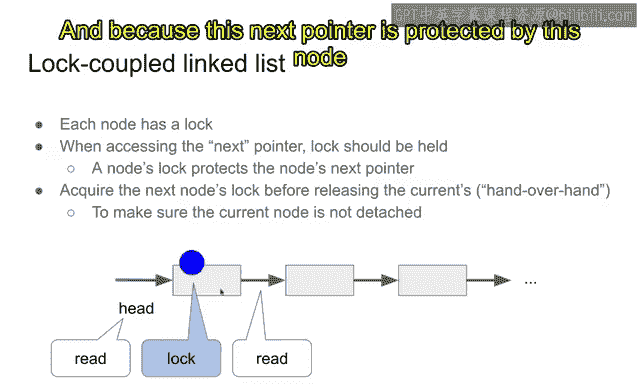

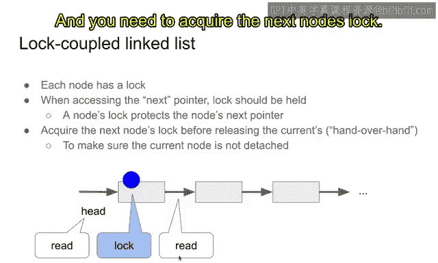

实现**无等待**的关键思想是**每个线程都发布其正在进行的操作**，以便其他线程可以看到。你需要保证你的操作最终会完成。如何做到呢？你发布你的操作，并让其他线程代表你完成操作。通常，无锁意味着有一个“获胜”线程赢得了竞争并成功执行了原子指令。这个获胜者将负责处理其他线程的操作，这就是无等待的含义。

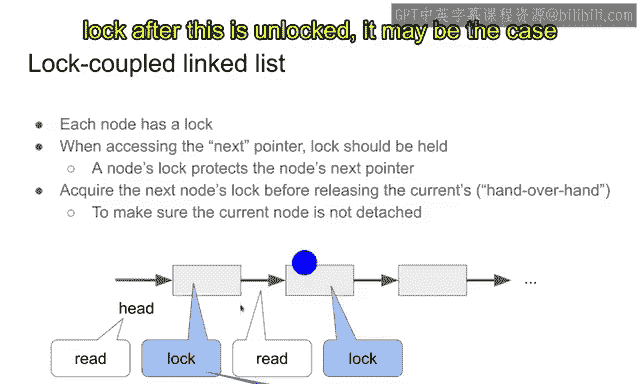

例如，YMCQ队列是无等待队列的一个主要例子。由于其复杂性，我们本学期不会学习它，但如果你感兴趣，可以阅读相关论文。此外，有一篇论文详细定义和分类了无锁、无等待等各种进度保证，非常有趣。如果你对这些保证感兴趣，建议阅读。

不过，本学期我们将只学习无锁性，因为其他进度保证更难实现和理解。

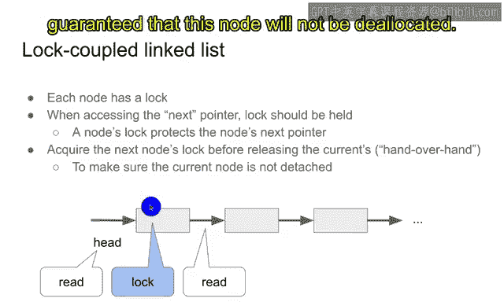

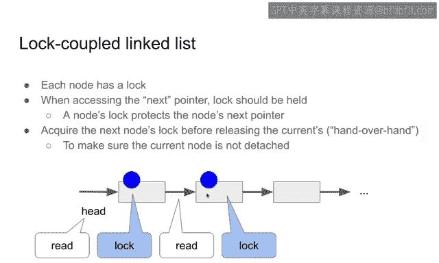

## 锁耦合链表案例 📚

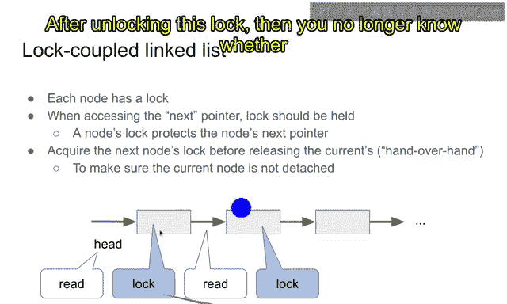

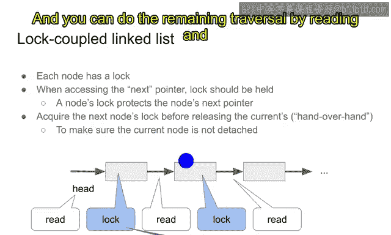

作为并发数据结构的第一个例子，我们将学习**锁耦合链表**。

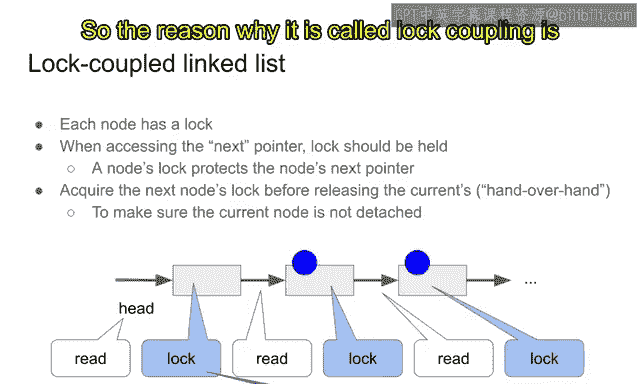

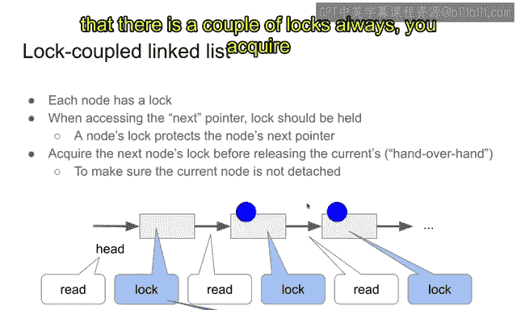

这是一个单链表，与顺序链表的唯一区别在于**每个节点都有一个锁**。这个锁在访问节点的`next`指针时必须被持有。换句话说，锁保护着`next`指针。为了保证安全，在释放当前节点的锁之前，必须先获取下一个节点的锁。

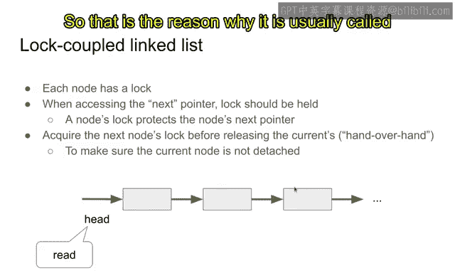

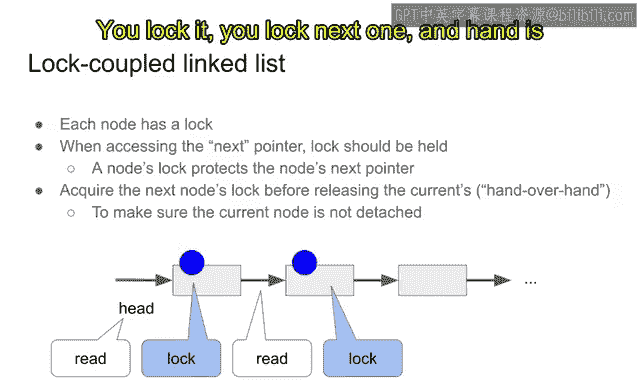

以下是遍历链表的步骤：
1.  首先读取头指针（`head`是共享且不可变的，此时无需加锁）。
2.  在读取第一个节点的`next`指针**之前**，必须先获取该节点的锁。
3.  获取下一个节点的锁。
4.  只有在获取了下一个节点的锁之后，才能释放前一个节点的锁。

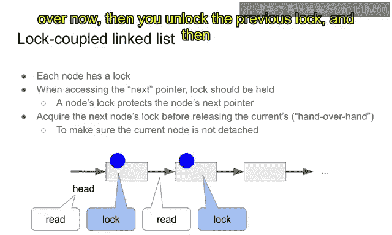

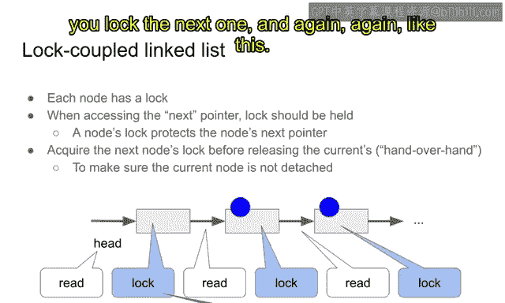

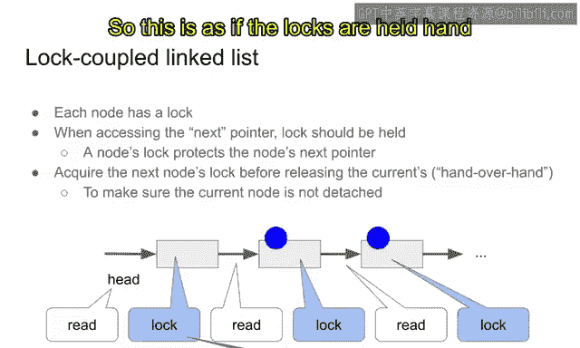

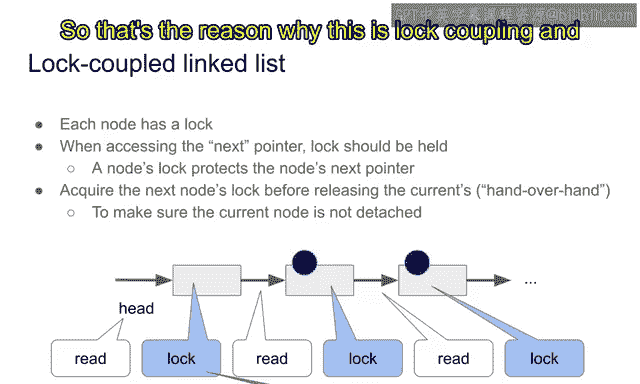

这样做的原因是确保在遍历过程中，当前节点不会被分离或释放。只要持有节点的锁，就能保证该节点不会被释放。通过“手握”至少一个锁，可以保证遍历路径上的节点是稳定的。

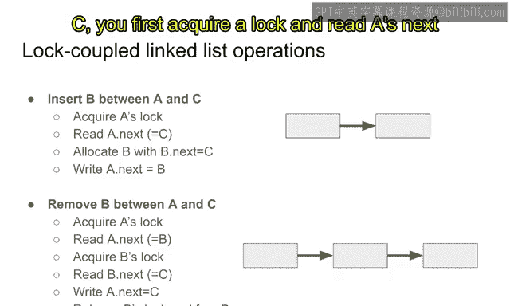

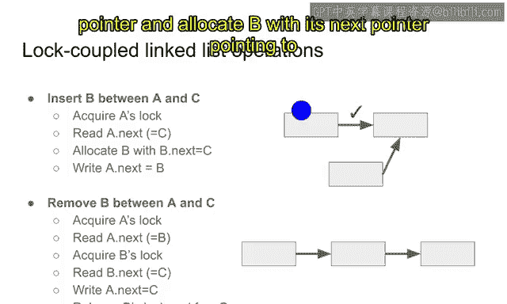

之所以称为“锁耦合”或“手递手锁定”，是因为在遍历过程中，总是同时持有两个锁（耦合），然后释放前一个，获取下一个，如此反复，就像锁在手中传递一样。

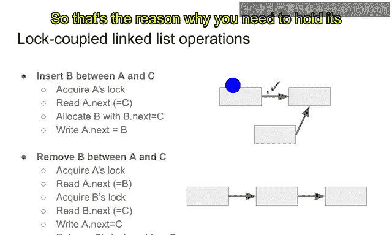

## 链表操作实现 ⚙️

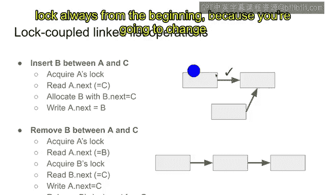

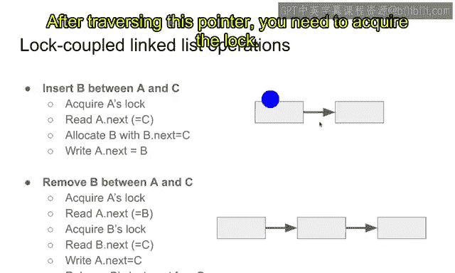

以下是链表基本操作的实现逻辑：

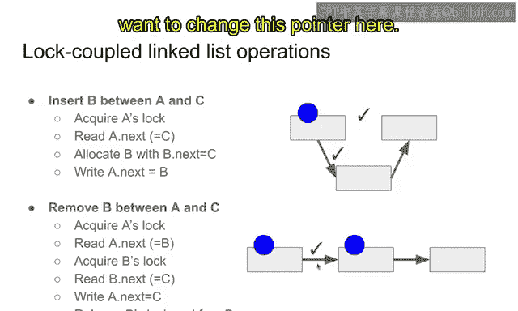

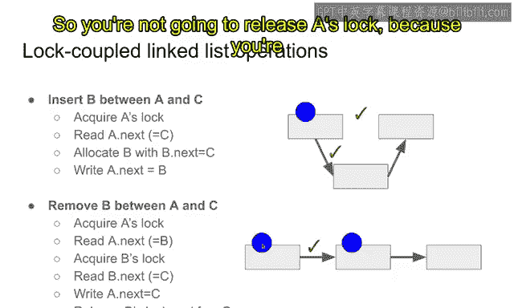

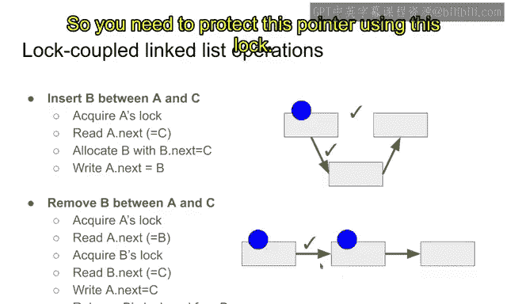

### 插入操作
假设要在节点A和C之间插入新节点B。
1.  获取节点A的锁。
2.  读取A的`next`指针（指向C）。
3.  分配新节点B，并将其`next`指针指向C。
4.  将A的`next`指针修改为指向B（此修改必须在持有A的锁的情况下进行）。
5.  释放A的锁。

### 删除操作
假设要删除节点A和C之间的节点B。
1.  获取节点A的锁。
2.  读取A的`next`指针（指向B）。
3.  获取节点B的锁。
4.  （可选）再次读取B的`next`指针（指向C）以确认。
5.  将A的`next`指针修改为指向C（此修改必须在持有A的锁的情况下进行）。
6.  释放B的锁。
7.  释放A的锁（或按顺序释放），然后可以安全地释放节点B的内存。因为此时你是唯一持有B引用的线程（其他线程要访问B必须先获取A或B的锁，而这些锁正被你持有）。

## 优缺点分析 ⚖️

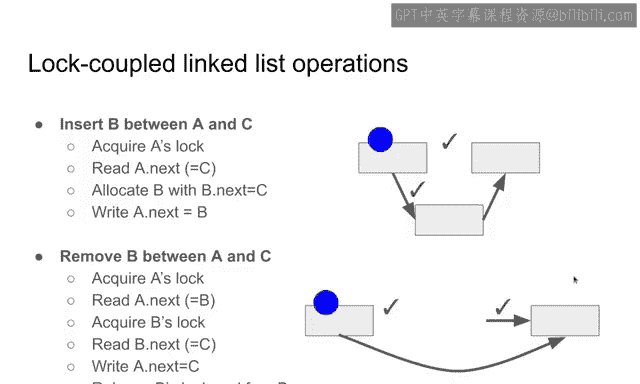

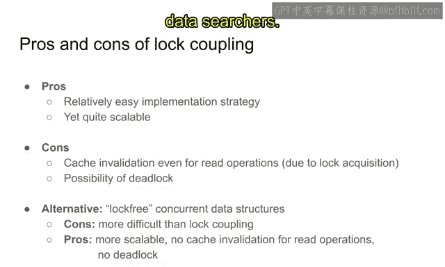

锁耦合链表有其优点和缺点。

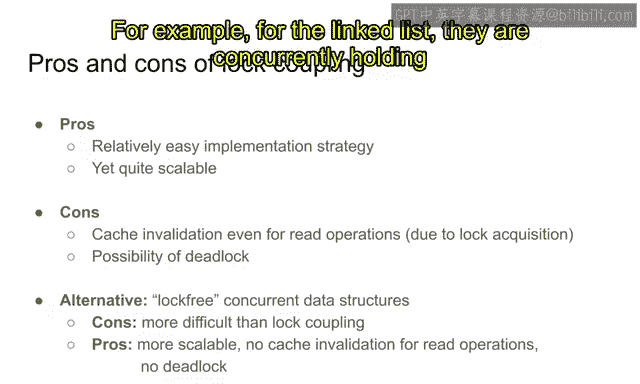

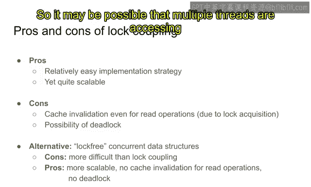

### 优点
*   **实现相对简单**：比许多细粒度并发数据结构更容易实现。
*   **具有一定可扩展性**：在链表中，线程通常只同时持有两个锁。因此，多个线程有可能通过访问链表的不同部分来同时进行操作。

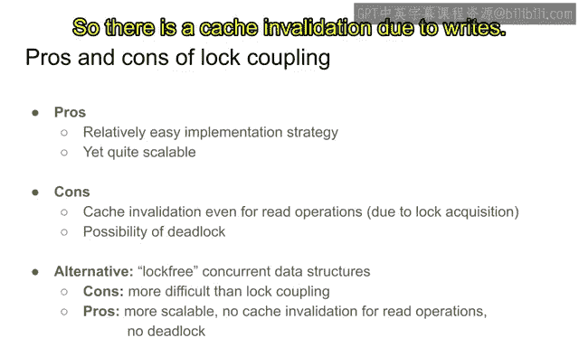

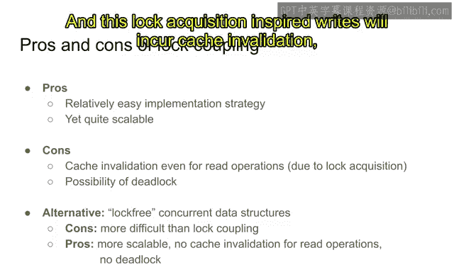

### 缺点
*   **缓存失效**：即使是为了读取而遍历链表，也需要获取锁。锁获取涉及写入操作（设置锁变量），会导致缓存行失效，可能降低性能。
*   **需注意锁顺序**：虽然此实现通过按顺序获取锁（从头到尾）避免了死锁，但开发者必须仔细管理锁的获取顺序以确保不会发生死锁。
*   **非无锁**：这是一种“有锁”的实现。作为替代方案，还有**无锁数据结构**，它们完全不使用锁。无锁结构的优点是更具可扩展性，并且没有因锁获取引起的缓存失效或死锁问题。但缺点是实现起来复杂得多。

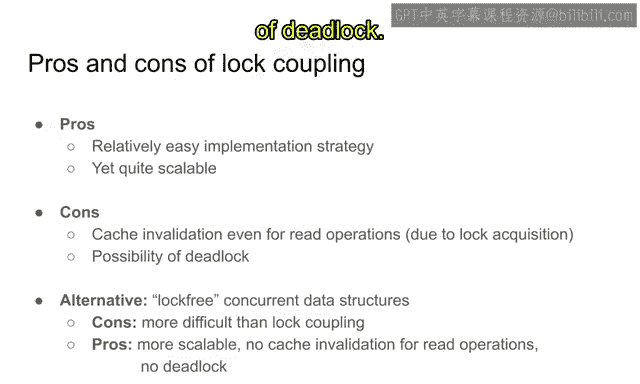

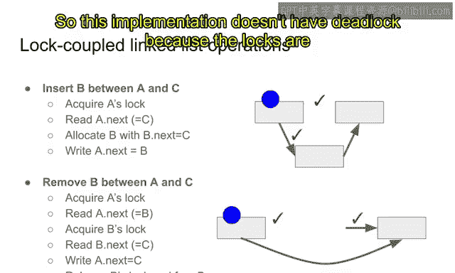

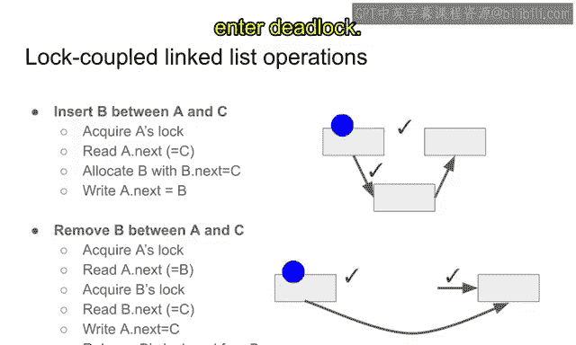

在本学期剩余的时间里，我们将继续研究这类有锁数据结构及其属性，以及相关的内存分配器。

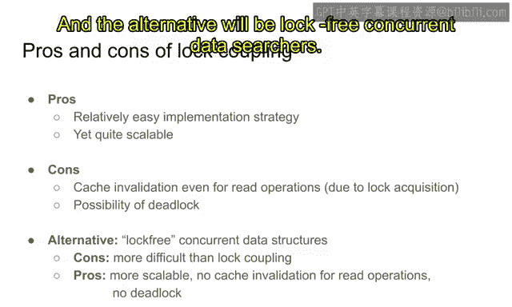

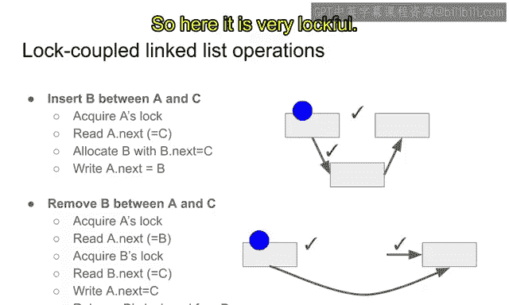

## 总结

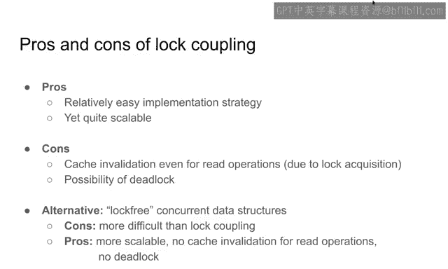

本节课我们一起学习了并发数据结构的核心目标：安全性、可扩展性和进度保证。我们深入探讨了锁耦合链表这一具体实现，了解了其通过为每个节点配备锁并使用“手递手”锁定协议来保证安全遍历和修改的原理。我们还分析了这种方法的优缺点，并将其与更简单的全局锁方案以及更复杂的无锁方案进行了对比。锁耦合是在简单性与一定程度的并发性能之间取得平衡的一个经典案例。