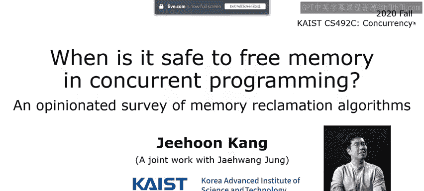
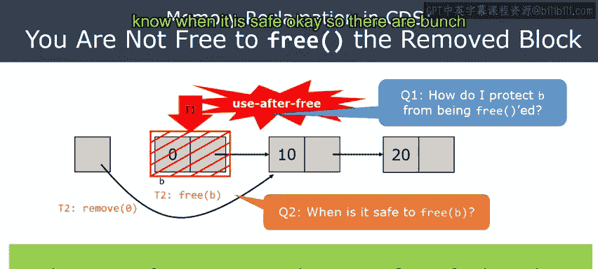
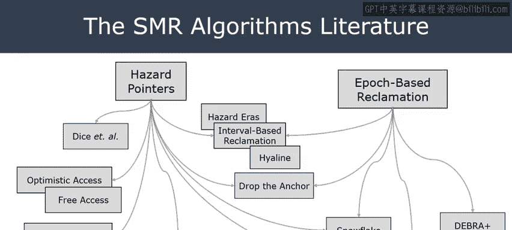
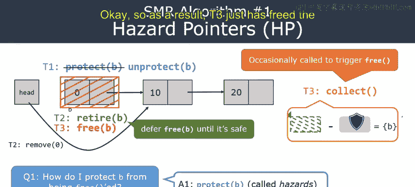
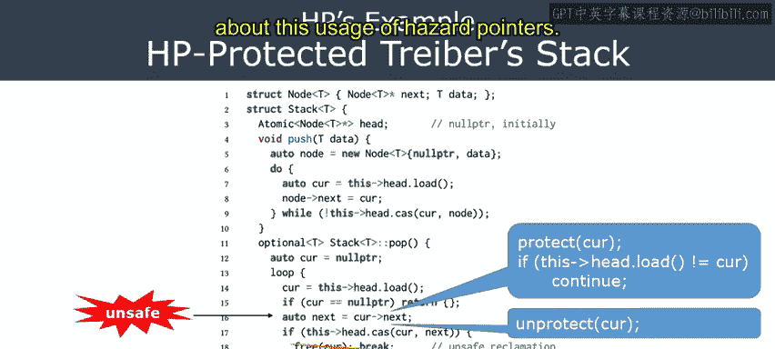
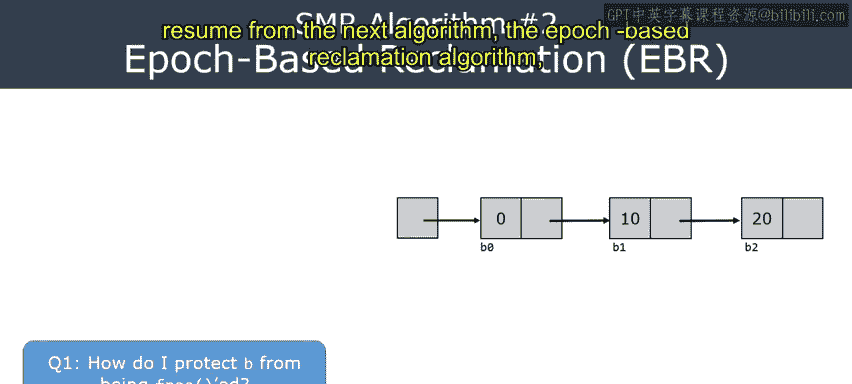
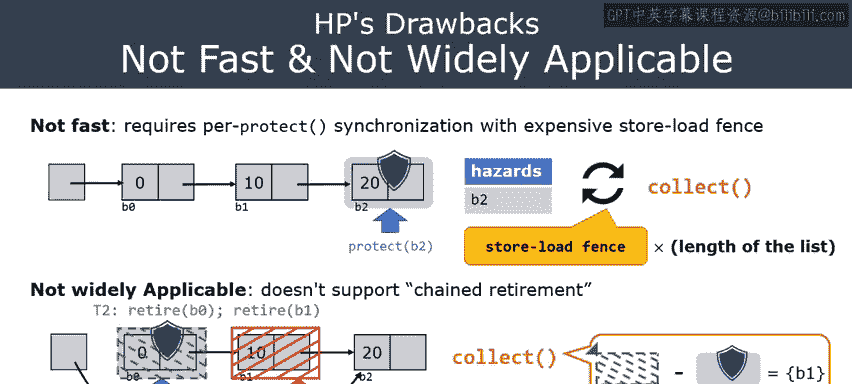

# 25：安全内存回收（风险指针）🔐



在本节课中，我们将开始学习并发编程中的垃圾回收问题。在前几节关于并发数据结构的课程中，我们已经提到，在并发环境下，我们需要考虑多个线程在回收不再使用的内存时可能产生的冲突。从本节课开始，我们将聚焦于并发中的内存回收这一特定问题，并介绍几种具有代表性的并发垃圾回收算法。

## 并发数据结构与内存回收挑战 🧩

上一节我们介绍了并发数据结构的基本概念，本节中我们来看看其面临的内存管理挑战。

并发数据结构（例如链表）允许多个线程同时操作同一数据结构，从而优化性能。其操作是非阻塞的，只要线程间的操作不冲突，每个线程都能完成自己的工作。

**示例：并发链表删除**
假设有两个线程 T1 和 T2 同时对一个链表执行删除操作。T1 删除值为 0 的节点，T2 删除值为 20 的节点。由于它们修改的是链表的不同部分，因此可以并行执行。操作完成后，我们需要将这两个已从链表中摘除的节点所占用的内存释放掉，否则会导致内存泄漏。

然而，问题在于我们不能立即释放这些内存块。因为可能还有其他线程正在并发地访问这些即将被释放的节点。如果立即释放，正在访问的线程可能会触发“释放后使用”错误，这是一种严重的未定义行为，必须避免。

## 核心问题：如何安全回收？ ❓

为了避免“释放后使用”错误，我们需要解决两个核心问题：

1.  **Q1（访问线程视角）**：如何保护一个内存块 B，使其在我访问期间不被其他线程释放？
2.  **Q2（释放线程视角）**：何时可以安全地释放一个已从数据结构中移除的内存块 B？



只有当所有可能访问 B 的线程都确认不再需要它时，才能安全释放 B。解决这两个问题的算法，通常被称为**安全内存回收**算法。在并发编程语境下，这特指并发垃圾回收。



## 安全内存回收算法概览 📚

学术界和工业界针对此问题已提出了多种解决方案，它们大致可分为两类：

*   **风险指针**：一种直观的基于线程本地“保护列表”的算法。
*   **基于纪元的回收**：另一种广泛使用的、基于全局“纪元”概念的算法。

许多后续提出的算法都是这两种基础方案的变体或混合体。本节课我们将重点学习**风险指针**算法。

## 风险指针算法详解 ⚙️

风险指针为上述两个核心问题提供了简洁的答案。

**回答 Q1：如何保护内存块？**
线程在解引用一个指针（访问对应内存块）之前，必须先将该指针注册到自己的**保护指针列表**（也称为风险指针列表）中。这个操作通过 `protect(ptr)` API 完成。它相当于宣告：“我将要访问这个内存块，请勿释放它。”

**回答 Q2：何时安全释放？**
当一个线程将某个内存块从数据结构中移除后，它不应立即 `free`，而是调用 `retire(ptr)` API 将其放入一个“待回收列表”，表明该块已退役，但暂不释放。

决定何时真正释放内存的任务由 `collect()` 函数完成。该函数会扫描所有线程的保护指针列表，并检查待回收列表。**只有那些既存在于待回收列表中，又不存在于任何线程保护指针列表中的内存块，才是安全的，可以被真正释放。**



**关键操作流程：**
1.  **保护**：`protect(cur)` -> 确保 `cur` 指向的节点不被释放。
2.  **验证**：重新读取 `cur` 以确保它仍然指向有效的节点（防止在保护操作发生的瞬间，节点已被其他线程移除）。
3.  **访问**：安全地解引用 `cur`（例如 `cur->next`）。
4.  **取消保护**：`unprotect(cur)` -> 访问完毕，移出保护列表。
5.  **退役**：`retire(cur)` -> 节点已从数据结构中移除，加入待回收列表。
6.  **回收**：`collect()` -> 在适当的时机调用，安全释放那些无人保护且已退役的内存块。

## 实战：改造并发遍历栈 🛠️

让我们看一个将风险指针应用于“并发遍历栈”的例子。原始代码中，在解引用 `cur` 访问下一个节点（第16行）和释放节点（第18行）之间存在安全隐患。

以下是应用风险指针改造后的关键步骤：

**改造步骤：**
1.  在解引用 `cur` 之前，插入保护与验证逻辑。
2.  将直接的 `free` 调用替换为 `retire`。
3.  在访问完 `cur` 后，调用 `unprotect`。

**核心代码逻辑：**
```c
// ... 循环内 ...
do {
    // 1. 保护当前指针
    protect(cur);
    // 2. 验证：重新加载cur，确保它未被其他线程修改
    if (cur != load(&head)) { // 假设head是全局头指针
        unprotect(cur);
        continue; // 如果变了，重试
    }
    // 3. 安全访问
    next = cur->next; // 原先不安全的第16行，现在安全了
    // 4. 取消保护
    unprotect(cur);
    // ... 其他业务逻辑 ...
} while (...);

// 5. 需要删除cur时
retire(cur); // 替换原先的 free(cur);
```



通过以上改造，我们确保了线程在访问节点时，该节点不会被意外释放。

## 风险指针的优缺点与局限性 ⚖️

尽管风险指针概念清晰，但它也存在一些缺点：

**优点：**
*   原理简单直观，易于理解。
*   内存回收的决策是精确的（基于即时保护状态）。

**缺点与局限性：**
1.  **API 易错**：程序员必须牢记 `protect`、`unprotect` 和验证步骤的调用顺序和时机，容易遗漏或出错。
2.  **性能开销**：每次 `protect` 操作通常需要一个**内存屏障**，在遍历长链表时，这会带来显著的开销。实证表明，其性能可能比某些替代方案慢数倍。
3.  **链式回收问题**：这是更严重的局限性。考虑一个场景：线程T1保护着节点B0，并即将访问B1。同时，线程T2原子性地移除了B0和B1两个节点，并将它们都 `retire`。由于T1只保护了B0，`collect()` 函数可能认为B1是安全的（已退役且未被保护）并将其释放。当T1随后尝试访问B1时，便会触发“释放后使用”错误。**风险指针无法安全处理这种一次性移除多个相邻节点（链式删除）的情况**，这限制了其在许多复杂并发数据结构中的应用。

## 总结与下节预告 📝

本节课我们一起学习了并发编程中安全内存回收的重要性，并深入探讨了**风险指针**这一解决方案。我们了解了它通过维护线程本地的保护指针列表和全局的待回收列表，来协调内存的访问与释放。同时，我们也分析了其在易用性、性能和适用性方面的局限性。






正因为风险指针存在这些不足，人们提出了另一种强大的算法——**基于纪元的回收**。在下一节课中，我们将学习 EBR 算法。它将解决风险指针面临的链式回收等问题，提供更易用的 API 和更好的性能，同时我们也会对比分析这两种核心算法的优劣。敬请期待！