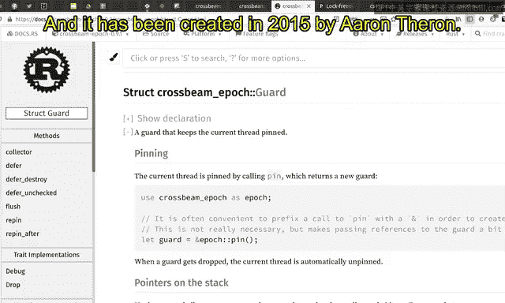
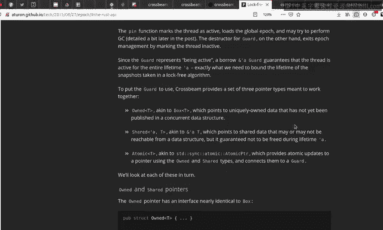
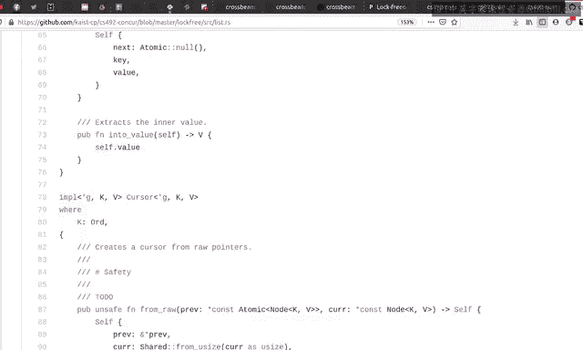

# 27：安全内存回收（crossbeam-epoch）🧠

## 概述
在本节课中，我们将学习 `crossbeam-epoch` 库，这是 Rust 并发编程中实际上的标准库，被广泛应用于包括 Firefox 在内的许多产品中。我们将了解其基于 epoch 的内存回收机制，并学习如何使用其 API 安全地构建并发数据结构。

`crossbeam-epoch` 是 epoch 内存回收算法的一个实现。如果你已经学习了关于 hazard pointers 和 epoch 回收的视频，那么理解这个库的文档和实现将会比较容易。

该库的文档包含了所有具体细节，你可以去那里阅读。它不仅描述了库的实现细节，还解释了 API 以及一些关于 epoch 算法的细节。请务必去阅读该文档。例如，它提供了 API，你可以点击查看 `Atomic` 及其 API 函数和示例。

我们将查看示例并了解其中的内容。但现在，我们只需要认识到存在一份包含每个函数示例的文档。

库中有 `Guard`、`Pin`、`Atomic` 和 `Shared` 等概念，它们是 `crossbeam-epoch` 库的主要 API。请仔细阅读关于 `Shared`、`Atomic`、`Guard` 和 `Pin` 的内容。

该库由 Aaron Turon 于 2015 年创建，至今已有 6 年历史。Aaron 启动这个项目是为了为并发编程的垃圾回收工作提供一个优秀的库。我强烈建议你也阅读这份文档。

它不仅实现了垃圾回收算法和基于 epoch 的回收算法，还提供了一个强制你安全使用该库的 API，并在本节中解释了一些相关的工作。同时，在前面的章节中，它也描述了基于 epoch 回收的算法。

你可以将这份文档与我之前创建的视频进行比较，看看其中的关联。

正如我所说，这个 Rust API 强制你安全地使用它。因此，它创建了 `Guard`、`Pin`、`Owned` 和 `Shared Atomic` 等类型，它们是 `crossbeam-epoch` 的基础 API。为了完成你的作业 5 和 6，我相信你需要掌握这些 API 和列表。因此，我强烈建议你也阅读这份文档。

阅读完这两份文档后，你现在可以理解示例中的内容了。这是我们仓库中的一个栈实现示例。在本视频的剩余部分，我们假设你已经阅读了 Aaron 的文档和特性文档。现在，我们将再次阅读并发栈、队列和链表的实现，看看在垃圾回收方面发生了什么。

## 栈实现分析

这是一个栈的实现，它本质上是一个节点链表。

### 入栈操作
在 `push` 操作中，不需要考虑垃圾回收，因为我们没有从链表中移除任何节点，也没有释放任何内存。我们只是创建一个新节点，然后将其添加到链表的头部。

这里仍然有一个关于 `crossbeam-epoch` 的有趣方面。你创建了一个 `Owned` 指针，这基本上是在堆上创建了一个对象，但它完全由我自己独占拥有，其他线程完全不共享。这就是为什么这种类型被称为 `Owned`。它是一个指向堆的独占指针。

我们尝试对头指针执行一个 `compare_and_set` 操作。我们将头指针从原始指针替换为新创建的节点。

有趣的是，这个新创建的指针的所有权被转移给了这个函数。这个函数接收并获得了新指针的所有权。

如果这个 `compare_and_set` 操作成功，那么我们就完成了。如果操作不成功，有趣的是，你刚刚传入的指针的所有权会被返回。因此，为了在下一次循环迭代中使用这个新指针，你需要将这个所有权保存到用于保存新指针所有权的变量中。

请记住，指向堆对象的所有权是在这里通过实际在堆上分配对象而创建的。这个所有权被转移到这里，当 `compare_and_set` 操作不成功时，它会被返回。如果操作成功，那么所有权实际上被转移到了共享内存中。因此，你不需要再关心这个对象的所有权。

### 出栈操作
有趣的事情将发生在 `pop` 函数中。在 `pop` 函数中，你将读取一些指针，最后对头指针执行一个 `compare_and_set` 操作。你将头指针替换为下一个指针。这有效地从链表中移除或分离了原始头指针。

因此，我们希望释放这个节点。但正如我们在上一个视频中讨论的，我们不能不加考虑地这样做。我们需要“退休”这个节点，而不是立即释放它。这里的“延迟销毁”基本上是“退休”的同义词。我们使用 `Guard` 来延迟销毁这个节点。这基本上是我们对上一个视频中的示例所做的第二个主要更改。

我说过，我们需要界定线程访问共享内存的代码范围，这个范围由 `pin` 函数和此处 `guard` 的析构来界定。因此，有效地说，当你在此处 `pin` 这个 `guard` 时，活动状态开始。

活动状态在此 `guard` 被释放时结束，可能是在这一行，`guard` 被丢弃。当 `guard` 被丢弃时，活动状态自动结束。

你可以将这个 API 视为围绕 `set_active` 和 `set_inactive` 函数的包装器，它保证一旦创建了活动状态，它必须在之后的某个时间点被停用。这基本上是一个围绕 `set_active` 和 `set_inactive` 函数的 RAII 类型包装器。

这里有趣的是，这个 `retire` 函数是 `guard` 的一个方法。因此，这个 `defer_destroy` 必须在活动状态内部调用，因为它是 `guard` 的一个方法，而 `guard` 只存在于活动状态内部，这要归功于这个 `guard` 的 RAII 类型 API。

所以，这里是活动状态。这个 `guard` 证明了我们在第 76 行处于活动状态，因为我们有一个对 `guard` 的引用。这基本上确保了 `retire` 函数只在活动状态内部被调用。

此外，这些 `compare_and_set` 和 `load` 函数被赋予了一个对 `guard` 的引用，这也证明了读取全局内存的操作只在活动状态内部执行，这个事实由函数被赋予了一个指向 `guard` 的指针来保证，这证明了我们处于活动状态内部。

同样的事情也发生在这个 `push` 函数中。我的意思是，我们在这里创建了一个 `guard`。在这一点上我们不需要 `guard`，因为我们只是在堆中创建一个新节点，并且没有访问共享内存。直到这里，这个 `n` 节点完全由我自己独占拥有，所以在创建这个新节点之前，我们不需要 `pin` 这个 `guard`。

在此处 `pin` 了 `guard` 之后，我们可以安全地读取指针，因为它们受到基于 epoch 回收实现的有效保护。

关于这个 `store` 函数有趣的是，与 `load` 和 `compare_and_set` 不同，它不接受 `guard` 参数，因为我们没有主动创建对共享内存的新引用。因此，当执行 `store` 时，我们不需要被赋予一个 `guard`。

如果你在这里有一个头指针，并且这个头指针有效地用 `guard` 的作用域（即活动状态的持续时间）进行了标注，这证明了 `store` 函数是在活动状态内部执行的。这就是为什么我们不需要特别要求额外的 `guard` 引用参数。

到目前为止，在较高层次上，`push` 和 `pop` 函数需要做一些与垃圾回收相关的事情，那就是用 `guard` 保护代码行，`guard` 限定了活动状态的开始和结束。它也是使用 `guard` 来限定活动状态的开始和结束。此外，我们不是立即释放头指针，而是在此时延迟销毁或退休头指针。

这些是与没有垃圾回收的朴素栈算法以及带有基于 epoch 回收的朴素栈算法的区别。

现在，我们可以看到，除了解释几种类型外，这就是我需要使用这个栈来讨论的所有内容。`Stack` 是一个指向 `Node` 的 `Atomic` 指针，而 `Node` 包含一个指向下一个节点的 `Atomic` 指针。因此，`Atomic` 基本上是一种可以被并发访问的类型。这是可以被多个线程并发访问的指针值。这就是 `Atomic` 的目的。

它与 `Owned` 不同，因为 `Owned` 是独占指针，没有其他人访问这个指针。这就是为什么我们在这一行代码中创建一个新的堆对象。

此外，还有另一种不同类型的指针，即 `Shared`。这个 `head` 是 `load` 函数的结果，这个 `head` 的类型必须是 `Shared`。`Shared` 指针基本上是对全局内存的引用。你可以认为这个本地指针 `Shared` 是线程本地的。当一个线程从全局内存读取指针时，该指针会临时存储在栈中，而 `Shared` 就是用来保存指向全局内存的指针的。

因此，有三种类型的指针：可以被并发访问的 `Atomic`，指向堆对象的独占指针 `Owned`，以及临时保存指向全局内存的指针的 `Shared` 指针。

这个 API 的设计方式使得你很难破坏 epoch 回收的规则。你可以通过阅读我在本视频开头展示的两份文档来看到这一点。

## 队列实现分析

现在，让我们继续看队列。队列比栈稍微复杂一点。但在垃圾回收方面，它们与栈并没有太大不同。

### 入队操作
`push` 函数也创建一个 `Owned` 指针，并立即将其转换为 `Owned` 指针。它通过在此处传递 `guard` 来访问共享内存。`guard` 作为引用被给出。因此，你可以相当确定这个 `push` 函数是在活动状态内部执行的。因此，你可以安全地将临时指针加载到栈中。作为这个 `load` 的结果，你可以得到一个 `Shared` 指针，它临时保存着指向并发内存的指针。

这意味着所有对并发内存的访问都是在活动状态内部执行的。到目前为止一切顺利。和往常一样，`push` 在分配方面不是很有趣，因为 `push` 函数不释放任何东西。

### 出队操作
另一方面，这个 `pop` 函数有点不同。它做同样的事情。它被赋予一个 `guard`，这证明了这个 `pop` 函数是在活动状态内部执行的，并且使用这个 `guard`，它可以加载并发内存指针以便遍历到下一个指针。

首先，一切顺利。有趣的是这里也一样。如果你成功更新了头指针，你实际上从队列中分离了第一个节点。因此，你需要在某个时间点释放它。我们不是立即释放指针，而是打算延迟销毁或退休这个指针，以等待其他线程完成对同一节点的访问。

在调用 `defer_destroy` 之后，我们读取指针的值并在此处返回值。这基本上就是栈中发生的情况，在垃圾回收方面与栈非常相似。

你用 `guard` 保护函数，这证明函数是在活动状态内部执行的。此外，你延迟销毁或退休块，而不是立即释放它。道理相同。

### Drop 实现
这里有一点有趣的事情。在 `drop` 函数中，你试图弹出值，直到队列为空。这个函数必须在活动状态内部调用。因此，我们将给它一个 `guard`，但这个 `guard` 是一个“不受保护的” `guard`，意味着即使你有一个 `guard`，你实际上并不在活动状态内部。

但这实际上是正确的实现。乍一看可能看起来是错误的，但实际上是正确的，因为在队列被释放和 `drop` 函数被调用时，你可以完全确定只有你知道这个队列。没有其他线程试图访问这个队列，因为他们丢失了对这个队列的所有引用。这就是为什么可以调用队列的 `drop` 函数。

因此，你是唯一访问这个队列内部节点的人。因此，你根本不需要保护你的访问。这就是为什么我们要调用 `unprotected` 而不是 `pin`，这个 `unprotected` 函数意味着你实际上并不在活动状态内部，但我仍然会给你一个 `guard`，因为你需要它。但由于这个 `drop` 函数的独占性质，它仍然是安全的。

## 链表实现分析

链表也是一样的。你被赋予一个 `guard`。和往常一样，在 `drop` 函数中，你不需要一个表示活动状态的真正的 `guard`。

这里你有很多事情要做。同样的事情发生在迭代开始时，你需要通过 `pin` 来获取一个 `guard`，因为你需要保护你的遍历。

在遍历结束时，你需要丢弃 `guard` 以标记活动状态的结束或活动状态的结束。代码的其余部分也发生同样的事情。

对于作业 5，你需要实现一些数据结构，这些数据结构共同实现了一个并发哈希表。我希望你现在明白如何做到这一点，如何在并发哈希表内部保护内存的释放。当你开始访问并发内存时，你通过 `pin` 创建一个 `guard`。在你完成对共享内存的访问后，你丢弃 `guard`，这实际上调用了 `set_inactive` 函数。只有在这些活动状态内部，你才能安全地解引用或引用共享内存。如果你想释放一个节点，那么你不是立即释放它，而是需要在活动状态内部延迟销毁或退休相关的块。

这基本上就是使用基于 epoch 的回收来保护数据结构的较高级别方法。我希望你现在已经很好地理解了如何为并发哈希表做到这一点。

## 总结
本节课中，我们一起学习了 `crossbeam-epoch` 库的核心概念和使用方法。我们了解到该库通过 `Guard`、`Pin`、`Owned` 和 `Shared` 等类型，强制程序员在安全的边界内进行并发内存访问和回收。关键点包括：使用 `pin()` 进入活动状态并获取 `Guard`；在 `Guard` 的作用域内安全地访问共享指针；使用 `defer_destroy` 或 `retire` 来延迟释放内存，而不是立即 `free`；以及理解 `Atomic`、`Owned`、`Shared` 三种指针类型的区别和用途。掌握这些模式是使用 `crossbeam-epoch` 构建正确、安全的并发数据结构的基础。