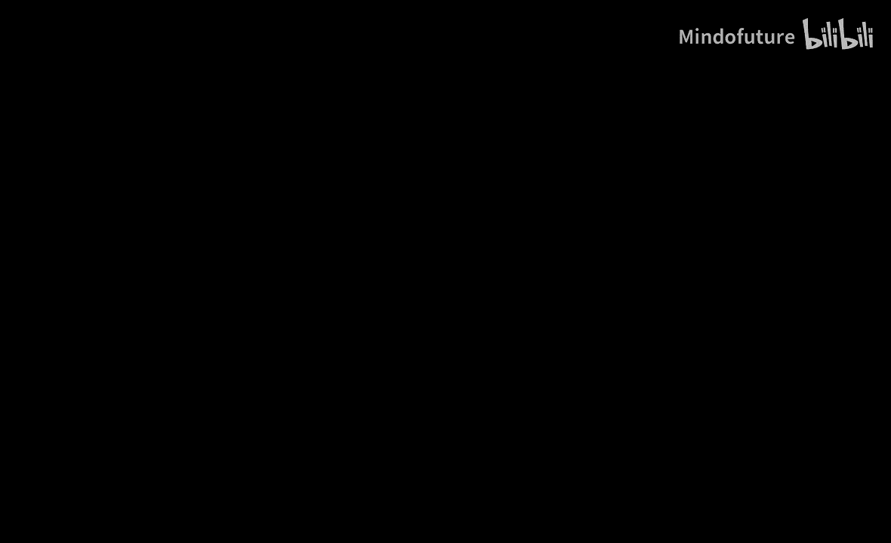
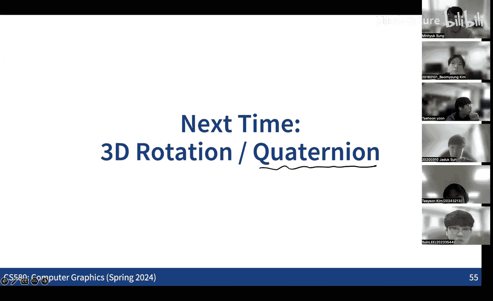

# 001：OpenGL图形管线基础



在本节课中，我们将学习计算机图形学中一个核心概念：OpenGL图形管线。我们将回顾如何将三维场景中的几何信息，通过一系列步骤处理，最终渲染成二维图像。本节课将重点介绍管线中的几何处理部分，包括模型变换、相机投影和光栅化。

上一节我们介绍了课程的整体结构，本节中我们来看看图形渲染的基础框架。

## 图形管线概述

在计算机图形学中，渲染管线可以被视为模拟电影拍摄的过程。这个过程包含几个基本组成部分：
*   **三维物体**：我们需要用数学方法表示场景中的三维物体，包括其**几何形状**和**外观属性**。
*   **动画**：我们需要表示物体在三维空间中的运动和变化，这涉及到**三维空间中的变换**。
*   **相机**：我们需要一个模型来模拟相机，以将三维场景捕捉到二维图像上。
*   **光照**：我们需要模拟光线在场景中的传播，以计算最终到达相机镜头的光线，从而生成图像。

在入门课程中，我们讨论了上述所有方面的基础知识。在本进阶课程中，我们将更深入地关注**外观、光照和相机模型**，以实现更精确、更逼真的图像模拟。

将三维场景转换为二维图像，主要有两种渲染框架：
*   **基于光栅化的框架**：这是OpenGL等许多图形应用的基础。其核心思想是将三维物体**投影**到二维平面上，然后在图像空间进行处理。这是本节课将简要回顾的内容。
*   **基于光线追踪的框架**：这种方法不直接将三维物体投影到二维平面，而是从二维图像平面向三维空间**发射光线**，逆向追踪光线的路径，直到光源。本课程后续将重点讨论这种框架。

## OpenGL图形管线流程

以下是OpenGL图形管线处理几何信息的主要步骤流程图：


管线从原始的几何数据开始，经过一系列处理阶段，最终输出图像。其中，**顶点处理器**和**片段处理器**是可编程的（通常使用着色器语言编写），而**光栅化器**等则是硬件固定的功能单元。本节课我们将重点关注**顶点处理器**和**光栅化器**的工作原理。

### 1. 原始几何表示

最常用的三维几何表示方法是**三角形网格**。它由以下部分构成：
*   **顶点**：三维空间中的点。
*   **面**：由三个顶点连接形成的三角形。
*   **附加信息**：每个顶点可以附带额外信息，如表面法线、颜色、纹理坐标等。

三角形网格是一种用紧凑方式表示三维表面的简单形式。

### 2. 顶点处理器

顶点处理器负责对每个顶点进行一系列坐标变换。它包含几个关键步骤：

#### 模型视图变换
此步骤的目的是将物体从其自身的局部坐标系放置到场景的世界坐标系中，并进一步转换到相机坐标系。这通常通过一个**4x4仿射变换矩阵**来完成。

在三维图形中，存在多种类型的变换：
*   **刚体变换**：仅包含平移和旋转。
*   **欧几里得变换**：包含平移、旋转和反射。
*   **相似变换**：在欧几里得变换基础上增加均匀缩放。
*   **仿射变换**：包含平移、旋转、反射、非均匀缩放和剪切。
*   **投影变换**：包含所有上述变换以及投影。

在OpenGL管线中，我们使用**齐次坐标**和**4x4矩阵**来统一表示这些变换。一个4x4仿射变换矩阵可以写为：
```
M = [ R   t ]
    [ 0   1 ]
```
其中 **R** 是一个3x3矩阵，代表线性变换（旋转、缩放、剪切），**t** 是一个3x1向量，代表平移。

三维旋转可以用多种方式表示，例如欧拉角（绕X、Y、Z轴顺序旋转）或四元数。一个绕X、Y、Z轴分别旋转角度 α, β, γ 的变换可以表示为矩阵连乘：`R = R_z(γ) * R_y(β) * R_x(α)`。

模型视图变换的结果是将所有顶点坐标转换到**相机坐标系**。

#### 相机投影
接下来，我们需要将相机坐标系中的三维点投影到二维图像平面。我们首先考虑简单的**针孔相机模型**。

假设我们沿负Z轴方向观察场景，针孔位于原点，图像平面位于 Z = -1 处。对于一个三维点 P(x, y, z)，其投影点 P' 的坐标为 (-x/z, -y/z, -1)。为了避免图像倒置，我们直接投影到 Z = -1 平面。

这种投影映射可以巧妙地利用齐次坐标的性质，用一个4x4矩阵表示。齐次坐标 `(x, y, z, 1)` 与 `(kx, ky, kz, k)` （k ≠ 0）表示同一个三维点。因此，将点 `(x, y, z, 1)` 映射到 `(x, y, z, -z)`，再除以最后一个分量 `-z`，就得到了正确的投影坐标 `(-x/z, -y/z, -1)`。对应的投影矩阵为：
```
P = [ 1 0 0  0 ]
    [ 0 1 0  0 ]
    [ 0 0 1  0 ]
    [ 0 0 -1 0 ]
```

在实际图形管线中，我们通常使用**透视投影**，它将一个视锥体（由左、右、下、上、近、远平面定义）映射到一个**标准设备坐标**的立方体内（其坐标范围从-1到1）。这个变换同样由一个4x4矩阵实现。保留Z轴信息对于后续的深度测试至关重要。

#### 视口变换
经过投影和齐次除法后，我们得到**标准化设备坐标**，其X、Y、Z分量都在[-1, 1]范围内。最后一步是**视口变换**，将这些坐标映射到实际的屏幕像素坐标。例如，将X从[-1, 1]映射到[0, 屏幕宽度W]，将Y从[-1, 1]映射到[0, 屏幕高度H]。这是一个二维的非均匀缩放变换。

至此，顶点处理器的任务完成，它输出了每个顶点在屏幕空间的位置及其他需要插值的属性。

### 3. 光栅化与深度测试

顶点处理器之后是**光栅化器**。它的任务是确定一个图元（如三角形）覆盖了哪些屏幕像素（称为**片段**），并为每个片段**插值**计算顶点的各种属性（如颜色、纹理坐标、深度等）。

以下是插值计算的关键点：

#### 重心坐标插值
对于三角形内的任意一点P，其属性可以通过三个顶点的属性**线性插值**得到。在二维屏幕空间中，可以使用**重心坐标** `(α, β, γ)` 作为权重，其中 `α + β + γ = 1`，且均非负。点P的属性 `V_p` 可计算为：
`V_p = α * V_a + β * V_b + γ * V_c`
其中 `V_a, V_b, V_c` 是三个顶点的属性。重心坐标可以通过计算子三角形面积与总面积之比得到。

#### 透视校正插值
这里存在一个关键问题：在三维空间中线性插值属性，然后投影到二维屏幕，与先将顶点投影到二维屏幕，然后在屏幕空间线性插值属性，这两种方法得到的结果**并不相同**。直接使用屏幕空间计算的重心坐标进行插值会导致错误，尤其是在纹理映射时产生扭曲。

为了解决这个问题，必须进行**透视校正插值**。原理是：虽然投影变换本身不是仿射变换，但我们可以利用齐次坐标 `w` 分量进行校正。

正确的插值方法如下：
1.  在顶点着色器中，对于需要插值的任意属性 `V` 和齐次坐标的 `w` 分量，我们输出两个值：`V/w` 和 `1/w`。
2.  光栅化器在屏幕空间对这两个值分别进行**线性插值**（使用屏幕空间的重心坐标）。
3.  在片段着色器中，通过以下计算得到透视校正后的属性值：
    `V_corrected = interpolated(V/w) / interpolated(1/w)`

这样就能保证插值结果与在三维空间进行线性插值后再投影的结果一致。

#### 深度测试与裁剪
在光栅化过程中，还会进行**深度测试**。每个片段都有其插值得到的Z值（深度）。当多个图元覆盖同一个像素时，深度测试会比较它们的Z值，只保留离相机最近（Z值最小）的片段，从而正确处理遮挡关系。

此外，为了提升效率，管线还会进行**裁剪**，剔除完全在视锥体之外的图元，并对与视锥体相交的图元进行裁剪。

### 4. 片段处理器

光栅化之后是**片段处理器**（片段着色器）。在这里，我们可以利用插值得到的属性（如纹理坐标、法线等）进行进一步计算，例如从纹理中取样颜色、计算光照效果等。这部分内容将在后续课程中详细展开。

## 总结

本节课我们一起学习了OpenGL图形管线的基础知识。我们回顾了从三维几何表示开始，经过**模型视图变换**、**相机投影变换**和**视口变换**的顶点处理流程。接着，我们探讨了**光栅化**阶段如何确定像素覆盖并进行属性插值，重点讲解了**透视校正插值**的必要性和方法，以及**深度测试**的作用。这些步骤共同构成了将三维场景渲染为二维图像的核心流程。下一节课，我们将深入探讨另一种表示三维旋转的工具——四元数。



