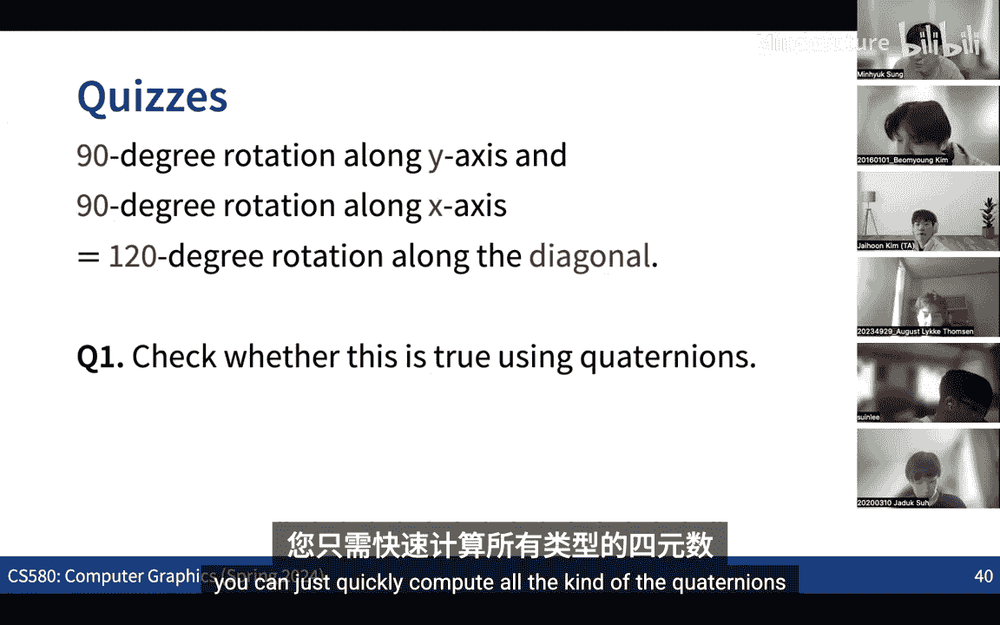
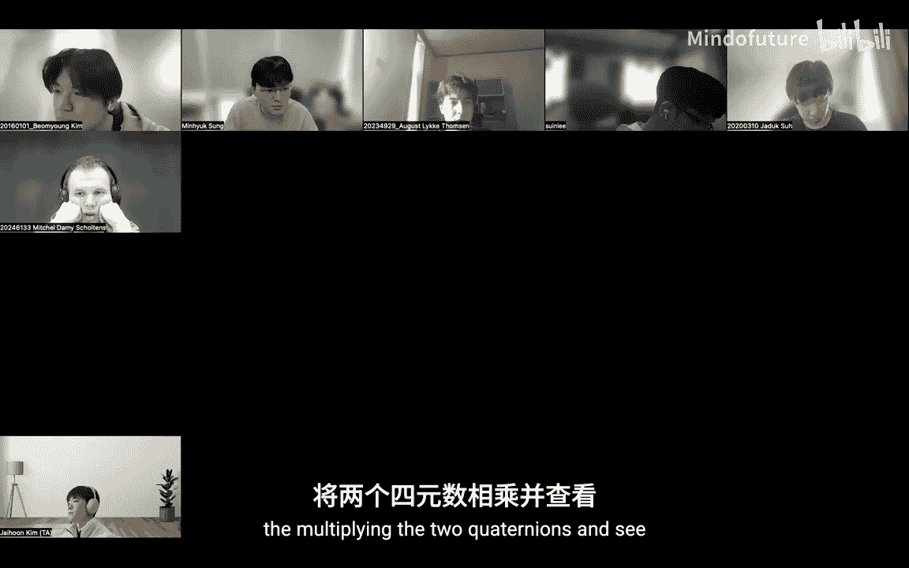
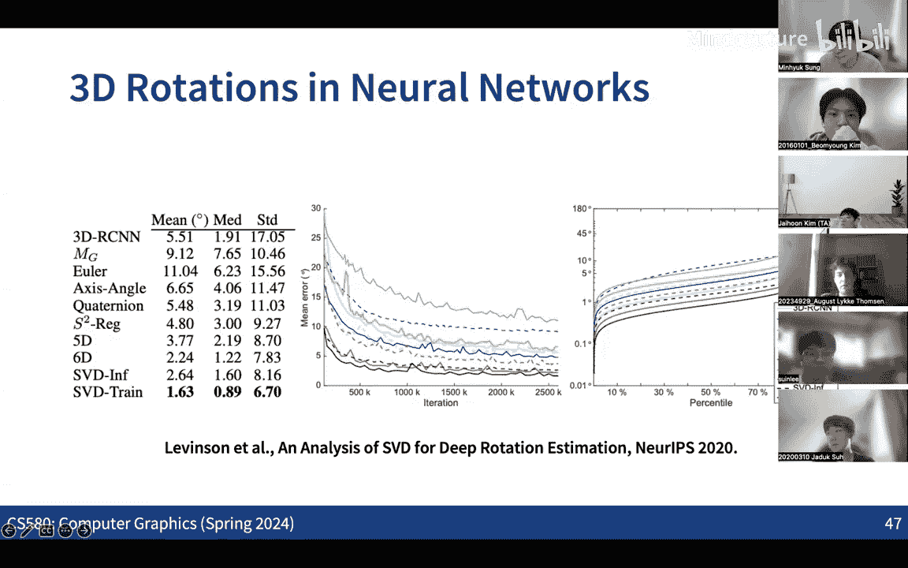

# 002：3D旋转与四元数

在本节课中，我们将学习3D旋转的表示方法，特别是四元数。我们将回顾刚体变换的应用，探讨欧拉角及其局限性，并深入理解四元数如何以一种更优雅和高效的方式表示和组合3D旋转。

## 刚体变换的应用

上一节我们介绍了变换的基本概念，本节中我们来看看一种特殊的变换——刚体变换。刚体变换是旋转和平移的组合，在计算机图形学、机器人学和计算机视觉中有广泛应用。

以下是刚体变换的一些常见应用场景：
*   **虚拟场景构建**：在3D场景中放置和排列物体时，通常需要对其进行平移和旋转。
*   **角色动画**：通过控制角色骨架中各个关节的旋转，可以驱动角色模型运动。
*   **机器人学**：控制机器人关节的旋转和平移，使其末端执行器能与真实物体交互。
*   **计算机视觉（运动恢复结构）**：从多视角图像中估计每个相机的位姿（旋转和平移）。
*   **神经渲染**：运动恢复结构是神经渲染中获取多视角图像相机位姿的基础技术。

## 旋转的矩阵表示与挑战

任何仿射变换都可以用一个4x4齐次坐标矩阵表示。平移、缩放和错切都可以通过修改矩阵中特定位置的元素来实现。

然而，表示一个任意的3D旋转（例如绕空间任意轴旋转特定角度）则不那么直观。问题在于：我们如何设置矩阵中的所有数值，才能精确表示我们想要的旋转？

## 欧拉角

表示任意3D旋转所需的最少参数是三个。最直观的方法之一是使用欧拉角，即绕X、Y、Z轴旋转的三个角度 `(α, β, γ)`。通过按特定顺序（如先Z、再Y、后X）连续应用这三个旋转，可以表示任何3D旋转。

欧拉角在航空领域对应俯仰、偏航和横滚角，在硬件上也有体现，例如相机云台稳定器就是一种三轴万向节结构。

但欧拉角存在两个主要问题：
1.  **旋转顺序不可交换**：`R_x * R_y * R_z` 的结果通常不等于 `R_z * R_y * R_x`。
2.  **万向节死锁**：当中间轴的旋转角为90度时，会失去一个旋转自由度，导致第一轴和第三轴的旋转效果相同，从而总共失去两个自由度。这使得在该姿态附近进行旋转插值变得困难。

此外，组合多个欧拉角旋转的计算并不直观。例如，绕Y轴旋转90度后再绕X轴旋转90度，结果等价于绕对角线轴旋转120度，而非简单的角度相加。

## 从2D旋转到四元数

为了解决旋转组合的问题，我们引入四元数。首先，让我们回顾2D旋转的优雅表示。

在2D复平面上，单位复数可以表示一个2D旋转。根据欧拉公式，一个旋转角度 `θ` 可以表示为：
`e^(iθ) = cosθ + i sinθ`
其中 `i` 是虚数单位。两个单位复数相乘，其结果对应于两个旋转的叠加。

19世纪的数学家哈密顿思考：能否找到一个3D空间，其中的“单位”点能对应3D旋转，并且其“乘法”对应旋转的组合？他发现答案不在3D空间，而在4D空间。由此他发现了四元数。

## 四元数基础

一个四元数 `q` 定义如下：
`q = a + bi + cj + dk`
其中 `a` 是实部，`b, c, d` 是虚部，`i, j, k` 是满足以下关系的虚数单位：
`i² = j² = k² = ijk = -1`
`ij = k, jk = i, ki = j`
`ji = -k, kj = -i, ik = -j`
关键点在于，四元数的乘法**不满足交换律**。

以下是四元数的一些基本运算和术语：
*   **范数**：`||q|| = sqrt(a² + b² + c² + d²)`
*   **共轭**：`q* = a - bi - cj - dk`
*   **逆**：对于单位四元数（`||q||=1`），其逆等于其共轭：`q⁻¹ = q*`
*   **共轭运算**：对于四元数 `p` 和 `q`，定义共轭运算为 `q p q⁻¹`。这个运算是一个线性变换，可以写成一个4x4矩阵与四维向量 `p` 的乘法。

## 四元数与3D旋转

最重要的结论是：**单位四元数（`||q||=1`）可以表示一个3D旋转**。

具体来说，如果一个单位四元数 `q` 表示为：
`q = cos(θ/2) + (u_x i + u_y j + u_z k) sin(θ/2)`
那么它对应于绕单位轴向量 `u = (u_x, u_y, u_z)` 旋转角度 `θ` 的变换。

通过共轭运算 `q v q⁻¹`（这里将纯虚四元数 `v = xi + yj + zk` 视为3D向量 `(x, y, z)`），可以将该旋转作用于向量 `v`。这个运算对应的线性变换矩阵的左上3x3部分，就是一个标准的3D旋转矩阵。

单位四元数位于4D空间中的单位超球面（3-球面）上。这个映射是**满射**（每个3D旋转都有对应的四元数）但不是**单射**：`q` 和 `-q` 表示同一个3D旋转。因此，这是从3-球面到3D旋转群的一个**二对一**映射。

## 四元数的优势

四元数表示3D旋转的主要优势在于**旋转的组合与插值**。

*   **组合旋转**：如果旋转 `R_q` 对应四元数 `q`，旋转 `R_p` 对应四元数 `p`，那么组合旋转 `R_q ∘ R_p` 就对应四元数乘法 `q * p`。这比矩阵乘法或欧拉角组合更简洁高效。
*   **球面线性插值**：要在两个旋转 `q0` 和 `q1` 之间平滑插值，可以使用四元数的球面线性插值公式。这在角色动画、相机路径平滑等方面至关重要。插值公式的核心思想是在4D单位超球面上沿大圆弧行走。
    `slerp(q0, q1; t) = (q0 * sin((1-t)Ω) + q1 * sin(tΩ)) / sin(Ω)`
    其中 `Ω` 是 `q0` 与 `q1` 之间的夹角。
*   **其他有用性质**：
    *   四元数的共轭（逆）表示旋转的逆。
    *   两个旋转 `q0` 和 `q1` 之间的相对旋转是 `q0⁻¹ * q1`。
    *   四元数的平方根 `q^(1/2)` 表示旋转角度的一半。

## 不同旋转表示的转换

在实际应用中，我们经常需要在不同表示之间转换：
*   **轴-角 → 四元数**：`q = [cos(θ/2), u sin(θ/2)]`
*   **四元数 → 旋转矩阵**：通过共轭运算的线性变换矩阵提取3x3部分。
*   **四元数 → 轴-角**：`θ = 2 * arccos(a)`, `u = (b, c, d) / sin(θ/2)` （其中 `q = a + bi + cj + dk`）
*   **欧拉角 ↔ 旋转矩阵 ↔ 四元数**：均有标准转换公式。

## 在神经网络中的应用

当需要训练神经网络来预测3D旋转时（如姿态估计），选择哪种旋转表示是一个重要问题。轴-角、旋转矩阵、欧拉角、四元数各有优劣（连续性、参数数量、是否存在奇点等）。研究表明，四元数（需注意处理 `q` 与 `-q` 的歧义）或6D表示（旋转矩阵前两列）通常是较好的选择。

## 总结

本节课中我们一起学习了3D旋转的多种表示方法。我们首先回顾了刚体变换及其广泛应用，然后指出了使用矩阵直接表示旋转的困难。接着，我们探讨了直观的欧拉角表示及其固有的万向节死锁和组合复杂性问题。

为了解决这些问题，我们深入学习了四元数。我们从2D旋转的复数表示出发，理解了哈密顿如何将其推广到4D空间以表示3D旋转。我们学习了四元数的基本定义、运算规则，以及它如何通过共轭运算与3D旋转建立联系。

四元数的核心优势在于它能以简洁的形式组合旋转，并能实现平滑的球面线性插值，这对于计算机图形学中的动画至关重要。最后，我们了解了不同旋转表示之间的转换，并简要探讨了在神经网络中表示旋转的考量。

掌握四元数为我们后续学习光线追踪、动画系统以及更高级的图形学主题奠定了坚实的数学基础。