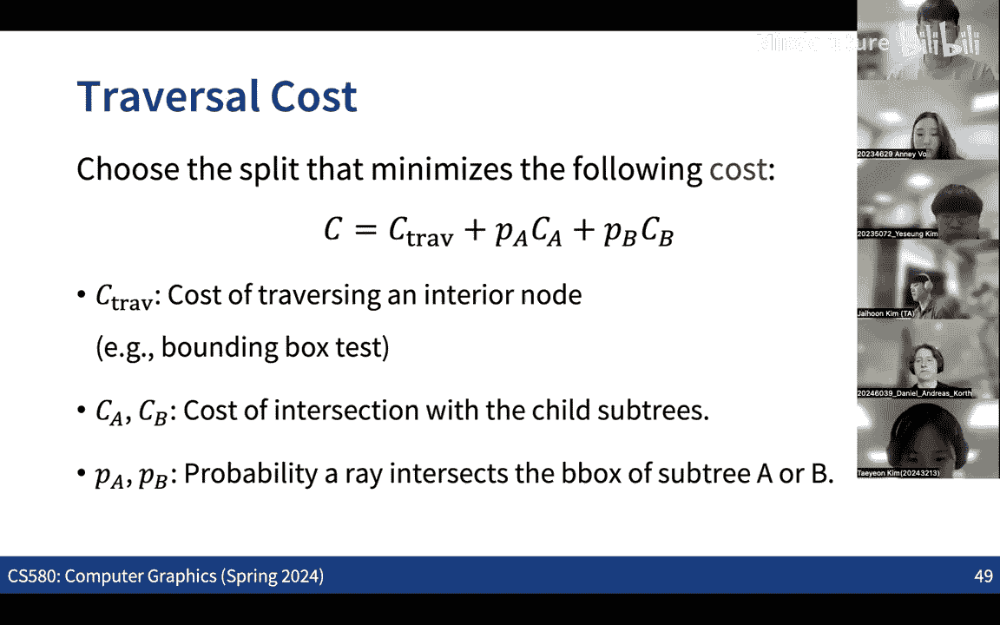

# 003：光线追踪


## 概述
在本节课中，我们将要学习光线投射与光线追踪的基本概念。我们将探讨它们与光栅化渲染管线的区别，理解光线与三维物体求交的基本原理，并初步了解用于加速计算的包围盒层次结构。

上一节我们介绍了基于光栅化的渲染管线，本节中我们来看看另一种截然不同的渲染方法。

## 光栅化与光线追踪的区别
光栅化渲染管线首先将所有三维三角形投影到二维平面上，然后处理每个三角形，确定其覆盖了哪些像素（片段），并通过插值计算颜色和深度信息来更新像素。

相比之下，光线追踪和光线投射则从像素出发。对于图像平面上的每个像素，我们从相机中心发射一条光线，并检测这条光线与场景中三维物体的第一个交点。然后，我们从该交点获取颜色或材质信息来更新像素。

以下是两者的核心流程对比：
*   **光栅化**：物体优先。处理每个物体，将其投影，然后更新被覆盖像素的信息。
*   **光线追踪**：像素优先。处理每个像素，发射光线，找到与物体的交点，然后更新像素信息。

## 光线投射的基本思想
光线投射是一个相对古老的概念，其核心是模拟光学过程，但为了提高效率，我们通常进行“反向追踪”。

真正模拟光线传播应从光源出发，向场景发射光线，并追踪它们经过反射、折射后最终到达成像平面的路径。但这种方法效率极低，因为只有极少量的光线能最终到达成像平面。

因此，在实际的光线投射中，我们采取反向策略：从相机（眼睛）出发，通过成像平面上的每个像素向场景发射光线。我们检查这条光线与场景中物体的第一个交点。

仅仅找到交点还不够。为了确定该点的颜色，我们不仅需要考虑物体表面的固有属性，还需要考虑光照。因此，我们从该交点向光源再发射一条**阴影光线**。如果这条阴影光线未被遮挡，直达光源，则该点被照亮；如果被遮挡，则该点处于阴影中。

**代码描述核心过程**：
```python
for each pixel in image:
    ray = generate_ray_from_camera_through_pixel()
    intersection_point, surface = find_closest_intersection(ray, scene)
    if intersection_point exists:
        shadow_ray = ray_from_point_to_light(intersection_point, light_source)
        if not is_occluded(shadow_ray, scene):
            color = calculate_color(intersection_point, surface, light_source)
            set_pixel_color(pixel, color)
        else:
            set_pixel_color(pixel, BLACK) # 阴影
```

## 从光线投射到光线追踪
光线投射只关心第一条光线（从相机出发）与物体的第一个交点。而光线追踪则更进一步，它递归地追踪光线的完整路径。

在第一个交点处，根据物体表面的材质属性（如镜面反射、折射），光线可能会产生新的方向。例如，对于镜面，我们会根据入射角和法线计算反射方向，并发射一条新的**次级光线**继续追踪。对于透明物体，我们还会计算折射光线。

这个过程可以递归进行多次，每次在交点处都可能产生新的反射或折射光线。最终，像素的颜色由沿着这条光线路径上所有交点处计算的颜色累积（通常以某种方式加权组合）而成。

**公式描述反射方向**：
若入射光线方向为 **I**，表面法线为 **N**（单位向量），则反射光线方向 **R** 可通过以下公式计算：
**R = I - 2 * (I · N) * N**

因此，光线追踪能够更精确地模拟光与物体的复杂交互，如多次反射、折射、焦散等效果，从而生成非常逼真的图像。当然，其计算量也远大于光线投射和光栅化。

## 光线与物体求交
实现光线追踪系统的第一步是计算光线与场景中物体的交点。这不仅用于从相机发射的主光线，也用于阴影光线和次级光线。

一条光线可以用参数方程表示：**P(t) = O + t * D**。其中，**O** 是光线起点（如相机位置），**D** 是方向向量，**t** 是大于等于0的参数。

以下是几种常见求交情况：

### 光线与平面求交
假设平面由一个点 **P0** 和法向量 **N** 定义。平面上任意点 **P** 满足方程：**(P - P0) · N = 0**。
将光线方程代入平面方程：
**(O + tD - P0) · N = 0**
求解 t：
**t = ( (P0 - O) · N ) / (D · N )**
如果 **t >= 0**，则交点存在，位置为 **O + tD**。若分母 **D · N = 0**，则光线与平面平行，无交点。

### 光线与三角形求交
三维物体常由三角形网格表示。求交分为两步：
1.  计算光线与三角形所在平面的交点。
2.  判断该交点是否位于三角形内部。

第二步通常使用**重心坐标**来判断。三角形由三个顶点 **P1**， **P2**， **P3** 定义。三角形内的任意点 **P** 可以用重心坐标 **(u, v, w)** 表示，其中 **u + v + w = 1**，且 **u, v, w >= 0**。点 **P** 可表示为：
**P = u * P1 + v * P2 + w * P3**
由于 **w = 1 - u - v**，我们实际上只需要两个参数 **(u, v)**。

将光线方程 **P(t) = O + tD** 代入，得到：
**O + tD = u * P1 + v * P2 + (1 - u - v) * P3**
这是一个关于 **t**， **u**， **v** 的线性方程组。求解后，若 **t >= 0** 且 **u >= 0**， **v >= 0**， **u + v <= 1**，则光线与三角形相交。

### 光线与球体求交
球体由球心 **C** 和半径 **r** 定义。球面上点 **P** 满足：**||P - C||^2 = r^2**。
将光线方程代入：
**||O + tD - C||^2 = r^2**
展开后得到一个关于 **t** 的二次方程：
**at^2 + bt + c = 0**
其中：
**a = D · D**
**b = 2 * D · (O - C)**
**c = (O - C) · (O - C) - r^2**
求解二次方程。若有正实根，取最小的正根作为交点对应的 **t**。

### 光线与隐式表面求交
有些物体通过**隐式函数** **f(P) = 0** 定义（例如，**f(P) = ||P - C||^2 - r^2** 就是球体的隐式表示）。对于这类表面，一种简单的求交方法是**光线步进**：从起点开始，沿光线方向一步步前进，每次评估 **f(P)**，直到其值接近零或符号改变。
更高效的方法是**球体追踪**：当评估点 **P** 的 **f(P)** 值为正（在物体外）时，其值通常代表到物体表面的最近距离。我们可以安全地沿光线前进至少这个距离，然后重复此过程，直到 **f(P)** 接近零。

## 加速求交计算：包围盒层次结构
在复杂场景中，可能有数百万个三角形和数百万像素，对每一对“光线-物体”都进行求交计算是不可行的。加速计算的核心思想是使用**包围盒**。

基本思路是用一个简单的体积（如轴对齐包围盒）包裹住复杂的物体或一组物体。首先计算光线与包围盒是否相交，如果不相交，则可以跳过盒内所有物体的求交计算；如果相交，再进一步检查盒内的物体。

单个大的包围盒效率不高，因为一旦光线击中它，仍需检查盒内所有物体。为每个物体单独设包围盒则数量太多。理想的解决方案是**包围盒层次结构**。

其思想类似于二叉搜索树。我们将所有图元（如三角形）用一个顶层包围盒包裹。然后，选择一种策略（如沿某个轴按图元中心排序），将图元集合分成两个子集，并为每个子集创建包围盒。递归地对每个子集进行同样的划分，最终形成一棵树（BVH树）。

当需要计算一条光线与场景的交点时，我们从根节点开始：
1.  检查光线与当前节点包围盒是否相交。
2.  若不相交，跳过该节点及其所有子节点。
3.  若相交，则递归检查其子节点。
4.  到达叶节点时，才与节点内的图元进行精确求交。

这大大减少了需要进行的精确求交测试的次数。关键问题是如何划分图元集合以构建高效的BVH树。一个常见的目标是使划分后两个子包围盒的总体积最小化，同时保持树的平衡。



## 总结
本节课中我们一起学习了光线追踪的核心思想。我们了解了光线投射与光线追踪的区别，知道了光线追踪通过从相机反向追踪光线路径来模拟复杂的光照效果。我们详细探讨了光线与几种基本几何体（平面、三角形、球体）的求交计算方法，这是光线追踪的基石。最后，我们介绍了使用轴对齐包围盒和包围盒层次结构来大幅加速求交过程的基本原理，这是处理复杂场景的关键技术。在接下来的课程中，我们将深入探讨如何计算交点处的颜色，即光照与材质模型。