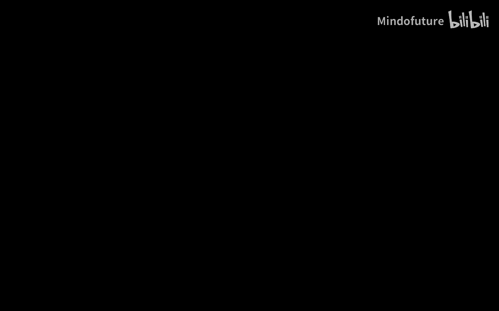
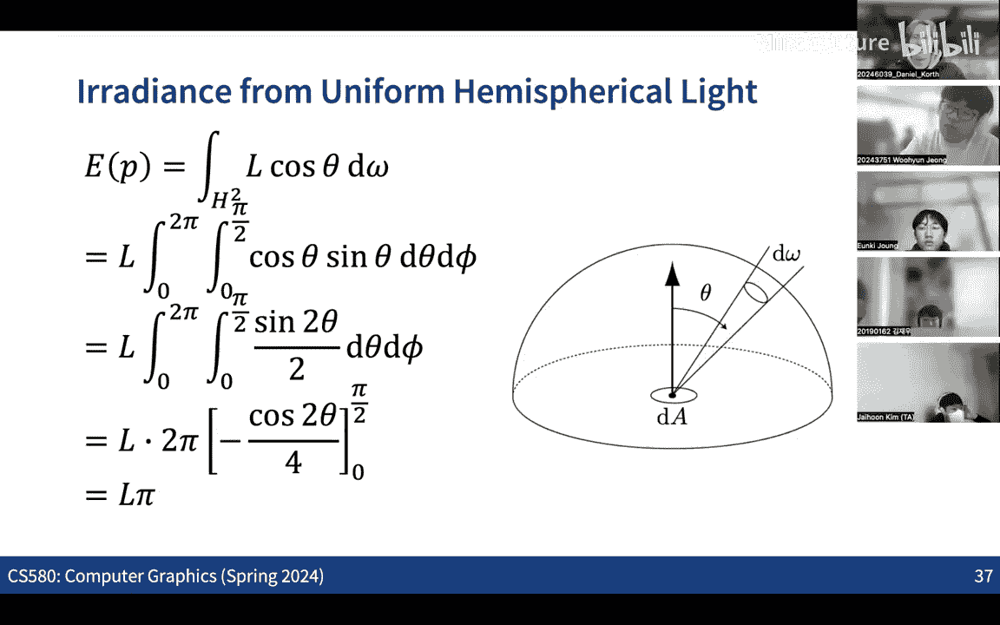

# 004：辐射度量学与光度学

在本节课中，我们将学习计算机图形学中用于描述和计算光照的核心物理概念：辐射度量学和光度学。理解这些术语和单位对于后续学习光照模型和渲染方程至关重要。

## 概述

上一节我们介绍了光线追踪的基本思想，它与光栅化不同，是从相机向场景发射光线并计算与物体的交点。为了高效计算这些交点，我们讨论了使用层次包围盒等加速结构。本节中，我们将深入探讨如何精确地描述和计算光线与物体交互时的光照能量，这是实现逼真渲染的基础。

## 辐射度量学基本量

辐射度量学是用于描述电磁辐射（包括可见光）功率的物理学分支。在计算机图形学中，我们主要关注以下四个基本量。

### 辐射通量

辐射通量，也称为功率，表示单位时间内通过某个区域或从光源发出的总能量。其单位是瓦特。

**公式**：`Φ = dQ / dt`，其中 `Q` 是能量，`t` 是时间。

### 辐射强度

辐射强度描述了光源在特定方向上的发光强弱。它定义为在单位立体角内发出的辐射通量。其单位是瓦特每球面度。

**公式**：`I = dΦ / dω`，其中 `ω` 是立体角。

### 立体角

立体角是二维角度在三维球面上的扩展。它衡量了一个锥体所覆盖的球面区域大小。单位立体角所对应的球面面积等于球半径的平方。

**公式**：对于一个球面区域面积 `A` 和球半径 `r`，其对应的立体角 `ω = A / r²`。整个球面的立体角为 `4π` 球面度。

### 辐照度

辐照度衡量的是单位表面积所接收到的入射辐射通量。它表示光线照射到表面某一点的“密度”。其单位是瓦特每平方米。

**公式**：`E = dΦ / dA`，其中 `A` 是面积。

### 兰伯特定律

当光线以倾斜角度照射表面时，表面接收到的辐照度会减小。具体来说，辐照度与光线方向和表面法线夹角的余弦值成正比。这就是兰伯特定律，也是季节变化的原因之一（阳光直射与斜射）。

**公式**：`E ∝ cosθ`

### 辐射率

辐射率是计算机图形学中最重要的量。它描述了在单位立体角、单位投影面积上的辐射通量。它同时包含了方向性和空间分布信息，是描述光线在空间中传播的基本量。其单位是瓦特每球面度每平方米。

**公式**：`L = d²Φ / (dω · dA · cosθ)`

这里 `cosθ` 项源于投影面积的计算，确保了无论观察方向如何，辐射率在真空中沿光线传播路径保持不变。

## 光度学基本量

光度学与辐射度量学类似，但度量的不是物理功率，而是人眼感知到的“亮度”。每个辐射度量学的量都有一个对应的光度学量。

以下是辐射度量学与光度学量的对应关系及单位：

| 辐射度量学量 | 单位 | 光度学量 | 单位 |
| :--- | :--- | :--- | :--- |
| 辐射通量 | 瓦特 | 光通量 | 流明 |
| 辐射强度 | 瓦特/球面度 | 发光强度 | 坎德拉 |
| 辐照度 | 瓦特/平方米 | 照度 | 勒克斯 |
| 辐射率 | 瓦特/(球面度·平方米) | 亮度 | 尼特 |

**注意**：对于特定光源，其辐射度量学功率和光度学亮度之间的转换比例取决于光源的发光效率。

## 从辐射率计算辐照度

在渲染中，我们经常需要将来自各个方向的入射辐射率积分，得到表面上某点的总辐照度。

考虑表面上一点，来自半球空间所有方向的入射光。该点的辐照度 `E` 可以通过对上半球所有立体角方向的入射辐射率 `L_i(ω)` 进行积分得到：

**公式**：`E = ∫_Ω L_i(ω) cosθ dω`

其中 `θ` 是入射方向与表面法线的夹角，`cosθ` 项源于兰伯特定律。

**一个简单例子**：如果来自所有方向的入射辐射率是恒定值 `L`，那么辐照度 `E = L * π`。

## 总结

本节课我们一起学习了辐射度量学和光度学的基本概念。我们明确了辐射通量、辐射强度、辐照度和辐射率这四个核心物理量的定义、单位和相互关系，特别是辐射率作为核心量的重要性。我们还了解了对应的光度学量，以及如何从入射辐射率积分得到辐照度。掌握这些术语和概念是理解后续光照模型、材质属性和渲染方程的基础。下一节，我们将开始探讨物体的材质属性，学习它们如何与光线相互作用，从而决定最终的表面颜色。