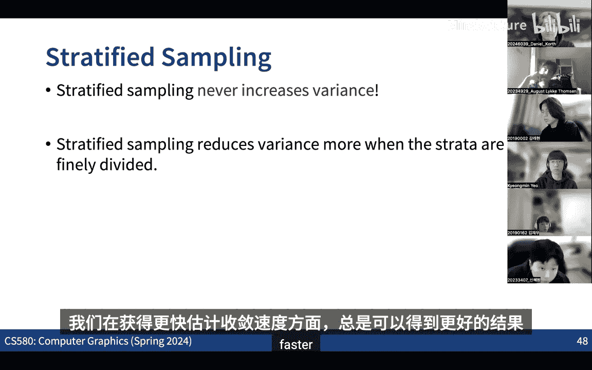

# 005：蒙特卡洛积分 1


## 概述 📖
在本节课中，我们将要学习蒙特卡洛积分方法。这是一种通过随机采样来近似计算复杂积分的数值方法，在计算机图形学中，尤其是在渲染方程的计算中至关重要。我们将从基础概念开始，逐步理解其原理、性质以及如何评估其效率。

---

## 从辐射度量学到渲染方程 🔄
上一节我们介绍了辐射度量学中的基本概念，如通量、辐射强度和辐射率。本节中我们来看看如何将这些概念整合到渲染方程中。

渲染的核心是计算场景中每个点的辐射率。当光线到达一个表面点时，它会根据该点的材质属性被反射到各个出射方向。这个反射过程由双向反射分布函数描述。

**BRDF** 是一个函数，它描述了从某个入射方向 `ω_i` 来的微分辐射亮度，有多少比例被反射到某个出射方向 `ω_o`。其数学形式为：
```
f_r(p, ω_i → ω_o) = dL_o(p, ω_o) / dE(p, ω_i)
```
其中 `dL_o` 是出射方向的微分辐射亮度，`dE` 是入射方向的微分辐照度。

基于此，我们可以写出在点 `p` 处、沿出射方向 `ω_o` 的辐射亮度 `L_o` 的渲染方程：
```
L_o(p, ω_o) = L_e(p, ω_o) + ∫_{Ω} f_r(p, ω_i → ω_o) L_i(p, ω_i) cosθ_i dω_i
```
这里：
*   `L_e` 是表面自身发出的辐射亮度。
*   积分项表示从所有入射方向 `ω_i` 收集并反射到 `ω_o` 的光线总和。
*   `cosθ_i` 是入射光线与表面法线夹角的余弦值。

这个积分通常没有解析解，因此我们需要数值方法来近似计算它。这就是蒙特卡洛积分发挥作用的地方。

---

## 蒙特卡洛积分基础 🎲
蒙特卡洛积分是一种通过随机采样来估计积分值的统计方法。其核心思想非常简单。

假设我们要计算一维函数 `f(x)` 在区间 `[a, b]` 上的积分 `I`：
```
I = ∫_{a}^{b} f(x) dx
```

以下是蒙特卡洛积分的基本步骤：

1.  在区间 `[a, b]` 上按照某种概率密度函数 `p(x)` 随机抽取 `N` 个独立同分布的样本 `X_i`。
2.  计算每个样本处的函数值 `f(X_i)`。
3.  用这些样本构造一个估计量 `F_N` 来近似积分 `I`：
    ```
    F_N = (1/N) * Σ_{i=1}^{N} (f(X_i) / p(X_i))
    ```

### 估计量的性质
这个估计量 `F_N` 具有一些重要性质：

*   **无偏性**：估计量的期望值等于真实的积分值，即 `E[F_N] = I`。这意味着平均来看，我们的估计是准确的。
*   **收敛性**：估计量的方差 `V[F_N]` 与采样数量 `N` 成反比，即 `V[F_N] ∝ 1/N`。这意味着随着采样数增加，估计误差会以 `1/√N` 的速度减小。

### 扩展到高维
蒙特卡洛方法的一个巨大优势是它可以轻松扩展到高维积分。无论积分维度多高，其基本形式保持不变，只需在高维定义域内采样即可。这避免了传统数值积分方法中因维度灾难导致的计算量爆炸式增长。

---

## 一个简单示例：估算面积 📐
让我们通过一个具体例子来理解蒙特卡洛积分。假设我们想计算二维空间中一个不规则区域 `Ω` 的面积。

我们可以这样做：
1.  找到区域 `Ω` 的轴对齐包围盒，其面积为 `A_box`。
2.  定义一个指示函数 `f(x, y)`，当点 `(x, y)` 在 `Ω` 内时值为1，否则为0。
3.  区域 `Ω` 的面积 `A` 就等于该指示函数在包围盒上的积分：`A = ∫_{box} f(x, y) dx dy`。
4.  应用蒙特卡洛积分。在包围盒内均匀采样 `N` 个点 `(X_i, Y_i)`（此时概率密度 `p(x, y) = 1/A_box`）。
5.  面积估计量为：
    ```
    A_est = (A_box / N) * Σ_{i=1}^{N} f(X_i, Y_i)
    ```
    这等价于：`A_est = A_box * (落在区域内的样本数 / 总样本数)`。

这个例子直观地展示了如何将几何问题转化为积分问题，并用随机采样来解决。

---

## 估计量的效率与方差 ⚡
我们不仅关心估计量是否正确（无偏），还关心它需要多少计算资源才能达到可接受的精度。这引出了对估计量“效率”的考量。

效率综合了估计量的方差和生成每个样本所需的计算时间。即使一个估计量方差更低，但如果它计算每个样本的速度慢很多，其整体效率可能反而不如一个方差稍高但计算更快的估计量。

形式化地说，考虑两个估计量 `F1` 和 `F2`。假设 `F2` 的方差是 `F1` 的一半，但计算每个样本的时间是 `F1` 的三倍。在相同的总计算时间内，`F1` 能采集的样本数是 `F2` 的三倍。由于方差与 `1/N` 成正比，`F1` 在相同时间内的有效方差可能比 `F2` 更低，因此 `F1` 的效率更高。

因此，在设计蒙特卡洛积分方案时，我们需要在**方差**和**采样成本**之间进行权衡。

---

## 无偏与有偏估计 ⚖️
之前我们讨论的是无偏估计量。但有时，使用**有偏估计量**可能更有利。

有偏估计量是指其期望值不等于真实积分值的估计量，即 `E[F_N] ≠ I`。一个经典的例子是对方差本身的估计。用样本方差 `S^2 = (1/N) Σ (X_i - μ)^2` 来估计总体方差 `σ^2` 是一个有偏估计，其期望为 `E[S^2] = (N-1)/N * σ^2`。无偏的估计量应为 `(1/(N-1)) Σ (X_i - μ)^2`。

有偏估计量并非没有用处。虽然它在期望上不准确，但随着样本数 `N` 增大，偏差通常会减小（称为渐近无偏）。关键在于，某些有偏估计量可能以引入微小偏差为代价，换来方差的大幅降低，从而更快地收敛到真实值附近，提高了计算效率。在实时渲染等对性能要求极高的场合，有偏但高效的估计量往往是更实用的选择。

---

## 提高效率：分层采样 🎯
如何改进基础蒙特卡洛积分的效率？**分层采样**是一种有效且保证不降低性能的技术。

其思想是将整个积分域划分为多个互不重叠的子区域（层）。然后，在每个子区域内独立地进行采样，而不是在整个域内完全随机采样。

以下是分层采样的优势：
*   **方差永不增加**：与在整个域内简单随机采样相比，分层采样永远不会增加估计量的方差。
*   **通常降低方差**：通过确保采样点能更均匀地覆盖整个积分域，避免了样本过度聚集在某些区域，从而通常能显著降低方差。
*   **实现简单**：在许多情况下，划分区域和分配样本都非常直观。

在渲染中，分层采样被广泛应用。例如，在像素内采样抗锯齿时，将每个像素划分为更小的网格并在每个网格单元内采样，比在像素内完全随机采样能获得更平滑、噪声更少的图像。

---

## 总结 🏁
本节课中我们一起学习了蒙特卡洛积分的基础知识。

1.  **动机**：渲染方程涉及复杂的高维积分，需要数值近似。蒙特卡洛积分提供了解决方案。
2.  **核心方法**：通过随机采样构造估计量来近似积分。其估计量具有无偏性和以 `1/√N` 速度收敛的特性。
3.  **关键概念**：我们讨论了估计量的**无偏性**与**有偏性**，以及衡量其性能的**方差**和**效率**。效率需要综合考虑方差和计算成本。
4.  **优化技术**：**分层采样**是一种通过划分积分域来系统性地降低方差、提高效率的重要技术。



蒙特卡洛积分是物理渲染的基石。在接下来的课程中，我们将深入探讨如何将这些方法具体应用到光线追踪流程中，以高效地求解渲染方程。