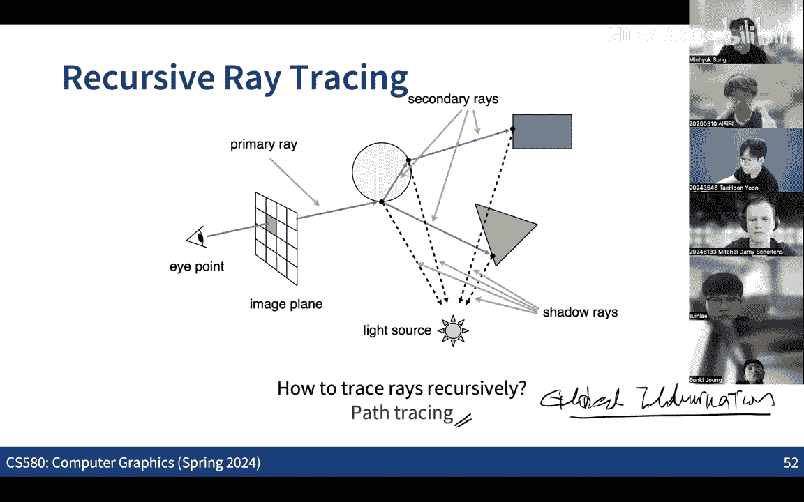

# 006：蒙特卡洛积分 2 与直接光照 1 🎲💡

在本节课中，我们将要学习蒙特卡洛积分方法的进一步应用，特别是如何通过重要性采样等技术来提高积分估计的效率。我们还将探讨如何将这些方法应用于计算机图形学中的直接光照计算。

---

## 概述

上一节我们介绍了蒙特卡洛方法的基本思想，它是一种通过随机采样来近似计算积分值的数值方法。本节中，我们来看看如何通过选择更优的概率密度函数（PDF）来减少估计器的方差，从而提高计算效率，即**重要性采样**。我们还将学习如何在不同的几何域（如圆盘、球体）上进行均匀采样，并最终将这些技术应用于渲染方程，实现直接光照的计算。

---

## 重要性采样

蒙特卡洛估计器的核心公式如下：

\[
F_N = \frac{1}{N} \sum_{i=1}^{N} \frac{f(X_i)}{p(X_i)}
\]

其中，\( f(X) \) 是被积函数，\( p(X) \) 是采样所用的概率密度函数。估计器的好坏很大程度上取决于我们如何选择 \( p(X) \)。

### 核心思想

如果我们可以选择一个概率密度函数 \( p(x) \)，使其形状与被积函数 \( f(x) \) 相似，那么估计值的方差就会显著降低。最理想的情况是令 \( p(x) \) 正比于 \( f(x) \)，即：

\[
p(x) = \frac{f(x)}{\int f(x) dx}
\]

此时，估计器中的每一项 \( f(X_i)/p(X_i) \) 都等于常数（积分值本身），方差为零。然而，这通常不现实，因为我们的目标正是计算这个未知的积分值。因此，重要性采样的目标是：**在无法精确知道 \( f(x) \) 的情况下，根据对其形状的粗略了解，设计一个近似其形状的 PDF，以降低方差**。

### 一个简单例子

假设被积函数 \( f(x) \) 在定义域内呈一个尖峰形状。如果使用均匀分布 PDF 进行采样，许多样本会落在函数值很小的区域，贡献很低，导致方差较大。

以下是几种不同的 PDF 选择及其对应的方差比较（数值仅为示例）：
*   **均匀分布 PDF**：方差约为 0.0365。
*   **一个近似 \( f(x) \) 形状的 PDF**：方差降低至约 0.0054（减少了约 6.7倍）。

这表明，选择一个好的 PDF 能极大地加速收敛。

---

## 基于 PDF 的采样方法

为了进行重要性采样，我们必须能够根据任意给定的 PDF 生成随机样本。一个通用方法是**逆变换采样**。

### 逆变换采样

1.  **计算累积分布函数（CDF）**：对于给定的 PDF \( p(x) \)，计算其 CDF \( P(x) = \int_{-\infty}^{x} p(t) dt \)。
2.  **生成均匀随机数**：生成一个在 [0, 1] 区间上均匀分布的随机数 \( \xi \)。
3.  **求逆**：计算 \( X = P^{-1}(\xi) \)，则 \( X \) 即为服从 PDF \( p(x) \) 分布的样本。

#### 示例：采样 \( p(x) = 3x^2 \)

假设我们要在 [0,1] 区间内根据 PDF \( p(x) = 3x^2 \) 进行采样。
1.  **计算 CDF**：\( P(x) = \int_{0}^{x} 3t^2 dt = x^3 \)。
2.  **求逆 CDF**：\( P^{-1}(u) = u^{1/3} \)。
3.  **采样**：生成均匀随机数 \( \xi \sim U[0,1] \)，则样本 \( x = \xi^{1/3} \)。

---

## 在特定几何域上的均匀采样

在图形学中，我们经常需要在圆盘、球面等区域进行均匀采样（例如，采样入射光线方向）。直接对参数进行均匀采样通常无法得到在面积或立体角上均匀的分布。

### 在单位圆盘内均匀采样 ❌→✅

**错误方法**：均匀采样半径 \( r \in [0,1] \) 和角度 \( \theta \in [0, 2\pi) \)，然后转换到笛卡尔坐标 \( (x, y) = (r\cos\theta, r\sin\theta) \)。这会导致样本点向圆心聚集，因为外圈环状区域的面积更大，但每个环被选中的概率却相同。

**正确方法**：我们需要 PDF 与微分面积元 \( dA = r dr d\theta \) 成正比。因此，关于 \( r \) 的 PDF 应设为 \( p(r) = 2r \)（线性），而 \( \theta \) 保持均匀分布。
1.  **\( r \) 的 CDF**：\( P(r) = r^2 \)。
2.  **逆采样**：\( r = \sqrt{\xi_1} \)，\( \theta = 2\pi \xi_2 \)。
3.  **坐标转换**：\( (x, y) = (\sqrt{\xi_1} \cos(2\pi \xi_2), \sqrt{\xi_1} \sin(2\pi \xi_2)) \)。

### 在单位球面上均匀采样 🌐

目标是均匀采样球面上的点，等价于均匀采样三维空间中的方向。使用球坐标 \( (\theta, \phi) \)，其中 \( \theta \) 是天顶角，\( \phi \) 是方位角。微分面积元为 \( dA = \sin\theta d\theta d\phi \)。
为了使采样均匀，PDF 应与 \( \sin\theta \) 成正比。可以推导出：
*   \( p(\theta) = \frac{\sin\theta}{2} \)
*   \( p(\phi) = \frac{1}{2\pi} \) (均匀)

通过逆变换采样，可以得到采样公式：
*   \( \theta = \cos^{-1}(1 - 2\xi_1) \) 或等价地 \( \theta = \cos^{-1}(2\xi_1 - 1) \)
*   \( \phi = 2\pi \xi_2 \)

进而转换为笛卡尔坐标：
\[
\begin{aligned}
z &= 1 - 2\xi_1 \\
x &= \cos(2\pi \xi_2) \cdot \sqrt{1 - z^2} \\
y &= \sin(2\pi \xi_2) \cdot \sqrt{1 - z^2}
\end{aligned}
\]

这种采样方法在光线追踪中对于采样半球方向至关重要。

---

## 应用于渲染方程与直接光照

现在，我们将蒙特卡洛积分应用于渲染方程。渲染方程描述了场景中一点的光线出射辐射率：

\[
L_o(p, \omega_o) = L_e(p, \omega_o) + \int_{\Omega} f_r(p, \omega_i, \omega_o) L_i(p, \omega_i) \cos\theta_i d\omega_i
\]

其中，积分项计算了来自所有入射方向 \( \omega_i \) 的贡献。

### 简单的蒙特卡洛估计

最直接的方法是**在半球 \( \Omega \) 上均匀采样立体角**。设 PDF 为常数 \( p(\omega_i) = 1 / (2\pi) \)（半球立体角为 \( 2\pi \)），则蒙特卡洛估计为：

\[
L_o(p, \omega_o) \approx \frac{2\pi}{N} \sum_{j=1}^{N} f_r(p, \omega_j, \omega_o) L_i(p, \omega_j) \cos\theta_j
\]

**问题**：如果光源在场景中只占很小一块立体角（例如一个小窗户），那么绝大多数随机采样的方向都不会击中光源，这些样本对最终积分的贡献为零，造成方差极大，收敛缓慢。

### 更高效的方法：对光源采样 💡

与其在半球上随机采样方向，不如**直接在光源表面上采样点**。这本质上是一种重要性采样，因为我们把样本集中在真正可能发出光线的区域。

将立体角微分 \( d\omega_i \) 转换为光源表面的面积微分 \( dA \)（通过几何关系 \( d\omega = \frac{\cos\theta_{light}}{||x' - x||^2} dA \)），渲染方程的积分可以重写为对光源面积 \( A \) 的积分：

\[
L_o(p, \omega_o) = \int_{A} f_r(p, \omega_i, \omega_o) L_i(p, \omega_i) \frac{\cos\theta_i \cos\theta_{light}}{||x' - x||^2} V(x, x') dA
\]

其中 \( V(x, x') \) 是两点间的可见性函数（遮挡测试）。

现在，如果我们**在光源表面均匀采样**，即 PDF \( p(x') = 1 / A_{light} \)，则蒙特卡洛估计器变为：

\[
L_o(p, \omega_o) \approx \frac{A_{light}}{N} \sum_{j=1}^{N} f_r(p, \omega_j, \omega_o) L_i(p, \omega_j) \frac{\cos\theta_i \cos\theta_{light}}{||x' - x||^2} V(x, x'_j)
\]

这种方法确保每个样本都直接来自于光源表面，从而显著提高了采样效率，降低了噪声。

---

## 总结

本节课中我们一起学习了：
1.  **重要性采样**的核心原理：通过设计与被积函数形状相似的 PDF 来降低蒙特卡洛估计器的方差。
2.  **逆变换采样**方法：一种根据任意 PDF 生成样本的通用技术。
3.  **在圆盘和球面上的均匀采样**：需要注意参数均匀并不等于面积均匀，并学习了正确的采样公式。
4.  **将蒙特卡洛积分应用于渲染方程**：分析了在半球上均匀采样方向的问题，并引入了更高效的**对光源直接采样**的方法来计算直接光照。

这些技术是构建现代光线追踪器的基础。下一节，我们将探讨如何将这些思想扩展到**全局光照**，处理光线在场景中的多次弹射。

---