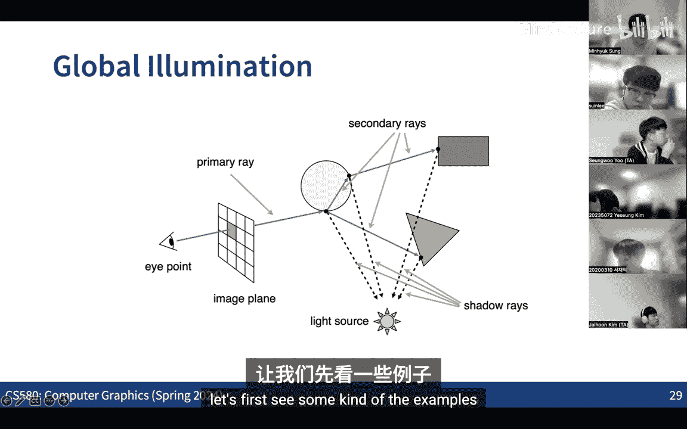
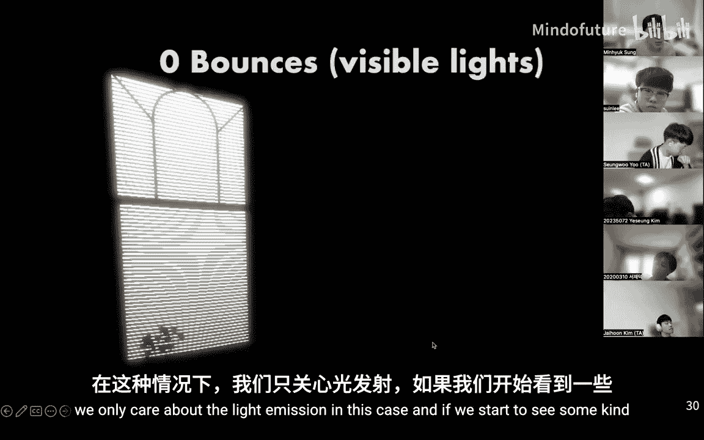

# 007：直接光照 2 与全局光照

在本节课中，我们将深入学习蒙特卡洛积分在直接光照计算中的应用，并探讨如何将其扩展到更复杂的全局光照场景。我们将重点讨论多重重要性采样技术，并介绍全局光照的基本概念和光传输方程。

## 直接光照回顾与多重重要性采样

上一节我们介绍了重要性采样的基本思想，即根据与被积函数形状相似的概率密度函数来采样，以获得更快的收敛速度。其核心是使用**逆变换采样**技术：通过计算概率密度函数的累积分布函数及其逆函数，将均匀分布的样本映射到目标分布。

在渲染方程中，我们计算的是积分。实践中，我们有两种主要采样策略：
*   **立体角采样**：在半球面上随机采样方向。
*   **光源面积采样**：在光源表面上随机采样点。

以下是两种策略的对比：
*   立体角采样可能产生大量未击中光源的光线，导致方差较高、收敛慢。
*   光源面积采样能确保每次采样都击中光源，通常收敛更快。

然而，渲染方程的被积函数可以看作是**双向反射分布函数**和**入射光亮度函数**的乘积。这两个函数通常相对简单，但它们的乘积可能很复杂。这就引出了一个问题：我们应该基于BRDF采样，还是基于光源采样？

考虑两种典型场景：
1.  **镜面反射表面 + 大面积光源**：此时，基于BRDF采样更有效，因为只有特定方向的光线对出射亮度贡献最大。
2.  **漫反射表面 + 小面积光源**：此时，基于光源采样更有效，因为随机方向的光线很难击中微小的光源。

显然，最佳策略取决于场景的具体配置。那么，是否存在一种统一的采样策略，能适应各种情况呢？

答案是**多重重要性采样**。其核心思想是结合多种不同的采样分布。我们定义一个新的估计器：

**公式**：
`F_mis = (1/N1) * Σ [ (f(X_i) * w_1(X_i)) / p_1(X_i) ] + (1/N2) * Σ [ (f(Y_j) * w_2(Y_j)) / p_2(Y_j) ]`

其中，权重函数 `w_k(x)` 需要满足对于任意样本 `x`，有 `Σ w_k(x) = 1`，且当 `p_k(x) = 0` 时 `w_k(x) = 0`。可以证明，该估计器也是无偏的。

一个常用且简单的权重函数选择是**平衡启发式**：

**公式**：
`w_k(x) = (N_k * p_k(x)) / Σ (N_i * p_i(x))`

当所有采样数 `N_i` 相同时，权重简化为 `w_k(x) = p_k(x) / Σ p_i(x)`，即根据各PDF在该样本点处的相对概率来分配权重。这相当于用所有PDF的加权平均定义了一个新的混合PDF。平衡启发式虽然不是理论最优，但其方差与可能的最优估计器方差之差存在一个上界，且随着采样数增加，这个差距会趋近于零，因此在实际中非常有效。

通过结合BRDF采样和光源采样，多重重要性采样能够生成质量更高的图像，既能准确捕捉高光细节，又能有效计算来自光源的直接照明。

## 全局光照简介

直接光照只考虑从相机出发，击中物体表面后直接射向光源的那条路径。而全局光照则模拟光线在场景中经过多次反射、折射后最终进入相机的复杂过程，这能产生更真实的光照效果，如颜色渗透和柔和的间接照明。

光传输方程是描述全局光照的数学框架。它本质上是渲染方程的递归形式，表达了场景中能量的平衡。在假设没有参与介质（即真空）的情况下，某点 `p` 沿方向 `ω` 的入射光亮度，等于从 `p` 点沿 `-ω` 方向发出的射线首次击中点 `p'` 的出射光亮度。这建立了光线在场景中弹射的递归关系。

**公式**（三点形式的光传输方程）：
`L(p' -> p) = L_e(p' -> p) + ∫_A f(p'' -> p' -> p) * L(p'' -> p') * G(p'' <-> p') * dA(p'')`

其中：
*   `L(p' -> p)` 是从点 `p'` 到点 `p` 的辐射亮度。
*   `L_e` 是自发光项。
*   `f` 是BRDF。
*   `G` 是几何项，包含可见性测试和距离衰减因子。

为了求解这个复杂的积分方程，我们将其展开为无限求和的形式，其中每一项代表一条特定长度的光路（例如，长度为1是自发光，长度为2是直接光照，长度为3及以上是间接光照）。**路径追踪**算法就是通过蒙特卡洛方法随机采样这些光路来求解该方程。

路径追踪的基本步骤是：
1.  从相机像素发射一条射线，找到与场景的第一个交点 `p1`。
2.  在 `p1` 处，随机选择下一个方向继续追踪射线，得到交点 `p2`。
3.  重复此过程，直到射线击中光源或达到最大弹射次数。
4.  沿着这条路径，将各点的BRDF、几何衰减和光源发光度相乘，得到该路径对像素亮度的贡献。
5.  对每个像素重复上述过程多次，并将结果平均，最终得到渲染图像。

本节课我们一起学习了多重重要性采样的原理及其在改善直接光照计算中的作用，并初步了解了全局光照的概念和光传输方程的基本形式。路径追踪作为求解全局光照的经典算法，其核心思想正是基于这些数学原理。要深入理解实现细节，强烈推荐阅读《Physically Based Rendering: From Theory to Implementation》一书。